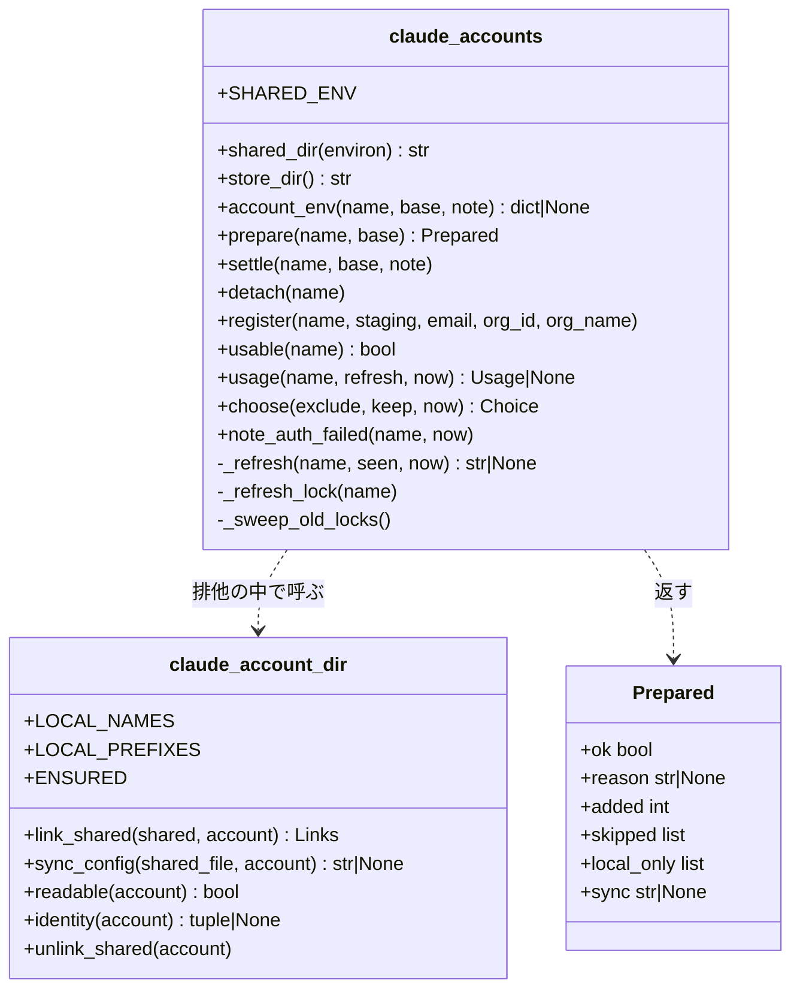
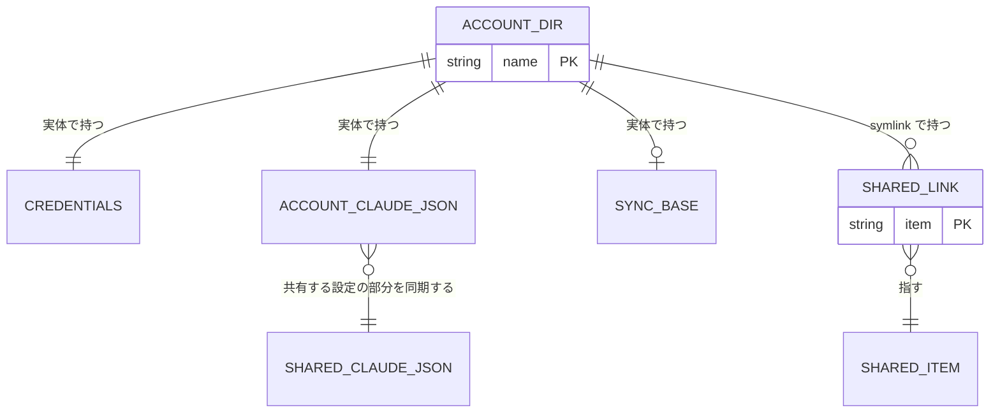
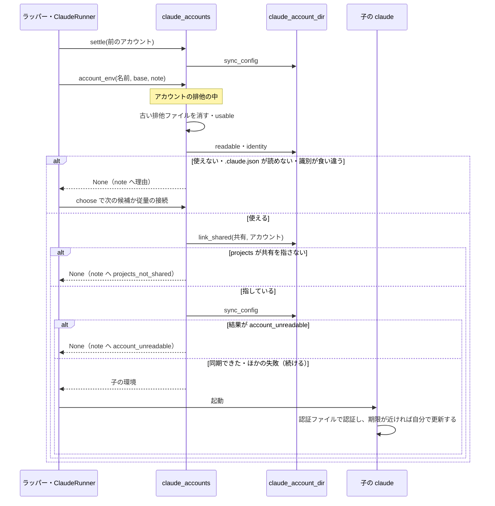
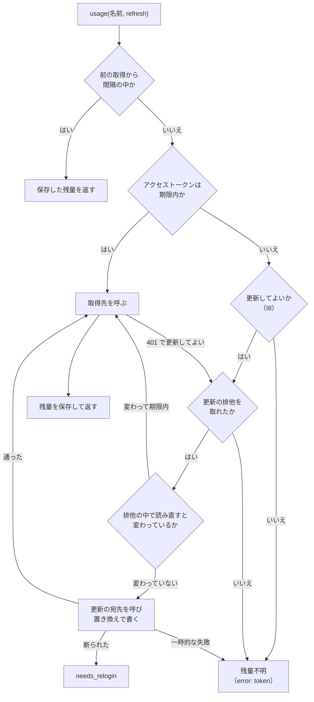
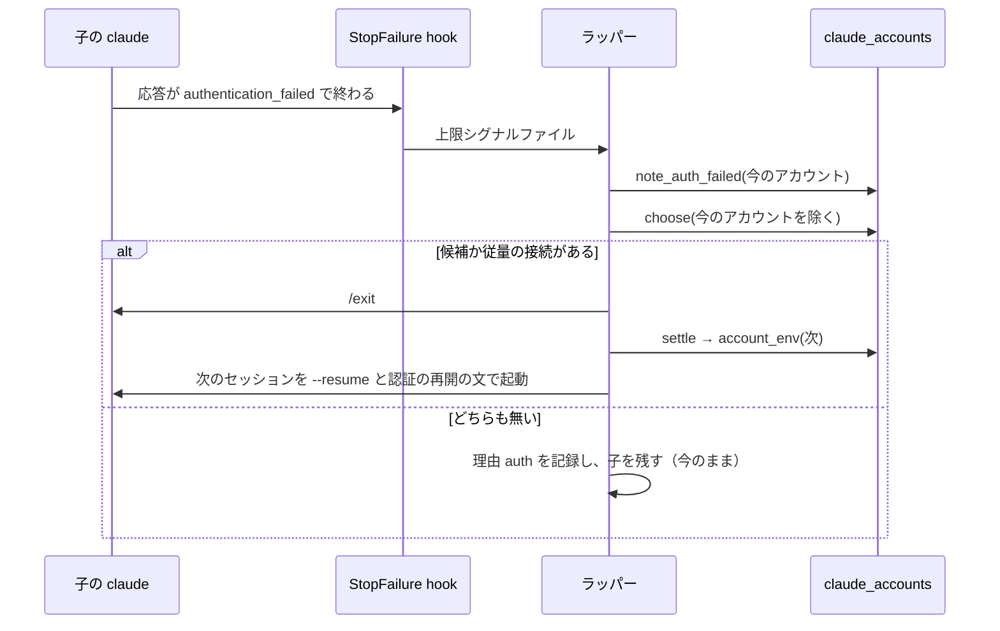
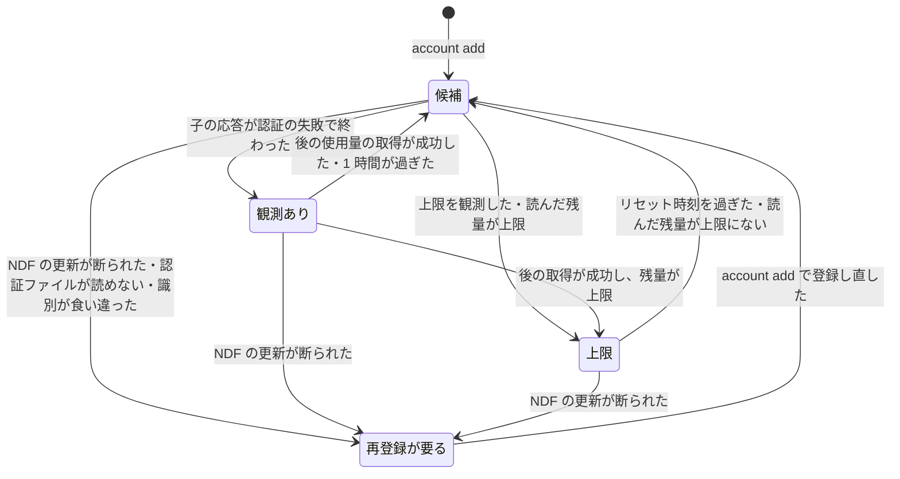

# #1576 の設計: 構造・データ構造・入出力の契約・処理の流れ・非機能

[issue-1576-design.md](issue-1576-design.md) の続きである。ドメインモデル・機能一覧・構成要素は先頭のファイルに、決定の記録・
設計の工程で確かめたこと（実測 A〜J）・テスト設計・未確認のまま残ることは
[issue-1576-design-decisions.md](issue-1576-design-decisions.md) にある。

## 構造

触る型と関数だけを載せる。モジュールの関数を 1 つのクラスとして描く。

`Account`（既存の型）には `auth_failed`（観測の時刻。無ければ None）と、観測が効いているかを返す操作を足す。

## データ構造

### 保存する形

1 つのアカウントの設定ディレクトリは、認証ファイルとアカウント側の `.claude.json` を 1 つずつ、同期の控えを 0 か 1 つ
（最初の同期の前は無い）、共有の項目への symlink を 0 個以上持つ。共有の項目 1 つを、複数のアカウントの symlink が指す。

### アカウント固有の項目

symlink にしない項目の一覧である。正本は `lib/claude_account_dir.py` の `LOCAL_PREFIXES`（前方一致 3 個）と
`LOCAL_NAMES`（完全一致 10 個）に置く。利用者の確定案の 9 個に、設計で 4 個（`.config.json`・`account.json`・
`usage.json`・`.ndf-shared-base.json`）を足した 13 個である。

| 項目 | 一致 | 書くもの | 固有にする理由 |
| --- | --- | --- | --- |
| `.credentials.json` | 前方一致 | claude・NDF の更新 | 認証情報。claude.ai のトークン（`claudeAiOauth`）と、`/mcp` で OAuth 認証した MCP サーバーのトークン（`mcpOAuth`。実測 J）を持つ。書き込みの一時ファイルを含む |
| `.claude.json` | 前方一致 | claude・NDF の同期 | `oauthAccount` とアカウントごとのキャッシュ。本体の排他（`.claude.json.lock`）と書き込みの一時ファイルを含む |
| `.oauth_refresh.lock` | 前方一致 | claude・NDF の更新 | 更新の排他と、その持ち主のファイル |
| `.config.json` | 完全一致 | claude | `.claude.json` の古い名前（本体はこのファイルがあれば先に読む。実測 B） |
| `backups` | 完全一致 | claude | `.claude.json` の退避 |
| `policy-limits.json` | 完全一致 | claude | 組織ごとの制限 |
| `policy-limits.json.stamp.json` | 完全一致 | claude | 同上 |
| `remote-settings.json` | 完全一致 | claude | 組織ごとの設定 |
| `mcp-needs-auth-cache.json` | 完全一致 | claude | コネクタの認証の控え |
| `.ndf-statusline-auth.json` | 完全一致 | NDF の statusline | `claude auth status` の控え |
| `account.json` | 完全一致 | NDF | 登録の記録 |
| `usage.json` | 完全一致 | NDF | 残量 |
| `.ndf-shared-base.json` | 完全一致 | NDF | 同期の控え |

**この一覧に無い項目は、共有側にあれば symlink にする。** NDF の hook のファイル（`.ndf-retention-checked`・
`.ndf-retention.lock`・`.ndf-statusline.lock`・`.ndf-statusline-backup.json`・`ndf-statusline.sh`）と `ndf` も
共有の側である（要求の未決 7 の答え。決定 4・14）。

**共有側に無ければ作る項目は 2 つである。** `projects`（空のディレクトリ）と `settings.json`（`{}`。0600）。
受け入れ条件 8 が名指しする 2 つで、無いまま起動すると claude がアカウント側に実体を作る。

**`/mcp` で OAuth 認証した MCP サーバーの認証は、アカウントごとに持つ。** トークンは認証ファイルの `mcpOAuth` に
あり（実測 J）、認証ファイルはアカウント固有の項目である。共有の `.credentials.json` の `mcpOAuth` は、NDF が読まず
写さない（I3）。共有側で済ませた認証はアカウントの子に届かず、利用者がアカウントごとに `/mcp` で認証する（決定 21）。
サーバーの定義（`mcpServers`）は同期で両側にそろうので、認証の済んでいないアカウントでは、そのサーバーが
認証待ちで並ぶ。

### 足す・変えるデータ

| 置き場 | 項目 | 型 | 空を許すか | 意味 |
| --- | --- | --- | --- | --- |
| `account.json` | `auth_failed` | object | 許す | `{"observed_at": <ISO 8601>}`。空（null・キーが無い）は「観測が無い」。古い版は読み捨てる |
| `.ndf-shared-base.json` | `version` | int | 許さない | 形の版（1） |
| 同 | `projects` | object | 許さない | 前の同期で両側へ書いた `projects`（プロジェクトのパス → 項目 → 値）。空の object は「項目が無い」 |
| 同 | `mcpServers` | object | 許さない | 前の同期で両側へ書いた `mcpServers`（名前 → 定義） |
| 同 | `userID` | string | 許す | 前の同期の時点のアカウント側の `.claude.json` の `userID`。空（null・キーが無い）は「その時点でアカウント側に `userID` が無かった」で、次の同期は控えを使わない（I18） |
| アカウントの置き場 | `.locks/<名前>.lock` | 空のファイル | — | NDF のアカウントごとの排他（filelock）。消さない |

既存の 3 ファイル（`.credentials.json`・`account.json`・`usage.json`）の形は変えない。

### 機能とデータの対応

C は作る、R は読む、U は更新する、D は消す。括弧は Claude Code 自身の操作である。

| 機能 | 認証ファイル | `account.json`・`usage.json` | symlink | アカウント側の `.claude.json` | 同期の控え | 共有の `.claude.json` | 共有の `settings.json` |
| --- | --- | --- | --- | --- | --- | --- | --- |
| F1 セッションを続ける | R（claude が U） | R・U | C・R | U（claude も U） | C・U | R・U | 無ければ C（claude と hook が U） |
| F2 アカウントを知る | （R） | — | — | （R） | — | — | — |
| F3 替えても同じに使う | R | R・U | C・R | U | U | R・U | （R・U） |
| F4 claude -p を動かす | R（claude が U） | R・U | C・R | U | U | R・U | — |
| F5 従量の接続 | — | R | — | — | — | — | （R） |
| F6 使えないアカウントを避ける | R | U | R | R | D（読めないとき） | — | — |
| F8 移行・登録の削除・登録し直し | D（削除のとき）・U（登録し直しのとき） | D（削除のとき）。登録し直しでは `account.json` を U、`usage.json` を D | C・D（削除のとき。登録し直しでは触れない） | D（削除のとき）・U（登録し直しのとき） | D（削除・登録し直しのとき） | — | — |

F7 と F9 はデータに触れない。F1・F3・F4 が同じ列を触るのは、3 つとも `prepare()` を通るためである。

### 時系列の扱い

同期の控えと認証の失敗の観測は、最新の 1 件を上書きで持つ（決定 18）。切り替えと用意の履歴は `log.jsonl` の
`account`・`account_dir` の行が持つ。

### 移行

| 対象 | 移し方 | 移せないとき |
| --- | --- | --- |
| 排他ファイル `accounts/<名前>.lock` | 用意のたびに、置き場の直下の `<名前>.lock` のうち「空の通常ファイルで、更新時刻が 60 秒より古い」ものを消す。登録の有無を問わない（登録の無い `nyle.lock` も消える） | 60 秒より新しいものは残す（古い版のラッパーが使っている。要求の前提 8）。次の用意でもう 1 度見る |
| symlink | 用意のたびに足りない分を足す。登録し直さない | 同じ名前の実体があれば飛ばす（I5）。`projects` なら起動しない（I6） |
| アカウント側の `.claude.json` | 最初の同期（同期の控えが無い）では、共有する設定の部分を共有側の値にそろえる | 共有側を読めなければ同期を飛ばし、起動は続ける |
| 古い版へ戻す | 既存の 3 ファイルの形を変えていないので、古い版は登録をそのまま読める。symlink と足したファイルは古い版が読まない | — |

### 検査の手段

`uv run --frozen --project . --all-extras pytest plugins/ndf/scripts/tests/test_claude_accounts.py plugins/ndf/scripts/tests/test_relay_account.py -q`
と、実物の置き場を `relay.py account list`・`ls -la ~/.claude/ndf/accounts/<名前>/` で見る。

## 入出力の契約

### 子の環境変数

| 起動の形 | `CLAUDE_CONFIG_DIR` | `NDF_CLAUDE_ACCOUNT` | `NDF_SHARED_CONFIG_DIR` | `CLAUDE_CODE_PLUGIN_CACHE_DIR` | トークン・スコープの変数 |
| --- | --- | --- | --- | --- | --- |
| 登録済みアカウント | そのアカウントの設定ディレクトリ（絶対パス） | 名前 | 元にあればそのまま。無ければ元の `CLAUDE_CONFIG_DIR` の値（無ければ空文字） | 元にあればそのまま。無ければ `<共有>/plugins` | 外す |
| 従量の接続 | `NDF_SHARED_CONFIG_DIR` があればその値へ戻す（空なら変数を外す）。無ければ触れない | `metered` | 外す | 値が `<共有>/plugins` のときだけ外す | 外す |
| 登録が 1 つ以下・ラッパーを通さない | 触れない | 触れない | 触れない | 触れない | 触れない |

認証の優先順位でトークンより上に来る 4 つの変数（`FOREIGN_AUTH_ENV`）と宣言のキーの扱いは、#1389・#1468 のまま変えない。

**互換性**: `CLAUDE_CODE_OAUTH_TOKEN` を読む利用者のスクリプトは、登録済みアカウントの子の中で値を得られなくなる。
`$CLAUDE_CONFIG_DIR` の下を読む hook とスクリプトは、symlink 越しに共有側を読む。

### `lib/claude_accounts.py` の関数

| 名前 | 入力 | 出力 | 失敗の形 | 互換性 |
| --- | --- | --- | --- | --- |
| `shared_dir(environ=None)` | 環境（無ければ今の環境） | 共有の設定ディレクトリのパス | 失敗しない | 新設 |
| `account_env(name, base, note=None)` | 名前（か `metered`）・元の環境・記録を受ける関数 | 子の環境 | 使えない・用意できないときは None（今と同じ）。理由は `note` へ渡す | `before`・`min_left` を削除。呼び出し元 2 つを直す |
| `prepare(name, base)` | 名前・元の環境 | `Prepared` | 例外を出さず `ok=False` と `reason` | 新設 |
| `settle(name, base=None, note=None)` | 名前 | なし | 例外を出さない。同期できなければ `note` へ渡す | 新設 |
| `detach(name)` | 名前 | なし | 排他を取れなければ `LockTimeout`（`unregister` と同じ） | 新設 |
| `register(name, staging, email, org_id="", org_name="")` | 名前・ログインの済んだ staging・識別 | なし | 排他を取れなければ `LockTimeout`（今と同じ） | 引数は変えない。同じ名前の置き場があるときの置き換え方だけを変える（「登録し直し」の節） |
| `usable(name)` | 名前 | 真偽 | 認証ファイルが無い・読めない・権限を直せないときは `needs_relogin` を真にして偽 | 新設（`token()` の確かめを置き換える） |
| `usage(name, refresh=True, now=None)` | 名前・更新してよいか | `Usage` か None | 今と同じ | `before` を `refresh` に変える |
| `choose(exclude=(), keep=(), now=None)` | 除く名前・動いている名前 | `Choice` | 今と同じ | `before`・`min_left` を削除 |
| `note_auth_failed(name, now=None)` | 名前 | なし | 排他を取れなければ何もしない（`note_limit` と同じ） | 新設 |

`Prepared.reason` と、`account_env()` が `note` へ渡す理由は次の 7 つである。

| `reason` | いつ | 画面の 1 行の理由の文 |
| --- | --- | --- |
| `needs_relogin` | 登録の記録が「再登録が要る」 | 再登録が要る |
| `no_credentials` | 認証ファイルが無い・読めない・権限を直せない | 認証ファイルが無いか読めない |
| `account_unreadable` | I19 | アカウント側の `.claude.json` が壊れている。退避から戻すか、ファイルを消す |
| `identity_mismatch` | I13 | 認証ファイルが別のアカウントのものになっている。`account add <名前>` で登録し直す |
| `projects_not_shared` | I6 | 会話の記録の置き場 `projects` が共有の設定ディレクトリを指していない |
| `lock_timeout` | アカウントの排他を 30 秒で取れない | アカウントの排他を取れない |
| `io_error` | symlink を作れないなどの `OSError` | 設定ディレクトリを用意できない |

`Prepared.sync`（同期の結果）は、同期できたら None、できなければ `shared_unreadable`・`account_unreadable`・
`lock_busy`・`write_failed` のどれかである。用意の同期が `account_unreadable` を返したら、`reason` を
`account_unreadable` にして起動しない（I19）。ほかの同期の失敗では起動を止めない。書き戻し（`settle`）は
起動を伴わないので、どの結果も `note` へ渡すだけである。

### 記録と画面

| 出力 | 形 | いつ |
| --- | --- | --- |
| `log.jsonl` の `account_dir` の行 | `section`（起動しようとしたセッション）・`account`・`ok`・`reason`・`added`（足した symlink の数）・`skipped`（同じ名前の実体があって飛ばした項目の名前）・`local_only`（共有側に無く、アカウント側にだけある実体の名前）・`sync` | 用意か書き戻しで、足した・飛ばした・アカウント側にだけある実体がある・使えない・同期できないのどれかがあったとき。何も無ければ書かない |
| 画面の 1 行 | `ndf-relay: アカウント <名前> を使わない（<理由の文>）` | `ok` が偽のとき |
| `supervise.py` の進捗ログ | `"kind": "account_dir"` と上と同じ項目（`section` の代わりに `step`） | 同上 |

どの行にも、トークン・`.claude.json` の値（同期の控えに控える `userID` を含む）・symlink の参照先のパスを書かない（I14）。

### 再開の文

未達の `/goal` があれば、理由に依らず今と同じく `/goal <条件>` を入れ直す。無ければ切り替えの理由で決まる。

| 切り替えの理由 | 最初の入力 |
| --- | --- |
| 上限の種類（`five_hour`・`seven_day`・`spend`・`unknown`） | 利用上限でアカウントを替えた。中断したところから続ける（今のまま） |
| `auth` | 認証が通らなかったためアカウントを替えた。中断したところから続ける |
| `threshold` | 使用率が切り替えの閾値を超えたためアカウントを替えた。中断したところから続ける |
| `recovered` | 上限が外れたためアカウントへ戻した。中断したところから続ける |
| そのほか | アカウントを替えた。中断したところから続ける |

### NDF の hook の書き先

`ensure-retention.sh` と `statusline-switch.sh` は、`$CLAUDE_CONFIG_DIR/settings.json` が symlink なら参照先のパスを
`SETTINGS` とし、そのディレクトリを排他・印・控えの置き場にする。symlink でなければ今と同じである。出力と終了コードは変えない。

## 処理の流れ

### セッションと呼び出しの起動

アカウント側の `.claude.json` が JSON として読めるかは、識別の照合の前に `readable` で確かめる（無いのは読めるに含む）。
`readable` は、読めなければ同期の控えを消して偽を返し、`prepare` は symlink も同期も行わずに `account_unreadable` で
返す（I19）。読めないファイルそのものには触れない。確かめの後に壊れて同期が `account_unreadable` を返したときも、
同じ理由で起動しない。読めないまま起動すると、対話では本体が `Configuration error` の 2 択の画面で止まってラッパーの
最初の入力がそこへ入り、claude -p は結果行を出さずに終了コード 1 で終わってファイルを初期化する（実測 I。決定 19）。

`settle` を呼ぶのはラッパーだけである（前のセッションがアカウントのとき、次のセッションを起動する前と、ラッパーの
終了時）。`supervise.py` は書き戻しを呼ばない。次の用意の同期が同じ働きをする（決定 8）。

`link_shared` は次の順に動く。

1. 共有側に `projects` と `settings.json` が無ければ作る
2. 共有の設定ディレクトリの直下の項目のうち、アカウント固有の項目でないものを順に見る。アカウント側に何も無ければ
   `<共有>/<項目>` への symlink を作る。正しい symlink があれば何もしない。参照先の違う symlink は付け替える。
   実体があれば飛ばして名前を返す（`skipped`）
3. アカウントの設定ディレクトリの直下の項目のうち、アカウント固有の項目でも symlink でもなく、共有側に同じ名前が
   無いものの名前を返す（`local_only`）。消さず、移さない（I5）。claude がそのアカウントのセッションで初めて作った
   項目（`plans`・`tasks`・`agents` など）がここに出る。手順 2 は共有側の直下だけを見るので、この手順が無いと、
   共有側に同じ名前ができるまで記録に出ない
4. アカウント側の `projects` の実パスが共有側の `projects` の実パスと同じかを返す

`prepare` は、`skipped` と `local_only` を `Prepared` に載せて返す。`local_only` の項目は、アカウントを替えた先の
セッションから見えない。起動は止めない（決定 5）。利用者は `account_dir` の行で名前を知り、共有したいものを共有の
設定ディレクトリへ移す（次の用意が symlink にする）。

### 登録し直し

`register()` は、同じ名前の置き場が既にあるとき（`needs_relogin` や識別の食い違いの後の `account add <名前>`）、
アカウントの排他の中で次の順に動く（決定 20）。置き場が無いとき（最初の登録）は、今のまま staging を置き場にする。

1. staging に `account.json` を書く（今のまま。`needs_relogin` は偽、`limit` と認証の失敗の観測は無い）
2. 置き場の `usage.json` と同期の控えを消す。前の認証で読んだ残量と、前の `.claude.json` との突き合わせの控えで
   あり、次の取得と次の用意（最初の同期）が作り直す
3. staging の `.credentials.json`・`.claude.json`・`account.json` を、この順に置き場へ置き換えで移す。staging に
   `.claude.json` が無ければ、置き場の `.claude.json` を消す（前の `oauthAccount` が残ると、次の用意が識別の
   食い違いで止まる。I13）。`account.json` を最後にするのは、途中で落ちたときに、前の `account.json` の
   `needs_relogin` が残るようにするためである
4. staging の残りを捨て、権限を直す（I15。今のまま）

置き場のほかの項目には触れない。共有の項目への symlink、claude がアカウント側に作った実体、`backups` などの
ほかのアカウント固有の項目は残る（I5）。置き換えた認証ファイルに前の `mcpOAuth` は無いので、登録し直した
アカウントでは、OAuth の MCP サーバーの認証がもう 1 度要る（決定 21）。

### 共有する設定の部分の同期

`sync_config` は、アカウント側の `.claude.json`（A）・共有の `.claude.json`（S）・同期の控え（B）の 3 つを突き合わせる。
S の場所は本体と同じ規則で決める（共有の設定ディレクトリに `.config.json` があればそれ、無ければ元の
`CLAUDE_CONFIG_DIR` の下の `.claude.json`、その変数も無ければ `~/.claude.json`。実測 B）。

1. A と S の本体の排他（`<パス>.lock` のディレクトリ）を、A・S の順に取る。2 秒待っても取れなければ `lock_busy` で
   何も書かずに終わる。10 秒より古い排他は、本体と同じく残骸として消してから取る
2. A・S・B を読む。S が JSON として読めなければ、何も書かずに終わる（`shared_unreadable`）。A が JSON として
   読めなければ、A と S には何も書かず、B を消して終わる（`account_unreadable`。I18）。B を残すと、利用者が
   `backups/` の退避から A を戻したとき、退避より後の同期で両側へ足した葉が「アカウント側だけで消えた」と読まれて
   共有側から消える（退避は同期より古いことがあり、戻した A の `userID` は B と同じになる）。B を消せば、次の同期は
   B が無い最初の同期になり、共有側の値にそろう。ファイルが無いのは空として扱う
3. `projects` はプロジェクトのパスと項目の 2 層、`mcpServers` は名前の 1 層で、葉ごとに次の表で値を決める。
   B が無い最初の同期では、B を A と同じとみなす（共有側の値にそろう）。次のどれかに当たるときも、B を使わず
   最初の同期と同じに扱う（I18）。A が失われたのか、利用者が消したのかを区別できないためで、共有側から消さない側へ倒す
   - A のファイルが無い（`projects` と `mcpServers` の両方で B を使わない）
   - A の `userID` が B の `userID` と同じでない。A か B のどちらかに `userID` が無い場合を含む（同上）。本体が A を
     初期化すると、`userID` は別の値になるか無くなる。動いているセッションがその A を取り込むと、`projects` は今の
     作業ディレクトリの 1 件だけになり、次の条件に当たらない（実測 I）。B に `userID` が無いのは、B を書いた時点で
     A に `userID` が無かったときで、初期化をまたいだかを決められないため、同じに扱う
   - B に葉があるキー（`projects`・`mcpServers`）が A で無いか空である（そのキーだけ B を使わない）

   | 共有側（S）は B から | アカウント側（A）は B から | 採る値 |
   | --- | --- | --- |
   | 変わった | 変わっていない | S |
   | 変わった | 変わった | S（共有側を正とする） |
   | 変わっていない | 変わった | A |
   | 変わっていない | 変わっていない | そのまま |

   「変わった」は、足した・値を変えた・消したのどれも含む。消した側を採れば、もう片側からも消す
4. `hasCompletedOnboarding` と `lastOnboardingVersion` は、A に無く S にあるときだけ A へ写す（決定 7）
5. 変わった側だけを書く。A は 0600 の一時ファイルからの置き換えで、S は実パスの隣の一時ファイルから実パスへの置き換えで
   書く（symlink と権限を保つ）。最後に B を、手順 2 で読んだ A の `userID` とともに書く（A に無ければ B にも持たない）。
   `userID` は B のほかへ書かず、S へ写さない（I10・I14）。途中で落ちても、次の同期が同じ結果に行き着く

### NDF の使用量の取得とトークンの更新

- 「期限内」は、残りが 60 秒を超えることである。#1389 の「期限の 1 時間前に更新する」はやめる（決定 10・11）
- 401 の後の更新は 1 回の取得につき 1 度だけである（今のまま）
- 更新の排他は `os.mkdir` で取り、待たず、横取りもしない。排他の中の宛先の待ちは 3 秒までにする
- 更新したトークンは、書く直前に読み直した認証ファイルへ `claudeAiOauth` だけを重ねて書き、ほかのキー（`mcpOAuth`）は
  変えない。アカウント側の認証ファイルは、利用者が `/mcp` で認証した MCP サーバーのトークンも持つ（決定 21）。
  今の `_refresh_and_store()` と同じ重ね方で、書き直しても保つ
- NDF のアカウントごとの排他（`accounts/.locks/<名前>.lock`）は、この全体を今と同じく包む

### 認証が通らなかったとき

1 つのセッションにつき 1 度だけ扱う（今のまま）。NDF は、動いている claude のアカウントを更新しない（I8）。

`supervise.py` の claude -p は hook を通らず、結果行で受ける。`call_claude()` は、結果が失敗で、結果行の `result` が
`Failed to authenticate` で始まるか `api_error_status` が 401 のとき、結果に `auth` の印を付ける（実測 H。401 の形は
未確認）。`ClaudeRunner.call()` は、登録が 2 つ以上で、登録済みアカウントで呼んでいたときだけ、次の順に扱う。
上限のときの `_switch_after_limit()` と同じ経路である。

1. `note_auth_failed(今のアカウント)` で観測を残し、この呼び出しで試したアカウントに足す
2. `choose(exclude=試したアカウント, keep=…)` で選ぶ。候補があれば理由 `auth` で替え、同じ呼び出しをやり直す
3. 候補が無く、従量の接続の宣言があれば、理由 `auth` で従量の接続へ移ってやり直す
4. どちらも無ければ、今の `child_env()` と同じに扱う。他のアカウントが上限なだけなら解除まで待ち、候補が 1 つも
   無ければ `AuthUnavailable` で止まる

観測のあるアカウントは候補から外れる（I12）ので、1 回の呼び出しで同じアカウントを 2 度試さない。登録が 1 つ以下の
とき、アカウントを持たないとき、従量の接続で呼んでいたときは、今と同じくステップの失敗として返す。

### 候補としてのアカウントの状態

「観測あり」は認証の失敗の観測が効いている状態である。上限と観測の両方があるときは、観測を先に見る。

図に現れない構成要素は、`shared_dir()` と `store_dir()`（図の「共有」と置き場のパスを求める）、`detach()`（登録の削除だけが呼ぶ）、
`relay_lib/version_dir.py` の lib の一覧、`supervise_lib/plan.py` の説明、`claude-settings.sh` と 2 本の hook（claude が
SessionStart で呼び、上の流れに入らない）、`resume_text()`（最後の図の「認証の再開の文」を決める表）、文書と用語集である。

## 非機能の実現方式

| 大項目 | 要求の条件 | 実現方式 | 確かめ方 |
| --- | --- | --- | --- |
| 可用性 | 登録済みアカウントのセッションは、アクセストークンの期限（8 時間）をまたいでも認証切れで終わらない。アカウントの設定ディレクトリの用意に失敗しても、ラッパーは止まらず次の候補か従量の接続へ移る | claude が認証ファイルのリフレッシュトークンで自分で更新する。NDF の排他を本体の排他のパスから外す（I7）。`prepare()` は例外を出さず、`account_env()` が None を返して今の「選び直す」経路へ入る | 受け入れ条件 3・4 の実物の確かめ。用意が失敗する偽の置き場で、次の候補の環境が返る |
| 性能・拡張性 | 起動の前の用意は、ネットワークへの要求と LLM の呼び出しを足さない。手元の環境（直下が約 30 項目、共有側の `.claude.json` が約 164 KB）で 1 秒以内に終わる | 用意はディレクトリの一覧・`lstat`・symlink と、JSON 3 つの読みと最大 3 つの書きだけである。使えるかの確かめ（`usable()`）は宛先を呼ばない | 偽の取得先の呼び出しの回数が、環境を 1 回組み立てる間に増えない。手元の大きさの偽の置き場で `prepare()` の秒数を測り、PR に残す |
| 運用・保守性 | `log.jsonl` のアカウントの名前は今のまま残す。用意で足せなかった項目と書き戻せなかった事実を `log.jsonl` に残す。トークンの値と `.claude.json` の中身は記録しない | `start`・`account` の行は変えない。`account_dir` の行を足す（項目の名前と理由の語だけ） | `account_dir` の行の項目を見る。記録にトークンと `.claude.json` の値が無い |
| 移行性 | 登録し直さない。既存の 3 ファイルの形を変えない。古い版のラッパーとの並走は前提 8 | 「移行」の表のとおり。用意が毎回足りない分だけを足す | 今の形の偽の置き場（3 ファイルと古い排他ファイル）で環境が組み立つ。2 回目は何も足さない |
| セキュリティ | トークンを環境変数・引数・記録・画面に出さない。共有の `.credentials.json` に触れない。アカウントの設定ディレクトリは 0700、認証ファイルと `.claude.json` は 0600。symlink の参照先は共有の設定ディレクトリの直下の項目だけ | 子へ渡すのはパスと名前だけにする（I1）。`.credentials.json` はアカウント固有の項目の先頭に置く（I3）。書くファイルは 0600 の一時ファイルから置き換え、用意の最後に権限を直す（I15）。symlink は `<共有>/<項目>` だけを作る（I4） | 子の環境にトークンの値が無い。共有側に番兵の `.credentials.json` を置いても symlink にならず、読まれない。権限と symlink の参照先を見る |
| システム環境 | 基準は Claude Code 2.1.286。動作環境は擬似端末と symlink が使える Linux と macOS | 本体の内部の形に新しく合わせる箇所を 4 つに限る（更新の排他の名前・`.claude.json` の排他と置き場・`.claude.json` の 6 つのキー・`CLAUDE_CODE_PLUGIN_CACHE_DIR`）。hook の実パスの解決は symlink のときだけ `readlink -f` を呼ぶ（登録は macOS でできないため、macOS では呼ばれない） | 受け入れ条件 1・3・4・8 の実物の確かめを、版が上がったときに打ち直す |
