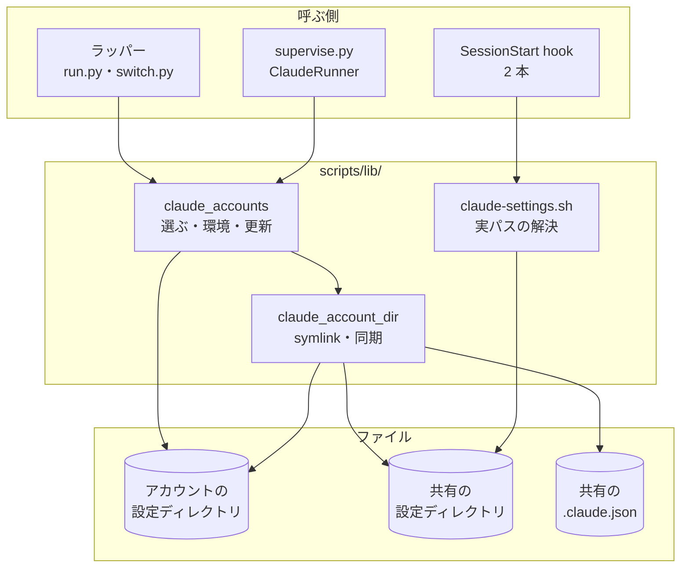
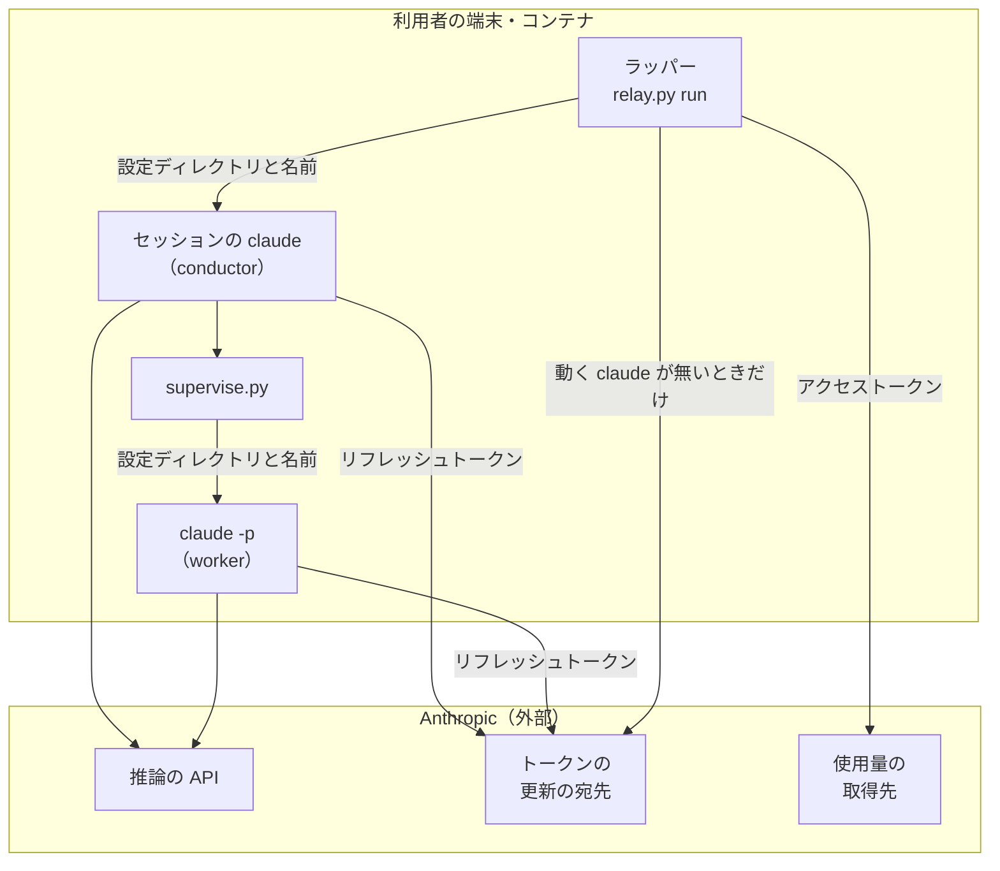

# #1576: アカウントの設定ディレクトリを子の `CLAUDE_CONFIG_DIR` にし、トークンの更新を claude 自身に任せる

要求と受け入れ条件は [#1576](https://github.com/devbasex/ai-plugins/issues/1576) の本文にある（コピーは
[issue-1576-requirements.md](issue-1576-requirements.md) ）。この文書は「どう作るか」だけを扱い、3 つのファイルに分けた。

| ファイル | 中身 |
| --- | --- |
| この文書 | 承認で見てほしいこと・例・ドメインモデル・機能一覧・構成要素 |
| [issue-1576-design-details.md](issue-1576-design-details.md) | 構造・データ構造・入出力の契約・処理の流れ・非機能の実現方式 |
| [issue-1576-design-decisions.md](issue-1576-design-decisions.md) | 設計の工程で確かめたこと（実測 A〜H）・決定の記録・テスト設計・未確認のまま残ること |

置き換える前の形は [issue-1389-design.md](issue-1389-design.md) と [issue-1523-design.md](issue-1523-design.md) にある。

## 承認で見てほしいこと

この変更は認証の渡し方を変えるため、設計の承認を MVV 判定に任せない（要求の前提 7）。人に見てほしい点は次の 5 つである。

| # | 何を | なぜ人が見るか | 詳しく |
| --- | --- | --- | --- |
| 1 | トークンを環境変数で渡すのをやめ、アカウントの設定ディレクトリを子の `CLAUDE_CONFIG_DIR` にする | 認証の渡し方の変更（共通原則の C2） | 決定 1 |
| 2 | NDF が `~/.claude/` の外にある共有の `~/.claude.json` へ書く。書くキーは `projects` と `mcpServers` だけで、Claude Code 本体と同じ排他を取る | 利用者のローカル環境への書き込み（C6） | 決定 6 |
| 3 | 利用者の確定案に無いものを 3 つ足した。子の環境の `NDF_SHARED_CONFIG_DIR` と `CLAUDE_CODE_PLUGIN_CACHE_DIR`、アカウント側の `.claude.json` へ写す `hasCompletedOnboarding`・`lastOnboardingVersion` | 利用者が決めた形への追加 | 決定 2・3・7 |
| 4 | 実物のアカウントを使う確かめは、この工程で行っていない。要求の未決 2（NDF が書いた認証ファイルを動いている claude が読み直す）は、本体のコードを読んだだけである | 秘密に触れる操作（C1）は人の承認が要る | [未確認のまま残ること](issue-1576-design-decisions.md) |
| 5 | 要求が設計へ任せた未決 2〜7 に答えた。動いている claude のアカウントを NDF は更新しない（未決 2）。`.claude.json` は同期の控えとの突き合わせで写す（未決 3）。`/login` で別のアカウントになった置き場は使わない（未決 4）。固有の項目のほかはすべて共有する（未決 5・7）。認証の失敗では再登録を求めず、1 時間だけ候補から外す（未決 6） | 利用者の環境で起きる振る舞いを決めた | 決定 10・6・15・4・5・13・14 |

## 例: `ohama-personal` のセッションが 8 時間を超える

2026-09-30 16:21（JST）の実例を、変更の後の動きで書く。登録は `nyle-personal`・`nyle-team`・`ohama-personal` の
3 つで、利用者のシェルに `CLAUDE_CONFIG_DIR` は無い（共有の設定ディレクトリは `~/.claude`）。

1. 利用者が `claude` と打つ。ラッパーは残りの量の最も大きい `ohama-personal` を選ぶ（選び方は #1389 のまま）
2. ラッパーは `ohama-personal` の設定ディレクトリを用意する。古い排他ファイル `accounts/ohama-personal.lock` を消し、
   足りない symlink を足し、共有の `~/.claude.json` の `projects` と `mcpServers` をアカウント側の `.claude.json` へ写す

   ```text
   ~/.claude/ndf/accounts/
   ├── .locks/ohama-personal.lock        NDF の排他（置き場の隣から移した）
   └── ohama-personal/                   子の CLAUDE_CONFIG_DIR
       ├── .credentials.json             実体。claude が自分で更新する
       ├── .claude.json                  実体。oauthAccount はこのアカウントのまま
       ├── .ndf-shared-base.json         実体。同期の控え
       ├── account.json  usage.json      実体。NDF が書く
       ├── projects -> ~/.claude/projects
       ├── settings.json -> ~/.claude/settings.json
       ├── plugins -> ~/.claude/plugins
       └── …（共有側にあり、アカウント固有の項目でないものすべて）
   ```

3. ラッパーは子の環境を次の形にして、セッション 1 を起動する

   | 変数 | 値 |
   | --- | --- |
   | `CLAUDE_CONFIG_DIR` | `/home/ubuntu/.claude/ndf/accounts/ohama-personal` |
   | `NDF_CLAUDE_ACCOUNT` | `ohama-personal` |
   | `NDF_SHARED_CONFIG_DIR` | 空文字（元の環境に `CLAUDE_CONFIG_DIR` が無かった） |
   | `CLAUDE_CODE_PLUGIN_CACHE_DIR` | `/home/ubuntu/.claude/plugins` |
   | `CLAUDE_CODE_OAUTH_TOKEN`・`CLAUDE_CODE_OAUTH_SCOPES` | 無い（元の環境にあっても外す） |

4. `/status` に `Login method: Claude Max account` と `Email: takemi.ohama@gmail.com` が出る。statusline も同じアカウントを示す
5. 8 時間が近づくと、claude が自分でトークンを更新する。設定ディレクトリの中の `.oauth_refresh.lock` を取り、
   `.credentials.json` を一時ファイルからの置き換えで書く。ラッパーは何もしない。ラッパーの定期の確認は、ファイルにある
   アクセストークンで使用率を読むだけで、このアカウントのトークンを更新しない
6. セッションの中で conductor が `supervise.py` を呼ぶ。`supervise.py` は `NDF_SHARED_CONFIG_DIR` から共有の設定
   ディレクトリ（`~/.claude`）を求め、claude -p の環境を同じ関数で組み立てる。別のアカウント `nyle-team` を選んだときも、
   `nyle-team` の symlink は `~/.claude/` の直下を指す（`ohama-personal` を経由しない）
7. 使用率が 90% を超え、次のカットポイントで `nyle-team` へ替える。ラッパーは `ohama-personal` の `.claude.json` で
   変わった分（セッションで受け入れたプロジェクトの信頼など）を共有の `~/.claude.json` へ書き戻し、`nyle-team` を用意して
   セッション 2 を起動する。会話の記録は共有の `~/.claude/projects/` にあるので、`ndf-next` の再開コマンドがそのまま通る
8. 別の端末で利用者が素の claude に `/login` を打つ。書き換わるのは共有の `~/.claude/.credentials.json` だけで、
   セッション 2 のアカウントは変わらない

## ドメインモデル

### コンテキスト

| コンテキスト | 何の語が 1 つの意味に決まるか |
| --- | --- |
| NDF のラッパー（`ndf-relay`） | 登録済みアカウント・アカウントの置き場・アカウントの設定ディレクトリ・共有の設定ディレクトリ・アカウント固有の項目・共有する設定の部分・同期の控え・更新の排他・認証の失敗の観測 |
| NDF の開発ワークフロー（`ndf-workflow`） | プラン・ステップ・worker の呼び出し |

**`ndf-relay` が供給者、`supervise.py`（`ndf-workflow`）が顧客である（顧客 / 供給者）。** #1389 の関係を変えない。
`supervise.py` はアカウントの置き場を読まず、`lib/claude_accounts.py` の `account_env()` が返す環境をそのまま使う。

**Claude Code 本体は外部の系で、NDF は本体の形に合わせる（順応者）。** 更新の排他の名前と形・`.claude.json` の
保存の排他・設定ファイルの置き場の決め方は本体が決め、NDF は変えられない。合わせる相手は Claude Code 2.1.286 の
実装である（要求の前提 1）。

### 集約

| 集約 | 持ち主（書き換えてよいもの） | 根 | エンティティ | 値オブジェクト |
| --- | --- | --- | --- | --- |
| 登録の記録（アカウントごと） | `lib/claude_accounts.py` | アカウント（名前） | — | 識別（メールアドレス・組織）・残量・上限の観測・認証の失敗の観測・枠の大きさの宣言・再登録が要る印 |
| アカウントの認証情報（アカウントごと） | 更新の排他（`.oauth_refresh.lock`）を取ったプロセス。そのアカウントで動く claude か、動く claude が無いときの `lib/claude_accounts.py` | 認証ファイル（`.credentials.json`） | — | アクセストークン・リフレッシュトークン・2 つの期限・スコープ |
| アカウントの設定ディレクトリの共有物（アカウントごと） | `lib/claude_account_dir.py`（`claude_accounts` がアカウントの排他の中で呼ぶ） | アカウントの設定ディレクトリ | 共有の項目への symlink | 共有する設定の部分・同期の控え |
| セッションのアカウント（ラッパーの 1 回の実行） | `relay_lib/run.py` の `Relay` | 今のセッションのアカウントの名前 | — | 切り替えの予定（理由） |
| プランのアカウント（`supervise.py` の 1 回の実行） | `supervise_lib/claude.py` の `ClaudeRunner` | 次の呼び出しのアカウントの名前 | — | 切り替えの理由 |

**認証情報の持ち主が claude へ移る。** #1389 では NDF だけがトークンを更新していた。この変更の後は、動いている claude が
自分のアカウントの認証ファイルを書き、NDF が書くのは、そのアカウントで動く claude が無く、本体と同じ排他を取れたときだけである。

**共有の設定ディレクトリと共有の `.claude.json` は NDF の集約ではない。** 持ち主は Claude Code である。NDF が共有側へ
書くのは 3 つだけである。共有の `.claude.json` の共有する設定の部分（本体の排他の中で）、無いときに作る `projects/` と
`settings.json`、そして NDF の hook が今も書いている `settings.json` の値と、その排他・印・控えである。

### 不変条件

番号はこの文書のもの。#1389 の不変条件は `#1389 I4` の形で指す。

| # | 集約 | 条件 | 破れたときの扱い |
| --- | --- | --- | --- |
| I1 | 登録の記録 | 登録済みアカウントの子の環境は、`CLAUDE_CONFIG_DIR` がそのアカウントの設定ディレクトリを指し、`NDF_CLAUDE_ACCOUNT` がその名前で、`CLAUDE_CODE_OAUTH_TOKEN` と `CLAUDE_CODE_OAUTH_SCOPES` を持たない（元の環境にあっても外す） | — |
| I2 | 登録の記録 | 従量の接続の子の環境は、トークンとスコープの変数を持たず、`CLAUDE_CONFIG_DIR` は元の環境の値へ戻る（元に無ければ変数が無い）。`NDF_SHARED_CONFIG_DIR` を残さない（#1389 I16 を足した変数へ広げる） | — |
| I3 | アカウントの認証情報 | NDF は共有の設定ディレクトリの `.credentials.json` を読まず、書かず、symlink にもしない（#1389 I4） | — |
| I4 | 共有物 | アカウントの設定ディレクトリの symlink の参照先は、共有の設定ディレクトリの直下の項目（`<共有>/<項目>`）だけである。別のアカウントの設定ディレクトリを経由しない。アカウントの置き場は、入れ子の起動でも共有の設定ディレクトリから求める | 参照先の違う symlink は付け替える |
| I5 | 共有物 | 用意は、共有の設定ディレクトリの項目とアカウントの設定ディレクトリの実体を消さず、移さず、上書きしない。登録の削除は symlink の先を消さない | 同じ名前の実体があれば飛ばし、項目の名前を記録する |
| I6 | 共有物 | アカウントの設定ディレクトリの `projects` が共有の `projects` と同じ実体を指さないアカウントで、claude を起動しない | 次の候補へ移り、理由を画面の 1 行と記録に残す |
| I7 | 登録の記録 | NDF は、アカウントの設定ディレクトリの実パスに `.lock` を付けたパス（`accounts/<名前>.lock`）を作らず、開かない。NDF のアカウントごとの排他は `accounts/.locks/<名前>.lock` で取る | — |
| I8 | アカウントの認証情報 | NDF は、claude が動いているアカウントのトークンを更新せず、その認証ファイルを書かない。「動いている」は、呼ぶ側が渡す名前（ラッパーの今のセッション・`supervise.py` の実行中の呼び出し）と、起動した環境の `NDF_CLAUDE_ACCOUNT` で決める | 使用量はファイルにあるトークンで読み、読めなければ残量不明にする |
| I9 | アカウントの認証情報 | NDF がトークンの更新の宛先を呼ぶのは、アクセストークンの期限が切れているか取得先が 401 を返し、更新の排他を取れ、排他の中で読み直した認証ファイルが変わっていないときだけである。書き込みは一時ファイルからの置き換えで行う | 排他を取れなければ宛先を呼ばず、その回の残量を読めなかったものとする |
| I10 | 共有物 | `.claude.json` の同期は、共有側では `projects` と `mcpServers` のほかのキーを変えない。アカウント側ではその 2 つと、無いときだけ写す 2 つの印のほかを変えない。`oauthAccount` を写さない。共有側が symlink なら symlink のまま残す | — |
| I11 | 共有物 | 同期は、前の同期から片側だけで変わった値をもう片側へ写し、両側で変わった値は共有側を採る。変わっていない側の値で、変わった側の値を上書きしない。アカウント側の値が失われた場合は I18 が先に効く | — |
| I12 | 登録の記録 | 認証の失敗の観測があるアカウントは、観測が解けるまで候補にしない。子の応答が認証の失敗で終わったことだけを理由に、`needs_relogin` を真にしない | — |
| I13 | 登録の記録 | アカウント側の `.claude.json` の `oauthAccount` の識別（メールアドレス・組織）が `account.json` と食い違うアカウントで、claude を起動しない | `needs_relogin` を真にし、次の候補へ移る |
| I14 | 登録の記録 | トークンの値と `.claude.json` の中身を、子の環境変数・引数・画面・`log.jsonl`・進捗ログに出さない（#1389 I1） | — |
| I15 | 共有物 | アカウントの置き場とアカウントの設定ディレクトリは 0700、その中の実体のファイル（認証ファイル・`.claude.json`・NDF の記録・同期の控え）は 0600 を保つ | 直せなければ `needs_relogin`（今のまま） |
| I16 | 共有物 | NDF の hook は、`settings.json` が symlink のとき参照先へ書き、symlink を実体に置き換えない。hook の排他・印・控えは参照先の隣に置く | — |
| I17 | 共有物 | 登録済みアカウントの子が導入・更新したプラグインの置き場の記録は、共有の設定ディレクトリの下のパスになる（アカウントの設定ディレクトリのパスを共有の記録に残さない） | — |
| I18 | 共有物 | 同期は、アカウント側の `.claude.json` が失われたことを理由に、共有側の `projects` と `mcpServers` から値を消さない。失われたとは、アカウント側の `.claude.json` が無いか、同期の控えに葉があるキー（`projects`・`mcpServers`）がアカウント側で無いか空になっていることである | そのキーは同期の控えを使わず、最初の同期として扱う（アカウント側を共有側の値にそろえ、控えを書き直す） |

### ドメインイベント

要求の番号を引き継ぐ。

| # | イベント | 発生元 | 受け手 |
| --- | --- | --- | --- |
| E1 | セッションか呼び出しのアカウントを選んだ | `claude_accounts.choose`（ラッパー・`supervise.py` が呼ぶ） | `account_env()` |
| E2 | 既存の登録を新しい形へ移した（古い排他ファイルを消した） | `claude_accounts.prepare` | — （次の E3 がそのまま続く） |
| E3 | アカウントの設定ディレクトリを用意した | `claude_accounts.prepare`（`claude_account_dir` を呼ぶ） | `account_env()`・記録（`account_dir` の行） |
| E4 | 子の環境を組み立てた | `account_env()` | ラッパー（`section_env`）・`ClaudeRunner` |
| E5 | 子の claude が起動し、アカウントの設定ディレクトリの認証ファイルで認証した | Claude Code | Claude Code（E6・E7）・利用者（`/status`） |
| E6 | 子の claude がトークンを更新した | Claude Code | 認証ファイル（次に読む NDF の使用量の取得） |
| E7 | 子の claude が共有するものへ書いた | Claude Code・NDF の hook | 共有の設定ディレクトリ（次のアカウントのセッション） |
| E8 | NDF が、動いている claude の無いアカウントのトークンを更新した | `claude_accounts` の使用量の取得 | 認証ファイル（次にそのアカウントで起動する claude） |
| E9 | 認証が通らず、子の claude の応答が終わった | Claude Code（ラッパーの子は `StopFailure` hook が上限シグナルファイルを書く。`supervise.py` の claude -p は結果行で返す） | ラッパー（認証の失敗の観測を残し、E10 へ）・`ClaudeRunner`（認証の失敗の観測を残し、そのアカウントを除いて E1 で選び直し、同じ呼び出しをやり直す。上限のときと同じ経路） |
| E10 | アカウントを替え、次のセッションを `--resume` で起動した | `Relay` | E1〜E5（新しいアカウントで）・E11・E12 |
| E11 | 切り替えの理由に合う再開の文を入力した | `relay_lib/switch.py` | 次のセッションの claude |
| E12 | セッションが終わり、共有する設定の部分の変わった分を共有側へ書き戻した | `claude_accounts.settle`（`Relay` が呼ぶ） | 共有の `.claude.json`（次に用意するアカウント・素の claude） |
| E13 | 従量の接続へ移った | ラッパー・`ClaudeRunner` | `account_env(METERED, …)` |
| E14 | 利用者が手で `/login` を打った | 利用者 | 共有の設定ディレクトリで打てば共有の認証だけ。アカウントの claude の中で打てば次の用意の識別の照合（I13） |
| E15 | アカウントの登録を外した | `relay.py account remove` | `claude_accounts.detach` → `claude auth logout` → `unregister` |

### 用語

| 用語 | 意味 | 用語集への反映 |
| --- | --- | --- |
| アカウント固有の項目 | アカウントの設定ディレクトリに実体で持ち、共有の設定ディレクトリへの symlink にしない項目（認証ファイル・`.claude.json`・更新の排他・NDF の記録など） | 追加（`ndf-relay`） |
| 共有する設定の部分 | `.claude.json` のうち、共有の設定ディレクトリの側を正とする `projects` と `mcpServers` | 追加（`ndf-relay`） |
| 同期の控え | 前の同期で両側へ書いた共有する設定の部分の写し（アカウントの設定ディレクトリの `.ndf-shared-base.json`） | 追加（`ndf-relay`） |
| 更新の排他 | Claude Code がトークンを更新するときに設定ディレクトリの中に作る排他（`.oauth_refresh.lock` のディレクトリ） | 追加（`ndf-relay`） |
| 認証の失敗の観測 | 子の claude の応答が認証の失敗で終わったことの記録（`account.json` の `auth_failed`）。後の使用量の取得が成功するか 1 時間で解ける | 追加（`ndf-relay`） |
| アカウントのスコープ | 登録済みアカウントのトークンに付いた権限の並び。認証ファイルの `claudeAiOauth.scopes` で、claude が認証ファイルから自分で読む（環境変数では渡さない） | 意味の変更（`ndf-relay`） |
| アカウントの置き場 | 登録済みアカウントごとの設定ディレクトリを並べた `<共有の設定ディレクトリ>/ndf/accounts/`。NDF の側で書くのは `lib/claude_accounts.py` とその部品だけで、認証ファイルと `.claude.json` は claude 自身も書く | 意味の変更（`ndf-relay`） |

「アカウントの設定ディレクトリ」と「共有の設定ディレクトリ」は、要求の工程で用語集へ足した意味のまま使う。

## 機能一覧

| # | 機能 | 誰が使うか |
| --- | --- | --- |
| F1 | 登録済みアカウントのセッションを、アクセストークンの期限（8 時間）をまたいで続ける | ラッパーの下で作業する利用者・conductor |
| F2 | `/status`・statusline・`claude auth status` で、接続しているアカウントを知る | 利用者・conductor |
| F3 | アカウントを替えても、会話の `--resume`・設定・プラグイン・プロジェクトの信頼・claude.ai のコネクタを同じに使う | 利用者・conductor |
| F4 | `supervise.py` が起動する claude -p を、同じ形の環境で動かす | supervisor・worker |
| F5 | すべて上限のときに従量の接続へ移り、上限が外れたら戻る（変数と設定ディレクトリを混ぜない） | 利用者・conductor |
| F6 | 使えないアカウント（認証が通らない・識別が食い違う・会話の記録が共有されない）を避けて続け、理由を画面と記録で知る | 利用者 |
| F7 | 切り替えの理由に合う再開の文で、中断したところから続ける | conductor |
| F8 | 登録し直さずに新しい形へ移る。登録を外しても共有の設定が残る | 利用者 |
| F9 | 文書と説明で、子へ何を渡すかを知る | 利用者・NDF の開発者 |

## 構成要素

| 要素 | 変更 | 責務 |
| --- | --- | --- |
| `lib/claude_account_dir.py` | 新設 | アカウントの設定ディレクトリの共有物を作る。共有の項目への symlink（`link_shared`）、共有する設定の部分の同期（`sync_config`）、識別の読み取り（`identity`）、symlink の取り外し（`unlink_shared`）。アカウント固有の項目の一覧の正本を持つ。置き場の決め方と排他は知らず、渡されたパスだけを扱う |
| `lib/claude_accounts.py` の `shared_dir()`・`SHARED_ENV`・`store_dir()` | 追加・変更 | 共有の設定ディレクトリを求める。`NDF_SHARED_CONFIG_DIR` があればその値（空なら `~/.claude`）、無ければ `CLAUDE_CONFIG_DIR`（無ければ `~/.claude`）。`store_dir()` はここから求める（I4） |
| 同 `_locked()`・`_sweep_old_locks()` | 変更・追加 | 排他のパスを `accounts/.locks/<名前>` に変える（I7）。置き場の直下の古い排他ファイルを消す（E2） |
| 同 `prepare()`・`settle()`・`detach()` | 追加 | アカウントの排他の中で、用意（古い排他ファイルの掃除 → 使えるかの確かめ → 識別の照合 → symlink → 同期）と、書き戻し（同期だけ）と、symlink の取り外しを行う。失敗は例外にせず結果で返す |
| 同 `account_env()`・`_account_env()`・`_metered_env()` | 変更 | 用意が通ったら I1 の環境を、従量の接続なら I2 の環境を組み立てる。記録すべきことを `note` へ渡す |
| 同 `usable()` | 追加 | 候補として起動できるかを、ネットワークを使わずに確かめる（登録の記録・権限・認証ファイルにリフレッシュトークンか期限内のアクセストークンがある） |
| 同 `usage()`・`_fetch()`・`_refresh()`・`_refresh_lock()` | 変更・追加 | 使用量の取得と、I8・I9 を満たす更新。更新の排他を取り、排他の中で読み直す |
| 同 `choose()`・`_account_pool()`・`rows()` | 変更 | `before` と `min_left` の引数をなくす。認証の失敗の観測があるアカウントを候補から外す（I12） |
| 同 `Account.auth_failed`・`note_auth_failed()` | 追加 | 認証の失敗の観測を読む・残す |
| 同 `token()`・`_grant()`・`Grant`・`_scopes_held()`・`_token_held()`・`REFRESH_BEFORE` | 削除 | 子へ渡すトークンとスコープを読む部品。渡さなくなるため要らない |
| `lib/claude_usage.py` の `refresh_oauth()` | 変更 | 宛先の待ちの上限（秒）を引数で受ける |
| `relay_lib/claude.py` の `section_env()`・`resume_input()` | 変更 | `note` を `account_env()` へ渡す。再開の文を引数で受ける（`RESUME_TEXT` を削除） |
| `relay_lib/switch.py` の `resume_text()`・`limit_start()` | 追加・変更 | 切り替えの理由から再開の文を決める表を持つ |
| 同 `_tick_limit()`・`_note_observed()`・`_pick_after_limit()`・`UsageWatch.check()` | 変更 | 認証の失敗では NDF が更新せず、観測を残して今のアカウントを除いて選ぶ。定期の確認は新しい引数で呼ぶ |
| `relay_lib/run.py` の `Relay.start_section()`・`close()`・`note_account_dir()` | 変更・追加 | 前のセッションのアカウントを書き戻してから次を用意する。終了時も書き戻す。`note` を `log.jsonl` の行と画面の 1 行にする |
| `relay_lib/accounts.py` の `_remove()` | 変更 | `claude auth logout` の前に symlink を外す（I5） |
| `relay_lib/version_dir.py` の lib の一覧 | 変更 | バージョンディレクトリへ写す lib に `lib/claude_account_dir.py` を足す |
| `supervise_lib/claude.py` の `ClaudeRunner.child_env()`・`keep()` | 変更 | 新しい引数で呼ぶ。`note` を進捗ログの行にする。実行中の呼び出しのアカウントも `keep` に入れる |
| 同 `call_claude()`・`ClaudeRunner.call()` | 変更 | claude -p の結果が認証の失敗なら（実測 H）、結果に `auth` の印を付ける。登録済みアカウントで呼んでいたら、`note_auth_failed` で観測を残し、そのアカウントを除いて `choose` し、同じ呼び出しをやり直す（E9・I12）。候補が無ければ従量の接続へ移り、それも無ければ今の `child_env()` と同じく、他のアカウントが上限なだけなら解除まで待ち、候補が 1 つも無ければ `AuthUnavailable` で止まる |
| `scripts/lib/claude-settings.sh` | 新設 | `settings.json` の実パスを返すシェルの関数（symlink なら参照先） |
| `scripts/ensure-retention.sh`・`scripts/statusline-switch.sh` | 変更 | 上の関数で求めた実パスへ書き、排他・印・控えを実パスの隣に置く（I16） |
| 文書と説明 | 変更 | `references/relay.md` の認証の渡し方、`supervise_lib/plan.py` の説明、`lib/claude_accounts.py` の冒頭、用語集、[issue-1389-design-decisions.md](issue-1389-design-decisions.md) の決定 1 と [issue-1523-design.md](issue-1523-design.md) の決定 1 への追記（置き換えたことと、この文書の決定 1 への参照） |

変えないもの: アカウントの選び方の順（`_try_order`）、上限の検知、`relay_lib/login.py` の登録の手順、`statusline.sh`、
`relay_lib/common.py` の `config_dir()`、`claude_accounts.unregister()` と `register()`（`shutil.rmtree` は symlink を
辿らない。実測 F）。

### `CLAUDE_CONFIG_DIR` が共有の設定ディレクトリを指す前提の規則

子の環境の `CLAUDE_CONFIG_DIR` の値が変わるため、この変数から場所を導く規則と、「NDF が子へトークンを渡す」ことを
前提にした規則を集めた。配布物を `CLAUDE_CONFIG_DIR`・`TOKEN_ENV`・`REFRESH_BEFORE`・`min_left` で検索し、
`account_env()` から子の起動までの経路を読んだ。

| 規則の場所 | 規則 | 新しい形に当てはまるか |
| --- | --- | --- |
| `claude_accounts.store_dir()` | アカウントの置き場は `$CLAUDE_CONFIG_DIR/ndf/accounts` | **当てはまらない**（入れ子の起動で別のアカウントを経由する）。構成要素の表へ載せた |
| `claude_accounts._metered_env()` | 従量の接続の環境で `CLAUDE_CONFIG_DIR` に触れない | **当てはまらない**（アカウントのセッションの中から移ると残る）。構成要素の表へ載せた |
| `ensure-retention.sh`・`statusline-switch.sh` | `$CLAUDE_CONFIG_DIR/settings.json` を `mv` で置き換え、排他・印・控えを同じディレクトリに置く | **当てはまらない**（symlink が実体に置き換わる）。構成要素の表へ載せた |
| Claude Code のプラグインの導入の記録 | 置き場を `$CLAUDE_CONFIG_DIR/plugins/…` の絶対パスで記録する | **当てはまらない**（実測 D）。子の環境の `CLAUDE_CODE_PLUGIN_CACHE_DIR` で直す（決定 3） |
| `choose()`・`account_env()` の `before`・`min_left` | 子へ渡すトークンが呼び出しの間もつように、先に更新する | **当てはまらない**（claude が自分で更新する）。削除する（決定 11） |
| `relay_lib/switch.py` の認証の失敗の扱い | NDF がトークンを更新してから、同じアカウントを含めて選び直す | **当てはまらない**（I8）。構成要素の表へ載せた |
| `ClaudeRunner.child_env()` の認証の扱い | 起動の前に NDF がトークンを更新し、得られなければ理由 `auth` で別のアカウントへ替える | **当てはまらない**（起動の前に更新しない。決定 11）。断られたリフレッシュトークンは claude -p の結果で初めて分かるため、結果で受ける。構成要素の表へ載せた |
| #1523 の I5 とそのテスト | 子の `CLAUDE_CONFIG_DIR` を変えない | **当てはまらない**。決定 1 で置き換え、テストを書き直す |
| `relay_lib/common.py` の `config_dir()` | 複製とバージョンディレクトリの親は `$CLAUDE_CONFIG_DIR/ndf` | 当てはまる（`ndf` の symlink 越しに同じ実体） |
| `lib/transcript_agents.py`・`scripts/experimental/resume.py` | 会話の記録は `$CLAUDE_CONFIG_DIR/projects` | 当てはまる（`projects` の symlink 越し。I6 が保証する） |
| `hooks/claude.json` の SessionStart | ランチャーは `$CLAUDE_CONFIG_DIR/ndf/relay.py` | 当てはまる（同上） |
| `statusline.sh` | `claude auth status` の控えを `$CLAUDE_CONFIG_DIR` に置く | 当てはまる（アカウント固有の項目になり、アカウントごとに分かれる） |
| `relay_lib/login.py` の登録の環境 | `CLAUDE_CONFIG_DIR` を専用のディレクトリで上書きする | 当てはまる |
| `ClaudeRunner.section` | 起動した環境の `NDF_CLAUDE_ACCOUNT` が動いているセッションのアカウント | 当てはまる |

### 構成要素図



### システム構成図（文脈と配置）



どこで動くかは変えない。プロセスの境界をまたいで流れるものからトークンが消え、設定ディレクトリのパスとアカウントの
名前だけになる。トークンの更新の宛先を呼ぶ主体は、NDF から claude へ移る。claude.ai のコネクタは、claude が認証ファイルの
スコープを自分で読んで取りに行く（#1523 の辺はそのまま効く）。

### パッケージ・モジュール構成

```text
plugins/ndf/
├── scripts/
│   ├── lib/claude_account_dir.py     # 新設: symlink・.claude.json の同期・識別
│   ├── lib/claude-settings.sh        # 新設: settings.json の実パス
│   ├── lib/claude_accounts.py        # 変更: 置き場・排他・用意・環境・更新・観測
│   ├── lib/claude_usage.py           # 変更: 更新の宛先の待ちの上限
│   ├── relay_lib/claude.py           # 変更: section_env・resume_input
│   ├── relay_lib/switch.py           # 変更: 再開の文の表・認証の失敗の扱い
│   ├── relay_lib/run.py              # 変更: 書き戻しと記録
│   ├── relay_lib/accounts.py         # 変更: 登録の削除の順
│   ├── relay_lib/version_dir.py      # 変更: lib の一覧
│   ├── supervise_lib/claude.py       # 変更: child_env・keep・認証の失敗の扱い
│   ├── supervise_lib/plan.py         # 変更: 説明
│   ├── ensure-retention.sh           # 変更: 実パスへ書く
│   ├── statusline-switch.sh          # 変更: 実パスへ書く
│   └── tests/                        # 変更: test_claude_accounts.py・test_relay_account.py・test_ensure_retention.py ほか
└── skills/development-workflow/references/relay.md   # 変更: 認証の渡し方
docs/glossary/glossary.json, docs/glossary.md          # 変更: 用語
issues/issue-1389-design-decisions.md, issues/issue-1523-design.md   # 変更: 決定 1 への追記
```
