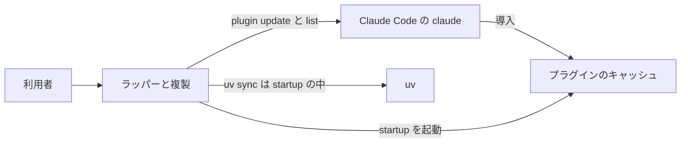
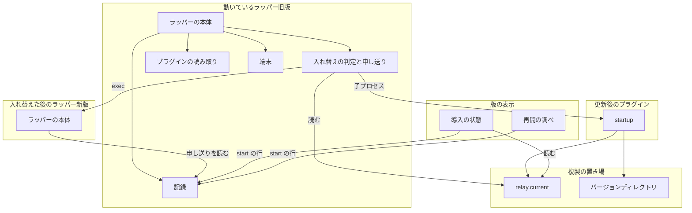
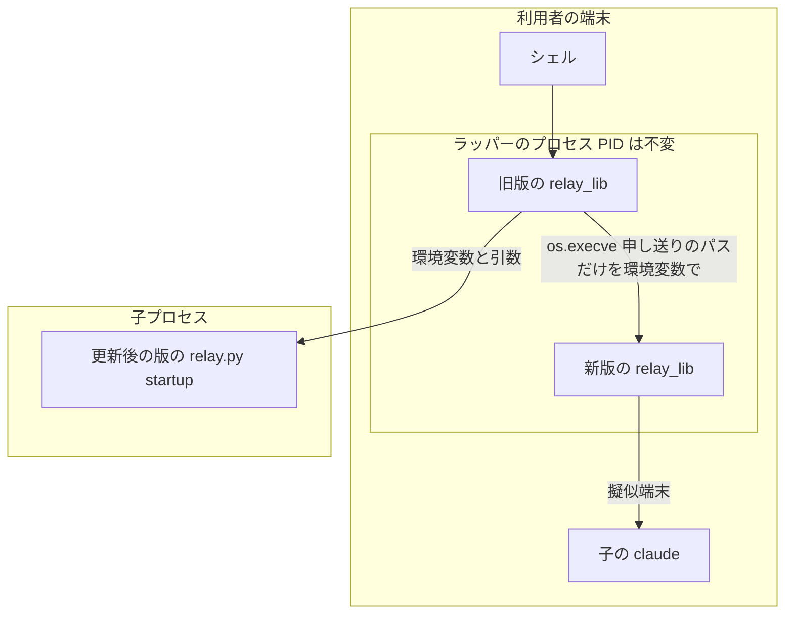
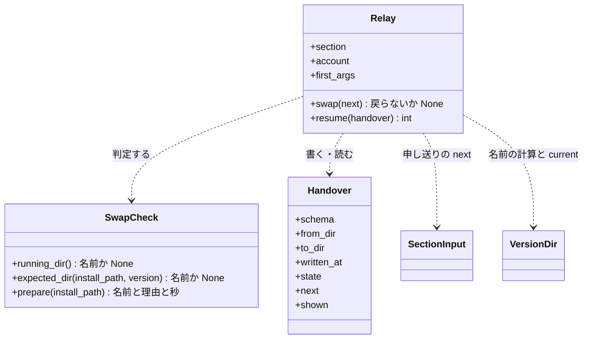
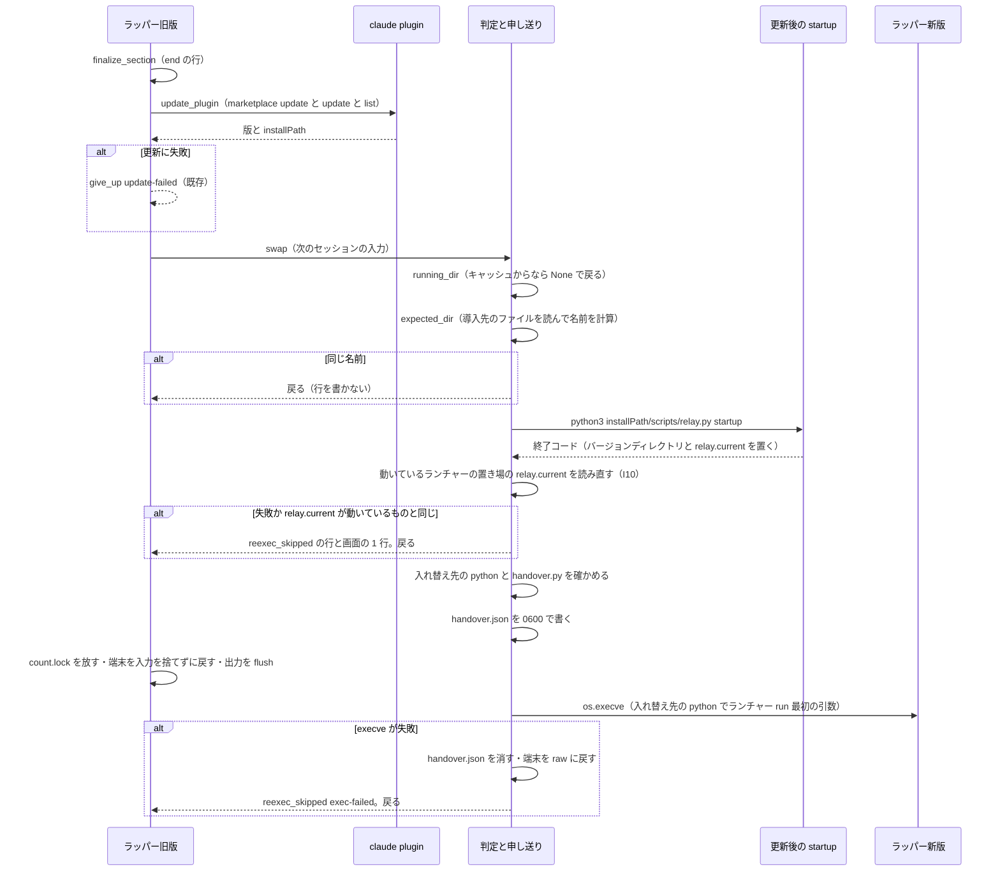
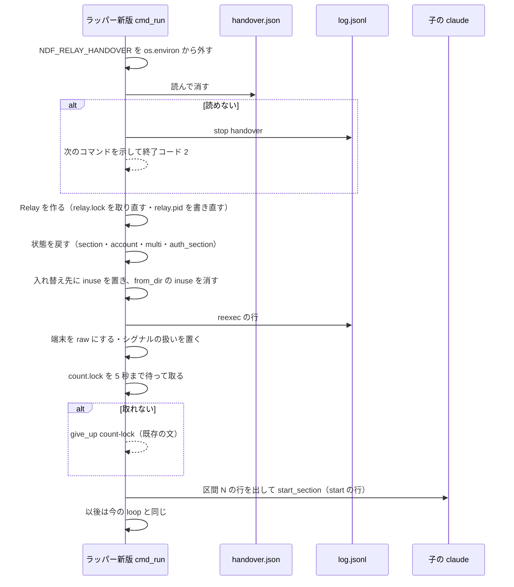
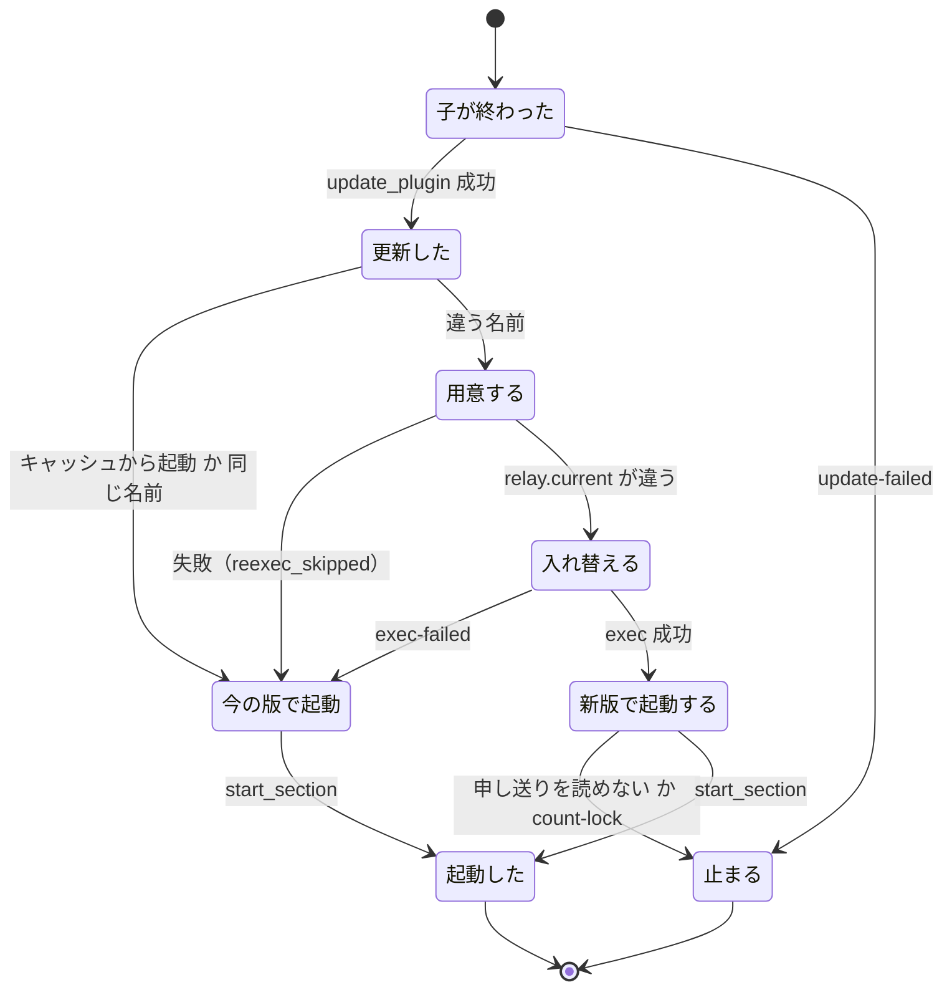

# #1587: ラッパーをセッションの切り替えで更新後の版へ入れ替える

要求と受け入れ条件は #1587 の本文にある（コピーは [issue-1587-requirements.md](issue-1587-requirements.md) ）。
この文書は「どう作るか」だけを扱う。

## 例: 10.17.52 を配布した後のカットポイント

ランチャーのコピー（`~/.claude/ndf/relay.py`）から起動したラッパー（PID 25275）が、
`relay-10.17.52-aaaa1111` のコードでセッション 7 を回している。その間に 10.17.53 が配布された。

1. セッション 7 の子の claude がシグナルファイルを書き、ラッパーが `/exit` を書いて子が終わる（`end` の行）
2. ラッパーがプラグインを更新し、`claude plugin list --json` から版 `10.17.53` と導入先
   （`installPath`）を読む
3. ラッパーが、導入先のファイルから「更新後に使うべきバージョンディレクトリの名前」
   `relay-10.17.53-bbbb2222` を計算する。動いている `relay-10.17.52-aaaa1111` と違う
4. 導入先の `scripts/relay.py startup` を子プロセスで打つ。10.17.53 の `startup` が
   `relay-10.17.53-bbbb2222` を置いて `relay.current` を替える（SessionStart hook と同じ処理）
5. ラッパーが `relay.current` を読み直し、動いているものと違うので、作業ディレクトリに
   `handover.json`（入れ替えの申し送り）を書き、`relay-10.17.53-bbbb2222/.venv/bin/python` で
   ランチャーを `os.execve` する。PID は 25275 のまま
6. 10.17.53 のラッパーが `handover.json` を読んで消し、`reexec` の行を書いてから、
   セッション 8 を申し送りの入力どおりに起動する。`start` の行の `relay_version_dir` は
   `relay-10.17.53-bbbb2222` になる

版が変わらない切り替えでは、3 の計算で名前が一致し、4 以降を行わない。

## ドメインモデル

### コンテキスト

| コンテキスト | 何の語が 1 つの意味に決まるか |
| --- | --- |
| ndf-relay | ラッパー・セッション・バージョンディレクトリ・ランチャー・ラッパーの入れ替え・入れ替えの申し送り |

このコンテキストだけで閉じる。プラグインの更新（`claude plugin`）は外部の系として呼ぶだけである。

### 集約

| 集約 | 持ち主（書き換えてよいもの） | 根 | エンティティ | 値オブジェクト |
| --- | --- | --- | --- | --- |
| ラッパー | ラッパーの本体（`Relay`） | 作業ディレクトリ（`NDF_RELAY_DIR`） | セッション | 次のセッションの起動の入力・入れ替えの申し送り・動いているバージョンディレクトリの名前 |
| ラッパーの複製 | 導入と `startup`（`VersionDir`） | 複製の置き場（`~/.claude/ndf/`。10.17.4〜10.17.6 の旧いコピーは `${XDG_DATA_HOME:-~/.local/share}/ndf/`。どちらも `startup` が自分の下にバージョンディレクトリと `relay.current` を置く） | バージョンディレクトリ | `relay.current` が指す名前・使用中の印 |

**ラッパーは複製を書き換えない。** バージョンディレクトリを置いて `relay.current` を替えるのは、
更新後の版の `startup` である。ラッパーが複製へ書くのは、自分の使用中の印（`inuse-<pid>`）の
作成と削除だけで、これは既存の `claim_inuse` / `release_inuse` を通す。

### 不変条件

| # | 集約 | 条件 | 破れたときの扱い |
| --- | --- | --- | --- |
| I1 | ラッパー | 入れ替えは、子の claude が居ない間（前のセッションの `end` の後、次のセッションの起動の前）にだけ行う | 起こらない形にする（判定を呼ぶ位置が 1 か所だけ） |
| I2 | ラッパー | 1 回の切り替えで、入れ替えは高々 1 回である | 申し送りから起動したラッパーは、その切り替えで判定しない |
| I3 | ラッパー | 入れ替えの前後で PID と作業ディレクトリは変わらず、セッションの番号は続く | 申し送りの番号を読めなければ次のセッションを起動せず止まる（I6） |
| I4 | ラッパー | 次のセッションの起動の入力（引数・cwd・退避前の cwd・引き継ぐ引数・上限の後に決めたアカウント）は、入れ替えの有無で同じである | 申し送りに書く値は `SectionInput` そのものとし、入れ替えの側で作り直さない |
| I5 | ラッパー | 入れ替えの判定と準備のどの失敗でも、今の版のまま次のセッションを起動する | 理由を画面に 1 行、`log.jsonl` に `reexec_skipped` の 1 行で残す |
| I6 | ラッパー | 入れ替えた後に申し送りを読めないときは、次のセッションを起動せず、手で打つコマンドを示して止まる。黙って終わらない | `stop` の行（`reason: handover`）と、既存の「次の区間を起動できない」と同じ画面の文 |
| I7 | ラッパー | 申し送りは認証情報を持たず、利用者だけが読める権限（0600）で書き、読んだら消す | 書けなければ入れ替えない（I5。理由 `handover-write`） |
| I8 | ラッパー | 入れ替えるかは、動いているバージョンディレクトリの名前と更新後に使うべき名前の一致だけで決める。一致すれば外部コマンドを呼ばない | 版の大小を比べない。後退の防止は `startup` の既存の規則が担う |
| I9 | ラッパー | 申し送りを読む仕組みを持たないバージョンディレクトリへは入れ替えない | 理由 `no-handover` で今の版のまま続ける（I5） |
| I10 | ラッパー | 判定するのは、ランチャーのコピーから起動したラッパー（動いている中身がバージョンディレクトリ）だけである。旧いコピー（`${XDG_DATA_HOME:-~/.local/share}/ndf/relay.py`）から起動したものも含む。読み直す `relay.current` と exec するランチャーは、動いているランチャーの置き場（`launcher_path()` とその親のディレクトリ）のものであり、もう一方の置き場のものを読まない | プラグインのキャッシュから起動したラッパーは判定を呼ばない |
| I11 | ラッパーの複製 | 使用中の印は、ラッパーが動いているバージョンディレクトリにだけある | 入れ替えた後のラッパーが、新しい方へ印を置いてから古い方の印を消す |

### ドメインイベント

| # | イベント | 発生元 | 受け手 |
| --- | --- | --- | --- |
| E1 | 前のセッションの子の claude が終わった | ラッパー（`finalize_section`） | ラッパー（切り替え） |
| E2 | プラグインを更新した | ラッパー（`prepare_next`） | 入れ替えの判定 |
| E3 | 更新後の版のラッパーのバージョンディレクトリを用意した | 更新後の版の `startup`（子プロセス。E4 の後にだけ呼ぶ） | 入れ替えの判定（`relay.current` を読み直し、違えば入れ替え、同じか失敗なら E7） |
| E4 | 動いているバージョンディレクトリの名前と更新後に使うべき名前（`expected_dir`）が違うと判定した | 入れ替えの判定（E2 の後、E3 より前） | 入れ替えの判定（E3 の `startup` を呼ぶ） |
| E5 | ラッパーが新しい版のランチャーへ入れ替わった | 入れ替え（`os.execve`） | 新しい版のラッパー |
| E6 | 新しい版のラッパーが状態を引き継ぎ、次のセッションを起動した | 新しい版のラッパー | 記録（`reexec`・`start` の行） |
| E7 | 入れ替えずに今の版のまま次のセッションを起動した | 入れ替えの判定 | 記録（失敗の経路なら `reexec_skipped` の行） |
| E8 | 入れ替えと、入れ替えなかった理由を `log.jsonl` に残した | 記録 | `status`・`resume.py`・利用者 |
| E9 | 利用者が動いているラッパーの版を見た | `status`・`resume.py` | 利用者 |

起きる順は E2 → E4 → E3 → E5 である。名前の比較（E4 の判定）は `startup` より前に行い、
名前が同じときは E3・E4 を経ずに E7 へ進む（外部コマンドを呼ばず、行も書かない。I8）。

E3 は、要求の前提 2 の「次のセッションを起動する前に用意する」を、更新後の版の `startup` を
ラッパーが子プロセスで呼ぶことで満たす（決定 1）。

### 用語

| 用語 | 意味 | 用語集への反映 |
| --- | --- | --- |
| ラッパーの入れ替え | セッションの切り替えで子の claude が居ない間に、動いているラッパーのプロセスが、PID と端末を保ったまま別のラッパーのバージョンディレクトリのコードで起動し直すこと | 追加済み（要求の変更で足した） |
| 入れ替えの申し送り | ラッパーの入れ替えの直前に作業ディレクトリへ書く、次のセッションの起動の入力とラッパーの状態のファイル（`handover.json`）。入れ替えた後のラッパーが読んで消す | 追加（`relay_handover`）。`handoff` は引継ぎ文書が使うため使わない |
## 機能一覧

| # | 機能 | 誰が使うか |
| --- | --- | --- |
| F1 | セッションの切り替えで、更新後の版のバージョンディレクトリを用意し、動いているものと違えばラッパーを入れ替える | ラッパー（利用者の操作なし） |
| F2 | 入れ替えた後に、申し送りから状態を戻して次のセッションを起動する | 入れ替えた後のラッパー |
| F3 | 入れ替えられないときに今の版のまま続け、理由を残す | ラッパー・後から記録を数える人 |
| F4 | 動いているラッパーのバージョンディレクトリを `start` の行に残す | ラッパー |
| F5 | 動いているラッパーの版を `/ndf:install-wrapper status` に出し、複製と違えば案内する | 利用者・AI |
| F6 | 動いているラッパーの版を `experimental/resume.py` の版の行に並べる | 再開した会話の AI |

## 構成要素

### 文脈



こちらが変えられないのは Claude Code の `claude plugin` と `uv` だけである。プラグインのキャッシュの
中身は同じ変更で一緒に変える（新しい版の `relay_lib/` がそこに載る）。

### 要素と責務

| 要素 | 責務 | 変更 |
| --- | --- | --- |
| 入れ替えの判定と申し送り（`relay_lib/handover.py`） | 動いている名前・使うべき名前の計算、更新後の版の `startup` の呼び出し、`relay.current` の読み直し、申し送りの読み書き、`os.execve` の組み立て。理由の語の集合を持つ | 新設 |
| ラッパーの本体（`relay_lib/run.py` の `Relay`・`cmd_run`） | 切り替えで判定を呼ぶ（I1・I10）。入れ替えの直前の後始末（`count.lock` を放す・端末を戻す）。申し送りから起動したときの状態の復元と次のセッションの起動（I2〜I4）。`start` の行の `relay_version_dir` | 変更 |
| プラグインの読み取り（`relay_lib/claude.py` の `read_plugin`・`update_plugin`） | `claude plugin list --json` から導入先（`installPath`）も返す。呼び出しの回数は変えない | 変更 |
| 端末（`relay_lib/terminal.py` の `Terminal.restore`） | 入れ替えの前に、打たれた入力を捨てずに端末の設定を戻す | 変更 |
| 複製（`relay_lib/version_dir.py`） | 名前から版を読む関数（`version_of`）を足す。`name_for` と `VersionDir(source=…)` は既存のまま使う | 変更 |
| 記録（`relay_lib/record.py`） | `log.jsonl` の最後の `start` の行から動いているバージョンディレクトリを読む関数（`running_version_dir`）を足す | 変更 |
| 導入の状態（`relay_lib/install.py` の `cmd_status`） | 動いているラッパーの行を出す（AC14・AC16） | 変更 |
| 再開の調べ（`experimental/resume.py`） | 版の行に動いているラッパーの版を並べる（AC15・AC16） | 変更 |
| 規約（`skills/development-workflow/references/relay.md`） | 入れ替えの振る舞い・入れ替えない場合・記録の行（AC17） | 変更 |



図に含めない要素: 規約（`relay.md`）は振る舞いを持たない。名前から版を読む関数（複製の
`version_of`）は、再開の調べが `start の行` を読んだ後に呼ぶもので、図では `start の行` の辺に含める。

### 配置



境界をまたぐもの:

| 境界 | 流れるもの | 保護 |
| --- | --- | --- |
| 旧版 → `startup` の子プロセス | ラッパーの環境変数（`plugin_cli` と同じく `DROP_ENV` と `NDF_RELAY_DIR` を除く） | 認証情報を新たに作らない。既存の hook と同じ環境 |
| 旧版 → 新版（`os.execve`） | 引数（`run` と最初の引数）・環境変数（ラッパーの環境に `NDF_RELAY_HANDOVER=<申し送りのパス>` を足したもの） | 環境変数に入れるのはパスだけ。中身はファイル（0600）に書く |

### 置き場所

```text
plugins/ndf/scripts/
├── relay_lib/
│   ├── handover.py        新設
│   ├── run.py             変更
│   ├── claude.py          変更
│   ├── terminal.py        変更
│   ├── version_dir.py     変更
│   ├── record.py          変更
│   └── install.py         変更
├── experimental/resume.py 変更
└── tests/test_relay.py    変更（テストを足す）
plugins/ndf/skills/development-workflow/references/relay.md  変更
```

`handover.py` はバージョンディレクトリへ自動で入る（`VersionDir.files()` が `relay_lib/*.py` を
すべて入れる）。標準ライブラリと relay_lib の中だけを import する
（`test_version_dir_imports_only_stdlib_and_itself` が縛る）。

## 構造



`Handover` は値オブジェクトで、書いた後に変えない。`SwapCheck` は型でなく `handover.py` の関数の
まとまりとして作ってよい（図は責務の分け方を示すだけである）。

### 申し送りの形（`handover.json`）

| キー | 型 | 意味 |
| --- | --- | --- |
| `schema` | int | 申し送りの形の版。この変更では `1`。キーは足すだけにし、意味を変えない |
| `shown` | str | 利用者が手で打つ次のコマンド。**どの `schema` でもこのキーと意味を変えない**（I6 の表示に使う） |
| `from_dir` / `to_dir` | str | 入れ替え前のバージョンディレクトリの名前 / 入れ替え先の名前 |
| `written_at` | float | 書いた時刻（`reexec` の行の秒の起点） |
| `prepare_seconds` | float | 判定の始めから書くまでの秒（`startup` の子プロセスを含む） |
| `claude` / `marketplace` / `version` | str | 本物の claude のパス・マーケットプレイス・更新後の版 |
| `first_args` | list[str] | ラッパーの最初の引数（`carried` の元。プロセスの表示を同じにするため `os.execve` の引数にも渡す） |
| `state.section` | int | 終わったセッションの番号（次は `+1`） |
| `state.account` | str \| null | 終わったセッションのアカウント（`settle_account` の前の値） |
| `state.multi` | bool | 起動したときに決めた「アカウントを切り替えるか」（#1389 の I8。数え直さない） |
| `state.auth_section` | int | 認証の失敗を扱った区間 |
| `next` | object | `SectionInput` のキー（`args`・`cwd`・`command`・`from_session`・`cwd_fallback`・`carried`・`plan`）。`plan` は `[アカウント, 理由, Choice]` で、`Choice` は `name`・`score`・`earliest`・`remaining` |

環境変数・トークン・従量の接続の宣言の値は書かない（I7）。環境は `os.execve` がそのまま渡す。

## 入出力の契約

### `relay.py` の副命令

変えない。`run` の引数も変えない。入れ替えのための入口は、環境変数 `NDF_RELAY_HANDOVER` だけである。

| 項目 | 内容 |
| --- | --- |
| 名前 | 環境変数 `NDF_RELAY_HANDOVER`（`run` が読む） |
| 入力 | 申し送りのファイルのパス。`run` は読むとすぐ `os.environ` から外す（子の claude と hook へ継がせない） |
| 出力 | 成功: 申し送りの次のセッションを起動し、以後は今と同じ `run`。失敗: I6 の画面の文と `stop` の行、終了コード 2 |
| 失敗の形 | ファイルが無い・JSON でない・`schema` を知らない・必須のキーが無い → I6。`shown` を読めればそれを示し、読めなければ「`claude` を打ち直し、前の会話は `/resume` で選ぶ」を示す |
| 互換性 | 申し送りを知らない版（`relay_lib/handover.py` を持たない）へは入れ替えない（I9）。知る版どうしでは、読む側は自分の `schema` 以下を受ける |

### `log.jsonl`

既存の行の項目は変えない。

| `event` | 変更 | キー |
| --- | --- | --- |
| `start` | キーを 1 つ足す | `relay_version_dir`: 動いているバージョンディレクトリの名前。プラグインのキャッシュから起動したときは `null`。キーが無い行は入れ替えの仕組みを持たない版が書いたもの |
| `reexec` | 新設。入れ替えた後のラッパーが、次のセッションを起動する前に書く | `section`（終わったセッションの番号）・`from`・`to`・`prepare_seconds`・`seconds`（`written_at` から書くまで。exec と import を含む） |
| `reexec_skipped` | 新設。判定で違うと分かったが入れ替えなかった | `section`・`reason`・`from`・`to`（分かれば）・`detail`（1 行。任意）・`seconds` |
| `stop` | `reason` の値を 1 つ足す | `handover`（申し送りを読めない） |

`reexec_skipped` の `reason` の集合:

| `reason` | いつ |
| --- | --- |
| `startup-failed` | `startup` の子プロセスを起動できない・上限の秒（`NDF_RELAY_PREPARE_TIMEOUT`、既定 600）を超えた・終了コードが 0 でない |
| `not-placed` | `startup` の後も `relay.current` が動いているものを指す（後退の防止の規則か、環境を作れなかった） |
| `unreadable` | 導入先が読めない・`relay.current` が無いか壊れている |
| `no-env` | 入れ替え先の `.venv/bin/python` が無い |
| `no-handover` | 入れ替え先が申し送りを読む仕組みを持たない（I9） |
| `handover-write` | 申し送りを書けない |
| `exec-failed` | `os.execve` が失敗した |

同じ名前（I8）とキャッシュからの起動（I10）では行を書かない。

### `/ndf:install-wrapper status`

ラッパー経由のセッションでだけ、「このセッション」の行の次に 1 行を足す。

| 状態 | 出す文 |
| --- | --- |
| 動いている名前が `relay.current` と同じ | `動いているラッパー: relay-10.17.53-bbbb2222（複製が指すものと同じ）` |
| 違う | `動いているラッパー: relay-10.17.52-aaaa1111。複製は relay-10.17.53-bbbb2222 を指す。次のカットポイントで入れ替わる。すぐ替えるなら /exit してから claude を打ち直す` |
| `start` の行にキーが無い | `動いているラッパー: 不明（入れ替えの仕組みを持たない版）。/exit してから claude を打ち直すと、以後は版が見え、更新で入れ替わる` |
| キーが `null` | `動いているラッパー: プラグインのキャッシュから起動（入れ替えない）` |

### `experimental/resume.py`

版の行の並びを「区間の起動時 / 導入済み / 複製 / 動いているラッパー」にする。動いているラッパーの
値は `version_of(relay_version_dir)`、キーが無ければ `不明（打ち直すと見える）`。食い違いの判定は
今と同じく、読めた版の集合が 2 つ以上かで行い、`不明` を数えない。`step_result` の `versions` に同じ
キーを足す。

## 処理の流れ

### 切り替え（旧版の側）



`swap` から戻ったら、今と同じく `── ndf-relay: 区間 N ──` を出して `_start_next_section` を呼ぶ（I5）。
`swap` は例外を外へ出さない。想定外の例外も `reexec_skipped`（`reason` は最も近い段の値、
`detail` に例外の型）にして戻る。

### 申し送りからの起動（新版の側）



**申し送りからの起動は、今の `cmd_run` の判定（`NDF_RELAY=0`・入れ子・端末か・擬似端末・
プラグインの読み取り）を通さない。** 旧版が既にそれらを通って動いていたためで、読み直すと
外部コマンドが増え、判定が変わればセッションが失われる。`claude` のパス・マーケットプレイス・
版は申し送りから取る。

`loop` は、最初のセッションを起動する部分と、シグナルファイルを待って切り替える部分に分け、申し送りからの
起動は後者だけを使う。

### 状態遷移（1 回の切り替え）



「新版で起動する」から「用意する」への辺は無い（I2）。

## 非機能の実現方式

| 大項目 | 要求の条件 | 実現方式 | 確かめ方 |
| --- | --- | --- | --- |
| 可用性 | 入れ替えのどの失敗でも、次のセッションの起動を失わない（AC10）か、手で打つコマンドを示して止まる（AC11）。ラッパーが黙って終わり、利用者のシェルへ戻ることは無い | 旧版の側の失敗は `swap` から戻って今の版で起動する。exec の後の失敗は `shown` を示す `give_up` にする。`swap` は例外を外へ出さない | 各 `reason` を起こすテストで、次の `start` の行があること・I6 では画面の文と `stop` の行があること |
| 性能・拡張性 | 版が同じ切り替え（AC8）では、今の切り替えより外部コマンドの呼び出しを増やさない（足すのはファイルの読み取りだけ）。版が違う切り替えでは、環境の用意と入れ替えに掛かった秒を `log.jsonl` に残す | 同じ名前かを導入先のファイルの sha256 で決め、`installPath` は既に呼んでいる `list --json` から取る。違うときは `prepare_seconds` と `seconds` を残す | 偽の claude の呼び出しの回数を数え、同じ名前の切り替えで今と同じ回数であること |
| 運用・保守性 | 入れ替え・入れ替えなかった理由を `log.jsonl` の行で後から数えられる（理由は決まった語の集合） | `reexec` と `reexec_skipped` の 2 つの `event`。`reason` は上の 7 語の集合で、`handover.py` の定数が持つ | `jq 'select(.event=="reexec_skipped") .reason'` で数えられること。テストで集合の外の値が出ないこと |
| 移行性 | 入れ替えの仕組みを持たない版から持つ版へは、利用者の 1 度の打ち直しで移る（前提 3）。打ち直しの後は手が要らない | 打ち直しで起動したラッパーは `start` の行に名前を残し、以後の切り替えで判定する。仕組みを持たない版は `status` と `resume.py` で「不明」と出して打ち直しを案内する | AC16 のテスト。リリース後テストで実機の 1 回 |
| セキュリティ | 入れ替えで引き継ぐ中身に、認証情報を新たに書き出さない。ファイルに書くなら利用者だけが読める権限にし、読んだら消す | 申し送りは表の項目だけを持つ。作業ディレクトリ（0700）の中に 0600 で一時ファイルへ書いて rename する。読む側は読んだ直後に消す。環境変数にはパスだけを入れる | テストで申し送りの権限が 0600・読んだ後に無いこと・キーが表の集合だけであること |

## 決定の記録

決定 1〜10 は [issue-1587-design-decisions.md](issue-1587-design-decisions.md) にある。

## テスト設計

| 受け入れ条件・不変条件 | どの振る舞いで縛るか | どう壊したら落ちるべきか |
| --- | --- | --- |
| AC1・AC13 | 名前の違う 2 つのバージョンディレクトリで 2 セッションを回すと、2 つ目の `start` の `relay_version_dir` が入れ替え先の名前 | `start` の行に名前を書かない・旧版の名前を書く |
| AC2 | `reexec` の行が 1 行で、`from`・`to`・`section` を持ち、前の `end` と次の `start` の間にある | 旧版の側で書く（exec が失敗しても残る）・`start` の後に書く |
| AC3・I3 | 入れ替えの前後で `pid`（ラッパー）と作業ディレクトリが同じで、`section` が 7 → 8 | 新版で `make_relay_dir` を呼ぶ・番号を 1 から数える |
| AC4・I4 | 入れ替えた場合とそうでない場合で、次の子に渡る引数・cwd・`cwd_fallback`・`carried`・`account` が同じ（上限の後の選び方を含む） | 申し送りから `plan` か `carried` を落とす |
| AC5 | 入れ替えで 1 日の起動回数が増えない。再起動ループと停止シグナルファイルの判定が続く | 新版が `start` の行を 2 度書く・上限を判定し直して 2 度数える |
| AC6 | 入れ替えた後に `relay_running` が真で、子の入出力が中継され、ラッパーが終わった後の端末の設定が最初と同じ | 新版が `relay.lock` を取らない・端末を raw のまま exec する |
| AC7・I11 | 入れ替えた後、旧のディレクトリに `inuse-<pid>` が無く、新にある。exec が失敗したときは旧に残る | 旧版が exec の前に印を消す・新版が古い方を消さない |
| AC8・I8 | 同じ名前の切り替えでは `reexec`・`reexec_skipped` の行が無く、偽の claude の呼び出し回数が今と同じ | 毎回 `startup` を呼ぶ・版の文字列だけで比べる |
| AC9・I2 | 入れ替えた後のラッパーは、その切り替えで判定を呼ばない（`startup` の呼び出しが 1 回） | 申し送りからの起動で `swap` を通す |
| AC10・I5 | `startup-failed`・`not-placed`・`unreadable`・`no-env`・`handover-write`・`exec-failed` のそれぞれで、画面に 1 行・`reexec_skipped` の 1 行・次の `start` の行がある | 失敗で `give_up` する・例外が `loop` へ漏れる |
| AC11・I6 | 申し送りが無い・壊れている・知らない `schema` のとき、`stop`（`handover`）と画面の次のコマンドがあり、子を起動しない | 最初の引数で新しいラッパーを始める・黙って終わる |
| AC12・I10 | キャッシュから起動したラッパー・`NDF_RELAY=0`・パススルーでは判定を呼ばない | キャッシュからの起動で `startup` を呼ぶ |
| AC14 | ラッパー経由の `status` が、同じ・違う・キーが無い・`null` の 4 つで上の文を出す | 違うときに案内を出さない |
| AC15 | `resume.py` の版の行に動いているラッパーの版が並び、違えば「食い違いあり」。`不明` は食い違いに数えない | `不明` を版として数える |
| AC16 | キーの無い `start` の行で、`status` と `resume.py` が「不明」と打ち直しの案内を出す | 例外で落ちる・空で出す |
| AC17 | 文書の変更は `instructions-check.py` と参照切れのチェックが通ること（文言は照合しない） | — |
| I1 | 判定を呼ぶのは `end` の行の後、`start_section` の前の 1 か所だけ（子が生きている間に呼ばれない） | `tick` の中から呼ぶ |
| I7 | 申し送りの権限が 0600・読んだ後に無い・キーが形の表の集合だけ | 0644 で書く・読んだ後に残す・環境変数を書く |
| I9 | 入れ替え先が `handover.py` を持たないと `no-handover` で今の版のまま起動する | ファイルの有無を見ない |

結合のテスト（AC1〜AC9）は、擬似端末の下で 2 つのバージョンディレクトリと偽の claude・偽の
`startup` を用意して回す。どう組むかは実装（`tdd-cycle`）で決める。

## 未確認のまま残ること

| 項目 | 内容 |
| --- | --- |
| `relay.current` の競り | 旧版が読んでから新版のランチャーが読むまでに、別の `startup` が `relay.current` を替えると、新版は申し送りの `to_dir` と違うディレクトリで動く。`start` の行は実際に動いた名前を書き、`reexec` の `to` は申し送りの値を書くため、食い違いは記録で見える。起こる頻度は実機で見る |
| 決定 2 の絞りの漏れ | 版の文字列が同じで、新版が `LIB_FILES` にだけファイルを足し、既存のファイルが同じとき、旧版の計算は「同じ」と出して入れ替えない。次の打ち直しか版の更新で解ける。版を上げずに `LIB_FILES` を変えることは版の方針の外である |
| `startup` の秒 | 環境の用意（2 つの `uv sync`）に掛かる秒は実機で測っていない。切り替えの待ちが延びる。`prepare_seconds` で測り、リリース後テストで見る |
| `not-placed` の繰り返し | 後退の防止で置けない状態が続くと、切り替えのたびに画面の 1 行が出る。頻度は記録で見る |
| 実機の確かめ | 入れ替えの仕組みを持つ版を起動したまま次の版を配布し、カットポイントを 1 回越える確かめは、リリース後テストで行う（要求の検証手段） |
