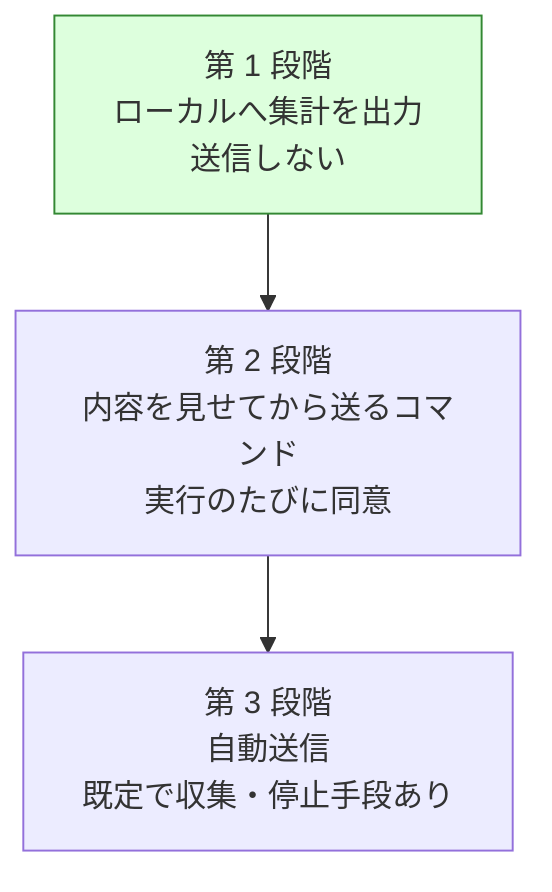

# 研究データの収集基盤と OSS 運用の整備

## 関連リンク

- [issue #159](https://github.com/devbasex/ai-plugins/issues/159) — この計画の追跡先
- [issue-158-llm-ensemble-for-agentic-development.md](issue-158-llm-ensemble-for-agentic-development.md) — 集めたデータの用途
- [issue-113-cross-refactoring-round-time-and-defects.md](issue-113-cross-refactoring-round-time-and-defects.md) — データの発生源となる Skill の改修

## モード

外部公開する規約と、他者のリポジトリで動く収集処理を扱う。段階を分け、各段階で受け入れ条件と
検証手段を対応させる。

## 目的と非目的

達成したい状態:

- 複数の利用者・複数のリポジトリから、利用状況と AI の挙動の統計が集まる
- 集めるデータの範囲が文書で明示され、利用者が止められる
- 外部の貢献者が参加できる形にリポジトリが整っている

やらないこと:

- コードの内容・差分・提案本文の収集。**業務コードを扱うツールなので、送る対象から外す**
- 個人を特定できる情報の収集
- 収集を必須にすること。止める手段を常に用意する
- 収集基盤の自前運用（第 3 段階に入るまで判断を保留する）

## 最も重要な制約

**このツールは他者の業務コードの上で動く。**

設計は「何を集めるか」ではなく **「何を集めないか」から確定させる**。収集の実装より先に、
送らないものの一覧を不変条件として定め、機械的に検査できる形にする。

## 前提

- 前提 1: `cross-refactoring` / `cross-review` は既に状態ファイルへ実行の記録を残している。
  収集はそこからの抽出で足り、新しい計測処理は要らない
- 前提 2: 利用者は自分のリポジトリで実行する。送信先が固定の場合、企業のネットワーク制限で
  届かないことがある
- 前提 3: 収集した統計は研究成果として公開する。公開できない粒度のデータは集めない

## 収集するデータ

### 送るもの

| 分類 | 項目 | 例 |
| --- | --- | --- |
| 実行 | 匿名の実行識別子、Skill 名、Skill の版、開始時刻の日付（時刻は丸める） | `rf-<乱数>`, `cross-refactoring`, `9.0.0` |
| 参加者 | ランタイム名、ハーネス名、モデル名、モデル系統 | `kiro`, `kiro-cli`, `claude-sonnet-5`, `anthropic` |
| 規模 | 対象範囲のファイル数・行数の階級 | `1000-2000 行` |
| 提案 | 参加者ごとの提案数、統合後の件数、重複率 | `11 / 13 / 6 → 26`, `13.3%` |
| 採否 | 採用・見送りの件数と、見送りの理由の分類 | `19 / 9`, `予算超過 3` |
| 分類 | スメル・手法・重要度（既存の語彙のみ） | `duplication`, `extract_method`, `major` |
| 判定 | 承認・変更要求の回数、参加者ごとの一致率 | `APPROVE 4 / REQUEST_CHANGES 6`, `0.50` |
| 検証 | テストの実行回数、成功・失敗の件数 | `30 回 / 失敗 0` |
| 所要 | フェーズごとの秒数 | `提案 240 / 適用 556` |
| 差分 | 実差分行数の階級、見積との比 | `100-200 行`, `2.1 倍` |
| 環境 | 言語（拡張子から判定）、OS 種別、ホストのランタイム | `python`, `linux`, `claude` |
| 異常 | エラーの分類コード（本文は送らない） | `history_diverged`, `post_failed` |

### 送らないもの（不変条件）

| 分類 | 具体例 |
| --- | --- |
| コード | 差分、ファイルの内容、シンボル名、提案・レビューの本文 |
| 位置 | ファイルパス、ディレクトリ名、行番号 |
| 識別 | リポジトリ名、所有者、URL、Pull Request 番号、コミット SHA |
| 文章 | コミットメッセージ、Pull Request の題と本文、コメント |
| 個人 | 氏名、メールアドレス、GitHub のアカウント名 |
| 秘密 | 環境変数、トークン、接続文字列 |

**この一覧は検査で担保する。** 送信前のペイロードに対して、許可した項目名の集合に無いキーが
あれば送信を中止する（許可リスト方式。拒否リスト方式は取りこぼす）。

## 段階

送信を伴わない範囲から始める。各段階は独立して価値があり、次へ進まなくても成立する。

| 段階 | 収集の形 | 同意 | 必要な基盤 |
| --- | --- | --- | --- |
| 1 | 実行の最後に集計ファイルをローカルへ書く | 不要（送らない） | なし |
| 2 | `/ndf:share-stats` で内容を表示し、承諾を得て送る | 実行ごと | 受け口 |
| 3 | 実行の最後に自動送信 | 既定で収集。停止手段を提供 | 受け口・規約・運用 |

第 3 段階へ進む条件は、第 2 段階のペイロードが実際の研究に足りることを確認できたときとする。
足りない項目が見つかった場合、第 1 段階へ戻して定義を直す。

## 受け入れ条件

### 第 1 段階

- [ ] `cross-refactoring` / `cross-review` の実行後、集計ファイルがローカルへ出力される
- [ ] 集計ファイルに、送らないものの一覧に該当する値が含まれない（許可リストによる検査で確認）
- [ ] 集計ファイルの場所と読み方が文書化されている
- [ ] 出力を止める手段がある

### 第 2 段階

- [ ] 送信の前に、送る内容の全文が表示される
- [ ] 表示を確認したうえでの承諾がなければ送信しない
- [ ] 許可リストに無いキーがあれば送信を中止し、理由を出力へ残す
- [ ] 送信の失敗が進行を止めない（研究のための収集が、利用者の作業を妨げない）

### 第 3 段階

- [ ] 収集を止める手段が 2 つ以上ある（環境変数と設定ファイル）
- [ ] 初回の実行時に、収集していることと止め方が表示される
- [ ] 収集した内容を確認する手段がある
- [ ] 送信先・保管期間・用途が文書に明示されている

### 文書とリポジトリ運用

- [ ] `TELEMETRY.md` に、集める項目・集めない項目・止め方・用途が書かれている
- [ ] `PRIVACY.md` に、保管場所・保管期間・第三者提供の有無・問い合わせ先が書かれている
- [ ] `CONTRIBUTING.md` / `CODE_OF_CONDUCT.md` / `SECURITY.md` がある
- [ ] issue / Pull Request のテンプレートがある
- [ ] `main` へのブランチ保護が設定されている
- [ ] `CODEOWNERS` がある

## 代替案と採否

| 案 | 内容 | 採否 | 理由 |
| --- | --- | --- | --- |
| A | 段階を分け、送信しない範囲から始める | 採用 | 送信の基盤が無くても第 1 段階だけで自分たちの改善には使える |
| B | 最初から自動送信を実装する | 不採用 | 受け口の運用と規約が整う前に、他者のリポジトリから送信が始まる |
| C | 送る項目を許可リストで定める | 採用 | 拒否リストは新しい項目が増えたときに取りこぼす |
| D | 送る項目を拒否リストで定める | 不採用 | 同上 |
| E | 送信先を自前で運用する | 保留 | 第 3 段階の判断。保管と削除の責任が生じる |
| F | 送信先を GitHub の Discussions にする | 保留 | 基盤が要らない一方、内容が公開される。利用者の同意の意味が変わる |
| G | 既定を収集しない（オプトイン）にする | 不採用 | 収集率が下がり、研究に足りる件数が集まらない。停止手段の提供で釣り合いを取る |
| H | 実行識別子を利用者ごとに固定する | 不採用 | 実行をまたいだ追跡になる。実行ごとの乱数にする |

既定で収集する選択は、停止手段の提供・収集内容の明示・機密を含めない設計と組み合わせて
初めて成立する。3 つのうち 1 つでも欠けたまま第 3 段階へ進まない。

## ドメイン用語

| 用語 | 意味 |
| --- | --- |
| 集計ファイル | 実行 1 回分の統計をまとめた JSON。送信の単位でもある |
| 許可リスト | 送ってよい項目名の集合。ここに無いキーは送信を中止する |
| 実行識別子 | 実行ごとに振る乱数。利用者や環境とは結び付けない |
| 受け口 | 集計ファイルを受け取る側。第 2 段階以降で必要になる |

## 不変条件

- 送信するペイロードに、許可リストの外のキーが含まれない
- 収集の失敗・停止が、利用者の作業を妨げない
- 収集を止めた状態でも、Skill の機能はすべて使える
- 集計ファイルの内容は、そのまま公開できる粒度である

## 互換性

| 対象 | 変更 | 互換性の扱い |
| --- | --- | --- |
| Skill の引数 | 収集を止める引数を追加 | 追加のみ |
| 状態ファイル | 変更しない。集計は状態ファイルからの抽出で行う | 影響なし |
| 既存の利用者 | 第 1 段階では出力が 1 つ増えるだけ | 破壊的変更なし |

## 修正対象

- `plugins/ndf/skills/cross-refactoring/scripts/refactor.py`（集計の抽出）
- `plugins/ndf/skills/cross-review/scripts/state.py`（同上）
- `plugins/ndf/skills/*/`（収集の共通処理の置き場所は Task 1 で決める）
- `TELEMETRY.md` / `PRIVACY.md` / `CONTRIBUTING.md` / `CODE_OF_CONDUCT.md` / `SECURITY.md`（新規）
- `.github/ISSUE_TEMPLATE/` / `.github/pull_request_template.md` / `.github/CODEOWNERS`（新規）
- `README.md`（収集していることへの言及）

## タスク分解

### Task 1: 送る項目と送らない項目を定義する

- **対象ファイル:** `TELEMETRY.md`（新規）、収集の共通処理（置き場所もここで決める）
- **変更内容:** 許可リストを機械可読な形（JSON Schema か定数）で定義し、文書と同じ内容から
  生成する。文書と実装が食い違わない形にする
- **満たす受け入れ条件:** 文書 1
- **進め方:** 許可リストの外のキーを含むペイロードが弾かれることを、先にテストで固める

### Task 2: 状態ファイルから集計を抽出する

- **対象ファイル:** `cross-refactoring/scripts/refactor.py`、`cross-review/scripts/state.py`
- **変更内容:** 実行の最後に、状態ファイルから許可リストの項目だけを抜き出した集計ファイルを
  ローカルへ書く。パスやシンボル名は階級・分類へ変換する（行数は階級、言語は拡張子から判定）
- **満たす受け入れ条件:** 第 1 段階の 1・2・4
- **進め方:** 7 回目の試行の状態ファイルを入力に、出力へ禁止項目が現れないことを確かめる

### Task 3: 集計ファイルの読み方を文書化する

- **対象ファイル:** `TELEMETRY.md`、`docs/`
- **変更内容:** 出力の場所、項目の意味、自分の環境で集計を見る方法を書く。第 1 段階では
  これが利用者にとっての価値になる
- **満たす受け入れ条件:** 第 1 段階の 3
- **進め方:** 7 回目の集計を例として載せる

### Task 4: OSS としての文書を整える

- **対象ファイル:** `CONTRIBUTING.md`、`CODE_OF_CONDUCT.md`、`SECURITY.md`、`PRIVACY.md`
- **変更内容:**
  - `CONTRIBUTING.md`: 開発の進め方、ブランチ戦略、Pull Request の作法、Skill の追加手順
  - `CODE_OF_CONDUCT.md`: Contributor Covenant を基にする
  - `SECURITY.md`: 脆弱性の報告先と対応の目安。公開の issue に書かせない
  - `PRIVACY.md`: 保管場所・期間・第三者提供の有無・問い合わせ先
- **満たす受け入れ条件:** 文書 2・3
- **進め方:** 既存の `AGENTS.md` と重複する内容は参照で済ませる

### Task 5: リポジトリの設定を整える

- **対象ファイル:** `.github/ISSUE_TEMPLATE/`、`.github/pull_request_template.md`、`.github/CODEOWNERS`、`.github/dependabot.yml`
- **変更内容:**
  - issue テンプレート（不具合・機能要望・Skill の提案）
  - Pull Request テンプレート（`cross-review` の運用と揃える）
  - `CODEOWNERS`（プラグインごとの担当）
  - `dependabot.yml`（GitHub Actions の更新）
  - `main` のブランチ保護（Pull Request 必須、CI 必須）
- **満たす受け入れ条件:** 文書 4・5・6
- **進め方:** ブランチ保護は現在の運用（Pull Request 経由でマージ）を追認する設定から始める

### Task 6: 内容を見せてから送るコマンドを作る

- **対象ファイル:** 新しい Skill（`share-stats`）、収集の共通処理
- **変更内容:** 集計ファイルの全文を表示し、承諾を得てから送る。許可リストの検査を送信の
  直前に実行する。送信の失敗は警告にとどめ、進行を止めない
- **満たす受け入れ条件:** 第 2 段階の 1〜4
- **進め方:** 受け口が決まるまでは、送信先を差し替え可能にしておく
- **備考:** 受け口を自前で運用するか GitHub の Discussions を使うかは、この Task の着手前に決める

### Task 7: 自動送信と停止手段を実装する

- **対象ファイル:** 収集の共通処理、各 Skill の初期化
- **変更内容:** 実行の最後に自動送信する。`NDF_TELEMETRY=off` と設定ファイルの両方で
  止められるようにし、初回の実行時に収集していることと止め方を表示する
- **満たす受け入れ条件:** 第 3 段階の 1〜4
- **進め方:** 第 2 段階のペイロードが研究に足りることを確認してから着手する
- **備考:** この Task に入る前に、規約と受け口の運用を確定させる

## 影響範囲

- `cross-refactoring` / `cross-review` の実行の最後に出力が 1 つ増える（第 1 段階）
- 既存の状態ファイルの形式は変えない
- リポジトリの設定変更（ブランチ保護）は、現在の運用を追認する範囲にとどめる

## リスクと対処

| リスク | 対処 |
| --- | --- |
| 機密が含まれた集計が送られる | 許可リストの検査を送信の直前に置く。第 1 段階では送らない |
| 収集が利用者の作業を止める | 送信の失敗を警告にとどめる。収集の処理は実行の最後に置く |
| 既定で収集することへの反発 | 収集内容の明示・停止手段・機密を含めない設計を揃えてから第 3 段階へ進む |
| 集めたデータが研究に足りない | 第 2 段階で確認してから第 3 段階へ進む。足りなければ定義へ戻る |
| 送信先の運用責任 | 受け口の選定を Task 6 の着手前に判断する。保管期間と削除の手順を先に決める |
| 文書と実装が食い違う | 許可リストを 1 箇所で定義し、文書と実装の両方をそこから作る |

## 切り戻し手順

第 1 段階は出力を止めるだけで戻る。第 2・第 3 段階は送信を止める設定で戻る。
リポジトリの設定変更は GitHub の設定画面から戻せる。

## 完了の定義

段階ごとに区切る。第 1 段階と文書・設定の整備をこの計画の完了とし、第 2・第 3 段階は
受け口の判断を経てから着手する。

- [ ] 第 1 段階の受け入れ条件 4 件を満たす
- [ ] 文書とリポジトリ運用の受け入れ条件 6 件を満たす
- [ ] 7 回目の試行の状態ファイルを入力に、集計へ禁止項目が現れないことを確かめる
- [ ] 8 回目の実機試行で、集計ファイルが研究に使える形で出力されることを確かめる
