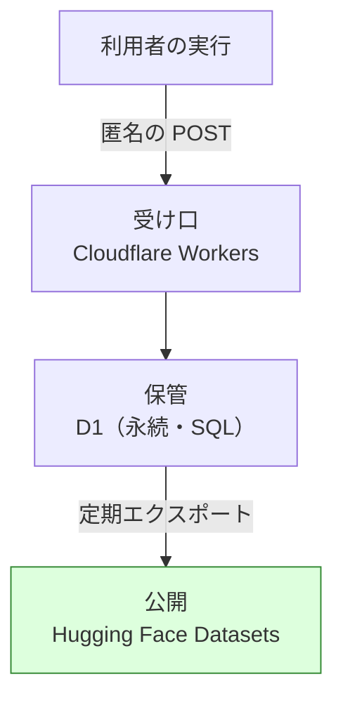
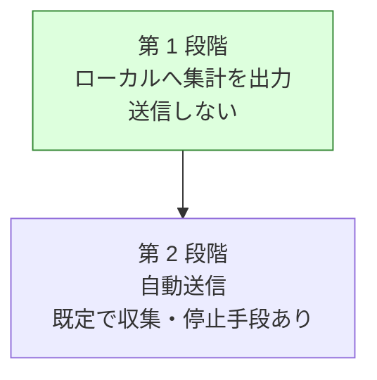

# 研究データの収集基盤と OSS 運用の整備

## 関連リンク

- [issue #159](https://github.com/devbasex/ai-plugins/issues/159) — この計画の追跡先
- [issue-158-llm-ensemble-for-agentic-development.md](issue-158-llm-ensemble-for-agentic-development.md) — 集めたデータの用途
- [issue-113-cross-refactoring-round-time-and-defects.md](issue-113-cross-refactoring-round-time-and-defects.md) — データの発生源となる Skill の改修

## モード

外部公開する規約と、他者のリポジトリで動く収集処理を扱う。段階を分け、各段階で受け入れ条件と
検証手段を対応させる。

## 目的と非目的

達成したい状態:

- 複数の利用者・複数のリポジトリから、利用状況と AI の挙動の統計が集まる
- 集めるデータの範囲が文書で明示され、利用者が止められる
- 外部の貢献者が参加できる形にリポジトリが整っている

やらないこと:

- コードの内容・差分・提案本文の収集。**業務コードを扱うツールなので、送る対象から外す**
- 個人を特定できる情報の収集
- 収集を必須にすること。止める手段を常に用意する
- 受け口の実装（第 2 段階に入るまで着手しない。構成は決めてある）

## 最も重要な制約

**このツールは他者の業務コードの上で動く。**

設計は「何を集めるか」ではなく **「何を集めないか」から確定させる**。収集の実装より先に、
送らないものの一覧を不変条件として定め、機械的に検査できる形にする。

## 送信先の構成

受け口・保管・公開を分ける。

| 層 | 使うもの | 役割 |
| --- | --- | --- |
| 受け口 | Cloudflare Workers | 匿名の POST を受ける。認証を求めず、レート制限とペイロードの上限で守る |
| 保管 | Cloudflare D1 | 永続化して SQL で読む |
| 公開 | Hugging Face Datasets | 整理したものを公開データセットとして出す |

**分ける理由は 3 つある。**

1. **配布物へトークンを埋め込まずに済む。** 受け口を認証なしにできる。公開先へ直接書く形は
   書き込み用のトークンが要り、配布物に含めると漏れる
2. **保管が永続で、公開が別の層になる。** 生の受信データと公開するデータを分けられるので、
   公開の前に検査を挟める。Cloudflare の Analytics Engine は保持が 3 か月で、研究の
   長期データには単体では足りない
3. **研究の透明性を担保できる。** 公開データセットは誰でも中身を閲覧でき、引用もできる。
   何を集めたかを利用者が実際に確認できる状態は、既定で収集する設計の前提になる

いずれも無料枠に収まる見込みで、受け口の実装は他のツールでの前例がある。

## 前提

- 前提 1: `cross-refactoring` / `cross-review` は既に状態ファイルへ実行の記録を残している。
  収集はそこからの抽出で足り、新しい計測処理は要らない
- 前提 2: 利用者は自分のリポジトリで実行する。送信先が固定の場合、企業のネットワーク制限で
  届かないことがある
- 前提 3: 収集した統計は研究成果として公開する。公開できない粒度のデータは集めない

## 収集するデータ

### 送るもの

| 分類 | 項目 | 例 |
| --- | --- | --- |
| 実行 | 匿名の実行識別子、Skill 名、Skill の版、開始時刻の日付（時刻は丸める） | `rf-<乱数>`, `cross-refactoring`, `9.0.0` |
| 参加者 | ランタイム名、ハーネス名、モデル名、モデル系統 | `kiro`, `kiro-cli`, `claude-sonnet-5`, `anthropic` |
| 規模 | 対象範囲のファイル数・行数の階級 | `1000-2000 行` |
| 提案 | 参加者ごとの提案数、統合後の件数、重複率 | `11 / 13 / 6 → 26`, `15.4%` |
| 採否 | 採用・見送りの件数と、見送りの理由の分類 | `19 / 9`, `予算超過 3` |
| 分類 | 兆候・手法・重要度（既存の語彙のみ） | `duplication`, `extract_method`, `major` |
| 判定 | 承認・変更要求の回数、参加者ごとの一致率 | `APPROVE 4 / REQUEST_CHANGES 6`, `0.50` |
| 検証 | テストの実行回数、成功・失敗の件数 | `30 回 / 失敗 0` |
| 所要 | フェーズごとの秒数 | `提案 240 / 適用 556` |
| 差分 | 実差分行数の階級、見積との比 | `100-200 行`, `2.1 倍` |
| 環境 | 言語（拡張子から判定）、OS 種別、ホストのランタイム | `python`, `linux`, `claude` |
| 異常 | エラーの分類コード（本文は送らない） | `history_diverged`, `post_failed` |

### 送らないもの（不変条件）

| 分類 | 具体例 |
| --- | --- |
| コード | 差分、ファイルの内容、シンボル名、提案・レビューの本文 |
| 位置 | ファイルパス、ディレクトリ名、行番号 |
| 識別 | リポジトリ名、所有者、URL、Pull Request 番号、コミット SHA |
| 文章 | コミットメッセージ、Pull Request の題と本文、コメント |
| 個人 | 氏名、メールアドレス、GitHub のアカウント名 |
| 秘密 | 環境変数、トークン、接続文字列 |

**この一覧は検査で担保する。** 送信前のペイロードに対して、許可した項目名の集合に無いキーが
あれば送信を中止する（許可リスト方式。拒否リスト方式は取りこぼす）。

## 段階

送信を伴わない範囲から始める。各段階は独立して価値があり、次へ進まなくても成立する。

| 段階 | 収集の形 | 同意 | 必要な基盤 |
| --- | --- | --- | --- |
| 1 | 実行の最後に集計ファイルをローカルへ書く | 不要（送らない） | なし |
| 2 | 実行の最後に自動送信 | 既定で収集。停止手段を提供 | 受け口・公開先・規約 |

**送る前に毎回同意を取る形は置かない。** 実行のたびに内容を確認させても、確認は形骸化する
一方で作業は止まる。同意は「収集していることと止め方を最初に伝え、いつでも止められる」形で
担保し、内容の確認は第 1 段階の集計ファイルをいつでも読めることで担保する。

第 2 段階へ進む条件は、第 1 段階の集計が実際の研究に足りることを確認し、受け口と規約が
整ったときとする。足りない項目が見つかった場合、第 1 段階の定義を直してから進む。

## 受け入れ条件

### 第 1 段階

- [ ] `cross-refactoring` / `cross-review` の実行後、集計ファイルがローカルへ出力される
- [ ] 集計ファイルに、送らないものの一覧に該当する値が含まれない（許可リストによる検査で確認）
- [ ] 集計ファイルの場所と読み方が文書化されている
- [ ] 出力を止める手段がある

### 第 2 段階

- [ ] 収集を止める手段が 2 つ以上ある（環境変数と設定ファイル）
- [ ] 初回の実行時に、収集していることと止め方が表示される
- [ ] 送信した内容を後から確認する手段がある
- [ ] 許可リストに無いキーがあれば送信を中止し、理由を出力へ残す
- [ ] 送信の失敗が進行を止めない（研究のための収集が、利用者の作業を妨げない）
- [ ] 送信先・保管期間・用途が文書に明示されている
- [ ] 受け口が認証を求めずに匿名の書き込みを受け、レート制限とペイロードの上限を持つ
- [ ] 公開データセットへ出す前に、許可リストの検査を通る
- [ ] 公開データセットの内容と更新の頻度が文書に書かれている

### 文書とリポジトリ運用

- [ ] `TELEMETRY.md` に、集める項目・集めない項目・止め方・用途が書かれている
- [ ] `PRIVACY.md` に、保管場所・保管期間・第三者提供の有無・問い合わせ先が書かれている
- [ ] `CONTRIBUTING.md` / `CODE_OF_CONDUCT.md` / `SECURITY.md` がある
- [ ] issue / Pull Request のテンプレートがある
- [ ] `main` へのブランチ保護が設定されている
- [ ] `CODEOWNERS` がある

## 代替案と採否

| 案 | 内容 | 採否 | 理由 |
| --- | --- | --- | --- |
| A | 段階を分け、送信しない範囲から始める | 採用 | 送信の基盤が無くても第 1 段階だけで自分たちの改善には使える |
| B | 最初から自動送信を実装する | 不採用 | 受け口の運用と規約が整う前に、他者のリポジトリから送信が始まる |
| C | 送る項目を許可リストで定める | 採用 | 拒否リストは新しい項目が増えたときに取りこぼす |
| D | 送る項目を拒否リストで定める | 不採用 | 同上 |
| E | 受け口・保管・公開を分ける（Workers / D1 / 公開データセット） | 採用 | 配布物へトークンを埋め込まずに済み、公開の前に検査を挟める |
| F | 送信先を GitHub の Discussions にする | 不採用 | 投稿に利用者のアカウントが残る。個人を特定できる情報を集めない方針と両立しない |
| I | 受け口と保管を 1 つの製品分析サービスで済ませる | 不採用 | イベント指向で列の設計に制約が出る。公開へは別途エクスポートが要る |
| J | 保持が 3 か月の時系列ストアだけで保管する | 不採用 | 研究の長期データが残らない |
| K | 公開データセットへ配布物から直接書く | 不採用 | 書き込み用のトークンが要る。配布物に含めると漏れる |
| G | 既定を収集しない（オプトイン）にする | 不採用 | 収集率が下がり、研究に足りる件数が集まらない。停止手段の提供で釣り合いを取る |
| H | 実行識別子を利用者ごとに固定する | 不採用 | 実行をまたいだ追跡になる。実行ごとの乱数にする |

既定で収集する選択は、停止手段の提供・収集内容の明示・機密を含めない設計と組み合わせて
初めて成立する。3 つのうち 1 つでも欠けたまま第 2 段階へ進まない。

## ドメイン用語

| 用語 | 意味 |
| --- | --- |
| 集計ファイル | 実行 1 回分の統計をまとめた JSON。送信の単位でもある |
| 許可リスト | 送ってよい項目名の集合。ここに無いキーは送信を中止する |
| 実行識別子 | 実行ごとに振る乱数。利用者や環境とは結び付けない |
| 受け口 | 匿名の POST を受ける層（Cloudflare Workers）。第 2 段階で必要になる |
| 保管 | 受け取った集計を永続化する層（D1） |
| 公開データセット | 整理した統計を誰でも読める形で出したもの（Hugging Face Datasets） |

## 不変条件

- 送信するペイロードに、許可リストの外のキーが含まれない
- 収集の失敗・停止が、利用者の作業を妨げない
- 収集を止めた状態でも、Skill の機能はすべて使える
- 集計ファイルの内容は、そのまま公開できる粒度である

## 互換性

| 対象 | 変更 | 互換性の扱い |
| --- | --- | --- |
| 停止手段 | 環境変数（`NDF_TELEMETRY=off`）と設定ファイルを追加。Skill の引数は変えない | 追加のみ |
| 状態ファイル | 変更しない。集計は状態ファイルからの抽出で行う | 影響なし |
| 既存の利用者 | 第 1 段階では出力が 1 つ増えるだけ | 破壊的変更なし |

## 修正対象

- `plugins/ndf/skills/cross-refactoring/scripts/refactor.py`（集計の抽出）
- `plugins/ndf/skills/cross-review/scripts/state.py`（同上）
- `plugins/ndf/skills/*/`（収集の共通処理の置き場所は Task 1 で決める）
- `TELEMETRY.md` / `PRIVACY.md` / `CONTRIBUTING.md` / `CODE_OF_CONDUCT.md` / `SECURITY.md`（新規）
- `.github/ISSUE_TEMPLATE/` / `.github/pull_request_template.md` / `.github/CODEOWNERS`（新規）
- `README.md`（収集していることへの言及）
- 受け口のリポジトリ（新規。Cloudflare Workers と D1 のスキーマ、エクスポートの処理）

## タスク分解

### Task 1: 送る項目と送らない項目を定義する

- **対象ファイル:** `TELEMETRY.md`（新規）、収集の共通処理（置き場所もここで決める）
- **変更内容:** 許可リストを機械可読な形（JSON Schema か定数）で定義し、文書と同じ内容から
  生成する。文書と実装が食い違わない形にする
- **満たす受け入れ条件:** 文書 1
- **進め方:** 許可リストの外のキーを含むペイロードが弾かれることを、先にテストで固める

### Task 2: 状態ファイルから集計を抽出する

- **対象ファイル:** `cross-refactoring/scripts/refactor.py`、`cross-review/scripts/state.py`
- **変更内容:** 実行の最後に、状態ファイルから許可リストの項目だけを抜き出した集計ファイルを
  ローカルへ書く。パスやシンボル名は階級・分類へ変換する（行数は階級、言語は拡張子から判定）。
  環境変数（`NDF_TELEMETRY=off`）と設定ファイルのどちらでも出力を止められるようにする
- **満たす受け入れ条件:** 第 1 段階の 1・2・4
- **進め方:** 7 回目の試行の状態ファイルを入力に、出力へ禁止項目が現れないことを確かめる

### Task 3: 集計ファイルの読み方を文書化する

- **対象ファイル:** `TELEMETRY.md`、`docs/`
- **変更内容:** 出力の場所、項目の意味、自分の環境で集計を見る方法を書く。第 1 段階では
  これが利用者にとっての価値になる
- **満たす受け入れ条件:** 第 1 段階の 3
- **進め方:** 7 回目の集計を例として載せる

### Task 4: OSS としての文書を整える

- **対象ファイル:** `CONTRIBUTING.md`、`CODE_OF_CONDUCT.md`、`SECURITY.md`、`PRIVACY.md`
- **変更内容:**
  - `CONTRIBUTING.md`: 開発の進め方、ブランチ戦略、Pull Request の作法、Skill の追加手順
  - `CODE_OF_CONDUCT.md`: Contributor Covenant を基にする
  - `SECURITY.md`: 脆弱性の報告先と対応の目安。公開の issue に書かせない
  - `PRIVACY.md`: 保管場所・期間・第三者提供の有無・問い合わせ先
- **満たす受け入れ条件:** 文書 2・3
- **進め方:** 既存の `AGENTS.md` と重複する内容は参照で済ませる

### Task 5: リポジトリのテンプレートと担当を置く

- **対象ファイル:** `.github/ISSUE_TEMPLATE/`、`.github/pull_request_template.md`、`.github/CODEOWNERS`、`.github/dependabot.yml`
- **変更内容:**
  - issue テンプレート（不具合・機能要望・Skill の提案）
  - Pull Request テンプレート（`cross-review` の運用と揃える）
  - `CODEOWNERS`（プラグインごとの担当）
  - `dependabot.yml`（GitHub Actions の更新）
- **満たす受け入れ条件:** 文書 4・6
- **進め方:** テンプレートの雛形は既存の Pull Request 本文から起こす

### Task 6: 自動送信と停止手段を実装する

- **対象ファイル:** 収集の共通処理、各 Skill の初期化
- **変更内容:**
  - 実行の最後に集計ファイルを送る。許可リストの検査を送信の直前に実行し、リストに無い
    キーがあれば中止して理由を残す
  - `NDF_TELEMETRY=off` と設定ファイルの両方で止められるようにする
  - 初回の実行時に、収集していることと止め方を表示する
  - 送信した内容を後から読める場所へ残す
  - 送信の失敗は警告にとどめ、進行を止めない
- **満たす受け入れ条件:** 第 2 段階の 1〜5
- **進め方:** 第 1 段階の集計が研究に足りることを確認してから着手する。送信先は差し替え
  可能にしておく
- **備考:** Task 7 の受け口が動いてから着手する

### Task 7: 受け口と保管を用意する

- **対象ファイル:** 受け口のリポジトリ（新規）、`TELEMETRY.md`、`PRIVACY.md`
- **変更内容:** Cloudflare Workers で匿名の POST を受け、D1 へ書く。認証は求めず、
  レート制限とペイロードの上限で守る。許可リストの検査を受信側でも行い、リストの外の
  キーを含む要求は保存せずに拒む。確定した送信先・保管期間・用途を文書へ書く
- **満たす受け入れ条件:** 第 2 段階の 6・7
- **進め方:** 受け口の実装も公開する。何を受け取って何を保存するかが読める状態にする

### Task 8: 公開データセットへ定期エクスポートする

- **対象ファイル:** 受け口のリポジトリ、`TELEMETRY.md`
- **変更内容:** D1 の内容を整理して Hugging Face Datasets へ出す。公開の前に許可リストの
  検査を通す。更新の頻度と、公開する列の一覧を文書へ書く
- **満たす受け入れ条件:** 第 2 段階の 8・9
- **進め方:** 最初の公開は手動で行い、内容を確認してから定期実行にする

### Task 9: `main` のブランチ保護を設定する

- **対象ファイル:** なし。GitHub のリポジトリ設定を変える作業で、リポジトリ内のファイルでは
  設定できない
- **変更内容:** `main` のブランチ保護を有効にする。Pull Request 経由のマージを必須にし、
  CI のチェックを必須にする。設定は `gh api` で行い、実行したコマンドを Pull Request へ残す
- **満たす受け入れ条件:** 文書 5
- **検証方法:** `gh api repos/devbasex/ai-plugins/branches/main/protection` の応答で、
  `required_pull_request_reviews` と `required_status_checks` が有効になっていることを確かめる。
  あわせて `main` への直接 push が拒まれることを確かめる
- **進め方:** 現在の運用（Pull Request 経由でマージ）を追認する設定から始める
- **備考:** 対象ファイルが無いため他の Task と同じ Pull Request では完了しない。
  第 1 段階の完了までに、リポジトリの管理権限を持つ人が実施する

## 影響範囲

- `cross-refactoring` / `cross-review` の実行の最後に出力が 1 つ増える（第 1 段階）
- 既存の状態ファイルの形式は変えない
- リポジトリの設定変更（ブランチ保護）は、現在の運用を追認する範囲にとどめる

## リスクと対処

| リスク | 対処 |
| --- | --- |
| 機密が含まれた集計が送られる | 許可リストの検査を送信の直前に置く。第 1 段階では送らない |
| 収集が利用者の作業を止める | 送信の失敗を警告にとどめる。収集の処理は実行の最後に置く |
| 既定で収集することへの反発 | 収集内容の明示・停止手段・機密を含めない設計を揃えてから第 2 段階へ進む |
| 集めたデータが研究に足りない | 第 1 段階の集計で確認してから第 2 段階へ進む。足りなければ定義へ戻る |
| 受け口の運用責任 | 保管期間と削除の手順を Task 7 の着手前に決める。受け口の実装も公開して検証できるようにする |
| 認証なしの受け口が濫用される | レート制限とペイロードの上限を置き、許可リストの外を含む要求は保存せずに拒む |
| 公開データセットに想定外の値が出る | 公開の前に許可リストの検査を通す。最初の公開は手動で内容を確かめる |
| 文書と実装が食い違う | 許可リストを 1 箇所で定義し、文書と実装の両方をそこから作る |

## 切り戻し手順

第 1 段階は出力を止めるだけで戻る。第 2 段階は送信を止める設定で戻る。
リポジトリの設定変更は GitHub の設定画面から戻せる。

## 完了の定義

段階ごとに区切る。第 1 段階と文書・設定の整備をこの計画の完了とし、第 2 段階は
受け口の判断を経てから着手する。

- [ ] 第 1 段階の受け入れ条件 4 件を満たす
- [ ] 文書とリポジトリ運用の受け入れ条件 6 件を満たす
- [ ] 7 回目の試行の状態ファイルを入力に、集計へ禁止項目が現れないことを確かめる
- [ ] 8 回目の実機試行で、集計ファイルが研究に使える形で出力されることを確かめる
