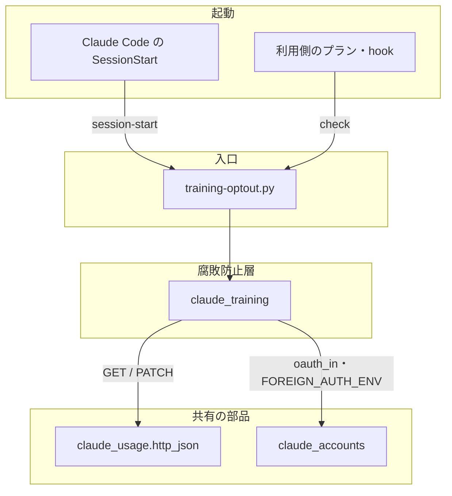
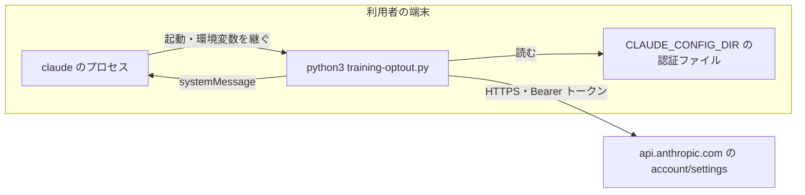
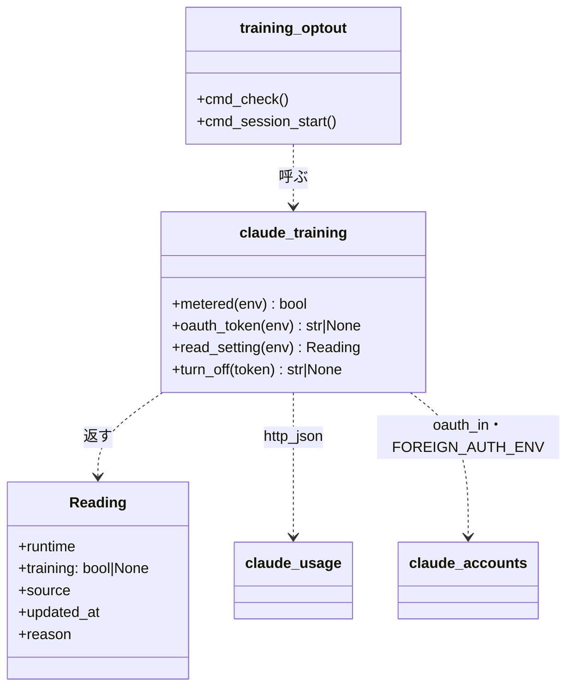
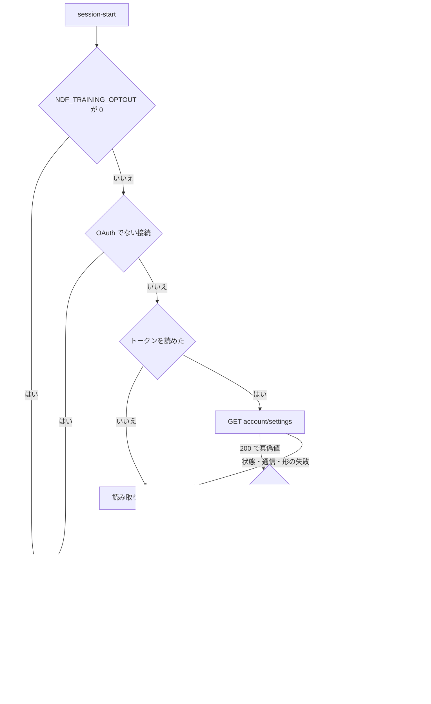

# #1597: 学習の設定の確認と、NDF のセッション開始での書き換え — 設計

**この文書は「どう作るか」だけを扱う。** 要求と受け入れ条件は #1597 の本文にある（コピーは
[issue-1597-requirements.md](issue-1597-requirements.md)）。他の文書は次のとおりである。

| 文書 | 中身 |
| --- | --- |
| [issue-1597-requirements.md](issue-1597-requirements.md) | 要求と受け入れ条件 |
| [issue-1597-design-decisions.md](issue-1597-design-decisions.md) | 決定の記録・テスト設計・未確認のまま残ること |

## 例: 学習の設定が On のアカウントで NDF のセッションを始めると

1. 利用者が `claude` を起動する。NDF の SessionStart の hook が
   `python3 "$CLAUDE_PLUGIN_ROOT/scripts/training-optout.py" session-start` を起動する
2. 環境変数 `NDF_TRAINING_OPTOUT` が `0` でない。`ANTHROPIC_API_KEY` も Bedrock の指定も無い（OAuth の起動）
3. `$CLAUDE_CONFIG_DIR/.credentials.json` の `claudeAiOauth.accessToken` を読み、
   `GET https://api.anthropic.com/api/oauth/account/settings` を送る。応答は `grove_enabled: true`
4. `PATCH` を本文 `{"grove_enabled": false}` で 1 回送る。応答は `202`
5. hook が `{"systemMessage": "[ndf] このアカウントの「Help improve our AI models」を Off にした …"}` を
   標準出力へ書き、終了コード 0 で終わる。利用者の画面に 1 行の知らせが出る
6. 次の起動では 3 の応答が `grove_enabled: false` になり、`PATCH` も知らせも出ない

利用側のリポジトリは、同じスクリプトの `check` をプランの段か hook から呼び、`status` が `ok` のときだけ
入力を渡す（「入出力の契約」の `check`）。

## ドメインモデル

### コンテキスト

| コンテキスト | 何の語が 1 つの意味に決まるか |
| --- | --- |
| NDF の学習の設定（`ndf-training-optout`） | 学習の設定・学習の設定の確認・学習の設定の書き換え・OAuth でない接続・書き換えの無効化 |

Anthropic のアカウントの設定（`account/settings`）とは**腐敗防止層**の関係を置く。上流は公開の API ではなく、
形が変わりうる（要求の前提 1）。`lib/claude_training.py` だけが応答の鍵（`grove_enabled`・`grove_updated_at`）を読み、
NDF の側の語（学習の設定・`training` の真偽値）へ変換する。応答の他の鍵（アカウントの識別子を含む）は読まずに捨てる。

### 集約

| 集約 | 持ち主（書き換えてよいもの） | 根 | エンティティ | 値オブジェクト |
| --- | --- | --- | --- | --- |
| 学習の設定 | `lib/claude_training.py` の `turn_off`（Anthropic 側の値を false へ書き換える唯一の経路） | 学習の設定（アカウントの `grove_enabled`） | — | 読んだ結果（`training`・`updated_at`・`reason`） |
| 起動の認証 | 持ち主なし（読むだけ。Claude Code が書く） | 起動の認証（`CLAUDE_CONFIG_DIR` と環境変数が決める） | — | OAuth のトークン・OAuth でない接続の指定 |

**学習の設定の持ち主は 1 つに決める。** `check` は読むだけで、書き換えるのは `session-start` が呼ぶ `turn_off` だけである。
**起動の認証は書かない。** トークンの更新は Claude Code が行う（要求の「含まない」）。

### 不変条件

| # | 集約 | 条件 | 破れたときの扱い |
| --- | --- | --- | --- |
| I1 | 学習の設定 | 読んだ結果の `training` は true / false / null の 3 つで、真偽値を読めなかったときは必ず null（「学習に使わない」と読ませない） | 応答の `grove_enabled` が真偽値でなければ null と理由を返す |
| I2 | 学習の設定 | 書き換えは true → false の向きだけで、読んだ値が true のときにだけ 1 回送る | false・null のときは `PATCH` を送らない。true へ書き換える経路を持たない |
| I3 | 学習の設定 | 書き換えの無効化（`NDF_TRAINING_OPTOUT=0`）のときは、`session-start` が読みも書きも送らない。`check` はこの変数を読まず、無効化のときも読み取りを送る（書き換えの無効化は確認を止めない） | `session-start` が環境変数を読んだ直後に終わる。無効化の判定は `training-optout.py` の `session-start` の入口に置き、`claude_training`（`read_setting`・`turn_off`）には置かない |
| I4 | 起動の認証 | OAuth でない接続（`claude_accounts.FOREIGN_AUTH_ENV` のどれかがある起動）では読みも書きも送らない | `check` は `training: null`・理由「OAuth でない接続」。`session-start` は何も出さずに終わる |
| I5 | 起動の認証 | トークンとアカウントの識別子を標準出力・標準エラー・`systemMessage`・例外の文言に出さない。応答の本文を出力へ写さない | 理由は HTTP の状態コードと例外の型名だけで作る |
| I6 | 学習の設定 | `session-start` はどの失敗でも終了コード 0 で終わり、セッションの開始を止めない | 予期しない例外も捕まえて失敗の知らせに変える |
| I7 | 起動の認証 | 実際の OAuth のトークンを送る先は `https://api.anthropic.com` だけ | 宛先は定数で持つ。試験用の環境変数（`NDF_TRAINING_SETTINGS_URL`）の差し替えは、ホストが手元（`127.0.0.1`・`::1`・`localhost`）の URL だけを受ける。照合は `urllib.parse.urlsplit` で取り出した `hostname` 成分（小文字化済み）が `127.0.0.1`・`::1`・`localhost` のどれかに完全一致するかだけで決め、URL の文字列への部分一致・前方一致を使わない。スキームは `http` か `https` に限り、userinfo（`@` の前）を持つ URL は受けない。パス・クエリ・userinfo に許可語が含まれても受ける理由にしない（`http://127.0.0.1.evil.example/`・`http://localhost.evil.example/`・`http://localhost@evil.example/`・`http://evil.example/?h=127.0.0.1` はどれも受けない）。それ以外の値が入っていれば、`check`・`session-start` ともトークンを読まず何も送らず、読み取りの失敗（理由「試験用の宛先が手元でない」）として扱う |

### ドメインイベント

| # | イベント | 発生元 | 受け手 |
| --- | --- | --- | --- |
| E1 | NDF を読み込んだ Claude Code のセッションが始まった | Claude Code（SessionStart の `startup` / `resume`） | `training-optout.py session-start` |
| E2 | 書き換えの動作が外されていると分かった | `session-start`（環境変数を読む） | なし（何も出さずに終わる） |
| E3 | OAuth のトークンを読んだ | `claude_training.oauth_token` | `claude_training.read_setting` |
| E4 | 学習の設定を読んだ | `claude_training.read_setting` | `session-start`（E5 か E6 へ分ける）・`check`（E9） |
| E5 | 学習の設定が既に false だと分かった | `session-start` | なし（何も出さずに終わる） |
| E6 | 学習の設定を false へ書き換えた | `claude_training.turn_off` | `session-start`（E8） |
| E7 | 書き換えか読み取りに失敗したことを利用者へ知らせた | `session-start` | 利用者（`systemMessage`） |
| E8 | 書き換えたことを利用者へ知らせた | `session-start` | 利用者（`systemMessage`） |
| E9 | 学習の設定の確認を返した | `training-optout.py check` | 利用側のプランか hook（1 行の JSON と終了コード） |

### 用語

| 用語 | 意味 | 用語集への反映 |
| --- | --- | --- |
| 学習の設定 | アカウントの「Help improve our AI models」。account/settings の grove_enabled で、true なら入力を学習に使う | 追加済み（要求） |
| 学習の設定の確認 | 学習の設定を読み、1 行の JSON で返すこと（check）。書き換えない | 追加済み（要求） |
| 学習の設定の書き換え | NDF のセッションの開始で、true の学習の設定を false にすること | 追加済み（要求） |
| 書き換えの無効化 | 利用者が環境変数 NDF_TRAINING_OPTOUT=0 で学習の設定の書き換えを止めること。確認（check）は止めない | 追加 |
| OAuth でない接続 | `claude_accounts.FOREIGN_AUTH_ENV` の変数（`ANTHROPIC_API_KEY`・`ANTHROPIC_AUTH_TOKEN`・`CLAUDE_CODE_USE_BEDROCK`・`CLAUDE_CODE_USE_VERTEX`）のどれかが空でない起動。この接続には学習の設定が無い。用語集の `ndf-relay` の「従量の接続」（Bedrock か API キーに限る）とは範囲が違うため、その語を使わない | 追加 |

## 機能一覧

| # | 機能 | 誰が使うか |
| --- | --- | --- |
| F1 | 学習の設定を確かめ、1 行の JSON と終了コードで返す（claude は読み取り、codex / kiro / agy は `unsupported`） | 利用側のリポジトリのプラン・hook |
| F2 | NDF のセッションの開始で、学習の設定が true なら false へ書き換えて知らせる | Claude Code（SessionStart の hook）・利用者（知らせを読む） |
| F3 | 読み取りか書き換えに失敗したことを知らせ、セッションを続ける | 利用者 |
| F4 | 書き換えの動作を外す | 利用者（環境変数か `settings.json` の `env`） |
| F5 | 実験版を本体へ移し、実験版と台帳の行を片付ける | NDF の開発者 |

## 構成要素

| 要素 | 変更 | 責務 |
| --- | --- | --- |
| `plugins/ndf/scripts/training-optout.py` | 新規（実験版から移す） | 2 つの副命令の入口。`check` は F1 の 1 行の JSON（`lib/step_result.py` の形）と終了コード、`session-start` は F2〜F4 の判定と `systemMessage` の組み立て。標準ライブラリだけで書き、`python3` で直に動く |
| `plugins/ndf/scripts/lib/claude_training.py` | 新規 | 腐敗防止層。OAuth でない接続の判定・トークンの読み・`GET` と `PATCH`・応答から `training` への変換。出力はしない（値を返すだけ） |
| `plugins/ndf/scripts/lib/claude_usage.py` | 変更 | `_http` を公開名 `http_json` にし、`method` と JSON の本文を渡せるようにする。呼び出し元（`get_usage`・`refresh_oauth`）は名前を直すだけで振る舞いを変えない |
| `plugins/ndf/scripts/lib/claude_accounts.py` | 変更 | 設定ディレクトリを受けて `claudeAiOauth` を返す `oauth_in(config_dir)` を足し、`_oauth(name)` をその呼び出しにする |
| `plugins/ndf/hooks/claude.json` | 変更 | SessionStart の `startup\|resume` の群に `training-optout.py session-start` の hook を 1 つ足す（`timeout` 10） |
| `plugins/ndf/scripts/tests/test_training_optout.py` | 新規（実験版のテストを移して足す） | テスト設計の行（[テスト設計](issue-1597-design-decisions.md)）を縛る |
| `plugins/ndf/scripts/experimental/training-optout.py` | 削除 | 本体へ移したため消す（PR #1606 が未マージなら作らない） |
| `plugins/ndf/scripts/experimental/README.md` | 変更 | `training-optout.py` の節を消す（PR #1606 が足した節） |
| `docs/ndf-experiments.md` | 変更 | `training-optout.py` の行の「行き先」に本体の置き場を書く |
| `plugins/ndf/README.md` | 変更 | SessionStart の節に書き換えと知らせを足し、外す手段と、利用側が `check` を hook・プランから呼ぶ例を書く |
| `CHANGELOG.md` | 変更 | 開発版の節に 1 行 |

**変えない構成要素**: `hooks/codex.json`・`dev.agy/hooks.json`・`dev.kiro`（書き換えは Claude Code だけ。要求の「含まない」）。
`hook.py` とその環境（`$HOME/.cache/ndf/roots…/bin/python`）も使わない（[決定の記録](issue-1597-design-decisions.md)の決定 1）。

### 構成要素図



図に含めないもの: テスト・利用者向けの文書（README・CHANGELOG・台帳）・実験版の削除。hook の定義（`hooks/claude.json`）は
「Claude Code の SessionStart」の箱が表す。

### 文脈と配置



- **境界をまたぐのは、トークン（`Authorization` の見出し）と本文 `{"grove_enabled": false}` だけである。** 応答の本文は
  プロセスの外へ出さない
- `claude -p` の worker も同じ形で動く。SessionStart の `startup` が `-p` でも起き、`settings.json` の `env` と
  relay の `CLAUDE_CONFIG_DIR`（アカウントの設定ディレクトリ）が hook へ届くことを 2026-10-02 に実測した
  （`claude -p --settings` で `env` に目印を置き、hook が `env` を書き出した。`source` は `startup`）

### 置き場所

```text
plugins/ndf/
├── hooks/claude.json                  # 変更: SessionStart の startup|resume の群に 1 つ足す
└── scripts/
    ├── training-optout.py             # 新規（experimental/ から移す）
    ├── experimental/
    │   ├── README.md                  # 変更: training-optout の節を消す
    │   └── training-optout.py         # 削除
    ├── lib/
    │   ├── claude_training.py         # 新規
    │   ├── claude_usage.py            # 変更: _http → http_json
    │   └── claude_accounts.py         # 変更: oauth_in を足す
    └── tests/test_training_optout.py  # 新規（移して足す）
```

検査の手段: `claude plugin validate .`（hook の定義）・`plugins/ndf/scripts/tests/test_experimental.py`（既定で動くものから
`experimental/` を参照しない）・`python3 scripts/check-script-structure.py`（hook の command に `uv run` を挟まない）。

## 構造



| 型・関数 | 責務 | 失敗の形 |
| --- | --- | --- |
| `Reading`（`dataclass`・不変） | 読んだ結果の値オブジェクト。`to_item()` が `check` の `items[]` の 1 要素を返す | — |
| `metered(env)` | `claude_accounts.FOREIGN_AUTH_ENV` のどれかが空でなければ真 | 例外を出さない |
| `oauth_token(env)` | `CLAUDE_CODE_OAUTH_TOKEN` → `oauth_in(CLAUDE_CONFIG_DIR か ~/.claude)` の `accessToken` → macOS のキーチェーン（下の注）の順に読む | 読めなければ None |
| `read_setting(env)` | OAuth でない接続・トークン無し・HTTP の失敗・形の違いを `Reading(training=None, reason=…)` に変える | 例外を出さない。`reason` は I5 の形だけ |
| `turn_off(token)` | `PATCH` を 1 回送る。2xx なら None、そうでなければ理由の文字列 | 例外を出さない |
| `training_optout.cmd_check` | `--runtime` ごとに `read_setting` か `unsupported` を並べ、終了コードを決めて 1 行の JSON を出す | 終了コード 0 / 1 / 3（「入出力の契約」） |
| `training_optout.cmd_session_start` | 処理の流れの判定を行い、知らせがあれば `{"systemMessage": …}` を 1 行出す | 常に終了コード 0（I6） |

**`read_setting` と `turn_off` はトークンを引数で受け、戻り値に含めない。** `session-start` は読んだトークンを
`turn_off` へ渡すため、`read_setting` の内部でトークンを読む形にせず、`oauth_token` の結果を両方へ渡す。
`check` は `read_setting(env)` の中でトークンを読む（呼び出しの形の細部は `tdd-cycle` で決める）。

**macOS のキーチェーン**: `sys.platform == "darwin"` で、認証ファイルが無く、`CLAUDE_CONFIG_DIR` が無いときだけ、
`security find-generic-password -s "Claude Code-credentials" -w` を打ち切り 2 秒で 1 回起動し、出力の JSON の
`claudeAiOauth.accessToken` を読む。読めなければ None（「確かめられない」）。実物で確かめていない
（[未確認のまま残ること](issue-1597-design-decisions.md)）。

## 入出力の契約

### `training-optout.py check`

| 項目 | 内容 |
| --- | --- |
| 名前 | `python3 "$SCRIPTS/training-optout.py" check [--runtime claude\|codex\|kiro\|agy]...` |
| 入力 | `--runtime` は繰り返してよい。省くと `claude`。重複は 1 つにする。環境変数は「認証の読み方」の表 |
| 出力 | `lib/step_result.py` の形の 1 行の JSON（下の例） |
| 失敗の形 | 下の終了コードの表。HTTP の失敗・認証が無い・形の違い・`unsupported` は `training: null` と `reason` |
| 互換性 | 実験版（PR #1606）の出力の形・終了コードと同じ。変わるのは置き場（`experimental/` → `scripts/`）だけ |

```json
{"tool": "training-optout", "status": "ok", "summary": "学習に使わない設定: claude",
 "items": [{"runtime": "claude", "training": false, "source": "oauth/account/settings.grove_enabled",
            "updated_at": "2026-10-02T01:23:45Z", "reason": null}], "metrics": {}}
```

| 状態 | `status` | 終了コード | `items[].training` |
| --- | --- | ---: | --- |
| すべてが false | `ok` | 0 | false |
| どれかが true（null は無い） | `stopped` | 1 | true を含む |
| どれかが null（確かめられない） | `stopped` | 3 | null を含む |

**読み手は `status == "ok"` のときだけ「学習に使わない」と扱う。** null を含む結果を「学習に使わない」と読ませない（I1）。

`reason` の値（I5 により、状態コードと型名のほかに可変の文字列を含めない）:

| 場合 | `reason` |
| --- | --- |
| OAuth でない接続 | `OAuth でない接続（API キー・認証トークン・Bedrock・Vertex）` |
| トークンが無い | `OAuth のトークンが無い` |
| HTTP の状態が 200 でない | `HTTP <状態コード>` |
| 通信の失敗 | `通信の失敗` |
| 応答に真偽値が無い | `応答に grove_enabled の真偽値が無い` |
| 試験用の差し替えが手元でない（I7） | `試験用の宛先が手元でない` |
| codex / kiro / agy | `unsupported` |

### `training-optout.py session-start`

| 項目 | 内容 |
| --- | --- |
| 名前 | `python3 "$ROOT/scripts/training-optout.py" session-start`（SessionStart の hook から） |
| 入力 | 標準入力の hook の JSON は読まない（`source` で分けない。matcher が `startup\|resume` に絞る）。環境変数だけを読む |
| 出力 | 知らせがあるときだけ標準出力へ `{"systemMessage": "<文面>"}` を 1 行。知らせが無ければ何も出さない |
| 失敗の形 | 終了コードは常に 0（I6）。標準エラーへは何も出さない |
| 互換性 | 新規 |

知らせの文面（`[ndf]` で始める。`<理由>` は `check` の `reason` と同じ語）:

| 場合 | 知らせ |
| --- | --- |
| true → `PATCH` が 2xx | `[ndf] このアカウントの「Help improve our AI models」を Off にした（入力を学習に使わない設定）。外すには NDF_TRAINING_OPTOUT=0 を設定する` |
| 読み取りの失敗（トークンが無い・HTTP・通信・形） | `[ndf] 学習の設定を確かめられなかった（<理由>）。「学習に使わない」とは扱わない。止めるには NDF_TRAINING_OPTOUT=0` |
| 書き換えの失敗（`PATCH` が 2xx 以外・通信） | `[ndf] 学習の設定を Off にできなかった（<理由>）。設定画面の「Help improve our AI models」を確かめる。止めるには NDF_TRAINING_OPTOUT=0` |
| 既に false・無効化・OAuth でない接続 | 出さない |

### hook の定義

`hooks/claude.json` の SessionStart の `"matcher": "startup|resume"` の群（relay の hook がある群）の `hooks` に足す。

```json
{
  "type": "command",
  "command": "sh -c 'ROOT=\"${CLAUDE_PLUGIN_ROOT:-${PLUGIN_ROOT:-}}\"; [ -n \"$ROOT\" ] || exit 0; command -v python3 >/dev/null 2>&1 || exit 0; python3 \"$ROOT/scripts/training-optout.py\" session-start; exit 0'",
  "description": "NDF: turn off 'Help improve our AI models' for this account (NDF_TRAINING_OPTOUT=0 to skip)",
  "timeout": 10,
  "continueOnError": true,
  "suppressOutput": false
}
```

### 認証の読み方と環境変数

| 変数 | 読む側 | 意味 |
| --- | --- | --- |
| `NDF_TRAINING_OPTOUT` | `session-start` | `0` なら書き換えの無効化（I3）。他の値・未設定は有効。`check` は読まない |
| `ANTHROPIC_API_KEY`・`ANTHROPIC_AUTH_TOKEN`・`CLAUDE_CODE_USE_BEDROCK`・`CLAUDE_CODE_USE_VERTEX` | 両方 | どれかが空でなければ OAuth でない接続（I4。`claude_accounts.FOREIGN_AUTH_ENV` をそのまま使う） |
| `CLAUDE_CODE_OAUTH_TOKEN` | 両方 | あれば最優先のトークン |
| `CLAUDE_CONFIG_DIR` | 両方 | 認証ファイルの置き場（無ければ `~/.claude`）。relay のアカウントの切り替えはこの値で効く |
| `NDF_TRAINING_SETTINGS_URL` | 両方 | 試験用に宛先を差し替える。ホストが手元（`127.0.0.1`・`::1`・`localhost`）の URL だけを受け、それ以外ならトークンを読まず何も送らない（I7） |

## 処理の流れ



- **`PATCH` の後に読み直さない。** 反映は次の起動の読み取りが確かめる（[決定の記録](issue-1597-design-decisions.md)の決定 5）
- **予期しない例外は失敗の知らせに変える**（理由は例外の型名だけ）。知らせの出力自体が失敗したら何もせずに終わる（要求の E7）
- `check` の流れは、上の `GET` までを `--runtime claude` について行い、結果を「入出力の契約」の表で終了コードへ写す

## 非機能の実現方式

| 大項目 | 要求の条件 | 実現方式 | 確かめ方 |
| --- | --- | --- | --- |
| 可用性 | どの失敗でも hook は終了コード 0 で終わり、セッションの開始を止めない | `cmd_session_start` の全体を例外の捕捉で包み、終了コードを 0 に固定する。hook の command も `; exit 0` で終え、`python3` が無ければ何もしない。`continueOnError: true` | 各失敗の経路と、`claude_training` の関数が例外を投げるよう差し替えた場合に、終了コード 0 を見るテスト |
| 性能・拡張性 | hook の 1 回の実行は hook の `timeout` に収まる。読み書きの HTTP には打ち切りの時間を置き、その合計が `timeout` を超えない | hook の `timeout` を 10 秒、HTTP の打ち切りを 1 回 3 秒（`GET` と `PATCH` で最大 6 秒）、キーチェーンの起動を 2 秒とする。合計の最大は 8 秒で、`python3` の起動を足しても 10 秒に収まる | 応答を返さない偽の宛先で、`session-start` が 7 秒以内に終わり終了コード 0 を返すテスト |
| セキュリティ | トークンは環境変数か認証ファイルから読むだけで、書き出さない。出力とログにトークンとアカウントの ID を出さない。送り先は `api.anthropic.com` だけ | トークンは `Authorization` の見出しにだけ置く。`reason` と知らせは表の固定の文面と状態コード・型名だけで作り、応答の本文を写さない。ログのファイルは作らない。宛先は定数（試験用の差し替えだけ環境変数で、手元のホストに限る。I7） | トークンと応答（識別子の鍵）に目印の文字列を入れ、標準出力・標準エラーに目印が現れないことを見るテスト。I7 の例に挙げた手元に似せた URL のそれぞれで、トークンを読まず何も送らないことを見るテスト |
| システム環境 | Claude Code の SessionStart の hook として動く。codex / kiro / agy では書き換えない | hook を `hooks/claude.json` にだけ置く。`check --runtime codex\|kiro\|agy` は `unsupported` | `claude plugin validate .` の終了コード 0。`hooks/codex.json` と `dev.agy/hooks.json` に `training-optout` が無いことを見るテスト |
