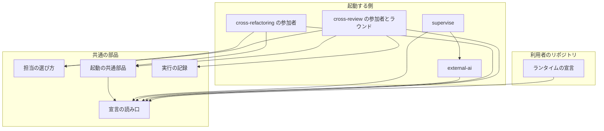
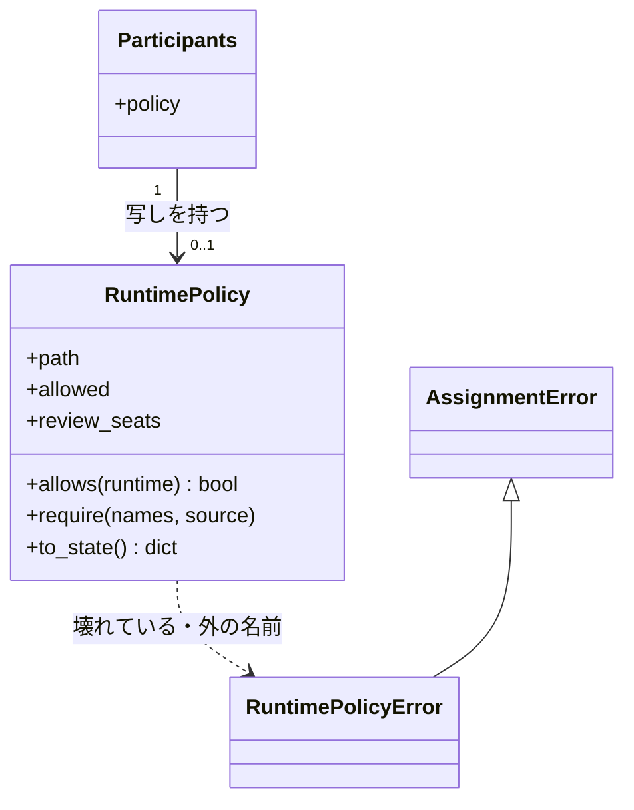
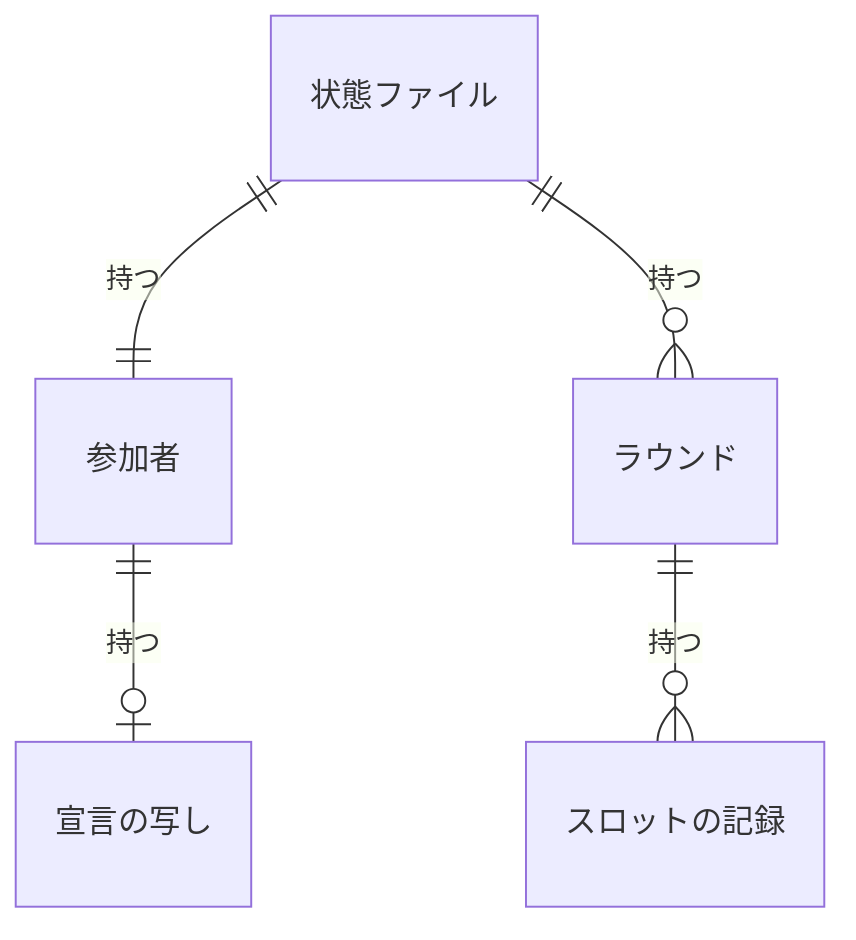
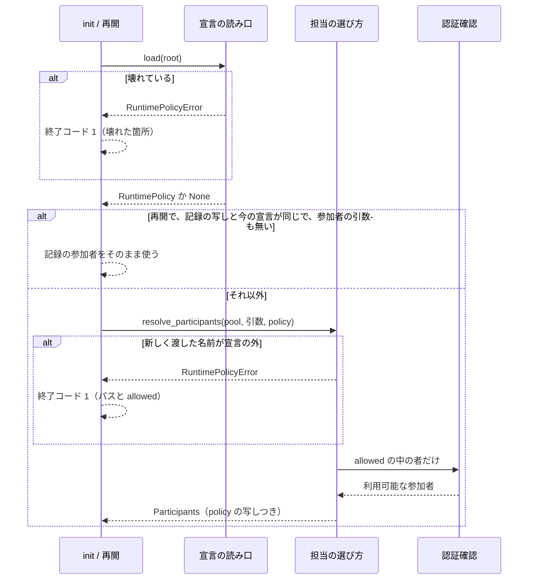
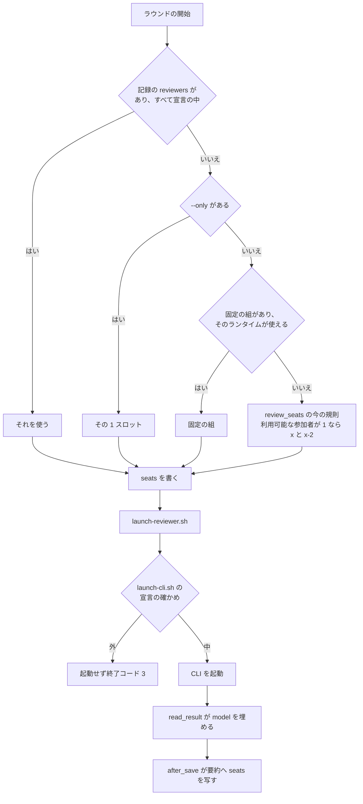
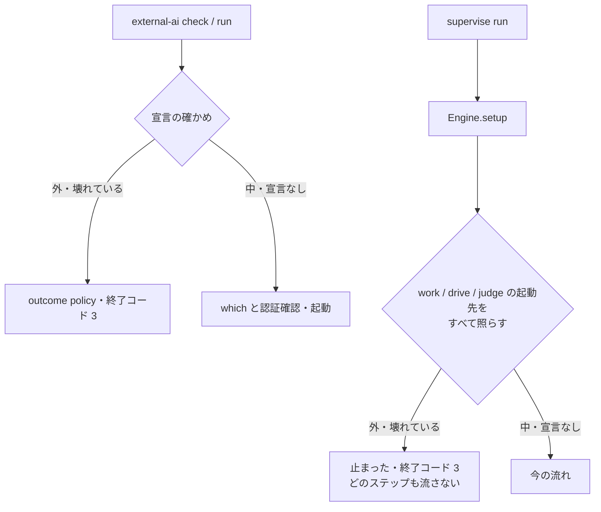

# #1598: 使ってよいランタイムを `.ndf/runtimes.json` で宣言し、起動の選び方と最後の起動の前で従わせる

要求と受け入れ条件は #1598 の本文にある（コピーは `issues/issue-1598-requirements.md`）。この文書は「どう作るか」だけを扱う。

## 例: claude だけを使ってよいリポジトリ

利用者が次の 1 ファイルを置く。

```json
{"allowed": ["claude"]}
```

置いた後の振る舞いは次のとおりである。

| 操作 | 今 | 宣言の後 |
| --- | --- | --- |
| 引数なしの `/ndf:cross-review 123`（ホストは claude） | 参加者プールは claude / codex / kiro。ラウンドごとに 2 者が交代する | 参加者プールは claude だけ。各ラウンドのスロットは `claude` と `claude-2`。codex・kiro は認証確認も起動しない |
| `/ndf:cross-review 123 --include codex` | codex を足す | `init` が終了コード 1 で止まり、「codex は宣言の外（.ndf/runtimes.json の allowed: claude）」と出す |
| `external-ai.py run codex ...` | codex を起動する | 起動せずに `outcome: policy`・終了コード 3 で止まる |
| supervise のプランの `"runtime": "kiro"` の work ステップ | kiro を external-ai で起動する | プランの読み込みで「止まった」になり、どのステップも流さない |
| `run_metrics.py aggregate --kind cross-review --by pair` | — | `claude+claude` の行にラウンド数が出る |

複数のランタイムを使ってよいリポジトリが、同じランタイムの組を選ぶときは次の形にする（AC6）。

```json
{"allowed": ["claude", "codex", "kiro"], "review_seats": ["claude", "claude-2"]}
```

## ドメインモデル

### コンテキスト

| コンテキスト | 何の語が 1 つの意味に決まるか |
| --- | --- |
| エージェントの CLI（`ndf-agent-cli`） | ランタイム・ホスト・参加者プール・スロット・ランタイムの宣言・レビューの組 |
| 実行の記録（`ndf-workflow` のうち `run_metrics`） | 実行の要約・組ごとの集計 |

エージェントの CLI が供給者、実行の記録が顧客の関係（顧客 / 供給者）。実行の記録は、cross-review の状態ファイルのラウンドに書かれたスロットの記録（E7）だけを受け、選び方の規則は持たない。

### 集約

| 集約 | 持ち主（書き換えてよいもの） | 根 | エンティティ | 値オブジェクト |
| --- | --- | --- | --- | --- |
| ランタイムの宣言 | 利用者（NDF は読むだけ。前提 1） | 宣言（`.ndf/runtimes.json`） | — | 使ってよいランタイムの一覧・固定の組 |
| 参加者 | cross-review / cross-refactoring の `init` と再開（`assignment.resolve_participants` を通す） | 状態ファイルの `participants` | — | 宣言の写し・利用可能な参加者・使えない者 |
| ラウンドのスロット | cross-review の `start_round` と `read_result` | 状態ファイルの `rounds[i]` | スロットの記録（`seats[j]`） | スロット名・ランタイム・モデル・組の相手 |
| 実行の要約 | `run_metrics.after_save` | 要約の JSON | ラウンド | スロットの記録の写し |

参加者とラウンドのスロットは、宣言を ID（ファイルのパス）と写しで参照し、宣言を書き換えない。

### 不変条件

| # | 集約 | 条件 | 破れたときの扱い |
| --- | --- | --- | --- |
| I1 | ランタイムの宣言 | `allowed` は空でなく、`ALL_RUNTIMES` の名前だけを重ねずに持つ。知らないキーを持たない | 宣言が壊れているとして、読んだ側が CLI を起動せずに止まる（前提 7） |
| I2 | ランタイムの宣言 | `review_seats` は書くなら 2 つの異なるスロット名で、どちらのランタイムも `allowed` にある | I1 と同じ |
| I3 | 参加者 | 宣言があるとき、参加者プール・利用可能な参加者・使えない者・認証確認の対象は `allowed` の中だけにある | 新しく渡した `--include` / `--only` / `--implementer` が外にあれば、参加者を決める前に止まる。再開で記録から引き継いだ外の名前は、知らせて落とす |
| I4 | ラウンドのスロット | 宣言があるとき、これから起動するラウンドのスロットのランタイムはすべて `allowed` にある。完了したラウンドの記録は今の `allowed` で検査しない（宣言を後から絞っても、過去のラウンドは書き換えず、再開も止めない） | これから起動するスロットを選び直す。選べなければ止まる |
| I5 | （起動） | 宣言の外のランタイムの CLI を、NDF は 1 度も起動しない | 起動の共通部品（`lib/launch-cli.sh`）と external-ai が起動の前で止まる |
| I6 | ラウンドのスロット | 2 スロットのラウンドでは、各スロットの記録の組の相手がもう一方のスロット名である。1 スロットのラウンド（`--only`）では `null` | 記録を書く側の誤り。テストで縛る |
| I7 | 実行の要約 | スロットの記録の無いラウンドも集計から落とさず、組を「不明」として数える | 集計の誤り。テストで縛る |

### ドメインイベント

| # | イベント | 発生元 | 受け手 |
| --- | --- | --- | --- |
| E1 | 利用者がランタイムの宣言を書いた | 利用者 | E2 の読み手すべて |
| E2 | ランタイムの宣言を読んだ | `runtime_policy.read_policy` | cross-review / cross-refactoring の `init`・再開、external-ai、supervise、起動の共通部品 |
| E3 | 参加者を決めた | `assignment.resolve_participants` | 状態ファイルの `participants` |
| E4 | 認証を確かめた | `auth.probe_auth`（E3 の中） | 参加者 |
| E5 | ラウンドのスロットを決めた | `participants._round_reviewers` | `start_round` |
| E6 | スロットの CLI を起動した | `launch-reviewer.sh` → `lib/launch-cli.sh` | 監視 |
| E7 | ラウンドのスロット・ランタイム・モデル・組の相手を記録した | `start_round`（モデル以外）と `read_result`（モデル） | 状態ファイル |
| E8 | 実行の要約を書いた | `run_metrics.after_save` | 要約の置き場 |
| E9 | 組ごとに集計した | `run_metrics.py aggregate --by pair` | 利用者 |
| E10 | worker / external-ai の起動先を決めた | supervise の `Engine.setup`、`external-ai.py` の `precheck` | 利用者（止まった理由） |

### 用語

| 用語 | 意味 | 用語集への反映 |
| --- | --- | --- |
| ランタイムの宣言 | `.ndf/runtimes.json`。NDF が CLI として起動してよいランタイムの一覧（`allowed`）と、cross-review の固定の組（`review_seats`）を持つ。無ければ制限しない | 意味の変更（置き場とキーの名前を足し、`pending_source` を `issues/issue-1598-design.md` へ。`source` へは確定仕様へ移すときに変える） |
| レビューの組 | cross-review の 1 ラウンドの 2 スロットのランタイムを辞書順に `+` でつないだもの（`claude+claude`・`claude+codex`）。組ごとの集計の単位 | 意味の変更（つなぎ方を足し、`pending_source` を `issues/issue-1598-design.md` へ。`source` へは確定仕様へ移すときに変える） |
| 固定の組 | ランタイムの宣言の `review_seats`。毎ラウンドのスロットを交代させずにこの 2 つにする | 追加 |

## 機能一覧

| # | 機能 | 誰が使うか |
| --- | --- | --- |
| F1 | 使ってよいランタイムを `.ndf/runtimes.json` に宣言する | 利用側のリポジトリの持ち主 |
| F2 | cross-review / cross-refactoring の参加者を宣言の範囲で決め、外の名前の引数を止める | cross-review / cross-refactoring を起動する人と conductor |
| F3 | 宣言で使えるランタイムが 1 つのとき、cross-review の 2 スロットを同じランタイムの 1 つ目と 2 つ目で埋める | 同上 |
| F4 | 宣言の固定の組で、cross-review のスロットを毎ラウンド同じ 2 つにする | 同上 |
| F5 | external-ai と supervise の worker が宣言の外のランタイムを起動しない | external-ai を呼ぶ Skill・エージェント、supervise のプランの書き手 |
| F6 | 宣言の外のランタイムの CLI を、どの経路からも起動しない（最後の起動の前で止める） | すべての起動する側 |
| F7 | ラウンドごとのスロット・ランタイム・モデル・組の相手を記録し、組ごとに集計する | 組の効果を比べる人 |

## 構成要素

| 要素 | 責務 | 作る / 変える |
| --- | --- | --- |
| 宣言の読み口（`scripts/lib/runtime_policy.py`） | `.ndf/runtimes.json` を探して読み、I1・I2 を確かめ、`RuntimePolicy` か `None` を返す。壊れていれば `RuntimePolicyError`。外の名前を渡されたら理由の文（パスと `allowed` を含む）を作る。`check <runtime> --root <dir>` の CLI も持つ | 作る |
| 担当の選び方（`scripts/lib/assignment.py`） | `resolve_participants` が宣言を受け、プールを `allowed` で絞り、新しく渡した外の名前で止まる。`review_seats` が固定の組を受ける。`Participants` に宣言の写しを足す | 変える |
| cross-review の参加者（`review_lib/participants.py`・`commands/init.py`） | `init` と再開で宣言を読み、`resolve_participants` へ渡す。再開では記録の宣言の写しと今の宣言が違えば参加者を作り直す。`_round_reviewers` が記録のスロットに外の者があれば選び直す | 変える |
| cross-review のラウンドの記録（`commands/start_round.py`・`commands/read_result.py`） | `start_round` が `rounds[i].seats` を書き、`read_result` がそのスロットのモデルを埋める | 変える |
| cross-refactoring の参加者（`refactor_lib/commands/setup.py`） | `init` と再開で宣言を読み、`resolve_participants` へ渡す。`--implementer` が外なら止まる | 変える |
| 起動の共通部品（`scripts/lib/launch-cli.sh`） | CLI を起動する直前に `runtime_policy.py check` を打ち、0 以外なら起動せずに終了コード 3 で終わる | 変える |
| external-ai（`skills/external-ai/scripts/external-ai.py`） | `precheck` の最初に宣言を確かめ、外なら起動結果 `policy`・終了コード 3 | 変える |
| supervise（`supervise_lib/engine.py` の `setup`） | プランの work / drive / judge ステップの起動先（`runtime` が無いか `claude-p`、`"full": true` の work、judge のステップなら claude）をすべて宣言と照らし、外があれば「止まった」を返す。ステップを通らずに claude を直接起動する呼び出し（`on_fail` の judge・遅れの判定・PR の本文）は、共通の口（`PolicyClaudeRunner.call`）が起動の前に照らし、外なら起動せずに失敗を返す | 変える |
| 実行の記録（`scripts/lib/run_metrics.py`） | 要約のラウンドへ `seats` を写す。`aggregate --by pair` で組ごとのラウンド数を出す | 変える |
| 文書 | cross-review / cross-refactoring / external-ai の SKILL.md と docs、`docs/specifications/cross-review-participants-and-seats.md`、`scripts/lib/README.md`、supervise の手順、用語集 | 変える |



### 置き場所

```text
plugins/ndf/scripts/
├── lib/
│   ├── runtime_policy.py        # 新設
│   ├── assignment.py
│   ├── launch-cli.sh
│   └── run_metrics.py
├── supervise_lib/engine.py
└── tests/test_runtime_policy.py # 新設
plugins/ndf/skills/
├── cross-review/scripts/review_lib/{participants.py,commands/init.py,commands/start_round.py,commands/read_result.py}
├── cross-refactoring/scripts/refactor_lib/commands/setup.py
└── external-ai/scripts/external-ai.py
```

表の「文書」は処理の流れの図に含めない。配布物（`dev.agy/` など）への写しは `bash scripts/build-runtime-plugins.sh` が作る。

### 値の集合へ値を足すことの点検

この変更は 3 つの集合へ値を足す。それぞれの既存の規則を集め、当てはまらないものを上の表へ載せた。

| 集合 | 足す値 | 当てはまらない既存の規則 | 扱い |
| --- | --- | --- | --- |
| external-ai の起動結果（`ok` / `auth` / `missing_cli` …） | `policy` | external-ai の SKILL.md の起動結果の表に行が無い。docstring の起動結果の一覧に無い | 文書の行で直す。supervise の `call_worker` は `status == "ok"` だけを見るため当てはまる |
| `aggregate --by`（`total` / `round-count` / `reason`） | `pair` | `04-contracts.md` と `run_metrics.py` の docstring の引数の一覧 | 文書で直す。cross-review の行だけを数える点は `round-count` と同じ |
| `.ndf/*.json` の宣言 | `runtimes.json` | `scripts/lib/README.md` の宣言の一覧 | 文書で直す。`project-decl.py write` は触らないファイルのため当てはまる（AC11 は該当しない） |

## 構造



| 型・関数 | 形 |
| --- | --- |
| `runtime_policy.read_policy(root) -> RuntimePolicy \| None` | `repo.main_dir(root)` の `.ndf/runtimes.json` を先に、無ければ `root` のものを読む（`project_decl` と同じ順）。どちらにも無ければ `None`。読めない・I1・I2 が破れていれば `RuntimePolicyError` |
| `RuntimePolicy.require(names, source)` | `names` のうち `allowed` に無いものがあれば `RuntimePolicyError`。文は「`<名前> は宣言の外（<パス> の allowed: <一覧>）。<source> を外すか宣言を直す`」 |
| `RuntimePolicy.to_state()` | `{"path", "allowed", "review_seats"}`（`review_seats` は無ければ `null`） |
| `RuntimePolicyError` | `AssignmentError` を継ぐ。呼び出し元の既存の `except AssignmentError` の経路（`die(code=1)`）で止まる |
| `resolve_participants(..., policy=None)` | `policy` があれば、先に `policy.require(include + [only])` を通し、`pool` を `allowed` で絞ってから今の手順を流す。`Participants.policy` に `to_state()` を入れる |
| `review_seats(round_no, available, fallback, pinned=None)` | `pinned` があり、そのランタイムがすべて `available` にあれば `pinned` を返す。無ければ今の規則 |

`Participants.to_state()` のキーは 8 から 9 になる（`policy`）。宣言が無ければ `null` である。

## データ構造

永続データは状態ファイル（JSON）と実行の要約（JSON）である。どちらも上書きせず、キーを足すだけにする。

### ランタイムの宣言（`.ndf/runtimes.json`）

| キー | 型 | 必須 | 意味 |
| --- | --- | --- | --- |
| `allowed` | 文字列の配列 | 必須 | 起動してよいランタイム。`ALL_RUNTIMES` の名前だけ、1 つ以上、重複なし |
| `review_seats` | 文字列の配列 | 任意 | 固定の組。`SEAT_PATTERN` に合う 2 つの異なるスロット名。どちらのランタイムも `allowed` にある。無ければ今の選び方 |

知らないキーは壊れているとして扱う。`allowed` の綴り誤り（`allowd`）を「宣言が無い」と読むと、制限が黙って外れるためである。

### 状態ファイル（cross-review）



| 場所 | キー | 型 | 空を許すか | 意味 |
| --- | --- | --- | --- | --- |
| `participants` | `policy` | オブジェクト | 許す | 決めた時点の宣言の写し（`path` / `allowed` / `review_seats`）。`null` は「宣言が無かった」。キーが無いのは古い状態ファイル |
| `rounds[i]` | `seats` | 配列 | 許さない（キーが無いのは古い状態ファイル） | スロットごとの記録。2 スロットなら 2 要素、`--only` なら 1 要素 |
| `rounds[i].seats[j]` | `seat` | 文字列 | 許さない | スロット名（`claude-2` など） |
| 同上 | `runtime` | 文字列 | 許さない | `seat_runtime(seat)` |
| 同上 | `model` | 文字列 | 許す | 実際に動いたモデル。`null` は「分からない」（claude 以外か、記録を読めなかった。前提 5） |
| 同上 | `partner` | 文字列 | 許す | 組の相手のスロット名。`null` は「相手がいない」（1 スロットのラウンド） |

`rounds[i].reviewers` は今のまま残す。`seats` はそれと同じ並びで書く。

### 実行の要約

`rounds[]` の要素に、状態ファイルの `rounds[i].seats` をそのまま写した `seats` を足す。状態ファイルにキーが無ければ要約にも書かない。`schema` は 1 のままにする（キーを足すだけで、古い読み手は知らないキーを読まない）。

### CRUD

| 機能 | 宣言 | 参加者 | ラウンドのスロット | 実行の要約 |
| --- | --- | --- | --- | --- |
| F2 参加者を決める | R | C / U | — | — |
| F3・F4 スロットを決める | R | R | C | — |
| F6 最後の起動の前で止める | R | — | — | — |
| F7 記録する | — | — | U（`model`） | C / U |
| F7 集計する | — | — | — | R |

時系列: 状態ファイルのラウンドは追記で、過去のラウンドを書き換えない。`model` だけは `null` からその起動の値へ 1 度だけ埋める（同じ起動の結果を後から書くためで、過去を失わない）。

## 入出力の契約

| 名前 | 入力 | 出力（成功） | 失敗の形 | 互換性 |
| --- | --- | --- | --- | --- |
| `.ndf/runtimes.json` | 上のデータ構造 | — | 壊れていれば読んだ側が止まり、パスと壊れた箇所（`allowed が空` / `知らないランタイム: foo` / `知らないキー: allowd` / JSON の読めない行）を出す | 新しいファイル。無ければ今の動作 |
| `runtime_policy.py check <runtime> --root <dir>` | ランタイム名とリポジトリの場所 | 終了コード 0、出力なし | 外: 終了コード 3、標準エラーに `require` の文。壊れている: 終了コード 3、壊れた箇所 | 新しい入口 |
| cross-review / cross-refactoring の `init` | 今の引数 | 今のまま | `--include` / `--only` / `--implementer` が外: 参加者を決める前に終了コード 1、`require` の文（AC3・AC4・AC16）。宣言が壊れている: 終了コード 1 | 宣言が無ければ今の動作 |
| `external-ai.py check` / `run` | 今の引数 | 今のまま | 外か壊れている: `status: stopped`・`outcome: policy`・`metrics.reason` に `require` の文・終了コード 3（`EXIT_PRECONDITION`）。`which` と認証確認より前に判定する | 起動結果の集合に `policy` が増える |
| supervise の `run` | 今のプラン | 今のまま | 外か壊れている: `## フェーズの報告` の `結果: 止まった`・`理由:` にステップの名前と `require` の文・終了コード 3 | 宣言が無ければ今の動作 |
| `lib/launch-cli.sh` | 今の引数 | 今のまま | 外か壊れている: CLI を起動せずに終了コード 3、標準エラーに理由 | 宣言が無ければ今の動作 |
| `run_metrics.py aggregate --by pair` | `--kind` などは今のまま | Markdown の表 `組 / ラウンド数 / 実行数`。ラウンド数の多い順、同数は組の名前の順 | — | `--by` の値が増える |

`--by pair` の組の名前は、`seats` が 2 要素ならランタイムを辞書順に `+` でつなぎ（`claude+claude`）、1 要素ならそのランタイム（`claude`）、キーが無ければ `不明` とする。`--kind` に `cross-refactoring` を渡したときは、`round-count` と同じく cross-review の行だけを数えるため空の表になる。

## 処理の流れ

### cross-review / cross-refactoring の init と再開

cross-refactoring も同じ順に流れ、`--implementer` も新しく渡した名前として `require` を通す。



再開で参加者を作り直すとき、記録の `included` のうち今の宣言の外にあるものは、止めずに落として `resume_changes` に知らせを積む（AC12）。新しく引数で渡したものは init と同じく止まる。

### ラウンドのスロットと記録



旧い状態ファイルの経路（`host` だけ・`LEGACY_AGENTS`）は、宣言があれば再開の時点で参加者を作り直すため通らない。固定の組のランタイムが認証確認を通らなかったときは、今の規則へ戻り、`participants` の知らせに理由を積む（E4 の「通らない者を外して続ける」と同じ扱い）。

### external-ai と supervise



external-ai の宣言の root は `--workdir`（無ければカレント）の `git rev-parse --show-toplevel` とし、git の外なら宣言が無いものとして扱う。supervise の root は `decl.decl_roots` の候補のうち先頭で実在するものとする。

## 非機能の実現方式

| 大項目 | 要求の条件 | 実現方式 | 確かめ方 |
| --- | --- | --- | --- |
| セキュリティ | 宣言の外のランタイムの CLI を、認証確認も含めて 1 度も起動しない（AC2・AC8・AC9）。宣言が読めないときは制限を外さず止まる（AC10） | 選ぶ側（`resolve_participants` が認証確認の前に絞る・external-ai の `precheck` の先頭・supervise の `setup`）と、最後の起動の前（`lib/launch-cli.sh`）の 2 か所で止める。壊れた宣言は `RuntimePolicyError` で、`None`（宣言なし）へ落とさない | 起動の関数と認証確認を差し替えたテストで、外の名前の呼ばれた回数が 0。`launch-cli.sh` へ外の名前を渡したテストで、偽の CLI が呼ばれず終了コード 3 |
| 運用・保守性 | 宣言で止まったときの出力から、どのファイルのどの項目が原因かを利用者が読み取れる（AC3・AC16）。組の記録は `run_metrics.py aggregate` で集計できる（AC15） | 理由の文を `RuntimePolicy.require` の 1 か所で作り、パスと `allowed` を必ず入れる。集計は `--by pair` | 止まった出力にパスと `allowed` の名前があることをテストで見る |
| 移行性 | 宣言が無いリポジトリの動作は変わらない（AC1）。組の記録が無い古い実行の要約も集計できる（AC15） | `load` が `None` を返せば、すべての経路が今のコードを通る。`seats` の無いラウンドは `不明` へ数える | 既存のテストがすべて通る。`seats` の無い要約を混ぜた集計のテスト |

## 決定の記録

### 決定 1: 宣言は専用のファイル `.ndf/runtimes.json` に置く

`.ndf/project.json` は `ProjectDecl` が知らないキーを拒み（`extra="forbid"`）、`project-decl.py write` が解析で書き直す。そこへ置くと、利用者だけが書く宣言（前提 1）と NDF が書き直すファイルが同じになり、書き直しで消えない保証をモデルの変更とテスト（AC11）で別に持つことになる。ほかの `.ndf/*.json` も関心ごとに 1 ファイル（`review.json`・`supervise.json`・`pace.json`）であり、それに揃える。

`.ndf/project.json` の項目にする案は、上の理由で採らない。

根拠: 前提 1 / C7 / Value 5（MVV 版 2）

### 決定 2: 知らないキーと綴りの誤りを「壊れている」として止める

`allowed` を綴り誤ると、緩く読めば「宣言が無い」になり、制限が黙って外れる。決まりに反する CLI へコードが渡る誤りは取り消せないため、止めて人へ戻す側に倒す。

知らないキーを無視する案（`supervise.json` の `extra="allow"` と同じ扱い）は、この理由で採らない。

根拠: 上位の原則（人を守る） / 前提 7（MVV 版 2）

### 決定 3: 同じランタイムの組は、スロット名 2 つを書く `review_seats` で選ぶ

「同じランタイムの組にする」という真偽の値では、どのランタイムで組むかを別に決める規則が要る。スロット名を 2 つ書けば、`["claude", "claude-2"]` も `["claude", "codex"]` も同じ形で書け、選び方の規則を足さずに済む。使えるランタイムが 1 つのときは、`review_seats` を書かなくても今の規則（利用可能な参加者が 1 なら `x` と `x-2`）で AC2 を満たす。

組の種類を名前で選ぶ案（`"pair": "same-runtime"`）は、ランタイムを選ぶ規則が別に要るため採らない。

根拠: Value 5 / Value 6（MVV 版 2）

### 決定 4: 宣言の確かめは、選ぶ側と最後の起動の前の 2 か所に置く

起動の経路は cross-review のレビュー・批評（`critique.sh`）・cross-refactoring の各手順・external-ai・supervise と多く、選ぶ側だけで縛ると、経路を足したときに漏れる。起動はすべて `lib/launch-cli.sh` か external-ai を通るため、そこで最後に止めれば経路が増えても漏れない。選ぶ側でも止めるのは、利用者へ「引数を直すか宣言を直すか」を起動の前に返すためである。規則は `runtime_policy.py` の 1 か所に置き、シェルからは CLI として呼ぶ。

最後の起動の前だけで止める案は、`init` の時点で理由を返せず、ラウンドの途中で止まるため採らない。

根拠: 上位の原則 / Value 6（MVV 版 2）

### 決定 5: 宣言の外の名前は、新しく渡したものだけを止め、再開で記録から引き継いだものは落とす

新しく引数で渡した名前は利用者の誤りか宣言の誤りで、どちらを直すかを利用者が決める（AC3・AC16）。再開の記録は宣言を変える前の利用者の選択で、宣言を変えた後もその選択を守る必要が無い（AC12・前提 8）。止めると、宣言を狭めたリポジトリの再開がすべて止まる。

再開でも止める案は、利用者の手を止めるため採らない。

根拠: Value 2 / 前提 8（MVV 版 2）

### 決定 6: 組ごとの集計は `aggregate --by pair` にする

`--by` は集計の切り口の集合で、`round-count` も cross-review だけを数える切り口として既にある。別のサブコマンドにすると、`--since` などの絞り込みを写すことになる。

別のサブコマンドにする案は、この理由で採らない。

根拠: Value 6（MVV 版 2）

### 決定 7: モデルは `read_result` が claude の stdout の JSON から埋め、cross-review に `--model` は足さない

claude は `--output-format json` の `modelUsage` から、`--model` を指定しなくても実際に動いたモデルが取れる（`models.observed_model`）。ほかのランタイムは取れないため `null` を残す（前提 5）。`--model` の受け渡しは #759 の範囲である。

根拠: Value 3（MVV 版 2）

## テスト設計

| 受け入れ条件・不変条件 | どの振る舞いで縛るか | どう壊したら落ちるべきか |
| --- | --- | --- |
| AC1 | 宣言が無いとき、参加者・スロット・external-ai・supervise の起動先が今と同じ | `load` が `None` のときにプールを絞ると落ちる（既存のテストで縛る） |
| AC2 | `allowed: ["claude"]` で引数なしの init とラウンドのスロットが `claude` と `claude-2`。認証確認が claude だけに呼ばれる | プールを絞らずに認証確認へ渡すと、codex の確認が呼ばれて落ちる |
| AC3 / AC16 | `--include codex` で参加者を決める前に終了コード 1、出力にパスと `allowed` | 外の名前を `ignored_exclude` のように黙って落とすと落ちる。理由の文からパスを抜くと落ちる |
| AC4 | `--only codex` で AC3 と同じ | `only` を `require` に渡し忘れると落ちる |
| AC5 | `allowed: ["claude","codex"]`・ホスト kiro で、プールに kiro が無い | `default_pool` がホストを足した後に絞らないと落ちる |
| AC6 | 固定の組 `["claude","claude-2"]` で各ラウンドが `claude` と `claude-2` | `pinned` を無視して交代させると落ちる |
| AC7 | `allowed: ["claude","codex"]` で codex の認証が通らないとき `claude` と `claude-2` | フォールバックの候補に `ALL_RUNTIMES` を使うと落ちる |
| AC8 | `allowed: ["codex"]` で `external-ai.py run claude` / `check claude` が `outcome: policy`・終了コード 3。`which` と認証確認が呼ばれない | 判定を認証確認の後へ置くと落ちる |
| AC9 | `allowed: ["codex"]` で、`runtime: kiro` か `runtime` なしの work ステップがあると、どのステップも流れずに止まった | 起動先の判定をステップの実行時に置くと、前のステップが流れて落ちる。`runtime` なしを claude と読まないと落ちる |
| AC10 | JSON が読めない・`allowed` が空・知らない名前で、4 つの入口が CLI を起動せずに止まり、壊れた箇所を出す | 壊れた宣言を `None` として扱うと落ちる |
| AC11 | 決定 1 で専用のファイルにしたため該当しない | — |
| AC12 | 記録の参加者に codex がある状態ファイルを `allowed: ["claude"]` で再開すると、codex を起動しない（記録の `reviewers` にあっても選び直す） | 記録の写しと今の宣言を比べずに記録の参加者を使うと落ちる。`_round_reviewers` の 1 番目の経路で記録の reviewers をそのまま返すと落ちる |
| AC13 | 2 スロットのラウンドの `seats` に 4 つの値。claude の stdout があれば `model` が埋まり、無ければ `null` | `partner` を自分の名前にすると落ちる。`model` を省くと落ちる |
| AC14 | 要約の `rounds[i].seats` が状態ファイルと同じ | 写さないと落ちる |
| AC15 | `--by pair` が組ごとのラウンド数を出し、`seats` の無い要約を `不明` の行へ数える | `seats` の無いラウンドで例外になると落ちる。組の名前を辞書順にしないと `codex+claude` が別の行になって落ちる |
| I1 / I2 | 知らないキー・重複・`review_seats` の外のランタイム・同じスロット名 2 つを壊れているとする | どれか 1 つを通すと落ちる |
| I3 | 新しく渡した外の名前は止まり、再開で記録から引き継いだ外の名前は落ちて知らせが積まれる | 両方を同じ扱いにすると落ちる |
| I4 | 記録の `reviewers` に外の者があるとき、選び直したスロットがすべて宣言の中 | 記録をそのまま返すと落ちる |
| I4 | codex を含むラウンドが完了した状態ファイルを `allowed: ["claude"]` で再開すると、止まらずに次のラウンドを claude だけで起動し、完了したラウンドの `reviewers` / `seats` が再開の前と同じ | 完了したラウンドまで今の `allowed` で検査すると止まって落ちる。完了したラウンドの記録を書き換えると落ちる |
| I5 | `launch-cli.sh` に外のランタイムを渡すと、偽の CLI が呼ばれずに終了コード 3 | 確かめを外すと偽の CLI が呼ばれて落ちる |
| I6 | 2 スロットで互いが相手、`--only` で `null` | 相手を固定の値にすると落ちる |
| I7 | AC15 と同じ行で縛る | AC15 と同じ |

## 未確認のまま残ること

| 項目 | 内容 |
| --- | --- |
| `claude-2` の起動 | #1412 が直るまで、AC2・AC6 は単体のテスト（スロットの選び方）でしか確かめられない。手動確認は #1412 の後 |
| claude 以外のモデル | codex・kiro・agy の `model` は `null` のまま残る（#759） |
| `launch-cli.sh` の追加の時間 | 起動 1 回ごとに Python を 1 回起動する。cross-review の 1 ラウンドで 2〜4 回であり、実装で測る |
| 同じランタイムの組を既定にするか | 依頼の 13 件の再レビューの計測の後に利用者が決める（要求の未決） |
