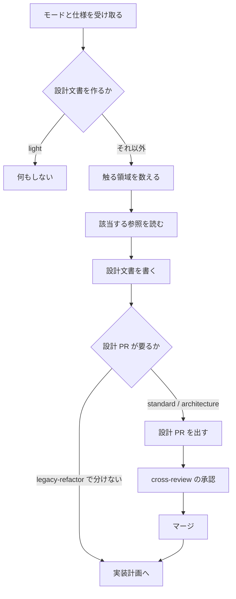

# issue #161 設計: 設計工程の Skill

要求と受け入れ条件は [01-spec-and-plan.md](01-spec-and-plan.md) にある。この文書は
「どう作るか」だけを扱う。

## 構成要素

新設するのは Skill 1 個である。設計の観点は 1 つの工程に属し、分けると起動時にどれを選ぶかの
判断が新しく要る。

| ファイル | 責務 |
| --- | --- |
| `skills/design/SKILL.md` | モードから成果物を決め、触る領域に対応する参照だけを読ませる |
| `references/design-template.md` | 設計文書の雛形。節の並び、図の水準、実装計画への接続 |
| `references/decisions.md` | 決定の記録の書き方。結論・理由・採らなかった案 |
| `references/data-structure.md` | データ構造の観点と、時系列を保護する手法の選び方 |
| `references/interface-api.md` | 呼び出される約束の書き方。記述標準と検査 |
| `references/interface-ui.md` | 画面の書き方。値の記述標準と、当面の表と図 |

### 参照の読み分け

`SKILL.md` は、その変更が触る領域に対応する参照だけを読ませる。触らない領域の内容は
コンテキストに載らない。`refactoring` が対象言語の `lang-<言語>.md` だけを読ませるのと同じ形である。

| 触る領域 | 読む参照 |
| --- | --- |
| すべての変更 | `design-template.md` / `decisions.md` |
| 永続データを持つ、またはスキーマを変える | `data-structure.md` |
| 呼び出される約束（API・イベント・コマンド）を変える | `interface-api.md` |
| 画面を追加・変更する | `interface-ui.md` |

入出力の参照を API と画面で 2 本に分けるのは、片方だけを触る変更が多いためである。1 本に
まとめると、API だけの変更でも画面の記述が読み込まれる。

## モードごとの成果物

| モード | 設計文書 | 必須の節 | 設計 Pull Request |
| --- | --- | --- | --- |
| `light` | 作らない | — | — |
| `standard` | 作る（仕様と同じファイルの別の節でもよい） | 構成要素、決定の記録、触る領域の節 | 必須 |
| `architecture` | 独立したファイルで作る | 全節（触る領域に該当するもの） | 必須 |
| `legacy-refactor` | 作る | 現状の構造、変更後の構造、決定の記録 | 任意 |

**触らない領域の節は作らない。** 空の見出しを残すと、書き忘れと意図的な省略を読み手が
区別できない。省いた理由は仕様の「対象範囲（含まない）」に書く。

`architecture` で独立したファイルにするのは、設計だけを載せた Pull Request を出すためである。
仕様と同じファイルに書くと、実装の段階で同じファイルへ計画の更新が入り、設計 Pull Request で
確定させた内容と後の変更が同じ差分に混ざる。

## 入出力の契約

### 受け取るもの

| 入力 | 出所 | 無いときの扱い |
| --- | --- | --- |
| モード | `development-workflow` の判定結果 | 判定を先に通す。この Skill は判定しない |
| 受け入れ条件 | `requirements-design` が書いた仕様 | 仕様を先に書く |
| 触る領域 | 変更対象から読む（永続データ・API・画面の有無） | 実際に触るファイルで判断する |

### 出すもの

| 出力 | 形 | 次に使う工程 |
| --- | --- | --- |
| 設計文書 | `issues/<課題名>/NN-design.md` | `implementation-plan` がタスクへ分解する |
| 盤面の記録 | `stage` = `設計` / `設計レビュー` | 進行の引き継ぎ |
| 設計 Pull Request | 要求仕様と設計文書だけを載せた Pull Request | `cross-review` が承認を出す |

### 設計文書の節

雛形の節と、それぞれが実装計画のどこへつながるかを対にする。**タスクを機械的に導けるだけの
情報が設計に無いと、次の工程が成立しない。**

| 節 | 書く内容 | 実装計画での使われ方 |
| --- | --- | --- |
| 構成要素 | 何を作るか。それぞれの責務 | タスクの単位になる |
| データ構造 | 保存する形、時系列の扱い、検査の手段 | 移行タスクと検査タスクになる |
| 入出力の契約 | 経路・入出力・入力規則 | 契約テストのタスクになる |
| 処理の流れ | 図 1 枚 | 順序の依存を読む |
| 決定の記録 | 結論・理由・採らなかった案 | 代替案の再検討を止める |
| テスト設計 | 受け入れ条件とテストの対応 | テストのタスクになる |
| 未確認のまま残ること | 確かめられなかったこと | リスクとして計画へ移す |

## 処理の流れ

## 開発ループでの位置

工程表の「設計」行の振り分け先が `design` になり、その後ろへ「設計レビュー」行が入る。

| 工程 | `light` | `standard` | `architecture` | `legacy-refactor` |
| --- | --- | --- | --- | --- |
| 設計 | — | `design` | `design` | `design` |
| 設計レビュー | — | `pr` → `cross-review` → `merged` | `pr` → `cross-review` → `merged` | 任意 |

設計レビューは既存の 3 Skill を順に呼ぶ工程であり、新しい Skill を作らない。載せるものが
要求仕様と設計文書だけである点だけが、実装の Pull Request と違う。

**設計を実装より先にレビューへ通すのは、設計の誤りを実装した後で直す費用が大きいためである。**
実装まで進んでからの指摘は、設計文書とコードの両方を書き直すことになる。

## 決定の記録

### 決定 1: 設計の Skill を 1 個にする

`design` 1 個とし、観点は参照へ分ける。過去の計画にあった 3 分割（設計レビュー・ドメイン
モデリング・クラス設計）は採らない。3 つに分けると、起動の時点でどれを使うかの判断が要る。
設計の観点は 1 つの工程の中で連続しており、切れ目がモードや領域と一致しない。

### 決定 2: 触る領域ごとに参照を分ける

読ませる分量を、その変更が実際に触る領域まで絞る。入出力は API と画面で 2 本に分ける。
1 本にまとめると、片方だけを触る変更でも両方の記述が載る。

### 決定 3: 記述標準は対象がある場合にだけ必須にする

API を追加・変更する変更では OpenAPI を必須とし、永続データを持つ変更ではデータ構造の節を
必須とする。触らない領域については書かせない。モードで一律に必須とすると、画面を持たない
リポジトリでも画面の節を求めることになる。

### 決定 4: 成果物は `issues/` 配下へ置く

仕様（`requirements-design`）と同じ場所に置き、完了後に `plan-to-spec` が `docs/` へ移す
既存の流れに乗せる。設計だけを別の場所に置くと、同じ変更の記録が 2 箇所に分かれる。

### 決定 5: 時系列を保護する手法に既定を置かない

二重時間軸・履歴保持型の次元・事象の記録・定期取得のどれを採るかは、対象の性質で変わる。
既定を置くと、合わない対象へも同じ手法が選ばれる。**代わりに条件を課す。** 状態を上書きして
過去を失う構造を選んだ場合は、失ってよい理由を決定の記録へ残す。

### 決定 6: 画面は策定中の標準を待たず、当面の書き方を定める

画面要素の構造を記述する標準は策定の途中にある。確定を待つと、その間の設計に規約が無い。
当面は画面の一覧・遷移・状態・入力規則を表と図で書く。見た目の値については、記述標準
（Design Tokens Format Module）が確定しているため、値を持つリポジトリではそちらを使う。

### 決定 7: 決定の記録を設計文書の 1 節に置く

決定 1 件ごとに独立したファイルを作る形は採らない。設計文書と決定が別の場所にあると、設計を
読む人が理由へたどり着けない。決定の数が増えて 1 ファイルが 500 行を超えた場合は、決定の節
だけを別ファイルへ分ける（`markdown-writing` の分量の基準に従う）。

### 決定 8: 図はコンテナ階層までを求める

システム文脈と、構成要素の関係を示す図までを求める。クラスやコードの階層は求めない。そこは
コードが唯一の正であり、図は書いた時点で古くなる。記法と横幅の上限は `markdown-writing` の
図表ガイドが持つ。

### 決定 9: 判定基準を持ち込まない

どのモードに当たるかの基準は `development-workflow` に残す。`design` は判定結果を受け取る側に
徹する。基準を 2 箇所へ書くと、モードを変えたときに片方が古くなる。

### 決定 10: 設計レビューに新しい Skill を作らない

設計 Pull Request は `pr` → `cross-review` → `merged` の既存の 3 Skill をそのまま使う。手順が
同じであり、新しい Skill を作ると同じ内容が 2 箇所に増える。`design` の手順の最後に呼び出しを
置く。

## テスト設計

この変更の成果物は Markdown と設定ファイルであり、振る舞いを持つコードを含まない。検査は
既存のスクリプトが行う。

| 受け入れ条件 | 検査 |
| --- | --- |
| frontmatter の規約に従う | `python3 scripts/check-skill-frontmatter.py` |
| 3 ランタイムへ配布される | `bash scripts/build-runtime-plugins.sh --check` |
| 説明文書の Skill 数が合う | `bash scripts/validate-runtime-plugins.sh` |
| 参照のリンクが切れていない | `python3 scripts/check-markdown-links.py` |
| 既存の検査の単体テストが通る | `uv run --with pytest pytest scripts/tests plugins/ndf -q` |
| `/ndf:design` が一覧に出る | `claude --plugin-dir plugins/ndf` で目視 |

**新しいテストは追加しない。** 追加する対象が Skill の記述であり、その整合はマニフェストと
説明文書の突き合わせで既に検査されている。

## 未確認のまま残ること

| 項目 | 内容 |
| --- | --- |
| 盤面の選択肢 | `設計レビュー` を GitHub Projects の単一選択へ足すのは、盤面を持つリポジトリ側の操作である。この変更では対応表と呼び出しまでを扱う |
| 画面の記述標準 | UI Specification Schema は策定の途中にある。確定した時点で `interface-ui.md` の当面の書き方を見直す |
| 設計 Pull Request の運用 | `standard` で必須とした場合に、Pull Request が 2 本になる負担がどの程度かは、使ってみるまで分からない。`retrospective` で拾う |
