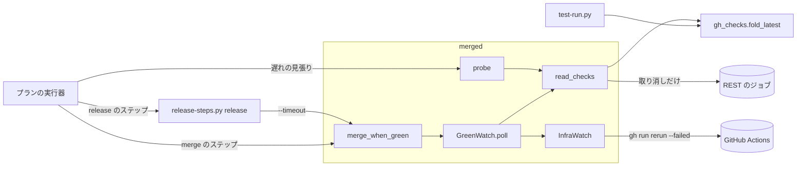
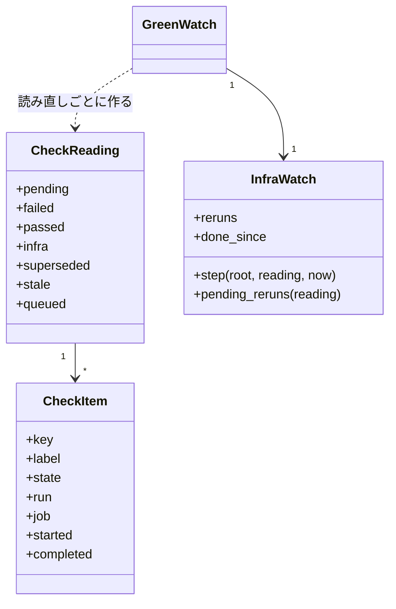
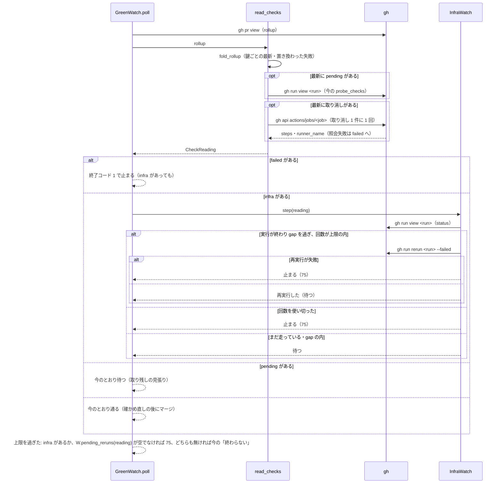
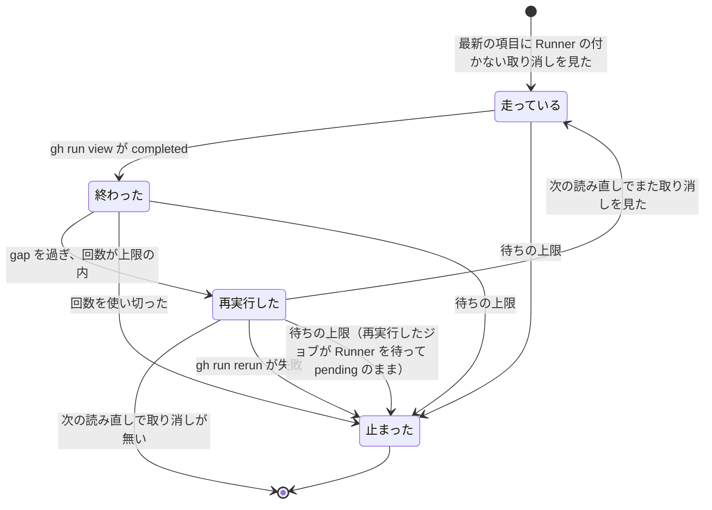
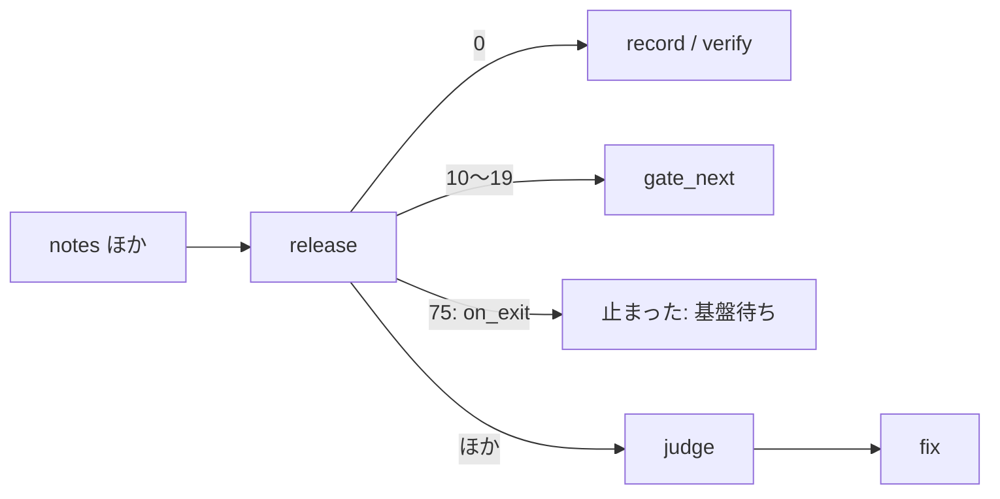

# merge-when-green / release: 新しい実行で通ったチェックの古い失敗と、Runner が付かずに取り消されたジョブを「CI が失敗」と数えて止まり、修正へ回る → 同じチェックは最新の項目だけで数え、Runner の付かない取り消しは再実行して待ち直し、待ち切れなければ「基盤待ち」として修正へ回さずに止まる（#1645 #1768）

## 目的

- **何が壊れているか**: `merge-when-green` は同じチェックの古い失敗と新しい成功を両方数え、古い失敗で止まる。GitHub Actions の障害で Runner が付かずに取り消されたジョブも中身の失敗と数え、`release` のプランは judge から `fix` へ回る
- **誰が困るか**: マージと配布を回す conductor（古い実行を探して打ち直す・障害を調べて再実行とプランの再開を手で行う）と、報告を読む人（取り消しを中身の不具合と読む）
- **直すと何が成り立つか**: 同じチェックは最新の項目で数え、Runner の付かない取り消しはスクリプトが再実行して待つ。待ち切れなければ「基盤待ち」と書いて止まり、LLM の判断と修正の worker に費用を使わない

## 適用範囲

- **働く範囲**: NDF を使うすべてのリポジトリの `merged-steps.py merge-when-green`・`merged-steps.py probe`・`release-steps.py release` と、`supervise.py new` が作るマージと配布のプラン
- **プロジェクトごとに違うもの**: 待ちの上限は今の `--timeout`（プランでは宣言のテストの戦略から出す `ci_wait_timeout`）、再実行の回数と間隔は引数で受ける。workflow の名前・チェックの名前を既定に埋め込まない
- **当たるモード**: `standard`

## あるべき姿の根拠

| 根拠 | 種類 | 何を示すか |
| --- | --- | --- |
| PR 1753 の `statusCheckRollup` の `PR body decisions` / `check` が、FAILURE（run 37264758029）と SUCCESS（run 37264973318、job 111619734523、04:46:35 開始）の 2 件だった（要求の「例」） | 実測 | 同じチェックの古い項目と新しい項目が並んで載る。名前だけでは `Glossary` / `check` とも区別できない |
| `gh pr view 1753 --json statusCheckRollup` の今の値（2026-10-05 に取得）: 古い run 37264758029 は再実行の後に job 111686369818・`startedAt` 08:53:21 で 1 件に置き換わって載る | 実測 | 再実行した実行は同じ run の番号で、新しい job の番号と開始時刻を持つ。job の番号は新しさの順に増える |
| `gh api repos/{owner}/{repo}/actions/jobs/111944834887` が `conclusion: cancelled`・`steps` 0 件・`runner_name` 空（2026-10-05 に取得） | 実測 | Runner の付かなかった取り消しは REST のジョブの照会で見分けられる |
| `plugins/ndf/scripts/tests/test_gh_parts.py` の `test_fold_takes_the_newer_of_completed_and_started_times`（#632） | 既存の決定 | 新しさは `completed_at` と `started_at` の新しい方で決め、長く走って後に終わった失敗を先に終わった成功で隠さない |
| `sysexits.h` の `EX_TEMPFAIL`（75）「一時的な失敗。後で打ち直せば通りうる」 | 外部の一次情報 | 基盤待ちの停止に使う終了コードの意味が、既存の慣習と一致する（`deps.py` の 69 = `EX_UNAVAILABLE` と同じ流儀） |
| `8-release-prod-state` の `07-release.out`〜`19-fix.out`（#1768） | 実測 | release → judge → fix の往復 19 ステップ・$0.857 を、直すものの無い修正に使った |

要求と受け入れ条件は #1645 の本文にある（コピーは `issues/issue-1645-requirements.md`）。この文書は「どう作るか」だけを扱う。

## ドメインモデル

### コンテキスト

| コンテキスト | 何の語が 1 つの意味に決まるか |
| --- | --- |
| NDF の開発ワークフロー（`ndf-workflow`） | 同じチェック・最新の項目・置き換わった失敗・Runner が付かなかった取り消し・基盤待ち・プランのステップの行き先 |
| NDF のリリース（`ndf-release`） | 配布の PR のマージ・`release` のステップの止まり方 |

**公開された言語の関係を宣言する。** `merge-when-green` は結果 JSON（`summary`・`items[].result`・`next`）と終了コードで止まり方を書き、`release-steps.py release` とプランの実行器（`supervise_lib/engine.py`）はその形だけを読む。読む側は `merged_lib/checks.py` の内部を知らない。

### 集約

| 集約 | 持ち主（書き換えてよいもの） | 根 | エンティティ | 値オブジェクト |
| --- | --- | --- | --- | --- |
| チェックの読み（1 回の読み直しで作る） | `merged_lib/checks.py` の `read_checks` | チェックの読み（`CheckReading`） | チェック（鍵で同一とみなす） | チェックの項目（`CheckItem`）・チェックの鍵・新しさ |
| 基盤待ちの見張り（1 回の `merge-when-green` の間だけ生きる） | `merged_lib/checks.py` の `InfraWatch`（`GreenWatch` が持つ） | 基盤待ちの見張り | 実行（run の番号で同一とみなす。再実行の回数と、終わったのを見た時刻を持つ） | — |
| 新しさの規則 | `lib/gh_checks.py` | — | — | 新しさ（`newness`）。チェックの読みと `test-run.py` の畳み方が参照する |

チェックの読みは基盤待ちの見張りを ID（run の番号）で参照し、オブジェクトとして持たない。

### 不変条件

| # | 集約 | 条件 | 破れたときの扱い |
| --- | --- | --- | --- |
| I1 | チェックの読み | チェックの結論は、同じチェックの最新の項目だけで決まる。古い項目の失敗は「置き換わった」として items に載り、結論に数えない | テストが落ちる（AC1・AC2） |
| I2 | チェックの読み | 同じチェックの鍵は、CheckRun なら `workflowName` と `name` の組、StatusContext なら `context` である | テストが落ちる（AC3） |
| I3 | 新しさの規則 | 新しさは `lib/gh_checks.py` の 1 つの関数が決め、`merge-when-green`・`probe`・`release`（`merge-when-green` 経由）・`test-run.py` が同じものを使う | 構造の検査とテストが落ちる（AC15） |
| I4 | チェックの読み | 最新の項目が取り消しで、ジョブのステップが 0 件かつ Runner の名前が空のときだけ、Runner が付かなかった取り消しとする。ステップが 1 件以上なら失敗、照会できなければ失敗（照会できなかったことを items に書く） | テストが落ちる（AC8・AC9） |
| I5 | チェックの読み | 最新の項目に取り消しが 1 件も無ければ、ジョブの照会をしない | `gh` の呼び出しを数えるテストが落ちる（AC14） |
| I6 | 基盤待ちの見張り | 中身の失敗が 1 件でもある読み直しでは、再実行も待ち直しもせず中身の失敗で止まる | テストが落ちる（AC10） |
| I7 | 基盤待ちの見張り | 同じ実行の再実行は `--infra-reruns` 回まで。再実行はその実行が終わってから `--infra-gap` 秒たった後に、失敗したジョブだけを打つ | テストが落ちる（AC6・AC7） |
| I8 | 基盤待ちの見張り | 基盤待ちの停止は終了コード 75 で、summary に「CI が失敗」の語を使わない。中身の失敗の停止は今のとおり 1。待ちの上限に達したとき、その回の読み直しに Runner の付かない取り消しがあるか、`InfraWatch.reruns` に記録のある実行の項目が pending に残っていれば（再実行したジョブが Runner を待っている）、基盤待ちとして 75 で止まる | テストが落ちる（AC7・AC11） |
| I9 | `release` のプラン | `release` のステップは終了コード 75 で judge を通らず止まる。ステップの `timeout` は、`release` が `merge-when-green` へ渡す待ちの上限の合計より長い | テストが落ちる（AC12） |

### ドメインイベント

| # | イベント | 発生元 | 受け手 |
| --- | --- | --- | --- |
| E1 | PR のチェックの一覧を読んだ | `GreenWatch.poll`・`probe_one` | `read_checks` |
| E2 | 同じチェックを束ね、最新の項目を選んだ | `read_checks`（`fold_latest`） | `GreenWatch.poll`・`probe` の分類 |
| E3 | 置き換わった失敗を記録した | `read_checks` | 結果の items・`merge_when_green` のマージ失敗の `next` |
| E4 | 取り消しのジョブを照会し、Runner が付かなかったと判定した | `read_checks`（`inspect_cancelled`） | `InfraWatch` |
| E5 | 中身の失敗で止まった | `GreenWatch.poll` | `release-steps.py`（今の `StepError`、終了コード 1）・プランの `on_fail` |
| E6 | 取り消しを含む実行が終わるのを待った | `InfraWatch` | `GreenWatch.poll`（pending と同じく待つ） |
| E7 | 取り消されたジョブを再実行した | `InfraWatch`（`gh run rerun <run> --failed`） | 結果の items |
| E8 | 全部のチェックが通り、マージした | `merge_when_green` | `release-steps.py` |
| E9 | 基盤待ちで止まった | `InfraWatch`（回数か待ちの上限を使い切った・再実行が失敗した） | `release-steps.py`・プランの `on_exit` |
| E10 | `release` が基盤待ちを区別して返した | `release-steps.py` の `wait_and_merge`（終了コード 75） | プランの実行器 |
| E11 | `release` のプランが fix へ回らずに止まった | プランの実行器（`on_exit` の `stop`） | conductor（`結果: 止まった`・理由に基盤待ち） |

### 用語

| 用語 | 意味 | 用語集への反映 |
| --- | --- | --- |
| 置き換わった失敗 | PR の先頭のコミットで、同じチェック（`workflowName` と `name` の組）により新しい項目があるときの古い項目の失敗。CI のチェックの結論に数えない | 追加（`ndf-workflow`。要求で足した語の出典をこの設計へ移す） |
| 基盤待ち | Runner が付かずに取り消された CI のジョブ（Runner が付かなかった取り消し）があり、ほかに中身の失敗が無い状態。修正へ回さず、再実行して待ち直す。待ち切れなければ `merge-when-green` は終了コード 75 で止まる | 意味の変更（`ndf-workflow`。要求で足した語に終了コードを足す） |
| Runner が付かなかった取り消し | 結論が `cancelled` で、ジョブのステップが 0 件、Runner の名前が空のジョブ。REST のジョブの照会で見分ける | 追加（`ndf-workflow`） |

## 機能一覧

| # | 機能 | 誰が使うか |
| --- | --- | --- |
| F1 | 同じチェックを `workflowName` と `name` の組で束ね、最新の項目だけで結論を決める。古い失敗は「置き換わった」と書く | `merge-when-green`・`probe`（conductor と supervisor が結果を読む） |
| F2 | 取り消しのジョブを照会し、Runner が付かなかった取り消しを中身の失敗と分ける | `merge-when-green`・`probe` |
| F3 | 基盤待ちの間、実行が終わるのを待って失敗したジョブを再実行し、上限まで待ち直す。使い切ったら終了コード 75 で止まる | `merge-when-green`（`release` とマージのプランから呼ばれる） |
| F4 | 止まった結果を、中身の失敗・基盤待ち・置き換わった失敗で書き分け、チェックを `<workflowName> / <name>` で示す | 結果を読む人と judge |
| F5 | `release` が基盤待ちを終了コード 75 で返し、プランが judge を通らずに止まる | `release` のプランと conductor |
| F6 | `probe` が基盤待ちを分類 `infra`・手 `wait` に分ける | 遅れの見張り |

## 構成要素

| 要素 | 変更 | 責務 |
| --- | --- | --- |
| `plugins/ndf/scripts/lib/gh_checks.py` | 変更 | 新しさの規則 `newness` と、鍵ごとに最新の項目を選ぶ `fold_latest`（最新と古い項目の 2 つを返す）を持つ。`fold_check_runs` は `fold_latest` を名前の鍵で呼ぶだけにする |
| `plugins/ndf/scripts/merged_lib/checks.py` | 変更 | `fold_rollup`（純粋。rollup を `CheckItem` にして束ねる）・`read_checks`（`fold_rollup` + pending の実行の読み + 取り消しの照会）・`InfraWatch`（再実行と待ち直し）。`check_states` を消し、`GreenWatch.poll` と `_settle_pending` を `read_checks` へ寄せる。止まり方の文面と items を F4 の形にする |
| `plugins/ndf/scripts/merged_lib/merge.py` | 変更 | `add_wait_args` に `--infra-reruns`・`--infra-gap` を足す。`gh pr merge --admin` が拒まれたとき、置き換わった失敗があれば `next` に run ごとの `gh run rerun <run>` を載せる |
| `plugins/ndf/scripts/merged-steps.py` | 変更 | `_classify_checks` を `read_checks` へ寄せる。分類 `infra`（手 `wait`）を足し、`check_states` と `FAIL_CONCLUSIONS` の取り込みを消す |
| `plugins/ndf/scripts/lib/step_result.py` | 変更 | `EXIT_INFRA_WAIT = 75` を置き、`code_matches` の `stopped` に足す |
| `plugins/ndf/scripts/release-steps.py` | 変更 | `release` に `--ci-wait <秒>` を足して `merge-when-green --timeout` へ渡す。`merge-when-green` が 75 で止まったら `StepError(…, 75)` を投げる |
| `plugins/ndf/scripts/supervise_lib/engine.py`・`plan.py` | 変更 | run のステップの `"on_exit": {"<終了コード>": "<ステップの id> \| end \| stop"}` を読む。`stop` は `結果: 止まった`・理由に出力の summary |
| `plugins/ndf/scripts/supervise_lib/release_templates.py` | 変更 | `release` のステップに `on_exit: {"75": "stop"}` と `--ci-wait` を足し、`timeout` を I9 を満たす値にする |
| `plugins/ndf/scripts/supervise_lib/verify_steps.py` | 変更 | `merge` と `merge-approved` のステップに `on_exit: {"75": "stop"}` を足す（下の「75 を受ける規則の判定」） |
| テスト | 新規・変更 | `test_merged_checks_fold.py`（新規。I1〜I8）・`test_merged_probe.py`・`test_release_steps.py`・`test_gh_parts.py`・プランの雛形と実行器のテスト |

図に含めない要素: `step_result.py`（終了コード 75 の定数と `code_matches`）、`release_templates.py` と `verify_steps.py`（プランの雛形。実行器が読むステップの定義を作る）、`plan.py`（`on_exit` の書き方の説明）、テスト。

### 75 を受ける規則の判定

新しい終了コード 75 を出すのは `merge-when-green` と、それを呼ぶ `release` である。両者を呼ぶ規則を、呼び出し元の検索（`merge-when-green`・`MERGE_CMD`・`wait_and_merge`）と、終了コードの集合を数える箇所（`code_matches`・`is_gate`・`on_fail`）で集めた。

| 規則 | 今の扱い | 75 に当てはまるか | 扱い |
| --- | --- | --- | --- |
| `step_result.code_matches` の `stopped` の集合（1・2・3・69） | 集合に無い値は status と食い違うと数える | 当てはまらない | 構成要素の表に載せた（75 を足す） |
| 実行器の run の遷移（0 → `next`、10〜19 → `gate_next`、ほか → `on_fail`） | 75 は `on_fail` へ行く | 当てはまらない（judge が `fix` を選びうる） | 構成要素の表に載せた（`on_exit` を先に見る） |
| `release_templates._release_step`（`on_fail: judge`） | 同上 | 当てはまらない | 構成要素の表に載せた |
| `verify_steps.merge_steps` の `merge`・`merge-approved`（`on_fail` は呼ぶ側が渡す。judge が多い） | 同上 | 当てはまらない | 構成要素の表に載せた |
| `delivery_templates` の `promote`（`on_fail` は `handoff` か無し） | 75 は `handoff`（MVV の記録を外して人へ戻す）か停止 | 当てはまる（修正へ回らず、人へ戻る） | 変えない |
| `release-steps.py` の `wait_and_merge` の `head_moved` | items で判定し、終了コードを見ない | 当てはまる | 変えない |
| `sprint-close.py` のマージの待ち | `merge-when-green` を呼ばない | 対象外（要求の「含まない」） | 変えない |

## 構造

| 型 | 責務 |
| --- | --- |
| `CheckItem` | rollup の 1 件。`key` は I2 の鍵、`label` は `<workflowName> / <name>`（StatusContext は `context`）、`state` は `pending` / `failed` / `passed` / `cancelled`、`run` と `job` は `detailsUrl` から読む（無ければ `None`） |
| `CheckReading` | 1 回の読み直しの結果。`failed` は中身の失敗（ステップのある取り消しと照会できない取り消しを含む。後者は `reason` を持つ）、`infra` は Runner が付かなかった取り消し、`superseded` は置き換わった失敗。`stale` と `queued` は今の `probe_checks` の 2 つ |
| `InfraWatch` | `reruns`（run の番号 → 再実行した回数）と `done_since`（run の番号 → 実行が終わったのを見た時刻）。1 回の読み直しごとに `step` が「待つ」「再実行した」「止まる」を返す。`pending_reruns` は、`reruns` に記録のある実行のうち、その回の読み直しで pending の項目を持つものを返す（待ちの上限での判定に使う） |
| `GreenWatch` | 既存。`_settle_pending` を消し、`read_checks` の結果で分岐する。`InfraWatch` を 1 つ持ち、先頭のコミットが変わったら作り直す |

## 入出力の契約

### `merged-steps.py merge-when-green`（`promote` も同じ待ちを使う）

| 項目 | 内容 |
| --- | --- |
| 入力（足す） | `--infra-reruns <回>`（既定 3。同じ実行の再実行の上限）、`--infra-gap <秒>`（既定 300。実行が終わってから再実行するまでの間）。`--timeout` は今のとおり待ち全体の上限で、基盤待ちもこの中で待つ |
| 出力（成功） | 今のとおり `status: ok`。items に足す: `{"kind": "check", "name": "<label>", "result": "superseded", "run": "<run>", "job": "<job>"}`（置き換わった失敗 1 件につき 1 件）、`{"kind": "check", "name": "<label>", "result": "infra_rerun", "run": "<run>", "rerun": <回目>}`（再実行 1 回につき 1 件） |
| 中身の失敗 | 終了コード 1（今のとおり）。summary `#<PR> の CI が失敗: <label>（run <run>）, …`。items の `result: failed` に `run`・`job` を足し、照会できなかった取り消しは `reason: 取り消しのジョブを照会できない` を持つ。置き換わった失敗の items も添える。`next` は今のとおり |
| 基盤待ちの停止 | 終了コード 75。summary は次の 3 つのどれか。`#<PR> の CI の基盤待ち: Runner が付かずに取り消された（<label>, …）。再実行 <N> 回で解けない` / `… <timeout> 秒で解けない`（再実行したジョブが Runner を待って pending のまま上限に達したときも、この文面で `infra_wait` の items にそのジョブを載せる） / `… gh run rerun <run> --failed が失敗: <stderr>`。items は `{"kind": "check", "name": "<label>", "result": "infra_wait", "run": "<run>", "job": "<job>", "reruns": <回>}`。metrics に `infra`（件数）。`next` は `GitHub Actions の復旧の後に打ち直す: merged-steps.py merge-when-green <PR>` |
| マージの拒否 | 今のとおり終了コード 1・`gh pr merge --admin が失敗: …`。置き換わった失敗があれば `next` を `置き換わった失敗を通し直してから打ち直す: gh run rerun <run>; gh run rerun <run>; merged-steps.py merge-when-green <PR>` にする |
| 互換性 | 終了コード 0・1・10 の意味は変えない。summary のチェックの名前に workflow の名前が付く（読む側はプランの judge と人で、文字列を照合するスクリプトは無い。`release-steps.py` は summary を写すだけ） |

### `merged-steps.py probe`

| 項目 | 内容 |
| --- | --- |
| 分類（足す） | `infra`。並びは `failed`・`stale`・`stale_again`・`infra`・`settled`・`queued`・`running`・`passed`・`none`（強い順）。手は `wait` |
| summary | `Runner が付かずに取り消されたジョブがある（CI の基盤待ち）: <label>, …` |
| `--act` | 基盤待ちは再実行しない（再実行は `merge-when-green` が持つ） |
| 置き換わった失敗 | 分類に数えず、items に `result: superseded` で載せる |

### `release-steps.py release`

| 項目 | 内容 |
| --- | --- |
| 入力（足す） | `--ci-wait <秒>`（既定 3600。今の `merge-when-green` の既定と同じ）。待つ PR ごとに `merge-when-green --timeout` へ渡す |
| 基盤待ちの停止 | `merge-when-green` が 75 で止まったら、終了コード 75・summary `PR #<n> をマージできない: <merge-when-green の summary>` |
| 互換性 | ほかの止まり方の終了コードと summary は変えない |

### プランのステップの `on_exit`

| 項目 | 内容 |
| --- | --- |
| 形 | run のステップの `"on_exit": {"<終了コード>": "<ステップの id> \| end \| stop"}`。鍵は 10 進の文字列 |
| 順序 | 実行器は終了コードを読んだら、`skip_to` の次・承認ゲートの終了コード（10〜19）の前に `on_exit` を見る。当たれば `on_fail` へ行かない |
| `stop` | `結果: 止まった`・`理由: ステップ <id> が終了コード <n> で止めた: <出力の最後の JSON の summary>` |
| 検査 | 鍵が整数でない・行き先が知らないステップの id なら、プランの読み込みで止まる（今の `next` の検査と同じ扱い） |

## 処理の流れ

### 1 回の読み直し

### 基盤待ちの実行 1 つの状態

先頭のコミットが変わったら、`InfraWatch` を作り直す（今の `_reset_on_new_sha` と同じ時点）。

### `release` のプラン

## 非機能の実現方式

| 大項目 | 要求の条件 | 実現方式 | 確かめ方 |
| --- | --- | --- | --- |
| 性能・拡張性 | 取り消しの無い PR の読み直しで `gh` の呼び出しを足さない（AC14）。基盤待ちの再実行は回数の上限を持つ | 照会は `read_checks` が最新の取り消しにだけ打つ。`gh run view` の status は `InfraWatch` が基盤待ちのときだけ打つ。再実行は `--infra-reruns` で頭打ち | `gh` を差し替えて呼び出しを数えるテスト |
| 運用・保守性 | 止まった結果を読んだ人が、中身の失敗・基盤待ち・置き換わった失敗のどれかを summary だけで言える（AC5・AC7） | 3 つの止まり方の summary を「CI が失敗」「CI の基盤待ち」「gh pr merge --admin が失敗」で始め分け、チェックを `<workflowName> / <name>` で書く | 3 つの止まり方の結果 JSON をテストで読む |
| システム環境 | githubstatus を読めない環境（GitHub Enterprise Server・ネットワークの制限）でも同じ判断で動く（前提 6） | githubstatus を読まない（決定 4）。判定は `gh` の API だけで行う | 外部の URL へ出ないことをテストで縛る（`gh` 以外を呼ばない） |

## 決定の記録

### 決定 1: 同じ役割の規則を 1 つにするため、新しさは #632 の規則（終わった時刻と始まった時刻の新しい方）を `lib/gh_checks.py` に置いて共有する

`test-run.py` が使う `fold_check_runs` は、長く走って後に終わった失敗を先に終わった成功で隠さないよう、`completed_at` と `started_at` の新しい方で新しさを決めている（#632 のテストが縛る）。マージの待ちが別の規則を持つと、同じ PR の同じチェックが test-run では失敗、merge-when-green では成功と読める。新しさを `newness`（時刻の新しい方 → job の番号 → 一覧の順。時刻がどちらも無い項目は最も新しい）にし、`fold_latest` が鍵を引数で受けて両方へ使う。鍵は呼ぶ側が渡す（REST の check run は workflow の名前を持たないため `test-run.py` は名前のまま）。

要求の「解釈」は新しさを `startedAt` だけで定めている。PR 1753 と PR 1641 の形では 2 つの規則が同じ答えを出し、違うのは同じチェックが重なって走ったときだけである。その場合に #632 の規則は失敗を残す側に倒れ、マージを誤って通さない。`startedAt` だけにして `fold_check_runs` を別に残す形は、同じ役割の関数が 2 つになるため採らない。**要求の「解釈」の「新しい実行」の行は、承認ゲート 1（2026-10-06）でこの規則への書き換えが承認され、課題の本文と写しを直した。**

根拠: Value 6 / Value 7（MVV 版 2）

### 決定 2: 呼び出しを足さずに見分けるため、Runner の付かない取り消しは最新の取り消しのジョブだけを REST で照会する

`statusCheckRollup` にはステップの数と Runner の名前が無い。`gh run view --json jobs` はステップを持つが Runner の名前を持たない。REST の `actions/jobs/<job>` は両方を 1 回で返す（2026-10-05 に実物で確かめた）。照会は束ねた後の最新の項目のうち取り消しだけに打つので、取り消しの無い PR の呼び出しは変わらない。

`gh run view` のステップの数だけで判定する形は、人が開始前に取り消したジョブとの区別に Runner の名前が要るため採らない。

根拠: Value 3 / Value 5（MVV 版 2）

### 決定 3: 障害の長さに頼らずに止まり方を決めるため、再実行は 3 回・間隔 300 秒を既定にし、待ちは今の `--timeout` の中で行う

#1768 の障害では、Runner を待ったジョブが 16〜19 分で取り消された。1 回の再実行は取り消しまで 20 分前後かかるので、3 回で 1 時間前後になり、今の `--timeout` の既定 3600 秒と釣り合う。間隔の 300 秒は、同じ障害の中で再実行をすぐ重ねて待ち行列を増やさないための下限である。障害は 2 時間を超えることがあり、上限を障害に合わせて伸ばすと配布のステップが長く占有される。待ち切れなければ 75 で止まり、conductor は復旧の後に `--from release` で再開する（今の再開と同じ手順で、`-r2` への写しは要らない）。

待ちの上限を基盤待ちだけ別に持つ形は、`release` のステップの `timeout` を 2 つの上限の和で決めることになり、ステップの時間の見積もりが読めなくなるため採らない。

根拠: Value 1 / Value 3（MVV 版 2）

### 決定 4: どの GitHub でも同じ判断で動くため、githubstatus は読まない

githubstatus は github.com だけが持ち、GitHub Enterprise Server とネットワークを絞った環境では読めない。判断に使わない（前提 6）うえ、summary の「CI の基盤待ち」と items の `infra_wait` で、読む人は障害を疑える。報告の材料として足すと外部への呼び出しが 1 つ増え、読めないときの文面の分岐も増える。

根拠: Value 5（MVV 版 2）

### 決定 5: 基盤待ちを中身の失敗と終了コードで分けるため、75（`EX_TEMPFAIL`）を `stopped` の値に足す

プランの実行器は終了コードで行き先を決める（`skip_code`・承認ゲートの 10〜19）。結果 JSON の項目で分ける形は、実行器に JSON の中身で行き先を決める仕組みを新しく足すことになる。3 は `release` が前提の欠けに使っており、1 は中身の失敗と重なる。`deps.py` が 69（`EX_UNAVAILABLE`）を自分の値として足した前例に倣い、`sysexits.h` で「後で打ち直せば通りうる」を表す 75 を使う。

根拠: Value 4 / Value 8（MVV 版 2）

### 決定 6: judge を通さずに行き先を決めるため、プランに `on_exit` を足し、`release` とマージのステップは 75 で止める

`release` のプランが基盤待ちで取れる行き先は「待ち直す」か「止まる」で、待ち直しは `merge-when-green` の中で上限まで済んでいる。プランでもう一度 `release` へ戻すと、実行器にはステップの往復の回数の上限が無いため、長い障害の間は往復が止まらない。止まって conductor へ戻す形にし、理由に基盤待ちの summary を書く。`on_exit` は終了コードと行き先の対応の一般の形にし、`skip_to` / `skip_code` は今のまま残す（意味が「飛ばしてよい」で、基盤待ちに使うと語の意味が 2 つになる）。

マージのプラン（`merge`・`merge-approved`）にも同じ `on_exit` を付ける。`merge-when-green` を呼ぶ以上、同じ空振りが起きるためである。`promote` は `on_fail` が `handoff` で修正へ回らないので変えない。

根拠: Value 1 / Value 4 / Value 8（MVV 版 2）

### 決定 7: 基盤待ちの停止が実行器の打ち切りより先に出るよう、`release` の待ちの上限をステップの `timeout` から導く

今の `release` は `merge-when-green` を既定の `--timeout`（3600 秒）で呼び、ステップの `timeout` は 2400 秒（開発版）・3000 秒（本番）である。待ちが上限まで続くと、実行器が 124 で打ち切って `on_fail`（judge）へ回り、75 が出ない。雛形は `ci_wait_timeout`（マージのプランと同じ値）を `--ci-wait` に渡し、ステップの `timeout` を `with_margin(待つ PR の数 × ci_wait)` と今の値の大きい方にする。待つ PR の数は開発版 1・本番 2 である。

根拠: Value 4 / Value 6（MVV 版 2）

### 決定 8: 置き換わった失敗は打ち直さず、マージが拒まれたときにだけ打ち直しを案内する

マージは `gh pr merge --admin` で、必須チェックの BLOCKED を迂回して通る（前提 2）。打ち直しは run を 1 本増やし、通るのを待つ時間が増える。拒まれたとき（保護の規則が管理者にも効くリポジトリ）だけ、`next` に run ごとのコマンドを載せる。

根拠: Value 1（MVV 版 2）

### 決定 9: #1768 の実装は #1645 の 1 本に寄せる

2 つの課題は同じ関数（`check_states` を置き換える `read_checks`）と同じ分岐（`GreenWatch.poll`）を書き換え、テストの入力（rollup の形）も共有する。別の実装に分けると、同じ関数を 2 本の PR が順に書き換え、先にマージした側の形を後の側が作り直す。`release` とプランの変更（決定 5〜7）は #1768 だけのものだが、`merged_lib/checks.py` の終了コード 75 と同じ差分で縛らないと、75 を返す側と受ける側が別の版に分かれる。

根拠: Value 1 / Value 6（MVV 版 2）

## テスト設計

| 受け入れ条件・不変条件 | どの振る舞いで縛るか | どう壊したら落ちるべきか |
| --- | --- | --- |
| AC1・I1 | PR 1753 の形の rollup を 1 回読み直すと通った扱いになり、items に run 37264758029 の `superseded` が 1 件ある | 束ねずに全部を数える・置き換わった失敗を items に書かない |
| AC2・I1 | 新しい FAILURE と古い SUCCESS で失敗として止まる | 新しさの比較を逆にする・成功を優先する |
| AC3・I2 | `Glossary` / `check` の FAILURE と `PR body decisions` / `check` の SUCCESS で失敗として止まる | 鍵を `name` だけにする |
| AC4 | 置き換わった失敗があり `gh pr merge --admin` が拒まれると、`next` に `gh run rerun <run>` が run ごとにある | 拒否の経路で置き換わった失敗を読まない |
| AC5 | 中身の失敗の summary と items が `<workflowName> / <name>` と run の番号を持つ | ラベルを名前だけにする・run を落とす |
| AC6・I7 | PR #1765 の形（`Lint` / `lint` の取り消し・ステップ 0・Runner 空）で、実行が終わり gap を過ぎた読み直しで `gh run rerun <run> --failed` が 1 回打たれ、止まらずに待つ | 取り消しを失敗に数える・実行が走っている間に再実行する・`--failed` を落とす |
| AC7・I8 | 再実行を上限まで続けても取り消しが残ると、終了コード 75・summary に「基盤待ち」があり「CI が失敗」が無い・items に `infra_wait`・`next` が打ち直しのコマンド。待ちの上限でも同じで、上限の時点で取り消しが無くても、再実行した実行の項目が pending に残っていれば同じ（既定値で 19 分に取り消し → 24 分に再実行 → 43 分に取り消し → 48 分に再実行 → 60 分の上限、の筋書き） | 上限を数えない・終了コードを 1 にする・上限の到達で「終わらない」と書く・上限で `reading.infra` だけを見る |
| AC8・I4 | 取り消しでステップが 1 件以上のジョブは失敗として止まり、再実行しない | ステップの数を見ない |
| AC9・I4 | ジョブの照会が失敗すると失敗として止まり、items に照会できなかったことがある | 照会の失敗を基盤待ちへ倒す |
| AC10・I6 | 基盤待ちと中身の失敗が同時にあると、再実行せず終了コード 1 で止まる | 基盤待ちの分岐を中身の失敗より先に置く |
| AC11・I8 | `release` の `wait_and_merge` が、`merge-when-green` の 75 を 75 で返し、1 を今のとおり 1 で返す | 終了コードを写さない |
| AC12・I9 | `supervise.py new release` のプランの `release` のステップに `on_exit` の 75 → `stop` があり、実行器が 75 で judge を通らず `結果: 止まった` になる。ステップの `timeout` が `--ci-wait` × 待つ PR の数より長い | `on_exit` を `on_fail` の後に見る・雛形から落とす・`timeout` を今の値のまま残す |
| AC13 | `probe` が AC1 の形を `failed` にせず、AC6 の形を `infra`・手 `wait` にする | 分類に `infra` が無い・手を `fix` にする |
| AC14・I5 | 取り消しの無い PR の 1 回の読み直しで `gh` の呼び出しの数が今と同じ | 取り消しの有無によらず照会する |
| AC15・I3 | `check_states` が配布物から消え、`merge-when-green` と `probe` と `fold_check_runs` が `fold_latest` を通る | 片方に別の束ね方を残す |
| AC16 | 既存の `test_merged_probe.py`・`test_sprint_close_merge_green.py`・`test_release_steps.py`・`test_gh_parts.py` が通る | 既存の振る舞い（取り残しの再実行・#632 の新しさ）を変える |
| I8（`code_matches`） | `code_matches("stopped", 75)` が真で、`ok` と `gate` では偽 | 集合に 75 を足し忘れる |
| `on_exit` の検査 | 鍵が整数でない・行き先が知らない id のプランが読み込みで止まる | 検査を省く |

## 設計の結果

| 課題 | 扱い | 取り込み先 | 触るファイル |
| --- | --- | --- | --- |
| #1645 | 実装する | — | `plugins/ndf/scripts/lib/gh_checks.py`、`plugins/ndf/scripts/lib/step_result.py`、`plugins/ndf/scripts/merged_lib/`、`plugins/ndf/scripts/merged-steps.py`、`plugins/ndf/scripts/release-steps.py`、`plugins/ndf/scripts/supervise_lib/engine.py`、`plugins/ndf/scripts/supervise_lib/plan.py`、`plugins/ndf/scripts/supervise_lib/release_templates.py`、`plugins/ndf/scripts/supervise_lib/verify_steps.py`、`plugins/ndf/scripts/tests/` |
| #1768 | 取り込む | #1645 | — |

## 未確認のまま残ること

| 項目 | 内容 |
| --- | --- |
| 要求の「解釈」の書き換え | 承認ゲート 1 で決定（2026-10-06）: 新しさを `startedAt` だけから #632 の規則（終わった時刻と始まった時刻の新しい方）へ揃える（決定 1）。課題の本文の「解釈」と写しを直した |
| 人が開始前に取り消したジョブ | ステップ 0 件・Runner 空で、障害と同じ形になる。同じチェックに新しい項目があれば置き換わるが、無ければ再実行される。再実行は上限 3 回で止まる |
| `gh run rerun --failed` が取り消しのジョブを打ち直すこと | #1768 の再開で conductor が打って通ったことだけを根拠にしている。リリース後テストで次の障害のときの items を読む |
| `release` の雛形で `ci_wait_timeout` を引けるか | `plan_limits` は宣言のテストの戦略から出す。配布のプランの引数に戦略が載らないときは所要が不明のときの値（3600 秒）になる。実装で確かめる |
| 結論の集合の重複 | `lib/gh_checks.py` の `FAILED_CONCLUSIONS`（取り消しを含まない）と `merged_lib/checks.py` の `FAIL_CONCLUSIONS`（含む）が別にある。この変更の範囲外として #1774 に起票した |
