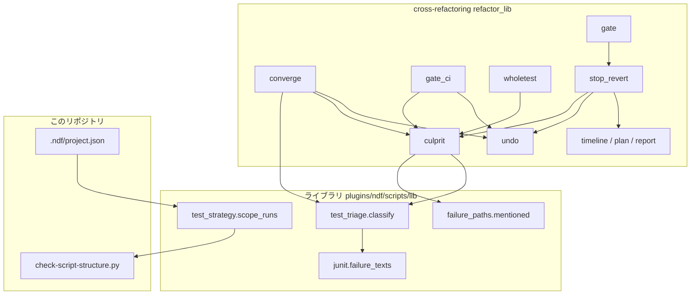
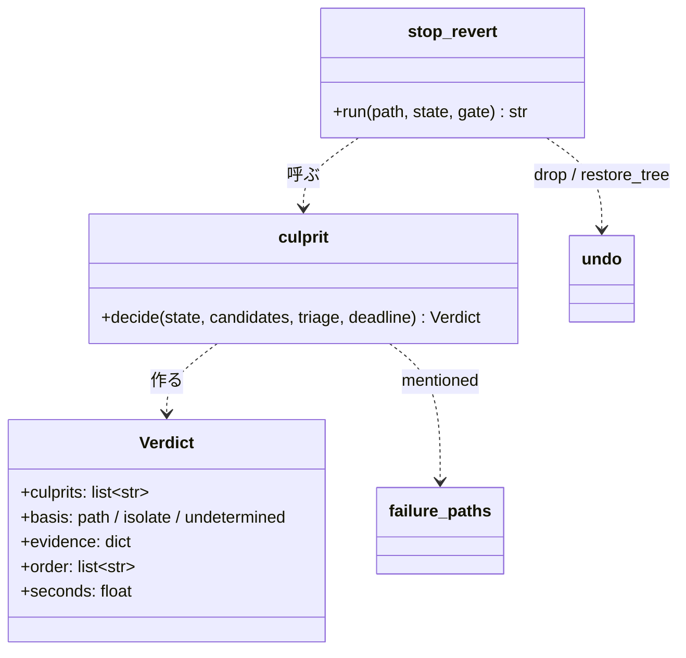
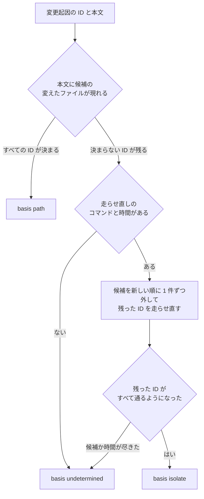
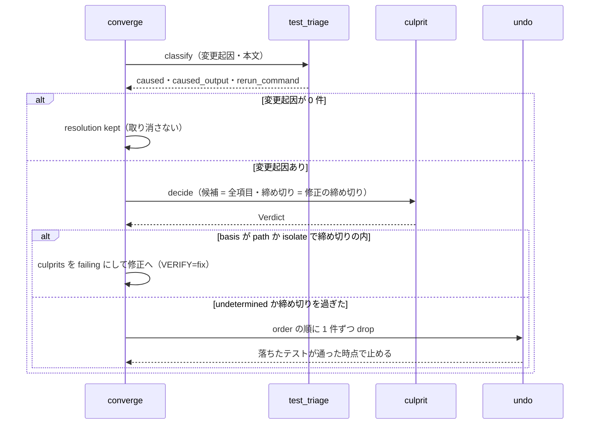
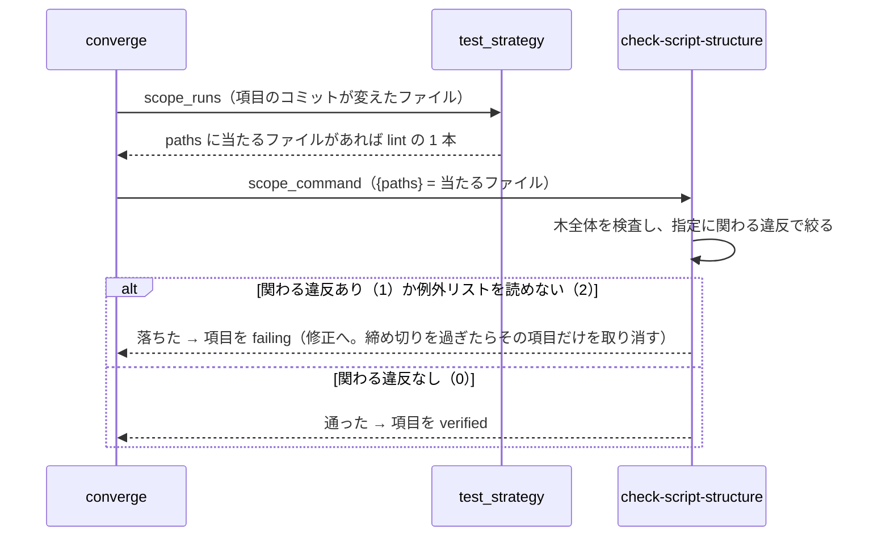
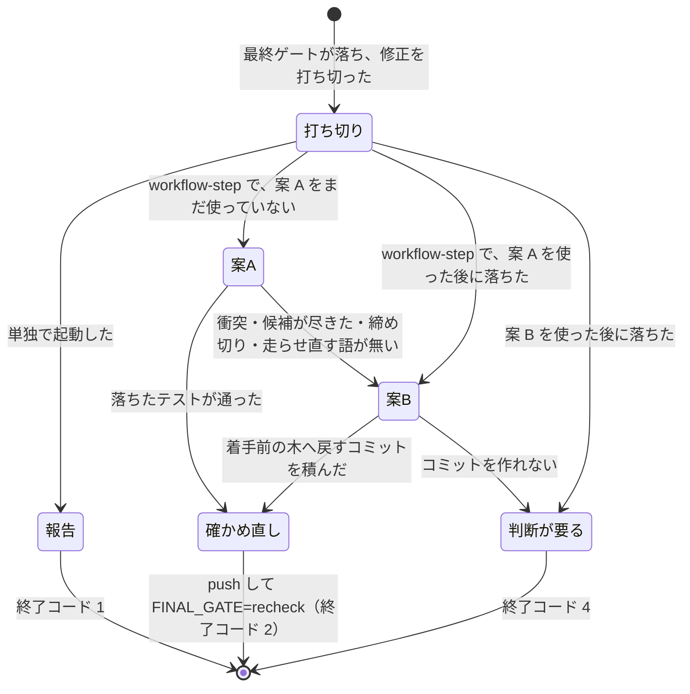

# cross-refactoring: 全体テストが落ちると無関係な改善が全件取り消され、原因の項目が残ってスプリントのブランチが壊れたまま止まる → 落ちたテストを起こした項目だけを直すか取り消し、工程の 1 つとして起動したときは全体テストが通る状態で終える（#1649 #1668 #1669）

## 目的

- **何が壊れているか**: 全体テストで変更起因の失敗が出ると、修正と取り消しが危険フラグの項目だけに向く。原因が危険フラグの無い項目にあると、テストを壊していない改善が全件取り消され、原因の項目は残る。構造チェックの違反は項目の範囲テストで見えず、全体テストで初めて落ちる。工程の 1 つとして起動したときは、最終ゲート修正の打ち切りで落ちたままのコミットがスプリントのブランチに残り、プランが止まる
- **誰が困るか**: スプリントを回す conductor（PR 1634・PR 1663 で原因を手で探して取り消した。PR 1663 は約 15 分）と、採用 0 件の結果を受け取る利用者
- **直すと何が成り立つか**: 落ちたテストを起こした改善項目（原因の項目）だけが直されるか取り消される。構造チェックの違反は、違反を持ち込んだ項目の範囲テストで落ちる。工程の 1 つとして起動した cross-refactoring は、打ち切りでも全体テストが通る状態で終えるか、「判断が要る」で止まる

## 適用範囲

- **働く範囲**: 原因の項目の決め方と打ち切りの後の取り消しは、配布先のリポジトリでも働く（cross-refactoring の本体）。構造チェックのファイル指定と、その宣言は、このリポジトリだけで働く
- **プロジェクトごとに違うもの**: 走らせ直すコマンドと静的解析の suite は、宣言（`.ndf/project.json` の `test.suites[]`）で受ける。打ち切りの後の取り消しにかける時間は `--budget-minutes` から算術で出す
- **当たるモード**: `standard`

## あるべき姿の根拠

| 根拠 | 種類 | 何を示すか |
| --- | --- | --- |
| PR 1634 の記録（#1649 の本文）: 危険フラグの 6 件が `not_caused` で取り消され、危険フラグの無い I-005・I-006 が残って `refactor.py verify` が終了コード 4 で止まった。修正担当は「598cc492 と 31205640 を戻すと 100 passed」と特定していた | 実測 | 原因は危険フラグと関係なく、外す走らせ直しで機械で決まる |
| PR 1663 の記録（#1649・#1668・#1669 の本文）: 原因は 3 ファイルを触った 8 件、取り消されたのは危険フラグの 4 件を含む 7 件、結果は `adopted 0 / unconfirmed 16 / final_gate failing` | 実測 | 同じ経路が 2 度起き、打ち切りでブランチが壊れたまま残る |
| #1634 の形のテスト（509 行のファイルを `len(...) <= 500` で検査）を pytest で走らせた JUnit の `failure` の本文に、ファイルのパスが現れた（`message` と本文の両方。2026-10-03 に実測） | 実測 | 手がかり 1（出力に現れるパス）で原因が決まる |
| `check-script-structure.py` の木全体の検査は 2.98 秒（2026-10-03 に実測） | 実測 | 範囲テストへ入れても所要が問題にならない |
| `project-decl.py write --dry-run` は、手で suite を足した `test` を `kept` として残した（一時の複製で 2026-10-03 に実測） | 実測 | 宣言へ足した suite が解析し直しで消えない |
| `git read-tree -u --reset <起点>` の後のコミットは、起点との差分 0 で、履歴は子孫のまま残った（一時のリポジトリで実測） | 実測 | 案 B を強制 push なしで作れる |
| 利用者の指示の原文「#1668 は既存の静的解析の suite の仕組み（`plugins/ndf/scripts/lib/test_strategy.py` の `scope_runs`）に乗せ、新しい仕組みを作らない」。あわせて、#1649 の逆引きのうち cross-review と共通にできるものはライブラリ（`plugins/ndf/scripts/lib/`）へ置くよう指示があった（指示の語は用語集で別の意味の廃止語のため、ここでは言い換えた） | 利用者の指示の原文 | 構造チェックは宣言の suite として足す。共通にできる部分はライブラリへ置く |

要求と受け入れ条件は #1649・#1668・#1669 の本文にある（コピーは `issues/issue-1649-requirements.md`・`issues/issue-1668-requirements.md`・
`issues/issue-1669-requirements.md`）。この文書は「どう作るか」だけを扱う。決定の記録は `issues/issue-1649-design-decisions.md` に分けた。
要求の語「構造検査」は、用語集の「構造チェック」と同じものを指す。この文書は「構造チェック」と書く。

**承認で人が認める書き換え（C7）**: `.ndf/project.json` に静的解析の suite を 1 つ足すこと（#1668）と、`CLAUDE.md` の cross-refactoring の節の
取り消しの方針を書き換えること（#1649・#1669）。設計の承認がこの 2 つの承認を兼ねる。

## ドメインモデル

### コンテキスト

| コンテキスト | 何の語が 1 つの意味に決まるか |
| --- | --- |
| `ndf-cross-refactoring` | 改善項目・原因の項目・最終ゲート・打ち切りの後の取り消し・取り消しの判定 |
| `ndf-workflow` | 範囲テスト・全体テスト・suite の種別・構造チェック・危険フラグ |

関係は **公開された言語**。`ndf-workflow` のテストの宣言（`project.schema.json` の `Suite`）と、ライブラリの落ちたテストの見分け
（`test_triage.classify` の結果の形）を、cross-refactoring がそのまま読む。cross-refactoring は宣言の形を変えない。

### 集約

| 集約 | 持ち主（書き換えてよいもの） | 根 | エンティティ | 値オブジェクト |
| --- | --- | --- | --- | --- |
| 実行の状態 | cross-refactoring の各副命令（`refactor.py`）。項目を `reverted` にするのは取り消し（`undo` → `ledger.mark_dropped`）だけ | 状態ファイル | 改善項目 | 全体テストの記録・最終ゲートの記録・原因の判定・打ち切りの後の取り消しの記録 |
| テストの宣言 | 利用者（C7）。`project-decl.py` は前の解析の値のままの項目だけを書き換える | `.ndf/project.json` | suite | `scope_command`・`paths`・`kind` |
| 構造チェックの結果 | `check-script-structure.py` | 結果 JSON | — | 違反（`kind`・`path`・関わるファイル） |

原因の判定は値オブジェクトで、作る（`culprit.decide`）だけで項目の状態を書き換えない。書き換えは呼ぶ側が取り消しへ渡して行う。

### 不変条件

| # | 集約 | 条件 | 破れたときの扱い |
| --- | --- | --- | --- |
| I1 | 実行の状態 | 原因の項目は、落ちたテストの出力に現れるパスか、項目を外した走らせ直しの結果だけで決まる。危険フラグの有無と修正担当の申告は使わない | 判定を `undetermined` にし、候補の全項目を新しい順に取り消す |
| I2 | 実行の状態 | 原因が決まったとき（`path` / `isolate`）、原因でない項目は取り消されない。原因の項目を新しい順に取り消し、落ちたテストが通った時点で止める | 通らなければ残りの項目へ広げる（I1 の扱い） |
| I3 | 実行の状態 | 取り消しは `git revert`・積み直し・新しいコミットで行い、公開済みの履歴を書き換えない。送るコミットは origin の head の子孫である | 衝突したら HEAD を取り消しの前へ戻す |
| I4 | 実行の状態 | 項目を外した走らせ直しは HEAD を動かさず、終わった後のworktree のファイルは走らせる前と同じである | 中断したら次の副命令の後始末（`discard_impl_leftovers`）が戻す |
| I5 | 構造チェックの結果 | ファイルを指定しても検査は木全体で行い、指定は合否と `items` の範囲だけを変える。指定が無いときの出力と終了コードは今と同じ | — |
| I6 | 実行の状態 | 最終ゲートの打ち切りの後に取り消すのは、`--workflow-step` で起動したときだけである。単独の起動は取り消さずに終了コード 1 で終わる（最終ゲートへ寄せた危険フラグの取り消しを除く） | — |
| I7 | 実行の状態 | 打ち切りの後の取り消しは、案 A・案 B をそれぞれ 1 回の実行で 1 度だけ行う。案 B の後の最終ゲートで落ちたら、それ以上取り消さずに終了コード 4 で止まる | — |
| I8 | 実行の状態 | 打ち切りの後の取り消し（案 A）は、`limits.stop_revert_end_at` を過ぎたら新しい取り消しを始めず案 B へ移る | — |
| I9 | 実行の状態 | 新しい鍵を持たない旧い状態ファイルを読める。無い鍵は「判定していない」として扱う | — |

### ドメインイベント

要求の 3 本がそれぞれ `E1` から番号を振るため、課題の番号を前に付けて引き継ぐ（`1649.E3` は #1649 の E3）。

| # | イベント | 発生元 | 受け手 |
| --- | --- | --- | --- |
| 1649.E1 | 全体テストが落ちた | 検証（危険フラグの全体テスト）・最終ゲート | 落ちたテストの見分け |
| 1649.E2 | 落ちたテストを見分けた | ライブラリの `test_triage.classify` | 原因の判定（変更起因が 1 件以上のとき） |
| 1649.E3 | 原因の項目を決めた | 原因の判定（`culprit.decide`） | 検証の修正（決まったとき）・取り消し（決まらないとき） |
| 1649.E4 | 原因の項目を修正へ回した | 検証（`converge`） | 実装担当（修正の起動） |
| 1649.E5 | 修正の締め切りを過ぎた | 時計（`budget.fix_time_left`） | 取り消し |
| 1649.E6 | 原因の項目を取り消した | 取り消し（`undo.drop`） | 落ちたテストの走らせ直し |
| 1649.E7 | 落ちたテストが通った | 走らせ直し | 検証（取り消しを止める） |
| 1668.E1 | 改善項目のコミットを取り込んだ | 実装担当の結果の取り込み | 検証 |
| 1668.E2 | 項目の範囲テストで構造チェックを走らせた | 検証（`targets.lint_runs`） | 構造チェック |
| 1668.E3 | 項目の構造チェックが落ちた | 構造チェック（終了コード 1） | 検証（項目を `failing` にする） |
| 1668.E4 | その項目だけを修正へ回した | 検証 | 実装担当（締め切りを過ぎたらその項目だけを取り消す） |
| 1669.E1 | 最終ゲートが変更起因の失敗で落ちた | 最終ゲート | 最終ゲート修正 |
| 1669.E2 | 最終ゲート修正を打ち切った | 最終ゲート（`_final_fix_stop`） | 打ち切りの後の取り消し（`--workflow-step`）・報告（単独） |
| 1669.E3 | 原因の項目を取り消した（案 A） | 打ち切りの後の取り消し | 走らせ直し・案 B（失敗したとき） |
| 1669.E4 | 着手前の木へ戻すコミットを積んだ（案 B） | 打ち切りの後の取り消し | 公開 |
| 1669.E5 | 取り消した後の HEAD を push した | 公開（`push_with_retry_marker`） | 次の最終ゲート |
| 1669.E6 | 最終ゲートが通った | 最終ゲート | drive（完了として終える） |
| 1669.E7 | プランが refactor を完了として review へ進んだ | supervise のプラン | review のステップ |

### 用語

| 用語 | 意味 | 用語集への反映 |
| --- | --- | --- |
| 原因の項目 | 全体テストで変更起因として落ちたテストを、その変更で落とした改善項目。危険フラグの有無とは関係しない | 追加（`ndf-cross-refactoring`） |
| 原因の手がかり | 原因の項目を決めた根拠。`path`（落ちたテストの出力に項目の変えたファイルのパスが現れた）・`isolate`（項目を外した走らせ直しで通った）・`undetermined`（どちらでも決まらない）の 3 つ | 追加（`ndf-cross-refactoring`） |
| 打ち切りの後の取り消し | 工程の 1 つとして起動した cross-refactoring が、最終ゲート修正を打ち切った後に、原因の項目を取り消す（案 A）か、着手前の木へ戻すコミットを積む（案 B）処理 | 追加（`ndf-cross-refactoring`） |
| 構造チェック | テストを除くスクリプトの行数と関数の重複などを数える検査（`scripts/check-script-structure.py`）。ファイルを指定すると、検査は木全体で行い、合否を指定したファイルに関わる違反だけで決める | 意味の変更（`ndf-workflow`） |

## 機能一覧

| # | 機能 | 誰が使うか |
| --- | --- | --- |
| F1 | 全体テストの変更起因の失敗から、原因の項目を決める | cross-refactoring の検証と最終ゲート |
| F2 | 原因の項目だけを修正へ回し、締め切りを過ぎたら原因の項目だけを取り消す | cross-refactoring の検証 |
| F3 | 原因と手がかりを状態ファイルと報告に残す | 利用者・conductor（報告を読む） |
| F4 | 構造チェックを、指定したファイルに関わる違反だけで合否を決めて走らせる | cross-refactoring・supervise の範囲テスト、開発者 |
| F5 | 構造チェックを静的解析の suite として宣言する | このリポジトリの範囲テストと最終ゲート |
| F6 | 工程の 1 つとして起動したとき、最終ゲート修正の打ち切りの後に取り消して、全体テストが通る状態で終える | supervise の検査のプラン（refactor のステップ） |

## 構成要素

| 要素 | 責務 |
| --- | --- |
| `plugins/ndf/scripts/lib/junit.py`（変える） | `failure_texts`: JUnit の `failure` / `error` の `message` と本文を、落ちたテストの ID ごとに返す |
| `plugins/ndf/scripts/lib/failure_paths.py`（新しいライブラリ） | `mentioned(text, paths, exclude)`: 本文に現れるパスを返す純粋な関数。ファイルも git も読まない |
| `plugins/ndf/scripts/lib/test_triage.py`（変える） | `classify` が、今の HEAD の走らせ直しで読んだ JUnit から、変更起因の ID ごとの本文（`caused_output`）を結果へ足す |
| `refactor_lib/culprit.py`（新しい） | 原因の判定。候補の項目・変更起因の ID・本文・走らせ直しのコマンド・締め切りから、原因の項目と手がかりと取り消す順を返す。手がかり 2 の走らせ直しを持つ |
| `refactor_lib/stop_revert.py`（新しい） | 打ち切りの後の取り消し。案 A（原因の判定 → 取り消し → 走らせ直し）と案 B（着手前の木へ戻すコミット）を選び、記録する |
| `refactor_lib/commands/converge.py`（変える） | 全体テストの後、`record["items"]` を危険フラグの項目から原因の判定の結果へ差し替える。行は増やさない |
| `refactor_lib/gate_ci.py`（変える） | `revert_deferred` の対象を、寄せた危険フラグの項目から原因の判定の結果へ差し替える |
| `refactor_lib/commands/gate.py`（変える） | 打ち切りの分岐で `--workflow-step` なら `stop_revert` を呼ぶ。行は増やさない |
| `refactor_lib/wholetest.py`（変える） | JUnit を読めない経路（`<全体>`）でも、原因の判定へ走らせ直しのログの本文を渡す |
| `refactor_lib/undo.py`（変える） | `drop` に衝突を例外で返す選択（`on_conflict`）を足す。`restore_tree`（案 B のコミット）を足す |
| `refactor_lib/timeline.py`・`refactor_lib/plan.py`（変える） | `limits.stop_revert_end_at` を出し、計画の上限の表へ載せる |
| `refactor_lib/commands/report.py`（変える） | 原因の項目と手がかり、打ち切りの後の取り消しの結果を出す |
| `scripts/check-script-structure.py`（変える） | 位置引数でファイルを受け、違反に関わるファイルで `items` と合否を絞る |
| `.ndf/project.json`（変える。C7） | 構造チェックの静的解析の suite を 1 つ足す |
| 手順書（変える） | `docs/04-verify-and-report.md`・`SKILL.md` の終了コードの表・`CLAUDE.md` の cross-refactoring の節 |

図に描かない要素は手順書（文書だけで呼び出しを持たない）。`CU --> TT` は外す走らせ直しで `test_triage.failing_in` を呼ぶ辺である。

**converge.py（498 行）と gate.py（500 行）には行を足さない。** 新しい処理は culprit.py と stop_revert.py へ置き、2 つのファイルは
呼び出しの差し替えだけにする。行数の上限を超える変更は、#1634 の I-006 と同じ違反になる。

## 構造

`Verdict` の値:

| 値 | 何を持つか |
| --- | --- |
| `culprits` | 原因の項目の ID。新しい順 |
| `basis` | すべての変更起因の ID がパスで決まれば `path`、1 件でも外した走らせ直しで決めれば `isolate`、1 件でも決まらなければ `undetermined` |
| `evidence` | 項目ごとの根拠。`{"paths": [...]}`（手がかり 1）か `{"tests": [...]}`（手がかり 2 で通るようになったテストの ID） |
| `order` | 取り消す順。`culprits`（新しい順）の後に、`undetermined` のときだけ残りの候補（新しい順）を続ける |
| `seconds` | 判定にかかった秒（走らせ直しを含む） |

`stop_revert.run` は `"A"`（案 A で落ちたテストが通った）・`"B"`（案 B を積んだ）・`"none"`（取り消すものが無い）を返す。

## データ構造

状態ファイル（`.cross_refactoring/cross-refactoring-<ID>-state.json`）に鍵を足す。既存の鍵の意味は変えない。

| 置き場 | 鍵 | 型 | 空の扱い | 意味 |
| --- | --- | --- | --- | --- |
| `whole_test` | `culprit` | object | 無ければ判定していない（I9） | `Verdict` の写し（`culprits`・`basis`・`evidence`・`order`・`seconds`） |
| `whole_test` | `items` | list | 既存 | 修正と取り消しの対象。**危険フラグの項目から `culprit.order` へ意味を変える**（`basis` が `undetermined` なら修正へ回さない） |
| `final_gate` | `culprit` | object | 同上 | 打ち切りの後の取り消しと、寄せた危険フラグの取り消しで使った判定 |
| `final_gate` | `stop_revert` | object | 無ければ取り消していない | `plan`（`A` / `B`）・`reverted`（項目の ID）・`fallback_reason`（案 B へ移った理由）・`base_sha`（案 B の起点）・`commit`（案 B のコミット）・`at` |
| `limits` | `stop_revert_end_at` | ISO 8601 | リファクタリング計画の前は `null` | 打ち切りの後の取り消し（案 A）の締め切り |
| `items[]` | `failure_reason` | string | 既存 | 打ち切りの後の取り消しでは「最終ゲート修正を打ち切った後に、原因の項目として取り消した」か「着手前の木へ戻した（案 B）」 |

CRUD（機能 × データ）:

| 機能 | `whole_test.culprit` | `final_gate.culprit` | `final_gate.stop_revert` | `items[].status` | `.ndf/project.json` |
| --- | --- | --- | --- | --- | --- |
| F1 | 作る | 作る | — | 読む | — |
| F2 | 読む | — | — | 更新（`failing` / `reverted`） | — |
| F3 | 読む | 読む | 読む | 読む | — |
| F4 | — | — | — | — | — |
| F5 | — | — | — | — | 更新（C7） |
| F6 | — | 作る | 作る | 更新（`reverted`） | — |

## 入出力の契約

### `scripts/check-script-structure.py`

| 項目 | 内容 |
| --- | --- |
| 名前 | `python3 scripts/check-script-structure.py [--root <根>] [--allow <置き場>] [<ファイル>...]` |
| 入力 | 位置引数のファイル（0 個以上。根からの相対パスか、根の下の絶対パス）。無いファイル（項目が消したファイル）も受け取る |
| 出力 | 結果 JSON の `items` は、指定したファイルに関わる違反だけ。`metrics` に `targets`（指定の数）と `outside`（指定に関わらず外した違反の数）を足す |
| 失敗の形 | 0 = 関わる違反なし / 1 = 関わる違反あり / 2 = 例外リストを読めない（今と同じ。指定に関わらず 2） |
| 互換性 | 位置引数が無ければ、出力と終了コードは今と同じ（`metrics` の鍵も足さない）。CI の呼び方は変えない |

「関わる」の決め方:

| 違反の `kind` | 指定に関わるとき |
| --- | --- |
| `lines`・`wrapped`・`hook-deps`・`require-groups`・`durable-boundary` | 違反の `path` が指定にある |
| `same-name`・`same-body` | 違反の `path` か、同じ名前・同じ本体を持つほかのファイルのどれかが指定にある |
| `unused-allow` | 例外の行の `path` が指定にある |
| すべて | 指定に例外リストの置き場のファイルがあれば、その行に当たる違反（`path`・`name`・`kind` が一致するもの）。指定に検査のスクリプト自身があれば、すべての違反 |

`same-name` / `same-body` の「ほかのファイル」は、検査が既に集めている同じ名前の定義の一覧から取る。説明の文（`detail`）を読み直さない。

### `.ndf/project.json` に足す suite

| 鍵 | 値 |
| --- | --- |
| `name` | `script-structure` |
| `runner` | `check-script-structure` |
| `kind` | `lint` |
| `command` | `python3 scripts/check-script-structure.py` |
| `scope_command` | `python3 scripts/check-script-structure.py {paths}` |
| `needs` | `[]` |
| `paths` | `plugins/ndf`・`scripts/script-structure-allow`・`scripts/check-script-structure.py` |

`junit` は持たない。静的解析の合否は終了コードで決まる（`test_triage.lint_verdict`）。

### `refactor.py final-gate` の終了コード

| 起動のされ方 | 0 | 1 | 2 | 4 |
| --- | --- | --- | --- | --- |
| 単独 | 通過（cross-review へ） | 修正を打ち切った（取り消さない） | 落ちた・確かめ直し（`recheck`） | 判断できない |
| `--workflow-step` | 通過 | **返さない** | 落ちた・打ち切りの後の取り消しの後の確かめ直し（`recheck`） | 判断できない・案 B の後でも落ちた |

drive は `FINAL_GATE=recheck` を今のまま扱う（修正の CLI を起動せずに `final-gate` を打ち直す）。drive の分岐は変えない。

## 処理の流れ

### 原因の判定（F1）

- 候補は取り消されていないすべての改善項目（`live_items`）。危険フラグと状態（`verified` / `implemented`）を問わない
- 手がかり 1 で比べるパスは、項目のコミット（`item_shas`）が変えたファイル。落ちたテスト自身のファイル（`junit.file_of(ID)`）は外す
- 手がかり 2 は、同じ worktree で `git revert --no-commit <項目のコミット（新しい順）>` → 残った ID のファイルだけを走らせ直す
  （`test_triage.failing_in`）→ `git reset --hard HEAD` と `git clean -fd`（`_discard_worktree_changes`）。取り消しが衝突した項目は外せないので飛ばす
- 走らせ直し 1 回の上限は `limits.test_timeout`。締め切り（検証では修正の締め切り、打ち切りの後は `stop_revert_end_at`）を過ぎたら次の候補へ進まない

### 検証の中の全体テスト（F2）

最終ゲートへ寄せた危険フラグの取り消し（`gate_ci.revert_deferred`）も、最終ゲート修正を打ち切った時点で同じ `decide` を呼び（締め切りは
`stop_revert_end_at`）、`order` の順に取り消す。`--workflow-step` で起動したときは、この取り消しは打ち切りの後の取り消しの案 A が兼ねる。
JUnit を読めない経路（`wholetest.fallback` の `<全体>`）は、走らせ直しのログの本文で手がかり 1 だけを試し、決まらなければ `undetermined` にする
（外す走らせ直しが全体テストになり、締め切りに収まらないため）。着手前も落ちていて見分けられない経路は、今のまま危険フラグの項目を取り消す（見分け方は変えない）。

### 構造チェックを項目の範囲テストで走らせる（F4・F5）

cross-refactoring の側（`converge`・`targets`・`test_strategy`）は変えない。宣言に suite が増え、構造チェックがファイルを受けることで、
今の静的解析の範囲テストの経路に乗る。最終ゲートの静的解析（`gate_lint` → `test_triage.lint_verdict`）も、着手前が通っていれば同じ suite を走らせる。
タイムライン・計画・報告（`TL`）は状態ファイルを読み書きするだけで、流れの図には描かない。

### 打ち切りの後の取り消し（F6）

- 案 A は、最終ゲートの見分け（`final_gate.triage`）の変更起因と本文で `decide` を呼び、`order` の順に `undo.drop(..., on_conflict="raise")` で 1 件ずつ
  取り消して `rerun_command` を手元で走らせ直す。通った時点で止める
- 案 B は、`plan.base_sha` の木へworktree のファイルと index を合わせ（`git read-tree -u --reset`）、コミットを 1 本積む。台帳にはオーケストレーターのコミットとして
  記録し（`ledger.note_orchestrator_commit`）、取り消されていない項目をすべて `reverted` にする。リファクタリング計画の記録と生成物は、次の push の同期が積み直す
- どちらも、積んだ後に `push_with_retry_marker` で公開し、`fix_base_sha` を取り消しの後の HEAD へ置き直してから `FINAL_GATE=recheck` を出す
- 確かめ直しの最終ゲートが通れば `final_gate.status` は `passed` になり、drive は残った項目の数を `adopted` にして完了で終える（`unconfirmed` は出ない）
- 変更起因が無いのに落ちた（静的解析だけが落ちた・見分けを全体の走らせ直しへ落とした）ときは、走らせ直す語が無いので案 A を飛ばして案 B へ進む

## 非機能の実現方式

| 大項目 | 条件 | 実現方式 |
| --- | --- | --- |
| 性能・拡張性 | 外す走らせ直しは落ちたテストだけ、回数は候補の件数以下、締め切りで打ち切る | 走らせ直すのは `test_triage.failing_in` で残った ID のファイルだけ。すべての ID が決まった時点で止める。締め切りは検証では `budget.fix_time_left`、打ち切りの後は `stop_revert_end_at` |
| 性能・拡張性 | 構造チェックの範囲テストは約 3 秒 | 検査そのものは木全体の 1 回で、絞り込みは結果の後に行う（実測 2.98 秒） |
| 性能・拡張性 | 打ち切りの後の取り消しは時間の上限を超えない。案 B はコミット 1 本 | `stop_revert_end_at = final_end_at + 0.20 × B`（B = `--budget-minutes`。既定の 30 分なら 6 分）。案 B は走らせ直しを伴わない |
| 可用性 | 工程の 1 つとして起動したときは、全体テストが通る状態で終えるか「判断が要る」で止まる | 案 A → 案 B → 終了コード 4 の順に 1 度ずつ（I7）。単独の起動は変えない（I6） |
| 運用・保守性 | 原因の判定は 1 か所 | `culprit.decide` を検証（`converge` と、JUnit を読めない経路の `wholetest`）・寄せた危険フラグ（`gate_ci`）・打ち切りの後（`stop_revert`）から呼ぶ。本文とパスの突き合わせはライブラリの `failure_paths` |

**時間の上限の検算**: 検査のプランの refactor のステップの `timeout` は 3600 秒。既定の B = 30 分で、想定最大時間 30 分 + 打ち切りの後の
取り消し 6 分 + 確かめ直しの全体テスト（このリポジトリの実測 424 秒 ≒ 7 分）= 43 分で、60 分に収まる。

## テスト設計

| 受け入れ条件・不変条件 | どの振る舞いで縛るか | どう壊したら落ちるべきか |
| --- | --- | --- |
| #1649 の 1・I1 | 危険フラグの全体テストの本文に、危険フラグの無い項目 X の変えたファイルが現れると、`whole_test.culprit` が X を `path` で持ち、修正へ渡す項目に X が入る | 候補を危険フラグの項目に絞ると落ちる |
| #1649 の 2・I2 | 1 の状態で締め切りを過ぎると X だけが `reverted` になり、危険フラグの項目は残る | 取り消しの対象を `record["items"]` 以外から取ると落ちる |
| #1649 の 3 | 本文にどの項目のパスも無いとき、項目を外して通るようになった項目が `isolate` で記録される | 外す走らせ直しを省くと落ちる |
| #1649 の 4 | 別々のテストを別々の項目が落とすと、両方が原因の項目になり、ほかの項目は取り消されない | 最初に見つけた 1 件で判定を止めると落ちる |
| #1649 の 5 | どちらでも決まらないと、全項目を新しい順に取り消して通った時点で止まり、`basis` が `undetermined` | 決まらないときに危険フラグの項目だけを取り消すと落ちる |
| #1649 の 6 | CI に任せる戦略で寄せた危険フラグの取り消しも、原因の項目だけを取り消す | `revert_deferred` が `deferred.items` を対象にし続けると落ちる |
| #1649 の 7 | 状態ファイルと `refactor.py report` の出力に、原因の項目と手がかりが出る | 報告の行を消すと落ちる |
| #1649 の 8 | #1634 と #1663 の形（危険フラグの項目は無関係、危険フラグの無い項目が行数の上限か同名の関数を落とす）で、危険フラグの項目が 1 件も取り消されない | 今の実装のままなら落ちる（再現テスト） |
| #1649 の 9 | 変更起因が危険フラグの項目にあるとき、その項目が直されるか取り消される | 危険フラグの項目を候補から外すと落ちる |
| #1649 の 10 | フレーキーと既存失敗だけなら、どの項目も取り消されない | 変更起因 0 件で `decide` を呼ぶと落ちる |
| I4 | 外す走らせ直しの後、HEAD とworktree のファイルが走らせる前と同じ（取り消しの衝突があっても） | 走らせ直しの後の後始末を省くと落ちる |
| #1668 の 1・I5 | ファイルを指定すると、関わる違反があれば 1、無ければ 0。`items` は関わる違反だけ | 絞り込みを省くと落ちる |
| #1668 の 2 | `same-name` は、関わるファイルのどちらか 1 つを指定すれば数える | 違反の `path` だけで絞ると落ちる |
| #1668 の 3 | `lines` は、そのファイルを指定したときだけ数える | 指定に関わらず数えると落ちる |
| #1668 の 4 | 位置引数が無いときの出力と終了コードが今と同じ | 既存のテストが通らなくなると落ちる |
| #1668 の 5 | 宣言に `kind: lint` の `script-structure` があり、`scope_command` が `{paths}` を持ち、`paths` が 3 つ | 宣言から消すと落ちる |
| #1668 の 6 | 行数を超える項目と同名の関数を足す項目を並べて検証すると、その 2 項目だけが範囲テストで落ち、ほかは `verified` のまま | 静的解析の suite を組まないと落ちる（再現テスト） |
| #1668 の 7 | 宣言を解析し直しても suite が残る（`project-decl.py write` が `test` を `kept` にする） | 解析の値で `test` を上書きすると落ちる |
| #1668 の 8 | `plugins/ndf/` の外だけを変えた項目では、構造チェックの範囲テストが組まれない | `paths` を `.` にすると落ちる |
| #1669 の 1・I8 | `--workflow-step` で打ち切ると、原因の項目が 1 件ずつ取り消され、落ちたテストが通った時点で止まる | 案 A を省いて案 B へ直行すると落ちる |
| #1669 の 2 | 取り消した後の HEAD が push され、次の最終ゲートが通り、`final-gate` は 0、drive は完了で終わる | `recheck` を出さずに終了コード 1 で抜けると落ちる |
| #1669 の 3 | 2 のとき `adopted` は残った項目の数、`unconfirmed` は出ない。取り消した項目の理由に打ち切りが残る | 確かめ直しの前に終えると落ちる |
| #1669 の 4 | 衝突・候補が尽きた・締め切りのいずれでも、案 B のコミットが 1 本積まれて push され、理由が残る | 衝突で `die` したままだと落ちる |
| #1669 の 5・I7 | 案 B の後の最終ゲートで落ちたら終了コード 4 で止まり、取り消しを重ねない | 案 A を 2 度使うと落ちる |
| #1669 の 6 | `stop_revert_end_at` が計画の終わりまでに状態ファイルと計画に書き出される | 上限の表から行を消すと落ちる |
| #1669 の 7・I3 | どの経路でも送るコミットは origin の head の子孫で、強制 push を使わない | 案 B を `reset --hard` で作ると落ちる |
| #1669 の 8 | #1663 の形で drive が完了で終わり、原因の項目だけが取り消される | 原因の判定を使わずに全件を取り消すと落ちる（再現テスト） |
| #1669 の 9・I6 | 単独の起動の打ち切りは、取り消さずに終了コード 1 | 起動のされ方を見ずに取り消すと落ちる |
| #1669 の 10 | 検証を受けていない最終ゲート修正のコミットの取り消し（`merge-final-fix`）が変わらない | 既存のテストが通らなくなると落ちる |
| I9 | 新しい鍵の無い旧い状態ファイルで `verify`・`final-gate`・`report` が動く | 鍵を必須にすると落ちる |

`.md` の文言は照合しない（`AGENTS.md`）。

## 設計の結果

| 課題 | 扱い | 取り込み先 | 触るファイル |
| --- | --- | --- | --- |
| #1649 | 実装する | — | `plugins/ndf/scripts/lib/junit.py`、`plugins/ndf/scripts/lib/failure_paths.py`、`plugins/ndf/scripts/lib/test_triage.py`、`plugins/ndf/scripts/tests/`、`plugins/ndf/skills/cross-refactoring/`、`CLAUDE.md` |
| #1668 | 実装する | — | `scripts/check-script-structure.py`、`scripts/tests/test_check_script_structure.py`、`.ndf/project.json`、`plugins/ndf/skills/cross-refactoring/tests/` |
| #1669 | 取り込む | #1649 | — |

## 未確認のまま残ること

| 項目 | 内容 |
| --- | --- |
| パスの現れ方 | 手がかり 1 は、本文にリポジトリからの相対パスが部分文字列として現れることを前提にする（絶対パスは含む）。ファイル名だけが現れるテスト（パラメータの ID が `claude.py` だけ）は手がかり 2 へ落ちる。pytest 以外のランナーの本文は確かめていない |
| 構造チェックの間接の違反 | `require-groups`・`hook-deps` は、違反の `path`（エントリポイント）とは別のモジュールの変更で起きうる。そのときは項目の範囲テストで落ちず、全体テストで落ちて原因の判定（#1649）が拾う |
| 時間の上限の前提 | 検算は既定の B = 30 分で行った。B を 45 分以上にすると（1.2 × B + 7 分 > 60 分）、打ち切りの後の取り消しと確かめ直しが refactor のステップの `timeout`（3600 秒）を超えうる。プランは今 `--budget-minutes` を渡さない |
| cross-review での利用 | ライブラリの `failure_paths.mentioned` は、cross-review が CI の失敗ログ（`gh_checks.save_failed_log`）と PR の変更ファイルを突き合わせるときにも使える。今の cross-review は失敗したチェックの名前を振り分けるだけ（`review_lib/ci.py`）で、この変更では cross-review を変えない |
| リリース後テスト | 次に cross-refactoring を工程の 1 つとして通すスプリントで、全体テストが落ちたときの `whole_test.culprit` と取り消された項目、構造チェックで落ちた項目が範囲テストの段で落ちたことを状態ファイルで見る |
