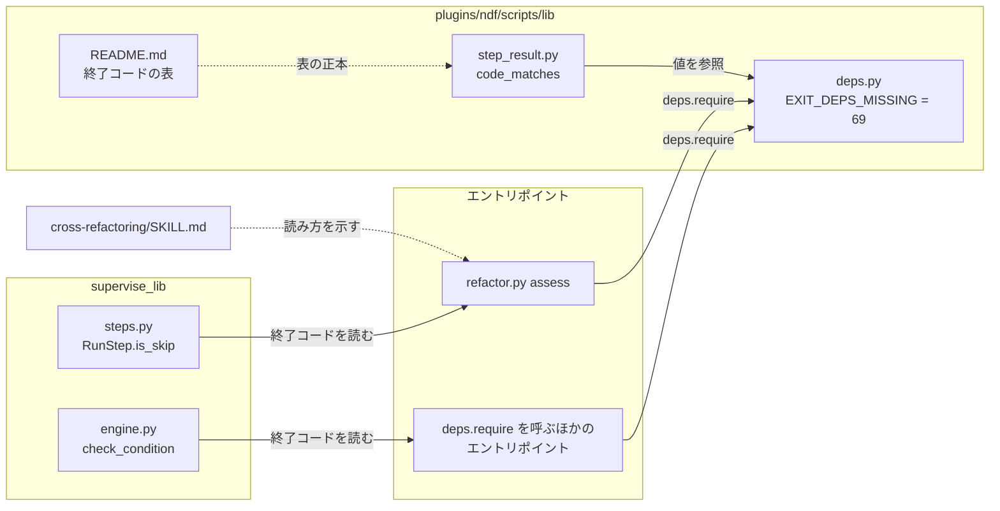
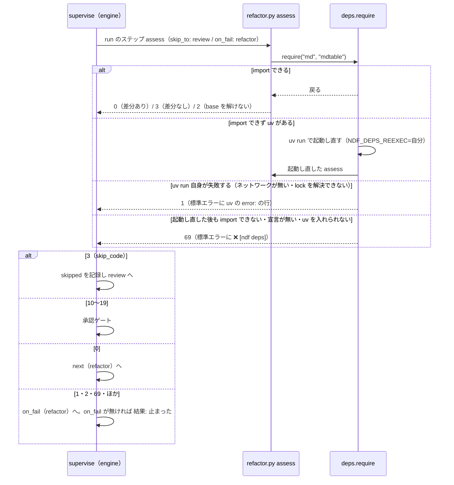

# cross-refactoring: 依存を入れられない環境で assess が「飛ばしてよい」と同じ終了コード 3 で終わり、リファクタリングが黙って飛ばされる → 依存の欠けは専用の終了コード 69 で止まり、工程に失敗として現れる（#1654）

## 目的

- **何が壊れているか**: `deps.require` が外部パッケージを用意できずに止まると終了コード 3 で終わる。3 は `refactor.py assess` の「飛ばしてよい」と同じ値で、supervise のプランはリファクタリングを飛ばして review へ進む
- **誰が困るか**: 依存の入っていない環境（素の python3・壊れた venv）で NDF を回す開発者。リファクタリングが毎回飛ばされても気づけない
- **直すと何が成り立つか**: 依存の欠けは終了コード 69 で終わり、supervise はそれを「飛ばしてよい」と読まずに `on_fail` へ進むか止まる。SKILL.md が `refactor.py` の依存を実装どおりに書く

## 適用範囲

- **働く範囲**: 配布先のリポジトリでも働く。`deps.require` を呼ぶ NDF のすべてのエントリポイントと、このリポジトリの根の `scripts/`（`scripts/lib/ndf_wrappers.py` を通す）の終了コードが変わる
- **プロジェクトごとに違うもの**: 無し（終了コードは NDF の共通の契約で、設定でも引数でも変えない）
- **当たるモード**: `standard`

## あるべき姿の根拠

| 根拠 | 種類 | 何を示すか |
| --- | --- | --- |
| `sysexits.h` の `EX_UNAVAILABLE`（69）「必要なサービスが使えない」（FreeBSD / glibc の `sysexits.h`） | 外部の一次情報 | 69 は「必要なものが手に入らず動けなかった」に当てた、慣習として流通する値である |
| `NDF_DEPS_REEXEC=<script> /usr/bin/python3 refactor.py assess --base origin/main` が `exit=3`（課題の本文、origin/develop 7c9deb77） | 実測 | 依存の欠けと「飛ばしてよい」が同じ値で区別できない |
| 配布物（`plugins/` と `scripts/`、テストを除く）の `exit` / `sys.exit(` / `SystemExit(` / `return` に続く数字の分布（2026-10-03、b96fc6fb） | 実測 | 4〜8・10・24・124・125・127・128・130・143 が使われ、69 は 0 件 |

要求と受け入れ条件は #1654 の本文にある（コピーは `issues/issue-1654-requirements.md`）。この文書は「どう作るか」だけを扱う。

## ドメインモデル

### コンテキスト

| コンテキスト | 何の語が 1 つの意味に決まるか |
| --- | --- |
| NDF の開発ワークフロー（`ndf-workflow`） | 結果 JSON の `status` と終了コードの対応、run のステップの「飛ばしてよい」（`skip_code`）、依存の欠け |

1 つのコンテキストに収まる。cross-refactoring（`ndf-cross-refactoring`）は `assess` の終了コードを `ndf-workflow` の共通の契約のまま使い、自分の語を足さない。

### 集約

| 集約 | 持ち主（書き換えてよいもの） | 根 | エンティティ | 値オブジェクト |
| --- | --- | --- | --- | --- |
| 共通の終了コードの表 | `plugins/ndf/scripts/lib/step_result.py`（定数と `code_matches`）と、その正本の表 `plugins/ndf/scripts/lib/README.md` | 終了コードの表 | — | 終了コード（値・`status`・意味の組） |
| 依存の欠けの終了コード | `plugins/ndf/scripts/lib/deps.py` | `EXIT_DEPS_MISSING` | — | 値 69 |

共通の終了コードの表は、依存の欠けの値を `deps.py` の定数への参照として持つ（値を写さない）。表の行を書き換えてよいのは `step_result.py` と README だけ、値を変えてよいのは `deps.py` だけである。

### 不変条件

| # | 集約 | 条件 | 破れたときの扱い |
| --- | --- | --- | --- |
| I1 | 依存の欠けの終了コード | `deps.require` が依存を用意できずに止まる 3 つの経路（起動し直した後も import できない・`pyproject.toml` と `uv.lock` が無い・uv を入れられない）は、どれも `EXIT_DEPS_MISSING` で終わる | テストが落ちる |
| I2 | 依存の欠けの終了コード | `EXIT_DEPS_MISSING` は共通の契約が意味を持つ値（0・1・2・3・10〜29）と重ならない | テストが落ちる |
| I3 | 共通の終了コードの表 | `code_matches("stopped", EXIT_DEPS_MISSING)` が真で、`ok` と `gate` では偽 | テストが落ちる |
| I4 | 共通の終了コードの表 | `step_result.EXIT_DEPS_MISSING` は `deps.EXIT_DEPS_MISSING` そのもの（別の値を持たない） | テストが落ちる |
| I5 | 共通の終了コードの表 | `skip_code` を書かない run のステップは、`EXIT_DEPS_MISSING` で終わっても `skip_to` へ進まない。計画の `実行の条件` も `EXIT_DEPS_MISSING` を「完了」と読まない | テストが落ちる |

### ドメインイベント

| # | イベント | 発生元 | 受け手 |
| --- | --- | --- | --- |
| E1 | エントリポイントが依存を求めた | エントリポイント（`deps.require` の呼び出し） | `deps.require` |
| E2 | 依存が import できると分かった | `deps.require` | エントリポイント（続きを走らせる） |
| E3 | uv の環境で起動し直した | `deps.require`（`os.execve`） | 起動し直したエントリポイント（E1 へ戻る） |
| E4 | 起動し直した後も import できないと分かった | `deps.require` | `deps._stop`（E5） |
| E5 | 依存の欠けで止まった | `deps._stop`（終了コード 69・標準エラーに `❌ [ndf deps]`） | 呼んだ側（supervise の run のステップ・`実行の条件`・手で打った人） |
| E6 | supervise がステップの終了コードを読んだ | supervise の駆動（`engine.py`） | `RunStep.is_skip` / `check_condition` |
| E7 | リファクタリングを飛ばした | supervise の駆動（終了コードが `skip_code`） | `skip_to` のステップ |
| E8 | ステップが止まった（失敗した）と記録した | supervise の駆動（0 でも `skip_code` でも承認ゲートでもない） | `on_fail` のステップか報告の `結果: 止まった` |

E7 は E2 を順序の前提に持つ。変更の後は、E5 の後に E7 が起きず E8 が起きる。

### 用語

| 用語 | 意味 | 用語集への反映 |
| --- | --- | --- |
| 依存の欠け | 手順のスクリプトが `deps.require` で外部パッケージを用意できずに止まったこと。終了コード 69 で終わり、`status` は `stopped`。「飛ばしてよい」とも「前提が無い（3）」とも読まない | 追加（`ndf-workflow`） |

## 機能一覧

| # | 機能 | 誰が使うか |
| --- | --- | --- |
| F1 | 依存を用意できなかったことを、終了コード 69 と `❌ [ndf deps]` の行で知らせる | NDF のエントリポイントを打つ人・supervise |
| F2 | 依存の欠けを共通の終了コードの表で `stopped` として読む | 結果 JSON を読む側（`validate_result`・LLM の手順） |
| F3 | supervise が依存の欠けを「飛ばしてよい」と読まず、`on_fail` へ進むか止まる | supervise の検査のプラン・スプリントのプラン |
| F4 | cross-refactoring の SKILL.md と `assess` の help で、終了コード 69 の読み方と `refactor.py` の依存を示す | cross-refactoring を起動する LLM と人 |

## 構成要素

| 要素 | 責務 | 変更 |
| --- | --- | --- |
| `plugins/ndf/scripts/lib/deps.py` | 依存の欠けの終了コードを持つ唯一の場所。`_stop` が 69 で終える | 定数 `EXIT_PRECONDITION = 3` を `EXIT_DEPS_MISSING = 69` に替える。docstring の「終了コード 3」2 か所を 69 に直す |
| `plugins/ndf/scripts/relay_lib/runtime.py` | ラッパー（ndf-relay）の環境を作れない・環境が無いときの終わり方 | 131 行目と 144 行目の `return deps.EXIT_PRECONDITION` を `return step_result.EXIT_PRECONDITION`（3 のまま）に替え、`import step_result` を足す。値は変えない（決定 5） |
| `plugins/ndf/scripts/lib/step_result.py` | 共通の終了コードの定数と `code_matches` | `import deps` で `EXIT_DEPS_MISSING = deps.EXIT_DEPS_MISSING` を持ち、`code_matches("stopped", …)` の値の組へ足す |
| `plugins/ndf/scripts/lib/README.md` | 終了コードの表の正本と、`deps.py` の行 | 表に 69 の行を足す。`deps.py` の行の「終了コード 3」を 69 に直す |
| `plugins/ndf/scripts/supervise_lib/steps.py`・`engine.py` | run のステップの `skip_to` と `実行の条件` の判定 | 変えない。69 は `skip_code`（3）とも承認ゲート（10〜19）とも一致せず、既存の分岐で `on_fail` か `止まった` へ進む（決定 3） |
| `plugins/ndf/skills/cross-refactoring/SKILL.md` | assess の打ち方と終了コードの読み方・`scripts/refactor.py` の説明 | 「前提」の節に 0・2・3・69 の 4 つの読み方と、`uv run` 自身の失敗の 1（決定 6）を書く。`refactor.py` の説明から「標準ライブラリのみ」を外し、`md` / `mdtable` のグループを `deps.require` で用意すると書く |
| `plugins/ndf/skills/cross-refactoring/scripts/refactor.py` | `assess` の help | help の終了コードの一覧に「69 = 依存が欠けた（判定していない）」を足す |
| `plugins/ndf/skills/cross-refactoring/scripts/refactor_lib/commands/assess.py` | `cmd_assess` の docstring の終了コードの一覧 | 同じ一覧に 69 を足す |
| `docs/glossary/glossary.json`・`docs/glossary.md` | 用語集 | 「依存の欠け」を足し、`glossary.py render` で作り直す |
| テスト（`plugins/ndf/scripts/tests/` の `test_deps.py`・`test_supervise.py`・`test_supervise_pace.py` と step_result のテスト） | 不変条件と受け入れ条件を縛る | 期待値を 3 から `deps.EXIT_DEPS_MISSING` へ替え、69 の行を足す |

図は依存と読む関係だけを描く。`assess.py`（`refactor.py` の中の `assess` の本体）・用語集・テストは図に含めない。

### `deps.require` を呼ぶ側

2026-10-03（b96fc6fb）に、テストを除く `plugins/` と `scripts/` を検索した。`deps.require` の語を含むファイルは 61 で、うち行頭でコードとして呼ぶものは 34（`deps.py` 自身の docstring を含む）である。根の `scripts/` の 7 ファイルは `scripts/lib/ndf_wrappers.py` の `require` を通して呼ぶ。差は docstring とコメントで、`lib/` のモジュール（`md.py`・`locks.py` など）が「使う側は先に呼ぶ」と書くものである。

依存の欠けを 3 と読む呼び手を、次の 3 つで探した（前提 4 の確かめ）。依存の欠けを 3 として意図して読む呼び手は無い。ただし `deps.require` を呼ぶコマンドの 3 を自前の意味で読む呼び手が 1 つあり（cross-review の `drive.py:336`）、依存の欠けをその意味へ取り違えている。この経路も 69 への変更で直る（下の表と「移行性」）。

| 検索 | 対象 | 結果 |
| --- | --- | --- |
| `\[ndf deps\]` と `deps.EXIT` | `plugins/`・`scripts/` の `.py` / `.sh` / `.md`（テストを除く） | `deps.py`・README の `deps.py` の行・`relay_lib/runtime.py:131` と `:144`（`return deps.EXIT_PRECONDITION`）。runtime.py の 2 か所は改名で AttributeError になるため、`step_result.EXIT_PRECONDITION` へ替える（決定 5） |
| `== 3` / `-eq 3` / `3)` | `plugins/`・`scripts/` の `.py` / `.sh`（`plugins/ndf/skills` を含む。テストを除く） | `steps.py:109` と `engine.py:388`（`skip_code`）は依存の欠けではなく「飛ばしてよい」を読む。`cross-review/scripts/drive.py:336` は `state.py merge-fix` の 3 を `merge_fix.py` の自前のコード（ci-code-fail）と読んで `sweep-start` へ進む。`state.py` は import の時点で `deps.require("github", "mdtable", "durable")` を呼ぶ（`state.py:29`）ため、依存が欠けると今は `deps._stop` の 3 で終わり、`drive.py` はそれを ci-code-fail と取り違えて最終スイープへ進む。69 の後は `must` が `Stop`（`state.py merge-fix が終了コード 69 で止まった`）で止まり、取り違えが消える |
| `uv` / `依存` / `外部パッケージ` と「終了コード 3」の近接 | `plugins/`・`docs/` の `.md`（`CHANGELOG.md` と開発履歴を除く） | README の `deps.py` の行と、実験版の台帳 `docs/ndf-experiments.md` の `deps-trial.py` の行だけ |

`skip_to` / `実行の条件` が打つ 5 つのコマンドのうち、`deps.require` を呼ぶのは `refactor.py assess` だけである。`check-trigger.py`（`eval` / `changed` / `finish`）は `deps.require` を呼ばず、import する `lib/` のモジュールも import の時点では呼ばない。`procedures.py` の `_skip_condition` は `exit 3` を打つだけである。

## 入出力の契約

コマンドの約束（API ではない）のため、`interface-api.md` の表の形で書く。

| 項目 | 内容 |
| --- | --- |
| 名前 | `deps.require(<グループ>, ...)` を呼ぶすべてのエントリポイントの、依存の欠けのときの終わり方 |
| 入力 | 変わらない（グループの名前・`project=`・環境変数 `NDF_DEPS_REEXEC` / `NDF_DEPS_VENV`） |
| 出力 | 成功: 変わらない（戻るか、uv の環境で起動し直す）。失敗: 標準エラーに `❌ [ndf deps] <理由>` の 1 行、標準出力は空 |
| 失敗の形 | 起動し直した後も import できない・`pyproject.toml` と `uv.lock` が無い・uv を入れられない の 3 つとも終了コード **69**（今は 3）。**uv はあるが `uv run` 自身が失敗する**（ネットワークが無い・lock を解決できない）ときは、`os.execve` で `uv run` に置き換わった後のため `deps._stop` を通らず、uv の終了コード **1** と uv の `error:` の行で終わる（69 にも `❌ [ndf deps]` の行にもならない。決定 6） |
| 互換性 | 3 を依存の欠けと意図して読む呼び手は無い（上の検索）。3 を「飛ばしてよい」と読む supervise は、依存の欠けを飛ばさなくなる（直したい振る舞い）。`drive.py:336` は依存の欠けを ci-code-fail と取り違えなくなり、止まる（直したい振る舞い）。0 以外を失敗と読む呼び手は変わらない |

共通の終了コードの表（`plugins/ndf/scripts/lib/README.md`）は次の形になる。3 の行は今のまま（依存の欠けを含まない）。

| 終了コード | status | 意味 |
| --- | --- | --- |
| 0 | `ok` | 手順が終わった |
| 1 | `stopped` | チェックで違反があった・手順が失敗した |
| 2 | `stopped` | 読めない・呼び出しの誤り。「一致」「0 件」と読まない |
| 3 | `stopped` | 前提が無い（宣言・認証・対象のファイル）、または各スクリプトが定めた正常な否定の結果（立たない・変更なし・飛ばしてよい）。読めないときは 2 で返し、3 と混ぜない |
| 10〜19 | `gate` | 承認ゲート。人の同意が要る |
| 20〜29 | `gate` | LLM の判断待ち |
| 69 | `stopped` | 依存の欠け。`deps.require` が外部パッケージを用意できずに止まった。手順は何も判定していない。「飛ばしてよい」とも 3 とも読まない（値の持ち主は `deps.py`） |

`refactor.py assess` の終了コードは次の 4 つと、`uv run` 自身の失敗の 1 になる。SKILL.md の「前提」の節にも 5 行とも書く。

| 終了コード | 意味 | cross-refactoring を |
| --- | --- | --- |
| 0 | プロダクションコードの差分がある | 起動する |
| 3 | 差分が無い（飛ばしてよい） | 起動しない |
| 2 | `<base>` を解けない（判定できない） | 飛ばしてよいとは読まない。起点を直して打ち直す |
| 69 | 依存が欠けた（判定していない） | 起動するかを決めない。標準エラーの理由を見て依存を入れ、打ち直す |
| 1 | `uv run` 自身が失敗した（ネットワークが無い・lock を解決できない。判定していない）。標準エラーは uv の `error:` の行 | 69 と同じに扱う。supervise は `skip_code` と読まず `on_fail` へ進む |

## 処理の流れ

`実行の条件` は同じ順で判定する。0 なら流し、`skip_code`（3）なら `結果: 完了`、69 を含むそれ以外は `結果: 止まった`（理由に `exit=69` と結果 JSON か出力の末尾）。

## 非機能の実現方式

| 大項目 | 要求の条件 | 実現方式 | 確かめ方 |
| --- | --- | --- | --- |
| 運用・保守性 | 依存の欠けの終了コードを持つのは `deps.py` の定数 1 つだけにする。値を写した定数を Skill ごとに置かない（Value 6） | `deps.py` に `EXIT_DEPS_MISSING = 69` を置き、`step_result.py` は `deps.EXIT_DEPS_MISSING` を参照する。SKILL.md と help は値を文で書くが、コードの定数は増やさない | `step_result.EXIT_DEPS_MISSING is deps.EXIT_DEPS_MISSING` のテスト（I4）と、テストを除く `plugins/ndf` で `= 69` を書くのが `deps.py` の 1 行だけ |
| 移行性 | 依存の欠けを 3 と意図して読む呼び手は前提 4 のとおりテストだけで、利用者の側の移行の作業は要らない。3 を自前の意味で読んで依存の欠けを取り違えていた `drive.py:336` は、69 で止まるようになる（この経路も 69 で解消される） | 「`deps.require` を呼ぶ側」の 3 つの検索で確かめた。テストの期待値を同じ変更で直す。`relay_lib/runtime.py` は `step_result.EXIT_PRECONDITION` へ替えて 3 を保つ | 全体テストが通る（`test_relay.py` の終了コード 3 の期待値を含む） |

## 決定の記録

### 決定 1: 依存の欠けを既存のどの値とも取り違えないため、終了コードを 69 にする

69 は `sysexits.h` の `EX_UNAVAILABLE`（必要なサービスが使えない）で、「必要なものが手に入らず動けなかった」という意味が慣習として通じる。配布物の終了コードの分布で 0 件で、共通の契約（0〜3・10〜29）とも、`deps.require` を呼ぶエントリポイントが自分で使う値（`refactor.py` の 4・`handoff.py` の 4 と 5・`report.py` の 6 など）とも、シェルの予約（126・127・128 以上）や supervise の打ち切り（124・125）とも重ならない。

小さい空き番号（9 など）は、各スクリプトが自分の値を 4 から順に足していくと次に取られやすく、意味も運ばない。78（`EX_CONFIG`、設定の誤り）は、依存の欠けがネットワークや権限でも起きるため意味が合わない。

根拠: Value 6 / Value 8（MVV 版 2）

### 決定 2: 値の持ち主を 1 つにするため、定数は `deps.py` が持ち、`step_result.py` はそれを参照する

依存の欠けを出すのは `deps._stop` の 1 か所で、値を決める責務もそこにある。`step_result.py` は `import deps`（同じ `lib/` にあり、標準ライブラリだけで、import の時点では何もしない）で値を受け、`code_matches` の `stopped` の組へ足す。表の正本の README は値と持ち主を書く。

`step_result.py` に定数を置いて `deps.py` から import する形は採らない。`deps.py` はラッパー（`relay_lib/runtime.py`）にも `find_uv`・`install_uv`・`venv_dir`・`GROUPS` などを使われる最下層で（今は `EXIT_PRECONDITION` も使われる。決定 5 で外す）、`proc` を import する `step_result.py` へ依存させると、最下層が上の層を引き込む。両方に 69 を書く形は、要求の「値を写した定数を置かない」に反する。

根拠: Value 6（MVV 版 2）

### 決定 3: supervise の判定は変えず、テストで縛るだけにする

`RunStep.is_skip` は終了コードが `skip_code`（既定 3）と等しいときだけ飛ばし、`check_condition` も `skip_code` と等しいときだけ `完了` にする。69 はどちらにも一致せず、既存の分岐で `on_fail` か `止まった` へ進む。受け入れ条件 3・4 はコードの変更なしで満たせるため、退行を防ぐテストだけを足す。

69 を名指しで扱う分岐（依存の欠けの専用の理由の文を出すなど）は足さない。報告には `exit=69` と標準エラーの `❌ [ndf deps]` の行が既に載り、分岐を足すと終了コードの意味を supervise にも持たせることになる。

根拠: Value 1 / Value 6（MVV 版 2）

### 決定 4: 終了コード 3 の 2 つの意味の分離と、ほかの「依存の欠け」の実装は、この変更に入れない

共通の契約で 3 が「前提が無い」と「正常な否定の結果」の両方を指すことは、今それを「飛ばしてよい」と読むステップが無いため、この課題の現象を起こさない（要求の前提 5）。mcp-serena の `serena_lsp/env.py`（`EXIT_PRECONDITION = 3`、docstring に「NDF の `deps.require()` と同じ契約」）と、実験版の `experimental/deps-trial.py`・`hook-trial.py` の 3 は、`deps.require` を通らない別の実装で、要求の対象範囲（`deps.require` の経路）の外にある。どちらも「未確認のまま残ること」に載せ、起票するかを conductor へ渡す。

根拠: Value 1 / Value 9（MVV 版 2）

### 決定 5: ラッパーの環境が無いときの終了コードは 3 のまま保ち、参照先を `step_result.EXIT_PRECONDITION` へ替える

`relay_lib/runtime.py` の 2 か所（環境を作れない・環境が無い）は、`deps.require` の経路ではなく、ラッパー（ndf-relay）自身の「前提が無い」で、`install` の lock の取り合いや設定ディレクトリを作れないときの 3 と同じ契約に属する（`test_relay.py` が 3 を縛る）。supervise もほかのスクリプトもこの 3 を「飛ばしてよい」と読まない。69 へ替えるとラッパーの契約の中で値が割れるため、値は 3 のまま、共通の契約の定数（`step_result.EXIT_PRECONDITION`。標準ライブラリと `proc` だけを import する）を参照する。これで `deps.py` から `EXIT_PRECONDITION` を外しても AttributeError にならない。

根拠: Value 1 / Value 6（MVV 版 2）

### 決定 6: `uv run` 自身の失敗は 69 へ揃えず、uv の終了コード 1 のまま読み方を書く

`deps.require` は `os.execve` で `uv run --frozen` に置き換わるため、uv が環境を作れない（ネットワークが無い・lock を解決できない）ときは uv の終了コードで終わる。2026-10-03 に、解けない依存を持つ project で `uv run --offline --project . python -c 1` を打って `exit=1` と `error: No solution found when resolving dependencies` を確かめた。1 は `skip_code`（3）とも承認ゲートとも一致しないため、supervise は飛ばさず `on_fail` へ進み、#1654 の現象（黙って飛ばされる）は起きない。

69 へ揃えるには、`execve` をやめて子プロセスで待つ・先に `uv sync` を打つなどで起動の形を変えることになり、プロセスが 1 段増え、終了シグナルと標準入出力の受け渡しを作り直す必要がある。直したい現象には要らないため採らず、入出力の契約と SKILL.md の「前提」の節に「1 は uv run 自身の失敗で、判定していない。69 と同じに扱う」と書く。

根拠: Value 1 / Value 3（MVV 版 2）

## テスト設計

| 受け入れ条件・不変条件 | どの振る舞いで縛るか | どう壊したら落ちるべきか |
| --- | --- | --- |
| 受け入れ条件 1 | 依存の欠けた python で `refactor.py assess` を打つと、終了コードが 69 で、標準エラーに `❌ [ndf deps]` で始まる行が出る（手で打つ確かめは要求の「検証手段」の起動の行） | `deps._stop` が 3 で終わるように戻す |
| 受け入れ条件 2・I1 | `deps.require` の 3 つの止まり方（起動し直した後も import できない・宣言が無い・uv を入れられない）が、どれも `deps.EXIT_DEPS_MISSING` で終わり、3 ではない | 3 つのどれか 1 つの経路だけを別の値（3 や 1）で終わらせる |
| 受け入れ条件 3・I5 | `skip_to` を持ち `skip_code` を書かない run のステップが 69 で終わると、`skip_to` へ進まず `skipped` を記録せず、`on_fail` へ進む | `is_skip` を「0 以外は飛ばす」や「`stopped` の値なら飛ばす」に変える |
| 受け入れ条件 4・I5 | `実行の条件`（`skip_code: 3`）のコマンドが 69 で終わると、報告は `結果: 止まった` | `check_condition` が 3 以外の `stopped` の値も `完了` にする |
| 受け入れ条件 5 | 依存がそろった環境で `assess` が差分なしで 3、差分ありで 0、`<base>` を解けなければ 2（既存の `cross-refactoring/tests/test_assess.py`） | `assess` の終了コードの割り当てを変える |
| 受け入れ条件 6 | `skip_to` を持つ run のステップが 3 で終わると `skip_to` へ進む（既存の `test_skip_to_jumps_over_steps`） | `is_skip` が 3 を飛ばさなくなる |
| 受け入れ条件 7・I3 | `code_matches("stopped", 69)` が真、`code_matches("ok", 69)` と `code_matches("gate", 69)` が偽 | `code_matches` の `stopped` の組から 69 を外す |
| I2 | `deps.EXIT_DEPS_MISSING` が 0〜3 と 10〜29 のどれでもない | 値を 3 や 10〜29 の値に変える |
| I4 | `step_result.EXIT_DEPS_MISSING` が `deps.EXIT_DEPS_MISSING` と同じもの | `step_result.py` に 69 を直に書いて片方だけ変える |
| 決定 5 | ラッパーの環境を作れないときの `install` が終了コード 3 で止まる（既存の `test_install_stops_when_env_cannot_be_made`） | `runtime.py` が `deps.EXIT_PRECONDITION` を参照したまま残る（AttributeError） |
| 受け入れ条件 8・9 | テストを書かない（`.md` の文言を照合しない）。レビューで SKILL.md の「前提」の節と `refactor.py` の説明を読む | — |
| 受け入れ条件 10 | 全体テスト・`python3 scripts/check-skill-frontmatter.py`・`claude plugin validate .` が 0 で終わる | — |

## 設計の結果

| 課題 | 扱い | 取り込み先 | 触るファイル |
| --- | --- | --- | --- |
| #1654 | 実装する | — | `plugins/ndf/scripts/lib/deps.py`、`plugins/ndf/scripts/lib/step_result.py`、`plugins/ndf/scripts/lib/README.md`、`plugins/ndf/scripts/relay_lib/runtime.py`、`plugins/ndf/skills/cross-refactoring/SKILL.md`、`plugins/ndf/skills/cross-refactoring/scripts/refactor.py`、`plugins/ndf/skills/cross-refactoring/scripts/refactor_lib/commands/assess.py`、`plugins/ndf/scripts/tests/`、`docs/glossary/glossary.json`、`docs/glossary.md` |

## 未確認のまま残ること

| 項目 | 内容 |
| --- | --- |
| 受け入れ条件 1 の自動テストの形 | 全体テストの venv には `md` / `mdtable` が入っているため、依存の欠けた python の用意の仕方（`/usr/bin/python3` の有無に頼らない形）は `tdd-cycle` で走らせて決める。手で打つ確かめは要求の「検証手段」の起動の行で行う |
| assess の `on_fail` の先 | 依存が欠けた環境では、`on_fail` の refactor（cross-refactoring の駆動）も同じ依存を要るため止まる。受け入れ条件 3 は `on_fail` へ進むことまでを求め、その先の止まり方は今の振る舞いのままである |
| mcp-serena の `serena_lsp/env.py` | 依存を用意できないときに終了コード 3 で終わり、docstring が「NDF の `deps.require()` と同じ契約」と書く。この変更の後は契約が食い違う。今その 3 を「飛ばしてよい」と読む呼び手は無い。別の課題にするかを conductor が決める（決定 4） |
| cross-review の `drive.py:336` の経路の自動テスト | 依存の欠けた環境で `state.py merge-fix` が 69 で終わり `drive.py` が `sweep-start` へ進まず止まることは、この変更では自動テストで縛らない（受け入れ条件に無い）。`must` の既存の分岐（`ok=(0,)` 以外は `Stop`）に頼る |
| 終了コード 3 の 2 つの意味の分離（要求の前提 5） | 別の課題として起こすかを conductor が決める（要求の「未決」） |
| 実験版の `deps-trial.py`・`hook-trial.py` | 依存の欠けを 3 で返す。実験版は既定の振る舞いに入らず、台帳の行き先は「L0 へ移したら消す」。この変更では触らない |
