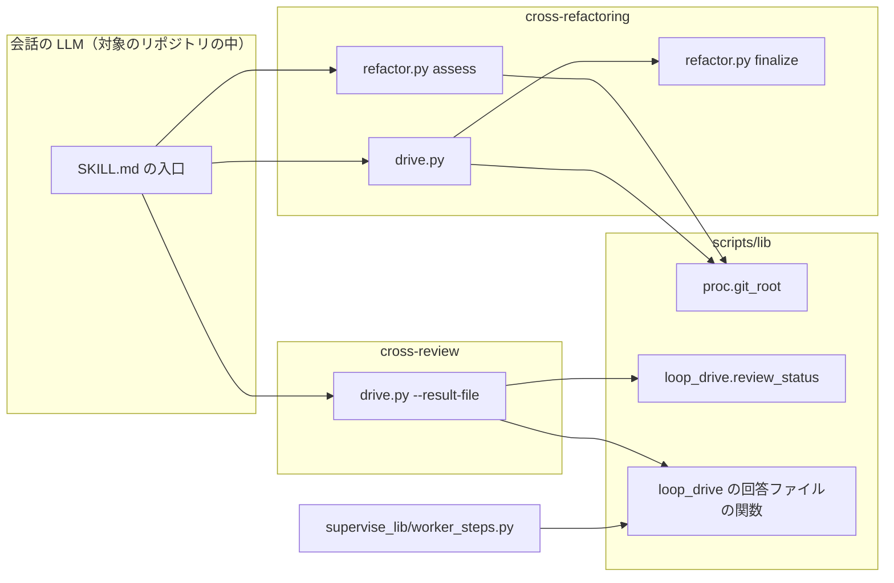
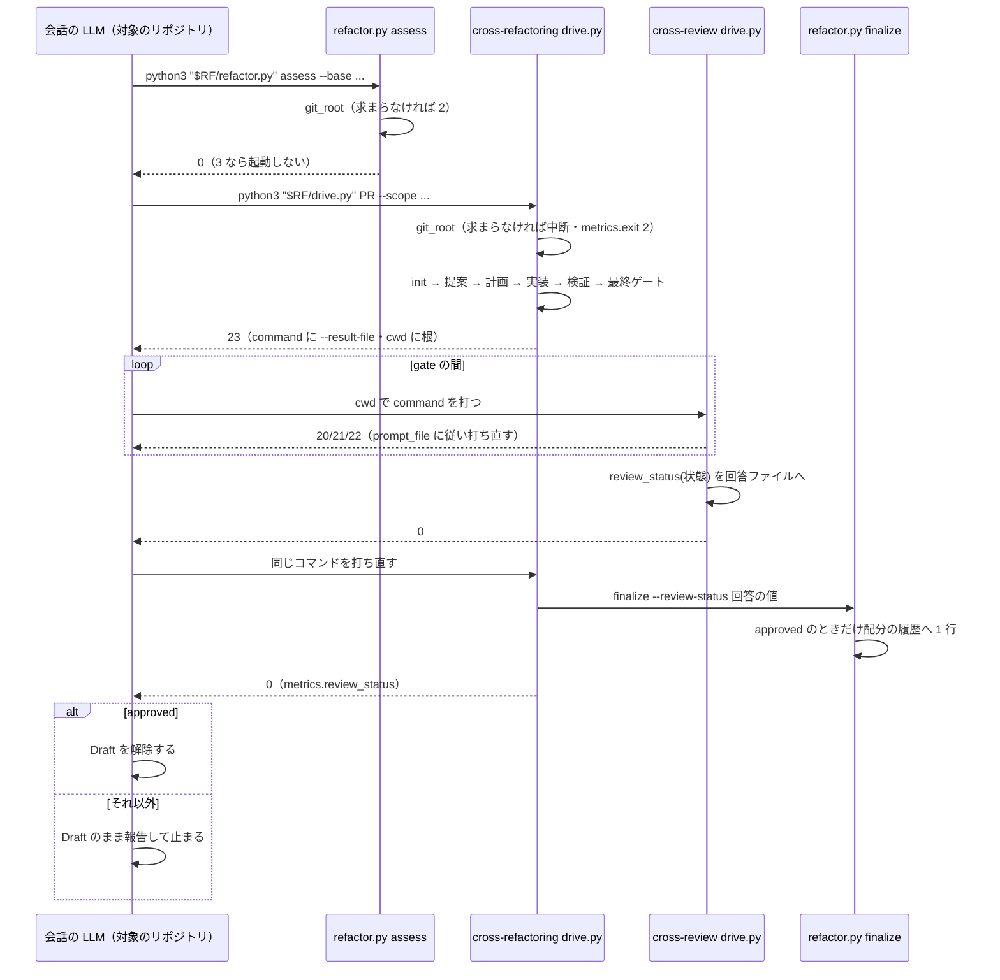

# cross-refactoring: ai-plugins 以外のリポジトリで手順どおりに単独起動すると止まり、最終ゲートでは未検証のレビューが approved と記録される → 対象のリポジトリの中から打てば finalize まで通り、最終ステータスは cross-review の駆動が決めた値だけが記録される（#1655 #1656）

## 目的

- **何が壊れているか**: `SKILL.md` は「Skill のディレクトリで」打つと書くが、スクリプトは現在のディレクトリから対象のリポジトリを決める。インストール先の Skill のディレクトリは git リポジトリでないため、assess は終了コード 2、drive は init で止まる。最終ゲートでは、プロンプトが最終ステータスの規則を写して LLM に決めさせ、スイープが未検証でも `approved` になる
- **誰が困るか**: ai-plugins 以外のリポジトリで `/ndf:cross-refactoring` を単独で使う利用者。未検証の実行が配分の履歴に入り、次のリファクタリング計画の見積りが狂う
- **直すと何が成り立つか**: 対象のリポジトリの中から `SKILL.md` のとおりに打てば finalize まで通る。最終ステータスは `loop_drive.review_status` の 1 か所が決め、`approved` のときだけ履歴に入り Draft が解除される

## 適用範囲

- **働く範囲**: 配布先のリポジトリで働く（cross-refactoring の単独起動）。ai-plugins の中での今の打ち方も働く
- **プロジェクトごとに違うもの**: 対象のリポジトリは引数でも設定でもなく、打つ場所（現在のディレクトリが属する git の worktree）で受ける。開発の起点は今のとおり `--base` で受ける
- **当たるモード**: `standard`（工程表の単独起動）。`--workflow-step` で起動する経路（supervise）は振る舞いを変えない

## あるべき姿の根拠

| 根拠 | 種類 | 何を示すか |
| --- | --- | --- |
| 一時の git リポジトリ（origin `https://github.com/example/sample.git`・`src/a.py` に 20 行の差分）の中で、解決の入口が返した絶対パスの `refactor.py assess --base origin/main` が `判定: 通す`・終了コード 0 を返した（2026-10-03、配布版 10.17.58） | 実測 | 打つ場所を対象のリポジトリへ移せば、スクリプトを変えずに assess が通る（AC2） |
| 同じコマンドを git でないディレクトリ（`/tmp/nogit`）で打つと `ERROR: 起点 origin/main から HEAD までの差分を取れません`・終了コード 2 | 実測 | 原因は打つ場所で、表示は「対象のリポジトリを決められない」ことを示さない（AC4） |
| `/tmp/nogit` から `resolve.sh scripts cross-refactoring` が `~/.claude/plugins/cache/ai-plugins/ndf/10.17.58/skills/cross-refactoring/scripts` を返し、ai-plugins の worktree では開発中の `plugins/ndf/skills/cross-refactoring/scripts` を返した | 実測 | Skill のディレクトリへ移らずにスクリプトの絶対パスを得られ、ai-plugins では今と同じ実体を打つ（AC1・AC12） |
| 「最終ステータスの決め方を loop_drive.review_status の 1 つへ寄せる」 | 利用者の指示の原文 | 規則の持ち手を 1 つにする（AC7） |

要求と受け入れ条件は #1655 の本文にある（コピーは [issue-1655-requirements.md](issue-1655-requirements.md)）。#1656 の受け入れ条件も同じ本文に含む。この文書は「どう作るか」だけを扱う。

## 例: 変えた後の形で単独起動を通すと

利用者が `example/sample` の Draft の Pull Request 12 で、`example/sample` の clone の中から会話を始めた場合。

1. 会話の LLM が `SKILL.md` の「前提」の 1 ブロックを打つ。解決の入口がインストール先の `skills/cross-refactoring/scripts` の絶対パスを `$RF` に入れ、`python3 "$RF/refactor.py" assess --base origin/main` が `example/sample` の差分を見て 0 を返す
2. 「実行」の 1 行 `python3 "$RF/drive.py" 12 --scope src tests` を同じ場所で打つ。drive は現在のディレクトリの git の根（`example/sample` の clone）を対象のリポジトリとして記録し、init が `example/sample` の PR 12 を取り、その worktree を作る
3. 最終ゲートで終了コード 23 が返る。`items[0]` は `command`（`python3 <cross-review の drive.py> 12 --focus ... --result-file <回答ファイル>`）と `cwd`（clone の根）を持つ
4. LLM は `cwd` で `command` を打つ。cross-review の駆動が修正・スイープで止まる間は、その `prompt_file` に従って打ち直す。収束すると駆動が回答ファイルへ `{"review_status": "unverified"}` を書く（スイープが未検証だったため。値は `review_status()` が決める）
5. LLM が手順 2 の行を打ち直す。drive が回答ファイルを読み、`finalize --review-status unverified` を打つ。配分の履歴へは足さず、結果 JSON の `metrics.review_status` が `unverified` で終わる
6. `approved` でないので、LLM は Draft のまま最終ステータスを報告して止まる

clone の外（例: `~/.claude/plugins/cache/.../skills/cross-refactoring`）で手順 1 を打つと、assess は「対象のリポジトリを決められない」と出して 2 で終わる。手順 2 なら drive が init を打たずに中断する。

## ドメインモデル

### コンテキスト

| コンテキスト | 何の語が 1 つの意味に決まるか |
| --- | --- |
| cross-refactoring（`ndf-cross-refactoring`） | 単独起動・対象のリポジトリ・最終ゲート・配分の履歴へ足す条件 |
| cross-review（`ndf-cross-review`） | 最終ステータス・回答ファイル（最終ゲートが待つもの） |

cross-review が供給者、cross-refactoring が顧客の関係（顧客 / 供給者）。cross-refactoring は最終ステータスを自分で決めず、cross-review の駆動が回答ファイルへ書いた値だけを受ける。

### 集約

| 集約 | 持ち主（書き換えてよいもの） | 根 | エンティティ | 値オブジェクト |
| --- | --- | --- | --- | --- |
| 単独起動の実行 | cross-refactoring の `drive.py`（進み）と `refactor.py`（状態ファイル） | cross-refactoring の状態ファイル（`rf<ID>`） | 改善項目 | 対象のリポジトリの根・最終ゲートの結果（`final_gate.review_status` を含む） |
| 収束ループ | cross-review の `drive.py` と `state.py` | cross-review の状態ファイル | ラウンド | 最終ステータス（`final` と `sweep` から導く）・回答ファイルの中身 |

単独起動の実行は収束ループを PR 番号と回答ファイルのパスで指し、cross-review の状態ファイルを読まない。

### 不変条件

| # | 集約 | 条件 | 破れたときの扱い |
| --- | --- | --- | --- |
| I1 | 収束ループ | 回答ファイルに入る最終ステータスは、その状態に対する `loop_drive.review_status()` の値と一致する。最終ステータスを導く規則は `review_status` の 1 か所だけが持つ | 一致しない値は書かない。テストが落とす |
| I2 | 収束ループ | 回答ファイルの形は `{"review_status": "<値>"}` だけで、形を作る関数は共通ライブラリに 1 つある。値が無ければ `unknown` | 形の違う回答ファイルは cross-refactoring の drive が `unknown` として読む |
| I3 | 単独起動の実行 | 配分の履歴へ 1 行を足すのは、最終ゲートが通り最終ステータスが `approved` の実行だけである | finalize が足さずに理由を 1 行出す（今の `cmd_finalize`） |
| I4 | 単独起動の実行 | Draft を解除するのは、結果 JSON の `metrics.review_status` が `approved` のときだけである | 解除せずに最終ステータスを報告して止まる |
| I5 | 単独起動の実行 | 対象のリポジトリは、現在のディレクトリが属する git の worktree の根である。決められなければ別のリポジトリを対象にせず止まる | assess は終了コード 2、drive は init を打たずに中断（`metrics.exit` 2） |
| I6 | 単独起動の実行 | supervise の経路の回答ファイルの形と終了コードの表（0・23・1）は変わらない | テストが落とす |

### ドメインイベント

| # | イベント | 発生元 | 受け手 |
| --- | --- | --- | --- |
| E1 | 利用者が対象のリポジトリで単独起動を始めた | 利用者（会話の LLM） | `SKILL.md` の「前提」の手順 |
| E2 | assess がプロダクションコードの差分を判定した | `refactor.py assess` | 会話の LLM（3 なら起動しない） |
| E3 | drive の init が対象の Pull Request と作業ディレクトリを決めた | `refactor.py init`（drive から） | drive の以降の手順 |
| E4 | 駆動が最終ゲートで止まった（終了コード 23） | cross-refactoring の `drive.py` | 会話の LLM |
| E5 | cross-review の駆動が終わった | cross-review の `drive.py` | 回答ファイルの書き込み（同じ駆動の中） |
| E6 | 最終ステータスが回答ファイルへ書かれた | cross-review の `drive.py`（`--result-file`）。supervise の経路では `worker_steps.py` も同じ値を書く | cross-refactoring の `drive.py`（打ち直し） |
| E7 | 打ち直した駆動が finalize を打ち、`approved` のときだけ配分の履歴へ 1 行を足した | cross-refactoring の `drive.py` → `refactor.py finalize` | 会話の LLM（結果 JSON） |
| E8 | 最終ステータスが `approved` のときだけ Draft を解除した | 会話の LLM | Pull Request |

### 用語

| 用語 | 意味 | 用語集への反映 |
| --- | --- | --- |
| 単独起動 | `--workflow-step` を付けずに呼んだ cross-refactoring の起動。最終ゲートが cross-review の承認収束になる | 追加（`ndf-cross-refactoring`） |
| 対象のリポジトリ | cross-refactoring が Pull Request を取り、作業ディレクトリを作るリポジトリ。打った場所（現在のディレクトリ）が属する git の worktree の根で決まる | 追加（`ndf-cross-refactoring`） |
| 最終ステータス | cross-review の収束の終わり方を表す 1 語（`approved` / `unverified` / `final` の値 / `unknown`）。`loop_drive.review_status` が状態ファイルから決める | 追加（`ndf-cross-review`） |
| 回答ファイル | 駆動が止まりで示す `items[0].result_file`。止まりへの答えを書き、同じコマンドの打ち直しが読む。担当 CLI の結果ファイルとは別 | 追加（`ndf-cross-review`） |

## 機能一覧

| # | 機能 | 誰が使うか |
| --- | --- | --- |
| F1 | 対象のリポジトリの中から、Skill のディレクトリへ移らずに assess・drive・`bg-wait.sh` を打つ | 単独起動する会話の LLM |
| F2 | 現在のディレクトリが git の worktreeでなければ、対象のリポジトリを決められないと示して止まる | assess・drive |
| F3 | 最終ゲートの止まりが、cross-review の駆動を打つ作業ディレクトリと、回答ファイルを書かせる引数を示す | cross-refactoring の drive |
| F4 | cross-review の駆動が終わったら、最終ステータスを回答ファイルへ書く | cross-review の drive |
| F5 | 最終ステータスが `approved` のときだけ Draft を解除する | 単独起動する会話の LLM |

## 構成要素

| 要素 | 変更 | 責務 |
| --- | --- | --- |
| `plugins/ndf/skills/cross-refactoring/SKILL.md` | 変更 | 「前提」の assess と「実行」の drive・`bg-wait.sh` を、対象のリポジトリの中から解決の入口で得た絶対パスで打つ形にする（入出力の契約の「打ち方」）。終了コード 23 の行に、`items[0].cwd` で `command` を打つことと、Draft を解除する条件（`metrics.review_status` が `approved`）を書く。規則は写さない |
| `plugins/ndf/skills/cross-refactoring/docs/04-verify-and-report.md` | 変更 | 「単独起動の終わり」から最終ステータスの規則の写し（`sweep.verified` ほか）を消し、`loop_drive.review_status` が決めて cross-review の駆動が回答ファイルへ書くことを指す |
| `plugins/ndf/skills/cross-refactoring/docs/01-state-and-propose.md` | 変更 | 「駆動の準備」の「Skill のディレクトリの解決」を、`SKILL.md` の「前提」の入口のブロックを指す形にする |
| `plugins/ndf/skills/cross-refactoring/scripts/drive.py` | 変更 | 開始の前に対象のリポジトリの根を求め、求まらなければ耐久の記録を開かずに中断する。根は耐久ステップで 1 度だけ求めて記録する。`pause_review` は `command` に `--result-file <回答ファイル>` を足し、`items[0].cwd` に根を載せ、プロンプトは「`cwd` で打つ・終わったら打ち直す」だけにする。使わない import（`review_status`）を消す |
| `plugins/ndf/skills/cross-refactoring/scripts/refactor_lib/commands/assess.py` | 変更 | 差分を見る前に対象のリポジトリの根を求め、求まらなければ「対象のリポジトリを決められない」と出して 2 で終わる |
| `plugins/ndf/scripts/lib/proc.py` | 変更 | `git_root` に、止まるときの案内の文（今は `--root を渡す`）を呼び手が渡せる引数を足す。既定は今の文 |
| `plugins/ndf/scripts/lib/loop_drive.py` | 変更 | 回答ファイルの中身を結果 JSON の `metrics` から作る関数を 1 つ足す（I2）。`review_status` は変えない |
| `plugins/ndf/skills/cross-review/scripts/drive.py` | 変更 | 引数 `--result-file PATH` を受ける（`state.py init` へは渡さない）。結果の `status` が `ok` のとき（終わった収束ループの結果をそのまま返すときを含む）だけ、loop_drive の関数で回答ファイルを書く |
| `plugins/ndf/scripts/supervise_lib/worker_steps.py` | 変更 | 回答ファイルを書く式を loop_drive の関数へ置き換える。書く値・形・時点は変えない（I6） |
| `docs/glossary/glossary.json` | 変更 | 用語の表の 4 語を足し、`glossary.py render` で文書を作り直す |



図は呼び出しの関係だけを描く。文書（`docs/04`・`docs/01`・用語集）は呼ばれないため描かない。

**値を足す集合と、当てはまるかを判定した既存の規則。**

| 足す値 | 集合を前提にした既存の規則 | 判定 |
| --- | --- | --- |
| cross-review の drive の引数 `--result-file` | 知らない引数は `parse_known_args` の残りとして `state.py init` へ渡る | 当てはまらない。drive の引数として受け、残りへ入れない（構成要素の表の cross-review の `drive.py`） |
| 同上 | 終わった収束ループを打ち直すと記録した結果をそのまま返す（`keep_finished`） | 当てはまらない。書く時点を「結果を出す直前で `status` が `ok`」に置き、記録を返す経路でも書く |
| `cross-review` の止まりの `items[0].cwd` | supervise は `command` を持つ止まりでは `cwd` を読まず、自分の作業場所で `command` を打つ（`worker_steps.py:167`） | 当てはまる。supervise の作業場所は対象の worktree で、振る舞いは変わらない |

## 入出力の契約

### 打ち方（`SKILL.md`）

「前提」の assess と「実行」の drive は、対象のリポジトリ（またはその worktree）の中で、次のブロックを 1 つのシェルで打つ。`$R` の決め方は `development-workflow/references/scripts-lookup.md` を指す（`fix` の `SKILL.md` と同じ書き方）。

```bash
RF=$(bash "$R/scripts/resolve.sh" scripts cross-refactoring) || exit 3
LIB=$(bash "$R/scripts/resolve.sh" scripts)/lib || exit 3
BASE="<開発の起点>"   # worktree-setup.sh check の「開発の起点:」の行の名前
python3 "$RF/refactor.py" assess --base "origin/$BASE"; echo "exit=$?"
python3 "$RF/drive.py" <PR> --scope <範囲...> [「引数」の表のうち値のあるもの]
bash "$LIB/bg-wait.sh" run "$RC" -- python3 "$RF/drive.py" <PR> --scope <範囲...> [上と同じ引数]
```

このうち入口の 2 行と assess の行は、「あるべき姿の根拠」の 1 行目の実測で打った形である。

### 止まらずに中断する形（assess・drive）

| コマンド | 現在のディレクトリが git の worktreeでないとき |
| --- | --- |
| `refactor.py assess` | 標準エラーに「対象のリポジトリを決められない（`<現在のディレクトリ>` は git の worktreeでない）。対象のリポジトリの中で打つ」の旨を出し、終了コード 2 |
| `drive.py` | `status: stopped`・終了コード 1・`metrics.exit` 2。`summary` は同じ旨。耐久の記録を開かず、`gh` を呼ばない |

### 最終ゲートの止まり（終了コード 23）

| 欄 | 今 | 変えた後 |
| --- | --- | --- |
| `items[0].command` | `python3 <cross-review の drive.py> <PR> --focus <観点>` | 末尾に `--result-file <回答ファイル>` を足す |
| `items[0].cwd` | 無し | 対象のリポジトリの根 |
| `items[0].result_file` | 回答ファイル | 変えない |
| `prompt_file` の中身 | cross-review の状態ファイルから最終ステータスを決める規則を書く | `cwd` で `command` を打つ（gate の間はその `prompt_file` に従って打ち直す）こと、終われば駆動が回答ファイルを書くこと、同じコマンドを打ち直すことだけを書く。規則も状態ファイルの鍵も書かない |

### cross-review の drive の `--result-file`

| 項目 | 内容 |
| --- | --- |
| 引数 | `--result-file PATH`。省けば今のとおり書かない |
| 書く時点 | 結果 JSON を出す直前に `status` が `ok` のとき。`gate` と `stopped` では書かない |
| 中身 | `{"review_status": "<metrics.review_status。無ければ unknown>"}`（I2） |
| 終了コード | 変えない。書けなかったとき（`OSError`）は 1 行を標準エラーへ出し、結果と終了コードは変えない（読む側が回答ファイル無しとして同じ止まりを返す） |

## 処理の流れ



`proc.git_root` と loop_drive の 2 つの関数は呼び手の中の処理（`git_root`・`review_status(状態) を回答ファイルへ`）として描く。supervise の経路（`worker_steps.py`）は流れを変えないため描かない。

cross-review の駆動が中断（`stopped`）で終わると回答ファイルは書かれず、打ち直した cross-refactoring の drive は今と同じく番号を増やした同じ止まりを返す。

## 非機能の実現方式

| 大項目 | 実現方式 |
| --- | --- |
| 運用・保守性 | 最終ステータスの規則は `loop_drive.review_status` だけが持ち、回答ファイルの形は loop_drive の 1 関数が作る（I1・I2）。対象のリポジトリを決められないときの検査は共通ライブラリの `proc.git_root` を使い、cross-review の単独起動を直す #1707 が同じ関数を使える |
| システム環境 | スクリプトの位置は解決の入口（`resolve.sh`）が 4 ランタイムの導入先から求める。入口の候補の並びは `scripts/tests/test_resolve.py` が 4 ランタイムで確かめており、この変更は入口を変えない |

## 決定の記録

### 決定 1: 利用者の打ち方を 1 つにするため、対象のリポジトリは打つ場所で決め続け、`SKILL.md` をその場所から絶対パスで打つ形に直す

要求の未決 1 への結論である。スクリプトは対象のリポジトリを現在のディレクトリから決めており、ai-plugins 以外でも対象のリポジトリの中で打てば assess が通ることを実測した（あるべき姿の根拠の 1 行目）。壊れているのは手順の打つ場所であり、スクリプトの決め方ではない。

スクリプトに `--repo` のような引数を足す形は採らない。現在のディレクトリを読む箇所が origin・`gh repo view`・`git fetch`・`git worktree add`・ランタイムの宣言・状態の置き場の 6 つにあり、すべてへ引数を通す変更になる。省いたときは結局現在のディレクトリから決めるため、利用者の打ち方は 2 通りに増える。

根拠: Value 5 / Value 6（MVV 版 2）

### 決定 2: 別のリポジトリを黙って対象にしないため、対象のリポジトリを決められないときの検査を共通ライブラリの `proc.git_root` に寄せ、assess と drive の入口で 1 度だけ行う

`proc.git_root` は「カレントが git の worktreeでなければ止める」を既に持つ。案内の文だけを呼び手が渡せるようにすれば、同じ検査を cross-review の単独起動（#1707）も使える。drive は耐久の記録を開く前に検査し、記録の鍵が `<現在のディレクトリ>#<PR>` になる実行を作らない。

検査を各コマンド（init・plan-comment ほか）へ散らす形は採らない。単独起動で利用者が打つのは assess と drive の 2 つで、drive の中の子は drive と同じ現在のディレクトリで動く。

根拠: Value 6（MVV 版 2）

### 決定 3: 最終ステータスを LLM に書かせないため、回答ファイルは cross-review の駆動が `--result-file` で書く

要求の未決 2 への結論である。回答ファイルの値は `review_status()` の値そのもので、判断の要らない写しである。cross-review の駆動は終わる時点で状態を持っており、`metrics.review_status` を出す同じ場所で書ける。LLM が打つのは止まりの `command` と打ち直しだけになる。

LLM に `metrics.review_status` を写させる形は採らない。判断の要らない写しを LLM に持たせると、写し違いを防ぐ手が無い。cross-refactoring の drive が cross-review の状態ファイルを読んで `review_status()` を呼ぶ形も採らない。cross-review のworktreeと状態の置き場の規則を cross-refactoring へ写すことになり、その規則自体が #1707 で変わりうる。

根拠: Value 4 / Value 6（MVV 版 2）

### 決定 4: 回答ファイルの形の持ち手を 1 つにするため、形を作る関数を loop_drive に置き、supervise の書き手も同じ関数を使う

決定 3 の後、回答ファイルを書くのは cross-review の駆動と supervise の `worker_steps.py` の 2 つになる。式を 2 か所に置くと、片方だけが変わったときに I2 が破れる。supervise の側は書く値・形・時点を変えず、式を関数の呼び出しへ置き換えるだけで、要求の前提 4（supervise の経路の振る舞いを変えない）の範囲に収まる。

supervise の側を触らずに式を残す形は採らない。同じ役割の式を 2 つのモジュールが持つ状態が残る。

根拠: Value 6（MVV 版 2）

### 決定 5: cross-review の駆動を打つ場所を示すため、最終ゲートの止まりに `items[0].cwd` として対象のリポジトリの根を載せる

止まりの `cwd` は cross-review の駆動の止まりが既に使う欄で、supervise は `command` を持つ止まりではこの欄を読まない（構成要素の表の判定）。プロンプトだけに書く形と違い、機械が読める欄になる。

`command` を `cd <根> && python3 ...` にする形は採らない。supervise は同じ `command` を自分の作業場所で打っており、文字列を変えると supervise の経路の打ち方まで変わる。

根拠: Value 5（MVV 版 2）

### 決定 6: 同じ関数を 2 本の Pull Request で書き換えないため、#1656 の実装を #1655 の 1 本に取り込む

#1656 の直し（プロンプトから規則を消し、`--result-file` を足す）と #1655 の直し（プロンプトに打つ場所を足す）は、どちらも `drive.py` の `pause_review` と `SKILL.md` の終了コード 23 の行を書き換える。分けると同じ関数と同じ行への 2 本の差分になり、後の 1 本が先の 1 本の上で書き直しになる。合わせても触るファイルは構成要素の表の 10 個で、1 本の Pull Request でレビューできる。

#1656 を別の実装に分ける形は採らない。分けて得られるのは、最終ステータスの直しだけを先に出せることだが、どちらも同じ単独起動の手順を直すもので、先に出す理由が無い。

根拠: Value 1 / Value 6（MVV 版 2）

## テスト設計

| 受け入れ条件・不変条件 | どの振る舞いで縛るか | どう壊したら落ちるべきか |
| --- | --- | --- |
| AC1 | テストを書かない（`.md` の文言を照合しない）。入口のブロックを書く前に打って確かめ、AC2・AC3 のテストが同じ打ち方（Skill のディレクトリの外を現在のディレクトリにし、スクリプトを絶対パスで呼ぶ）で通る | — |
| AC2 | ai-plugins の外の一時の git リポジトリ（origin が GitHub・差分あり）を現在のディレクトリにして assess を絶対パスで打つと、終了コードが 0 か 3 | assess が差分を Skill のディレクトリから取るように壊すと 2 になって落ちる |
| AC3 | 同じリポジトリを現在のディレクトリにして drive を打つと（GitHub への問い合わせは差し替える）、init がそのリポジトリの owner/repo で PR を取り、作業ディレクトリがそのリポジトリの worktree になる | origin を Skill のディレクトリから読むように壊すと、PR を取る相手か worktree の属するリポジトリが違って落ちる |
| AC4 / I5 | git でないディレクトリで assess を打つと、決められないことを示す文と終了コード 2。drive を打つと `stopped`・`metrics.exit` 2 で、耐久の記録を作らず `gh` を呼ばない | 検査を外すと、assess の文が差分の取得の失敗になり、drive が `gh` を呼ぶか記録を作って落ちる |
| AC5 | 最終ゲートで止まると、`items[0].cwd` が対象のリポジトリの根で、プロンプトにその根が現れ、`command` に回答ファイルの `--result-file` がある | `cwd` を載せない・`--result-file` を足さないと落ちる |
| AC6 / I1 | cross-review の drive に `--result-file` を渡し、状態を (a)〜(d) の 4 つにして終えると、回答ファイルの値がその状態の `review_status()` と一致する（a: `approved`・b: `unverified`・c: `unverified`・d: `max_rounds`） | 値を `final` から書くように壊すと (b)(c) が `approved` になって落ちる |
| AC7 | テストを書かない。規則の写しが `drive.py` のプロンプト・`SKILL.md`・`docs/04` に無いことをレビューで確かめる（AC6 が値の一致を縛る） | — |
| AC8 / I3 | 回答ファイルが (b) の値の状態で cross-refactoring の drive を打ち直すと、finalize が配分の履歴へ行を足さず、結果 JSON の `metrics.review_status` が `unverified` | 回答の値を `approved` へ読み替えるように壊すと、履歴に行が増えて落ちる |
| AC9 / I4 | テストを書かない。`SKILL.md` の終了コード 23 の行をレビューで読む | — |
| AC10 | 静的解析（未使用の import）が `drive.py` で通る。`# noqa: F401` で黙らせない | `review_status` の import を戻すと静的解析が落ちる |
| AC11 / I6 / I2 | supervise の経路で `command` を持つ止まりを回すと、回答ファイルの中身が `{"review_status": "<内側の metrics.review_status>"}` だけで、値が無ければ `unknown`。終了コードの表のテスト（既存）が通る | 形に鍵を足す・`unknown` を空にするように壊すと落ちる |
| AC12 | ai-plugins の中の Skill のディレクトリにあたる下位のディレクトリを現在のディレクトリにすると、対象のリポジトリがそのリポジトリの根になる | 根を現在のディレクトリそのものにするように壊すと落ちる |
| AC13 | `uv run --frozen --project . --all-extras pytest plugins/ndf/skills/cross-refactoring plugins/ndf/skills/cross-review plugins/ndf/scripts/tests -q -n 4` が通る | — |
| cross-review の drive が `gate` / `stopped` で終わる | 回答ファイルを書かない | `ok` 以外でも書くように壊すと、収束していない値が finalize へ渡って落ちる |
| 終わった収束ループを打ち直したとき | 記録した結果を返す経路でも回答ファイルを書く | 書く時点を収束ループの終わりの中に置くと、打ち直しで書かれず落ちる |

## 設計の結果

| 課題 | 扱い | 取り込み先 | 触るファイル |
| --- | --- | --- | --- |
| #1655 | 実装する | — | `plugins/ndf/skills/cross-refactoring/SKILL.md`、`plugins/ndf/skills/cross-refactoring/docs/`、`plugins/ndf/skills/cross-refactoring/scripts/`、`plugins/ndf/skills/cross-refactoring/tests/`、`plugins/ndf/skills/cross-review/scripts/drive.py`、`plugins/ndf/skills/cross-review/tests/`、`plugins/ndf/scripts/lib/proc.py`、`plugins/ndf/scripts/lib/loop_drive.py`、`plugins/ndf/scripts/supervise_lib/worker_steps.py`、`plugins/ndf/scripts/tests/`、`docs/glossary/` |
| #1656 | 取り込む | #1655 | — |

cross-review の単独起動の同じ問題（要求の未決 3・前提 5）は、範囲外として #1707 に起票した。

## 未確認のまま残ること

| 項目 | 内容 |
| --- | --- |
| Codex / Kiro / agy での入口のブロック | 実測したのは Claude Code の導入先だけである。入口の候補の並びは既存のテストが確かめているが、配布後に各ランタイムで打つのはリリース後テストで行う |
| 配布版のまま止まっている実行の打ち直し | 版を上げる前に最終ゲートで止まった実行は、耐久の記録に古いプロンプト（規則を写したもの）の止まりを持つ。打ち直すと新しい版の `pause_review` が新しい止まりを返すと見ているが、記録の再生でどちらが返るかは実装（`tdd-cycle`）で確かめる |
| ai-plugins 以外のリポジトリでの drive の通し | 一時のリポジトリでは GitHub への問い合わせを差し替える。実際の Pull Request で init を越えるかはリリース後テスト（要求の検証手段の手動確認）で確かめる |
