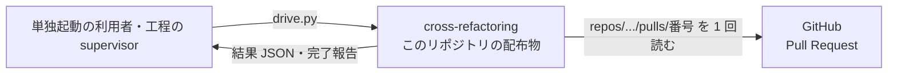
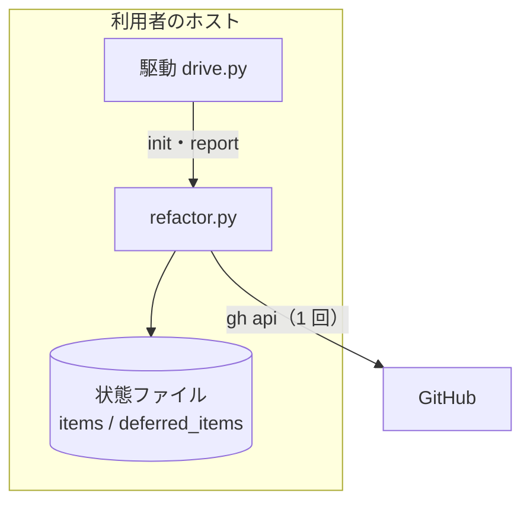
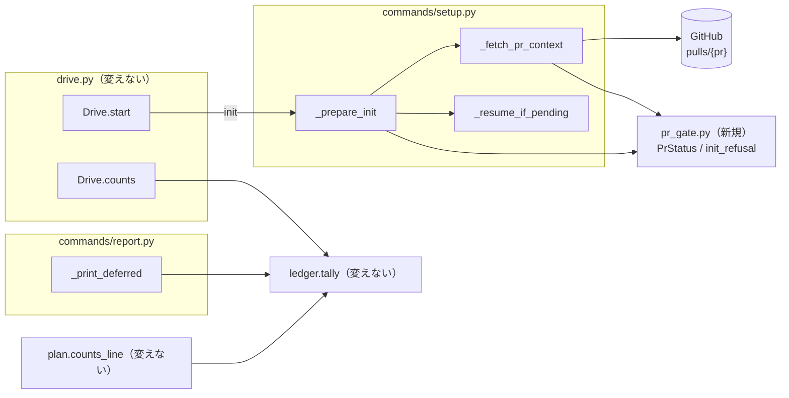
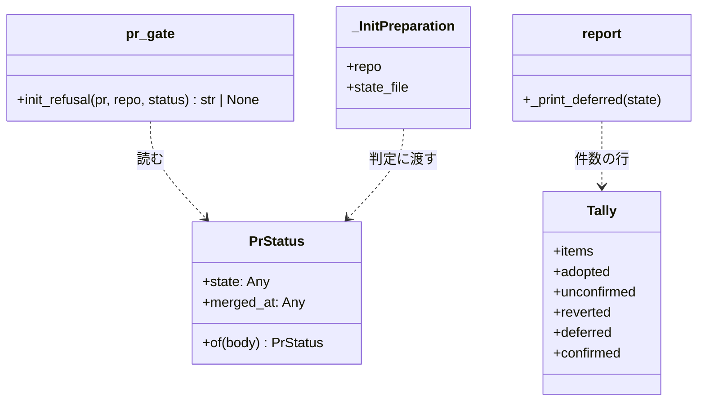
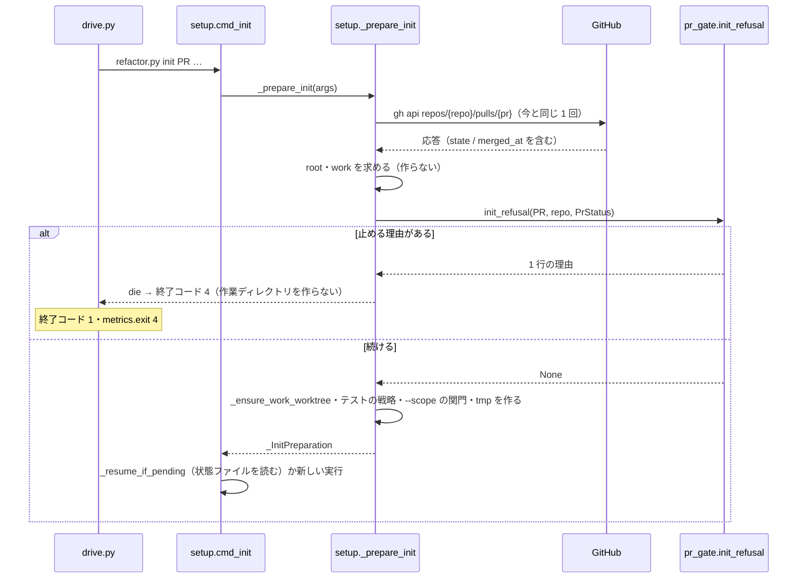
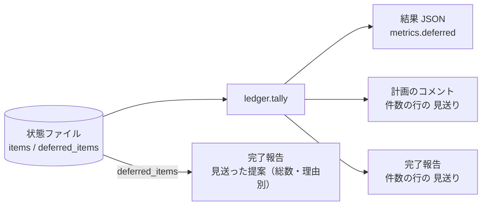

# cross-refactoring: 閉じた・マージ済みの Pull Request にも提案から push まで進み、見送りの件数が結果 JSON と完了報告で食い違う → 入口で Pull Request の状態を確かめて止め、見送りの件数を 3 つの出力で揃える（#1658 #1660）

**2026-10-07 の改訂**: 本番配布の承認ゲート 2 で、利用者が「Draft でない Pull Request の cross-refactoring を止める必要はない」と差し戻した。Draft の判定は `SKILL.md` の前提「Draft で開いている」を守らせるために起票で足したもので、利用者の決定ではなかった。Draft の判定を外し、Draft のためだけにあった新しい実行と再開の区別（`_pending_state`）も外した。以下はこの改訂の後の形である。

## 目的

- **何が壊れているか**: `refactor.py init` は Pull Request の応答の `state` / `merged_at` を読まず、閉じた・マージ済みの Pull Request にも提案・実装・push まで進む（#1658）。同じ実行の「見送り」の件数が、結果 JSON の `metrics.deferred` と完了報告（`refactor.py report`）の件数の行で別のものを数えている（#1660）
- **誰が困るか**: マージ済み・閉じた Pull Request の head ブランチへ予告なくコミットを積まれる利用者。完了報告と `metrics` を写す supervisor と、振り返りで件数を数える人
- **直すと何が成り立つか**: `init` が作業ディレクトリを用意する前に、閉じた・マージ済みの Pull Request を理由つきで止める。Draft かどうかは問わない。「見送り」は 3 つの出力で同じ値になり、計画に入らなかった提案を含む数は「見送った提案」として別の行に出る

## 適用範囲

- **働く範囲**: 配布先のリポジトリでも働く（cross-refactoring を打つすべての対象のリポジトリ）
- **プロジェクトごとに違うもの**: 無し（Pull Request の状態は GitHub の応答から読み、設定も引数も足さない）
- **当たるモード**: リファクタリングの工程を通す `standard` と `legacy-refactor`、単独起動の `/ndf:cross-refactoring`

## あるべき姿の根拠

| 根拠 | 種類 | 何を示すか |
| --- | --- | --- |
| `gh api repos/devbasex/ai-plugins/pulls/1805` → `{"state":"closed","draft":false,"merged_at":"2026-10-06T15:44:18Z"}`、`pulls/1387` → `{"state":"open","draft":false,"merged_at":null}`（2026-10-06 に実測） | 実測 | 判定に要る項目（`state` / `merged_at`）は、`init` が既に打っている応答に必ず載る。マージ済みは `state: closed` と `merged_at` の時刻で表れる |
| 2026-10-07 の本番配布の承認ゲート 2 での利用者の差し戻し「Draft でない PR の cross-refactoring を止める必要はない」 | 利用者の決定 | 受け付ける Pull Request は開いているものすべてで、Draft かどうかは問わない |
| `plugins/ndf/scripts/supervise_lib/pr.py` の `_publish`（無ければ `gh pr create --draft`） | 外部の一次情報（工程の実装） | 工程が作る Pull Request は Draft で始まり、Draft を外した後も開いていれば入口の検査で止まらない |
| 「どちらも cross-refactoring の入口の検査と結果の報告の整合の問題として 1 本の設計で扱う」（2026-10-06、conductor の起動指示） | 利用者の指示の原文 | 2 つの課題を 1 本の設計で扱う |

要求と受け入れ条件は #1658 の本文にある（コピーは `issues/issue-1658-requirements.md`）。この文書は「どう作るか」だけを扱う。
受け入れ条件 1〜9 が #1658、10〜15 が #1660 の分で、16 は両方の退行の確認である。

## ドメインモデル

### コンテキスト

| コンテキスト | 何の語が 1 つの意味に決まるか |
| --- | --- |
| cross-refactoring の実行 | 新しい実行・再開・見送った改善項目・見送った提案・件数の行 |

Pull Request の状態（`state` / `merged_at`）は GitHub の語をそのまま読む。GitHub との関係は**順応者**（GitHub の応答の形に合わせ、こちらから形を求めない）である。

### 集約

| 集約 | 持ち主（書き換えてよいもの） | 根 | エンティティ | 値オブジェクト |
| --- | --- | --- | --- | --- |
| 実行の状態（状態ファイル） | `refactor.py` の各コマンド。`init` は判定が「続ける」のときだけ作る | 状態（`state`） | 改善項目（`items`）・見送った提案（`deferred_items`） | 表示の状態の件数（`ledger.Tally`） |
| Pull Request の状態 | GitHub（この変更は読むだけ） | — | — | `pr_gate.PrStatus`（`state` / `merged_at`） |

### 不変条件

| # | 集約 | 条件 | 破れたときの扱い |
| --- | --- | --- | --- |
| I1 | Pull Request の状態 | 作業ディレクトリを用意するのも再開するのも、`state` が `open` のときだけである | `init` が終了コード 4 で止まる |
| I2 | Pull Request の状態 | `draft` の値は判定に使わない。新しい実行と再開は同じ判定を受ける | Draft でない Pull Request で止まる |
| I3 | Pull Request の状態 | 判定に使う項目が想定の値でなければ続けない（`state` が `open` / `closed` 以外、または無い） | 「判定できない」と項目名を出して終了コード 4 |
| I4 | 実行の状態 | 判定で止まった `init` は、作業ディレクトリ・状態の置き場・状態ファイルのどれも作らず、書き換えない | 判定を作業ディレクトリの用意より前に置く（処理の流れ） |
| I5 | Pull Request の状態 | 判定は `init` が既に読んでいる `repos/{repo}/pulls/{pr}` の応答 1 回から行う | `gh` の呼び出しの回数が変わる |
| I6 | 実行の状態 | 結果 JSON の `metrics.deferred`・計画のコメントの件数の行の「見送り」・完了報告の件数の行の「見送り」は、どれも `ledger.tally(state).deferred` である | 件数が食い違う |
| I7 | 実行の状態 | 状態が見送りの改善項目の数は、`deferred_items` のうち理由が `not_done` か `test_failed` の記録の数と等しい | 完了報告の理由別の件数と `metrics.deferred` が食い違う |
| I8 | 実行の状態 | 完了報告の「見送った提案」の理由別の件数の和は、「見送った提案」の総数（`deferred_items` の数）と等しい | 理由別の内訳が総数と合わない |

**I7 が成り立つ根拠**: 改善項目の状態を見送りにする経路は `commands/implement.py` の `_settle` の 1 つだけで、そこで `defer` を呼んで同じ項目を `not_done` か `test_failed` で `deferred_items` へ足してから状態を見送りにする（`git grep -n '\["status"\] = '` で `DEFERRED` を代入する行はここだけ）。プランの外の取り消し（`ledger.mark_outside_revert`）は取り消されていない項目（`is_live`）だけに当たり、見送りの項目は触らない。`defer` の重複除けは項目 ID（`I-<順位>`）で見るが、計画に入らなかった提案の ID は `C-<番号>` で名前の空間が分かれており、改善項目の見送りが既存の記録に吸われることはない。要求の前提 5 はこのまま成り立ち、受け入れ条件 12 は直さない。#1743 の決定 10 の後は、採り直し（`commands/readopt.py`）が持ち越しの項目を `not_done` で見送る経路が加わるが、#1743 の設計でこの経路も `defer` を呼んでから状態を変えるため、I7 はどちらの順で入っても成り立つ。

### ドメインイベント

| # | イベント | 発生元 | 受け手 |
| --- | --- | --- | --- |
| E1 | 駆動が `refactor.py init` を呼んだ | `drive.py`（`Drive.start`） | `refactor.py init` |
| E2 | `init` が Pull Request の応答を読んだ | `setup._fetch_pr_context` | `setup._prepare_init` |
| E3 | `init` が Pull Request の状態を判定した | `pr_gate.init_refusal` | `setup._prepare_init`（止める理由があれば `die`。駆動は終了コード 4 を中断として受ける） |
| E4 | `init` が作業ディレクトリと状態ファイルを用意した | `setup._prepare_init` 以降 | 後続の手順 |
| E5 | リファクタリング計画が提案を見送った | `commands/plan.py`・`commands/propose.py`（`defer`） | 状態ファイルの `deferred_items` |
| E6 | 実装の取り込みか採り直しが改善項目を見送った | `commands/implement.py` の `_settle`（#1743 の後は `commands/readopt.py` も） | `items[].status` と `deferred_items` |
| E7 | 駆動が結果 JSON の `metrics` を数えた | `drive.py`（`Drive.counts`） | supervisor・利用者 |
| E8 | 完了報告を出した | `commands/report.py`（`_print_deferred`） | supervisor・利用者 |

### 用語

| 用語 | 意味 | 用語集への反映 |
| --- | --- | --- |
| 見送った改善項目 | リファクタリング計画が採った改善項目のうち、表示の状態が見送りのもの（時間内に実装を終えなかった `not_done`・足したテストが落ちた `test_failed`）。結果 JSON の `metrics.deferred` の数。`not_done` が指す項目は #1743 の決定 9・10 で変わる（「並行する設計との関係」） | 追加（要求の差分で反映済み。#1743 に合わせて直した） |
| 見送った提案 | 計画に入らなかった提案と見送った改善項目を合わせたもの。理由を 1 つ持つ。状態ファイルの `deferred_items` | 追加（要求の差分で反映済み） |

## 機能一覧

| # | 機能 | 誰が使うか |
| --- | --- | --- |
| F1 | 閉じた・マージ済みの Pull Request で cross-refactoring を始めない・続けない | 単独起動の利用者、工程の supervisor |
| F2 | （欠番。2026-10-07 の改訂で Draft の判定を外した） | — |
| F3 | 応答から状態を判定できないときに続けず、読めなかった項目名を示す | 単独起動の利用者、工程の supervisor |
| F4 | 完了報告の件数の行の「見送り」を、結果 JSON と計画のコメントと同じ値で出す | 完了報告を写す supervisor、振り返る人 |
| F5 | 完了報告で「見送った提案」の総数と理由別の件数を、見送りの件数と別の行に出す | 完了報告を写す supervisor、振り返る人 |

## システム構成

**文脈**: 外部の系との出入りは、`init` が既に読んでいる GitHub の Pull Request の応答 1 回だけで、増やさない（I5）。完了報告と結果 JSON を読む側（supervisor・利用者）への出力の形も変えない。



**配置**: 判定も件数の数え方も、利用者のホスト（端末かコンテナ）の `refactor.py` のプロセスの中で完結する。



## 構成要素

| 要素 | 責務 |
| --- | --- |
| `refactor_lib/pr_gate.py`（新規） | 応答から `PrStatus` を読み出す（`PrStatus.of`）。`PrStatus` から、止める理由の 1 行か `None` を返す（`init_refusal`）。新しい実行か再開かは受け取らない。**git も GitHub も呼ばず、終了もしない** |
| `commands/setup.py` の `_fetch_pr_context` | 既に読んでいる応答から `PrStatus` を作り、6 つ目の値として返す。`gh` の呼び出しは変えない |
| `commands/setup.py` の `_prepare_init` | `pr_gate.init_refusal` を呼び、止める理由があれば `die` する。**この後で初めて作業ディレクトリを用意する** |
| `commands/setup.py` の `_InitPreparation` / `_resume_if_pending` | 変えない。再開の判定は今どおり作業ディレクトリの用意の後で状態ファイルを読む |
| `commands/report.py` の `_print_deferred` | 件数の行の「見送り」を `ledger.tally(state).deferred` から出す。「見送った提案」の行に `deferred_items` の総数と理由別の件数を出す |
| `cross-refactoring/SKILL.md` | 前提（閉じた・マージ済み・状態を判定できないと `init` が止まる。Draft かどうかは問わない）、終了コード 1 の行の `metrics.exit` 4 の理由、`metrics` の説明（`deferred` は見送った改善項目）、完了報告の節（見送った改善項目と見送った提案の書き分け） |
| `cross-refactoring/docs/04-verify-and-report.md` | 完了報告の段落の「見送りの理由別の件数」を「見送った提案の総数と理由別の件数」へ |
| `cross-refactoring/tests/` | 偽の `pulls/{pr}` の応答に `state: open`・`draft: true`・`merged_at: null` を足す（`draft` は判定に使わず、Draft でない応答でも続くことを縛る）。報告の期待を新しい行へ |

図は呼び出しの関係だけを描き、`SKILL.md`・`docs/04-verify-and-report.md`・`tests/` と `_InitPreparation`（`_prepare_init` が返す値）は含めない。

変えないもの: `drive.py`（`init` の終了コード 4 は既に中断として扱う）・`ledger.py`（`tally` はそのまま使う）・`plan.py`（計画のコメントの件数の行と「見送った提案」の節）・共通ライブラリの `scripts/lib/drive_pause.py`。



## 構造

変更が触る型だけを描く。`Tally` は形を変えず、完了報告が新しく `deferred` を読む。



`PrStatus` の 2 つの値は応答の値をそのまま持つ（型を直さない）。想定の値かどうかを決めるのは `init_refusal` だけにし、判定の規則を 1 か所に置く。

## パッケージ・モジュール構成

```text
plugins/ndf/
├── skills/cross-refactoring/
│   ├── SKILL.md                         # 変更（前提・metrics の説明・完了報告の節）
│   ├── docs/04-verify-and-report.md     # 変更
│   ├── scripts/refactor_lib/
│   │   ├── pr_gate.py                   # 新設（PrStatus / init_refusal）
│   │   └── commands/
│   │       ├── setup.py                 # 変更（_prepare_init）
│   │       └── report.py                # 変更（_print_deferred）
│   └── tests/                           # 変更（偽の応答・報告の期待）
└── scripts/tests/test_drive_refactor.py # 変更
```

## 入出力の契約

### `refactor.py init` の止め方

終了コードは既存の中断（4）、結果 JSON と標準出力の変数は出さない（今の中断と同じ）。標準エラーへ `die` の 1 行（先頭 `❌ `）を出す。判定は上から順に当て、最初に当たった行で止める。

| # | 応答 | 標準エラーの 1 行 | 受け入れ条件 |
| --- | --- | --- | --- |
| 1 | `state` が `open` / `closed` のどちらでもない（無いを含む） | `Pull Request #<PR> の状態を判定できない（state: <値>）。gh api repos/<repo>/pulls/<PR> の応答を確かめる` | 6 |
| 2 | `state: closed`・`merged_at` が空でない | `Pull Request #<PR> はマージ済み（merged_at: <値>）。新しい Pull Request を作って打ち直す` | 2・5 |
| 3 | `state: closed`・`merged_at` が空 | `Pull Request #<PR> は閉じている（state: closed）。開き直すか、新しい Pull Request を作って打ち直す` | 1・5 |
| 4 | `state: open`（`draft` の値を問わない。新しい実行も再開も） | （止めない） | 3・4・5 |

`<repo>` は `_fetch_pr_context` が解決したリポジトリ名である。駆動（`drive.py <PR>`）はこの中断を既存どおり終了コード 1・`metrics.exit` 4 で返し、`init` の後の手順（`prepare-worktrees.sh` と担当の CLI）を起動しない。`init` が `TMP_DIR` を返さないため、計画のコメントも書き直さない（`refresh_plan_comment` は状態の無い実行を飛ばす）。

### 完了報告の「見送った提案と取り消した項目」の節

見出しと内訳の行は変えない。2 行目と 3 行目が変わる。状態ファイルが受け入れ条件 10 の形（見送った改善項目 1 件、計画に入らなかった提案 2 件）のとき:

| 行 | 変更の前 | 変更の後 |
| --- | --- | --- |
| 件数の行 | `- 採用: … / 取り消し: 0 件 / 見送り: 3 件` | `- 採用: … / 取り消し: 0 件 / 見送り: 1 件` |
| 理由別の行 | `- 見送りの理由別: budget 1 / rank 0 / duplicate 1 / vocabulary 0 / threshold 0 / no_target 0 / test_failed 0 / not_done 1` | `- 見送った提案: 3 件（理由別: budget 1 / rank 0 / duplicate 1 / vocabulary 0 / threshold 0 / no_target 0 / test_failed 0 / not_done 1）` |

理由の並びと名前は `vocabulary.DEFER_REASONS` のまま（8 つ、件数 0 も出す）。件数の行の「見送り」は計画のコメントの件数の行（`plan.counts_line` の `見送り {t.deferred}`）と同じ値になる。

結果 JSON の `metrics` のキーと値の意味は変えない（`deferred` は見送った改善項目の数のまま）。#1743 の採り直しの後は、どの値も採り直しの後の状態ファイルから数える（「並行する設計との関係」）。

## 処理の流れ

### `init` の入口



**判定の位置を作業ディレクトリの用意（`_ensure_work_worktree`）より前に置く**ことで I4 が成り立つ。判定は状態ファイルを読まないため、新しい実行と再開を区別しない。

### 再開か新しい実行かの判定

変えない。`_resume_if_pending` が作業ディレクトリの用意の後で状態ファイルを読み、今の規則（無い・`phase: done`・旧い形は新しい実行、それ以外は再開、旧い形の途中は止める）で決める。入口の判定はこの区別を使わない（決定 3）。

### 完了報告の件数



## 非機能の実現方式

| 大項目 | 実現方式 |
| --- | --- |
| 性能・拡張性 | 判定は `_fetch_pr_context` が今読んでいる応答（`_pr_payload` の戻り値）から `PrStatus` を作るだけで、`gh` を打ち足さない（I5） |
| 運用・保守性 | 止まった理由は `die` の 1 行に、Pull Request の番号・満たさなかった条件（読んだ値つき）・直し方を入れる（入出力の契約の表） |

## 決定の記録

### 決定 1: 提案者を起動する前に必ず通るよう、検査を `refactor.py init` の作業ディレクトリの用意より前に置く

`init` は駆動からも単独起動の手順からも必ず最初に打たれ、Pull Request の応答を既に読んでいる。作業ディレクトリの用意より前に置けば、止まった実行は何も作らず（I4）、API の呼び出しも増えない（I5）。検査を駆動（`drive.py`）に置くと、`gh` を打ち足すうえ、`init` を直接打つ経路で検査が抜ける。`assess` は Pull Request の番号を受けないため置けない。

根拠: Value 4 / Value 6（MVV 版 2）

### 決定 2: 判定の規則を 1 か所に置いて git なしで縛れるよう、判定を新しいモジュール `refactor_lib/pr_gate.py` の純粋な関数にする

判定は応答の 2 項目だけで決まり、git も GitHub も要らない。純粋な関数にすると、受け入れ条件 1・2・5・6 の組み合わせを作業ディレクトリなしで縛れる。`setup.py`（919 行）の中に置くと、関数を試すたびに `init` の偽の環境（git の worktree・`gh` の差し替え）を組むことになる。共通ライブラリ（`plugins/ndf/scripts/lib/`）へ置かないのは、要求が cross-review の入口を範囲から外しており、使う者が cross-refactoring だけだからである。

根拠: Value 4 / Value 6（MVV 版 2）

### 決定 3: 入口の判定は新しい実行と再開を区別しない

閉じた・マージ済みは新しい実行でも再開でも止め、開いていればどちらも続けるため、判定に区別は要らない。改訂の前は Draft の検査を新しい実行だけに当てるため、状態ファイルを判定より前に 1 度読む `_pending_state` と `_InitPreparation.pending` を足していた。Draft の判定を外した後は、これらを残すと用意より前に状態ファイルを読む経路と、退避される作業ディレクトリの規則だけが残るため、改訂で外し、再開の判定を #1658 の前の形（用意の後で `_resume_if_pending` が読む）へ戻した。

根拠: Value 6（MVV 版 2）

### 決定 4: 検査が黙って外れないよう、判定に使う項目が想定の値でなければ止める

GitHub の応答は `state` と `merged_at` を必ず持つ（実測）。欠けている・型が違うのは、偽の応答か API の形の変化であり、そのとき続けると検査が働かないまま push まで進む。`merged_at` は `state: closed` のときに「マージ済み」と「閉じている」の語を分けるだけで、どちらも止まるため、値の形を問わず空かどうかだけを見る。欠けた `state` を `open` と見なして続ける形は採らない。

根拠: Value 4（MVV 版 2）

### 決定 5: テストの偽の応答を実際の API の形へ合わせ、`state` / `draft` / `merged_at` を足す

既存のテストの `pulls/{pr}` の偽の応答（`tests/test_init.py` の 2 か所）は 3 項目を持たず、決定 4 のもとでは「判定できない」で止まる。実際の応答は必ず 3 項目を持つため（`draft` は判定に使わないが応答の形として残す）、偽の応答の側を `state: open`・`draft: true`・`merged_at: null` に直す。`_fetch_pr_context` の戻り値が 6 つになるため、戻り値を比べるテスト（`test_init.py` の `test_init_takes_the_pull_request_of_the_repository_it_is_run_in`）の期待も直す。受け入れ条件 4 の「既存のテストがすべて通る」は、この 2 点を直したうえで他のテストの期待を変えずに通ることとして読む。

根拠: Value 3（MVV 版 2）

### 決定 6: `metrics` の契約を保つため、食い違いは完了報告の件数の行を `ledger.tally` へ揃えて解き、計画に入らなかった提案を含む数は「見送った提案」の行に分ける

結果 JSON の `metrics.deferred` と計画のコメントの件数の行は既に `ledger.tally` から出ており、外れているのは完了報告の件数の行（`len(deferred_items)`）だけである。`metrics.deferred` を `deferred_items` の数へ変えると、写している supervisor の読み方と計画のコメントの件数が変わり、契約が壊れる。`metrics` にキーを足すのは要求の範囲外である。「見送り」の 1 語が 2 つを指す状態をなくすため、`deferred_items` の数は用語集の「見送った提案」で別の行に出す。

根拠: Value 6 / Value 8（MVV 版 2）

### 決定 7: 「見送った提案」の総数と理由別の件数は完了報告の中で数える

これを数えるのは完了報告だけで、結果 JSON と計画のコメントはこの数を出さない（計画のコメントは内訳の表を出す）。`ledger.tally` は表示の状態の件数を持つ型であり、提案の記録の数を足すと、結果 JSON の `as_metrics` に載せないキーを型に抱えることになる。使う者が 2 つ目に現れた時点で `ledger` へ移す。

根拠: Value 6（MVV 版 2）

### 決定 8: #1660 は #1658 の実装 1 本に寄せる

2 つの課題はどちらも `cross-refactoring/SKILL.md` の同じ範囲（前提・終了コードの表・`metrics` の説明・完了報告の節）と同じテストのディレクトリに触る。実装を分けても、触るファイルが重なるため同じステージでは 1 本ずつ流れ、Pull Request とレビューの回数だけが増える。#1660 の差分は `report.py` の 2 行と文書の数行で、1 本にしても単独で読み分けられる。#1660 は「取り込む」として #1658 の実装へ含め、スプリント PR で閉じる。

根拠: Value 1 / Value 4（MVV 版 2）

## テスト設計

| 受け入れ条件・不変条件 | どの振る舞いで縛るか | どう壊したら落ちるべきか |
| --- | --- | --- |
| 1・I1・I4 | 新しい実行で `state: closed`・`merged_at: null` の応答を返すと、`init` が終了コード 4 で止まり、標準エラーに `#<PR>` と「閉じている」が出て、作業ディレクトリと状態ファイルが無い | `state` を見ないようにすると落ちる。判定を `_ensure_work_worktree` の後へ動かすと落ちる |
| 2 | `state: closed`・`merged_at` に時刻がある応答で、同じく止まり「マージ済み」が出る | `merged_at` を見ずに「閉じている」と出すと落ちる |
| 3・I2 | 新しい実行で `state: open` かつ `draft` が `false`・無い・文字列の応答で、止まらずに状態ファイルができる | `draft` を見て止めるように戻すと落ちる |
| 4 | `state: open`・`draft: true` の応答で、今までどおり状態ファイルができる（既存の `init` のテストが偽の応答の 3 項目を足しただけで通る） | `draft: true` でも止めるように壊すと既存のテストが落ちる |
| 5・I1・I2・I4 | 終わっていない状態ファイルがあると、`state: open`・`draft: false` で続き、`state: closed` で止まり状態ファイルの中身が変わらない | 再開で `state` を見ないと落ちる。判定を `_resume` の後へ動かすと状態ファイルが書き換わって落ちる |
| 6・I3 | `state` が `merged` などの値・`state` が無い応答で、終了コード 4 と「判定できない」と項目名 `state` が出る | 欠けた項目を既定の値で埋めて続けると落ちる |
| 6（判定の表） | `pr_gate.init_refusal` を入出力の契約の表の 4 行で呼び、止める行は理由の 1 行、止めない行は `None` が返る | `merged_at` を見ずに語を決めると落ちる |
| 7 | 駆動の `init` が終了コード 4 で終わると、駆動は終了コード 1・`metrics.exit` 4 で終わり、`prepare-worktrees.sh` と担当の CLI を起動しない | 駆動が `init` の 4 を中断と扱わなくなると落ちる（既存の振る舞いの縛り） |
| 8・I5 | 判定で止まる場合も続く場合も、`init` が打つ `gh` の呼び出しの並びが変更の前と同じ | 判定のために `gh pr view` などを打ち足すと落ちる |
| 9 | `scripts/lib/drive_pause.py` に差分が無く、cross-review の駆動のテストが通る | 確かめ方は `git diff --stat` と受け入れ条件 16 のコマンド（テストを足さない） |
| 10・I6 | 見送った改善項目 1 件（`not_done`）と計画に入らなかった提案 2 件（`budget`・`duplicate`）の状態から、`Drive.counts` の `deferred`・`plan.counts_line` の「見送り」・`refactor.py report` の件数の行の「見送り」がどれも 1 | 完了報告の件数の行を `len(deferred_items)` に戻すと 3 になって落ちる |
| 11・I8 | 同じ状態で、完了報告に「見送った提案: 3 件」と理由別の件数（`budget 1`・`duplicate 1`・`not_done 1`、他は 0）が件数の行と別の行に出て、理由別の和が総数と等しい | 理由別の行を件数の行へ混ぜると落ちる。理由の一部を出さないと和が合わず落ちる |
| 12・I7 | 同じ状態で、完了報告の `not_done` と `test_failed` の和が `metrics.deferred` と等しい | 実装の取り込みで見送るときに `defer` を呼ばないように壊すと落ちる |
| 13 | 完了報告の件数の行の「見送り」は、`deferred_items` だけを増やした状態（改善項目は変えない）で値が変わらない | 件数の行が `deferred_items` の長さを使うと値が変わって落ちる |
| 14 | 既存の駆動のテスト（`test_drive_refactor.py`・`test_drive_contract.py`）が変更なしで通る | `metrics` のキーを足す・意味を変えると落ちる |
| 15 | `glossary.py check --file issues/issue-1658-requirements.md` が当たり 0 件。`SKILL.md` の書き分けはレビューで見る（`.md` の文言を照合するテストを書かない） | — |
| 16 | 受け入れ条件 16 のコマンドが通る | — |

既存のテスト `tests/test_outbound_text.py` の `test_the_report_does_not_list_the_deferred_breakdown` は、計画に入らなかった提案だけの状態で件数の行の「見送り: 1 件」を期待している。この期待は #1660 の食い違いそのものであり、「見送り: 0 件」と「見送った提案: 1 件」へ直す。

## 設計の結果

| 課題 | 扱い | 取り込み先 | 触るファイル |
| --- | --- | --- | --- |
| #1658 | 実装する | — | `plugins/ndf/skills/cross-refactoring/scripts/refactor_lib/pr_gate.py`、`plugins/ndf/skills/cross-refactoring/scripts/refactor_lib/commands/setup.py`、`plugins/ndf/skills/cross-refactoring/scripts/refactor_lib/commands/report.py`、`plugins/ndf/skills/cross-refactoring/SKILL.md`、`plugins/ndf/skills/cross-refactoring/docs/04-verify-and-report.md`、`plugins/ndf/skills/cross-refactoring/tests/`、`plugins/ndf/scripts/tests/test_drive_refactor.py` |
| #1660 | 取り込む | #1658 | — |

## 並行する設計との関係

同じスプリントの #1743・#1814 の実装と、どの順で入っても成り立つように、相手の決定を前提として次のとおり扱う。

| 相手の決定 | 内容 | この設計の扱い |
| --- | --- | --- |
| #1743 の決定 9 | 項目ごとの着手期限・完了期限と `_deadline_passed` を外す | 「見送った改善項目」の `not_done` を「期限までに終わらない」と書かず、「時間内に実装を終えなかった」と書く。#1743 の前は完了期限を過ぎた・コミットが無い項目、#1743 の後は実装の終わりまでにコミットが無く、採り直しでも残った時間に入らなかった項目を指す。どちらでも `metrics.deferred`・`ledger.tally` の数え方は変わらない |
| #1743 の決定 10 | 検証の後に `budget` で見送った候補と持ち越しの項目を採り直す（`readopt`） | 状態を見送りにする経路に `readopt` が加わる。#1743 の設計で `readopt` も `defer` を理由 `not_done` で呼んでから状態を変えるため、I7 は保たれる。採り直した `budget` の候補は `deferred_items` から外れるため、完了報告の「見送った提案」の総数と理由別の件数は採り直しの後の値になる（完了報告は `readopt` の後に出るため、持ち越しの状態 `carried` は残らない） |
| #1814 の決定 7 | 範囲テストの対象の無い `remove_dead_code` を `deletion` として採る | `no_target` の見送りが減るだけで、件数の数え方は変えない |

## 未確認のまま残ること

| 項目 | 内容 |
| --- | --- |
| `init` から push までの間の状態の変化 | 要求の「未決」のとおり扱わない。`init` の後に閉じられた・マージされた Pull Request へ push しうることは残る |
