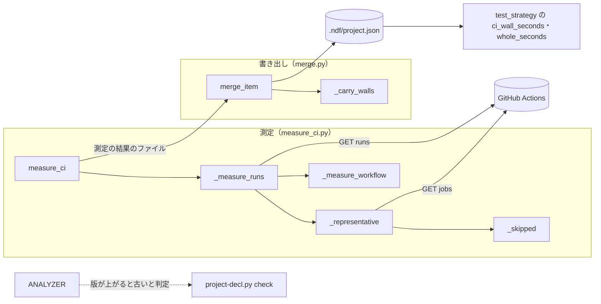
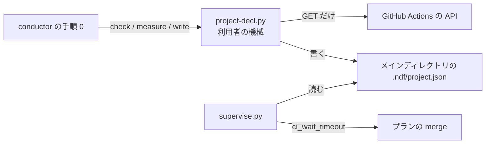
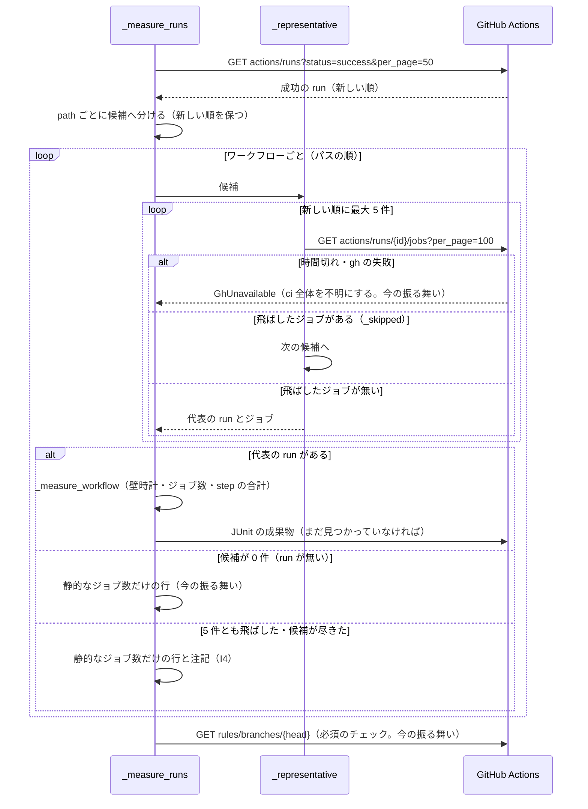
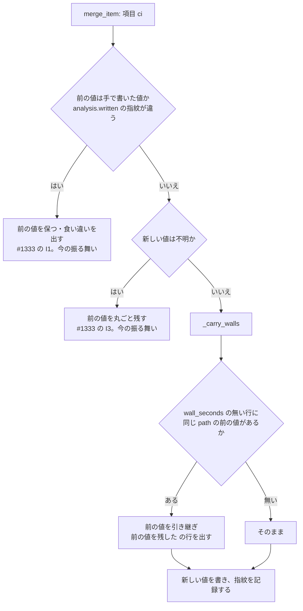

# 宣言の解析: 重いテストを飛ばした CI の run を所要に採り、プランの CI 待ちが pytest の完了前に打ち切られる → テストを走らせた run の所要から CI 待ちとテストの上限が出る（#1664 #1717）

## 目的

- **何が壊れているか**: 宣言の解析（`project-decl.py measure`）が、ワークフローごとに最新の成功の run を CI の所要の代表に採る。その run が重いジョブを飛ばした run でも区別しない。そのため、CI の壁時計とテストの所要が数秒〜十数秒に縮む
- **誰が困るか**: スプリントを回す conductor。実装・検査のプランの `merge` が pytest の完了前に打ち切られ（m725・m1693）、範囲テストが 3 秒の上限で止まる（m1649）。3 回とも、手で打ち直すか上限を延ばした
- **直すと何が成り立つか**: CI の所要は、テストを実際に走らせた run から測られる。プランの `ci_wait_timeout` とテストの上限が pytest の所要（このリポジトリでは 500 秒台）から出て、手当てが要らなくなる

## 適用範囲

- **働く範囲**: 配布先のどのリポジトリでも働く。宣言を解析するすべてのリポジトリ（GitHub Actions を使うもの）が対象である
- **プロジェクトごとに違うもの**: 無い。飛ばした run は、GitHub Actions の API が返すジョブの conclusion だけで判定する。ワークフローの名前・ジョブの名前は設定でも引数でも受けない
- **当たるモード**: 全モード。手順 0 の宣言の解析はモードより前に走る

## あるべき姿の根拠

| 根拠 | 種類 | 何を示すか |
| --- | --- | --- |
| `gh api --method GET repos/devbasex/ai-plugins/actions/runs/37160943783/jobs?per_page=100` の応答で、ジョブ `pytest (${{ matrix.shard }}/2)` が `status: completed`・`conclusion: skipped`・steps 0 個。run の conclusion は `success`、壁時計は 17 秒（2026-10-04 に実行） | 実測 | 飛ばした run はジョブの conclusion だけで見分けられる。run の conclusion は success のままで、run の一覧からは見分けられない |
| `actions/runs?status=success&per_page=50` の 50 件について、各 run のジョブを取って数えた。`pytest.yml` は 7 件のうち 2 件がジョブを飛ばしていた（どちらも release の Pull Request で、壁時計 14 秒・16 秒）。残りの 5 件は 525〜578 秒だった。他の 8 本のワークフローは、飛ばした run が 0 件だった（2026-10-04 に実行） | 実測 | 飛ばした run を除けば pytest の壁時計は 500 秒台に戻る。飛ばした run があるのは pytest.yml だけで、ほかのワークフローの値は変わらない（AC4） |
| `~/.local/state` の作成時刻は 2026-10-03 00:48、`~/.local/state/ndf/metrics` は 01:13、`/home/ubuntu` は 00:46、起動は 00:40。m1649 のプラン（`sprint-m1649/1-design-1649.json`）は 00:53 に書かれ、NDF の実行の記録の最初の行は 03:57（rf1673）である | 実測 | m1649 で `ndf-record` が消えたのは、コンテナの作り直しで記録のファイルが無くなった後に解析したためである。読み取りのコードは正しく動いていた（前提 6） |
| 依頼の原文「#1717 の直し方も同じ設計文書で決め、実装を #1664 の 1 本に寄せるか #1717 を別の実装に分けるかを『決定の記録』に書く」 | 利用者の指示の原文 | 決定 1 が答える問い |

要求と受け入れ条件は #1664 の本文にある（コピーは `issues/issue-1664-requirements.md`）。この文書は「どう作るか」だけを扱う。
#1717 の再現の記録と受け入れ条件案は、要求の「何が起きたか」の 3 行目と AC7・AC8 に取り込み済みである。

## ドメインモデル

### コンテキスト

| コンテキスト | 何の語が 1 つの意味に決まるか |
| --- | --- |
| NDF の開発ワークフロー（`ndf-workflow`） | 解析・測った値・プロジェクトの宣言・代表の run・ジョブを飛ばした run |

GitHub Actions は外部の系で、コンテキストの外にある。#1333 の設計どおり、`measure_ci` が腐敗防止層として外部の語を宣言の語へ直す。外部の語は run・job・conclusion、宣言の語は CI の分割・所要の出所である。この変更は、その層に「どの run を代表に採るか」の規則を 1 つ足す。

### 集約

| 集約 | 持ち主（書き換えてよいもの） | 根 | エンティティ | 値オブジェクト |
| --- | --- | --- | --- | --- |
| 測定の結果 | 測定（`project_lib/measure_ci.py`） | 測定の結果（`measure --out` のファイル） | ワークフローの行（`ci.workflows[]`。`path` で識別する） | 壁時計（`wall_seconds`）・所要の候補（`test_duration.measured[]`）・注記（`notes[]`） |
| プロジェクトの宣言 | 書き出し（`project_lib/merge.py`） | `.ndf/project.json` | ワークフローの行（`ci.workflows[]`。`path` で識別する） | 壁時計・所要の候補・書いた値の指紋（`analysis.written`） |

測定は宣言を読まず、書き出しは GitHub を読まない。2 つの集約は、測定の結果のファイルだけを介して繋がる（#1333 の決定 1 の 4 手）。

### 不変条件

番号はこの文書の中のものである。#1333 の不変条件は「#1333 の I3」のように書いて区別する。

| # | 集約 | 条件 | 破れたときの扱い |
| --- | --- | --- | --- |
| I1 | 測定の結果 | ワークフローの行の `wall_seconds` は、そのワークフローの代表の run から測る。代表の run は、ジョブを飛ばしていない成功の run のうち最新の 1 件である | — （破れる経路を作らない。テストで縛る） |
| I2 | 測定の結果 | ジョブを飛ばした run かどうかは、ジョブの `conclusion == "skipped"` だけで決める。ワークフローのファイル名・ジョブ名・run の event と branch は判定に使わない。`conclusion` の無いジョブは飛ばしていないものとして扱う | — |
| I3 | 測定の結果 | `test_duration` の `ci-steps` と `ci-junit` は、代表の run からだけ測る。代表の run の無いワークフローからは測らない | — |
| I4 | 測定の結果 | 代表の run が決まらないワークフローの行は、`wall_seconds` を持たない。注記に `飛ばしていない run が無い: <パス>（候補 <n> 件）` が 1 行出る | — |
| I5 | 測定の結果 | 候補の run のジョブを取る `gh` の呼び出しは、ワークフローごとに 5 回まで（`CANDIDATE_RUNS`）である。どの呼び出しも、#1333 の I10 の締め切りの中で打ち切る | 締め切りに届いたら今と同じく `GhUnavailable("時間切れ")` で `ci` を不明にする |
| I6 | プロジェクトの宣言 | 新しい `ci` の値で前の解析の値を置き換えるとき、`wall_seconds` を持たない行は、前の値の同じ `path` の行の `wall_seconds` を引き継ぐ。前の値が手で書いた値なら、#1333 の I1 のとおり何も変えない | 引き継いだ行ごとに出力へ `不明（新しい解析に壁時計が無い）（前の値を残した）` の行が出る |

I6 は #1333 の I3（新しい解析で不明でも、前の値があれば残す）を、項目の中のワークフローの行の単位へ広げたものである。

### ドメインイベント

要求の番号を引き継ぐ。

| # | イベント | 発生元 | 受け手 |
| --- | --- | --- | --- |
| E1 | 宣言の解析を始めた | conductor（手順 0 の `project-decl.py measure`） | 測定 |
| E2 | 成功の run の一覧を取った | 測定（`_measure_runs`） | 測定（候補の組み立て） |
| E3 | ワークフローごとに候補の run のジョブを取った | 測定（`_representative`） | 測定（飛ばした判定） |
| E4 | 飛ばした run を候補から外した | 測定（`_skipped`） | 測定（代表の決定） |
| E5 | ワークフローごとの代表の run を決めた | 測定（`_representative`） | 測定（`_measure_workflow`）。決まらなければ注記（I4） |
| E6 | 壁時計とテストの所要を記録した | 測定（`_measure_workflow`・`_steps_of`・`_junit_of_run`） | 測定の結果のファイル |
| E7 | 宣言を書いた | 書き出し（`merge_project`・`_carry_walls`） | `.ndf/project.json` |
| E8 | プランが `ci_wait_timeout` とテストの上限を出した | `supervise.py`（`lib/test_strategy.py` の `ci_wall_seconds`・`whole_seconds`） | プランの `merge`・`test-limited` |
| E9 | `merge` が CI の必須のチェックの完了を待った | プランの `merge` のステップ（`merged-steps.py merge-when-green`） | conductor（成否） |

E8 と E9 の受け手の振る舞いは変えない（要求の前提 5・対象範囲の「含まない」）。この変更で値の出所が変わるのは E5 と E6 で、E7 の規則が 1 つ増える。

### 用語

| 用語 | 意味 | 用語集への反映 |
| --- | --- | --- |
| ジョブを飛ばした run | CI の成功した run のうち、conclusion が `skipped` のジョブを 1 つ以上含むもの。宣言の解析は、CI の所要を測る代表に採らない | 追加（`ndf-workflow`） |
| 代表の run | 宣言の解析が、ワークフローごとに壁時計とテストの所要を測る 1 件の run。ジョブを飛ばしていない成功の run のうち最新のもの | 追加（`ndf-workflow`） |

## 機能一覧

| # | 機能 | 誰が使うか |
| --- | --- | --- |
| F1 | ワークフローごとに、ジョブを飛ばしていない最新の成功の run を代表に選び、壁時計とテストの所要を測る | conductor（手順 0 の解析） |
| F2 | 代表の run が決まらないワークフローを注記に出し、宣言にはそのワークフローの前の壁時計を残す | conductor と、宣言を読む人 |
| F3 | 解析器の版を上げ、飛ばした run の値で書かれた宣言を、次の手順 0 で自動の再解析にかける | conductor（手順 0 の `check`） |

## 構成要素

| 要素 | 責務 | 変更 |
| --- | --- | --- |
| `_measure_runs`（`project_lib/measure_ci.py`） | 成功の run の一覧を 1 回取り、ワークフローごとに新しい順の候補へ分ける。ワークフローごとに代表の run を選ばせ、行と所要の候補と注記を返す | 変える。返り値に注記を足す |
| `_representative`（同） | 1 本のワークフローの候補を新しい順に最大 5 件見て、ジョブを取り、飛ばしていない最初の run とそのジョブを返す。無ければ `None` と見た件数を返す | 足す |
| `_skipped`（同） | ジョブの一覧に conclusion が `skipped` のものがあるかを返す。純粋な関数で、`gh` を呼ばない | 足す |
| `_measure_workflow`（同） | 代表の run とそのジョブから、行（パス・ジョブ数・壁時計）とテストの step の所要を作る。ジョブは自分で取らない | 変える（ジョブを引数で受ける） |
| `measure_ci`（同） | `_measure_runs` の注記を `notes` へ足す | 変える |
| `_carry_walls`（`project_lib/merge.py`） | 前の解析の `ci` と新しい `ci` から、`wall_seconds` の無い行に同じ `path` の前の値を引き継いだ値と、出力の行を返す（I6）。純粋な関数 | 足す |
| `merge_item`（同） | 前の解析の値を新しい値で置き換える分岐でだけ、キーが `ci` なら `_carry_walls` を通す | 変える |
| `ANALYZER`（`project_lib/__init__.py`） | 解析器の版。1 → 2 | 変える |
| 解析の参照（`skills/development-workflow/references/project-analysis.md`） | 代表の run の選び方と、ワークフローの行の壁時計を残す規則を書く | 変える |



参照の文書（`project-analysis.md`）は振る舞いを持たないため、図に含めない。

### 配置と文脈



動く場所は利用者の機械の 1 か所で、配置は変わらない。GitHub へ渡すのは今と同じく `--method GET` の要求だけである。

### パッケージ・モジュール構成

```text
plugins/ndf/
├── scripts/
│   ├── project_lib/
│   │   ├── __init__.py          # ANALYZER を 2 へ
│   │   ├── measure_ci.py        # 代表の run の選び方（_representative・_skipped を足す）
│   │   └── merge.py             # ワークフローの行の壁時計を残す（_carry_walls を足す）
│   └── tests/
│       ├── test_project_decl_ci_jobs.py   # 代表の run の単体テスト
│       └── test_project_decl.py           # 書き出しで前の壁時計が残るテスト
└── skills/development-workflow/references/
    └── project-analysis.md      # 代表の run と壁時計を残す規則
```

**型（クラス）は足さず、変えない。** 変えるのは関数だけで、`Gh` の面（`repo`・`get`）もそのままである。クラス図は描かない（省いた理由は要求の対象範囲の「含まない」にある）。

## 入出力の契約

宣言の形（`project.schema.json`）は変えない。

| 対象 | 今 | 変えた後 |
| --- | --- | --- |
| `ci.workflows[].wall_seconds` | ワークフローの最新の成功の run の壁時計 | 代表の run の壁時計。代表の run が無ければ、前の解析の値。前の値も無ければキーを書かない |
| `test_duration.measured[]` の `ci-steps` | 各ワークフローの最新の run のテストの step の合計のうち最大 | 各ワークフローの代表の run の合計のうち最大。`detail` の run の番号は代表の run のもの |
| `test_duration.measured[]` の `ci-junit` | パスの順で最初に JUnit を持つ、最新の run の合計 | パスの順で最初に JUnit を持つ、代表の run の合計 |
| `measure` の出力の `notes[]` | — | 代表の run が決まらないワークフローごとに `飛ばしていない run が無い: <パス>（候補 <n> 件）` |
| `write` の出力の行 | — | 前の壁時計を残した行ごとに `P4 ci#<パス>: 不明（新しい解析に壁時計が無い）（前の値を残した）` |
| `analysis.analyzer` | 1 | 2。`check` は版 1 の宣言を古いと判定し、2 で終わる |

`write` の出力の行は、今ある `_row_line` の `unknown` の形（`kept_previous: true`）をそのまま使う。キーの `ci#<パス>` は `#` の前を `P_NUMBER` が読むため、P4 に分類される。

## 処理の流れ

### 測定（E2〜E6）



候補が 0 件のワークフロー（成功の run が一覧に無いもの）は、今と同じく注記を出さない。注記を出すのは、成功の run があったのに、すべてジョブを飛ばしていたときだけである。

ジョブ数の行（`jobs`）は、代表の run があればそのジョブ数と静的な数の大きい方（今の規則）、無ければ静的な数にする。

### 書き出し（E7）



`_carry_walls` は、前の値が測った形（`ci` が `{"unknown": ...}` でなく `workflows` を持つ）のときだけ引き継ぐ。前の値の行に `wall_seconds` が無ければ何もしない。

## 非機能の実現方式

| 大項目 | 要求の条件 | 実現方式 | 確かめ方 |
| --- | --- | --- | --- |
| 性能・拡張性 | 解析の `gh` の呼び出しは今の締め切り（I10。1 回 30 秒と締め切りまでの残りの小さい方）の中で打ち切られ、締め切りに届いたら起動しない。候補の run を増やして呼び出しが増えても、解析全体の締め切りは変えない | 候補のジョブの取得も `Gh.get` を通すため、今の `CALL_LIMIT` と締め切りがそのまま掛かる。ワークフローごとの取得を 5 回までに抑え（I5）、飛ばした run の無いワークフローは今と同じ 1 回で終わる。このリポジトリの実測では、増える呼び出しは pytest.yml の 1〜2 回である | 締め切りを過ぎた `Gh` で `_measure_runs` を呼び、`GhUnavailable("時間切れ")` になり、それ以上 `gh` を起動しないことを単体テストで見る。ワークフローごとの取得が 5 回を超えないことを、候補 6 件がすべて飛ばした入力で見る |
| 運用・保守性 | 代表の run を決められなかったワークフローは、解析の注記に理由とパスが出て、人が宣言を見て気づける | `measure` の `notes` に I4 の 1 行を足し、`write` は今の仕組みで注記の行を出力へ載せる。前の値を残したときは、`write` の出力にその行が出る（I6） | 候補がすべて飛ばした入力で、`notes` に `飛ばしていない run が無い: <パス>` が出ることを単体テストで見る |
| セキュリティ | `gh` へ渡すのは読む要求（`--method GET`）だけ（I5）のまま | 足す呼び出しは既存の `Gh.get` だけを使い、`gh` を直に起動するコードを足さない | 既存の `test_measure_writes_nothing_to_the_repo_and_only_gets_from_gh` が通る |

## 決定の記録

### 決定 1: 同じ関数を 2 本の実装で触らないため、#1717 は #1664 の実装 1 本に寄せる

#1717 と #1664 は原因（`_measure_runs` の代表の選び方）も修正レイヤー（`project_lib/measure_ci.py`）も同じである。#1717 の受け入れ条件案は AC7・AC8 として #1664 の要求に入っている。実装を分けると、2 本の Pull Request が同じ関数を触って順番待ちになり、片方の受け入れ条件がもう片方の実装でしか満たせない。そのため、設計の結果で #1717 を「取り込む」（取り込み先 #1664）とする。#1717 の実装プランは流れず、#1664 の実装の指示文と課題に #1717 が足される。

その結果、#1717 は、棚卸しではなく、スプリントの Pull Request のマージで閉じる。要求の前提 7 は「閉じるのは棚卸し」としている。それより先に、直した変更と一緒に閉じることになる。

#1717 を別の実装に分ける案は採らない。分けて得られるものが無く、同じ関数の 2 回の改修と 2 回のレビューが増える。

根拠: Value 6 / Value 1（MVV 版 2）

### 決定 2: 呼び出しを増やさずに今の値の意味を保つため、代表はジョブを飛ばしていない最新の 1 件にする（未決 1）

最新の 1 件は、今の解析と同じ「今のテストの大きさ」を表す。複数件の最大や中央値を採るには、どの run がジョブを飛ばしたかを知るために、各 run のジョブを取る必要がある。そうすると、飛ばした run の無いワークフローでも呼び出しが件数倍になる。ばらつき（このリポジトリの pytest.yml で 525〜578 秒）は、`ci_wait_timeout` = 3·c の係数が吸収する。

中央値・最大は採らない。呼び出しが増えるうえ、係数の 3 と余白を重ねることになる。

根拠: Value 3 / Value 1（MVV 版 2）

### 決定 3: 解析の締め切りを守るため、前の頁を取りに行かず、候補はワークフローごとに 5 件までにする（未決 2）

直近 50 件の一覧から作った候補の中だけで探す。それでも見つからないときは、前の宣言の値を残す（決定 4）。値が無い場合でも、注記で人が気づける。上限を置かないと、いつもどれかのジョブを飛ばすワークフローがあるときに、そのワークフローの run の数だけ呼び出しが増える。その分、`merges` と `issues` の測定の時間を食う。5 件は、このリポジトリの pytest.yml の実測（7 件のうち飛ばしたのは 2 件で、連続していなかった）に対して、Pull Request の 5 本続けての飛ばしを許す幅である。

前の頁（`page=2`）や、ワークフロー別の一覧（`actions/workflows/<file>/runs`）を取りに行く案は採らない。呼び出しの数が履歴の形で変わり、動的なワークフロー（`dynamic/pages/...`）はファイル名で引けない。

根拠: Value 5 / Value 1（MVV 版 2）

### 決定 4: 測定の結果を測った値だけに保つため、前の壁時計を残す処理は書き出しの側（`merge.py`）に置く（未決 3）

前の値を残す規則（#1333 の I3）は、すでに書き出しが持っている。書き出しは、前の値が解析の値か手の値かを指紋で見分けられる唯一の場所である。測定の側で前の宣言を読んで値を埋めると、測定の結果のファイルに測っていない値が「測った」として載る。手で直した値の扱いも、測定と書き出しの 2 か所に分かれる。

`measure_ci` が前の宣言を受け取る案は採らない。測定は宣言を読まないという境界（集約の節）が崩れ、`measure --out` の出力を読む人が値の出所を誤る。

根拠: Value 6 / Value 7（MVV 版 2）

### 決定 5: 飛ばした run の値で書かれた宣言を手で直させないため、解析器の版を 2 へ上げる

`ANALYZER` は「測る項目を変えたら上げる」と定めた版である。上げると、次の手順 0 の `check` が版 1 の宣言を古いと判定し、自動の再解析が走る。版を上げないと、入力のファイルが変わるまで、壊れた値（このリポジトリでは pytest.yml の 17 秒）が残る。手で `check --force` を打つ手当ても要る。

自動の再解析が書き換えるのは解析が書いた値だけで、手で書いた値は残る（#1333 の I1）。新しく書く操作ではないが、#1333 で承認済みの「解析の値を解析し直す」経路の中に収まる。C7 の承認を新たに求める操作ではない。

版を据え置いて利用者に `--force` を案内する案は採らない。利用者の手を止める。

根拠: Value 2 / C7（MVV 版 2）

### 決定 6: m1649 で `ndf-record` が消えたのは記録のファイルが無かったためで、コードは直さない（前提 6）

`ndf_record` は `run_metrics.metrics_dir()` の記録を読み、ファイルが無ければ `None` を返す。m1649 の解析（2026-10-03 00:53 ごろ）は、コンテナの作り直し（`/home/ubuntu` の作成は 00:46）で `~/.local/state` が空になった後に走った。記録のディレクトリが作られたのは 01:13 で、最初の行は 03:57 に書かれた（あるべき姿の根拠の 3 行目）。記録があるのに消える経路は見つからなかった。そのため AC6 は、記録がある機械で `ndf-record` が残ることを既存のテストで縛るだけにする。

記録が無いときに、前の宣言の `ndf-record` の行を残す案は採らない。`test_duration` の他の出所（`ci-steps`）が、この変更で正しい値になる。`whole_seconds` は `ndf-record` が無ければ `ci-junit`・`ci-steps` へ進むため、壊れた値の原因が除かれる。記録の置き場がコンテナの外に無いことは、この課題の範囲の外である。

根拠: Value 6 / Value 3（MVV 版 2）

## テスト設計

| 受け入れ条件・不変条件 | どの振る舞いで縛るか | どう壊したら落ちるべきか |
| --- | --- | --- |
| AC1・I1 | 同じワークフローに、新しい飛ばした run と古い飛ばしていない run がある一覧で、`wall_seconds` が古い run の値になる | 最新の run を代表に採る（今の実装）と落ちる |
| AC2・I3 | AC1 と同じ入力で、`ci-steps` の秒と `detail` の run 番号、`ci-junit` の秒と run 番号が古い run のものになる | step や JUnit を一覧の最新の run から測ると落ちる |
| AC3・I4 | 候補がすべて飛ばした run のワークフローで、行に `wall_seconds` が無く、`ci-steps`・`ci-junit` にその run が出ず、`notes` にパスを含む 1 行が出る | 飛ばした run を代表へ戻すか、注記を出さないと落ちる |
| AC3・I6 | 前の解析の宣言に同じパスの `wall_seconds` があり、新しい測定の行に無いとき、`write` の後の宣言にその値が残り、出力に「前の値を残した」の行が出る。前の値に無ければキーが無い | `_carry_walls` を通さない・パスの違う行から引き継ぐ・前の値の無い行に値を作ると落ちる |
| I6（手の値） | 前の `ci` が手で書いた値（指紋が違う）なら、引き継ぎをせず今の食い違いの扱いになる | 手の値の分岐でも `_carry_walls` を通すと落ちる |
| AC4 | どの run にも飛ばしたジョブが無い入力で、今の現状固定のテスト（`test_measure_runs_keeps_the_current_shape`）がそのまま通り、2 件目の run のジョブを取らない | 飛ばした run の無いワークフローでも候補を 2 件以上見ると落ちる |
| AC5・I2 | ファイル名・ジョブ名の違う 2 つのワークフローで、AC1 と同じ結果になる。`conclusion` の無いジョブと `success` のジョブは飛ばしたと見なさない | 名前やイベントで判定する、または `conclusion` の欠けを飛ばしたと見なすと落ちる |
| AC6 | 記録のファイルに `whole_test.init` がある機械で、`test_duration` に `ndf-record` が残る（既存の `test_ndf_record_is_listed_as_a_source`） | `ndf_record` を読まないと落ちる |
| AC7 | AC3 の 2 行（飛ばした run を使わない・前の値を残す）で縛る | 同上 |
| AC8 | 自動のテストでは縛らない。リリース後テストで `project-decl.py measure` を打ち、`pytest.yml` の `wall_seconds` と `ci-steps` の run 番号を、`gh run view <run> --json jobs` の `pytest (0/2)`・`pytest (1/2)` が success の run と突き合わせる | — |
| I5 | 候補が 6 件あり、すべて飛ばした run のワークフローで、ジョブの取得が 5 回で止まる。締め切りを過ぎた `Gh` では `GhUnavailable("時間切れ")` になる | 上限を外すか、締め切りの確かめを飛ばすと落ちる |
| 解析器の版（F3） | 記録の版が `ANALYZER` より小さい宣言で `check` が 2 を返す（既存の `test_older_analyzer_makes_it_stale`。版を 1 つ上げて確かめる形のため、値を 2 にしても通る） | 版の比べ方を壊すと落ちる。`ANALYZER` の値そのものは定数で、テストで縛らずにレビューで見る |

## 設計の結果

| 課題 | 扱い | 取り込み先 | 触るファイル |
| --- | --- | --- | --- |
| #1664 | 実装する | — | `plugins/ndf/scripts/project_lib/measure_ci.py`、`plugins/ndf/scripts/project_lib/merge.py`、`plugins/ndf/scripts/project_lib/__init__.py`、`plugins/ndf/scripts/tests/test_project_decl_ci_jobs.py`、`plugins/ndf/scripts/tests/test_project_decl.py`、`plugins/ndf/skills/development-workflow/references/project-analysis.md` |
| #1717 | 取り込む | #1664 | — |

## 未確認のまま残ること

| 項目 | 内容 |
| --- | --- |
| 条件付きのジョブを持つ他のリポジトリ | `if:` で特定のブランチだけ動くジョブ（デプロイなど）を持つワークフローでは、そのジョブが動いた run だけが代表になる。壁時計がテストの所要より長く出る。いつも飛ばすジョブがあれば、代表が決まらず前の値か注記になる。このリポジトリでは pytest.yml 以外に飛ばした run が 0 件で、影響は無い。配布先の実例で困ったら別の課題で扱う |
| 候補の上限 5 件の幅 | Pull Request が 5 本続けて pytest を飛ばすと、代表が決まらない。そのときは前の値が残る（決定 3・決定 4）。初めての解析で前の値が無いと、c は他のワークフローの最大になり、今の症状が出る。実運用で起きた回数は、振り返りで注記の行を数えて確かめる |
| AC8 の確かめ | 自動のテストで縛れない。リリース後テストで、その時点の run と突き合わせる |
| #1333 の設計文書の記述 | `issues/issue-1333-design.md` の「`ci-junit`（直近の成功した run の JUnit の `time` の合計）」は、この変更の後は「代表の run」が正しい。#1333 の確定仕様化（`plan-to-spec`）のときに直す。振る舞いの正本は `project-analysis.md` で、こちらはこの変更で直す |
| 宣言の解析の確定仕様の置き場 | `docs/specifications/` に宣言の解析の文書は無い（`grep -rln "project-decl" docs/specifications` は cross-refactoring の 1 本だけ）。要求の対象範囲の「確定仕様の記述」は、Skill の参照 `project-analysis.md` で満たす |
