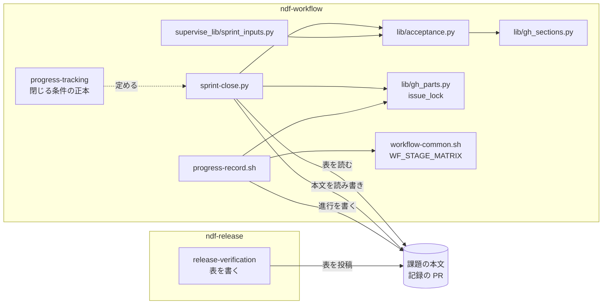
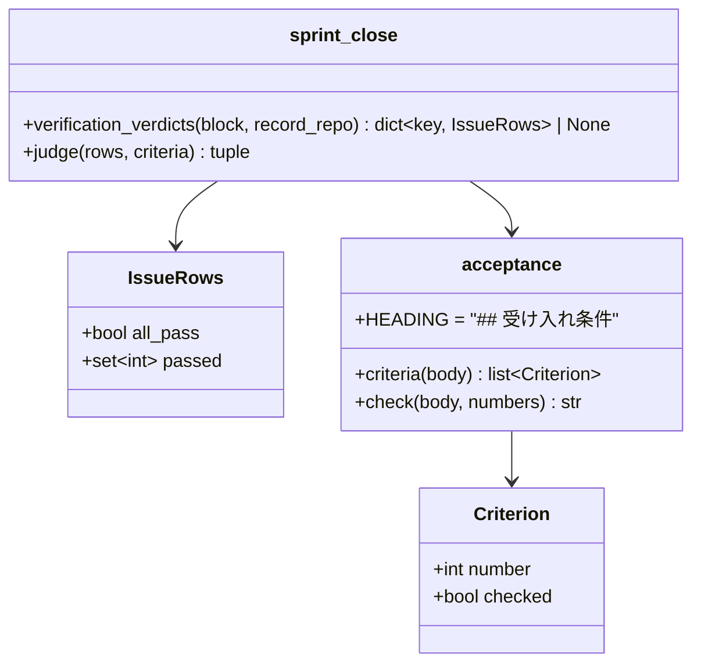
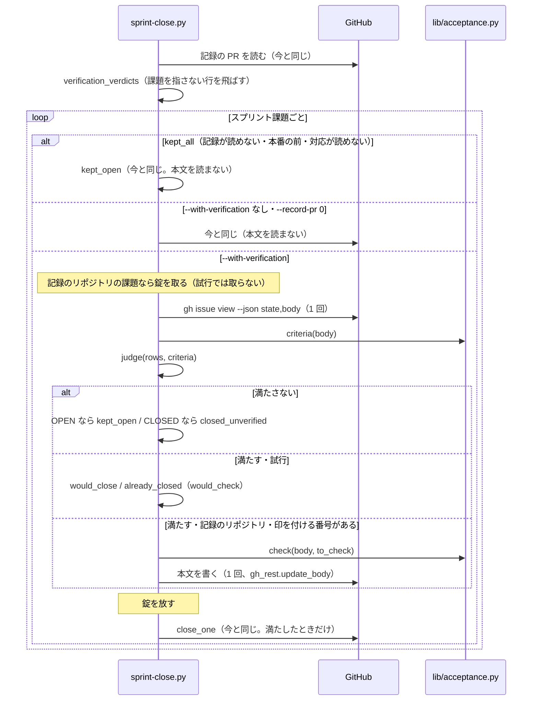
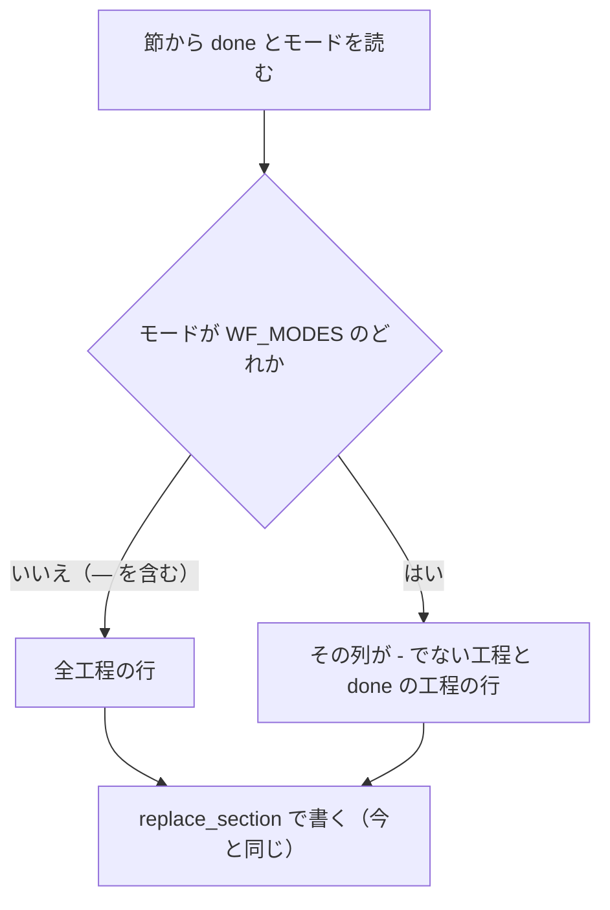

# スプリントを閉じる: 受け入れ条件を確かめたかが本文から読めないまま課題が閉じ、工程表に通らない工程の行が残る → 合格の行がそろった課題だけを閉じて本文の受け入れ条件に印を付け、工程表はモードで通る工程だけを持つ（#1683）

## 目的

- **何が壊れているか**: 本番の配布の後に課題を閉じるとき、本文の `## 受け入れ条件` のチェックボックスが 1 つも付かない。表に受け入れ条件の番号が無いため、どの条件を確かめたかを閉じる判定に使っていない。表に課題を指さない行（`—`・`PR 1869`）が 1 行でもあると、表全体が読めずに全件が開いたまま残る。工程表には、その課題のモードで通らない工程が未チェックで残る
- **誰が困るか**: 閉じた課題を後から読む人（受け入れ条件を確かめたかを本文から読めない）と、スプリントを回す conductor（表の 1 行の書き方で閉じる工程が全件止まる）
- **直すと何が成り立つか**: `--with-verification` の経路では、受け入れ条件のすべてに合格の行がある課題だけが閉じ、閉じた課題の本文の受け入れ条件に `[x]` が付く。課題を指さない行は飛ばす。工程表はモードで通る工程と記録の済んだ工程の行だけを持つ

## 適用範囲

- **働く範囲**: NDF を使うすべてのリポジトリ（`sprint-close.py` と `progress-record.sh` は配布物）。本文を書き換えるのは記録のリポジトリの課題だけで、他のリポジトリの課題は判定だけを行う
- **プロジェクトごとに違うもの**: 無し（受け入れ条件の節の見出し・表の列の名前・工程表の分類は NDF が持つ形で、設定にしない）
- **当たるモード**: リリース後テストを通るモード（`standard` / `legacy-refactor` と、通るときの `operation` / `documentation`）の閉じる工程。工程表の変更はモードを記録したすべての課題

## あるべき姿の根拠

| 根拠 | 種類 | 何を示すか |
| --- | --- | --- |
| #1870 は受け入れ条件 7 件が未チェックのまま 2026-10-10 18:09 JST に閉じた（#1822・#1843・#1847・#1867・#1492 も同じ） | 実測 | 今の閉じる条件は、受け入れ条件の番号ごとの合否を見ていない |
| PR #1887 の直す前の表で `--with-verification` の dry-run を打つと、全件が `kept_open`（条件と課題の対応が読めない）になった | 実測 | 課題を指さない 1 行が、ほかの課題の判定を止める |
| 2026-10-03 以降に閉じた 60 件の closer はすべて API | 実測 | GitHub が先に閉じる経路（論点 3）は今は塞がなくてよい |
| 要求の「対象範囲」の「読む側で受けると決めた。書く側で禁じると、導入の確認のように課題を持たない検証を書く場所が無くなるため」 | 利用者の指示の原文 | 課題を指さない行は表に残してよく、読む側が飛ばす |

要求と受け入れ条件は #1683 の本文にある（コピーは `issues/issue-1683-requirements.md`）。この文書は「どう作るか」だけを扱う。

## ドメインモデル

### コンテキスト

| コンテキスト | 何の語が 1 つの意味に決まるか |
| --- | --- |
| `ndf-workflow` | スプリント課題・閉じる条件・工程表・受け入れ条件の番号と印 |
| `ndf-release` | リリース後テストの記録（表の列と行の書き方） |

`ndf-release` と `ndf-workflow` は**公開された言語**の関係にする。リリース後テストの記録の表の形は
`release-verification` の「出力物」が文書化し、`sprint-close.py` はその形だけを読む。書く側と読む側が
別々に変わっても、表の形の定めが両者をつなぐ。

### 集約

| 集約 | 持ち主（書き換えてよいもの） | 根 | エンティティ | 値オブジェクト |
| --- | --- | --- | --- | --- |
| 受け入れ条件の節 | 印（`[ ]` → `[x]`）は `sprint-close.py`（規則は `lib/acceptance.py`）。条件の文は `requirements-design` で、この変更では触らない | 課題の本文の `## 受け入れ条件` | 受け入れ条件（番号で識別） | 受け入れ条件の番号・印の有無 |
| 工程表 | `progress-record.sh` | 課題の本文の `## 進行` | 工程の行（工程名で識別） | モード・記録の時刻 |
| リリース後テストの記録 | `release-verification`（この変更では読むだけ） | 記録の PR のコメントの `## リリース後テスト` | 表の行 | 課題の参照・受け入れ条件の番号・結果 |

**2 つの集約が同じ課題の本文に乗る。** 受け入れ条件の節と工程表は別の節で、持ち主も別である。本文は 1 つの
文字列として読み書きするため、どちらの持ち主も課題ごとの錠（`lib/gh_parts.py` の `issue_lock`）の中で読みから
書きまでを行い、相手の節を書き戻さない。

### 不変条件

| # | 集約 | 条件 | 破れたときの扱い |
| --- | --- | --- | --- |
| I1 | リリース後テストの記録 | `課題` の列が `#<番号>` か `<所有者>/<リポジトリ>#<番号>` で始まらない行は、どの課題の判定にも使わず、表全体の読みも止めない | — （読み飛ばす） |
| I2 | リリース後テストの記録 | 課題を指す行が 1 行も無い表は、どの課題にも対応を持たない | 全件を `kept_open`（条件と課題の対応が読めない） |
| I3 | 受け入れ条件の節 | 受け入れ条件の番号は、節のコードブロックの外にある行頭のチェックボックスの行を上から数えた順（1 から）である | — （数え方の定義） |
| I4 | 受け入れ条件の節 | `--with-verification` で閉じる・`already_closed` とする課題は、本文の受け入れ条件 1〜k のすべてに合格の行があり、その課題に合格でない行が無い（k = 0 なら表の行の合否だけ） | 開いていれば `kept_open`、閉じていれば `closed_unverified`。`reason` に満たさない理由と番号 |
| I5 | 受け入れ条件の節 | 印を付けるのは I4 を満たした課題だけで、変わるのは節の中のチェックボックスの `[ ]` の空白 1 文字だけである（節の外・取り消し線の行・説明の行・改行の形は変わらない） | 書き込まず、その課題を `failed` にする |
| I6 | 受け入れ条件の節 | 課題を閉じるのは、印を書き終えた後だけである | 印を書けなければ閉じずに `failed`（`cmd` にやり直すコマンド） |
| I7 | 受け入れ条件の節 | 他のリポジトリの課題の本文は書かない | — （書く経路を持たない） |
| I8 | 受け入れ条件の節 | `--with-verification` が無い呼び出しと `--record-pr 0` の呼び出しは、本文を読まず書かない | — （読む経路に入らない） |
| I9 | スプリント課題 | 閉じた課題を開き直さない | — （開き直す経路を持たない） |
| I10 | 工程表 | モードが `WF_MODES` のどれかなら、`WF_STAGE_MATRIX` のその列が `-` で記録の無い工程の行を持たない。記録の済んだ行は列に関わらず残る。モードが `—` か知らない値なら全工程の行を持つ | — （書き直すたびに組み直す） |

### ドメインイベント

| # | イベント | 発生元 | 受け手 |
| --- | --- | --- | --- |
| E1 | 工程を記録した（`## 進行` を書き直した） | `progress-record.sh`（各工程 Skill が `projects-sync.sh stage` で呼ぶ） | 本文を読む人・`spec-copy.py`（`## 進行` を写さない） |
| E2 | リリース後テストの記録を置いた | `release-verification` | `sprint-close.py`（E3） |
| E3 | 表を課題と受け入れ条件の番号でまとめた | `sprint-close.py` の `verification_verdicts` | 同じ実行の E4 |
| E4 | 課題ごとに閉じる条件を判定した | `sprint-close.py` の `_close_item`（本文は `lib/acceptance.py` で読む） | E5・結果 JSON |
| E5 | 本文の受け入れ条件に印を付けた | `sprint-close.py`（規則は `lib/acceptance.py`） | E6・本文を読む人 |
| E6 | 課題を閉じた | `sprint-close.py` の `close_one` | 棚卸し（`backlog-refinement`） |
| E7 | GitHub が課題を先に閉じた | GitHub（closing keywords） | E4（閉じた状態のまま判定し、満たさなければ `closed_unverified`） |

### 用語

| 用語 | 意味 | 用語集への反映 |
| --- | --- | --- |
| 受け入れ条件の番号 | 課題の本文の `## 受け入れ条件` の節で、コードブロックの外にある行頭のチェックボックスの行を上から数えた順（1 から）。リリース後テストの表の `受け入れ条件` の列は、セルの頭に `<番号>.` で書く | 追加（`ndf-workflow`） |
| 受け入れ条件の印 | 受け入れ条件の番号に合格の行がそろった課題を閉じるとき、`sprint-close.py` がその行のチェックボックスへ付ける `[x]` | 追加（`ndf-workflow`） |
| 合格の行 | リリース後テストの表で、`結果` の列が `合格` で始まる行 | 追加（`ndf-release`） |

## 機能一覧

| # | 機能 | 誰が使うか |
| --- | --- | --- |
| F1 | 課題を指さない行を飛ばしてリリース後テストの表を読む | スプリントを閉じる supervisor / conductor |
| F2 | 受け入れ条件の番号ごとの合格の行で閉じる条件 2 を判定する | 同上 |
| F3 | 閉じる課題の本文の受け入れ条件に印を付ける（試行では付ける予定の番号を出す） | 同上・閉じた課題を読む人 |
| F4 | 既に閉じていた課題が条件を満たさないことを `closed_unverified` で知らせる | 結果を受け取る人 |
| F5 | 工程表をモードで通る工程と記録の済んだ工程だけで書く | 課題の本文を読む人 |
| F6 | リリース後テストの表の `受け入れ条件` の列に番号を書き、課題を持たない行の書き方を定める | `release-verification` を回す worker |

## 構成要素

| 要素 | 区分 | 責務 |
| --- | --- | --- |
| `plugins/ndf/scripts/lib/acceptance.py` | 作る | 受け入れ条件の節の見出し（`HEADING`）・番号の数え方（`criteria`）・印付け（`check`）の唯一の置き場。純粋な文字列の処理で、GitHub を呼ばない |
| `plugins/ndf/scripts/lib/gh_sections.py` | 変える | 節の範囲を元の本文の文字の位置（`\r\n` を正規化しない）で返す `section_bounds` を足す。`acceptance.py` が節の外を 1 文字も変えないために使う |
| `plugins/ndf/scripts/sprint-close.py` | 変える | 表を課題と番号でまとめる（F1）、閉じる条件 2 の判定（F2）、錠の中での本文の読み書き（F3）、`closed_unverified`（F4）、結果の項目 `checked` / `would_check` と集計 |
| `plugins/ndf/scripts/supervise_lib/sprint_inputs.py` | 変える | 見出しの定数 `HEADING` を `acceptance.HEADING` から引く（同じ役割の定数を 2 か所に置かない） |
| `plugins/ndf/scripts/progress-record.sh` | 変える | `WF_MODES` と `WF_STAGE_MATRIX` を埋め込みの Python へ渡し、モードの列が `-` で記録の無い工程の行を書かない（F5） |
| `plugins/ndf/skills/release-verification/SKILL.md` | 変える | 「出力物」の表の定め: `受け入れ条件` の列の頭に番号を書く・課題を持たない行（導入の確認など）は `課題` の列を `—` にする・本文の受け入れ条件 1 つにつき 1 行以上を置く（F6） |
| `plugins/ndf/skills/progress-tracking/SKILL.md` | 変える | 「スプリントを閉じる」の閉じる条件 2・結果の表（`closed_unverified`・`checked` / `would_check`）・配布の記録の表の読み方を、上の振る舞いへ合わせる |
| `docs/glossary/glossary.json`（と `glossary.py render` で作る `docs/glossary.md`） | 変える | 用語の表の 3 語を足す |

図には用語集（`docs/glossary/`）を含めない。読み書きの関係を持たず、語を足すだけである。

**配置は変えない。** どの要素も今と同じ場所で、ローカルの CLI として動く。外部の系は GitHub だけである。

## 構造

`lib/acceptance.py` と、`sprint-close.py` の表のまとめの形だけが新しい型である。

| 型・関数 | 形 |
| --- | --- |
| `Criterion` | `NamedTuple(number: int, checked: bool)`。`criteria(body)` は節が無ければ空のリストを返す |
| `check(body, numbers)` | `numbers` の行の `[ ]` を `[x]` にした本文を返す。既に `[x]` の行・範囲外の番号は変えない |
| `IssueRows` | `NamedTuple(all_pass: bool, passed: frozenset[int])`。`all_pass` は今の「その課題の行がすべて合格」、`passed` は合格の行にある番号のうち、合格でない行に無い番号 |
| `judge(rows, criteria)` | `(ok: bool, reason: str | None, to_check: list[int])`。純粋な関数 |

## 入出力の契約

### `sprint-close.py` の結果 JSON（`items[]` の `kind: "issue"`）

**既存の `result` の値と意味は変えない。** 足すのは値 1 つと項目 2 つである。

| 項目 | 型 | いつ載るか | 意味 |
| --- | --- | --- | --- |
| `result` | 文字列 | 常に | 今の `closed` / `already_closed` / `failed` / `kept_open` / `would_close` に `closed_unverified` を足す |
| `checked` | 整数の配列 | `--with-verification` で、記録のリポジトリの課題が `closed` か `already_closed` になり、この実行で印を付けた番号が 1 つ以上あるとき | この実行で `[ ]` から `[x]` にした受け入れ条件の番号（昇順） |
| `would_check` | 整数の配列 | `--dry-run` で、上と同じ条件のとき | 印を付ける予定の番号（昇順） |
| `reason` | 文字列 | 今の場面に加え、`kept_open` / `closed_unverified` の判定の理由 | 下の表 |
| `cmd` | 文字列 | 今の場面に加え、本文の読み書きで `failed` になったとき | 同じ `sprint-close.py` の呼び出し（引数をそのまま並べる）。閉じた課題は `already_closed` になり印も変わらないため、打ち直してよい |

| 場面 | `result` | `reason` |
| --- | --- | --- |
| 表にその課題の行が無い | `kept_open`（閉じていれば `closed_unverified`） | `リリース後テストの行が無い`（今と同じ文） |
| その課題に合格でない行がある | 同上 | `リリース後テストに合格でない条件がある（不合格・保留）`（今と同じ文） |
| 合格の行が無い番号がある | 同上 | `合格の行が無い受け入れ条件: 3, 5` |
| `closed_unverified` のとき | — | 上の文の頭に `閉じているが閉じる条件 2 を満たさない: ` を付ける |
| 錠を取れない | `failed` | `本文の錠を取れない` |
| 本文を読めない | `failed` | `本文を読めない` |
| 印を書けない（I5 の確かめに落ちたときも含む） | `failed` | `受け入れ条件の印を書けない` |

**集計**: `metrics` に `closed_unverified` の件数を足し、`summary` の「開いたまま」の前に「閉じているが条件を満たさない N 件」を
入れる。**`closed_unverified` は止める理由にしない**（`status` と終了コードを変えない。決定 4）。

**表の読み方**（`verification_verdicts`）:

| 入力 | 出力 |
| --- | --- |
| 表が無い・見出しに `課題` か `結果` が無い | `None`（今と同じ） |
| 課題を指す行が 1 行も無い（0 行の表を含む） | `None` |
| `課題` の列が `^(<所有者>/<リポジトリ>)?#<番号>` に当たらない行 | 飛ばす |
| `受け入れ条件` の列が無い・セルの頭が `<番号>.` でない行 | 課題の `all_pass` には効き、`passed` には足さない |

### `release-verification` の表の定め

| 列 | 書くこと |
| --- | --- |
| 課題 | `#<番号>` / `<所有者>/<リポジトリ>#<番号>`。課題に結び付かない検証（導入の確認など）は `—` |
| 受け入れ条件 | セルの頭に受け入れ条件の番号を `<番号>.` で書く（例 `2. 一覧は更新日時の降順で並ぶ`）。課題の本文の受け入れ条件 1 つにつき 1 行以上を置く。課題に結び付かない行は番号を書かない |

## 処理の流れ

**錠の範囲は本文の読みから書きまでで、閉じる操作（`close_one`）は錠の外に置く。** 錠が守るのは本文だけで、
状態の変更は本文とぶつからない。

工程表（F5）は `progress-record.sh` の埋め込みの Python の最後の並べ方だけが変わる。

## 非機能の実現方式

| 大項目 | 実現方式 |
| --- | --- |
| 運用・保守性（錠） | `sprint-close.py` は記録のリポジトリの課題の本文を `gh_parts.issue_lock(<記録のリポジトリ>, <番号>)` の中で読み書きする。`progress-record.sh` と `body-section` と同じ錠のため、同じ課題の `## 進行` の記録とぶつかっても片方の変更が消えない。錠の待ちは `body-lock` の既定と同じ 30 秒で、取れなければ `failed` |
| 運用・保守性（1 か所） | 受け入れ条件の見出し・数え方・印付けは `lib/acceptance.py` だけに置く。`sprint_inputs.py` の見出しの定数もそこから引く。工程の分類は `WF_STAGE_MATRIX` を環境変数で渡し、Python 側に写さない |
| 性能・拡張性 | 本文を読むのは `--with-verification` で `kept_all` でない課題 1 件につき 1 回（状態と本文を 1 回で読む）、書くのは印を付ける番号があるときだけ 1 回 |

## 決定の記録

### 決定 1: 課題を指さない行で表全体が止まらないよう、`課題` の列の頭が課題の参照でない行を読み飛ばす

今は行の中のどこかに `#<番号>` があれば課題と読み、無ければ表全体を `None` にする。読み飛ばす行の判定をセルの頭に
固定するのは、`PR #1869` のようなセルを課題 #1869 と誤って読まないためである。課題を指す行が 1 行も無いときは、
今と同じく `None` にして全件を開いたまま残す（I2）。

書く側（`release-verification`）で課題の無い行を禁じる案は採らない。導入の確認のように課題に結び付かない検証を
書く場所が無くなる（要求の対象範囲で決めた）。

根拠: Value 1 / Value 5（MVV 版 2）

### 決定 2: 受け入れ条件の番号を本文の位置で決め、行頭に書いた番号は読まない

前提 1 は「行の頭に書いた番号があれば一致するものとして扱う」とし、食い違いの扱いを決めていない。位置だけを
正にすれば、書いた番号の有無や書式に関わらず数え方が 1 つに決まる。数えるのは、節のコードブロックの外で、
行頭（字下げなし）の `- [ ]` / `- [x]` の行である（`requirements-design` が書く形）。

書いた番号を読んで位置と照らす案は採らない。食い違いの扱いを新しく決める必要が生じ、今の課題の本文
（すべて位置と一致）では得るものが無い。

根拠: Value 1（MVV 版 2）

### 決定 3: 節の外を 1 文字も変えないため、印付けは元の本文の文字の位置で行い、書く前に差分を確かめる

`gh_sections.replace_section` は改行を `\n` へ揃えて組み直すため、画面で編集した本文（`\r\n`）を書き戻すと
節の外の全行が変わる。`gh_sections` に元の文字の位置で節の範囲を返す `section_bounds` を足し、`acceptance.check`
はその範囲の中のチェックボックスの空白 1 文字だけを `x` に置き換える。書く前に、元の本文と新しい本文の長さが等しく、
違う位置がすべて置き換えた位置であることを確かめ、外れたら書かずに `failed` にする（I5）。

`replace_section` で節ごと差し替える案は採らない。改行の正規化で受け入れ条件 5 を破る。

根拠: Value 6（MVV 版 2）

### 決定 4: 既に閉じていた課題が条件を満たさないときは新しい値 `closed_unverified` を返し、止めない

`kept_open` に `reason` で区別する案は採らない。`kept_open` は「開いたまま残した」を意味し、閉じている課題に
使うと結果の値と課題の状態が食い違う。新しい値にすれば、集計と報告で数を数えられる。

止める（`status: stopped`）案も採らない。GitHub が先に閉じる経路（論点 3）を塞がない以上、起きるたびに棚卸しが
止まる。`kept_open` と同じく止めずに報告へ載せ、受け入れ条件を確かめて印を付けるか、開き直すかを人が決める
（前提 6）。

根拠: Value 2（MVV 版 2）

### 決定 5: 本文の書き換えに失敗した課題のやり直しは、同じ `sprint-close.py` の呼び出しを打ち直す形にする

課題 1 件だけをやり直す引数を足す案は採らない。打ち直しは、閉じた課題を `already_closed` にし、付いた印を
変えないため、同じ呼び出しを繰り返しても結果が変わらない。今の失敗の `cmd`（`gh issue close`）は印を付けずに
閉じてしまうため、本文の失敗には使わない。

根拠: Value 4（MVV 版 2）

### 決定 6: 工程の分類を写さないため、`progress-record.sh` は `WF_MODES` と `WF_STAGE_MATRIX` を環境変数で Python へ渡す

モードは埋め込みの Python が本文の見出しから読むため、行を絞る判定は Python の側で行う。分類の表は
`workflow-common.sh` を `source` した変数をそのまま渡し、Python は列の位置を `WF_MODES` から引く。
`wf_stage_class` を工程ごとにシェルで呼んで渡す案は採らない。モードが本文から決まる前に呼ぶことになり、
全モード分を前もって作る必要がある。

根拠: Value 6（MVV 版 2）

### 決定 7: 工程表の「後片付け」の行が記録されない件は、別の課題 #1893 にする

要求の未決の 1 つ目である。「後片付け」は全モードで必須の工程で、この変更で行は消えない。記録を打つのは
`merged-steps.py` で、閉じる条件とは別の経路のため、#1893 として起票した。

根拠: Value 6（MVV 版 2）

### 決定 8: 受け入れ条件 1 は「課題を指さない 2 行の有無で判定が変わらない」ことで確かめ、括弧書きの期待値は受け入れ条件 3・7 の判定に従う

受け入れ条件 1 の括弧書きは、#1867 を `already_closed`、#1492・#1870 を `kept_open` と見込む。これは今の閉じる条件での値で、
受け入れ条件 3・7 の判定と両立しない。PR #1887 の表は `受け入れ条件` の列に番号を持たず（#1867 は本文に 11 個の
受け入れ条件）、#1492・#1870 は保留の行を持ち、3 件とも記録の時点で閉じている。受け入れ条件 3・7 に従うと、3 件とも
`closed_unverified` になる。要求の「影響」の表も「番号の無い行しか持たない課題は、本文に受け入れ条件があれば
閉じない」としており、括弧書きだけが古い判定のままである。

受け入れ条件 1 の主文（`#<番号>` の行を持つ課題の判定が、2 行の無い表と同じ。「条件と課題の対応が読めない」が出ない）
をそのまま縛り、括弧書きの値は受け入れ条件 3・7 の値（3 件とも `closed_unverified`）で確かめる。括弧書きを
今の値のまま縛る案は採らない。受け入れ条件 7 を破らないと満たせない。**課題の本文の受け入れ条件 1 の括弧書きを
直すかは承認ゲート 1 で人が決める**（要求の正は課題の本文で、この設計からは書き換えない）。

根拠: Value 1 / Value 3（MVV 版 2）

## テスト設計

| 受け入れ条件・不変条件 | どの振る舞いで縛るか | どう壊したら落ちるべきか |
| --- | --- | --- |
| 1・I1 | PR #1887 の直す前の表（`—` と `PR 1869` の行を持つ）の判定が、その行を除いた表の判定と同じになり、「条件と課題の対応が読めない」が出ない。閉じた 3 件（#1867・#1492・#1870）は `closed_unverified`（決定 8） | 課題を指さない行で `None` を返すように戻すと落ちる。頭の固定を外して `PR #1869` を課題と読むと落ちる |
| 2・I2 | 課題を指す行が 0 行の表で全件が `kept_open`（条件と課題の対応が読めない） | 0 行のとき空の辞書を返すと落ちる |
| 3・I4 | 3 個の受け入れ条件に番号 1・2 の合格の行だけで `kept_open`、`reason` に `3`、本文の書き込みが 0 回、閉じる操作が 0 回 | 番号の照合を外す（今の判定）と落ちる |
| 4・I4・I6 | 1〜3 がそろうと `closed`、`checked` が `[1, 2, 3]`、書いた本文の 3 行が `[x]`、書き込みが閉じる操作より前 | 書き込みと閉じる操作の順序を入れ替えると落ちる |
| 5・I5 | 節の外・取り消し線の行・説明の行・`\r\n` を含む本文で、書いた本文と元の本文の違いがチェックボックスの文字だけ | `replace_section` で組み直すと落ちる |
| 5・I5 | `check` の結果が差分の確かめに外れたとき書かずに `failed` | 確かめを外すと落ちる |
| 6 | 同じ番号に合格と保留の行があると `kept_open`、`reason` が今の「合格でない条件がある」 | `passed` から合格でない番号を引かないと落ちる |
| 7・E7 | 閉じた課題で 3 と同じ表なら `closed_unverified`、`reason` に「閉じているが」と `3`、開き直しの呼び出しが 0 回、`status` は `ok` | `already_closed` を返すと落ちる |
| 8 | 閉じた課題で 1〜3 がそろうと `already_closed`、`checked` が載り本文に印が付く | 閉じた課題の印付けを飛ばすと落ちる |
| 9 | `--dry-run` で `would_check` が載り、本文の書き込みが 0 回 | 試行で書くと落ちる |
| 10・I6 | 書き込みが失敗すると `failed`・`cmd` が同じ呼び出し・閉じる操作が 0 回・終了コード 1 | 書き込みの失敗を無視して閉じると落ちる |
| 11 | 節が無い本文と、チェックボックスが 0 個の節で、表の合否だけで判定され書き込みが 0 回 | 節が無いとき閉じないようにすると落ちる |
| 12・I8 | `--with-verification` なしと `--record-pr 0` で本文を読む呼び出しが 0 回、結果が今の結果と同じ | 経路に関わらず本文を読むと落ちる |
| 13・I7 | 他のリポジトリの課題で 3・4・6 と同じ結果、書き込みが 0 回 | リポジトリを見ずに書くと落ちる |
| I3 | コードブロックの中のチェックボックス・字下げしたチェックボックス・取り消し線の行を数えない | フェンスの判定を外すと落ちる |
| I9 | どの場面でも `gh issue reopen` を呼ばない | — （7 の行と同じテストで見る） |
| 非機能（錠） | 本文の読み書きの間、同じ課題の錠が取られている。錠が取れないと `failed` | 錠の外で読むと落ちる |
| 14・I10 | モード `light` の課題へ工程を記録すると、`-` の 9 工程の行が無く、`作業場所の用意`・`設計` の行がある | 絞り込みを外すと落ちる |
| 15・I10 | モード `light` で、`計画` を記録済みの本文へ記録しても `計画` の `[x]` 行が残る | done を見ずに列だけで絞ると落ちる |
| 16・I10 | モード `—` で全 19 工程の行がある | `—` を知らないモードとして全行を消すと落ちる |
| 17 | `plugins/ndf/scripts/tests` と `plugins/ndf/skills/development-workflow/tests` の全体テストが通る | — |

## 設計の結果

| 課題 | 扱い | 取り込み先 | 触るファイル |
| --- | --- | --- | --- |
| #1683 | 実装する | — | `plugins/ndf/scripts/lib/acceptance.py`、`plugins/ndf/scripts/lib/gh_sections.py`、`plugins/ndf/scripts/sprint-close.py`、`plugins/ndf/scripts/supervise_lib/sprint_inputs.py`、`plugins/ndf/scripts/progress-record.sh`、`plugins/ndf/skills/release-verification/SKILL.md`、`plugins/ndf/skills/progress-tracking/SKILL.md`、`docs/glossary/glossary.json`、`docs/glossary.md`、`plugins/ndf/scripts/tests/` |

## 未確認のまま残ること

| 項目 | 内容 |
| --- | --- |
| 受け入れ条件 1 の括弧書きの期待値 | 決定 8 のとおり受け入れ条件 3・7 と両立しない。課題の本文を直すか（3 件とも `closed_unverified` にする）を承認ゲート 1 で人が決める。直さないと、実装の完了判定で受け入れ条件 1 の括弧書きが満たされない |
| PR #1887 の直す前の表の文字列 | 受け入れ条件 1 のテストの入力になる。コメントの編集履歴から取り出す。取れなければ要求の記述（`—` の行と `PR 1869` の行）から組む。マージの前に実物の記録の PR #1887 へ `--dry-run` を打ち、閉じる課題が無く、3 件が `closed_unverified` になることを見る（要求の検証手段） |
| 本文に書いた番号と位置の食い違い | 決定 2 で位置を正にした。今の課題で食い違う本文があるかは数えていない。次の本番の配布のリリース後テストで、閉じた課題の印の位置を見る |
| `gh issue view` の `state` と REST の書き込みの組み合わせ | 読みは `gh issue view --json state,body`、書きは `gh_rest.update_body`（REST）。テストの偽の `gh` が両方を受けるかは実装（`tdd-cycle`）で走らせて決める |
