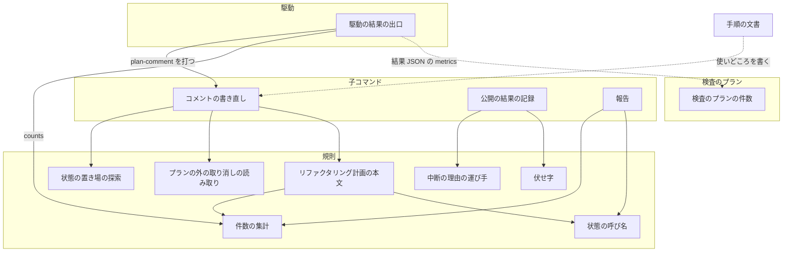
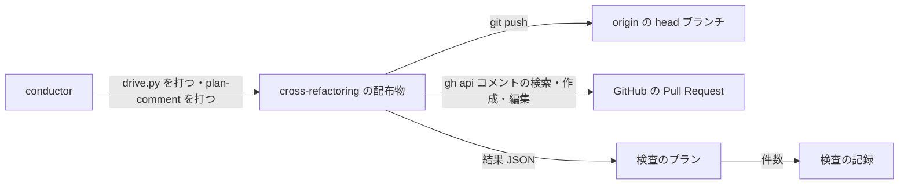
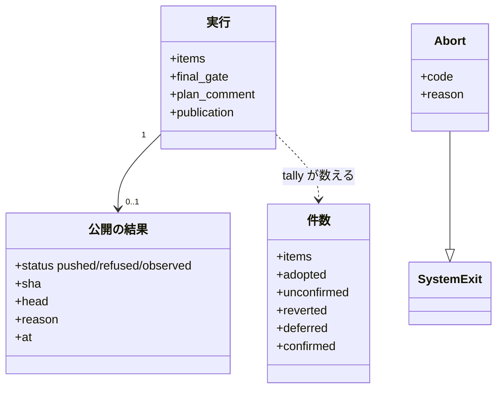
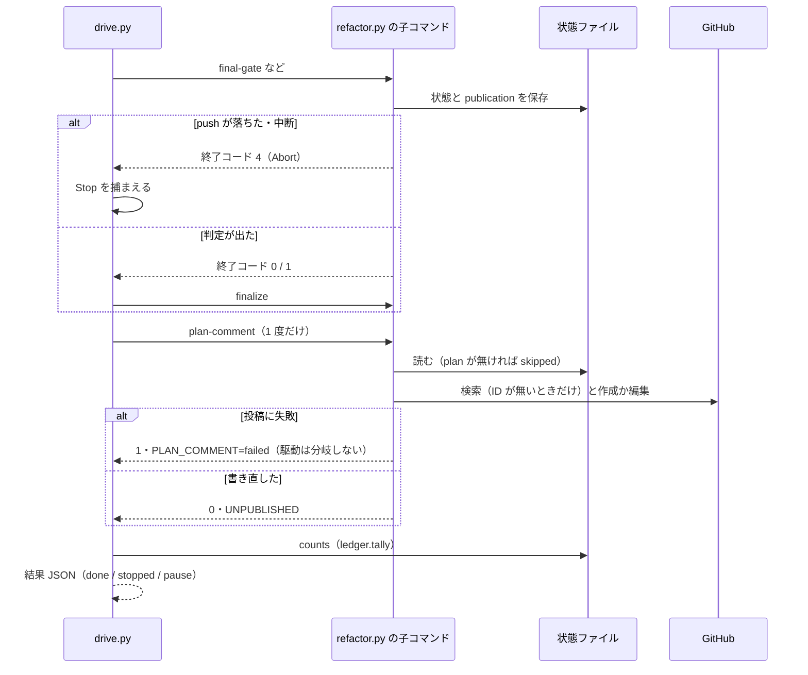
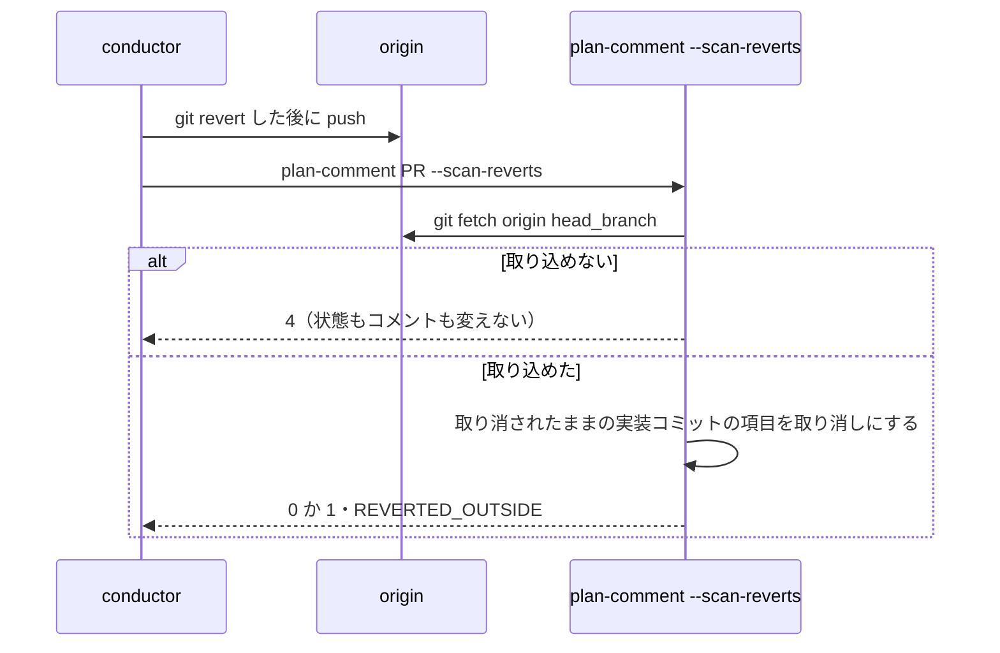
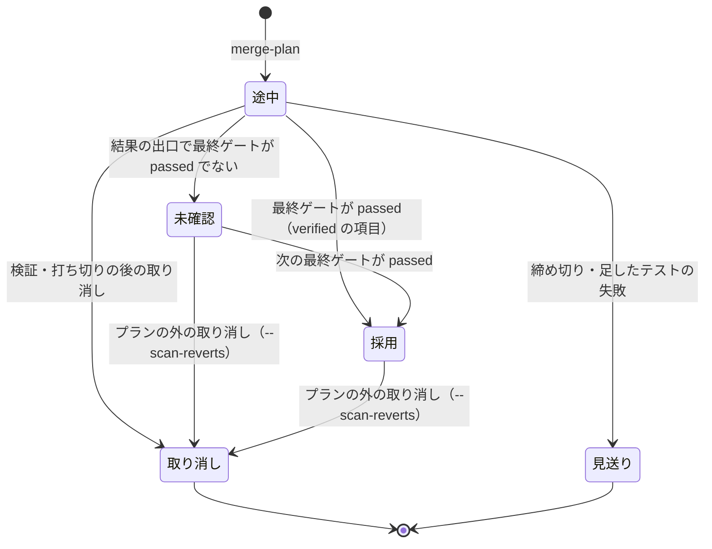

# cross-refactoring: push が落ちた・最終ゲートを通らなかった・取り消した実行のリファクタリング計画のコメントが、作られないか「採用」のまま残る → どの結果の出口で終わっても、コメントが結果 JSON と同じ件数と公開の状態を記す（#1692 #1684 #1648 #1652）

## 目的

- **何が壊れているか**: リファクタリング計画のコメントを書くのは push が通った直後だけで、項目の状態は最終ゲートの結論にかかわらず「採用」と書かれる。PR #1663 では 16 件が「採用」のまま残り（実際は採用 0・取り消し 7・未確認 16）、PR #1634 では push が落ちてコメントが 1 件も出なかった。検査のプランの件数は `unconfirmed` を落とし、「採用 0」だけが読み手へ届く
- **誰が困るか**: Pull Request を読む人と承認する人。どの改善項目が残ったかを、コミットの一覧と突き合わせないと読めない
- **直すと何が成り立つか**: どの結果の出口で終わっても、コメント・結果 JSON・報告の件数が同じ状態ファイルから同じ規則で数えられ、ブランチへ公開できたかもコメントに書かれる

## 適用範囲

- **働く範囲**: 配布先のリポジトリでも働く（cross-refactoring を使うすべてのリポジトリの Pull Request のコメント）。検査のプランの件数（`check-trigger.py`）は NDF を使うリポジトリの検査の記録に効く
- **プロジェクトごとに違うもの**: 無い。置き場所（コメント・`--plan-file`・記録しない）は今の引数 `--plan-file` のまま受ける
- **当たるモード**: cross-refactoring を通すすべての起動（単独・`--workflow-step`）

## あるべき姿の根拠

| 根拠 | 種類 | 何を示すか |
| --- | --- | --- |
| PR #1663 のコメントが 16 件「採用」のまま、結果は adopted 0 / reverted 7 / unconfirmed 16（#1684） | 実測 | 書く時点が push の直後だけで、最終ゲートと取り消しの後に書き直されない |
| PR #1634 で push が `ruff format --check` に拒否され、コメントが 0 件（#1648） | 実測 | push が落ちた経路にコメントを書く地点が無い |
| 直近 5 本（#1634・#1621・#1612・#1591・#1564）の検査の記録が `applied` 0 だけを持つ（#1652） | 実測 | 読む側が `unconfirmed` を写さない |
| #1692 の修正方針（リファクタリング計画のコメントを、結果が確定するすべての出口で書き直す記録の契約にする） | 利用者の指示の原文（廃止した語を今の語へ置き換えた） | 書く責務を push から結果の出口の側へ移す |

要求と受け入れ条件は #1692 の本文にある（コピーは `issues/issue-1692-requirements.md`）。この文書は「どう作るか」だけを扱う。

## ドメインモデル

### コンテキスト

| コンテキスト | 何の語が 1 つの意味に決まるか |
| --- | --- |
| cross-refactoring（`ndf-cross-refactoring`） | 改善項目の状態（採用・未確認・取り消し・見送り）、結果の出口、公開の結果、リファクタリング計画のコメント |
| 開発ワークフロー（`ndf-workflow`） | 検査のプランの件数（`findings`） |

2 つの関係は**公開された言語**である。cross-refactoring の駆動が出す結果 JSON の `metrics`（`scripts/lib/drive_pause.py` の形）を、検査のプランがそのまま `counts` として受け取る（`supervise_lib/worker_steps.py`）。検査のプランは形を変えずに必要なキーを写すだけで、cross-refactoring の語を読み替えない。

### 集約

| 集約 | 持ち主（書き換えてよいもの） | 根 | エンティティ | 値オブジェクト |
| --- | --- | --- | --- | --- |
| 実行（状態ファイル `cross-refactoring-rf<ID>-state.json`） | `refactor.py` の子コマンド（`plan-comment` を含む） | 実行 `rf<ID>` | 改善項目 | 最終ゲートの結論・公開の結果・件数 |
| 検査の記録（`check-events`） | `check-trigger.py record` | 検査 1 回 | — | 件数（`findings`） |

**リファクタリング計画のコメントは集約ではなく、実行の投影である。** 本文は状態ファイルだけから決まり（`format_plan`）、コメントの ID と URL は実行の値（`plan_comment`）として持つ。投影を書き直すのは `plan-comment` の子コマンドだけである。駆動（`drive.py`）は状態ファイルを読むだけで書き換えない。

### 不変条件

| # | 集約 | 条件 | 破れたときの扱い |
| --- | --- | --- | --- |
| I1 | 実行 | コメントの 4 つの件数（採用・未確認・取り消し・見送り）と、同じ時点の結果 JSON の `metrics` の 4 つの値は、同じ集計（`ledger.tally`）から出る | 集計を通らない数え方を作らない。テストが同じ状態ファイルから両方を作って比べる |
| I2 | 実行 | 項目を「採用」と表すのは、最終ゲートが `passed` のときだけである。それ以外の取り消されていない項目は「未確認」と表す（既存の I8 の表示への延長） | 表示の規則を `ledger.display_status` の 1 か所に置く |
| I3 | 実行 | リファクタリング計画ができる前（`plan` が無い）と、置き場所がコメントでない実行では、コメントを作らない | `plan-comment` は何もせず 0 で終わる |
| I4 | 実行 | 1 つの実行のリファクタリング計画のコメントは 1 件である | 目印 `<!-- cross-refactoring plan rf<ID> -->` で引き当てて編集する |
| I5 | 実行 | コメントの投稿・編集の失敗は、駆動の結果 JSON と終了コードを変えない | 駆動は `plan-comment` の終了コードで分岐しない。失敗は出力の 1 行に残す |
| I6 | 実行 | 公開の結果の理由（コメントへ出す文）に認証情報を含めない | 記録する前に伏せ字にする（`secret_redact.redact`） |
| I7 | 実行 | プランの外の取り消しで「取り消し」にするのは、origin の head ブランチで実装コミットが取り消されたままの項目だけである | 取り消しを取り消したコミットがあれば、元のコミットは取り消されていないと数える |
| I8 | 実行 | 1 つの結果の出口でコメントのために打つ `gh api` は、検索 1 回と作成か編集 1 回までである | ID を持っていれば検索しない。駆動は 1 回の終わりで 1 度だけ `plan-comment` を打つ |
| I9 | 検査の記録 | refactor のステップの `metrics` に `unconfirmed` があれば、検査の件数に同じ値で写す | 無ければキーを作らない（古い記録と区別する） |

### ドメインイベント

| # | イベント | 発生元 | 受け手 |
| --- | --- | --- | --- |
| E1 | リファクタリング計画を作った | `refactor.py merge-plan` | `plan-comment`（`plan` があることがコメントを作る条件になる） |
| E2 | 改善項目を検証した・取り消した | `verify` / `merge-fix` | 件数の集計 |
| E3 | 最終ゲートへ入る push を試みた | `publish.push_head` | 公開の結果 |
| E4 | push が通った | `publish.push_head` | 公開の結果（`pushed`） |
| E5 | push が落ちた | `publish.push_head`（`Abort` を捕まえる） | 公開の結果（`refused`） |
| E6 | 最終ゲートが判定した | `refactor.py final-gate` | 件数の集計（`adoption_confirmed`） |
| E7 | 打ち切りの後に取り消した | `stop_revert.revert_after_cutoff` | 件数の集計 |
| E8 | finalize した | `refactor.py finalize` | 駆動の結果の出口（done） |
| E9 | 駆動が止まった | `drive.py`（`Stop`） | 駆動の結果の出口（stopped） |
| E10 | リファクタリング計画のコメントを書き直した | `refactor.py plan-comment` | Pull Request（読み手）・駆動（`UNPUBLISHED`） |
| E11 | プランの外で項目のコミットを取り消した | conductor（`git revert` と push） | `plan-comment --scan-reverts` |
| E12 | 結果 JSON を出した | `drive.py`（done / stopped / pause） | 検査のプランのステップ |
| E13 | 検査のプランが件数を写した | `check-trigger.py record`（`findings_of`） | 検査の記録 |

E10 は駆動の 3 つの結果の出口（done・stopped・pause）で、結果 JSON を組む前に 1 度だけ起きる。E12 の件数と E10 の件数は、同じ状態ファイルを同じ集計で数える（I1）。

### 用語

| 用語 | 意味 | 用語集への反映 |
| --- | --- | --- |
| リファクタリング計画のコメント | cross-refactoring が対象の Pull Request に 1 件だけ置き、結果の出口のたびに同じものを編集するリファクタリング計画の記録 | 追加（`ndf-cross-refactoring`。要求で追加済み） |
| 結果の出口 | リファクタリング計画ができた後に、cross-refactoring のスクリプトがその時点の結果を確定させて終了コードを返す地点 | 追加（`ndf-cross-refactoring`。要求で追加済み） |
| 未確認 | 取り消されずに残ったが、最終ゲートが `passed` になっていない改善項目の状態。採用とは数えない | 意味の変更（`ndf-cross-refactoring`。範囲テストで検証済みの項目に限らず、取り消されていない項目すべてにする） |
| プランの外の取り消し | スクリプトが終わった後に、conductor が改善項目のコミットを `git revert` で取り消すこと | 追加（`ndf-cross-refactoring`。要求で追加済み） |
| 公開の結果 | 最後に試みた head ブランチへの push の結果（通った地点の SHA か、落ちた理由）。状態ファイルの `publication` に残す | 追加（`ndf-cross-refactoring`） |
| 未公開の改善項目 | 手元の HEAD が、公開した地点から到達できないコミットを持つこと。結果 JSON の `metrics.unpublished` | 追加（`ndf-cross-refactoring`） |

## 機能一覧

| # | 機能 | 誰が使うか |
| --- | --- | --- |
| F1 | リファクタリング計画のコメントに、採用・未確認・取り消し・見送りの件数と最終ゲートの状態を冒頭に書く | Pull Request の読み手・承認する人 |
| F2 | 項目の状態を、最終ゲートの結論に合わせて「採用」か「未確認」で書く | Pull Request の読み手 |
| F3 | ブランチへの公開の状態（通った SHA・落ちた理由・未公開の項目があるか）をコメントに書く | Pull Request の読み手・conductor |
| F4 | 駆動のどの終わり方（done・stopped・pause）でも、リファクタリング計画ができていればコメントを書き直す | Pull Request の読み手 |
| F5 | プランの外の取り消しを push した後に 1 つのコマンドでコメントを書き直す | conductor |
| F6 | 結果 JSON に未公開の改善項目があるかを出す | conductor・検査のプラン |
| F7 | 検査のプランの件数に `unconfirmed` を写す | 検査の記録を読む人（stats） |
| F8 | 報告（`refactor.py report`）の項目の状態と件数を、コメントと同じ規則で出す | conductor |

## 構成要素

| 要素 | 責務 |
| --- | --- |
| 件数の集計（`refactor_lib/ledger.py` の `tally`・`display_status`） | 項目の表示の状態（採用・未確認・取り消し・見送り・途中の状態）と 4 つの件数を、状態ファイルから 1 つの規則で決める。純粋な処理で、終了コードも出力も持たない |
| 状態の呼び名（`refactor_lib/vocabulary.py` の `ITEM_STATUS_LABELS`） | 表示の状態 `adopted` を「採用」、`unconfirmed` を「未確認」と呼ぶ。`verified` を「採用」と呼ぶ行を消す |
| 中断の理由の運び手（`refactor_lib/__init__.py` の `Abort`・`die`） | `die` が出力の 1 行を出した後、理由を持つ `Abort`（`SystemExit` の派生）を投げる。終了コードは今と同じ |
| 公開の結果の記録（`refactor_lib/publish.py` の `push_head`） | push の前の照合と push を試み、通れば `publication` に `pushed` と SHA、`Abort` なら `refused` と伏せ字にした理由を残してから投げ直す。コメントは書かない |
| 伏せ字（新設 `plugins/ndf/scripts/lib/secret_redact.py` の `redact`） | 文に含まれる URL の資格情報とトークンの形を `***` に置き換え、末尾の 5 行・500 字までに縮める。純粋な処理 |
| リファクタリング計画の本文（`refactor_lib/plan.py` の `format_plan`） | 冒頭に件数の行・最終ゲートの行・公開の行を置き、項目の状態を `display_status` で書く |
| コメントの書き直し（新設 `refactor_lib/commands/plan_comment.py`、子コマンド `plan-comment`） | 状態ファイルを読み、必要ならプランの外の取り消しを反映し、未公開かを判定し、`publish_plan_comment` を 1 度呼ぶ。`UNPUBLISHED` と `PLAN_COMMENT` を出す |
| プランの外の取り消しの読み取り（新設 `refactor_lib/outside_reverts.py`） | origin の head ブランチの `plan.base_sha..FETCH_HEAD` から `This reverts commit <SHA>` を読み、取り消されたままのコミットの集合を返す |
| 状態の置き場の探索（`refactor_lib/paths.py` の `_find_state`・`default_tmp_dir`） | 環境変数・現在地に加え、既定の worktree の置き場（`<既定の根>/<repo>/rf<PR>/work/.cross_refactoring`）を探す。駆動の `known_tmp` も同じ関数を使う |
| 駆動の結果の出口（`drive.py` の `Drive.refresh_plan_comment`・`counts`） | done・stopped・pause の前に `plan-comment` を 1 度だけ打ち、その終了コードで分岐しない。`counts` は `ledger.tally` を使い、`unpublished` を足す |
| 報告（`refactor_lib/commands/report.py`） | 項目の表の状態を `display_status` の呼び名で書き、見出しに 4 つの件数の行を足す |
| 検査のプランの件数（`plugins/ndf/scripts/check-trigger.py` の `findings_of`） | refactor のステップの `counts` に `unconfirmed` があれば写す |
| 手順の文書（`SKILL.md`・`docs/04-verify-and-report.md`） | 書き直しの時点、公開の行、プランの外の取り消しの後に打つコマンドを書く |



### 文脈と配置



外部の系で変えられないのは origin と GitHub の Pull Request である。検査のプランと検査の記録は同じ変更で一緒に変える内部に当たる。配置は変わらない。駆動と子コマンドは conductor と同じ手元のプロセスで動き、`plan-comment` は駆動の子プロセスとして、または conductor が直に打つプロセスとして動く。

### 置き場所

```text
plugins/ndf/
├── scripts/
│   ├── check-trigger.py                      # findings_of が unconfirmed を写す
│   └── lib/
│       └── secret_redact.py                  # 新設
└── skills/cross-refactoring/
    ├── SKILL.md                              # 書き直しの時点と plan-comment
    ├── docs/04-verify-and-report.md          # 公開の行・件数の行・書き直しの時点
    └── scripts/
        ├── drive.py                          # 結果の出口で plan-comment を打つ
        ├── refactor.py                       # 子コマンド plan-comment の登録
        └── refactor_lib/
            ├── __init__.py                   # Abort
            ├── ledger.py                     # tally・display_status
            ├── outside_reverts.py            # 新設
            ├── paths.py                      # 既定の置き場の探索
            ├── plan.py                       # 冒頭の 3 行と項目の状態
            ├── publish.py                    # 公開の結果の記録・コメントを書かない
            ├── vocabulary.py                 # 採用・未確認の呼び名
            └── commands/
                ├── plan_comment.py           # 新設
                └── report.py                 # 状態の呼び名と件数の行
```

## 構造

触る型は状態ファイルの中の値と、新しい例外 1 つである。既存の型は名前だけを置く。



| 型 | 責務 |
| --- | --- |
| `publication`（公開の結果。辞書） | 最後の公開の試みの結果。`status` は `pushed`（push が通った）・`refused`（push の前の照合か push が `Abort` で止まった）・`observed`（`--scan-reverts` で origin の先端を読んだ）。`refused` だけが `reason` を持つ |
| `Tally`（件数。`ledger.py` の dataclass） | 4 つの件数・項目数・採用と確定したか。`as_metrics()` が今の `metrics` と同じキーを返し、確定していなければ `adopted` を 0 にして `unconfirmed` を足す |
| `Abort`（`refactor_lib/__init__.py`） | 終了コードと理由。`SystemExit` を継ぐため、捕まえない呼び出し元では今と同じく終了コードで終わる |

**`ledger.display_status(state, item)` の規則**（I2）:

| 項目の `status` | 最終ゲートが `passed` | 表示の状態 |
| --- | --- | --- |
| `reverted` | どちらでも | 取り消し |
| `deferred` | どちらでも | 見送り |
| `verified` | 通った | 採用 |
| `planned` / `tested` / `implemented` / `failing` / `verified` | 通っていない | 未確認 |
| `planned` / `tested` / `implemented` / `failing` | 通った | 今の呼び名（未着手・テストを追加済み・検証中・修正中） |

`tally` は表示の状態を数える。`adopted` は「採用」、`unconfirmed` は「未確認」の数で、これは今の `metrics.unconfirmed`（`ledger.remaining_count`）と同じ値になる（AC15）。

## 入出力の契約

### 子コマンド `refactor.py plan-comment`

| 項目 | 書くこと |
| --- | --- |
| 名前 | `python3 scripts/refactor.py plan-comment <PR> [--scan-reverts]` |
| 入力 | `<PR>`（実行の ID。cross-refactoring の実行の ID は対象の PR の番号である）。`--scan-reverts` を付けると、origin の head ブランチからプランの外の取り消しを読んでから書き直す |
| 状態ファイルの探し方 | `CROSS_REFACTORING_TMP_DIR` → 現在地の `.cross_refactoring/` → 既定の worktree の置き場（`<既定の根>/<origin の owner/repo>/rf<PR>/work/.cross_refactoring/`）の順 |
| 出力（標準出力の KEY=VALUE） | `PLAN_COMMENT=updated\|created\|skipped\|failed`・`UNPUBLISHED=0\|1`（HEAD を読めなければ空）・`PLAN_URL=<URL>`（あれば）。`--scan-reverts` では `REVERTED_OUTSIDE=<項目 ID の空白区切り>` も出す |
| 失敗の形 | 0 = 書き直した・書く対象が無い（`skipped`。I3）／ 1 = 投稿・編集に失敗した（`failed`）／ 4 = 状態ファイルが無い・`--scan-reverts` で origin を取り込めない（コメントも状態も変えない） |
| 互換性 | 新しい子コマンドで、既存の子コマンドの引数と終了コードは変わらない |

`--scan-reverts` の手順: work の worktree で `git fetch origin <head_branch>` → `git log --format=%H%x00%B plan.base_sha..FETCH_HEAD` を古い順に読む → 取り消されたままの SHA の集合を作る（I7）→ 実装コミット（`commits.implement`）がその集合にある取り消されていない項目を `ledger.mark_dropped(item, "プランの外で取り消した（<取り消しの SHA の先頭 12 字>）")` で取り消しにする → `publication` を `observed`・`sha=FETCH_HEAD` にする → 保存して書き直す。

### 結果 JSON（`drive.py`）

| 項目 | 書くこと |
| --- | --- |
| 変わる約束 | `metrics` に `unpublished`（真偽）を足す。手元の HEAD が公開した地点から到達できないコミットを持てば真。状態ファイルがあり `plan-comment` が判定できた実行で出し、判定できなければ `null` |
| 変わらない約束 | `items`・`adopted`・`reverted`・`deferred`・`fix_rounds`・`final_gate`・`unconfirmed`・`review_status` の値と、done / stopped / pause の終了コード（AC15） |
| 互換性 | キーの追加だけで、読む側（検査のプラン・conductor）は知らないキーを読み捨てる |

「公開した地点」は、`--scan-reverts` では `FETCH_HEAD`、それ以外では `ledger.published_point`（push していなければ `plan.base_sha`）。判定は `git merge-base --is-ancestor HEAD <公開した地点>` の否定である。

### リファクタリング計画のコメントの冒頭

既存の題と前置きの後、「対象範囲」の行の前に 3 行を置く。

```markdown
- 件数: 採用 0・未確認 16・取り消し 7・見送り 3（最終ゲート: failed）
- 公開: push できなかった（pre-push: ruff format --check が 2 ファイルを直すと報告）。未公開の改善項目がある
- 書き直した時刻: 2026-10-03T10:12:00+09:00
```

| `publication.status` | 公開の行 |
| --- | --- |
| 無い | `まだ push していない` |
| `pushed` | `<SHA の先頭 12 字> を push した`（未公開なら `。その後の手元のコミットは未公開`） |
| `refused` | `push できなかった（<理由>）`（未公開なら `。未公開の改善項目がある`） |
| `observed` | `origin の <head_branch> は <SHA の先頭 12 字>（プランの外の取り消しを読んだ地点）` |

最終ゲートの状態は `final_gate.status`（無ければ `未実行`）をそのまま書く。

### 検査のプランの件数（`check-trigger.py`）

`findings_of` の返す辞書に、refactor のステップの `counts` が `unconfirmed` を持つときだけ `"unconfirmed": <値>` を足す（I9）。`applied`・`reverted` と review の件数は今のまま。

## 処理の流れ

### 駆動の結果の出口



駆動の中の 3 か所で `refresh_plan_comment` を呼ぶ。

| 出口 | 呼ぶ位置 |
| --- | --- |
| done | `finalize` の後、`done()` が `counts` と報告を作る前 |
| stopped | `Stop` を捕まえた後、`stopped()` が `counts` を作る前（`TMP_DIR` と `ID` が分かっているときだけ） |
| pause（単独起動の最終ゲートの cross-review） | 続きを待つ繰り返しに入る前の 1 度 |

`done()` が未確認を理由に `Stop` を投げて stopped へ移るときは、同じ実行で既に書き直しているため 2 度目を打たない（I8）。耐久ワークフローの再生でも、この呼び出しは記録済みのステップとして返る。

### 公開の結果の記録

`push_head` の中で完結するため図にしない。生成物の同期・ツールのパスの照合・残すコミットの照合・`git push` の 4 つを 1 つの `try` で囲み、`Abort` なら `publication` を `refused` と伏せ字の理由にして投げ直し、通れば `pushed` と SHA にする。保存は今の `_push_and_save` の `finally` が行う。`git push` は `paths.sh` の `die` で止まるため、拒否の出力（標準エラー）が理由に入る。

`push_head` の末尾の `publish_plan_comment` は消す。途中の push（最終ゲート修正の取り込み・取り消し）でコメントは書かれず、実行の終わりで 1 度だけ書かれる。

### プランの外の取り消しの後



取り消されたままの集合は、古い順に読んで `This reverts commit <X>` を見たら X を集合に入れ、X 自身が集合にある取り消しのコミットだったら、X が取り消していたコミットを集合から外す（取り消しの取り消し）。

### 項目の表示の状態



取り消しと見送りから他の状態へは移らない。採用から未確認へも移らない（最終ゲートの `passed` は戻らない）。

## 非機能の実現方式

| 大項目 | 要求の条件 | 実現方式 | 確かめ方 |
| --- | --- | --- | --- |
| 可用性 | コメントの投稿の失敗（`gh` の失敗・権限・利用上限）で実行を止めない（AC14） | 駆動は `plan-comment` を `self.call` で打ち、終了コードで分岐しない。`plan-comment` は投稿の失敗を 1 で返し、出力に 1 行残す | `gh` を失敗させて駆動を流し、結果 JSON と終了コードが投稿に成功したときと同じであることを見る |
| 性能・拡張性 | 書き直しは 1 つの結果の出口につき `gh api` の呼び出しを、コメントの検索 1 回と作成か編集 1 回までに抑える | 駆動は 1 回の終わりで 1 度だけ打つ（done から stopped へ移るときも 1 度）。`plan_comment.id` があれば検索しない。push の後の書き直しは無くす | `gh` の呼び出しを数え、各出口で 2 回以下・ID があれば 1 回であることを見る |
| 運用・保守性 | 状態の数え方を 1 か所で決め、コメント・結果 JSON・報告が同じものを使う | `ledger.tally` と `ledger.display_status` だけが数え方を持ち、`drive.counts`・`format_plan`・`report` がそれを呼ぶ | 同じ状態ファイルから 3 つを作り、件数が一致することを見る |
| セキュリティ | コメントへ書く push の失敗の理由に、認証情報を含めない | `publication.reason` は `secret_redact.redact` を通してから記録する。URL の `user:pass@`・`x-access-token:`・`ghp_` / `gho_` / `ghs_` / `github_pat_` で始まる語を `***` にする | トークンを含む push の失敗の出力から作った理由に、元のトークンの文字列が残らないことを見る |

## 決定の記録

### 決定 1: 呼び忘れる出口を作らないため、書き直しを駆動の終わり 1 か所とプランの外の取り消しの子コマンドに寄せる

結果の出口は push の失敗・判定・打ち切り・取り消し・中断・finalize と多い。子コマンドごとに書き直しを呼ぶと、新しい中断の経路を足すたびに呼び忘れが起きうる。cross-refactoring の起動は `drive.py` だけで（`SKILL.md` の「実行」）、どの子コマンドの終わり方も駆動の done・stopped・pause のどれかへ集まる。そこで駆動がその 3 か所で 1 度ずつ `plan-comment` を打ち、駆動の外で起きるプランの外の取り消しだけを conductor が同じ子コマンドで扱う。`push_head` の末尾の書き直しは消す。

子コマンドの終わり（`refactor.py` の `main`）で毎回書き直す案は採らない。`verify` などの途中の子コマンドでも書くことになり、`gh api` の呼び出しが出口ごとの上限を超え、最終ゲートへ入る前の未公開の状態をコメントへ出す。

根拠: Value 6 / Value 4（MVV 版 2）

### 決定 2: コメント・結果 JSON・報告の件数を食い違わせないため、表示の状態と件数を `ledger` の 1 組の関数で決める

今は結果 JSON（`drive.counts`）が最終ゲートの結論を見て採用を数え、コメント（`ITEM_STATUS_LABELS`）は見ずに `verified` を「採用」と書く。数え方が 2 か所にあるため片方だけが直った。`adoption_confirmed` を持つ `ledger` に `display_status` と `tally` を置き、3 つの書き手がそれを呼ぶ。最終ゲートが通っていないときは、`verified` に限らず取り消されていない項目をすべて「未確認」と表す。今の `metrics.unconfirmed` が取り消されていない項目すべてを数えているためで、こうすると件数の行と項目の状態の数が一致する。

`verified` だけを「未確認」にし、途中の状態（検証中など）を今の呼び名のまま残す案は採らない。冒頭の未確認の件数と、「未確認」と書かれた項目の数が食い違う。

根拠: Value 6 / Value 3（MVV 版 2）

### 決定 3: push が落ちた理由をコメントへ届けるため、`die` が理由を持つ `Abort` を投げ、公開の結果を状態ファイルの `publication` に残す

push が落ちる経路は同期・ツールのパスの照合・残すコミットの照合・`git push` の 4 つで、どれも `die` で止まる。今の `die` は理由を標準エラーへ出して `SystemExit` で終わるため、`push_head` は理由を受け取れない。`Abort` を `SystemExit` の派生にすれば、捕まえない呼び出し元の振る舞いと終了コードは変わらず、`push_head` だけが捕まえて理由を記録できる。記録は `_push_and_save` の `finally` で保存されるので、子のプロセスが終わった後に `plan-comment` が読める。

公開の結果を `ledger.published_sha` に混ぜる案は採らない。`published_sha` は次の push の照合の起点で、失敗の記録や `--scan-reverts` の観測で書き換えると照合の範囲が変わる。

根拠: Value 7 / Value 6（MVV 版 2）

### 決定 4: プランの外の取り消しを決まった規則で読むため、origin の head ブランチの `This reverts commit <SHA>` の行で判定する

`git revert` は既定でこの行を本文に書き、conductor の取り消しは `git revert` で行う（要求の前提 3）。行を読むだけなら、取り消しの取り消しも古い順に読めば決まり、worktree の差分の計算が要らない。読むのは origin の head ブランチ（`FETCH_HEAD`）で、conductor が push した後の Pull Request の内容と一致する。対象は実装コミット（`commits.implement`）だけにする。テストのコミットは項目を取り消しても残す扱いが今の取り消しの規則である。

項目のコミットの差分が HEAD で打ち消されているかを比べる案は採らない。後の項目が同じ行を触ると打ち消しを判定できず、判定が差分の形に左右される。

根拠: Value 4 / Value 3（MVV 版 2）

### 決定 5: conductor が実行の ID を探さずに済むよう、AC10 のコマンドを `refactor.py plan-comment <PR> --scan-reverts` にし、状態ファイルを既定の worktree の置き場からも探す

実行の ID は対象の PR の番号と同じで、引数は 1 つで足りる。今の `_find_state` は環境変数か現在地からしか探さず、駆動が終わった後の conductor は `CROSS_REFACTORING_TMP_DIR` を持っていない。駆動の `known_tmp` が既に持つ既定の置き場の規則を `paths.py` へ移し、`_find_state` と `known_tmp` の両方が使う。

駆動（`drive.py`）にフラグを足す案は採らない。駆動は耐久ワークフローで、1 回の書き直しのために耐久の記録を開くと、終わった実行の記録の結果を返す既存の振る舞いとぶつかる。

根拠: Value 2 / Value 6（MVV 版 2）

### 決定 6: 未公開かを読み手が 1 つの値で判断できるよう、`metrics.unpublished` を真偽で出し、判定は `plan-comment` に任せる

駆動は耐久ワークフローの本体から git を直に打てない（外の世界に触るものは耐久ステップを通す）。`plan-comment` は書き直しのために状態ファイルと worktree を既に開いているので、そこで HEAD と公開した地点を比べて `UNPUBLISHED` を出し、駆動はその値を写すだけにする。未公開の改善項目の件数ではなく真偽にするのは、公開した地点の後のコミットには同期のコミットと取り消しのコミットが混ざり、項目の数へ割り当てられないためである。

根拠: Value 4 / Value 3（MVV 版 2）

### 決定 7: cross-review の push も同じ漏れを防げるよう、伏せ字を共通のライブラリ `scripts/lib/secret_redact.py` に置く

push の失敗の出力を外へ出すのは cross-refactoring が最初だが、cross-review も同じ `git-credential.sh` の退避で push する（#1507）。伏せ字の規則を Skill の中に置くと、cross-review が同じ出力を外へ出すときに 2 つ目の規則ができる。

根拠: Value 6（MVV 版 2）

### 決定 8: 古い検査の記録と区別できるよう、`findings_of` は `unconfirmed` を refactor のステップが持つときだけ写す

`unconfirmed` は最終ゲートを経ていない実行の結果 JSON にだけ現れる。キーが無いことを 0 と書くと、最終ゲートを通った実行と、この変更より前の駆動の記録と、未確認が 0 件の実行の 3 つが区別できない。review の件数を「drive が返したキーだけを写す」今の書き方に揃える。

根拠: Value 3（MVV 版 2）

## テスト設計

| 受け入れ条件・不変条件 | どの振る舞いで縛るか | どう壊したら落ちるべきか |
| --- | --- | --- |
| AC1・I2 | 最終ゲートが `passed` の状態と `failed` の状態から本文を作り、`verified` の項目の状態がそれぞれ「採用」「未確認」になる | `display_status` が最終ゲートを見ずに `verified` を「採用」と返すと落ちる |
| AC2・I1 | 同じ状態ファイルから `format_plan` の件数の行と `Drive.counts` を作り、4 つの値が一致する（`unconfirmed` が無い実行は未確認 0） | どちらか一方が `tally` を通らずに数えると落ちる |
| AC3 | `publication` が `pushed`・`refused`（未公開あり）の状態から、公開の行に SHA、または理由と「未公開の改善項目がある」が出る | 公開の行を作らない・`refused` の理由を落とすと落ちる |
| AC4 | push が通った後に駆動が done で終わると、コメントが書き直され、公開の行が push した SHA を持つ | 駆動の done の前の `plan-comment` を外すと落ちる |
| AC5 | `git push` を失敗させた駆動（`pre-push` が非ゼロ）と、`_require_publishable` / `_require_no_tool_paths` で止めた駆動のそれぞれで、コメントが 1 件作られ「push できなかった」を持つ | `push_head` が `Abort` を捕まえずに理由を残さない・stopped の前で書き直さないと落ちる |
| AC6 | 最終ゲートが `passed` で finalize まで進んだ実行のコメントで、残った項目が「採用」になる | done の書き直しが finalize より前に動くと落ちる（最終ゲートの記録の前の状態を読む） |
| AC7 | 単独起動で最終ゲート修正を打ち切った（`final-gate` が 1）状態から駆動が stopped で終わり、コメントの残った項目が「未確認」になる | stopped の書き直しを外すと落ちる |
| AC8 | 案 A・案 B の後の書き直しで取り消した項目が「取り消し」になる。案 B の後に `final-gate` が 4 で止まったときも書き直される | `Stop` の経路で書き直さないと落ちる |
| AC9・I3 | `plan` の無い状態ファイル（提案で止まった）で `plan-comment` を打つと、`gh` を 1 度も呼ばず `skipped` で 0 を返す。`plan` のある状態で `launch-cli.sh` の失敗で止めた駆動も書き直す | `plan` を見ずに投稿すると落ちる。駆動の外側の `Stop` だけ書き直さないと落ちる |
| AC10・I7 | 項目のコミットを `git revert` して origin へ push した後、`plan-comment <PR> --scan-reverts` を現在地と環境変数なしで打つと、その項目が「取り消し」になる。取り消しを取り消したコミットがあれば元の項目は取り消しにならない | `This reverts commit` を読まない・取り消しの取り消しを数えない・既定の置き場を探さないと落ちる |
| AC10 | origin を取り込めない（`git fetch` が失敗）ときは 4 で終わり、状態ファイルと `gh` の呼び出しが変わらない | 取り込めないまま書き直すと落ちる |
| AC11 | push が落ちた実行の結果 JSON が `adopted` 0・`unconfirmed` N・`unpublished` 真を持つ。push が通った後に HEAD が進んでいなければ `unpublished` 偽 | `unpublished` を出さない・公開した地点ではなく `plan.base_sha` と比べ続けると落ちる |
| AC12・I9 | 5 本の形（`adopted` 0・`unconfirmed` N）の検査のプランの state.json から `findings_of` が `applied` 0 と `unconfirmed` N を返す。`unconfirmed` の無い state.json からはキーが出ない | `unconfirmed` を写さない・無いときに 0 を作ると落ちる |
| AC13・I4 | 同じ実行で `plan-comment` を 2 度打つと、2 度目は編集で、作成は 1 度だけである。`plan_comment.id` を消した状態でも目印で同じコメントを編集する | 目印で引き当てずに作成すると落ちる |
| AC14・I5 | `gh` を失敗させた駆動の終了コードと結果 JSON が、成功させた駆動と同じで、出力に失敗の 1 行が残る | 駆動が `plan-comment` の終了コードで `Stop` を投げると落ちる |
| AC15 | 最終ゲートを通って finalize まで進んだ状態ファイルから作る `metrics` が、変更前の `counts` と同じキーと値を持つ（`unpublished` を除く） | `tally` の数え方を変えると落ちる |
| AC16 | 置き場所が `--plan-file` と「記録しない」の実行で `plan-comment` を打つと、`gh` を呼ばず `skipped` を返す | 置き場所を見ずに投稿すると落ちる |
| I6 | トークンを URL に埋めた push の失敗の出力から作った `publication.reason` に、トークンの文字列が残らない | `redact` を通さずに記録すると落ちる |
| I8 | 各出口で `gh api` の呼び出しが 2 回以下で、`plan_comment.id` があれば 1 回。done から stopped へ移る実行でも書き直しは 1 度 | 途中の push で書き直す・stopped で 2 度目を打つと落ちる |
| 報告（F8） | `refactor.py report` の項目の表が `display_status` の呼び名を持ち、見出しの件数の行がコメントと一致する | 報告が `status` の生の値を書き続けると落ちる |

## 設計の結果

| 課題 | 扱い | 取り込み先 | 触るファイル |
| --- | --- | --- | --- |
| #1692 | 実装する | — | `plugins/ndf/skills/cross-refactoring/scripts/`、`plugins/ndf/skills/cross-refactoring/tests/`、`plugins/ndf/skills/cross-refactoring/SKILL.md`、`plugins/ndf/skills/cross-refactoring/docs/04-verify-and-report.md`、`plugins/ndf/scripts/check-trigger.py`、`plugins/ndf/scripts/lib/secret_redact.py`、`plugins/ndf/scripts/tests/` |
| #1684 | 取り込む | #1692 | — |
| #1648 | 取り込む | #1692 | — |
| #1652 | 取り込む | #1692 | — |

## 未確認のまま残ること

| 項目 | 内容 |
| --- | --- |
| `pre-push` の拒否の出力の要約 | 末尾の 5 行・500 字が、`ruff format --check` などの拒否の理由を読める長さかは、#1648 の再現（`pre-push` が非ゼロを返す worktree）を実装で走らせて決める |
| 耐久ワークフローの再生と書き直し | pause から再開した実行で、pause の前の書き直しが記録済みのステップとして返り、done で 2 度目が打たれることを、実装の駆動のテストで確かめる |
| `Abort` を捕まえている既存の箇所 | `except SystemExit` で `die` を捕まえる既存の箇所（`_commit_sync_changes` など）が `Abort` でも同じに動くかを、実装の全体テストで確かめる |
| 検査のプランを `--from review` で流し直したときの報告（#1648 の観測 5） | 範囲外。この課題を閉じる時点の棚卸しで別の課題にするかを決める（要求の「未決」） |
