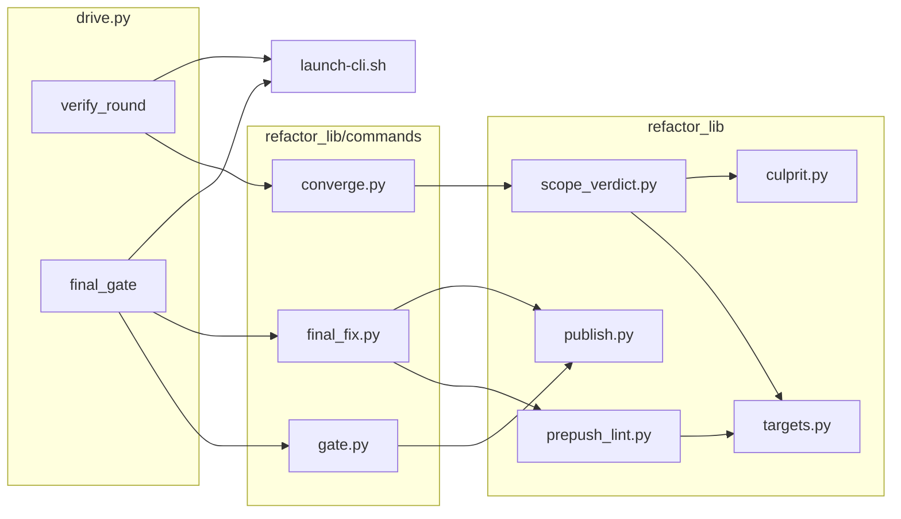
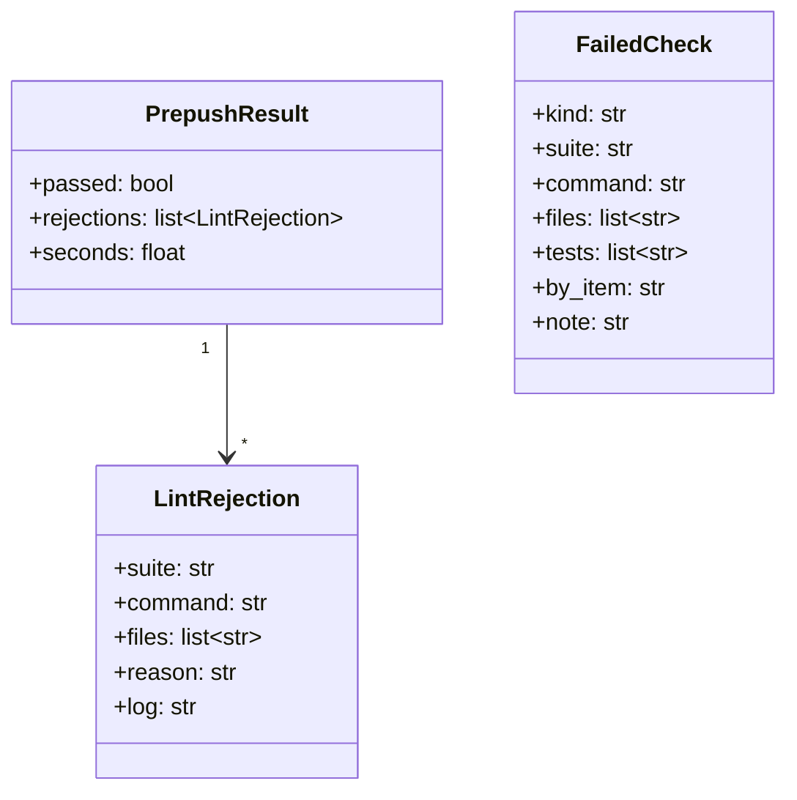
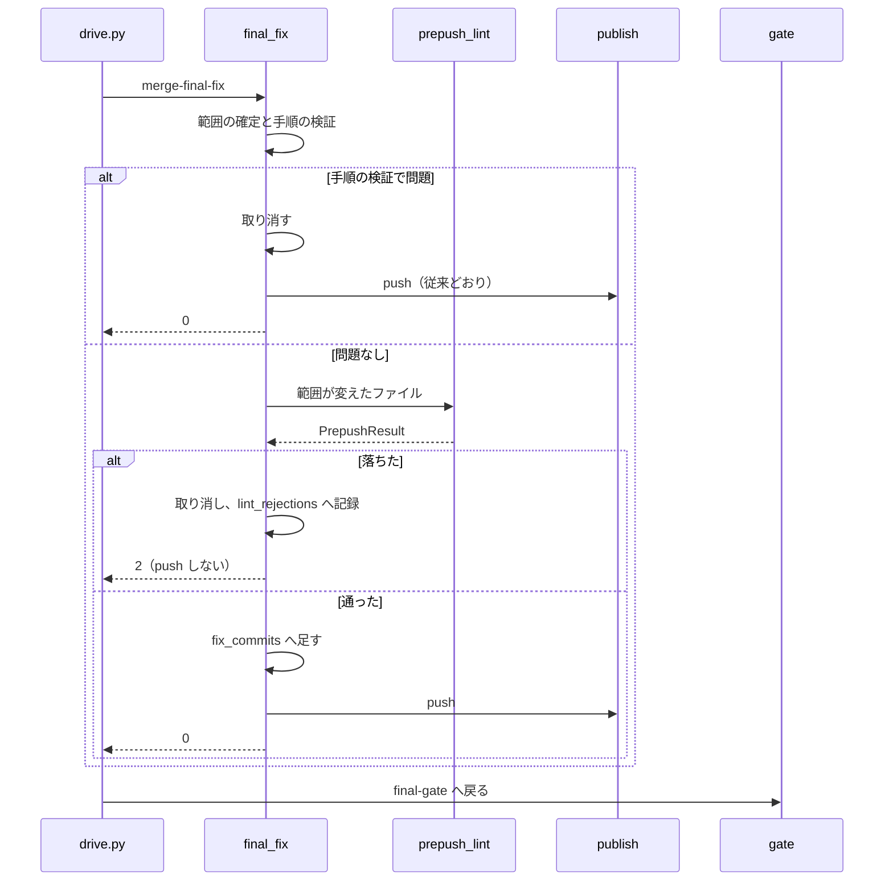
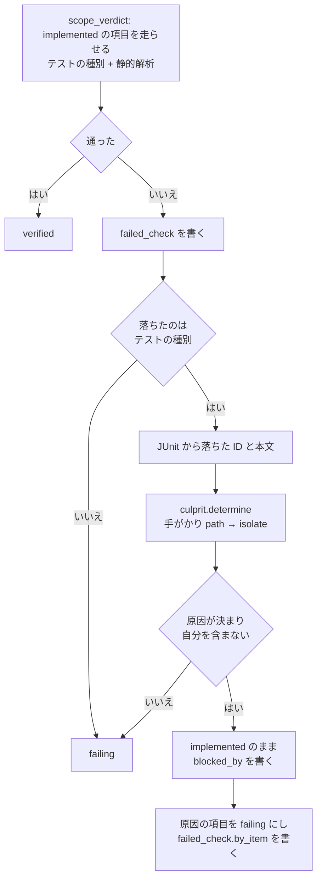
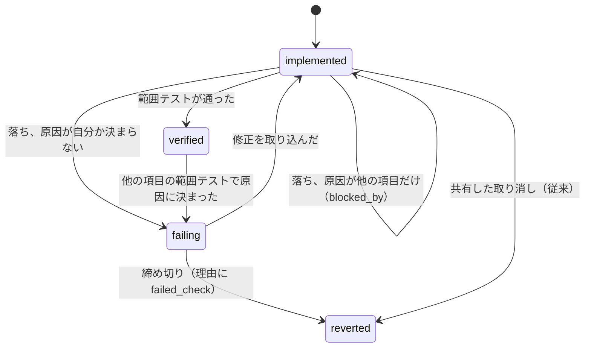

# cross-refactoring: 最終ゲート修正が静的解析を通らずに push されて push 前の検査で止まり、他の項目の違反で触っていない項目まで取り消される → 項目と最終ゲート修正の合否を変えたファイルで push より前に決め、違反は原因の項目へ帰す（#1693 #1688）

## 目的

- **何が壊れているか**: 最終ゲート修正のコミットは静的解析を通らないまま push され、push 前の検査で拒まれて実行が止まる（#1693）。項目の範囲テストに入ったリポジトリ全体を見るテストが別の項目の違反で落ち、触っていない項目が「時間の内に通らなかった」として取り消される（#1688）
- **誰が困るか**: cross-refactoring を回す conductor と、取り消しの理由から原因を読む Pull Request の読み手
- **直すと何が成り立つか**: 最終ゲート修正は push の前に、変えたファイルで静的解析を通る。他の項目の違反で落ちた項目は取り消されず、違反を入れた項目が suite とファイルを添えた理由で取り消される

## 適用範囲

- **働く範囲**: 配布先のリポジトリでも働く（cross-refactoring の `refactor.py` と駆動 `drive.py`）
- **プロジェクトごとに違うもの**: 静的解析の suite・テストの雛形・JUnit の置き場は宣言（`.ndf/project.json` の `test.suites`）で受ける。テストの名前・パスは読まない
- **当たるモード**: `standard`

## あるべき姿の根拠

| 根拠 | 種類 | 何を示すか |
| --- | --- | --- |
| スプリント m1523・PR 1564 の再発（#464 の本文の「再発」の節） | 実測 | 最終ゲート修正の整形の違反が push 前の検査で拒まれ、refactor が止まった |
| 実行 rf1673 の状態ファイル（`items[].failure_reason`・`test_targets`）と `verify-I-001.log` ほか | 実測 | 15 件中 6 件が `gate.py` の 509 行（I-014 が入れた）だけで落ち、触っていないのに取り消された |
| `gate.py` に 9 行足して `scripts/tests/test_check_script_structure.py` を走らせた JUnit（2026-10-03 に設計で実行） | 実測 | 落ちたテストの本文に `plugins/ndf/skills/cross-refactoring/scripts/refactor_lib/commands/gate.py: 509 行` が現れ、変えたファイルのパスで原因の項目を引ける |
| 同じ状態で `python3 scripts/check-script-structure.py <gate.py>` が終了コード 1 | 実測 | 違反を入れた項目は、自分の変えたファイルへ当てる静的解析の範囲テストで落ちる（前提 5） |
| 依頼の原文（#1693 の本文の「依頼（原文）」） | 利用者の指示の原文 | 2 つの課題を「項目の検証が push 前の検査と食い違う問題」として 1 本の設計で扱う |

要求と受け入れ条件は #1693 の本文にある（コピーは [issue-1693-requirements.md](issue-1693-requirements.md)）。この文書は「どう作るか」だけを扱う。

## 例: 実行 rf1673 を、変えた後の形で通すと

1. 項目 I-014 が `gate.py` を 509 行にし、I-001 が `scripts/check-script-structure.py` を変える。どちらも HEAD に積まれた状態で検証が始まる
2. I-014 の検証は、変えたファイル `gate.py` へ静的解析の suite `script-structure` を当てて落ちる。I-014 は `failing` になり、落ちた検査（suite `script-structure`・ファイル `gate.py`）が項目に残る
3. I-001 の範囲テスト `scripts/tests/test_check_script_structure.py` も落ちる。JUnit から落ちたテストの本文を読むと `gate.py` のパスが現れ、それを変えたのは I-014 である。I-001 は自分の失敗として数えず、`implemented` のまま「I-014 の失敗に巻き込まれた」と記録する
4. 修正は I-014 だけへ回る。締め切りまでに直らなければ I-014 を「静的解析 script-structure が gate.py で落ち、修正に使える時間の内に通らなかった」として取り消す
5. 取り消した後に I-001 を走らせ直すと通り、`verified` になる
6. 最終ゲートが落ち、最終ゲート修正が整形の違反を入れたとする。`merge-final-fix` は push の前に、修正のコミットが変えたファイルへ静的解析を当てて落とし、コミットを取り消して push せずに 2 で返す。次の最終ゲート修正の依頼には、落ちた suite とファイルが載る

## ドメインモデル

### コンテキスト

| コンテキスト | 何の語が 1 つの意味に決まるか |
| --- | --- |
| cross-refactoring の検証（`refactor_lib`） | 範囲テスト・原因の項目・巻き込まれた項目・最終ゲート修正・公開前の静的解析・公開した地点 |

テストの戦略（`plugins/ndf/scripts/lib/test_strategy.py`・`test_triage.py`・`failure_paths.py`）は共有カーネルとして使い、この変更では書き換えない。

### 集約

| 集約 | 持ち主（書き換えてよいもの） | 根 | エンティティ | 値オブジェクト |
| --- | --- | --- | --- | --- |
| 実行の状態（状態ファイル `cross-refactoring-rf<番号>-state.json`） | `refactor.py` のサブコマンド（`verify` / `final-gate` / `merge-final-fix`） | 実行（`id`） | 改善項目（`items[]`）・最終ゲートの記録（`final_gate`） | 落ちた検査（`failed_check`）・巻き込み（`blocked_by`）・公開前の静的解析の差し戻し（`final_gate.lint_rejections[]`）・戦略（`strategy`） |

### 不変条件

| # | 集約 | 条件 | 破れたときの扱い |
| --- | --- | --- | --- |
| I1 | 実行の状態 | 最終ゲート修正のコミットは、公開前の静的解析を通ったものだけが `final_gate.fix_commits` に入り、push される | 通らなければ取り消し、push せずに 2 で返す |
| I2 | 実行の状態 | 公開前の静的解析の対象は、修正のコミットが変えたファイルのうち suite の `paths` に当たるものだけである | — （組み方で守る） |
| I3 | 実行の状態 | 最終ゲートの入口の push が公開するのは、検証を通った項目のコミット・I1 を通った最終ゲート修正・取り消しのコミット・生成物の同期のコミットだけである | — （I1 と検証で守る。破る経路を足さない） |
| I4 | 改善項目 | 範囲テスト（テストの種別）が落ち、原因の項目が決まり、その中に自分が無い項目は `failing` にならず、取り消されない | 原因が決まらなければ自分の失敗として扱う（従来どおり） |
| I5 | 改善項目 | 巻き込まれた項目（`implemented` に `blocked_by` を持つ）が検証の 1 回を終えて残るのは、`blocked_by` の項目のどれかが `failing` のときだけである | 原因の項目が `failing` でなければ、同じ `verify` の中で走らせ直す |
| I6 | 改善項目 | 範囲テストで落ちて取り消した項目の理由には、落ちた検査（suite か落ちたテスト）とファイルが入る | 読めなければ従来の理由で取り消し、`failed_check` に読めなかった理由を残す |
| I7 | 実行の状態 | 宣言に静的解析の suite が無いとき、公開前の静的解析は何も走らせず、`merge-final-fix` の振る舞いは変わらない | — |

### ドメインイベント

| # | イベント | 発生元 | 受け手 |
| --- | --- | --- | --- |
| E3 | 項目の範囲テスト（テストの種別と静的解析）を走らせた | `verify` | 項目の判定 |
| E4 | 落ちた範囲テストの原因の項目を決めた（新規） | `verify`（`scope_verdict`） | 落ちた項目・原因の項目 |
| E5 | 項目を採った / 取り消した（理由に落ちた検査を残した） | `verify` | 報告・リファクタリング計画のコメント |
| E6 | 最終ゲートの入口で push した | `final-gate` | 継続的統合 |
| E7 | 最終ゲートが落ち、最終ゲート修正を依頼した（依頼に差し戻しの内容を載せる） | `final-gate` | 修正の CLI |
| E9 | 最終ゲート修正のコミットへ公開前の静的解析を当てた（新規） | `merge-final-fix`（`final_fix`） | 最終ゲートの記録 |
| E10 | 取り込んだ修正を push した | `merge-final-fix` | 継続的統合 |

E1・E2・E8 は要求の番号のまま変えない（計画・実装・修正のコミット）。

### 用語

| 用語 | 意味 | 用語集への反映 |
| --- | --- | --- |
| 原因の項目 | 全体テストか範囲テストで変更起因として落ちたテストを、その変更で落とした改善項目。危険フラグの有無とは関係しない | 意味の変更（範囲テストを足す） |
| 巻き込まれた項目 | 範囲テストが落ち、原因の項目が自分以外だけに決まった改善項目。取り消さず、原因が片づいてから走らせ直す | 追加 |
| 公開前の静的解析 | 最終ゲート修正の取り込みで、push の前に、修正のコミットが変えたファイルへ当てる静的解析の範囲テスト | 追加 |

## 機能一覧

| # | 機能 | 誰が使うか |
| --- | --- | --- |
| F1 | 最終ゲート修正を、push の前に静的解析の範囲テストで判定し、落ちたら取り消して差し戻す | `drive.py`（`merge-final-fix`） |
| F2 | 差し戻した違反を、次の最終ゲート修正の依頼へ載せる | 修正の CLI |
| F3 | 差し戻しの後の最終ゲートで、同じ HEAD の失敗の判定を使い回す | `drive.py`（`final-gate`） |
| F4 | 項目の範囲テストの失敗から原因の項目を決め、巻き込まれた項目を取り消さない | `drive.py`（`verify`） |
| F5 | 取り消しの理由と修正の依頼に、落ちた検査（suite・ファイル）を残す | Pull Request の読み手・修正の CLI |

## 構成要素

| 要素 | 変更 | 責務 |
| --- | --- | --- |
| `refactor_lib/commands/final_fix.py` | 新規（`gate.py` から移す） | `merge-final-fix` の本体。範囲の確定・コミットの検証・公開前の静的解析・取り込みか取り消し・push |
| `refactor_lib/commands/gate.py` | 変更 | `final-gate` だけを持つ。差し戻しの後の同じ HEAD では失敗の判定を使い回す（F3）。依頼の内容（`fix_request`）を書く |
| `refactor_lib/prepush_lint.py` | 新規 | 公開前の静的解析。ファイルの並びから静的解析の範囲テストを組んで走らせ、落ちた suite とファイルを値で返す。起動の失敗も値に載せ、止めるのは `final_fix`（`launch.stop`）である |
| `refactor_lib/targets.py` | 変更 | `lint_runs` を「ファイルの並びから組む」関数（`lint_runs_for`）と項目の薄い包みに分ける |
| `refactor_lib/scope_verdict.py` | 新規（`converge.py` の `_run_limited` を移す） | 項目の範囲テストを走らせ、落ちたら落ちた検査を記録し、テストの種別の失敗なら原因の項目を決める（F4） |
| `refactor_lib/commands/converge.py` | 変更 | `scope_verdict` を呼ぶ。`_give_up` の理由に落ちた検査を入れ、取り消しの後に巻き込まれた項目を走らせ直す |
| `refactor_lib/culprit.py` | 変更なし（呼ぶだけ） | 原因の項目を決める（`determine`）。全体テストと範囲テストの両方が使う |
| `scripts/launch-cli.sh` | 変更 | 修正の依頼の `ITEMS_JSON` に `failed_check` を、最終ゲート修正の依頼に `RF_FINAL_FIX_REQUEST` を渡す |
| `prompts/fix.md`・`prompts/final-fix.md` | 変更 | 落ちた検査と差し戻しの内容を読ませる節を足す |
| `scripts/drive.py` | 変更 | `merge-final-fix` の 2 を止めずに `final-gate` へ戻る |
| `scripts/refactor.py` | 変更 | `cmd_merge_final_fix` の import 元を `final_fix` へ移す |



`refactor.py` は `final_fix.py` を登録するだけで、`prompts/` は `launch-cli.sh` が読むため図から外す。

## 構造

パッケージの配置（変わる所だけ）:

```text
plugins/ndf/skills/cross-refactoring/
├── prompts/{fix.md, final-fix.md}          # 変更
└── scripts/
    ├── drive.py                             # 変更
    ├── launch-cli.sh                        # 変更
    ├── refactor.py                          # 変更（import 元）
    └── refactor_lib/
        ├── prepush_lint.py                  # 新規
        ├── scope_verdict.py                 # 新規
        ├── targets.py                       # 変更
        └── commands/
            ├── converge.py                  # 変更
            ├── final_fix.py                 # 新規（gate.py から移す）
            └── gate.py                      # 変更
```

`gate.py` は 500 行ちょうど、`converge.py` は 497 行で、どちらも行数の上限（`scripts/check-script-structure.py`）に余白が無い。足す処理は新しいモジュールに置き、`gate.py` からは `merge-final-fix` の一群（`_final_fix_scope` から `cmd_merge_final_fix` まで、約 200 行）を、`converge.py` からは `_run_limited` を移す。



`LintRejection` と `FailedCheck` は状態ファイルへ辞書で書く値オブジェクトで、`as_dict` で書き、読む側は辞書のまま読む（既存の `culprit.Verdict` と同じ形）。

## データ構造

状態ファイルへ足す欄（既存の欄は消さず、意味も変えない）。

| 置き場 | 欄 | 型 | 空のとき | 書く者 | 読む者 |
| --- | --- | --- | --- | --- | --- |
| `items[]` | `failed_check` | `FailedCheck` の辞書 | 欄が無い（通った・未検証） | `scope_verdict` | `converge._give_up`（理由）・`launch-cli.sh`（修正の依頼）・報告 |
| `items[]` | `blocked_by` | `{items: [ID], tests: [ID], basis: "path"\|"isolate"}` | 欄が無い | `scope_verdict` | `scope_verdict`（走らせ直し）・報告 |
| `final_gate` | `lint_rejections` | `[{round, at, commits: [sha], rejections: [LintRejection]}]` | 欄が無い | `final_fix` | `gate`（`fix_request`）・報告 |
| `final_gate` | `fix_request` | 文字列（Markdown） | 欄が無い（依頼に載せる内容が無い） | `gate._gate_failing` | `launch-cli.sh`（`RF_FINAL_FIX_REQUEST`） |
| `final_gate` | `last_failing` | `{head, detail}` | 欄が無い | `gate`（落ちたとき） | `gate`（F3 の使い回し） |

**`failed_check` は検証のたびに書き直す。** 通ったら消す（`whole_test_command` を範囲テストの結果で置き換えるのと同じ扱い）。`blocked_by` も走らせ直して自分の失敗か通過に決まったら消す。

`FailedCheck` の欄:

| 欄 | 中身 |
| --- | --- |
| `kind` | `lint` / `test` |
| `suite` | 落ちた範囲テストの suite の名前（`ScopeRun.suite`） |
| `command` | 落ちたコマンド（`run_commands` が返す最後のコマンド） |
| `files` | ログの本文に現れた、その項目が変えたファイル（`failure_paths.mentioned`）。1 つも現れなければ suite に渡したファイル |
| `tests` | テストの種別のとき、JUnit から読んだ落ちた ID |
| `by_item` | 他の項目の範囲テストで原因に決まったとき、その項目の ID |
| `note` | 落ちた検査を読めなかった理由（JUnit が無い・ログが無いなど） |

## 入出力の契約

### `refactor.py merge-final-fix <id>`

| 終了コード | 意味 | 出力 |
| --- | --- | --- |
| 0 | 取り込んだ（公開前の静的解析を通った）か、手順の検証で取り消した（従来どおり） | — |
| 2 | 取り込めなかった。範囲を確定できない・担当が結果を残さなかった（従来）、**または公開前の静的解析で落ちて取り消した**（新規） | 新規の場合 `FINAL_FIX=lint_rejected` |
| 4 | 止まった（静的解析の起動の失敗は `launch.stop` で 4） | — |

**静的解析で落ちたときは push を呼ばない。** 取り消した後の HEAD は `fix_base_sha`（最終ゲートが判定した、公開済みの地点）なので、公開しなくても Pull Request と食い違わない。手順の検証で取り消したとき（未申告・範囲外）の push は従来どおり残す。

順序: 範囲の確定 → 手順の検証（未申告・トレーラー・範囲） → **公開前の静的解析** → 取り込みか取り消し → push。手順の検証で取り消したときは静的解析を走らせない。

### `refactor.py final-gate <id>`

引数と終了コードは変わらない。HEAD が `final_gate.last_failing.head` と同じで、その後に取り消しも取り込みも無いときは、全体テストと静的解析を走らせずに前回の失敗の判定（`detail`）を使い、`checks` に `mode: reused` の行を足して修正の判定（`_final_fix_stop`）へ進む（F3）。

### 修正の依頼

| 変数・欄 | 手順 | 中身 |
| --- | --- | --- |
| `ITEMS_JSON[].failed_check` | `fix` | 項目の `failed_check` をそのまま渡す |
| `RF_FINAL_FIX_REQUEST` | `final-fix` | `final_gate.fix_request`。直前の最終ゲートで落ちた検査（`lint` の変更起因の suite とコマンド・テストの見分け）と、直前の差し戻し（`lint_rejections` の最後の 1 件の suite・コマンド・ファイル）。無ければ空 |

### `drive.py`

`final_gate()` は `merge-final-fix` を `ok=(0, 2)` で呼び、どちらでも `final-gate` へ戻る（終了コード 4 は従来どおり止まる）。

## 処理の流れ

### 最終ゲート修正の取り込み（#1693）



`final-gate` へ戻ったとき、取り消しで HEAD が `last_failing.head` に戻っていれば F3 で判定を使い回し、締め切りの内なら次の修正の依頼（`fix_request` に差し戻しの内容）を出す。締め切りを過ぎていれば従来どおり打ち切る。

### 項目の範囲テストの判定（#1688）



1 回の `verify` の中の順序:

1. `scope_verdict.run(implemented の項目)`（上の図）
2. 巻き込まれた項目のうち、`blocked_by` の項目が 1 つも `failing` でないものを、もう一度 1 から走らせる（I5。原因の項目が同じ回で通ったとき）
3. `_give_up`: 締め切りなら `failing` の項目を取り消す。理由は `failed_check` から作る（「静的解析 script-structure が gate.py で落ち、修正に使える時間の内に通らなかった」）。`failed_check` が無い・読めないときは従来の理由
4. `_give_up` で取り消したら、巻き込まれた項目を 1 から走らせ直す。取り消しが無くなるまで繰り返す（取り消すたびに項目が減るため有限で終わる）
5. `failing` が残れば修正へ回す（`VERIFY=fix`）。巻き込まれた項目は修正へ回さず、次の `verify` で走らせ直す

図に出ない要素: `converge.py`（この順序を回す）・`targets.py`（範囲テストを組む）・`launch-cli.sh` と `prompts/`（修正の起動で依頼文を組む）・`refactor.py`（登録だけ）。

**項目の検証は HEAD で全項目のコミットを積んだまま走らせる。** このため、項目を検証する順序は結果に効かない（未決 3）。原因の判定も同じ HEAD で行う。

### 項目の状態



`verified → failing` は新しい遷移である。検証を通った項目が、他の項目のテストを落とした原因に決まったときだけ起きる。

## 非機能の実現方式

| 大項目 | 条件 | 実現方式 |
| --- | --- | --- |
| 性能・拡張性 | 公開前の静的解析はテスト 1 回の上限の内 | `targets.run_commands` へ `timeline.state_test_timeout(state)` を渡す。上限を超えたら `TIMED_OUT` で落ちた扱い（`LintRejection.reason` に打ち切りを書く） |
| 性能・拡張性 | 原因の判定の走らせ直しは修正の締め切りを延ばさない | `culprit.determine` へ `culprit.fix_deadline(state)` を渡す（全体テストと同じ締め切り）。過ぎていれば手がかり `isolate` を試さず、決まらなければ自分の失敗として扱う |
| 性能・拡張性 | 差し戻しの後に全体テストを走らせ直さない | F3 の使い回し。同じ HEAD の判定は変わらないため走らせない |
| 運用・保守性 | 状態ファイルだけで原因と違反のファイルを読める | `items[].failed_check`・`blocked_by`・`final_gate.lint_rejections` に suite・コマンド・ファイル・原因の項目を書く。報告（`report`）は取り消しの理由の行にそのまま出す |

## 決定の記録

### 決定 1: 項目の合否を変えたファイルで決めるため、#1688 は範囲テストの対象を選ぶ側でなく、落ちた失敗を原因の項目へ帰す側で直す

全体を見るテストを `test_targets` から外す（`valid_targets` で弾く）には、全体を見るテストを走らせる前に見分ける必要があり、名前かパスで見分けるしかない（前提 4・AC10 に反する）。全体を見るテストは、項目をまたいだ本当の壊れも拾う。外すと、その壊れが最終ゲートまで見えなくなる。落ちた後に、全体テストの原因の判定（#1649 の `culprit.determine`）を範囲テストにも当てれば、テストの名前を読まずに、本文に現れた変えたファイル（手がかり `path`）と外して走らせ直す結果（手がかり `isolate`）で原因を決められる。

テストの側（`test_repository_matches_its_allow_list`）を項目のファイルへ絞る案は、同じ形の全体テストが他に入れば同じことが起きるため採らない（要求の「含まない」）。

根拠: Value 5 / Value 6（MVV 版 2）

### 決定 2: 原因が他の項目だけに決まった項目は、取り消さず `implemented` のまま待たせる

`verified` にすると、原因の項目が直らずに取り消されたとき、待っていた項目の失敗が自分のものに変わっていても検証されないまま公開される。`failing` にすると修正へ回り、直せない失敗のために修正担当が起動され、締め切りで取り消される（#1688 の現象そのもの）。`implemented` は「まだ検証が済んでいない」という既存の意味のまま使え、状態の値を足さずに済む。待つ理由は `blocked_by` に残す。

原因が決まらない（`undetermined`）・自分を含む・JUnit を読めないときは、従来どおり自分の失敗として扱う。判定の誤りで本当に壊した項目を逃がすより、従来の取り消しへ倒す方が害が小さい。

根拠: Value 1 / Value 7（MVV 版 2）

### 決定 3: 原因の判定は落ちた範囲テストがテストの種別のときだけ行う

静的解析の範囲テストは、その項目が変えたファイルだけから組む（`lint_runs`）。落ちたなら違反は自分のファイルにあり、他の項目の違反では落ちない（AC5 と同じ理由）。テストの種別は `test_targets` で選ぶため、全体を見るテストが入りうる。判定の手間（JUnit の読み取り・走らせ直し）を、他の項目の違反が入りうる側にだけ掛ける。

根拠: Value 3（MVV 版 2）

### 決定 4: 最終ゲート修正が静的解析で落ちたら、同じ試行で直させずに取り消して次の修正へ差し戻す（未決 4）

同じ試行の中で直させるには、取り込みの途中で修正の CLI をもう一度起動する経路が要り、起動と締め切りの管理（`_final_fix_stop`・`final_fix_timeout`）を `merge-final-fix` に重ねて持つことになる。差し戻せば、修正の回数と締め切りは既存の最終ゲートの判定がそのまま決める。差し戻しの内容は `fix_request` で次の依頼に載せ、CLI が同じ違反を繰り返さないようにする。

根拠: Value 4 / Value 6（MVV 版 2）

### 決定 5: 差し戻しの後の最終ゲートは、同じ HEAD の失敗の判定を使い回す

差し戻しで HEAD は前回の判定の地点へ戻るため、全体テストを走らせ直しても判定は変わらない（手元の全体テストは実測 424 秒。`.ndf/project.json` の `test_duration`）。走らせ直すと、最終ゲート修正に取ってある時間（`plan.reserve.final_fix`）を判定だけで使い切る。使い回すのは「HEAD が同じで、その後に取り込みも取り消しも無い」ときだけで、検証の中の全体テストの使い回し（`_reusable_whole_test`）と同じ条件の立て方にする。

根拠: Value 3（MVV 版 2）

### 決定 6: 最終ゲートの入口の push には検査を足さず、公開しうるコミットを作る経路で守る（AC6）

入口の push の前に公開した地点から HEAD までへ静的解析を当てる案は、落ちたときに戻す先が無い（項目は検証済み、最終ゲート修正は I1 で検査済み）。HEAD へ未検証のコミットを積む経路は、改善項目（検証の静的解析の範囲テスト）・最終ゲート修正（F1）・取り消しのコミット・生成物の同期の 4 つで、前の 2 つを検査すれば、入口の push は検証を通ったものしか公開しない（I3）。取り消しと同期のコミットは「未確認のまま残ること」に置く。

根拠: Value 6（MVV 版 2）

### 決定 7: 公開前の静的解析と項目の静的解析を同じ組み方にする

`targets.lint_runs` を、ファイルの並びから組む `lint_runs_for(state, files)` と項目の包みに分け、最終ゲート修正も同じ関数で組む。`round-only` の扱い（ラウンドテストが静的解析の全体を兼ねるなら組まない）も同じになり、項目と最終ゲート修正で基準が食い違わない（`verify_commit_basics` を両方で共有するのと同じ理由）。

根拠: Value 6（MVV 版 2）

### 決定 8: 実装は #1693 の 1 本に寄せ、#1688 は取り込む

2 つは同じ部品を触る。落ちた検査の記録の形（項目の `failed_check` と最終ゲート修正の `LintRejection` は、suite・コマンド・ファイルという同じ欄を持つ）、それを修正の依頼へ渡す `launch-cli.sh` と `prompts/`、行数の上限の余白が無いため処理を移す `gate.py`（#1693）と `converge.py`（#1688）である。分けると、記録の形と依頼の渡し方を片方が先に決め、もう片方がそれに合わせて直すことになる。1 本なら、項目と最終ゲート修正の合否を同じ原則（変えたファイルで、push より前に）で 1 度に揃えられる。

根拠: Value 6 / Value 7（MVV 版 2）

### 決定 9: 未決 1 は「宣言をメインディレクトリから読んだ」と結論し、直すのは範囲外の課題（#1709）に回す

実行 rf1673 の状態ファイルの `strategy.suites` は `pytest` の 1 本だけだった。着手の地点 `f85a64fe` の宣言には `script-structure` があるが、`init` が読む `project_decl.read_project_decl` はメインディレクトリ（当時 `develop` の `4ed8982d`。静的解析の suite は 0 本）を先に読む。このため I-014 の検証で静的解析の範囲テストが組まれなかった。今の宣言と今のコードでは、`gate.py` を 509 行にした項目は自分の検証で落ちる（「あるべき姿の根拠」の 4 行目）。読む順序は `project_decl` を使うすべての Skill の契約に関わるため、この設計では直さない。#1688 の現象は、静的解析が組まれた場合でも全体を見るテストの側で起きるため、決定 1 の直しは #1709 と独立に要る。

根拠: Value 6（MVV 版 2）

## テスト設計

| 受け入れ条件・不変条件 | どの振る舞いで縛るか | どう壊したら落ちるべきか |
| --- | --- | --- |
| AC1・I1 | 静的解析の suite を持つ一時リポジトリで、最終ゲート修正が行数の上限を超えるファイルを作ったとき `merge-final-fix` が 2 で終わり、push が 1 回も呼ばれず、HEAD が `fix_base_sha` に戻る | 公開前の静的解析を呼ばない・落ちても `fix_commits` へ足す・取り消した後に push する |
| AC2 | AC1 の後、`final_gate.lint_rejections` に suite の名前と違反のファイルが残り、次の `final-gate` が書く `fix_request` にその suite とファイルが入る | 記録しない・`fix_request` を作らない・`launch-cli.sh` が `RF_FINAL_FIX_REQUEST` を渡さない |
| AC3 | 静的解析を通る最終ゲート修正は `fix_commits` へ入り、push される（従来どおり） | 通っても取り消す・push しない |
| AC4 | AC1〜AC3 を、戦略 `local-full`・`local-scoped-ci-whole`・`--ci-check` と、単独・工程の 1 つの起動で同じ結果になることを、パラメータで回す | 戦略か起動のされ方で公開前の静的解析を飛ばす |
| AC5・I2 | 修正が触っていないファイルに既存の違反がある一時リポジトリで、修正が通る | 範囲を修正の変えたファイルでなく全体にする |
| AC6・I3 | 差し戻しの後の `final-gate` の入口で、公開した地点が動かない（差し戻したコミットが公開されない） | 差し戻しの前に push する・入口で取り消し前の HEAD を公開する |
| F3 | 差し戻しの後の `final-gate` で全体テストのコマンドが走らず、`checks` に `reused` が残る。HEAD が進んでいれば走る | 使い回さない・HEAD が進んでも使い回す |
| AC7・I4 | 一時リポジトリで、項目 X が上限ちょうどのファイルへ行を足し、項目 Y がリポジトリ全体の行数を見るテストを `test_targets` に持つ。Y は取り消されず、`blocked_by` に X が残る | 原因の判定を呼ばない・原因に自分が無くても `failing` にする |
| AC8・I6 | AC7 で X は自分の静的解析の範囲テストで落ち、締め切りで取り消したときの理由に suite と X のファイルが入り、「範囲テストが修正に使える時間の内に通らなかった」だけにならない | 理由を従来の文のままにする・`failed_check` を書かない |
| AC9 | Y の範囲テストが Y の変えたファイルの壊れで落ちたとき（本文に Y のファイルが現れる）、Y は `failing` になる。原因が `undetermined` のときも `failing` になる | 原因が決まらないときに取り消しを避ける・自分を含むのに待たせる |
| AC10 | AC7 の全体を見るテストを、別の名前とパスのテスト（例: 全ファイルの行数を数える自作のテスト）に替えても同じ結果になる | 判定にテストの名前・パスを使う |
| I5 | 原因の項目が同じ `verify` で取り消されると、巻き込まれた項目が走らせ直されて `verified` になる。原因の項目が `failing` のままなら `implemented` で残り、修正へ回らない | 走らせ直さない・巻き込まれた項目を修正へ回す |
| I7・AC12 | 静的解析の suite が無い宣言で、`merge-final-fix` の push の回数・終了コード・状態ファイルが変更前と同じ | suite が無いのに何かを走らせる・終了コードを変える |
| AC11 | `uv run --frozen --project . --all-extras pytest plugins/ndf/skills/cross-refactoring/tests -q -n 4` がすべて通る | 既存の振る舞いを壊す |

`gate.py` から `final_fix.py` へ移した関数を import している既存のテスト（`test_final_gate.py` ほか）は import 元を直す。`.md` の文言を照合するテストは書かない（`prompts/` の節はテストで固定しない）。

## 設計の結果

| 課題 | 扱い | 取り込み先 | 触るファイル |
| --- | --- | --- | --- |
| #1693 | 実装する | — | `plugins/ndf/skills/cross-refactoring/scripts/refactor_lib/`、`plugins/ndf/skills/cross-refactoring/scripts/drive.py`、`plugins/ndf/skills/cross-refactoring/scripts/refactor.py`、`plugins/ndf/skills/cross-refactoring/scripts/launch-cli.sh`、`plugins/ndf/skills/cross-refactoring/prompts/`、`plugins/ndf/skills/cross-refactoring/tests/`、`docs/glossary/glossary.json`、`docs/glossary.md` |
| #1688 | 取り込む | #1693 | — |

## 未確認のまま残ること

| 項目 | 内容 |
| --- | --- |
| 取り消しのコミットの静的解析 | `_give_up`・`_revert_shared` の取り消しのコミットは静的解析を通さずに公開される。古い内容へ戻すだけで新しい違反は入りにくいが、後の項目が同じファイルを変えていると戻した結果が違反になりうる。実装の後のスプリントで実行の記録を見て決める |
| 生成物の同期のコミット | `publish.push_head` の `_sync_generated` が push の直前に作るコミットは静的解析を通らない。push が拒まれたときの記録は #1648 が扱う |
| 手がかり `path` の誤り | 落ちたテストの本文に、原因でない項目のファイルのパスが現れると、その項目を原因に決める。巻き込まれた側は原因に自分が無いときだけ待つため、誤って待たせることはないが、無実の項目が `failing` になりうる。次に cross-refactoring を回すスプリントの実行の記録（`failed_check.by_item`）で確かめる |
| 宣言の読み込み | 実行 rf1673 で静的解析の suite が戦略に入らなかった原因（メインディレクトリの宣言を読んだ）は #1709 が直す。直るまでは、Pull Request が宣言を変えた実行では、項目の静的解析の範囲テストが組まれないことがある |
| 原因の判定の時間 | 範囲テストの失敗ごとに手がかり `isolate` の走らせ直しが増える。上限は修正の締め切りだが、実際の秒数は実装の後のスプリントで `culprit` の `seconds` を数えて確かめる |
