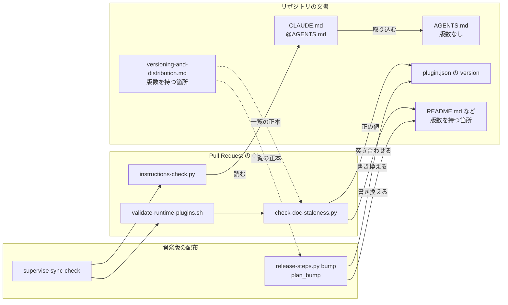
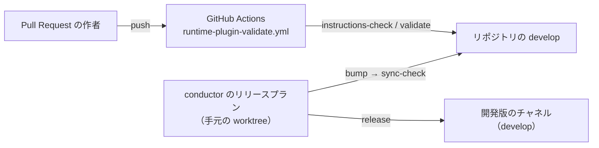
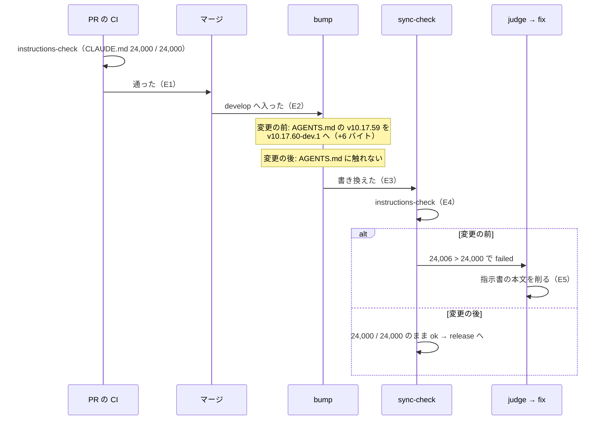

# 開発版の版数の接尾辞で AGENTS.md が伸び、PR の CI で通った指示書の読み込み量が開発版の配布で上限を超えて止まる → 配布は指示書を書き換えず、PR の CI で通った量のまま配布を通る（#1739）

## 目的

- **何が壊れているか**: `AGENTS.md` の本文が ndf の版数（「主要プラグインです（v10.17.63）」）を持ち、開発版の配布の `bump` がそれを `-dev.<連番>` 付きへ書き換えて読み込み量を伸ばす。Pull Request の CI で上限ちょうどだった `CLAUDE.md` が、配布の `sync-check` で初めて上限を超える
- **誰が困るか**: 開発版を配る conductor と、承認なしに指示書の本文を削られる作者（スプリント m1385 で 1 行削られた）
- **直すと何が成り立つか**: 開発版の配布は指示書を 1 バイトも書き換えない。Pull Request の CI の判定が、そのまま配布の時点の判定になる

## 適用範囲

- **働く範囲**: このリポジトリ（ai-plugins）。`AGENTS.md` の版数と、それを書き換える `release-steps.py bump` の ndf 固有の分岐と、突き合わせる `scripts/check-doc-staleness.py` を変える。`instructions-check.py` と `.ndf/instructions.json` は変えないため、配布先のリポジトリの判定は変わらない。配布先へは `release` の `references/instruction-files.md` の手引きとして届く
- **プロジェクトごとに違うもの**: 無し（ai-plugins に固有の版数の行を消すだけで、設定も引数も足さない）
- **当たるモード**: `standard`

## あるべき姿の根拠

| 根拠 | 種類 | 何を示すか |
| --- | --- | --- |
| `13dffa70` で `CLAUDE.md` 24,000 バイト（上限ちょうど）→ `44de5b4d`（`v10.17.59` → `v10.17.60-dev.1`）で 24,006 バイトになり `read-size-budget` で落ちた（#1739 の本文） | 実測 | 指示書を伸ばしたのは配布の `bump` の 1 行だけである |
| `.ndf/supervise.json` の開発版の配布は `bump` → `changelog` → 説明文 → `sync-check` の順で、`changelog` と説明文が書くのは `CHANGELOG.md` と `plugins/ndf/README.md` だけ（`supervise_lib/release_templates.py` の `plan_release_package_plugin`・`release-steps.py` の `cmd_changelog` / `cmd_notes`） | 実測（コードの読み取り） | PR の CI と `sync-check` の間で指示書を書き換えるのは `plan_bump` の `AGENTS.md` の行だけである |
| `AGENTS.md` の「版と配布の方針」: 「版を決めるのは `plugins/<名前>/.claude-plugin/plugin.json` の `version` だけである」 | 利用者の指示の原文 | 版数の正本は `plugin.json` にあり、`AGENTS.md` の版数は写しである |
| 2026-10-06 の手元で `instructions-check.py --root . --report` が `CLAUDE.md 23,985 バイト`・`AGENTS.md 15,663 バイト`、`（v10.17.63）` は 15 バイト | 実測 | 外した後の `CLAUDE.md` は 23,970 バイト前後になり、上限の値を変えずに通る |

要求と受け入れ条件は #1739 の本文にある（コピーは `issues/issue-1739-requirements.md`）。この文書は「どう作るか」だけを扱う。

## ドメインモデル

### コンテキスト

| コンテキスト | 何の語が 1 つの意味に決まるか |
| --- | --- |
| リリース（`ndf-release`） | 版数・版数を持つ箇所・`bump` が書き換える範囲 |
| 指示書チェック（`ndf-instructions`） | 指示書・ルート指示書・読み込み量・上限 |
| このリポジトリの開発の検査（`repo-dev-checks`） | 説明文書の版数の突き合わせ（`check-doc-staleness.py`） |

リリースが供給者、指示書チェックが顧客の関係（顧客 / 供給者）。指示書チェックの要求「Pull Request の後で読み込み量を変えない」を、リリースが `bump` の書き換える範囲から指示書を外すことで受ける。開発の検査はリリースの「版数を持つ箇所の一覧」に順応者として従い、一覧から外れた箇所を突き合わせない。

### 集約

| 集約 | 持ち主（書き換えてよいもの） | 根 | エンティティ | 値オブジェクト |
| --- | --- | --- | --- | --- |
| 指示書の集合 | Pull Request の作者だけ。配布の工程（`bump`・`changelog`・説明文・`sync-check` の同期）は書き換えない | ルート指示書（`CLAUDE.md` など） | 取り込み先（`@AGENTS.md`） | 読み込み量・上限（`budget.bytes`） |
| 版数を持つ箇所の一覧 | `docs/versioning-and-distribution.md` の「版数を持つ箇所」（正本）。`plan_bump` と `check-doc-staleness.py` は正本に合わせて変える | 一覧 | 箇所（ファイルと位置を決める語） | 版数 |

### 不変条件

| # | 集約 | 条件 | 破れたときの扱い |
| --- | --- | --- | --- |
| I1 | 指示書の集合 | 開発版の `bump` の前と後で、宣言した指示書（`.ndf/instructions.json` の `files` と取り込み先）の内容が 1 バイトも変わらない。したがって読み込み量の判定は `bump` の前後で同じになる | 全体テストが落ち、Pull Request が赤になる（配布の時点まで持ち越さない） |
| I2 | 版数を持つ箇所の一覧 | 正本の一覧・`plan_bump` が書き換える箇所・検査が突き合わせる箇所が同じ集合である。検査が突き合わせる箇所は、`validate-runtime-plugins.sh` が束ねる 2 つの検査の和集合を指す（定義ファイルの `version`・`description` と `marketplace.json` は `scripts/lib/validate_manifests.py`、説明文書は `check-doc-staleness.py`）。`check-doc-staleness.py` へ定義ファイルの照合を足さない。`AGENTS.md` は 3 つのどれにも無い | `validate-runtime-plugins.sh`（どちらかの検査）か全体テストが落ちる |
| I3 | 指示書の集合 | 版数と無関係に上限を超えた指示書は、これまでどおり `read-size-budget` で終了コード 1 になる | 全体テストが落ちる |

### ドメインイベント

| # | イベント | 発生元 | 受け手 |
| --- | --- | --- | --- |
| E1 | Pull Request の CI が指示書の検査を通した | `runtime-plugin-validate.yml` | マージの判断（人か `merge-when-green`） |
| E2 | Pull Request を `develop` へマージした | 人か `merge-when-green` | 開発版のリリースプラン |
| E3 | 開発版の配布の `bump` が版数を `-dev.<連番>` 付きへ書き換えた（指示書は書き換えない） | `release-steps.py bump` | `sync-check` |
| E4 | 配布の `sync-check` が指示書の検査を走らせた（E1 と同じ本文に掛かる） | `supervise-sync-check` | リリースプランの次のステップ（`release`）。落ちたときだけ judge → fix |
| E5 | 配布の修正が指示書の本文を削った | — | この変更の後は起きない（I1 により E4 が読み込み量で落ちない） |
| E6 | 正式版の配布で接尾辞を外した | `release-steps.py bump`（正式版） | `sync-check` |

### 用語

| 用語 | 意味 | 用語集への反映 |
| --- | --- | --- |
| 指示書 | エージェントが読む規約の文書 | なし（既存の意味のまま） |
| 読み込み量 | ルート指示書と、そこから @ でたどった先の合計バイト数 | なし（既存の意味のまま） |
| 開発版 | ベースブランチ（develop）に載るチャネルと、そこへ出す接尾辞付きの版 | なし（既存の意味のまま） |

## 機能一覧

| # | 機能 | 誰が使うか |
| --- | --- | --- |
| F1 | 開発版の版数を上げる（指示書に触れずに上げる） | 開発版を配る conductor（`release-steps.py bump`） |
| F2 | 説明文書の版数を `plugin.json` と突き合わせる（`AGENTS.md` を対象から外す） | Pull Request の作者と CI（`check-doc-staleness.py`・`validate-runtime-plugins.sh`） |
| F3 | 版数を持つ箇所を正本で引く | 版を上げる人・`bump` の対象を変える人（`docs/versioning-and-distribution.md`） |
| F4 | 指示書に配布で書き換わる値を置かないと知る | NDF を使うリポジトリの作者（`release` の `references/instruction-files.md`） |

## 構成要素

| 要素 | 責務 | この変更で変えること |
| --- | --- | --- |
| `AGENTS.md` の「NDFプラグインについて」と文書の表 | 主要プラグインの紹介。版数は持たない | 「主要プラグインです（v10.17.63）。」を「主要プラグインです。」にする。文書の表の「版数を持つ 15 箇所」を「版数を持つ箇所」にする |
| `release-steps.py` の `plan_bump` | ndf の版数を持つ箇所を集める | `AGENTS.md` の版の行を集めない |
| `scripts/check-doc-staleness.py` | 説明文書の版数を `plugin.json` と突き合わせる | `POINT_VERSION_SPECS` からチェック I（`AGENTS.md`）を外し、`AGENTS.md` を読まない。冒頭の説明の対象文書と種類の数を直す |
| `docs/versioning-and-distribution.md` の「版数を持つ箇所」 | 版数を持つ箇所の正本 | `AGENTS.md` の行を外す。見出しと本文から箇所の総数を外し、内訳の数（定義ファイル 8・説明文書 6）だけを表の直前に書く |
| 版数を持つ箇所を数で指す文書 | 正本を指す | `docs/plugin-development-guide.md`・`docs/specifications/doc-consistency-checks.md`・`docs/specifications/ndf-knowledge-and-kiro.md` の「15 箇所」とチェック I の記述を、数を持たない指し方と `AGENTS.md` に版数を置かない規約へ直す |
| `release` の `references/instruction-files.md` | 指示書チェックの設定と直し方の手引き | 「読み込み量」の節に「配布で書き換わる値（版数など）を指示書に置かない」を 1 項足す |
| 全体テスト（`plugins/ndf/scripts/tests/`・`scripts/tests/`） | I1〜I3 と受け入れ条件を縛る | `bump` → 指示書チェックの実行テストを足し、チェック I を前提にした `check-doc-staleness` のテストの部品を直す |

変えないもの: `instructions-check.py` と `instructions_lib/`、`.ndf/instructions.json`、`.github/workflows/runtime-plugin-validate.yml`、`scripts/validate-runtime-plugins.sh`（`check-doc-staleness.py` を呼ぶだけで、版数の箇所を持たない）、`plugins/ndf/scripts/experimental/hook-trial/ht_bump.py`（決定 5）。

### 構成要素図



`bump` から `AGENTS.md` への辺が無いことが、この変更の中心である。図に含めないもの: 正本を数で指す文書・`instruction-files.md`・全体テスト（実行の流れの中で読み書きされない）。

### 文脈と配置



| 実行の単位 | どこで動くか | 境界をまたぐもの |
| --- | --- | --- |
| Pull Request の CI | GitHub Actions の runner | リポジトリの本文（指示書を含む） |
| 開発版の配布 | conductor の手元の配布用 worktree（`release/v<版>`） | `bump` が書き換えたファイル。指示書は含まない |

### 置き場所

```text
AGENTS.md                                         # 版数の行と文書の表を直す
docs/
├── versioning-and-distribution.md                # 版数を持つ箇所の正本
├── plugin-development-guide.md                   # 「15 箇所」の指し方
└── specifications/
    ├── doc-consistency-checks.md                 # チェック I の記述
    └── ndf-knowledge-and-kiro.md                 # AGENTS.md に版数を置かない規約
plugins/ndf/
├── scripts/
│   ├── release-steps.py                          # plan_bump
│   └── tests/test_release_steps.py               # bump → 指示書チェックの実行テスト（または同じ層の新しいファイル）
└── skills/release/references/instruction-files.md
scripts/
├── check-doc-staleness.py                        # チェック I を外す
└── tests/
    ├── doc_staleness_helpers.py                  # 部品の AGENTS.md と正本の見出し
    └── test_doc_staleness.py                     # チェック I を前提にした行
```

検査の手段: `python3 scripts/check-doc-staleness.py --root .`・`bash scripts/validate-runtime-plugins.sh`・`python3 plugins/ndf/scripts/instructions-check.py --root .`・全体テスト。

## 処理の流れ

変更の前と後の、Pull Request から開発版の配布までの流れ。



`check-doc-staleness.py` の流れは、`AGENTS.md` を読む分岐（`read_document(root, AGENTS_MD, ...)` と `check_point_versions(AGENTS_MD, ...)`）が無くなるだけで、ほかの文書の順序は変わらない。

## 非機能の実現方式

| 大項目 | 要求の条件 | 実現方式 | 確かめ方 |
| --- | --- | --- | --- |
| 運用・保守性 | 開発版の配布が、指示書の読み込み量を理由に judge → fix へ回らない（受け入れ条件 1 が成り立てば満たす） | `bump` が指示書を書き換えないため、`sync-check` の指示書の検査は PR の CI と同じ本文に掛かる（I1） | 全体テストの `bump` → 指示書チェックの実行テスト。リリース後に `~/.local/state/ndf/sv/<スプリント>/…/04-sync.out` の `instructions` が ok であること |
| 移行性 | 利用者のリポジトリの `.ndf/instructions.json` を書き換えなくても、変更の前と同じ判定で動く（受け入れ条件 4）。宣言に項目を足すなら、無いときの既定は変更の前の振る舞いと同じにする | `instructions-check.py`・`instructions_lib/`・宣言のスキーマを変えない。宣言に項目を足さない | 既存の指示書チェックのテスト（宣言なし・`budget` なし）が変更なしで通る |

## 決定の記録

### 決定 1: 配布で指示書が伸びないようにするため、`AGENTS.md` から版数を外し、`bump` とチェックの対象から同時に外す

読み込み量を伸ばしたのは `bump` が `AGENTS.md` の版数を書き換える 1 行だけで、版数の正本は `plugin.json` の `version` にある。写しを消せば、配布の工程は指示書に触れず、PR の CI の判定がそのまま配布の時点の判定になる。正本を 1 か所にする規約にも合い、`AGENTS.md` の内容が版ごとに変わらなくなる。

採らなかった案。検査の上限から版数の分を除く案は、ai-plugins に固有の版数の行の形を `.ndf/` に宣言させる必要があり、実際に読み込まれるバイトを数えから外すことになる。PR の CI で接尾辞を当てた後の量を検査する案は、指示書チェックが `bump` の書き換える箇所を知る必要があり、写しが残ったまま 2 つのコンテキストを結び付ける。上限の値を上げる案は前提 3 で除かれている。

根拠: Value 6 / Value 7 / Value 1（MVV 版 2）

### 決定 2: 版数が再び指示書へ戻らないよう、「`bump` は指示書を書き換えない」を実行テストで縛り、`bump` の中には判定を足さない

I1 は、ai-plugins の形のリポジトリで `bump` を走らせ、宣言した指示書の内容が変わらないことと、上限ちょうどの指示書が `bump` の後も `read-size-budget` を出さないことを見るテストで縛る。`plan_bump` へ `AGENTS.md` の行を戻せば落ちる。

`bump` の中で「書き換える先が宣言した指示書なら止める」判定を持つ案は採らない。`bump` の共通の部分が書くのは `plugin.json`・`marketplace.json`・`README.md`・プラグインの README で、既定の指示書（`AGENTS.md` / `CLAUDE.md` / `KIRO.md`）に当たる経路が無く、判定は ndf の分岐のためだけのコードになる。

根拠: Value 6 / Value 3（MVV 版 2）

### 決定 3: 箇所を足し引きするたびに数を直さずに済むよう、正本の見出しと指す側から箇所の総数を外す

「版数を持つ 15 箇所」は、正本の見出しと本文・指す側の 3 文書・`AGENTS.md` の表の 5 ファイルに数を写しており、1 箇所減らすだけで 5 ファイルの数を直すことになる。見出しを「版数を持つ箇所」にし、総数は書かず、内訳の数（定義ファイル 8・説明文書 6）を表の直前にだけ置く。表の行を数えれば決まる値で、表と隣り合う。

「14 箇所」へ書き換える案は、次に箇所を変えたときに同じ書き換えが要るため採らない。

根拠: Value 7（MVV 版 2）

### 決定 4: NDF を使うほかのリポジトリでも同じ現象を避けられるよう、指示書チェックの手引きに「配布で書き換わる値を指示書に置かない」を足し、検査は変えない

ほかのリポジトリで同じ現象が起きるのは、利用者が自分の配布の手順で指示書の値を書き換えるときである。何が配布で書き換わる値かはリポジトリごとに違い、指示書チェックが既定で見分ける手段が無い。直し方の手引き（`instruction-files.md` の「読み込み量」）に置き、検査の観点と宣言は変えない（受け入れ条件 4・5）。

版数らしい文字列を指示書から探して指摘する観点を足す案は、版数の形がリポジトリごとに違い、変更履歴などの正しい版数の記載まで拾うため採らない。

根拠: Value 5 / Value 6（MVV 版 2）

### 決定 5: 試行の記録を書き換えないため、実験版の `ht_bump.py` の `AGENTS.md` の項目は残す

`plugins/ndf/scripts/experimental/hook-trial/ht_bump.py` は、bump-my-version が当時の `cmd_bump` の 15 箇所を書き換えられるかを確かめた試行で、台帳（`docs/ndf-experiments.md`）の行き先は「本体へ（D7）」として閉じている。本体は `release_lib/bump.py` に移っており、既定の振る舞いから参照されない（`test_experimental.py`）。今の `cmd_bump` に合わせて直すと、記録した試行の結果と中身が食い違う。

根拠: Value 9 / Value 7（MVV 版 2）

## テスト設計

| 受け入れ条件・不変条件 | どの振る舞いで縛るか | どう壊したら落ちるべきか |
| --- | --- | --- |
| 受け入れ条件 1・I1 | ai-plugins の形の一時リポジトリ（ndf の `plugin.json`・`AGENTS.md` に「主要プラグインです（vX.Y.Z）」・`CLAUDE.md` が `@AGENTS.md`・`budget.bytes` を `CLAUDE.md` の読み込み量ちょうどにした宣言）で、指示書チェックが 0 で通った後に `release-steps.py bump --plugin ndf --to X.Y.(Z+1)-dev.1` を走らせると、宣言した指示書の内容は変わらず、指示書チェックは 0 で `read-size-budget` を出さない | `plan_bump` へ `AGENTS.md` の版の行を戻すと落ちる |
| 受け入れ条件 2 | 同じ形で、`-dev.9` → `-dev.10` と `X.Y.99` → `X.Y.100-dev.1` の 2 つの上げ方でも同じ結果になる | 同上 |
| 受け入れ条件 3・I3 | 同じ形の `bump` の後に、版数の行以外へ 100 バイト足すと、指示書チェックが 1 で `read-size-budget` を出す | 上限の比較を緩める（`>` を外す・`budget` を読まない）と落ちる |
| 受け入れ条件 4 | 宣言が無いリポジトリと `budget` を持たない宣言のリポジトリで、指示書チェックの終了コードと指摘が変わらない（既存の指示書チェックのテストが変更なしで通ることで確かめ、`budget` を持たない宣言で上限の指摘が出ないことを見る行が無ければ足す） | `budget` が無いときに既定の上限を当てるように壊すと落ちる |
| 受け入れ条件 5 | 版数の行を持たない指示書のリポジトリと、ndf 以外のプラグインの `bump` でも、指示書チェックが上限どおりに判定し、`bump` は指示書を書き換えない | `bump` の共通の部分が `AGENTS.md` を書き換えるように壊すと落ちる |
| 受け入れ条件 6 | `instructions-check.py --root .`・`check-doc-staleness.py`・`validate-runtime-plugins.sh` を変更後のリポジトリで走らせ、すべて 0 で終わる（完了判定の証跡。テストには足さない） | — |
| 受け入れ条件 7・I2 | `check-doc-staleness` のテストの部品の `AGENTS.md` から版数を外しても通り、`plugin.json` と食い違う版数を `AGENTS.md` へ書いても `AGENTS.md` の指摘は出ない。ほかの 6 種類の照合は今のテストのまま落ちる | チェック I を `POINT_VERSION_SPECS` に残すと、版数の無い部品の `AGENTS.md` で「読み取れない」として落ちる |
| 受け入れ条件 8 | 上の行のテストを `plugins/ndf/scripts/tests/` と `scripts/tests/` に置き、全体テストで通す。`.md` の文言は照合しない | — |

## 設計の結果

| 課題 | 扱い | 取り込み先 | 触るファイル |
| --- | --- | --- | --- |
| #1739 | 実装する | — | `AGENTS.md`、`docs/versioning-and-distribution.md`、`docs/plugin-development-guide.md`、`docs/specifications/doc-consistency-checks.md`、`docs/specifications/ndf-knowledge-and-kiro.md`、`plugins/ndf/scripts/release-steps.py`、`plugins/ndf/scripts/tests/`、`plugins/ndf/skills/release/references/instruction-files.md`、`scripts/check-doc-staleness.py`、`scripts/tests/` |

## 未確認のまま残ること

| 項目 | 内容 |
| --- | --- |
| `AGENTS.md` の書き換えの承認（C7） | 「NDFプラグインについて」の版数の行と文書の表の 1 セルを書き換える。要求の未決のとおり、設計の承認（ゲート 1）で一緒に承認するかを人が決める |
| 外した後の読み込み量 | `（v10.17.63）` の 15 バイトと「15 箇所」の ` 15` の 3 バイトが減る見込み。実装の後に `instructions-check.py --root . --report` で測る |
| 開発版の配布での確かめ | 次の開発版の配布で `supervise-sync-check` の `instructions` が ok になることは、リリース後テストでしか確かめられない |
| 正式版の配布の `CLAUDE.md` の「の次の版で」 | 正式版の工程で指示書の段落を退避する手順は対象範囲の外（要求の「含まない」）。接尾辞を外す方向にしか量が動かないため、この変更では見ない |
