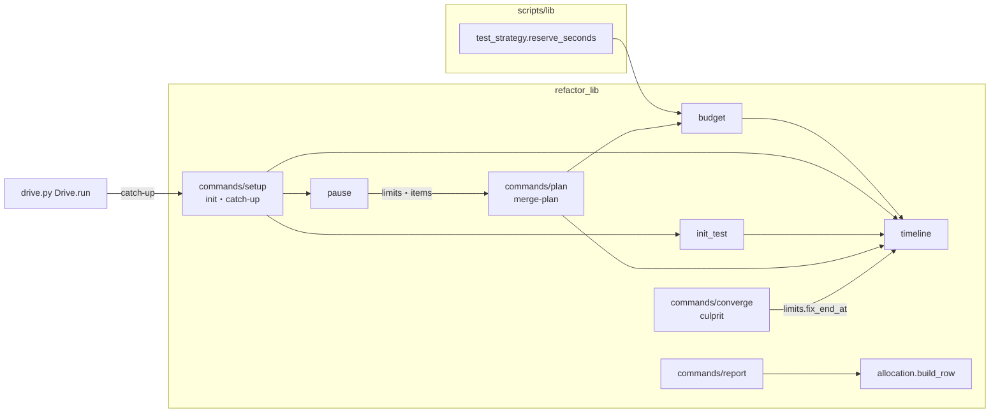
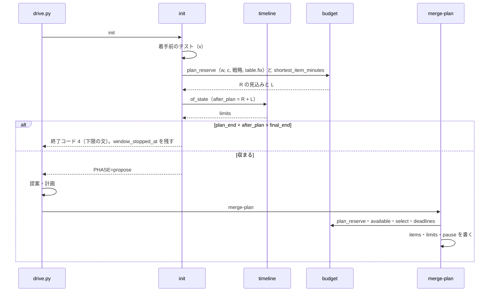
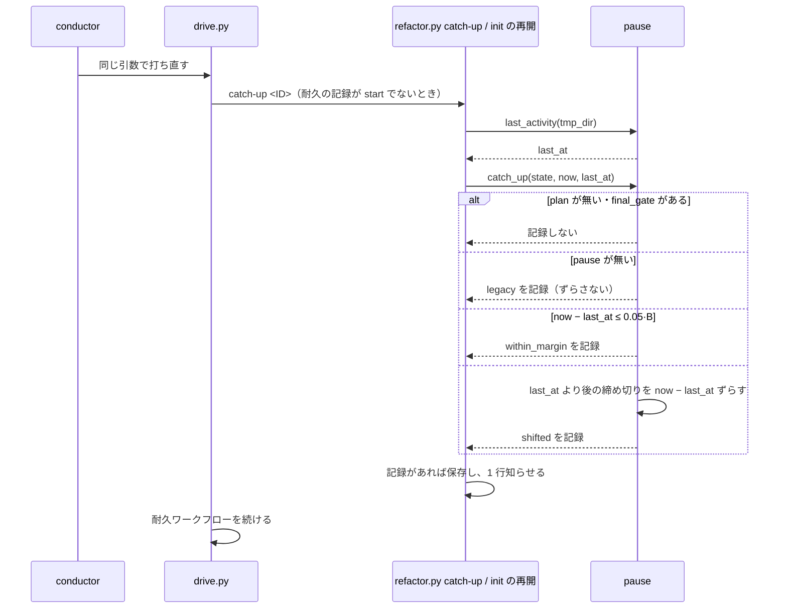
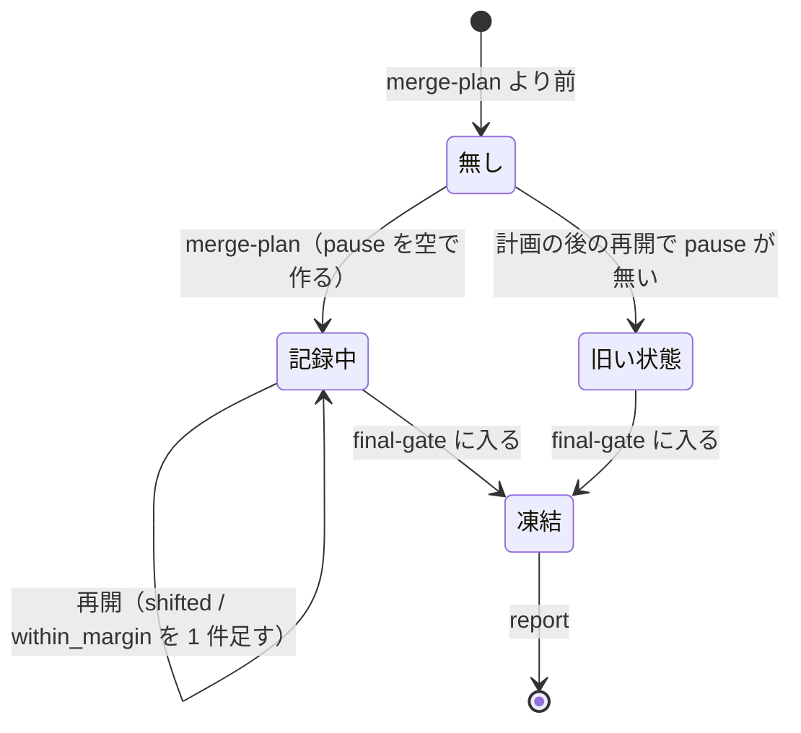

# cross-refactoring: 30 分の想定最大時間のうち実装に使えるのが 1 分前後で項目の多くが時間切れになり、計画の後に中断して再開すると全項目が not_done になる → 走る見込みの手順にだけ時間を配って実装の時間を 7 分以上にし、止まっていた時間の分だけ締め切りをずらす（#1743 #1491）

## 目的

- **何が壊れているか**: リファクタリング計画の時点のバッファが、走らない見込みの危険フラグの全体テスト（約 6.6 分）を数えるため、PR 1801 では使える時間が 1.3 分になり 25 件中 23 件が時間で見送られた。計画の後に中断すると、締め切りが固定の時刻のまま過ぎ、再開しても全項目が `not_done` になる
- **誰が困るか**: 検査のプランで cross-refactoring を回す conductor と、その結果を受け取る Pull Request の書き手
- **直すと何が成り立つか**: PR 1801 の入力で使える時間が 7.9 分になる。1 件も入らない予算なら提案の前に止まり、要る想定最大時間が出る。中断の後も、動いていた時間で締め切りを判定する。使わずに残ったバッファが報告と履歴に残る

## 適用範囲

- **働く範囲**: cross-refactoring を使うすべてのリポジトリ（配布先を含む）。式は `refactor_lib/` と共通ライブラリ `scripts/lib/test_strategy.py` の `reserve_seconds` にある
- **プロジェクトごとに違うもの**: 全体テストの所要 w・CI の壁時計 c・戦略・配分テーブルは、今までどおり宣言（`.ndf/project.json` の `test`）と配分の履歴から読む。引数は増やさない
- **当たるモード**: `standard`

## あるべき姿の根拠

| 根拠 | 種類 | 何を示すか |
| --- | --- | --- |
| PR 1801 の実行 `rf1801-20261006T142613Z`（https://github.com/devbasex/ai-plugins/pull/1801#issuecomment-6018811138 ） | 実測 | 経過 12.9 分・バッファ 15.8 分（うち危険フラグの全体テスト 6.6 分は走らず）・使える時間 1.3 分 |
| PR 1780・1799・1801 の `whole_test.danger` が null（`~/.local/state/ndf/metrics/devbasex--ai-plugins/cross-refactoring-allocation.jsonl`） | 実測 | 危険フラグの全体テストは 3 回の実行でいずれも走っていない |
| `commands/gate.py` の `_reusable_whole_test`（決定 16） | 既存の仕組み | 検証の中の全体テストが通り HEAD が進んでいなければ、最終ゲートは全体テストを走らせない。危険フラグの全体テストと最終ゲートの全体テストは、通れば 1 回で済む |
| PR 1745 のコメント（https://github.com/devbasex/ai-plugins/pull/1745#issuecomment-5987090139 ） | 実測 | 使える時間 0.27 分で採用 0 件。提案に 5.5 分を使ってから時間切れが分かった |
| #1491 の依頼の原文「再開のとき、止まっていた時間の分だけ締め切りをずらす」 | 利用者の指示の原文 | 計画し直さずにずらす |

要求と受け入れ条件は #1743 の本文にある（コピーは [issue-1743-requirements.md](issue-1743-requirements.md)）。#1491 の受け入れ条件はその「再開（#1491）」の節に取り込んである。この文書は「どう作るか」だけを扱う。

## 例: PR 1801 の入力を、変えた後の形で通すと

入力は B = 30 分・戦略 `local-full`・w = x = 395.8 秒（6.60 分）・c = 504 秒・配分テーブルの `fix` = 1.3 分である。

1. `init` が着手前の全体テストを終える（o = 395.8 秒）。提案とリファクタリング計画の枠の終わりは `開始 + 6.60 + 9.0 = 15.60 分`
2. `init` が見込みを出す。バッファの見込み R = 最終ゲートの全体テスト 6.60 + 修正 1.3 + 最終ゲート修正 1.3 = 9.20 分。1 件の長さ L（配分テーブルの最短の項目）を足すと `15.60 + 9.20 + L ≤ 30` なので、止まらずに提案へ進む
3. 提案（5.0 分）とリファクタリング計画（1.3 分）を終え、`merge-plan` が経過 12.9 分で計算する。使える時間 `A = 30 − 12.9 − 9.20 = 7.90 分`（今は 1.3 分）。危険フラグの全体テストはバッファに数えない
4. 実装の途中で conductor の中継が切り替わり、12 分止まる。drive.py を打ち直すと、作業ディレクトリのファイルの最後の更新時刻から止まっていた時間 720 秒を測り、余裕（90 秒）を超えるので、まだ来ていない締め切り（項目の着手期限・実装の終わり・直しの試行の打ち切り・最終ゲート修正の打ち切り）を 720 秒ずつ後ろへずらす
5. 危険フラグは立たず、最終ゲートが全体テストを 1 回走らせて通る。報告に「バッファのうち使わずに残った時間: 危険フラグの全体テスト 0 / 最終ゲートの全体テスト 0.7 / 修正 1.3 / 最終ゲート修正 1.3 分」と「止まっていた時間 12.0 分（締め切りをずらした）」が出る

## ドメインモデル

### コンテキスト

| コンテキスト | 何の語が 1 つの意味に決まるか |
| --- | --- |
| `ndf-cross-refactoring`（時間の配分） | 想定最大時間・バッファ・使える時間・締め切り・止まっていた時間・最後の動きの時刻・心拍のファイル |

共通ライブラリ `test_strategy` は戦略の語（`local-full` など）とバッファに入れる全体テストの秒を供給する側で、この変更は供給される値の 1 つ（危険フラグの秒）の決め方を変える。関係は「供給者 − 顧客」のまま変えない。

### 集約

| 集約 | 持ち主（書き換えてよいもの） | 根 | エンティティ | 値オブジェクト |
| --- | --- | --- | --- | --- |
| 実行の状態（`cross-refactoring-rf<ID>-state.json`） | `refactor.py` の各サブコマンド（drive.py は読むだけ） | 状態 | 改善項目（`items[]`） | バッファ（`plan.reserve`）・上限の表（`limits`）・止まっていた時間の記録（`pause`）・見込み（`limits.after_plan_minutes`） |
| 配分の履歴（`cross-refactoring-allocation.jsonl`） | `report`（実行の行）・`init`（着手前のテストの行） | 行 | — | バッファの使われ方（`reserve`）・止まっていた秒（`paused_seconds`） |

### 不変条件

| # | 集約 | 条件 | 破れたときの扱い |
| --- | --- | --- | --- |
| I1 | 実行の状態 | 最終ゲート修正の打ち切り `limits.final_end_at` = `開始 + B + ずらした秒の和`。ずらしていなければ `開始 + B` | テストで落とす |
| I2 | 実行の状態 | バッファには最終ゲートの全体テスト（手元なら w、CI で見るなら c）・検証の直し 1 回分（`fix`）・最終ゲート修正 1 回分（`final_fix`）の 3 区分が必ず入る（どれも 0 にしない） | テストで落とす |
| I3 | 実行の状態 | バッファの危険フラグの全体テストは、最終ゲートが検証の中の全体テストを使い回せる戦略（手元で最終ゲートを見る `local-full` / `round-only`）と全体テストを CI に任せる戦略で 0、手元の戦略に `--ci-check` を付けたときだけ w | テストで落とす |
| I4 | 実行の状態 | 再開でずらすのは、最後の動きの時刻より後に来る締め切りだけである。項目は完了期限（着手期限 + 見積り）で比べる。前に来る締め切りは変えない | テストで落とす |
| I5 | 実行の状態 | 止まっていた時間が余裕（`0.05·B`）以下ならずらさない。ずらさなかったことも `pause.events[]` に 1 件残る | テストで落とす |
| I6 | 実行の状態 | `pause` を持たない状態ファイル（この変更より前の版で `merge-plan` を通したもの）はずらさない。`pause.legacy` を真にして 1 件残し、以後もずらさない | テストで落とす |
| I7 | 実行の状態 | ずらすのはリファクタリング計画の後（`plan` がある）で、最終ゲートに入る前（`final_gate` が無い）だけである | テストで落とす |
| I8 | 実行の状態 | `init` が提案者を起動しないで止まるのは `plan_end_at + after_plan_minutes > final_end_at` のときに限る。止まる文の下限 `required` 以上で打ち直すと、その時点の起点（打ち直しの o）で `plan_end_at + after_plan_minutes ≤ final_end_at` が成り立ち、提案へ進む | テストで落とす |
| I9 | 実行の状態 | 時間の数値は B・w・x・c・s・o・時計・作業ディレクトリのファイルの更新時刻からの算術だけで決まる。LLM へ問わない | レビューで見る（式の置き場は `budget` / `timeline` / `pause` だけ） |
| I10 | 実行の状態 | 再開の処理を続けて 2 度打っても、ずれるのは 1 度だけである（1 度目の保存で最後の動きの時刻が今になる） | テストで落とす |
| I11 | 配分の履歴 | 新しいキー（`reserve`・`paused_seconds`）を持たない行を読んでも、`allocation.build_table` の値は変わらない | テストで落とす |
| I12 | 実行の状態 | CLI の監視かテストの実行が待っている間は、出力が無くても、最後の動きの時刻が今から心拍の間隔（`HEARTBEAT_SECONDS`、15 秒）の 2 倍（30 秒）より前にならない。心拍の間隔は monitor.py の見回りの間隔（`--poll` / `MONITOR_POLL`）に依らない。中断で止まった区間だけが止まっていた時間になる | テストで落とす |

### ドメインイベント

要求の番号を引き継ぐ。

| # | イベント | 発生元 | 受け手 |
| --- | --- | --- | --- |
| E1 | 着手前のテストを終えた | `init` | E2 の計算 |
| E2 | 実装に使える時間の見込みを出した | `init`（`timeline.window_problem`） | 止まるなら利用者（終了コード 4 と下限の文）、進むなら drive の `propose` |
| E3 | 提案を集めた | drive の `propose` | `merge-proposals` |
| E4 | リファクタリング計画を取り込み、採る項目と締め切りを決めた | `merge-plan` | 以後の手順（`limits` と `items[].start_deadline`）。`pause` を空で作る |
| E5 | 中断した | プロセスの終了・利用者の停止・中継の切り替え | —（何も書かれない。最後の動きの時刻が残るだけ） |
| E6 | 再開し、止まっていた時間だけ締め切りをずらした | `init` の再開・drive.py の打ち直し（どちらも `pause.catch_up`） | `limits`・`items[]`・`plan.end_at`・`pause.events[]` |
| E7 | 項目を実装し、検証した | drive の `implement`・`verify` | `merge-implement`（ずれた後の締め切りでコミットを判定） |
| E8 | 危険フラグの全体テストを走らせた / 走らせなかった | `verify`（`converge._whole_test`） | 最終ゲート（使い回し）・報告（バッファを越えた分） |
| E9 | 最終ゲートを通した | `final-gate` | 報告 |
| E10 | 報告と実行の履歴を残した | `report` | 利用者・配分の履歴 |

### 用語

| 用語 | 意味 | 用語集への反映 |
| --- | --- | --- |
| 止まっていた時間 | `cross-refactoring` をリファクタリング計画の後に中断してから、`init` か drive.py を打ち直して再開するまでの時間。再開の時刻 − 最後の動きの時刻で測る。想定最大時間に数えない | 意味の変更 |
| 最後の動きの時刻 | `cross-refactoring` の作業ディレクトリ（`.cross_refactoring/`）の直下のファイルのうち、最も新しい更新時刻。状態ファイル・CLI のログ・テストのログ・結果ファイルと、心拍のファイルを含む | 追加 |
| 心拍のファイル | `cross-refactoring` の作業ディレクトリ直下の `cross-refactoring-rf<ID>-alive`。出力の有無によらず、CLI の監視とテストの実行が待っている間、心拍の間隔（15 秒。見回りの間隔に依らない）ごとに更新時刻を今にする。中断で止まると更新も止まり、最後の動きの時刻が稼働の終わりを指す | 追加 |
| バッファ | `cross-refactoring` の見積りで、想定最大時間から経過を引いた後に残しておく時間。最終ゲートの全体テスト・修正 1 回・最終ゲート修正 1 回と、最終ゲートと兼ねられないときだけ危険フラグの全体テスト | 意味の変更 |
| 使える時間 | 要求の定義のまま（`state.plan.available_minutes`） | 変更なし（要求で追加済み） |

## 機能一覧

| # | 機能 | 誰が使うか |
| --- | --- | --- |
| F1 | 危険フラグの全体テストを、最終ゲートの全体テストと兼ねられる戦略ではバッファに数えない | `merge-plan`（採る件数が増える） |
| F2 | 着手前のテストの後、使える時間の見込みに 1 件も入らなければ提案者を起動せずに止まり、要る想定最大時間を出す | `init` を打つ conductor・検査のプラン |
| F3 | 計画の後の再開で止まっていた時間を測り、まだ来ていない締め切りをその分ずらす | `init` の打ち直し・drive.py の打ち直し |
| F4 | バッファの区分ごとに、使わずに残った時間と越えた時間を報告と実行の履歴に残す | 利用者・#1522 の判断 |
| F5 | 止まっていた時間とずらしたかどうかを状態ファイル・報告・実行の履歴に残す | 利用者 |

## 構成要素

| 要素 | 責務 | 変更 |
| --- | --- | --- |
| `scripts/lib/test_strategy.py` の `reserve_seconds` | バッファに入れる全体テストの秒（危険フラグ, 最終ゲート）を戦略から返す | 手元で最終ゲートを見る戦略（`ci_gate` が偽）の危険フラグを `w` から `0` へ。`--ci-check` のときは `(w, c)` のまま、CI に任せる戦略は `(0, c)` のまま。係数は変えない。呼ぶのは cross-refactoring の `budget.reserve` だけ |
| `refactor_lib/budget.py` | バッファ・使える時間・締め切りの純粋な計算 | `plan_reserve(state, table)`（`merge-plan` にあった、状態から w と c を選んで `reserve` を呼ぶ処理を移す）と `shortest_item_minutes(table, measured_verify)`（1 件の長さ L）を足す。`fix_end` は残し、`fix_time_left` は上限の表の `fix_end_at` から測る形へ変える |
| `refactor_lib/timeline.py` | 上限の表と、枠の判定 | `compute` に `after_plan_minutes`（R の見込み + L）を受けて表へ書く。`window_problem` を `plan_end_at + after_plan_minutes > final_end_at` で止める形に広げ、`required_budget_minutes(offset, after_plan)` で下限を出す |
| `refactor_lib/pause.py`（新規） | 最後の動きの時刻を読み、止まっていた時間を測って締め切りをずらす | `last_activity(tmp_dir)`（ファイルの更新時刻を読む。I/O はここだけ）と `catch_up(state, now, last_at)`（純粋。状態の辞書を書き換え、記録した 1 件を返す） |
| `refactor_lib/process.py` の `run_with_timeout`・`run_capture` | テストと指標の実行 | 心拍のファイルのパスを呼び出し元ごとに渡さず、モジュール変数 `ALIVE_FILE`（既定 `None` = 今のまま）を 1 か所で持つ。`refactor.py` の `main` が引数を読んだ直後、`id` を持つサブコマンドなら `paths` から心拍のファイルのパスを 1 度だけ設定する。そのため `run_with_timeout`・`run_capture`・`run_test_at` を呼ぶ側（`baseline`・`wholetest`・`targets`・`gate_lint`・`culprit`・`triage`・`publish`・`measure` ほか）は引数を変えず、渡し忘れが起きない。`ALIVE_FILE` があれば `communicate` を `HEARTBEAT_SECONDS` ずつ区切って待ち、区切りごとにその更新時刻を今にする。上限の秒と打ち切りの扱いは変えない |
| `scripts/lib/monitor_types.py` | 監視の定数 | 心拍の間隔の定数 `HEARTBEAT_SECONDS = 15` を足す。見回りの間隔 `DEFAULT_POLL` / `MONITOR_POLL` とは別の定数で、`monitor.py` と `refactor_lib/process.py` の両方がここから読む（同じ役割の定数を 2 か所に置かない） |
| `scripts/lib/monitor.py` | CLI の監視 | 引数 `--alive-file`（省けば今のまま。cross-review など他の呼び出し元は変わらない）を足す。見回りの間の待ちを `min(poll, HEARTBEAT_SECONDS)` ずつに区切り、区切りごとに更新時刻を今にする（`MONITOR_POLL` を 15 秒より大きくしても心拍は 15 秒以内に来る）。cross-refactoring の文書では、止まっていた時間を測る間に走る monitor.py の待ちのすべて、すなわち `docs/02-plan-and-implement.md` の plan・add-tests・implement と `docs/04-verify-and-report.md` の検証の直し（`--phase fix`）の 4 か所に `--alive-file "$TMP_DIR/cross-refactoring-rf$ID-alive"` を足す。最終ゲート修正（`--phase final-fix`）は最終ゲートの後の意図した待ちで、締め切りをずらさない（I7）ため足さない |
| `refactor_lib/commands/setup.py` | `init` と再開 | 新しく始めるときと計画の前の再開で、配分テーブルから `after_plan_minutes` を求めて `timeline.of_state` へ渡す。計画の後の再開では、状態を書く前に `pause.catch_up` を呼ぶ。サブコマンド `catch-up` を足す（引数の定義は `refactor.py`） |
| `refactor_lib/init_test.py` | 着手前のテストの後の止まり | `stop_if_window_short` は広げた `window_problem` をそのまま使う（呼び方は変えない） |
| `refactor_lib/commands/plan.py`（`merge-plan`） | 採る項目と締め切りを決める | バッファを `budget.plan_reserve` で出す。`state.pause = {"seconds": 0, "shifted_seconds": 0, "legacy": false, "events": []}` を作る |
| `refactor_lib/commands/converge.py` の `_fix_stop`・`refactor_lib/culprit.py` の `fix_deadline` | 直しの試行の打ち切り | `budget.fix_end(started_at, …)` で開始から計算し直さず、上限の表の `fix_end_at` を読む（ずれた値を 1 か所から読む） |
| `refactor_lib/commands/report.py` | 報告 | 「バッファのうち使わずに残った時間」「バッファを越えた全体テスト」「止まっていた時間」の行を足す。所要からずらした秒を除く |
| `refactor_lib/allocation.py` の `build_row` | 実行の行 | `reserve`（区分ごとの `reserved_seconds` / `used_seconds` / `unused_seconds`）と `paused_seconds` を足す。`elapsed_seconds` の意味は変えない |
| `scripts/drive.py` の `Drive.run` | 打ち直しの入口 | 耐久の記録が `start` でない（打ち直し）とき、耐久ワークフローを始める前に `refactor.py catch-up <ID>` を 1 度打つ。耐久ステップにしない |
| `docs/01-state-and-propose.md`・`docs/02-plan-and-implement.md`・`docs/04-verify-and-report.md` | 文書 | 「再開」の表に計画の後の行、「締め切り」の R と `fix_end` の式と止まる条件、報告の行を書き直す |



`P → MP` の辺は、`pause` が `merge-plan` の書いた `limits` と `items[]` を書き換えることを表す（呼び出しではない）。文書（`docs/`）と `refactor.py` の引数の定義は図に含めない。

## データ構造

### 状態ファイルに足すキー

| キー | 型 | 書く者 | 空の扱い |
| --- | --- | --- | --- |
| `limits.after_plan_minutes` | 数（分） | `init`（新しく始める・計画の前の再開） | 無ければ 0（この変更より前の表。今の振る舞い） |
| `limits.basis.after_plan` | `{"reserve_minutes", "item_minutes", "table_source"}` | 同上 | 無ければ出さない |
| `pause.seconds` | 数（秒） | `pause.catch_up` | `merge-plan` が 0 で作る |
| `pause.shifted_seconds` | 数（秒） | `pause.catch_up` | 同上 |
| `pause.legacy` | 真偽 | `pause.catch_up`（`pause` を持たない状態で初めて呼ばれたとき真で作る） | 偽 |
| `pause.events[]` | `{"at", "last_activity_at", "seconds", "shifted", "reason"}` | `pause.catch_up` | 空 |

`reason` は `shifted`（ずらした）・`within_margin`（余裕以下）・`legacy`（旧い状態）の 3 つである。最終ゲートに入った後と計画の前は記録しない（I7）。

`pause.catch_up` がずらすキーは次のとおりで、どれも I4 の比べ方で選ぶ。

| キー | 比べる時刻 |
| --- | --- |
| `items[].start_deadline` / `items[].test_start_deadline` | それぞれの完了期限（+ `implement` / `test` の見積り） |
| `limits.add_tests_end_at` / `implement_end_at` / `fix_end_at` / `final_end_at` / `stop_revert_end_at` | その値 |
| `plan.end_at` | その値 |

`limits.propose_end_at`・`plan_end_at` は計画の後には過ぎているので変えない。

### 実行の行（`kind: run`）に足すキー

```json
{
  "reserve": {
    "danger_whole_test": {"reserved_seconds": 0, "used_seconds": 0, "unused_seconds": 0},
    "final_whole_test": {"reserved_seconds": 396, "used_seconds": 356, "unused_seconds": 40},
    "fix": {"reserved_seconds": 78, "used_seconds": 0, "unused_seconds": 78},
    "final_fix": {"reserved_seconds": 78, "used_seconds": 0, "unused_seconds": 78}
  },
  "paused_seconds": 720
}
```

| 区分 | 使った秒の出所 |
| --- | --- |
| `danger_whole_test` | `whole_test.seconds`（`whole_test.ran` が真のときだけ。それ以外は 0） |
| `final_whole_test` | `final_gate.checks[]` のうちテストの判定（手元の全体テストか CI の待ち）の秒の和。使い回したら 0 |
| `fix` | `fix_stats.seconds` |
| `final_fix` | `phases["final-fix"].seconds` |

`unused_seconds = max(0, reserved − used)`。越えた分（`used − reserved` が正）は報告にだけ出し、行には `used_seconds` が残るので読む側が引ける。`build_table` は `reserve` と `paused_seconds` を読まない（I11）。

## 入出力の契約

### `refactor.py catch-up <ID>`（新規。drive.py が打つ内部のサブコマンド）

| 終了コード | 意味 | 出力 |
| --- | --- | --- |
| 0 | ずらした・ずらさなかった・対象外（状態ファイルが無い・計画の前・最終ゲートの後）のどれか | 記録したときだけ報告の 1 行と同じ文を標準エラーへ |

状態ファイルが無いときに止めないのは、drive.py が最初の `init` より前に打つことがあるためである。

### `init` の終了コード 4（止まる場面を 1 つ広げる）

今の「枠が想定最大時間に収まらない」の文を次の形に広げる。条件は I8 である。

```text
着手前のテストに 600.0 秒かかり、提案とリファクタリング計画の枠（0.30·B = 540 秒）の後に、バッファの見込み 12.6 分と
最短の項目 1 件 1.0 分が想定最大時間 30 分に収まりません。
--budget-minutes を 41 以上にして 5 分以内に init を打ち直すと、着手前のテストを走らせ直さずに続けます（下限では 1 件だけが入ります。…）
```

下限は `required = ceil(((o + 300) / 60 + after_plan_minutes) / 0.70)` で出す（300 秒は今の `RESUME_GRACE_SECONDS`）。`after_plan_minutes` が 0（旧い表）なら今の式 `ceil((o + 300) / (60 · 0.70))` と同じ値になる。

### 報告に足す行

```text
- バッファのうち使わずに残った時間: 危険フラグの全体テスト 0.0 / 最終ゲートの全体テスト 0.7 / 修正 1.3 / 最終ゲート修正 1.3 分（計 3.3 分）
- バッファを越えた全体テスト: 危険フラグの全体テスト 6.6 分をバッファの外で走らせた（省いたもの: 直しの試行）
- 止まっていた時間: 12.0 分（1 回。締め切りを 12.0 分ずらした）
- 止まっていた時間: 計測しない（この状態ファイルは止まっていた時間を記録しない版でリファクタリング計画を取り込んだため、締め切りをずらさずに続けた）
```

2 行目は越えた区分があるときだけ出る。括弧の中は、直しの試行を時間で打ち切ったとき（`_fix_stop` が真で `_give_up` が取り消した）に「直しの試行」、そうでなければ「無し」と書く。想定最大時間を越えた分は、今ある所要の行（想定最大時間との差）が出す。3・4 行目は `pause.events[]` があるときだけ出る。所要の行は `（止まっていた 12.0 分を除く）` を添え、ずらした秒を引いた値で想定最大時間と比べる。

## 処理の流れ

### リファクタリング計画まで（F1・F2）



`plan_reserve` を `init` と `merge-plan` の両方が呼ぶため、見込みの R と計画の R は同じ式から出る。違うのは配分テーブルを読む時点だけである（その間に履歴は増えない）。

### 再開（F3）



手で `init` を打ち直す経路では、`_resume` が計画の後のとき、状態を書く前に同じ `pause.catch_up` を呼ぶ。書いた後に呼ぶと、状態ファイルの更新時刻が最後の動きの時刻になり、止まっていた時間が 0 に見える。

### 止まっていた時間の記録の状態



「旧い状態」からはずらす状態へ戻らない（I6）。

## 非機能の実現方式

| 大項目 | 条件 | 実現方式 |
| --- | --- | --- |
| 性能・拡張性 | PR 1801 の入力で使える時間が 7.0 分以上。1 回の所要の上限（`開始 + B + ずらした秒`）は延びない | F1 でバッファから 6.60 分を外し、使える時間は 7.90 分になる。`final_end_at` は I1 のまま。危険フラグが立ったときの時間はバッファの外になり、直しの試行の打ち切り（`fix_end_at`）までの時間から使う。最終ゲート修正の 1 回目は今までどおり打ち切らない（決定 26） |
| 運用・保守性 | 使わずに残ったバッファと止まっていた時間が報告と履歴に残る | 実行の行の `reserve` と `paused_seconds`、報告の 3 行（F4・F5） |
| 移行性 | 旧い状態ファイルから再開しても止まらない。履歴の旧い行を読める | 旧い `plan.reserve`（危険フラグ w を含む）はそのまま使い、計算し直さない。`pause` が無ければ legacy として続ける（I6）。`limits.after_plan_minutes` が無ければ 0。`build_table` は新しいキーを読まない（I11） |

## 決定の記録

### 決定 1: 走らない見込みの時間を実装へ回すため、危険フラグの全体テストを最終ゲートの全体テストと兼ねてバッファに 1 回だけ数える

手元で最終ゲートを見る戦略では、検証の中の全体テストが通って HEAD が進んでいなければ、最終ゲートは全体テストを走らせない（`_reusable_whole_test`）。危険フラグが立って通れば 1 回、立たなければ最終ゲートの 1 回で、どちらも全体テストは 1 回である。2 回走るのは危険フラグの全体テストが落ちて直した後か、同期のコミットで HEAD が進んだときだけで、その分はバッファの外になり、直しの試行の時間と、最終ゲートの全体テストが想定最大時間の終わりを越える分で吸収する。PR 1780・1799・1801 では危険フラグの全体テストは 1 度も走っていない。`--ci-check` を付けた手元の戦略は最終ゲートが CI を見て使い回せないため、危険フラグの w を残す。

履歴の直近 10 回で危険フラグが走った割合を w に掛ける案は、行に新しいキーが溜まるまで今の値（w）のままで、受け入れ条件の値に届くのが数回先になるため採らない。計画の時点の `public_io` で危険フラグを予測する案は、D1〜D4 が実装の差分から決まり予測できないため採らない。最終ゲートの全体テストを省いて時間を作る案は、要求の境界（行わない）に当たるため採らない。

根拠: Value 3 / Value 1 / Mission（MVV 版 2）

### 決定 2: 提案に時間を使ってから時間切れが分かることを防ぐため、提案の前の判定を今の枠の判定へ 1 つにまとめ、1 件の長さに配分テーブルの最短の項目を使う

`window_problem` は既に「提案とリファクタリング計画の枠が想定最大時間に収まらなければ止まる」を持ち、打ち直しの扱い（`window_stopped_at` と `resumed_at`）も揃っている。条件の右辺にバッファの見込みと 1 件の長さを足すだけで、止まる文・打ち直し・下限の式を 1 つのまま使える。別の判定を足すと、打ち直しの扱いが 2 つに分かれる。

1 件の長さを想定最大時間の割合のように大きくすると、1 件は入る実行も止めて人の打ち直しを求める。止まる費用は人の手間であり、確かに 1 件も入らないときだけ止める（未決の 2 つ目はこれで閉じる）。

根拠: Value 2 / Value 6（MVV 版 2）

### 決定 3: 実行中の CLI とテストを中断と取り違えないため、止まっていた時間を作業ディレクトリの直下のファイルの最後の更新時刻から測り、待つ側が心拍のファイルを 15 秒ごとに更新する

要求の前提 2 は「状態ファイルに残った最後の記録の時刻」で測るとしたが、状態ファイルは CLI の起動の前（`start-phase`）と取り込みの後にしか書かれない。実装の CLI が 10 分走っている間に中断すると、状態ファイルの時刻からは CLI が働いた 10 分も止まっていた時間に数え、締め切りを延ばしすぎる。CLI のログ・テストのログ・結果ファイルも、出力の無い間（考えている CLI、`-q` で黙って走る全体テスト、出力を溜めて最後に書くテスト）は更新されないため、それだけでは同じ取り違えが残る。そこで、処理の終わりを待つ 2 か所（CLI の監視 `monitor.py` と、テストを走らせる `process.run_with_timeout` / `run_capture`）が、待つ間 15 秒ごとに心拍のファイルの更新時刻を今にする。中断でプロセスが止まると心拍も止まるため、最も新しい更新時刻は「動いていた最後の時刻」から 15 秒以内になり、止まっていた時間に数える稼働の分は余裕（`0.05·B`。B = 30 分で 90 秒）より小さい。前提 2 の「最後の記録の時刻を持たない状態ファイル」は、「止まっていた時間を記録しない版で計画した状態ファイル（`pause` が無い）」として扱う。

状態ファイルの保存のたびに時刻を書く案は、上の取り違えが残るため採らない。耐久の記録のステップの時刻を使う案は、手で `init` を打ち直す経路に記録が無いため採らない。ログのファイルの更新時刻だけで測る案は、出力の無いテストと CLI の稼働を止まっていた時間に数えるため採らない。心拍をテストのコマンドや CLI の側に書かせる案は、プロジェクトごとのコマンドを変えることになるため採らない（待つ側はどのプロジェクトでも NDF のスクリプトである）。

根拠: Value 3 / Value 4（MVV 版 2）

### 決定 4: 中断の前に締め切りを過ぎたコミットを採らないため、最後の動きの時刻より後に来る締め切りだけをずらす

すべての締め切りをずらすと、中断の前に締め切りを過ぎてコミットした項目が、ずれた締め切りの内に入って採られる。最後の動きの時刻より後の締め切りだけをずらすと、中断の前のコミットは元の締め切りで、再開の後のコミットはずれた締め切りで比べることになり、動いていた時間で比べたのと同じ結果になる。比べる場所（コミットの判定・監視の上限・直しの試行の打ち切り・最終ゲート修正の打ち切り・打ち切りの後の取り消し）は保存した時刻を読むままで済む。

比べるたびに時刻を動いていた時間へ直す案は、比べる場所のすべてを変えるため採らない。

根拠: Value 6（MVV 版 2）

### 決定 5: ずれた打ち切りを全員が同じ値で読むため、直しの試行の打ち切りを開始から計算し直さず、上限の表の 1 か所から読む

今は `converge._fix_stop` と `culprit.fix_deadline` が `budget.fix_end(started_at, …)` で開始から計算し直し、上限の表の `fix_end_at` と同じ値を 2 か所で別に出している。ずらした値を表にだけ書くと、この 2 か所が元の値で打ち切る。表の値を読む形にすれば、ずらす処理は表と項目だけを書き換えればよい。

根拠: Value 6 / Value 7（MVV 版 2）

### 決定 6: 手で打つ再開と drive.py の打ち直しの両方で働かせるため、同じ `pause.catch_up` を `init` の再開とサブコマンド `catch-up` から呼ぶ

drive.py は `init` を耐久ステップとして 1 回だけ打ち（I19）、打ち直しても `init` を流し直さない。`init` の再開だけに置くと、drive.py の打ち直しではずれない。drive.py が耐久ワークフローを続ける前に `catch-up` を 1 度打てば、どの耐久ステップから続いても先に締め切りがずれる。状態ファイルを書くのは今までどおり `refactor.py` だけになる。最終ゲートに入った後はずらさない。最終ゲートの cross-review の待ちは drive.py が意図して止まる区間で、中断ではない。

状態を読むたびに（`load_state`）ずらす案は、どのサブコマンドも時計で状態を書き換えるようになり、テストで再現しにくくなるため採らない。drive.py の中で関数を直に呼ぶ案は、状態を書く者が 2 つになるため採らない。

根拠: Value 4 / Value 6（MVV 版 2）

### 決定 7: 同じ式と同じ文書を 1 度に直すため、#1491 の実装を #1743 の 1 本に寄せる

#1491 の直し（`pause`・`fix_end_at` の読み方）と #1743 の直し（バッファ・止まる判定）は、どちらも `timeline.py` の上限の表・`budget.py`・`docs/02-plan-and-implement.md` の「締め切り」の表を触る。分けると、同じステージで重なる実装プランは 1 本ずつ流れるため速くならず、2 本目は 1 本目の表を前提に書き直しになる。テストも PR 1801 の入力という同じ材料を使う。#1491 は「取り込む」とし、受け入れ条件は #1743 の実装の完了判定で確かめる。

根拠: Value 6 / Value 4（MVV 版 2）

### 決定 8: 想定最大時間を変える判断の材料にするため、バッファを区分ごとに「取った・使った・残った」の 3 つで残し、所要からはずらした秒を引く

残った時間だけを残すと、越えた区分（危険フラグがバッファの外で走った）が読めない。取った秒と使った秒を並べれば、どちらも引き算で出る。実行の行の `elapsed_seconds` は意味を変えずに壁時計のまま残し、`paused_seconds` を別のキーにする。既存の行と比べられなくなるのを避けるためである。

根拠: Value 3 / Value 7（MVV 版 2）

## テスト設計

| 受け入れ条件・不変条件 | どの振る舞いで縛るか | どう壊したら落ちるべきか |
| --- | --- | --- |
| 実装へ回す時間: PR 1801 の入力で使える時間が 7.0 分以上 | `budget.plan_reserve` と `available_minutes` に PR 1801 の値を与え、使える時間が 7.9 分前後になる | 危険フラグの w をバッファへ戻す |
| 同じ入力で `final_end_at` が `開始 + 30 分`（I1） | `timeline.compute` に計画の後の値を与える | `final_end_at` をバッファで前へ寄せる |
| 同じ入力で最終ゲートの全体テスト・`fix`・`final_fix` がバッファに残る（I2） | `plan_reserve` の戻り値の 3 区分 | 最終ゲートの w・`fix`・`final_fix` のどれかを 0 にする |
| 危険フラグが立てば全体テストを走らせる | `converge._whole_test` が手元の戦略で全体テストを 1 度走らせる（既存テストのまま） | バッファが 0 のときに全体テストを飛ばす |
| 危険フラグの全体テストと最終ゲートの両方に時間が無くても止まらず、何を省いたかが 1 行出る | 時計を打ち切りの後に置いて検証から最終ゲートまで進め、最終ゲート修正の 1 回目が起動し、報告に「バッファを越えた全体テスト」の行が出る | 時間切れで止める・報告の行を出さない |
| CI に任せる戦略でバッファと使える時間が変わらない（I3） | `reserve_seconds` が `local-scoped-ci-whole` で `(0, c)`、`--ci-check` の手元で `(w, c)` | どちらかの戻り値を変える |
| 提案の前に止まる（PR 1745 の入力と、w = x = 600 秒の入力）（I8） | `window_problem` が後者で文を返し、前者で 1 件の長さが入る限り `None` を返す | `after_plan_minutes` を足さない |
| 止まる文に下限が出て、下限で打ち直すと進む（I8） | 下限の B と打ち直しの o（`resumed_at`）で `compute` し直すと `window_problem` が `None` | 下限の式から `after_plan_minutes` か 300 秒を落とす |
| PR 1801 の入力では止まらない | `window_problem` が `None` | 危険フラグの w を見込みに入れる |
| 再開で締め切りがずれ、項目が実装へ進む（#1491） | `pause.catch_up` に計画の後の状態と `now`・`last_at` を与え、すべての締め切りが止まっていた秒だけ後ろへ動く。ずれた後の締め切りで `_deadline_passed` が偽 | ずらさない・一部の締め切りを残す |
| 再開の扱いが状態に 1 か所、報告に 1 行残る | `pause.events[]` が 1 件増え、報告に「止まっていた時間」の行が 1 行出る | 記録しない・2 か所に書く |
| 余裕以下ではずらさない（I5） | 止まっていた秒が `0.05·B` のとき締め切りが変わらず、`within_margin` が 1 件残る | 境界を `<` と `≤` で取り違える |
| `pause` の無い状態ではずらさず 1 行出る（I6） | legacy を記録し、2 回目の再開でもずらさない | legacy の後の再開でずらす |
| 2 回の中断は足した分だけずれる | `catch_up` を 2 度、別の `last_at` で呼び、`shifted_seconds` が和になる | 2 回目で上書きする |
| 締め切りを過ぎて完了した項目は `not_done`（I4） | 中断の前に完了期限を過ぎてコミットした項目の締め切りが動かず、`_deadline_passed` が真のまま | すべての締め切りをずらす |
| 計画の前・最終ゲートの後はずらさない（I7） | `plan` の無い状態・`final_gate` のある状態で `catch_up` が何も書かない | 段階を見ずにずらす |
| 続けて 2 度打っても 1 度だけずれる（I10） | 1 度目の保存の後に `last_activity` を読み直すと止まっていた秒が余裕以下になる | `catch-up` が保存しない |
| 最後の動きの時刻に CLI のログが入る（決定 3） | 状態ファイルより新しいログのファイルがあると、その時刻を返す | 状態ファイルの時刻だけを読む |
| 出力の無いテストの稼働を止まっていた時間に数えない（I12・決定 3） | `HEARTBEAT_SECONDS` を 0.1 秒へ差し替え、`process.ALIVE_FILE` を設定して 0.5 秒黙って眠るコマンドを `run_with_timeout` で走らせ、走っている間に心拍のファイルの更新時刻が今から 0.2 秒（間隔の 2 倍）以内に保たれる。`refactor.py` の `main` が `id` を持つサブコマンドで `ALIVE_FILE` を設定する。`monitor.py --alive-file` は見回りの間隔を心拍の間隔より大きくしても、心拍の間隔ごとに更新する | 心拍を書かない・最初の 1 回だけ書く・呼び出し元が設定を落とす・見回りの間隔に乗る |
| `fix_end_at` を 1 か所から読む（決定 5） | 表の `fix_end_at` をずらすと `_fix_stop` と `culprit.fix_deadline` の両方がずれた値で判定する | どちらかが開始から計算し直す |
| 報告にバッファの区分ごとの残りが出る | PR 1801 の形の状態から報告の行が 4 区分の分を持つ | 区分を落とす |
| 実行の行に `reserve` と `paused_seconds` が残る | `build_row` の戻り値 | キーを書かない |
| 旧い行で `build_table` が変わらない（I11） | 新しいキーを持つ行と持たない行で `build_table` が同じ値を返す | `build_table` が `reserve` を読む |
| 旧い `plan.reserve` で再開しても値が変わらない（移行性） | 危険フラグ w を持つ `plan.reserve` の状態から `of_state` を組み直しても `fix_end_at` が変わらない | 再開でバッファを計算し直す |
| 時間の数値が算術だけで決まる（I9） | 既存のテスト（`timeline`・`budget` の純粋な関数）が時計を引数で受ける | — （レビューで見る） |
| 既存のテストがすべて通る | `uv run --frozen --project . --all-extras pytest plugins/ndf/skills/cross-refactoring plugins/ndf/scripts/tests -q -n 4` | — |

## 設計の結果

| 課題 | 扱い | 取り込み先 | 触るファイル |
| --- | --- | --- | --- |
| #1743 | 実装する | — | `plugins/ndf/scripts/lib/test_strategy.py`、`plugins/ndf/scripts/lib/monitor.py`、`plugins/ndf/skills/cross-refactoring/scripts/refactor_lib/`、`plugins/ndf/skills/cross-refactoring/scripts/drive.py`、`plugins/ndf/skills/cross-refactoring/scripts/refactor.py`、`plugins/ndf/skills/cross-refactoring/docs/`、`plugins/ndf/skills/cross-refactoring/tests/`、`plugins/ndf/scripts/tests/` |
| #1491 | 取り込む | #1743 | — |

## 未確認のまま残ること

| 項目 | 内容 |
| --- | --- |
| 危険フラグが立ったときの所要の伸び | 危険フラグの全体テストが通って最終ゲートが使い回せれば伸びない。落ちたとき・同期のコミットで HEAD が進んだときは、最終ゲートの全体テストの終わりが想定最大時間の終わりを約 `w − 修正 − 最終ゲート修正`（PR 1801 の入力で約 4 分）越え、落ちたときは原因の項目を決める走らせ直しと最終ゲート修正の 1 回目がさらに足される見込みである。報告の「バッファを越えた全体テスト」の行と所要の行で実測する（リリース後テスト） |
| 生成物の同期のコミットの時点 | このリポジトリは `--sync-command` で生成物を同期する。同期のコミットが危険フラグの全体テストの後に積まれると、最終ゲートは使い回せず 2 回目を走らせる。どの時点で積まれるかは実装（`tdd-cycle`）で確かめる |
| drive.py の打ち直しで中断した手順の CLI を起動し直すか | 中断した監視の耐久ステップを流し直したとき、起動の耐久ステップは記録から返る。止まった CLI の代わりを起動するのは振り替え（`reassign`）の既存の経路で、ずれた締め切りから監視の上限を出し直すのは次の `start-phase` である。受け入れ条件は締め切りの値とコミットの判定で確かめ、起動し直しの経路は既存の振る舞いのまま扱う |
| 要求の前提 2 の文面 | 決定 3 で、測る時刻を作業ディレクトリのファイルの更新時刻へ広げた。課題の本文の前提 2 を同じ形に直すかは、承認ゲート 1 で承認する人が決める |
| 手で作業ディレクトリのファイルを触ったとき | 中断の間に利用者が `.cross_refactoring/` 直下のファイルを開いて保存すると、最後の動きの時刻が進み、止まっていた時間が短く数えられる（ずれが小さくなる側で、締め切りは延びすぎない） |
