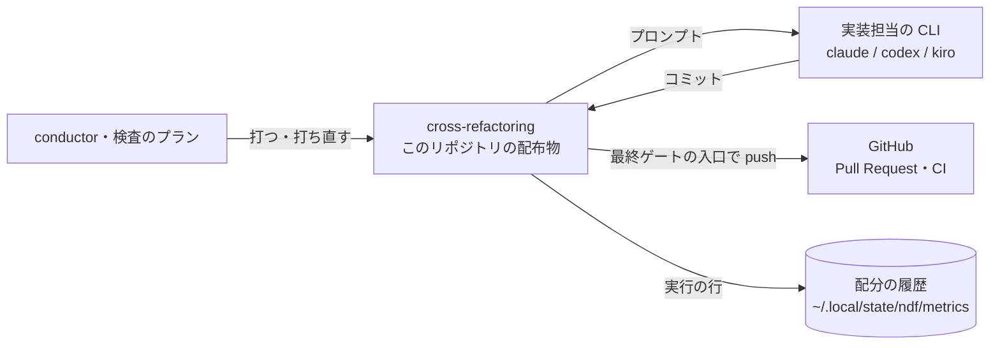
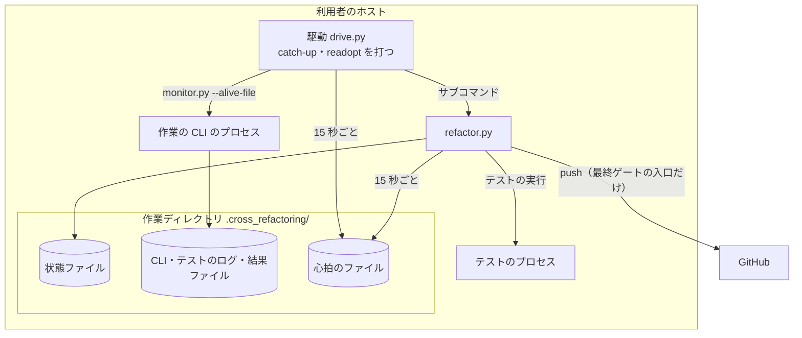
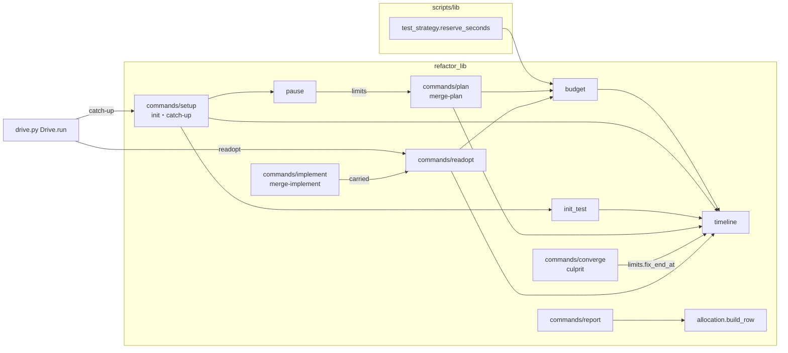
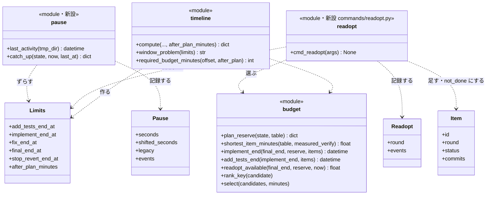
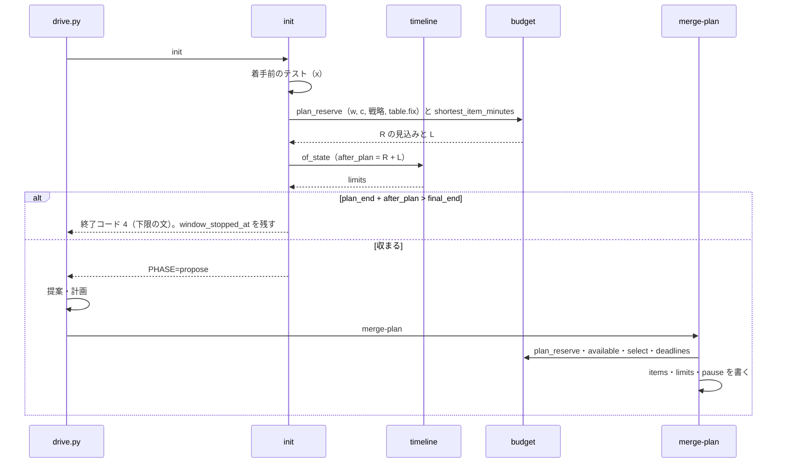
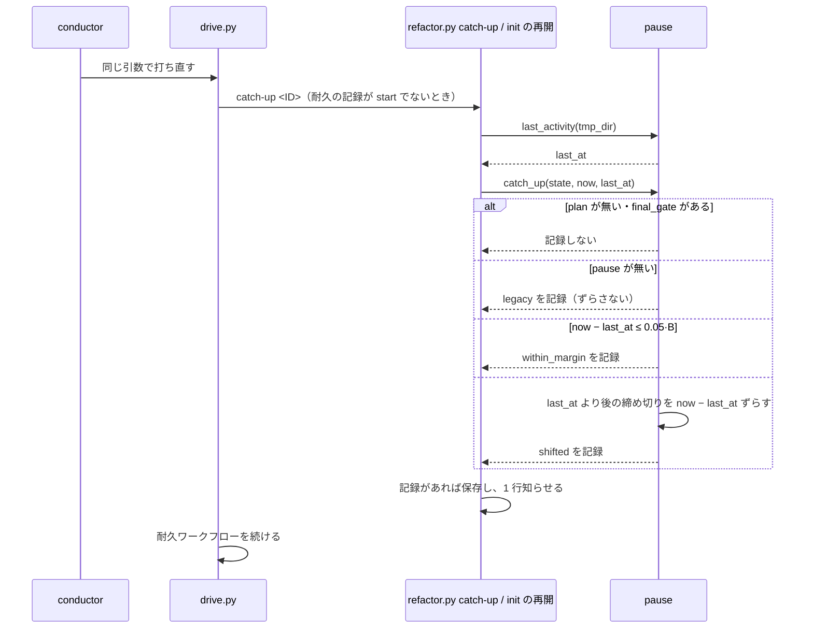
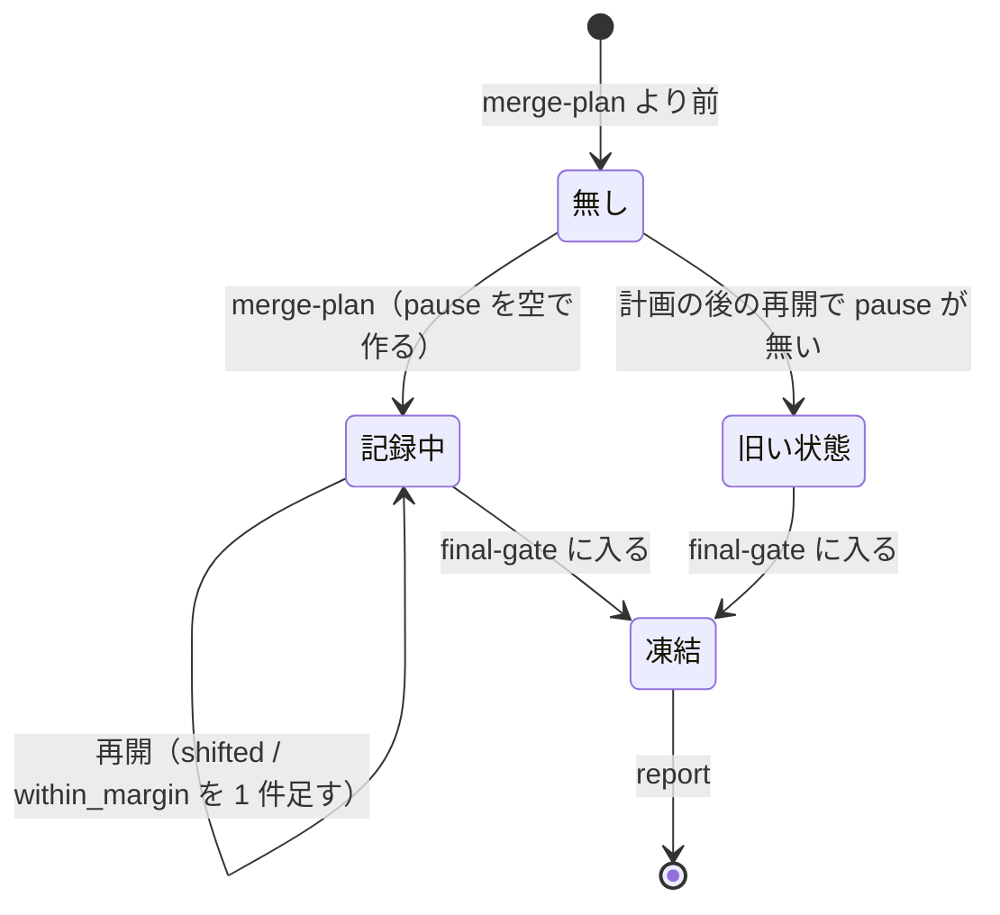
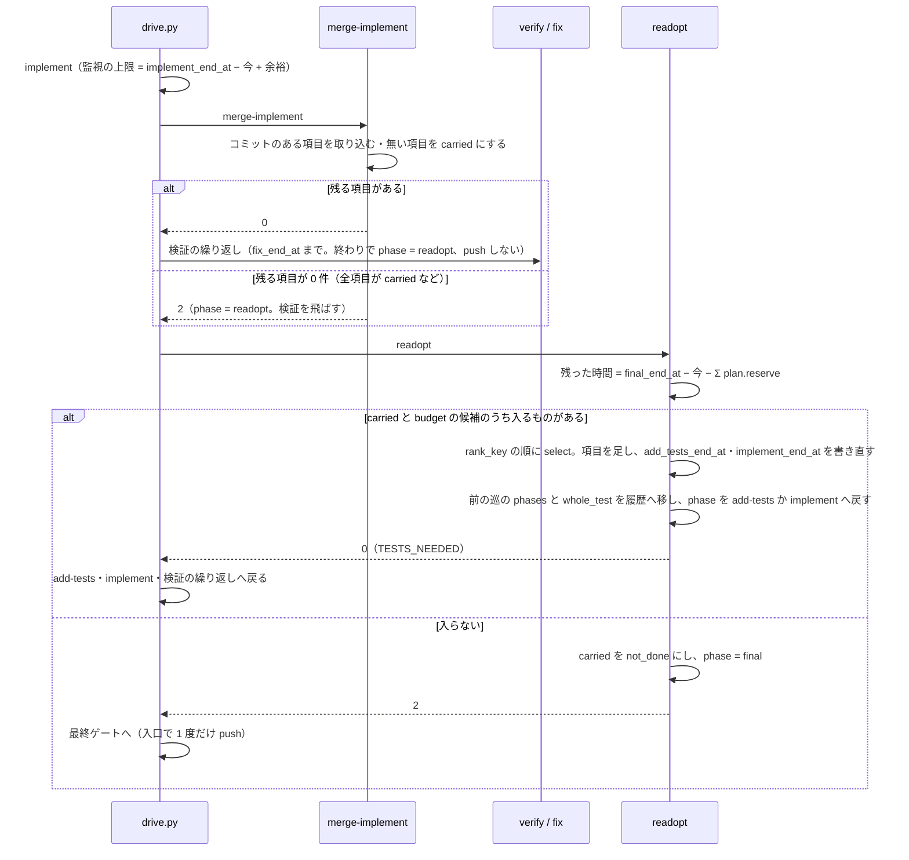

# cross-refactoring: 30 分の想定最大時間のうち実装に使えるのが 1 分前後で項目の多くが時間切れになり、計画の後に中断して再開すると全項目が not_done になる → 走る見込みの手順にだけ時間を配って実装の時間を 7 分以上にし、時間が残る間は項目ごとの期限で止めず、余った時間で見送った候補を採り直し、止まっていた時間の分だけ締め切りをずらす（#1743 #1491）

## 目的

- **何が壊れているか**: リファクタリング計画の時点のバッファが、走らない見込みの危険フラグの全体テスト（約 6.6 分）を数えるため、PR 1801 では使える時間が 1.3 分になり 25 件中 23 件が時間で見送られた。計画の後に中断すると、締め切りが固定の時刻のまま過ぎ、再開しても全項目が `not_done` になる。さらに、項目ごとの見積りから出した着手期限・完了期限が、想定最大時間が残っていても項目を `not_done` にする（rf1718 は 60 分のうち 14.5 分を残して 10 件を `not_done` にした）。実装が早く終わっても、見送った候補は採り直さない（棚卸しの 9 回で見送り 121 件のうち 94 件が `budget`）
- **誰が困るか**: 検査のプランで cross-refactoring を回す conductor と、その結果を受け取る Pull Request の書き手
- **直すと何が成り立つか**: PR 1801 の入力で使える時間が 7.9 分になる。実装を止めるのは「想定最大時間 − バッファ − 採っている項目の検証」の 1 つの時刻だけになり、時間が残っていれば見送った候補を順位の順に採り直す。1 件も入らない予算なら提案の前に止まり、要る想定最大時間が出る。中断の後も、動いていた時間で締め切りを判定する。使わずに残ったバッファが報告と履歴に残る

## 適用範囲

- **働く範囲**: cross-refactoring を使うすべてのリポジトリ（配布先を含む）。式は `refactor_lib/` と共通ライブラリ `scripts/lib/test_strategy.py` の `reserve_seconds` にある
- **プロジェクトごとに違うもの**: 全体テストの所要 w・CI の壁時計 c・戦略・配分テーブルは、今までどおり宣言（`.ndf/project.json` の `test`）と配分の履歴から読む。引数は増やさない
- **当たるモード**: `standard`

## あるべき姿の根拠

| 根拠 | 種類 | 何を示すか |
| --- | --- | --- |
| PR 1801 の実行 `rf1801-20261006T142613Z`（https://github.com/devbasex/ai-plugins/pull/1801#issuecomment-6018811138 ） | 実測 | 経過 12.9 分・バッファ 15.8 分（うち危険フラグの全体テスト 6.6 分は走らず）・使える時間 1.3 分 |
| PR 1780・1799・1801 の `whole_test.danger` が null（`~/.local/state/ndf/metrics/devbasex--ai-plugins/cross-refactoring-allocation.jsonl`） | 実測 | 危険フラグの全体テストは 3 回の実行でいずれも走っていない |
| `commands/gate.py` の `_reusable_whole_test`（決定 16） | 既存の仕組み | 検証の中の全体テストが通り HEAD が進んでいなければ、最終ゲートは全体テストを走らせない。危険フラグの全体テストと最終ゲートの全体テストは、通れば 1 回で済む |
| PR 1745 のコメント（https://github.com/devbasex/ai-plugins/pull/1745#issuecomment-5987090139 ） | 実測 | 使える時間 0.27 分で採用 0 件。提案に 5.5 分を使ってから時間切れが分かった |
| #1491 の依頼の原文「再開のとき、止まっていた時間の分だけ締め切りをずらす」 | 利用者の指示の原文 | 計画し直さずにずらす |
| 利用者の指示「cross-refactoring の無意味な制約はどんどん外す」（2026-10-07。#1743 の本文の追記） | 利用者の指示の原文 | バッファの二重取りと、時間が残っているのに止める期限を外す |
| 棚卸しの実測（rf1673〜rf1801 の 9 回。#1743 の本文の追記） | 実測 | 見送り 121 件のうち 94 件が `budget`。着手期限・完了期限で `not_done` 13 件。rf1718（B = 60 分、`elapsed_seconds` 2,733）は 10 件を `not_done`（「実装の締め切りまでにコミットが無い」）にしたまま 14.5 分を残して終わった |

要求と受け入れ条件は #1743 の本文にある（コピーは [issue-1743-requirements.md](issue-1743-requirements.md)）。#1491 の受け入れ条件はその「再開（#1491）」の節に取り込んである。この文書は「どう作るか」だけを扱う。

## 例: PR 1801 の入力を、変えた後の形で通すと

入力は B = 30 分・戦略 `local-full`・w = x = 395.8 秒（6.60 分）・c = 504 秒・配分テーブルの `fix` = 1.3 分である。

1. `init` が着手前の全体テストを終える（o = 395.8 秒）。提案とリファクタリング計画の枠の終わりは `開始 + 6.60 + 9.0 = 15.60 分`
2. `init` が見込みを出す。バッファの見込み R = 最終ゲートの全体テスト 6.60 + 修正 1.3 + 最終ゲート修正 1.3 = 9.20 分。1 件の長さ L（配分テーブルの最短の項目）を足すと `15.60 + 9.20 + L ≤ 30` なので、止まらずに提案へ進む
3. 提案（5.0 分）とリファクタリング計画（1.3 分）を終え、`merge-plan` が経過 12.9 分で計算する。使える時間 `A = 30 − 12.9 − 9.20 = 7.90 分`（今は 1.3 分）。危険フラグの全体テストはバッファに数えない
4. 実装の途中で conductor の中継が切り替わり、12 分止まる。drive.py を打ち直すと、作業ディレクトリのファイルの最後の更新時刻から止まっていた時間 720 秒を測り、余裕（90 秒）を超えるので、まだ来ていない締め切り（テストの追加の終わり・実装の終わり・直しの試行の打ち切り・最終ゲート修正の打ち切り）を 720 秒ずつ後ろへずらす
5. 実装の CLI を止めるのは実装の終わり `開始 + 30 − 9.20 − Σ（採った項目の verify）`（に止まっていた 12 分を足した時刻）だけで、項目ごとの期限では止めない。CLI が全項目をコミットし、検証が動いていた時間で開始から 17.0 分に終わると、残った時間 `30 − 17.0 − 9.20 = 3.80 分` に入る `budget` の候補を順位の順に採り直し（計画の時点の見積り・範囲テスト・`risk` をそのまま使う）、テストの追加・実装・検証をもう 1 巡回す。次の巡の後に入る候補が無ければ最終ゲートへ進む
6. 危険フラグは立たず、最終ゲートが全体テストを 1 回走らせて通る。報告に「バッファのうち使わずに残った時間: 危険フラグの全体テスト 0 / 最終ゲートの全体テスト 0.7 / 修正 1.3 / 最終ゲート修正 1.3 分」と「止まっていた時間 12.0 分（締め切りをずらした）」が出る

## ドメインモデル

### コンテキスト

| コンテキスト | 何の語が 1 つの意味に決まるか |
| --- | --- |
| `ndf-cross-refactoring`（時間の配分） | 想定最大時間・バッファ・使える時間・実装の終わり・採り直し・締め切り・止まっていた時間・最後の動きの時刻・心拍のファイル |

共通ライブラリ `test_strategy` は戦略の語（`local-full` など）とバッファに入れる全体テストの秒を供給する側で、この変更は供給される値の 1 つ（危険フラグの秒）の決め方を変える。関係は「供給者 − 顧客」のまま変えない。

### 集約

| 集約 | 持ち主（書き換えてよいもの） | 根 | エンティティ | 値オブジェクト |
| --- | --- | --- | --- | --- |
| 実行の状態（`cross-refactoring-rf<ID>-state.json`） | `refactor.py` の各サブコマンド（drive.py は読むだけ） | 状態 | 改善項目（`items[]`） | バッファ（`plan.reserve`）・上限の表（`limits`）・止まっていた時間の記録（`pause`）・見込み（`limits.after_plan_minutes`）・採り直しの記録（`readopt`） |
| 配分の履歴（`cross-refactoring-allocation.jsonl`） | `report`（実行の行）・`init`（着手前のテストの行） | 行 | — | バッファの使われ方（`reserve`）・止まっていた秒（`paused_seconds`） |

### 不変条件

| # | 集約 | 条件 | 破れたときの扱い |
| --- | --- | --- | --- |
| I1 | 実行の状態 | 最終ゲート修正の打ち切り `limits.final_end_at` = `開始 + B + ずらした秒の和`。ずらしていなければ `開始 + B` | テストで落とす |
| I2 | 実行の状態 | バッファには最終ゲートの全体テスト（手元なら w、CI で見るなら c）・検証の直し 1 回分（`fix`）・最終ゲート修正 1 回分（`final_fix`）の 3 区分が必ず入る（どれも 0 にしない） | テストで落とす |
| I3 | 実行の状態 | バッファの危険フラグの全体テストは、最終ゲートが検証の中の全体テストを使い回せる戦略（手元で最終ゲートを見る `local-full` / `round-only`）と全体テストを CI に任せる戦略で 0、手元の戦略に `--ci-check` を付けたときだけ w | テストで落とす |
| I4 | 実行の状態 | 再開でずらすのは、上限の表のうち最後の動きの時刻より後に来る締め切りだけである。前に来る締め切りは変えない。項目は締め切りを持たない（I13）ため、ずらす対象に入らない | テストで落とす |
| I5 | 実行の状態 | 止まっていた時間が余裕（`0.05·B`）以下ならずらさない。ずらさなかったことも `pause.events[]` に 1 件残る | テストで落とす |
| I6 | 実行の状態 | `pause` を持たない状態ファイル（この変更より前の版で `merge-plan` を通したもの）はずらさない。`pause.legacy` を真にして 1 件残し、以後もずらさない | テストで落とす |
| I7 | 実行の状態 | ずらすのはリファクタリング計画の後（`plan` がある）で、最終ゲートに入る前（`final_gate` が無い）だけである | テストで落とす |
| I8 | 実行の状態 | `init` が提案者を起動しないで止まるのは `plan_end_at + after_plan_minutes > final_end_at` のときに限る。止まる文の下限 `required` 以上で打ち直すと、その時点の起点（打ち直しの o）で `plan_end_at + after_plan_minutes ≤ final_end_at` が成り立ち、提案へ進む | テストで落とす |
| I9 | 実行の状態 | 時間の数値は B・w・x・c・s・o・時計・作業ディレクトリのファイルの更新時刻からの算術だけで決まる。LLM へ問わない | レビューで見る（式の置き場は `budget` / `timeline` / `pause` だけ） |
| I10 | 実行の状態 | 再開の処理を続けて 2 度打っても、ずれるのは 1 度だけである（1 度目の保存で最後の動きの時刻が今になる） | テストで落とす |
| I11 | 配分の履歴 | 新しいキー（`reserve`・`paused_seconds`）を持たない行を読んでも、`allocation.build_table` の値は変わらない | テストで落とす |
| I12 | 実行の状態 | CLI の監視かテストの実行が待っている間は、出力が無くても、最後の動きの時刻が今から心拍の間隔（`HEARTBEAT_SECONDS`、15 秒）の 2 倍（30 秒）より前にならない。心拍の間隔は monitor.py の見回りの間隔（`--poll` / `MONITOR_POLL`）に依らない。中断で止まった区間だけが止まっていた時間になる | テストで落とす |
| I13 | 実行の状態 | 実装を止める時刻は `limits.implement_end_at = final_end_at − Σ plan.reserve − Σ（採っていて未検証の項目の verify の見積り）` の 1 つだけである。テストの追加を止める時刻は `limits.add_tests_end_at = implement_end_at − Σ（同じ項目の implement の見積り）`。項目は着手期限・完了期限を持たず、コミットの時刻で `not_done` にしない | テストで落とす |
| I14 | 実行の状態 | 採り直しは、検証（直しの試行を含む）が終わった後に、残った時間 `final_end_at − 今 − Σ plan.reserve` に入る候補だけを順位（`budget.rank_key`）の順に `budget.select` で採る。入る候補が無ければ最終ゲートへ進む。採り直しは LLM を呼ばない | テストで落とす |
| I15 | 実行の状態 | 採り直しの候補は、`budget` で見送った候補と、実装の終わりまでにコミットが無かった項目だけである。ほかの理由（`rank` / `duplicate` / `vocabulary` / `threshold` / `no_target` / `test_failed` と手順違反・取り消し）で外れたものは採り直さない。`not_done` は、実行の終わりまで採り直しに入らなかった、コミットの無い項目にだけ付く | テストで落とす |

### ドメインイベント

要求の番号を引き継ぐ。

| # | イベント | 発生元 | 受け手 |
| --- | --- | --- | --- |
| E1 | 着手前のテストを終えた | `init` | E2 の計算 |
| E2 | 実装に使える時間の見込みを出した | `init`（`timeline.window_problem`） | 止まるなら利用者（終了コード 4 と下限の文）、進むなら drive の `propose` |
| E3 | 提案を集めた | drive の `propose` | `merge-proposals` |
| E4 | リファクタリング計画を取り込み、採る項目と締め切りを決めた | `merge-plan` | 以後の手順（`limits`）。`pause` を空で作る |
| E5 | 中断した | プロセスの終了・利用者の停止・中継の切り替え | —（何も書かれない。最後の動きの時刻が残るだけ） |
| E6 | 再開し、止まっていた時間だけ締め切りをずらした | `init` の再開・drive.py の打ち直し（どちらも `pause.catch_up`） | `limits`・`pause.events[]` |
| E7 | 項目を実装し、検証した | drive の `implement`・`verify` | `merge-implement`（コミットの有無で判定。期限では判定しない）。実装の終わりで止めた CLI のコミットの無い項目は採り直しの候補へ戻す |
| E8 | 危険フラグの全体テストを走らせた / 走らせなかった | `verify`（`converge._whole_test`） | 最終ゲート（使い回し）・報告（バッファを越えた分） |
| E9 | 最終ゲートを通した | `final-gate` | 報告 |
| E10 | 報告と実行の履歴を残した | `report` | 利用者・配分の履歴 |
| E11 | 見送った候補を採り直した / 入る候補が無かった | `readopt`（検証の後、最終ゲートの前） | 採ったなら E7（テストの追加・実装・検証）、無ければ E9 |

### 用語

| 用語 | 意味 | 用語集への反映 |
| --- | --- | --- |
| 止まっていた時間 | `cross-refactoring` をリファクタリング計画の後に中断してから、`init` か drive.py を打ち直して再開するまでの時間。再開の時刻 − 最後の動きの時刻で測る。想定最大時間に数えない | 意味の変更 |
| 最後の動きの時刻 | `cross-refactoring` の作業ディレクトリ（`.cross_refactoring/`）の直下のファイルのうち、最も新しい更新時刻。状態ファイル・CLI のログ・テストのログ・結果ファイルと、心拍のファイルを含む | 追加 |
| 心拍のファイル | `cross-refactoring` の作業ディレクトリ直下の `cross-refactoring-rf<ID>-alive`。出力の有無によらず、CLI の監視とテストの実行が待っている間、心拍の間隔（15 秒。見回りの間隔に依らない）ごとに更新時刻を今にする。中断で止まると更新も止まり、最後の動きの時刻が稼働の終わりを指す | 追加 |
| 実装の終わり | `cross-refactoring` で実装の CLI を止める唯一の時刻。最終ゲート修正の打ち切り − バッファ − 採っていて未検証の改善項目の検証の見積り。計画と採り直しのたびに書く | 意味の変更（用語集へ追加） |
| 採り直し | `cross-refactoring` で検証の後に時間が残ったとき、`budget` で見送った候補と実装の終わりまでにコミットが無かった項目から、残った時間に入るものを順位の順に採り、テストの追加・実装・検証をもう 1 巡回すこと。計画し直さない（LLM を呼ばない） | 追加 |
| 着手期限 | 項目ごとの見積りから出した着手の期限。この変更で外す（I13） | 削除（実装の Pull Request で用語集から外す。今の確定仕様 `cross-refactoring-time-budget.md` が参照しているため） |
| 完了期限 | 着手期限に見積りを足した期限。この変更で外す（I13） | 同上 |
| バッファ | `cross-refactoring` の見積りで、想定最大時間から経過を引いた後に残しておく時間。最終ゲートの全体テスト・修正 1 回・最終ゲート修正 1 回と、最終ゲートと兼ねられないときだけ危険フラグの全体テスト | 意味の変更 |
| 使える時間 | 要求の定義のまま（`state.plan.available_minutes`） | 変更なし（要求で追加済み） |

## 機能一覧

| # | 機能 | 誰が使うか |
| --- | --- | --- |
| F1 | 危険フラグの全体テストを、最終ゲートの全体テストと兼ねられる戦略ではバッファに数えない | `merge-plan`（採る件数が増える） |
| F2 | 着手前のテストの後、使える時間の見込みに 1 件も入らなければ提案者を起動せずに止まり、要る想定最大時間を出す | `init` を打つ conductor・検査のプラン |
| F3 | 計画の後の再開で止まっていた時間を測り、まだ来ていない締め切りをその分ずらす | `init` の打ち直し・drive.py の打ち直し |
| F4 | バッファの区分ごとに、使わずに残った時間と越えた時間を報告と実行の履歴に残す | 利用者・#1522 の判断 |
| F5 | 止まっていた時間とずらしたかどうかを状態ファイル・報告・実行の履歴に残す | 利用者 |
| F6 | 項目ごとの着手期限・完了期限を外し、実装を止める時刻を実装の終わりの 1 つにする | `merge-plan`・`merge-implement`・`start-phase` |
| F7 | 検証の後に時間が残っていれば、見送った候補を順位の順に採り直す | drive.py の `readopt`（採る件数が増える） |

## システム構成

**文脈**: 変わるのは cross-refactoring の時間の計算・再開・採り直しで、外部の系（GitHub・各ランタイムの CLI）との出入りは変えない。push は今までどおり最終ゲートの入口の 1 度だけである。



**配置**: すべて利用者のホスト（端末かコンテナ）で動く。止まっていた時間は、同じホストの作業ディレクトリのファイルの更新時刻だけから測る（決定 3）。



## 構成要素

| 要素 | 責務 | 変更 |
| --- | --- | --- |
| `scripts/lib/test_strategy.py` の `reserve_seconds` | バッファに入れる全体テストの秒（危険フラグ, 最終ゲート）を戦略から返す | 手元で最終ゲートを見る戦略（`ci_gate` が偽）の危険フラグを `w` から `0` へ。`--ci-check` のときは `(w, c)` のまま、CI に任せる戦略は `(0, c)` のまま。係数は変えない。呼ぶのは cross-refactoring の `budget.reserve` だけ |
| `refactor_lib/budget.py` | バッファ・使える時間・締め切りの純粋な計算 | `plan_reserve(state, table)`（`merge-plan` にあった、状態から w と c を選んで `reserve` を呼ぶ処理を移す）と `shortest_item_minutes(table, measured_verify)`（1 件の長さ L）を足す。`fix_end` は残し、`fix_time_left` は上限の表の `fix_end_at` から測る形へ変える。項目ごとの期限の `deadlines` と `end_time` を外し、`implement_end(final_end, reserve, items)` と `add_tests_end(implement_end, items)`（I13）、`readopt_available(final_end, reserve, now)`（I14 の残った時間）を足す。採り直しの選び方は今の `rank_key` と `select` をそのまま使う |
| `refactor_lib/timeline.py` | 上限の表と、枠の判定 | `add_tests_end_at` と `implement_end_at` を項目の期限からでなく `budget.implement_end` / `add_tests_end` で出す（採っていて未検証の項目だけを数える）。`_completion` を外す。`compute` に `after_plan_minutes`（R の見込み + L）を受けて表へ書く。`window_problem` を `plan_end_at + after_plan_minutes > final_end_at` で止める形に広げ、`required_budget_minutes(offset, after_plan)` で下限を出す |
| `refactor_lib/pause.py`（新規） | 最後の動きの時刻を読み、止まっていた時間を測って締め切りをずらす | `last_activity(tmp_dir)`（ファイルの更新時刻を読む。I/O はここだけ）と `catch_up(state, now, last_at)`（純粋。状態の辞書を書き換え、記録した 1 件を返す） |
| `refactor_lib/process.py` の `run_with_timeout`・`run_capture` | テストと指標の実行 | 心拍のファイルのパスを呼び出し元ごとに渡さず、モジュール変数 `ALIVE_FILE`（既定 `None` = 今のまま）を 1 か所で持つ。`refactor.py` の `main` が引数を読んだ直後、`id` を持つサブコマンドなら `paths` から心拍のファイルのパスを 1 度だけ設定する。そのため `run_with_timeout`・`run_capture`・`run_test_at` を呼ぶ側（`baseline`・`wholetest`・`targets`・`gate_lint`・`culprit`・`triage`・`publish`・`measure` ほか）は引数を変えず、渡し忘れが起きない。`ALIVE_FILE` があれば `communicate` を `HEARTBEAT_SECONDS` ずつ区切って待ち、区切りごとにその更新時刻を今にする。上限の秒と打ち切りの扱いは変えない |
| `scripts/lib/monitor_types.py` | 監視の定数 | 心拍の間隔の定数 `HEARTBEAT_SECONDS = 15` を足す。見回りの間隔 `DEFAULT_POLL` / `MONITOR_POLL` とは別の定数で、`monitor.py` と `refactor_lib/process.py` の両方がここから読む（同じ役割の定数を 2 か所に置かない） |
| `scripts/lib/monitor.py` | CLI の監視 | 引数 `--alive-file`（省けば今のまま。cross-review など他の呼び出し元は変わらない）を足す。見回りの間の待ちを `min(poll, HEARTBEAT_SECONDS)` ずつに区切り、区切りごとに更新時刻を今にする（`MONITOR_POLL` を 15 秒より大きくしても心拍は 15 秒以内に来る）。cross-refactoring の文書では、止まっていた時間を測る間に走る monitor.py の待ちのすべて、すなわち `docs/02-plan-and-implement.md` の plan・add-tests・implement と `docs/04-verify-and-report.md` の検証の直し（`--phase fix`）の 4 か所に `--alive-file "$TMP_DIR/cross-refactoring-rf$ID-alive"` を足す。最終ゲート修正（`--phase final-fix`）は最終ゲートの後の意図した待ちで、締め切りをずらさない（I7）ため足さない |
| `refactor_lib/commands/setup.py` | `init` と再開 | 新しく始めるときと計画の前の再開で、配分テーブルから `after_plan_minutes` を求めて `timeline.of_state` へ渡す。計画の後の再開では、状態を書く前に `pause.catch_up` を呼ぶ。サブコマンド `catch-up` を足す（引数の定義は `refactor.py`） |
| `refactor_lib/init_test.py` | 着手前のテストの後の止まり | `stop_if_window_short` は広げた `window_problem` をそのまま使う（呼び方は変えない） |
| `refactor_lib/commands/plan.py`（`merge-plan`） | 採る項目と締め切りを決める | バッファを `budget.plan_reserve` で出す。`state.pause = {"seconds": 0, "shifted_seconds": 0, "legacy": false, "events": []}` と `state.readopt = {"round": 1, "events": []}` を作る。`_plan_items` は `start_deadline` / `test_start_deadline` を書かず、項目に `round: 1` を書く。`refactor_lib/plan.py` のリファクタリング計画のコメントから項目ごとの「締め切り」の行を外し、時間の上限の表の「実装の終わり」の説明を I13 の式へ直す |
| `refactor_lib/commands/implement.py`（`merge-implement`・`merge-tests`） | コミットの取り込み | `_deadline_passed`（コミットの時刻を完了期限と比べて `not_done` にする判定）を外す。コミットの無い項目は `not_done` で見送らず、状態 `carried`（持ち越し）にして変更を捨てる。取り込みの末尾（`_finish`）は残る項目が 0 件のとき `phase` を `final` でなく `readopt` にして終了コード 2（検証を飛ばす）を返す。最終ゲートへ移すのは `readopt` の `no_fit` だけにし、全項目が持ち越しになった実行（rf1718 の形の遅い実装担当）でも採り直しに届かせる。項目のコミットは `items.item_shas`（#1814 の決定 6 の後は `implement_shas` を通す）で読み、`commits.implement` を文字列と決めて読まない。「取り込み済み」の判定は今の巡の `phases[<手順名>]` を見る（前の巡の記録は `readopt` が `phases_history` へ移すため、2 巡目は新しい `base_sha` から取り込む）。取り込みの対象は今の巡の未了の項目に限る: `_intake_tests` の対象を「`tests` を持つ生きた項目」から「`tests` を持ち、`round` が今の巡（`readopt.round`）で状態が `planned` の項目」へ狭め（`_intake_implement` は今のまま `planned` / `tested` だけを見る）、前の巡で `verified` になった項目とそのコミットをコミットが無いとして持ち越し・取り消しにしない。取り消し済みの判定（`_settle` の `done`）も巡ごとに分け、`drop` が `drops[]` に今の巡の `round` を書き、`done` は同じ取り込み名かつ同じ `round` の記録があるときだけ真にする（`round` の無い旧い記録は 1 巡目として読む）。そのため 1 巡目で取り消しがあった実行でも、2 巡目の手順違反・失敗したテストのコミットは取り消され、同じ巡の打ち直しでは 2 度取り消さない。手順違反・差分予算・テストの失敗の判定は変えない |
| `refactor_lib/commands/readopt.py`（新規。サブコマンド `readopt`） | 採り直し | 持ち越しの項目と `budget` で見送った候補（`state.candidates` のうち `deferred_items[]` の理由が `budget` のもの。見積り・範囲テスト・`risk` は計画の時点の値）を `rank_key` で並べ、`readopt_available` に入るものを `select` で採る。採ったら `budget` の見送りを `deferred_items` から外して項目（続きの ID、`round` = n + 1、`public_io` は実装担当の `risk`。`commits` は `merge-plan` の `_plan_items` と同じ作り方）を足し、上限の表の `add_tests_end_at` / `implement_end_at` を書き直す。採ったら前の巡の手順の記録（`phases` の `add-tests`・`implement`・`verify`・`fix`）と全体テストの記録（`whole_test`。`resolution` が `fixing` でないとき）を `phases_history[]` / `whole_test_history[]` へ `round` を付けて移し、`state.phase` を `add-tests`（`TESTS_NEEDED=1`）か `implement` へ戻す。次の `start-phase` は新しい `started_at` / `base_sha`（今の HEAD）で記録を作り、`finish_phase` と取り込み済みの判定は巡ごとに働く。入らなければ持ち越しの項目を `not_done`（「実装の終わりまでにコミットが無く、残った時間に入らない」）で見送る。見送るときは `_settle` と同じく `ledger.defer` を理由 `not_done` で呼んでから状態を変える（#1658 の I7）。そのうえで `phase` を `final` にする。`phase` を `final` にするのは実行全体でここだけである（最終ゲートの入口の `gate.py` は今のまま）。`plan` の無い状態（提案が 0 件で計画の前に最終ゲートへ来た）では記録せずに終了コード 2 を返す |
| `refactor_lib/commands/converge.py` の検証の終わり | 検証 | 終わりで `phase` を `final` にせず `readopt` にし、`publish.enter_final_gate` を呼ばない。公開は最終ゲートの入口（`gate.py` の既存の `enter_final_gate`）の 1 度だけにし、採り直す巡ごとの push と CI の起動を作らない。`_whole_test` の「1 度だけ」は今の巡の `whole_test` で数え、危険フラグはその巡で採った項目（`items[].round` が今の巡）のものだけを見る。前の巡の `ran` は `whole_test_history` にあり、新しいコミットの全体テストを省かない |
| `refactor_lib/wholetest.py`・`refactor_lib/gate_ci.py` の `revert_deferred`・`refactor_lib/commands/report.py` | CI へ寄せた危険フラグの記録 | `wholetest.py` に `deferred_union(state)`（今の `whole_test.deferred` と `whole_test_history[].record.deferred` の `flags` / `items` を巡の順に重複なく合わせて返す）を足す。最終ゲートの `revert_deferred` と報告の「最終ゲートへ寄せた」の行は `whole_test.deferred` を直接読まずにこれを読む。そのため 1 巡目で CI へ寄せた危険フラグ（`resolution` が `deferred`）は、`readopt` が記録を履歴へ移した後も、2 巡目に危険フラグが無くても、CI が落ちたときの原因の項目からの取り消しの対象に残る。取り消した項目（生きていない項目）は今のまま `live_items` で外れる |
| `refactor_lib/phases.py`・`refactor_lib/allocation.py` の手順ごとの秒 | 所要の集計 | 手順ごとの秒と `danger_whole_test` の使った秒は、`phases_history` / `whole_test_history` の同じ名前の秒を足して数える |
| `refactor_lib/commands/converge.py` の `_fix_stop`・`refactor_lib/culprit.py` の `fix_deadline` | 直しの試行の打ち切り | `budget.fix_end(started_at, …)` で開始から計算し直さず、上限の表の `fix_end_at` を読む（ずれた値を 1 か所から読む） |
| `refactor_lib/commands/report.py` | 報告 | 「バッファのうち使わずに残った時間」「バッファを越えた全体テスト」「止まっていた時間」の行を足す。所要からずらした秒を除く |
| `refactor_lib/allocation.py` の `build_row` | 実行の行 | `reserve`（区分ごとの `reserved_seconds` / `used_seconds` / `unused_seconds`）と `paused_seconds` を足す。`elapsed_seconds` の意味は変えない |
| `scripts/drive.py` の `Drive.run` | 打ち直しの入口 | 耐久の記録が `start` でない（打ち直し）とき、耐久ワークフローを始める前に `refactor.py catch-up <ID>` を 1 度打つ。耐久ステップにしない |
| `scripts/drive.py` の `refactor_drive` | 工程の順序 | 検証の繰り返しの後、最終ゲートの前に `readopt` を打つ。取り込みや提案の取り込みが `GO_FINAL` を返して検証を飛ばしたときも、最終ゲートの前に必ず `readopt` を打つ。終了コード 0 なら `add-tests`（`TESTS_NEEDED=1` のとき）・`implement`・検証の繰り返しを回し直し、終了コード 2（`GO_FINAL`）なら最終ゲートへ進む。回し直しは `LOOP_LIMIT` で抑え、耐久ステップの名前に巡の番号 `round` を付ける（同じ名前のステップを耐久の記録から返さないため）。手順の順序 `ORDER` に `verify` と `final` の間の `readopt` を足す。`readopt` が `state.phase` を `add-tests` / `implement` へ戻すため、再開の `todo()` は巡をまたいでも今の巡の未了の手順を返す |
| `docs/01-state-and-propose.md`・`docs/02-plan-and-implement.md`・`docs/04-verify-and-report.md` | 文書 | 「再開」の表に計画の後の行、「締め切り」の R と `fix_end` の式と止まる条件、報告の行を書き直す。「締め切り」の節の項目ごとの式 2 行と表の「テストの追加の終わり」「実装の終わり」を I13 の式へ、取り込みの表の「締め切り」の行を外し、「コミットが無い」の行を持ち越しへ直し、採り直しの節を足す |
| `CLAUDE.md` の cross-refactoring の節 | 指示書 | 見送りの理由の説明（`not_done` の意味）と時間の数値の段落を決定 9・10 に合わせる。C7 に当たる。実装の中で書いてコミットし、承認ゲート 2（本番への配布）で人が差分を見る（決定 11。#1814 の決定 12 と同じ扱い） |



`P → MP` の辺は、`pause` が `merge-plan` と `readopt` の書いた `limits` を書き換えることを表す。`IM → RD` の辺は、`merge-implement` が持ち越しにした項目を `readopt` が読むことを表す（どちらも呼び出しではない）。文書（`docs/`）と `refactor.py` の引数の定義は図に含めない。

## 構造

変更が触る型を描く。cross-refactoring は状態を辞書で持つため、モジュールは関数の集まり（`<<module>>`）として、状態ファイルの値は辞書の形として描く。



`timeline.window_problem` は止める理由の文か `None` を返す。`Item.commits` の `implement` の形（文字列か並び）は #1814 の決定 6 が決め、この設計は形に依らない読み方をする（「並行する設計との関係」）。

## パッケージ・モジュール構成

```text
plugins/ndf/
├── scripts/lib/
│   ├── test_strategy.py                 # 変更（reserve_seconds の危険フラグ）
│   ├── monitor_types.py                 # 変更（HEARTBEAT_SECONDS）
│   └── monitor.py                       # 変更（--alive-file）
└── skills/cross-refactoring/
    ├── docs/01・02・04                   # 変更
    ├── scripts/
    │   ├── drive.py                     # 変更（catch-up・readopt を打つ）
    │   ├── refactor.py                  # 変更（サブコマンド catch-up・readopt、ALIVE_FILE の設定）
    │   └── refactor_lib/
    │       ├── pause.py                 # 新設（last_activity / catch_up）
    │       ├── budget.py / timeline.py  # 変更
    │       ├── process.py               # 変更（ALIVE_FILE）
    │       ├── init_test.py / culprit.py / wholetest.py / gate_ci.py  # 変更
    │       ├── phases.py / allocation.py  # 変更
    │       └── commands/
    │           ├── readopt.py           # 新設（readopt）
    │           ├── setup.py             # 変更（再開で catch_up）
    │           ├── plan.py / implement.py / converge.py / report.py  # 変更
    └── tests/                           # 変更・追加
CLAUDE.md                                # 変更（C7。決定 11。承認ゲート 2 で人が見る）
```

## データ構造

### 状態ファイルに足すキー

| キー | 型 | 書く者 | 空の扱い |
| --- | --- | --- | --- |
| `limits.after_plan_minutes` | 数（分） | `init`（新しく始める・計画の前の再開） | 無ければ 0（この変更より前の表。今の振る舞い） |
| `limits.basis.after_plan` | `{"reserve_minutes", "item_minutes", "table_source"}` | 同上 | 無ければ出さない |
| `pause.seconds` | 数（秒） | `pause.catch_up` | `merge-plan` が 0 で作る |
| `pause.shifted_seconds` | 数（秒） | `pause.catch_up` | 同上 |
| `pause.legacy` | 真偽 | `pause.catch_up`（`pause` を持たない状態で初めて呼ばれたとき真で作る） | 偽 |
| `pause.events[]` | `{"at", "last_activity_at", "seconds", "shifted", "reason"}` | `pause.catch_up` | 空 |
| `readopt.round` | 数 | `merge-plan`（1）・`readopt`（採るたびに + 1） | 無ければ 1（この変更より前の状態） |
| `readopt.events[]` | `{"at", "round", "available_minutes", "selected": [項目 ID], "carried": [項目 ID], "reason"}` | `readopt` | 空。`reason` は `selected`（採った）か `no_fit`（入らなかった）。`round` は採ったときは新しい巡の番号、入らなかったときは今の巡の番号 |
| `phases_history[]` | `{"round", "name", "record"}`（`record` は前の巡の `phases[name]` そのまま） | `readopt`（採ったとき） | 空 |
| `whole_test_history[]` | `{"round", "record"}`（`record` は前の巡の `whole_test` そのまま。`resolution` が `deferred` の記録の `deferred` は、最終ゲートが `wholetest.deferred_union` で今の巡の分と合わせて読む） | `readopt`（採ったとき） | 空 |
| `drops[].round` | 数 | `drop`（取り込みの取り消し） | 無ければ 1。`_settle` の取り消し済みの判定は取り込み名と `round` の組で見る |
| `phase` の `readopt` | 文字列 | 検証の終わり・`merge-implement` / `merge-tests`（残る項目が 0 件） | 検証の巡が終わり、採り直しの判定を待つ。`final` にするのは `readopt` の `no_fit` だけ |
| `items[].round` | 数 | `merge-plan`・`readopt` | 無ければ 1 |
| `items[].status` の `carried` | 文字列 | `merge-implement` / `merge-tests` | 実装の終わりまでにコミットが無かった項目。次の `readopt` で採り直すか `not_done` にする |

**外すキー**: `items[].start_deadline`・`items[].test_start_deadline` と `plan.end_at`（`T = 開始 + B − R`。項目の期限の起点だった）。旧い状態ファイルに残っていても読まない。
`reason` は `shifted`（ずらした）・`within_margin`（余裕以下）・`legacy`（旧い状態）の 3 つである。最終ゲートに入った後と計画の前は記録しない（I7）。

`pause.catch_up` がずらすキーは次のとおりで、どれも I4 の比べ方で選ぶ。

| キー | 比べる時刻 |
| --- | --- |
| `limits.add_tests_end_at` / `implement_end_at` / `fix_end_at` / `final_end_at` / `stop_revert_end_at` | その値 |

`limits.propose_end_at`・`plan_end_at` は計画の後には過ぎているので変えない。

### 実行の行（`kind: run`）に足すキー

```json
{
  "reserve": {
    "danger_whole_test": {"reserved_seconds": 0, "used_seconds": 0, "unused_seconds": 0},
    "final_whole_test": {"reserved_seconds": 396, "used_seconds": 356, "unused_seconds": 40},
    "fix": {"reserved_seconds": 78, "used_seconds": 0, "unused_seconds": 78},
    "final_fix": {"reserved_seconds": 78, "used_seconds": 0, "unused_seconds": 78}
  },
  "paused_seconds": 720
}
```

| 区分 | 使った秒の出所 |
| --- | --- |
| `danger_whole_test` | `whole_test.seconds` と `whole_test_history[].record.seconds` の和（`ran` が真の記録だけ。それ以外は 0） |
| `final_whole_test` | `final_gate.checks[]` のうちテストの判定（手元の全体テストか CI の待ち）の秒の和。使い回したら 0 |
| `fix` | `fix_stats.seconds` |
| `final_fix` | `phases["final-fix"].seconds` |

`unused_seconds = max(0, reserved − used)`。越えた分（`used − reserved` が正）は報告にだけ出し、行には `used_seconds` が残るので読む側が引ける。`build_table` は `reserve` と `paused_seconds` を読まない（I11）。

## 入出力の契約

### `refactor.py catch-up <ID>`（新規。drive.py が打つ内部のサブコマンド）

| 終了コード | 意味 | 出力 |
| --- | --- | --- |
| 0 | ずらした・ずらさなかった・対象外（状態ファイルが無い・計画の前・最終ゲートの後）のどれか | 記録したときだけ報告の 1 行と同じ文を標準エラーへ |

状態ファイルが無いときに止めないのは、drive.py が最初の `init` より前に打つことがあるためである。

### `refactor.py readopt <ID>`（新規。drive.py が検証の後に打つ）

| 終了コード | 意味 | 出力 |
| --- | --- | --- |
| 0 | 1 件以上を採り直した | `TESTS_NEEDED=0|1`（`merge-plan` と同じ）と、採った項目と残った時間の 1 行 |
| 2 | 入る候補が無い（持ち越しの項目を `not_done` にした）。最終ゲートへ | 残った時間と最も短い候補の見積りの 1 行 |
| 4 | 中断（今の `merge-plan` と同じ扱い） | — |

叩き直しの判定は巡で決める。`state.phase` が `readopt`（今の巡の検証が終わった）なら次の採り直しを行う。そうでなく、最後の記録が `selected` でその `round` が `readopt.round`（採った巡の検証がまだ終わっていない）なら、その記録を返して採り直しを重ねない。最後の記録が `no_fit`（`phase` が `final`）ならその記録を返す（終了コード 2）。

### `init` の終了コード 4（止まる場面を 1 つ広げる）

今の「枠が想定最大時間に収まらない」の文を次の形に広げる。条件は I8 である。

```text
着手前のテストに 600.0 秒かかり、提案とリファクタリング計画の枠（0.30·B = 540 秒）の後に、バッファの見込み 12.6 分と
最短の項目 1 件 1.0 分が想定最大時間 30 分に収まりません。
--budget-minutes を 41 以上にして 5 分以内に init を打ち直すと、着手前のテストを走らせ直さずに続けます（下限では 1 件だけが入ります。…）
```

下限は `required = ceil(((o + 300) / 60 + after_plan_minutes) / 0.70)` で出す（300 秒は今の `RESUME_GRACE_SECONDS`）。`after_plan_minutes` が 0（旧い表）なら今の式 `ceil((o + 300) / (60 · 0.70))` と同じ値になる。

### 報告に足す行

```text
- バッファのうち使わずに残った時間: 危険フラグの全体テスト 0.0 / 最終ゲートの全体テスト 0.7 / 修正 1.3 / 最終ゲート修正 1.3 分（計 3.3 分）
- バッファを越えた全体テスト: 危険フラグの全体テスト 6.6 分をバッファの外で走らせた（省いたもの: 直しの試行）
- 止まっていた時間: 12.0 分（1 回。締め切りを 12.0 分ずらした）
- 止まっていた時間: 計測しない（この状態ファイルは止まっていた時間を記録しない版でリファクタリング計画を取り込んだため、締め切りをずらさずに続けた）
- 採り直し: 1 回で 2 件（I-005・I-006。残った時間 3.8 分）。採らずに残った `budget` の候補 21 件
```

2 行目は越えた区分があるときだけ出る。括弧の中は、直しの試行を時間で打ち切ったとき（`_fix_stop` が真で `_give_up` が取り消した）に「直しの試行」、そうでなければ「無し」と書く。想定最大時間を越えた分は、今ある所要の行（想定最大時間との差）が出す。3・4 行目は `pause.events[]` があるときだけ、5 行目は `readopt.events[]` があるときだけ出る。所要の行は `（止まっていた 12.0 分を除く）` を添え、ずらした秒を引いた値で想定最大時間と比べる。

## 処理の流れ

### リファクタリング計画まで（F1・F2）



`plan_reserve` を `init` と `merge-plan` の両方が呼ぶため、見込みの R と計画の R は同じ式から出る。違うのは配分テーブルを読む時点だけである（その間に履歴は増えない）。

### 再開（F3）



手で `init` を打ち直す経路では、`_resume` が計画の後のとき、状態を書く前に同じ `pause.catch_up` を呼ぶ。書いた後に呼ぶと、状態ファイルの更新時刻が最後の動きの時刻になり、止まっていた時間が 0 に見える。

### 止まっていた時間の記録の状態



「旧い状態」からはずらす状態へ戻らない（I6）。

### 採り直し（F6・F7）



実装の終わりを過ぎても危険フラグの全体テストと最終ゲートの時間はバッファに残っている（I13 の式がバッファを引く）。全体テストの記録（`whole_test`）は巡ごとに持ち、`readopt` が採るときに前の巡の記録を `whole_test_history` へ移す。そのため採り直しの巡で、その巡に採った項目に危険フラグが立てば、前の巡の `ran` に省かれずにその巡の検証で全体テストを走らせ、通って HEAD が進んでいなければ最終ゲートが使い回す（決定 1 と同じ）。CI へ寄せた危険フラグの記録は履歴へ移っても捨てず、最終ゲートが `wholetest.deferred_union` で全巡の分を合わせて読む。取り込みの対象と取り消し済みの判定も巡ごとに働き、2 巡目の取り込みは前の巡で検証を終えた項目とそのコミットに触れない。

## 非機能の実現方式

| 大項目 | 条件 | 実現方式 |
| --- | --- | --- |
| 性能・拡張性 | PR 1801 の入力で使える時間が 7.0 分以上。1 回の所要の上限（`開始 + B + ずらした秒`）は延びない | F1 でバッファから 6.60 分を外し、使える時間は 7.90 分になる。`final_end_at` は I1 のまま。危険フラグが立ったときの時間はバッファの外になり、直しの試行の打ち切り（`fix_end_at`）までの時間から使う。最終ゲート修正の 1 回目は今までどおり打ち切らない（決定 26） |
| 性能・拡張性 | 時間が残っている間は項目を `not_done` にしない（rf1718 の形） | I13 で実装を止める時刻を 1 つにし、I14・I15 で検証の後に残った時間へ候補を採り直す。採り直しは LLM を呼ばないため、残った時間をすべて項目の見積りへ回せる |
| 運用・保守性 | 使わずに残ったバッファと止まっていた時間が報告と履歴に残る | 実行の行の `reserve` と `paused_seconds`、報告の 3 行（F4・F5） |
| 移行性 | 旧い状態ファイルから再開しても止まらない。履歴の旧い行を読める | 旧い `plan.reserve`（危険フラグ w を含む）はそのまま使い、計算し直さない。`pause` が無ければ legacy として続ける（I6）。`limits.after_plan_minutes` が無ければ 0。`build_table` は新しいキーを読まない（I11） |

## 決定の記録

### 決定 1: 走らない見込みの時間を実装へ回すため、危険フラグの全体テストを最終ゲートの全体テストと兼ねてバッファに 1 回だけ数える

手元で最終ゲートを見る戦略では、検証の中の全体テストが通って HEAD が進んでいなければ、最終ゲートは全体テストを走らせない（`_reusable_whole_test`）。危険フラグが立って通れば 1 回、立たなければ最終ゲートの 1 回で、どちらも全体テストは 1 回である。2 回走るのは危険フラグの全体テストが落ちて直した後か、同期のコミットで HEAD が進んだときだけで、その分はバッファの外になり、直しの試行の時間と、最終ゲートの全体テストが想定最大時間の終わりを越える分で吸収する。PR 1780・1799・1801 では危険フラグの全体テストは 1 度も走っていない。#1814 の決定 7 の後は、範囲テストの対象の無い `remove_dead_code` の項目（`deletion`）を採るたびに D4 が立ち、危険フラグの全体テストが走る実行が増える。それでも通って HEAD が進まなければ 1 回で済むため、`deletion` の項目の分もバッファに足さない。落ちたとき・HEAD が進んだときの超過は「未確認のまま残ること」の 1 行目と同じ扱いで、`deletion` の項目はその頻度を上げる。`--ci-check` を付けた手元の戦略は最終ゲートが CI を見て使い回せないため、危険フラグの w を残す。

履歴の直近 10 回で危険フラグが走った割合を w に掛ける案は、行に新しいキーが溜まるまで今の値（w）のままで、受け入れ条件の値に届くのが数回先になるため採らない。計画の時点の `public_io` で危険フラグを予測する案は、D1〜D4 が実装の差分から決まり予測できないため採らない。最終ゲートの全体テストを省いて時間を作る案は、要求の境界（行わない）に当たるため採らない。

根拠: Value 3 / Value 1 / Mission（MVV 版 2）

### 決定 2: 提案に時間を使ってから時間切れが分かることを防ぐため、提案の前の判定を今の枠の判定へ 1 つにまとめ、1 件の長さに配分テーブルの最短の項目を使う

`window_problem` は既に「提案とリファクタリング計画の枠が想定最大時間に収まらなければ止まる」を持ち、打ち直しの扱い（`window_stopped_at` と `resumed_at`）も揃っている。条件の右辺にバッファの見込みと 1 件の長さを足すだけで、止まる文・打ち直し・下限の式を 1 つのまま使える。別の判定を足すと、打ち直しの扱いが 2 つに分かれる。

1 件の長さを想定最大時間の割合のように大きくすると、1 件は入る実行も止めて人の打ち直しを求める。止まる費用は人の手間であり、確かに 1 件も入らないときだけ止める（未決の 2 つ目はこれで閉じる）。

根拠: Value 2 / Value 6（MVV 版 2）

### 決定 3: 実行中の CLI とテストを中断と取り違えないため、止まっていた時間を作業ディレクトリの直下のファイルの最後の更新時刻から測り、待つ側が心拍のファイルを 15 秒ごとに更新する

要求の前提 2 は「状態ファイルに残った最後の記録の時刻」で測るとしたが、状態ファイルは CLI の起動の前（`start-phase`）と取り込みの後にしか書かれない。実装の CLI が 10 分走っている間に中断すると、状態ファイルの時刻からは CLI が働いた 10 分も止まっていた時間に数え、締め切りを延ばしすぎる。CLI のログ・テストのログ・結果ファイルも、出力の無い間（考えている CLI、`-q` で黙って走る全体テスト、出力を溜めて最後に書くテスト）は更新されないため、それだけでは同じ取り違えが残る。そこで、処理の終わりを待つ 2 か所（CLI の監視 `monitor.py` と、テストを走らせる `process.run_with_timeout` / `run_capture`）が、待つ間 15 秒ごとに心拍のファイルの更新時刻を今にする。中断でプロセスが止まると心拍も止まるため、最も新しい更新時刻は「動いていた最後の時刻」から 15 秒以内になり、止まっていた時間に数える稼働の分は余裕（`0.05·B`。B = 30 分で 90 秒）より小さい。前提 2 の「最後の記録の時刻を持たない状態ファイル」は、「止まっていた時間を記録しない版で計画した状態ファイル（`pause` が無い）」として扱う。

状態ファイルの保存のたびに時刻を書く案は、上の取り違えが残るため採らない。耐久の記録のステップの時刻を使う案は、手で `init` を打ち直す経路に記録が無いため採らない。ログのファイルの更新時刻だけで測る案は、出力の無いテストと CLI の稼働を止まっていた時間に数えるため採らない。心拍をテストのコマンドや CLI の側に書かせる案は、プロジェクトごとのコマンドを変えることになるため採らない（待つ側はどのプロジェクトでも NDF のスクリプトである）。

根拠: Value 3 / Value 4（MVV 版 2）

### 決定 4: 中断の前に過ぎていた締め切りを再開で開き直さないため、最後の動きの時刻より後に来る締め切りだけをずらす

すべての締め切りをずらすと、中断の前に既に過ぎていた実装の終わりや直しの試行の打ち切りが、ずれた後には未来の時刻になり、動いていた間には残っていなかった時間を再開が与える。最後の動きの時刻より後の締め切りだけをずらすと、動いていた時間で比べたのと同じ結果になる。比べる場所（監視の上限・直しの試行の打ち切り・最終ゲート修正の打ち切り・打ち切りの後の取り消し・採り直しの残った時間）は保存した時刻を読むままで済む。

決定 9 で項目ごとの着手期限・完了期限とコミットの時刻での判定を外したため、ずらす対象は上限の表の値だけになる（項目と `plan.end_at` はずらす対象から消える）。

比べるたびに時刻を動いていた時間へ直す案は、比べる場所のすべてを変えるため採らない。

根拠: Value 6（MVV 版 2）

### 決定 5: ずれた打ち切りを全員が同じ値で読むため、直しの試行の打ち切りを開始から計算し直さず、上限の表の 1 か所から読む

今は `converge._fix_stop` と `culprit.fix_deadline` が `budget.fix_end(started_at, …)` で開始から計算し直し、上限の表の `fix_end_at` と同じ値を 2 か所で別に出している。ずらした値を表にだけ書くと、この 2 か所が元の値で打ち切る。表の値を読む形にすれば、ずらす処理は表と項目だけを書き換えればよい。

根拠: Value 6 / Value 7（MVV 版 2）

### 決定 6: 手で打つ再開と drive.py の打ち直しの両方で働かせるため、同じ `pause.catch_up` を `init` の再開とサブコマンド `catch-up` から呼ぶ

drive.py は `init` を耐久ステップとして 1 回だけ打ち（I19）、打ち直しても `init` を流し直さない。`init` の再開だけに置くと、drive.py の打ち直しではずれない。drive.py が耐久ワークフローを続ける前に `catch-up` を 1 度打てば、どの耐久ステップから続いても先に締め切りがずれる。状態ファイルを書くのは今までどおり `refactor.py` だけになる。最終ゲートに入った後はずらさない。最終ゲートの cross-review の待ちは drive.py が意図して止まる区間で、中断ではない。

状態を読むたびに（`load_state`）ずらす案は、どのサブコマンドも時計で状態を書き換えるようになり、テストで再現しにくくなるため採らない。drive.py の中で関数を直に呼ぶ案は、状態を書く者が 2 つになるため採らない。

根拠: Value 4 / Value 6（MVV 版 2）

### 決定 7: 同じ式と同じ文書を 1 度に直すため、#1491 の実装を #1743 の 1 本に寄せる

#1491 の直し（`pause`・`fix_end_at` の読み方）と #1743 の直し（バッファ・止まる判定）は、どちらも `timeline.py` の上限の表・`budget.py`・`docs/02-plan-and-implement.md` の「締め切り」の表を触る。分けると、同じステージで重なる実装プランは 1 本ずつ流れるため速くならず、2 本目は 1 本目の表を前提に書き直しになる。テストも PR 1801 の入力という同じ材料を使う。#1491 は「取り込む」とし、受け入れ条件は #1743 の実装の完了判定で確かめる。

根拠: Value 6 / Value 4（MVV 版 2）

### 決定 8: 想定最大時間を変える判断の材料にするため、バッファを区分ごとに「取った・使った・残った」の 3 つで残し、所要からはずらした秒を引く

残った時間だけを残すと、越えた区分（危険フラグがバッファの外で走った）が読めない。取った秒と使った秒を並べれば、どちらも引き算で出る。実行の行の `elapsed_seconds` は意味を変えずに壁時計のまま残し、`paused_seconds` を別のキーにする。既存の行と比べられなくなるのを避けるためである。

根拠: Value 3 / Value 7（MVV 版 2）

### 決定 9: 時間が残っている間は項目を止めないため、項目ごとの着手期限・完了期限を外し、実装を止める時刻を「実装の終わり」の 1 つにする

今の締め切りは、`T = 開始 + B − R` から項目の見積りを順に引いて項目ごとの着手期限を出し、完了期限（着手期限 + 見積り）を過ぎたコミットを `not_done` にする。実装の手順の終わりも最後の項目の完了期限で、採った全件の検証の見積りを先に引いてある。見積りは配分テーブルの平均であり、実装担当がそれより遅いと、想定最大時間とバッファがまだ残っていても項目が止まる。rf1718 は 10 件を「実装の締め切りまでにコミットが無い」で `not_done` にし、60 分のうち 14.5 分を残して終わった。

残す締め切りと外す締め切りは次のとおりである。止めてよいのは、越えると後ろの手順（検証・最終ゲート・その直し）の時間を食う時刻だけとした。

| 締め切り | 扱い | 理由 |
| --- | --- | --- |
| 最終ゲート修正の打ち切り（`開始 + B`） | 残す | 想定最大時間そのもの |
| 直しの試行の打ち切り（`fix_end_at`） | 残す | 越えると最終ゲートの全体テストと最終ゲート修正の時間を食う |
| 打ち切りの後の取り消し（`stop_revert_end_at`） | 残す | 実装の時間ではない（取り消しの後始末） |
| 実装の終わり（`implement_end_at`） | 式を変えて残す | `final_end_at − R − Σ（採っていて未検証の項目の verify）`。越えると、取り込んだ項目の検証とバッファの時間を食う。項目の見積りを引かないため、実装担当の速さで止まらない |
| テストの追加の終わり（`add_tests_end_at`） | 式を変えて残す | `implement_end_at − Σ（同じ項目の implement）`。テストの追加が実装の時間を食い尽くさないための手順の境で、項目を止めない（コミットが無ければ持ち越す） |
| 項目ごとの着手期限（`start_deadline` / `test_start_deadline`） | 外す | 実装担当の CLI は 1 本で順に進むため、ある項目の着手が遅れても、後ろの項目の見積りが残りに入るかどうかは実装の終わりだけで決まる |
| 項目ごとの完了期限（`_deadline_passed`） | 外す | 実装の終わりより前のコミットを、見積りより遅いという理由だけで捨てる。捨てた時間はどこにも使われない |

実装の終わりに検証の見積りを「採っていて未検証の項目」の分だけ引くのは、コミットされず持ち越した項目の検証は走らないためである。持ち越した項目は決定 10 の採り直しの候補へ戻り、`not_done` は実行の終わりまで時間に入らなかった項目にだけ付く。

項目の期限を見積りの 1.5 倍などへ緩める案は、係数を 1 つ足すだけで時間が残っていても止める形が残るため採らない。実装の終わりを最終ゲートの全体テストの前まで延ばす（検証の見積りも引かない）案は、取り込んだ項目の検証がバッファを食い、最終ゲートの時間を削る（要求の境界の「行わない」）ため採らない。

根拠: Value 3 / Value 6 / 利用者の指示「無意味な制約はどんどん外す」（2026-10-07）

### 決定 10: 余った時間を項目へ回すため、検証の後に見送った候補を計画の時点の値のまま順位の順に採り直す

項目を採る件数はリファクタリング計画の時点の見積りで決まり、実装と検証が早く終われば、その分は使われずに残る（棚卸しの既定 30 分の 5 回は、どれも約 20 分で終わって 10 分前後を残した）。検証（直しの試行を含む）が落ち着いた後に、残った時間 `final_end_at − 今 − Σ plan.reserve` に入る候補を採り直せば、余った時間がそのまま項目になる。

採り直しの形は次のとおりにした。

- **候補**: `budget` で見送った候補と、実装の終わりまでにコミットが無かった持ち越しの項目（I15）。ほかの理由の見送りは時間と関係が無いため採らない
- **順序と選び方**: 計画と同じ `rank_key` と `select`（入らない候補は飛ばして次を見る）
- **値**: 見積り・範囲テスト・グレード・`risk` は `merge-plan` が計画の時点で `state.candidates` に書いた値を使う。D5（`public_io`）は Jev に問わず実装担当の `risk` を使う。計画の後に LLM を動かすのは作業の CLI だけ、という今の取り決めを保つためである
- **時点**: 検証の繰り返しが終わった後、最終ゲートの前に 1 度。採ったらテストの追加・実装・検証を回し直し、また `readopt` を打つ。入らなくなった時点で最終ゲートへ進む。取り込みで残る項目が 0 件になったときも検証を飛ばして `readopt` を打ち、最終ゲートへ移す判定を `readopt` の `no_fit` の 1 か所に寄せる
- **巡の記録**: 手順の記録・全体テストの記録は巡ごとに持ち、採るときに前の巡の分を履歴へ移す。今の取り込み・`finish_phase`・`_whole_test` は「書き済みなら何もしない」形のため、1 つの記録を巡で共有すると 2 巡目が取り込まれず、全体テストも省かれる
- **公開**: 検証の終わりでは push せず、最終ゲートの入口の 1 度にまとめる（#1399 と同じ）。巡ごとに push すると、巡の数だけ CI が起動する
- **バッファ**: 残った時間からは計画と同じ `Σ plan.reserve` を引く。採り直した巡の直しと最終ゲートの時間を残すためである

実装担当の CLI に計画し直させる案（提案者を起動し直す・実装担当に新しい計画を書かせる）は、LLM の起動と計画の時間を使い、余った数分を計画が食うため採らない。実装の CLI に予備の候補を初めから渡して早く終われば続けさせる案は、実装の CLI が時間を見て項目を選ぶことになり、時間の数値を算術だけで決める取り決め（I9）を破るため採らない。

根拠: Value 3 / Value 4 / 利用者の指示「無意味な制約はどんどん外す」（2026-10-07）

### 決定 11: 指示書の書き換えを人の目に掛けるため、`CLAUDE.md` の cross-refactoring の節は実装の中で書き、承認ゲート 2 で人が見る

`CLAUDE.md` の cross-refactoring の節は、見送りの理由の説明（`not_done` の意味）と時間の数値の段落が決定 9・10 と食い違うため直す。指示書の運用の節の書き換えは共通原則の C7 に当たる。承認ゲートは設計と本番への配布の 2 つだけで、`normal` の進め方では C7 は承認ゲート 2 で満たされる。実装の中で書いてコミットし、承認ゲート 2 で人が差分を見る。別の承認は足さない。#1814 の決定 12 も同じ節（「1 改善項目 = 1 コミット」）を同じ扱いで直す。後に入る実装が先の差分の上に書く。用語集の変更は指示書ではないため、設計の変更に含める。

`CLAUDE.md` を直さずに `docs/` だけを直す案は、全セッションが読む指示書に外した期限の説明が残り、読み手が古い規則で判断するため採らない。

根拠: C7（MVV 版 2）

## テスト設計

| 受け入れ条件・不変条件 | どの振る舞いで縛るか | どう壊したら落ちるべきか |
| --- | --- | --- |
| 実装へ回す時間: PR 1801 の入力で使える時間が 7.0 分以上 | `budget.plan_reserve` と `available_minutes` に PR 1801 の値を与え、使える時間が 7.9 分前後になる | 危険フラグの w をバッファへ戻す |
| 同じ入力で `final_end_at` が `開始 + 30 分`（I1） | `timeline.compute` に計画の後の値を与える | `final_end_at` をバッファで前へ寄せる |
| 同じ入力で最終ゲートの全体テスト・`fix`・`final_fix` がバッファに残る（I2） | `plan_reserve` の戻り値の 3 区分 | 最終ゲートの w・`fix`・`final_fix` のどれかを 0 にする |
| 危険フラグが立てば全体テストを走らせる | `converge._whole_test` が手元の戦略で全体テストを 1 度走らせる（既存テストのまま） | バッファが 0 のときに全体テストを飛ばす |
| 危険フラグの全体テストと最終ゲートの両方に時間が無くても止まらず、何を省いたかが 1 行出る | 時計を打ち切りの後に置いて検証から最終ゲートまで進め、最終ゲート修正の 1 回目が起動し、報告に「バッファを越えた全体テスト」の行が出る | 時間切れで止める・報告の行を出さない |
| CI に任せる戦略でバッファと使える時間が変わらない（I3） | `reserve_seconds` が `local-scoped-ci-whole` で `(0, c)`、`--ci-check` の手元で `(w, c)` | どちらかの戻り値を変える |
| 提案の前に止まる（PR 1745 の入力と、w = x = 600 秒の入力）（I8） | `window_problem` が後者で文を返し、前者で 1 件の長さが入る限り `None` を返す | `after_plan_minutes` を足さない |
| 止まる文に下限が出て、下限で打ち直すと進む（I8） | 下限の B と打ち直しの o（`resumed_at`）で `compute` し直すと `window_problem` が `None` | 下限の式から `after_plan_minutes` か 300 秒を落とす |
| PR 1801 の入力では止まらない | `window_problem` が `None` | 危険フラグの w を見込みに入れる |
| 再開で締め切りがずれ、項目が実装へ進む（#1491） | `pause.catch_up` に計画の後の状態と `now`・`last_at` を与え、まだ来ていない上限の表の値がすべて止まっていた秒だけ後ろへ動く。ずれた後の `implement_end_at` から出した監視の上限が正になる | ずらさない・一部の締め切りを残す |
| 再開の扱いが状態に 1 か所、報告に 1 行残る | `pause.events[]` が 1 件増え、報告に「止まっていた時間」の行が 1 行出る | 記録しない・2 か所に書く |
| 余裕以下ではずらさない（I5） | 止まっていた秒が `0.05·B` のとき締め切りが変わらず、`within_margin` が 1 件残る | 境界を `<` と `≤` で取り違える |
| `pause` の無い状態ではずらさず 1 行出る（I6） | legacy を記録し、2 回目の再開でもずらさない | legacy の後の再開でずらす |
| 2 回の中断は足した分だけずれる | `catch_up` を 2 度、別の `last_at` で呼び、`shifted_seconds` が和になる | 2 回目で上書きする |
| 中断の前に過ぎていた締め切りは開き直さない（I4） | 最後の動きの時刻より前の `implement_end_at` が `catch_up` の後も動かない | すべての締め切りをずらす |
| 計画の前・最終ゲートの後はずらさない（I7） | `plan` の無い状態・`final_gate` のある状態で `catch_up` が何も書かない | 段階を見ずにずらす |
| 続けて 2 度打っても 1 度だけずれる（I10） | 1 度目の保存の後に `last_activity` を読み直すと止まっていた秒が余裕以下になる | `catch-up` が保存しない |
| 最後の動きの時刻に CLI のログが入る（決定 3） | 状態ファイルより新しいログのファイルがあると、その時刻を返す | 状態ファイルの時刻だけを読む |
| 出力の無いテストの稼働を止まっていた時間に数えない（I12・決定 3） | `HEARTBEAT_SECONDS` を 0.1 秒へ差し替え、`process.ALIVE_FILE` を設定して 0.5 秒黙って眠るコマンドを `run_with_timeout` で走らせ、走っている間に心拍のファイルの更新時刻が今から 0.2 秒（間隔の 2 倍）以内に保たれる。`refactor.py` の `main` が `id` を持つサブコマンドで `ALIVE_FILE` を設定する。`monitor.py --alive-file` は見回りの間隔を心拍の間隔より大きくしても、心拍の間隔ごとに更新する | 心拍を書かない・最初の 1 回だけ書く・呼び出し元が設定を落とす・見回りの間隔に乗る |
| `fix_end_at` を 1 か所から読む（決定 5） | 表の `fix_end_at` をずらすと `_fix_stop` と `culprit.fix_deadline` の両方がずれた値で判定する | どちらかが開始から計算し直す |
| 時間が残っている間は項目を止めない（rf1718 の形。I13） | B = 60 分で、今の式なら最後の項目の完了期限が開始から約 28 分になる計画を組み、コミットの時刻を開始から 40 分（今の完了期限の後、I13 の実装の終わりの前）にして `merge-implement` を呼ぶと、コミットのある項目はすべて採られ、`not_done` が 0 件。`implement_end_at` が I13 の式の値になる | 項目の期限を残す・`_deadline_passed` を残す・実装の終わりに全件の検証を引く |
| 持ち越しと `not_done`（I15） | 実装の終わりでコミットが無い項目は `carried` になり、次の `readopt` で残った時間に入れば採られ、入らなければ `not_done` になる | コミットが無い時点で `not_done` にする |
| 採り直しの選び方（I14） | 残った時間 3.8 分・`budget` の候補の見積り 2.1 / 2.0 / 1.1 分（順位の順）で、`readopt` が 2.1 と 1.1 を採り、入らない 2.0 を飛ばす（`select` と同じ）。`rank` / `no_target` で見送った候補は採らない | 順位を無視する・入らない候補で打ち切る・他の理由の見送りを採る |
| 採り直しの後に入らなければ最終ゲート（I14） | 残った時間が最も短い候補の見積りより短いと終了コード 2、`readopt.events[]` に `no_fit` が 1 件 | 入らないのに 0 を返す |
| 採り直しは LLM を呼ばない（I14・決定 10） | Jev の呼び出しを差し替えて、`readopt` で 1 度も呼ばれない。`public_io` が `risk` から決まる | Jev へ D5 を問う |
| 叩き直しても採り直しを重ねない | `readopt` を続けて 2 度打つと、2 度目は最後の記録を返し項目が増えない | 2 度目で候補をまた採る |
| 巡の検証を終えた後の `readopt` は次を採る | 1 巡目で採った後、`phase` を `readopt`（2 巡目の検証の終わり）にして `readopt` を打つと、残った候補から次を採り `readopt.round` が 3 になる | `readopt.events[]` があれば常に最後の記録を返す |
| 全項目が持ち越しでも採り直しに届く（I15） | コミットの無い計画で `merge-implement` が全項目を `carried` にし、`phase` を `readopt` にして終了コード 2 を返す。drive が検証を飛ばして `readopt` を打ち、残った時間に入れば採り直し、入らなければ `not_done` にして最終ゲートへ進む | 終了コード 2 で `phase` を `final` にする・drive が `GO_FINAL` の後に `readopt` を打たない |
| 2 巡目の取り込みが新しい起点から働く | 1 巡目の `implement` を取り込んだ状態で `readopt` が採り、2 巡目の `start-phase`・`merge-implement` を打つと、新しい `base_sha` からのコミットが取り込まれ、採った項目が `planned` のまま残らない。1 巡目の記録は `phases_history` に残り、手順ごとの秒に足される | 前の巡の `ended_at` を見て取り込み済みとして返す |
| 2 巡目のテストの取り込みが前の巡の検証済みを壊さない | 1 巡目でテストと実装を取り込み `verified` になった項目がある状態から `readopt` が採り、2 巡目の `start-phase`（新しい `base_sha`）・`merge-tests` を打つと、取り込みの対象は 2 巡目に採った `planned` の項目だけで、1 巡目の項目は `verified` のまま、そのコミットは HEAD に残る | `tests` を持つ生きた項目をすべて対象にして、前の巡の項目を「コミットが無い」と持ち越し・取り消しにする |
| 取り消し済みの判定が巡ごとに働く | 1 巡目の `merge-implement` で手順違反の取り消しがあった状態から採り直し、2 巡目の `merge-implement` に手順違反のコミットを積むと取り消され、`drops[]` に `round` 2 の記録が増える。同じ 2 巡目の `merge-implement` を続けてもう 1 度打つと取り消しは増えない | 実行全体の `drops[]` の取り込み名だけで取り消しを省く・同じ巡の打ち直しで 2 度取り消す |
| CI へ寄せた危険フラグが巡をまたいで残る | CI に任せる戦略で 1 巡目に危険フラグを CI へ寄せ（`resolution` が `deferred`）、採り直した 2 巡目に危険フラグが無い状態で最終ゲートの CI が変更起因で落ちると、`revert_deferred` が 1 巡目に寄せた項目を対象に原因の項目から取り消す。報告の「最終ゲートへ寄せた」の行にも 1 巡目の分が出る | `revert_deferred` が今の巡の `whole_test.deferred` だけを読む |
| 採り直す巡の検証では push しない | 検証の終わりで `publish.enter_final_gate` が呼ばれず、push は最終ゲートの入口の 1 度だけになる | 検証の終わりで公開する |
| 前の巡の全体テストが次の巡を省かない | 1 巡目で危険フラグの全体テストを走らせた（`ran`）状態から採り直し、2 巡目に採った項目に危険フラグが立つと、2 巡目の検証で全体テストを走らせる。2 巡目に危険フラグの項目が無ければ走らせない | 実行全体の `ran` で 2 回目を省く・前の巡の項目のフラグで走らせ直す |
| 報告にバッファの区分ごとの残りが出る | PR 1801 の形の状態から報告の行が 4 区分の分を持つ | 区分を落とす |
| 実行の行に `reserve` と `paused_seconds` が残る | `build_row` の戻り値 | キーを書かない |
| 旧い行で `build_table` が変わらない（I11） | 新しいキーを持つ行と持たない行で `build_table` が同じ値を返す | `build_table` が `reserve` を読む |
| 旧い `plan.reserve` で再開しても値が変わらない（移行性） | 危険フラグ w を持つ `plan.reserve` の状態から `of_state` を組み直しても `fix_end_at` が変わらない | 再開でバッファを計算し直す |
| 時間の数値が算術だけで決まる（I9） | 既存のテスト（`timeline`・`budget` の純粋な関数）が時計を引数で受ける | — （レビューで見る） |
| 既存のテストがすべて通る | `uv run --frozen --project . --all-extras pytest plugins/ndf/skills/cross-refactoring plugins/ndf/scripts/tests -q -n 4` | — |

## 設計の結果

| 課題 | 扱い | 取り込み先 | 触るファイル |
| --- | --- | --- | --- |
| #1743 | 実装する | — | `plugins/ndf/scripts/lib/test_strategy.py`、`plugins/ndf/scripts/lib/monitor_types.py`、`plugins/ndf/scripts/lib/monitor.py`、`plugins/ndf/skills/cross-refactoring/scripts/refactor_lib/`、`plugins/ndf/skills/cross-refactoring/scripts/drive.py`、`plugins/ndf/skills/cross-refactoring/scripts/refactor.py`、`plugins/ndf/skills/cross-refactoring/docs/`、`plugins/ndf/skills/cross-refactoring/tests/`、`plugins/ndf/scripts/tests/`、`docs/glossary/glossary.json`、`docs/glossary.md`、`CLAUDE.md`（C7。決定 11。承認ゲート 2 で人が見る） |
| #1491 | 取り込む | #1743 | — |

## 並行する設計との関係

同じスプリントの #1814・#1658 の実装と、どの順で入っても成り立つように、相手の決定を前提として次のとおり扱う。

| 相手の決定 | 内容 | この設計の扱い |
| --- | --- | --- |
| #1814 の決定 6 | 実装の項目は同じ `Item-Id` のコミットを何件でも持ち、`commits.implement` を文字列から並びへ変える（読む側は `items.implement_shas`） | 項目のコミットを読む箇所（巡ごとの取り込み・取り消し・持ち越し）は、`commits.implement` を文字列と決めて読まず、`items.item_shas`（#1814 の後は `implement_shas` を通す）で読む。採り直しで足す項目の `commits` は `merge-plan` の `_plan_items` と同じ作り方にし、形はどちらの順でも `merge-plan` の項目と揃う。`items[].round` は項目の単位で持ち、項目の全コミットがその巡に属する |
| #1814 の決定 6（締め切り） | 複数コミットの項目の締め切りの扱い | 決定 9 で項目の期限の判定（`_deadline_passed`）そのものを外すため、#1814 の前後で取り込みの判定は変わらない。#1814 は所要だけを最後のコミットの時刻で測る |
| #1814 の決定 7 | 範囲テストの対象の無い `remove_dead_code` の項目を `deletion` として採り、D4 で全体テストを 1 度走らせる | 決定 1 のとおりバッファに数えず、最終ゲートと兼ねる。落ちたとき・HEAD が進んだときの超過は「未確認のまま残ること」の 1 行目に含め、`deletion` の項目の分を別に足さない |
| #1814 の決定 12 | `CLAUDE.md` の cross-refactoring の節を C7 として、実装の中で書き、承認ゲート 2 で人が見る | 決定 11 で同じ扱いにする |
| #1658 の用語「見送った改善項目」「見送った提案」と I7 | `metrics.deferred` は状態が見送りの改善項目の数（`not_done`・`test_failed`）。状態を見送りにする経路はどれも `deferred_items` へ `defer` する | `not_done` は、実装の終わりまでにコミットが無く、採り直しでも残った時間に入らなかった項目にだけ付く（I15）。`readopt` が持ち越しの項目を見送りにするときも `defer` を理由 `not_done` で呼んでから状態を変え、I7 を保つ。採り直した `budget` の候補は `deferred_items` から外れるため、#1658 の「見送った提案」の件数は採り直しの後の値になる |

## 未確認のまま残ること

| 項目 | 内容 |
| --- | --- |
| 危険フラグが立ったときの所要の伸び | 危険フラグの全体テストが通って最終ゲートが使い回せれば伸びない。落ちたとき・同期のコミットで HEAD が進んだときは、最終ゲートの全体テストの終わりが想定最大時間の終わりを約 `w − 修正 − 最終ゲート修正`（PR 1801 の入力で約 4 分）越え、落ちたときは原因の項目を決める走らせ直しと最終ゲート修正の 1 回目がさらに足される見込みである。報告の「バッファを越えた全体テスト」の行と所要の行で実測する（リリース後テスト）。#1814 の決定 7 の `deletion` の項目は D4 を必ず立てるため、この超過の頻度を上げる。実測では、超過した実行に `deletion` の項目があったかを合わせて見る |
| 生成物の同期のコミットの時点 | このリポジトリは `--sync-command` で生成物を同期する。同期のコミットが危険フラグの全体テストの後に積まれると、最終ゲートは使い回せず 2 回目を走らせる。どの時点で積まれるかは実装（`tdd-cycle`）で確かめる |
| drive.py の打ち直しで中断した手順の CLI を起動し直すか | 中断した監視の耐久ステップを流し直したとき、起動の耐久ステップは記録から返る。止まった CLI の代わりを起動するのは振り替え（`reassign`）の既存の経路で、ずれた締め切りから監視の上限を出し直すのは次の `start-phase` である。受け入れ条件は締め切りの値とコミットの判定で確かめ、起動し直しの経路は既存の振る舞いのまま扱う |
| 要求の前提 2 の文面 | 決定 3 で、測る時刻を作業ディレクトリのファイルの更新時刻へ広げた。課題の本文の前提 2 を同じ形に直すかは、承認ゲート 1 で承認する人が決める |
| 採り直しの巡の起動の費用 | 巡ごとに実装担当の CLI を起動し直す。起動の所要は配分テーブルの見積りに入っていないため、残った時間が見積りぎりぎりの候補は実装の終わりに届かず持ち越しになりうる。`readopt.events[]` と報告の行で実測し、要れば起動の所要を配分の履歴に足す（リリース後テスト） |
| `CLAUDE.md` の書き換え | C7 に当たる。実装の中で書き、承認ゲート 2 で人が見る（決定 11。#1814 の決定 12 も同じ節を直す） |
| 手で作業ディレクトリのファイルを触ったとき | 中断の間に利用者が `.cross_refactoring/` 直下のファイルを開いて保存すると、最後の動きの時刻が進み、止まっていた時間が短く数えられる（ずれが小さくなる側で、締め切りは延びすぎない） |
