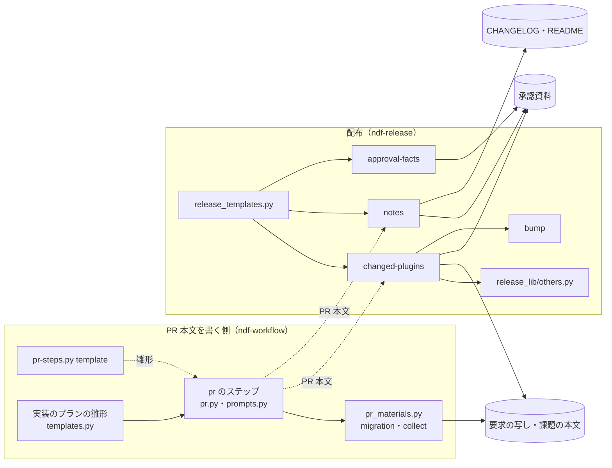
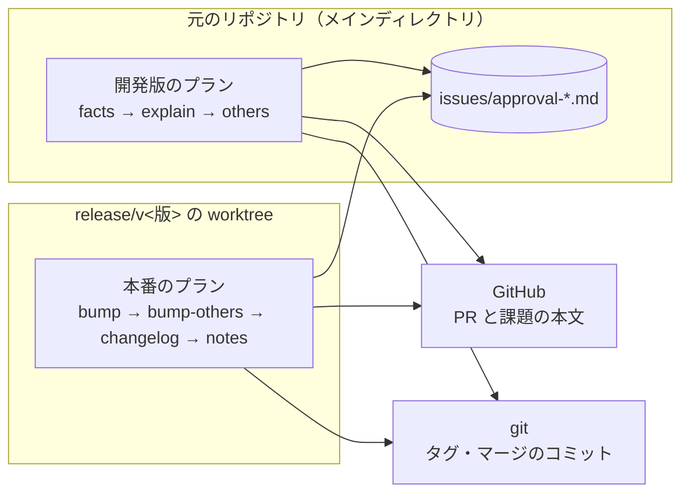
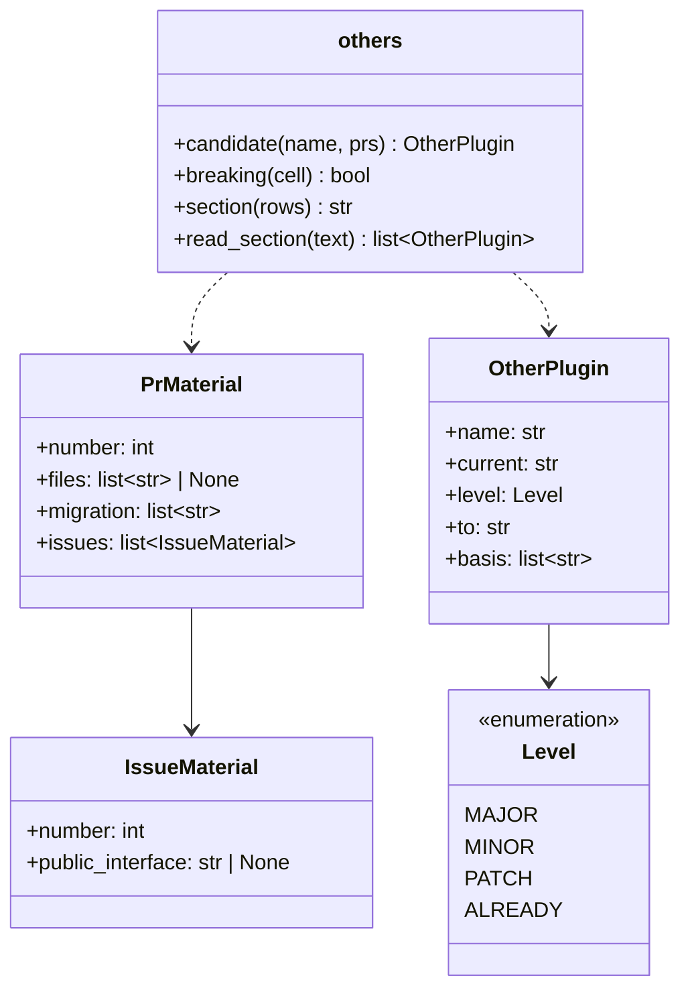
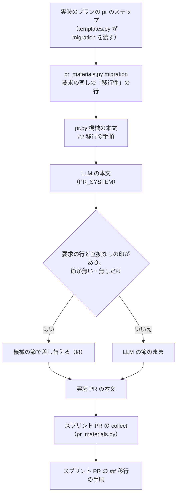
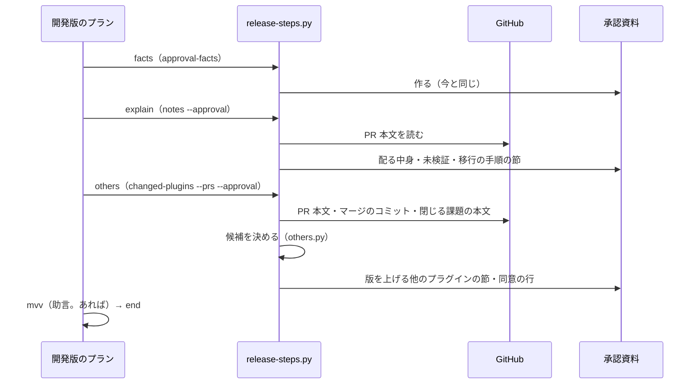
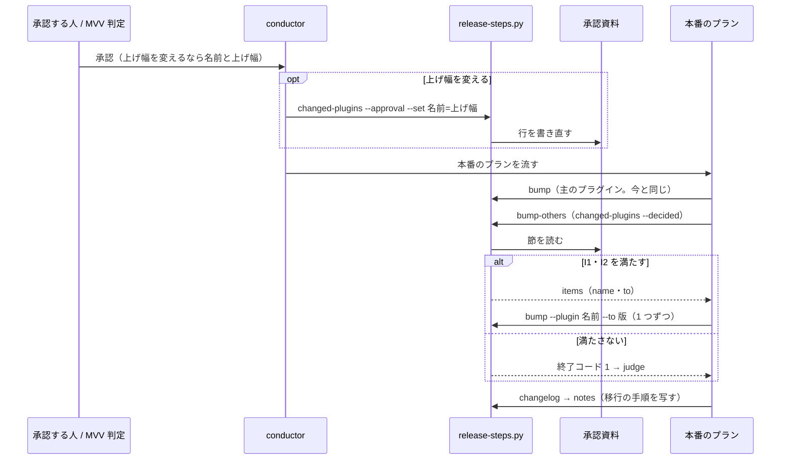

# release: 互換の無い変更でも他のプラグインが PATCH で出て、移行の手順が CHANGELOG に載らない → 承認資料に上げ幅の候補と移行の手順が載り、承認した上げ幅で版が上がり、移行の手順が CHANGELOG へ写る（#1752）

## 目的

- **何が壊れているか**: 本番の配布は他のプラグインの版を PATCH に決め打って上げ、承認ゲート 2 の承認資料にも他のプラグインの版が載らない。PR 本文に移行の手順を書く節が無く、CHANGELOG へ写す工程も無い
- **誰が困るか**: 版数から影響を判断する利用者（MAJOR の要る playwright-kit 2.0.6 が 2.0.7 で出かけた）と、承認ゲート 2 で承認する人（材料が承認資料に無く、気付かなければ通る）
- **直すと何が成り立つか**: 他のプラグインの上げ幅の候補と根拠、移行の手順が承認資料にそろい、承認した上げ幅で本番の版が上がり、移行の手順が CHANGELOG の主のプラグインの版の節へ写る

## 適用範囲

- **働く範囲**: 配布の形が `package-plugin` のリポジトリ（このリポジトリと、同じ形を宣言した配布先）。PR 本文の雛形と実装のプランの PR 本文は、NDF を使うすべてのリポジトリで働く
- **プロジェクトごとに違うもの**: 主のプラグインは宣言の `release.plugin`、他のプラグインの範囲は今の `changed-plugins` の決め方、互換の判定は NDF の要求の雛形の語で受ける。プロジェクトの名前（ndf・playwright-kit）を新たに既定へ入れない
- **当たるモード**: `standard`

## あるべき姿の根拠

| 根拠 | 種類 | 何を示すか |
| --- | --- | --- |
| `8-release-prod-state/02-bump-others.out` の `already: ["playwright-kit"]` と、#1747 の本文「playwright-kit を 2.0.6 → 3.0.0 へ上げる（… MAJOR）」 | 実測 | 手当てが無ければ playwright-kit は 2.0.7 で出ていた |
| #1747（19cc2b13）が `## [ndf 10.17.61]` に足した `### 移行` は、本番の `Release: ndf v10.17.61`（0d75b6c8）で消えた | 実測 | 今の `notes` は版の節を PR 本文の箇条で差し替える。手で足した移行の手順は次の `notes` で消えるため、正は PR 本文に置くしかない |
| PR #1745 の `gh pr view --json closingIssuesReferences` が空 | 実測 | 宛先が既定ブランチでない PR は GitHub が閉じる課題を結び付けない。課題は本文の閉じる語から読む |
| [Semantic Versioning 2.0.0](https://semver.org/lang/ja/) の 8「後方互換性を損なう変更が公開 API に導入された場合は、メジャーバージョンを上げなければならない」 | 外部の一次情報 | 互換の無い変更を含むプラグインは MAJOR を上げる |
| #1752 の依頼「人へ問わずに進め、決められない点は前提か未決として課題の本文へ書く」 | 利用者の指示の原文 | 要求の未決 5 つのうち `design` が決める 3 つ（判定の形・置き場・MINOR）をこの設計で決める |

要求と受け入れ条件は #1752 の本文にある（コピーは `issues/issue-1752-requirements.md`）。この文書は「どう作るか」だけを扱う。

## ドメインモデル

### コンテキスト

| コンテキスト | 何の語が 1 つの意味に決まるか |
| --- | --- |
| NDF のリリース（`ndf-release`） | 他のプラグイン・上げ幅・移行の手順・互換なしの印 |
| NDF の開発ワークフロー（`ndf-workflow`） | 承認資料・承認ゲート・Pull Request の本文の節 |

**公開された言語の関係を宣言する。** 開発ワークフロー（PR 本文を書く側）は PR 本文の節 `## 移行の手順` と、要求の「影響」の表の互換なしの印を、文書化した形で書く。リリース（読む側）はその形だけを読み、書き手の内部を知らない。読む側が増えても（`notes`・`changed-plugins`・スプリント PR の `collect`）、形を先に固めれば互いに独立して変えられる。

### 集約

| 集約 | 持ち主（書き換えてよいもの） | 根 | エンティティ | 値オブジェクト |
| --- | --- | --- | --- | --- |
| 承認資料 | `release-steps.py`（`approval-facts` が作り、`notes --approval` と `changed-plugins --approval` が自分の節だけを書く） | 承認資料（`issues/approval-<主>-v<版>.md`） | 他のプラグインの行（プラグイン名で識別） | 上げ幅・版・根拠・移行の手順の箇条 |
| PR 本文 | `pr` のステップ（`supervise_lib/pr.py`）と `pr-steps.py` | PR 本文 | 移行の手順の節 | 移行の手順の箇条（`（#n）` つき） |
| CHANGELOG の版の節 | `release-steps.py`（`changelog` が作り、`notes` が中身を差し替える） | 版の節（`## [<主> <版>]`） | 移行の手順の小見出し（`### 移行の手順`） | 箇条 |
| 他のプラグインの版 | `release-steps.py bump` | `plugins/<名前>/.claude-plugin/plugin.json` の `version` | — | 版 |

**承認資料の書き手は 1 つのスクリプトに限り、サブコマンドごとに書く節を分ける。** 承認資料の中の他のプラグインの行は、`changed-plugins --approval` だけが書く。本番の `bump-others` は読むだけで書かない。

### 不変条件

| # | 集約 | 条件 | 破れたときの扱い |
| --- | --- | --- | --- |
| I1 | 承認資料 | 他のプラグインの行の上げ幅は `MAJOR` / `MINOR` / `PATCH` / `上げ済み` のどれかで、`上げ済み` 以外の行の「上げた後の版」は「今の版」をその上げ幅で上げた値に等しい | 本番の `bump-others` が落ち、judge へ進む。PATCH へ倒さない |
| I2 | 他のプラグインの版 | 本番で版を上げるプラグインの集合は、承認資料の行のうち `上げ済み` でない行の集合に等しい（差分にあって表に無い・表にあって差分に無いプラグインが無い） | 本番の `bump-others` が落ち、judge へ進む |
| I3 | 承認資料 | 上げ幅の候補は、材料に互換なしの印か、そのプラグインの名前に触れる移行の手順があれば `MAJOR`、無ければ `PATCH` である。候補の決定は材料の字面だけで決まり、LLM を挟まない | — （同じ材料からは同じ候補が出る） |
| I4 | 承認資料 | 材料を読めないプラグインの候補は `PATCH` で、根拠の欄に読めなかったことが書かれる | — |
| I5 | 他のプラグインの版 | 前のタグから既に版が変わっているプラグインは上げ直さない | — （`already` へ入れる） |
| I6 | CHANGELOG の版の節 | 移行の手順の箇条を持つ PR が 0 件なら、版の節と主のプラグインの README の更新の節の中身は今と同じ（`### 移行の手順` を作らない） | — |
| I7 | CHANGELOG の版の節 | 移行の手順の箇条は `### 移行の手順` の下にだけ並び、どの箇条にも PR 番号が付く | — |
| I8 | PR 本文 | 要求の非機能の条件に「移行性」の行があり、かつ同じ要求の「公開インタフェース」の行に互換なしの印がある課題の実装 PR の `## 移行の手順` は「無し」にならない。印が無い課題（「利用者の操作は要らない」のような移行性の行）は「無し」を許す | `pr` のステップが要求の行から組んだ箇条で節を差し替える |
| I9 | 承認資料 | 主のプラグイン（宣言の `release.plugin`）は他のプラグインの行に載らない | — （列挙の段で除く） |

### ドメインイベント

| # | イベント | 発生元 | 受け手 |
| --- | --- | --- | --- |
| E1 | 実装 PR の本文に `## 移行の手順` の節を書いた | 実装のプランの `pr` のステップ | スプリント PR の `collect`、`release-steps.py notes`、`changed-plugins` |
| E2 | 前のタグからの差分にある他のプラグインを列挙した | 開発版のプランの `others` のステップ（`changed-plugins`） | E3 |
| E3 | 他のプラグインごとに上げ幅の候補を決めた | `changed-plugins --prs` | E4 |
| E4 | 承認資料に他のプラグイン・上げ幅の候補・根拠と移行の手順を書いた | `changed-plugins --approval`・`notes --approval` | 承認ゲート 2（人か MVV 判定） |
| E5 | 承認ゲート 2 で他のプラグインの上げ幅が決まった | 利用者の承認か MVV 判定（変えるときは `changed-plugins --approval --set`） | E6 |
| E6 | 本番の配布で他のプラグインの版を決まった上げ幅で上げた | 本番のプランの `bump-others`（`changed-plugins --decided`） | `bump` |
| E7 | CHANGELOG の主のプラグインの版の節に移行の手順を写した | 開発版と本番の `notes` | 利用者（CHANGELOG と README の更新の節） |

### 用語

| 用語 | 意味 | 用語集への反映 |
| --- | --- | --- |
| 他のプラグイン | 配布の宣言の `release.plugin` 以外で、前のタグからの差分にファイルがあるプラグイン | 追加（要求の段で済み。`ndf-release`） |
| 上げ幅 | 版数のどの桁を上げるか（MAJOR / MINOR / PATCH） | 追加（要求の段で済み。`ndf-release`） |
| 移行の手順 | 利用者が新しい版へ移るときに自分で行う操作。PR 本文の `## 移行の手順` の節が正 | 追加（要求の段で済み。`ndf-release`） |
| 互換なしの印 | 要求の「影響」の表の「公開インタフェース」の行に書く、互換の経路を持たないことを示す語（`互換なし` か `互換の経路は持たない`） | 追加（`ndf-release`） |

## 機能一覧

| # | 機能 | 誰が使うか |
| --- | --- | --- |
| F1 | 開発版の配布で、他のプラグインと上げ幅の候補・根拠を承認資料に載せる | 承認ゲート 2 で承認する人と MVV 判定 |
| F2 | 承認ゲート 2 で上げ幅を変え、承認資料の行を書き直す | 承認する人（conductor が代わりに打つ） |
| F3 | 本番の配布で、承認資料の上げ幅で他のプラグインの版を上げる | 本番のプラン |
| F4 | PR 本文に `## 移行の手順` を書く（雛形・実装の PR・スプリント PR） | PR を書く人と AI |
| F5 | 移行の手順を CHANGELOG の版の節・主のプラグインの README の更新の節・承認資料へ写す | 利用者と承認する人 |

## 構成要素

| 要素 | 責務 |
| --- | --- |
| `release_lib/others.py`（新規） | 他のプラグインの上げ幅の候補を材料の字面から決める純粋な処理と、承認資料の「版を上げる他のプラグイン」の節の組み立て・読み取り。I1〜I4・I9 を守る |
| `release-steps.py changed-plugins` | 他のプラグインを列挙し（今の決め方のまま）、`--prs` なら PR と課題を読んで候補を出し、`--approval` なら承認資料へ節を書き、`--decided` なら承認資料の上げ幅で `to` を決める |
| `release-steps.py notes` | PR 本文の `## 移行の手順` を読み、CHANGELOG の版の節と README の更新の節へ `### 移行の手順` として写す。`--approval` なら承認資料の `## 移行の手順` の節へ書く |
| `lib/versions.py` | `next_version(版, 上げ幅)` を足す。`next_patch` は残す |
| `lib/gh_sections.py` | 節の箇条を `<本文>（#n）` で返す `section_items` を足し、`release-steps.py` の `change_items` と `pr_materials.change_lines_of` の 2 つの同じ処理をこれへ寄せる |
| `lib/closing.py`（新規） | 閉じる語の正規表現 `CLOSING` と `closing_issues`。`pr-steps.py` から移し、`release-steps.py` からも使う |
| `supervise_lib/release_templates.py` | 開発版のプランの `explain` の次に `others` のステップを足し（`explain` の `next` は `others`、`others` の `next` が今の `mvv` / `end`）、judge と fix の `run_ids` へ入れる。本番の `bump_others_cmd` に `--decided <承認資料>`（`_material_path` と同じパス）を渡す |
| `supervise_lib/pr_materials.py` | `collect` が実装の PR の移行の手順も集める。`migration` の材料が要求の非機能の条件の「移行性」の行と、「公開インタフェース」の行の互換なしの印の有無を読む |
| `supervise_lib/pr.py` | 機械の本文に `## 移行の手順` を置き、LLM の本文が I8 を破れば節を差し替える |
| `supervise_lib/prompts.py` の `PR_SYSTEM` | `## 移行の手順` の節を書かせ、無ければ「- 無し」と書かせる |
| `supervise_lib/templates.py` | 実装のプランの `pr` のステップに `migration` の材料を常に渡す |
| `pr-steps.py` の `BODY_TEMPLATE` | `## 移行の手順` の節を足す |
| 文書（`release` の `form-package-plugin.md`・`release-steps.md`・`SKILL.md`、`pr` の `SKILL.md`、`requirements-design` の `spec-template.md`） | 手順の説明と、互換なしの印の書き方 |



`lib/versions.py`・`lib/gh_sections.py`・`lib/closing.py` は共通の層で、図から外す（呼ぶのは `changed-plugins`・`notes`・`pr_materials.py`・`pr-steps.py`）。文書の行も図から外す。

### システムの文脈と配置



承認資料はメインディレクトリの `issues/` に置かれ、コミットしない（今と同じ）。本番の `bump-others` は worktree で動き、承認資料を元のリポジトリのパスで読む（MVV 判定の `--material` と同じパス。`_material_path`）。

## 構造



`PrMaterial.files` は PR のマージのコミットの第 1 親との差分のパス。読めなければ `None`（I4）。`IssueMaterial.public_interface` は課題の本文の `## 影響` の表で、1 列目が「公開インタフェース」の行の 2 列目。

## 入出力の契約

### `release-steps.py changed-plugins`

```text
changed-plugins [--since <タグ>] [--plugin <名前>] [--root <dir>]
                [--prs <PR番号>...] [--approval <承認資料> [--set <名前>=<上げ幅>]...]
                [--decided <承認資料>]
```

| 引数 | 振る舞い |
| --- | --- |
| （無し） | 今と同じ。items の `to` は PATCH を 1 つ上げた版。`level: "patch"`、`basis: ["材料を渡していない"]` を足す |
| `--prs` | PR ごとに本文・状態・マージのコミットを読み、閉じる語の課題の本文を読み、候補（I3・I4）を出す。未マージの PR は材料に入れない |
| `--approval` | 承認資料の `## 版を上げる他のプラグイン` の節を書く（あれば差し替える）。0 件なら節の中身は「- 無し」。1 件以上なら `## 同意を求めること` に同意の行を 1 つ足す（既にあれば足さない） |
| `--set <名前>=<上げ幅>` | `--approval` と一緒にだけ受ける。その行の上げ幅と上げた後の版を書き換え、根拠の先頭に「承認ゲート 2 で <上げ幅> に決めた」を足す。表に無い名前・知らない上げ幅は終了コード 2 |
| `--decided` | 承認資料の節を読み、items の `to` を表の上げ幅から決める。`--prs`・`--approval` とは一緒に受けない（終了コード 2） |

結果の 1 行の JSON（既存のキーは残す）:

```json
{"tool": "release-steps", "status": "ok",
 "items": [{"kind": "plugin", "name": "playwright-kit", "result": "bump",
            "from": "2.0.6", "to": "3.0.0", "level": "major",
            "basis": ["#1745 が閉じる #744 の公開インタフェース: 互換の経路は持たない"]}],
 "metrics": {"since": "ndf--v10.17.60", "plugins": 1, "already": [], "decided": null}}
```

| 終了コード | いつ |
| --- | --- |
| 0 | 列挙し（`--approval` なら書き、`--decided` なら読み）終えた |
| 1 | `--decided`: 節が無い・表の形が違う・上げ幅を読めない・上げた後の版が合わない（I1）・集合が合わない（I2）。`--approval`: 承認資料が無い |
| 2 | 前のタグが無い（今と同じ）・版を読めない・引数の組み合わせが違う |

**`--decided` で 0 件のときは承認資料を読まない。** 他のプラグインが無い版で、承認資料の無いことを理由に本番を止めない。

### 承認資料の節

`changed-plugins --approval` が `## 未検証・残る危険` と `## 同意を求めること` の間へ置く。

```markdown
## 版を上げる他のプラグイン

上げ幅は材料から機械で出した候補である。変えるときは `release-steps.py changed-plugins --approval <この資料> --set <名前>=<上げ幅>` で書き直してから承認する。

| プラグイン | 今の版 | 上げ幅 | 上げた後の版 | 根拠 |
| --- | --- | --- | --- | --- |
| playwright-kit | 2.0.6 | MAJOR | 3.0.0 | #1745 が閉じる #744 の公開インタフェース: 互換の経路は持たない |
| mcp-serena | 1.4.2 | 上げ済み | 1.5.0 | 前のタグから版が変わっている |
```

| 列 | 値 |
| --- | --- |
| プラグイン | 他のプラグインの名前 |
| 今の版 | 前のタグの版（`上げ済み` の行は前のタグの版） |
| 上げ幅 | `MAJOR` / `MINOR` / `PATCH` / `上げ済み` |
| 上げた後の版 | 今の版を上げ幅で上げた版（`上げ済み` の行は HEAD の版） |
| 根拠 | 候補を決めた材料。複数なら `<br>` で区切る。材料が無ければ「材料に互換の無い変更の記述が無い」、読めなければ「#n を読めない（<理由>）」 |

`notes --approval` は同じ位置へ `## 移行の手順` の節を置く。中身は PR ごとの箇条（`（#n）` つき）で、0 件なら「- 無し」である。どちらの節も、走らせ直したら差し替える（`未検証・残る危険` の節の挿し方を同じ関数へ寄せる）。

### 上げ幅の候補の規則（I3）

プラグイン P の候補は、材料のうち P のパス（`plugins/P/` か `plugins/mcp/P/`。今の `changed-plugins` の決め方）に触れた PR だけから決める。

| 材料 | MAJOR になる条件 | 根拠の欄 |
| --- | --- | --- |
| PR の閉じる語が指す課題の本文 | `## 影響` の表の「公開インタフェース」の行に互換なしの印（`互換なし` か `互換の経路は持たない`）がある | `#<PR> が閉じる #<課題> の公開インタフェース: <印>` |
| PR 本文の `## 移行の手順` | 箇条のどれかが P の名前に語として触れる（前後が英数字と `-` でない） | `#<PR> の移行の手順が <P> に触れる` |

どちらにも当たらなければ `PATCH`。MINOR の候補は出さない（決定 4）。

### PR 本文の節

`pr-steps.py template` の雛形と `PR_SYSTEM` は、`## 利用者向けの変化` の次に次の節を持つ。

```markdown
## 移行の手順

- <利用者が新しい版へ移るときに自分で行う操作（引数の置き換え・認証のし直し・導入し直し）。プラグインの名前を書く。無ければ「無し」>
```

実装のプランの `pr` のステップは、`migration` の材料として、プランの課題ごとに要求の写し（`issues/issue-<番号>-requirements.md`）の `## 非機能の条件` の表で 1 列目が「移行性」の行の 2 列目を読む。行があれば `PR_SYSTEM` へ材料として渡す。同じ要求の `## 影響` の表の「公開インタフェース」の行に互換なしの印があるときだけ、機械の本文の `## 移行の手順` に `- <行の中身>（#<課題>の要求の移行性）` を置き、LLM の本文の節が無い・「無し」だけなら機械の節で差し替える（I8）。印が無いときの機械の節は「- 無し」で、LLM の節が「無し」でもそのまま残す。印の無い移行性の行の多くは「利用者の操作は要らない」と書いており、それを移行の手順として写すと CHANGELOG に操作の無い箇条が載り、プラグインの名前に触れれば I3 が互換の変更を MAJOR の候補にしてしまうためである。

スプリント PR の `collect` は、実装の PR の `## 移行の手順` の箇条を `（#n）` つきで集め、スプリント PR の `## 移行の手順` に並べる（0 件なら「- 無し」）。

### CHANGELOG と README の更新の節

`notes` は版の節の中身を次の形に差し替える。移行の手順が 0 件なら今と同じ（I6）。

```markdown
## [ndf 10.17.62] - 2026-10-10

- <利用者向けの変化の箇条（#n）>

### 移行の手順

- <移行の手順の箇条（#n）>
```

主のプラグインの README の `## v<版> へ更新するとき` の節にも同じ形で書く。

## 処理の流れ

### PR 本文の移行の手順



`pr-steps.py template` は、人が書く PR の雛形として同じ節を持つ（`/ndf:pr` の経路）。

### 開発版の配布（承認資料まで）



`others` のステップは `cwd` をメインディレクトリにし（`facts` と同じ）、落ちたら judge へ進む（E2・E4）。助言の MVV 判定は `others` の後に置き、他のプラグインの表も材料に入れる。

### 承認ゲート 2 から本番の配布まで



## 非機能の実現方式

| 大項目 | 実現方式 |
| --- | --- |
| 運用・保守性 | 候補の決定（`others.py`）と写し（`notes`・`changed-plugins --approval`）は字面と表の読み書きだけで行い、LLM を呼ばない。LLM が関わるのは実装 PR の本文の文面だけで、I8 は機械の差し替えで守る。上げ幅の最終の決定は承認ゲート 2 に残り、変える経路は `--set` の 1 つ |
| 移行性 | `## 移行の手順` の節が無い PR は、移行の手順を持たない PR として読む。承認資料の既存の欄・CHANGELOG の箇条・`changed-plugins` の既存のキーは変えない（受け入れ条件 12）。利用者の操作は要らない |
| システム環境 | 主のプラグインは宣言の `release.plugin`、他のプラグインの範囲とパスは今の `changed-plugins` の決め方を使う。互換なしの印は NDF の要求の雛形（`spec-template.md`）が定める語で、プロジェクトの名前を含まない |

## 決定の記録

### 決定 1: 互換の判定をプロジェクトに依らず決定論的にするため、要求の「公開インタフェース」の行の互換なしの印と、プラグインの名前に触れる移行の手順の 2 つを材料にする

要求の雛形は「公開インタフェース」の行に「変わる場合は互換性の扱い」を書かせており、互換の扱いを書く場所が既にある。そこへ置く語を `互換なし` と、#744 が使った `互換の経路は持たない` の 2 つに固定し、`spec-template.md` に「互換の経路を持たないときは `互換なし` と書く」を足す。語を固定するのは、「変わる」や「互換の無い」だけでは否定の文（#1752 自身の「互換の無い削除はしない」）と区別できないためである。PR 本文の移行の手順は、利用者の操作が要る＝互換が無いことの直接の記述であり、プラグインの名前に触れる箇条だけを当てる。PR 本文に専用の印の節を新しく設ける案は採らない。書く工程が 1 つ増え、要求と PR の 2 か所で同じ判断を書くことになる。

根拠: Value 4 / Value 5（MVV 版 2）

### 決定 2: 承認したものと上げるものを同じにするため、決まった上げ幅の置き場を承認資料の表にする

承認ゲート 2 で人と MVV 判定が読むのは承認資料であり、本番の `bump-others` が同じ表を読めば、承認した値と上げる値が食い違わない（I1・I2）。上げ幅を変える経路は `changed-plugins --approval --set` の 1 つにし、conductor が表を手で書き換える手当てを作らない。状態ファイルに置く案は、承認資料と状態ファイルの 2 か所に同じ値が並び、片方だけ直す誤りが起きる。本番のプランの引数で渡す案は、承認の後に conductor が値を写す工程が増え、MVV 判定で通るときに写す者がいない。

根拠: Value 2 / Value 4 / Value 7（MVV 版 2）

### 決定 3: 上げ幅を読めないときに PATCH へ倒さないため、本番の `bump-others` は表の検査に落ちたら止まる

今の失敗（互換の無い変更が PATCH で出る）は黙った既定値から起きた。承認資料が無い・行が無い・上げ幅と版が合わないときは終了コード 1 で judge へ進め、直すか止めるかを判断させる。他のプラグインが 0 件の版だけは承認資料を読まずに通す。承認資料の無い単発の本番の配布を、関係の無い理由で止めないためである。

根拠: Value 3 / P1（MVV 版 2）

### 決定 4: 候補の材料を決定論で読める範囲に限るため、MINOR の候補は出さない

機能の追加だけを示す記述は要求の雛形に固定の語が無く、字面からは決められない。候補は MAJOR と PATCH の 2 つにし、MINOR は承認ゲート 2 で `--set <名前>=MINOR` として選ぶ。PATCH は今の `changed-plugins` と同じ値で、互換の無い変更を見落とす向きの退行は起きない。

根拠: Value 1 / Value 4（MVV 版 2）

### 決定 5: 版に含む PR から課題へたどるため、課題は PR 本文の閉じる語から読む

宛先が既定ブランチでない PR（スプリント PR #1745）は、GitHub の `closingIssuesReferences` が空になる（実測）。PR 本文の `Closes #n` の行はスプリント PR の `## 閉じる課題` が必ず持つ。閉じる語の正規表現は `pr-steps.py` の `CLOSING` を `lib/closing.py` へ移して 1 つにする。

根拠: Value 6（MVV 版 2）

### 決定 6: 同じ役割の関数を分けないため、節の箇条を読む処理を `lib/gh_sections.py` の 1 つに寄せる

`release-steps.py` の `change_items` と `pr_materials.change_lines_of` は同じ処理（箇条を `（#n）` つきに直し、「無し」を落とす）で、移行の手順でも同じ処理が 3 か所目に要る。3 か所目を書き足さず、2 つを 1 つへ寄せてから使う。

根拠: Value 6（MVV 版 2）

### 決定 7: 移行の手順を版の節の中へ置くため、見出しを `### 移行の手順` にして主のプラグインの節の中へ写す

版の節（`## [<主> <版>]`）の境は `changelog_span` が `## ` で決めるため、`### ` の小見出しは節の中に留まり、既存の読み取りを変えない。小見出しの語は PR 本文の節と同じ「移行の手順」にそろえる（1 語 1 意味）。他のプラグイン自身の版の節（`## [playwright-kit 3.0.0]`）は作らない（要求の前提 8）。

根拠: Value 8（MVV 版 2）

### 決定 8: 要求の移行の条件を PR 本文から落とさないため、LLM の本文を機械の節で差し替える

`PR_SYSTEM` に節を書かせるだけでは、LLM が「無し」と書いたときに I8 が破れる（#1744 は移行の条件を落とした）。要求に「移行性」の行があり、「公開インタフェース」の行に互換なしの印がある課題では、LLM の節が無い・「無し」だけなら、要求の行から組んだ機械の節で差し替える。LLM の書いた具体的な手順は、「無し」でない限り残す。

差し替えを移行性の行の有る無しだけで決めない。既存の要求の移行性の行の多く（#1407・#1437・#1752 自身など）は「利用者の操作は要らない」「既存の宣言はそのまま動く」と書いており、これを差し替えると、用語集の「移行の手順」（利用者が自分で行う操作）に当たらない箇条が CHANGELOG へ写り、プラグインの名前に触れれば I3 が互換の変更を MAJOR の候補にする。利用者の操作が要るかどうかは、決定 1 が互換の判定に使う互換なしの印で字面だけで決める（新しい印を設けず、LLM を挟まない）。#744 は印（`互換の経路は持たない`）を持つため、#1744 の取りこぼしは防げる。受け入れ条件 9（要求の写し `issues/issue-1752-requirements.md` の受け入れ条件）は、この限定のとおり、印のある課題で節が「無し」以外になり、印の無い課題では移行性の行を材料に渡すところまでを求める。

根拠: Value 4（MVV 版 2）

## テスト設計

| 受け入れ条件・不変条件 | どの振る舞いで縛るか | どう壊したら落ちるべきか |
| --- | --- | --- |
| 1 | 開発版の package-plugin のプランに `others` のステップがあり、`changed-plugins --prs --approval` を打つ。他のプラグインが 0 件なら承認資料の節の中身が「- 無し」 | ステップを外す・0 件で節を書かないと落ちる |
| 2 | 承認資料の表の行がプラグイン・今の版・上げ幅・上げた後の版・根拠を持つ | 根拠の列を落とすと落ちる |
| 3 / I3 | m744 を再現した入力（playwright-kit 2.0.6、スプリント PR #1745 の本文と `Closes #744`、#744 の本文、マージのコミットの差分に playwright-kit のファイル）で候補が MAJOR・3.0.0。移行の手順がプラグインの名前に触れる PR でも MAJOR | 印の語を照合から外す・名前の照合を外すと落ちる |
| 3 / I3（否定の文） | 「互換の無い削除はしない」だけの行は PATCH | 「互換の無い」を印に足すと落ちる |
| 4 | 材料に印が無いプラグインの候補は PATCH で、`to` は `--prs` を渡さない今の結果と同じ | PATCH の計算を変えると落ちる |
| I4 | PR のマージのコミットを読めないとき PATCH で、根拠に読めなかったことが出る | 読めないときに落ちる・黙って空の根拠にすると落ちる |
| 5 | 承認資料の表が MAJOR の playwright-kit 2.0.6 で、`bump-others` の `--decided` が `to: 3.0.0` を返す | `--decided` を読まずに PATCH を返すと落ちる |
| 6 / I1 | 承認資料が無い・上げ幅が読めない・上げた後の版が合わないとき終了コード 1 | 読めないときに PATCH を返すと落ちる |
| I2 | 差分にあって表に無いプラグイン・表にあって差分に無いプラグインで終了コード 1 | 集合の照合を外すと落ちる |
| 7 / I5 | 前のタグから版が変わったプラグインは `already` に入り、表の `上げ済み` の行は上げない | `already` を items へ入れると落ちる |
| I9 | 主のプラグインは表に載らない | 除外を外すと落ちる |
| F2 | `--set playwright-kit=MINOR` で行が 2.1.0 と根拠つきに変わる。表に無い名前は終了コード 2 | `--set` が版を直さないと落ちる |
| 8 | `pr-steps.py template` の結果の `sections` と `PR_SYSTEM` が `## 移行の手順` を持つ | 節を外すと落ちる |
| 9 / I8 | 要求に「移行性」の行と互換なしの印がある課題で、LLM が「- 無し」を返しても PR 本文の節が要求の行の箇条になる | 差し替えを外すと落ちる |
| 9 / I8（操作の要らない行） | 要求に「移行性」の行（「利用者の操作は要らない」）があり互換なしの印が無い課題で、LLM が「- 無し」を返すと PR 本文の節は「- 無し」のまま。行は `PR_SYSTEM` の材料に渡る | 印を見ずに差し替えると落ちる |
| 9（collect） | スプリント PR の `collect` が実装の PR の移行の手順を `（#n）` つきで集める | 集めないと落ちる |
| 10 / I7 | `notes` が移行の手順を `### 移行の手順` の下へ `（#n）` つきで写す。README の更新の節にも写る | 見出しの外へ書くと落ちる |
| 10 / I6 | 移行の手順を持つ PR が 0 件なら版の節に `### 移行の手順` が無い | 0 件で見出しを作ると落ちる |
| 11 | `notes --approval` が承認資料の `## 移行の手順` に箇条を書き、0 件なら「- 無し」 | 節を書かないと落ちる |
| 12 | 節の無い PR だけの版で、`notes` の CHANGELOG・README と、`approval-facts`・`notes --approval` の既存の欄と、`--decided` の `to`（表が PATCH）が今の結果と同じ | 既存の欄の形を変えると落ちる |
| 13 | 全体テスト `uv run --frozen --project . --all-extras pytest . -q -n 4` が通る | — |

テストは `plugins/ndf/scripts/tests/` の `test_release_steps.py`（`changed-plugins`・`notes`）・`test_supervise.py`（プランの雛形と `pr` のステップ）・`test_pr_steps.py`（雛形）に足す。gh の出力は今のテストと同じく偽の `gh` で渡す。

## 設計の結果

| 課題 | 扱い | 取り込み先 | 触るファイル |
| --- | --- | --- | --- |
| #1752 | 実装する | — | `plugins/ndf/scripts/release-steps.py`、`plugins/ndf/scripts/release_lib/`、`plugins/ndf/scripts/lib/versions.py`、`plugins/ndf/scripts/lib/gh_sections.py`、`plugins/ndf/scripts/lib/closing.py`、`plugins/ndf/scripts/pr-steps.py`、`plugins/ndf/scripts/supervise_lib/`、`plugins/ndf/scripts/tests/`、`plugins/ndf/skills/release/`、`plugins/ndf/skills/pr/SKILL.md`、`plugins/ndf/skills/requirements-design/references/spec-template.md` |

## 未確認のまま残ること

| 項目 | 内容 |
| --- | --- |
| P1 に当たるか | 上げ幅を可変にすることは、セマンティックバージョニングの規則も取得元も既定ブランチも変えず、プランが規則に従えるようにする変更である（要求の前提 4）。設計の推奨は「当たらない」だが、要求の未決のとおり承認ゲート 1 は人が決め、MVV 判定に任せない |
| 受け入れ条件 3 の入力の名指し | 条件は「PR #1744 と課題 #744 の本文」と書くが、m744 の配布の `--prs` はスプリント PR #1745 で、#1744 の本文には閉じる語が無い。テストはスプリント PR #1745（`Closes #744`）を版に含む PR として再現する |
| 印の付け漏れ | 互換なしの印も移行の手順も書かれていない互換の無い変更は、候補が PATCH のまま承認資料に載る。承認する人が根拠の欄の「材料に互換の無い変更の記述が無い」を見て判断する |
| MAJOR の過剰 | 1 つの PR が互換の無い課題と、関係の無いプラグインの小さな変更を同時に持つと、そのプラグインも MAJOR の候補になる。過剰の向きで、承認ゲート 2 で `--set` で下げる |
| 移行性の行の中身 | 互換なしの印が無い課題（「利用者の操作は要らない」のような移行性の行）では、I8 は節を差し替えず、PR 本文の節は「無し」のままになりうる。移行性の行は `PR_SYSTEM` の材料に渡るだけで、LLM が具体的な手順を書けば残る。利用者の操作が要るのに印を付け漏らした課題では、移行の手順が CHANGELOG に載らない |
| 版の節へ手で足した文 | `notes` は今と同じく版の節を差し替えるため、PR 本文に無い文を CHANGELOG の主のプラグインの節へ手で足しても次の `notes` で消える。正は PR 本文の節だけである |
| 範囲外として起票したもの | リリース済みの 10.17.61 の節から消えた移行の手順は #1755、プラグインの置き場を名前で決め打つ `plugin_dir` と `changed-plugins` は #1756 |
| 他のプラグイン自身の CHANGELOG の節 | 作らない（要求の前提 8）。作るかは振り返りか次のスプリントの棚卸しで決める（要求の未決） |
