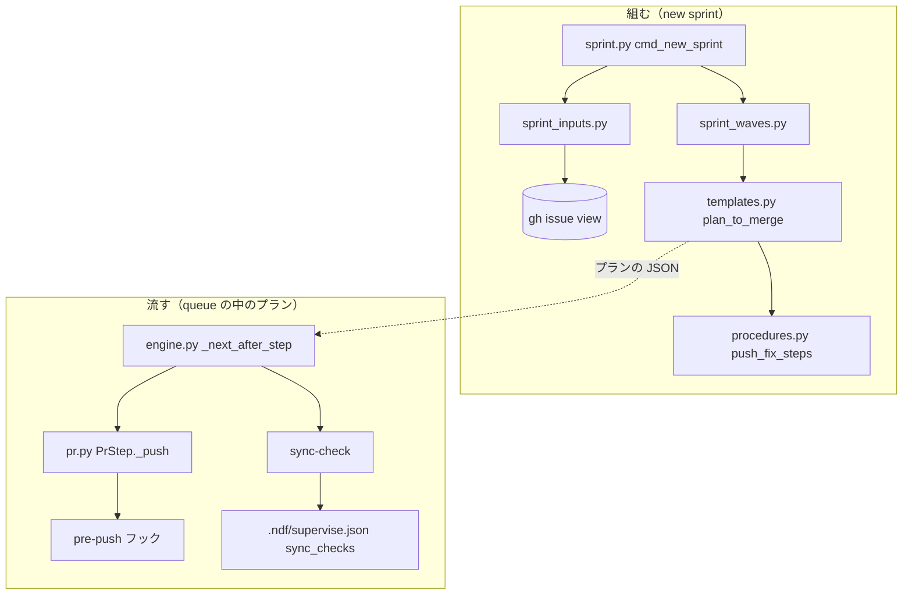
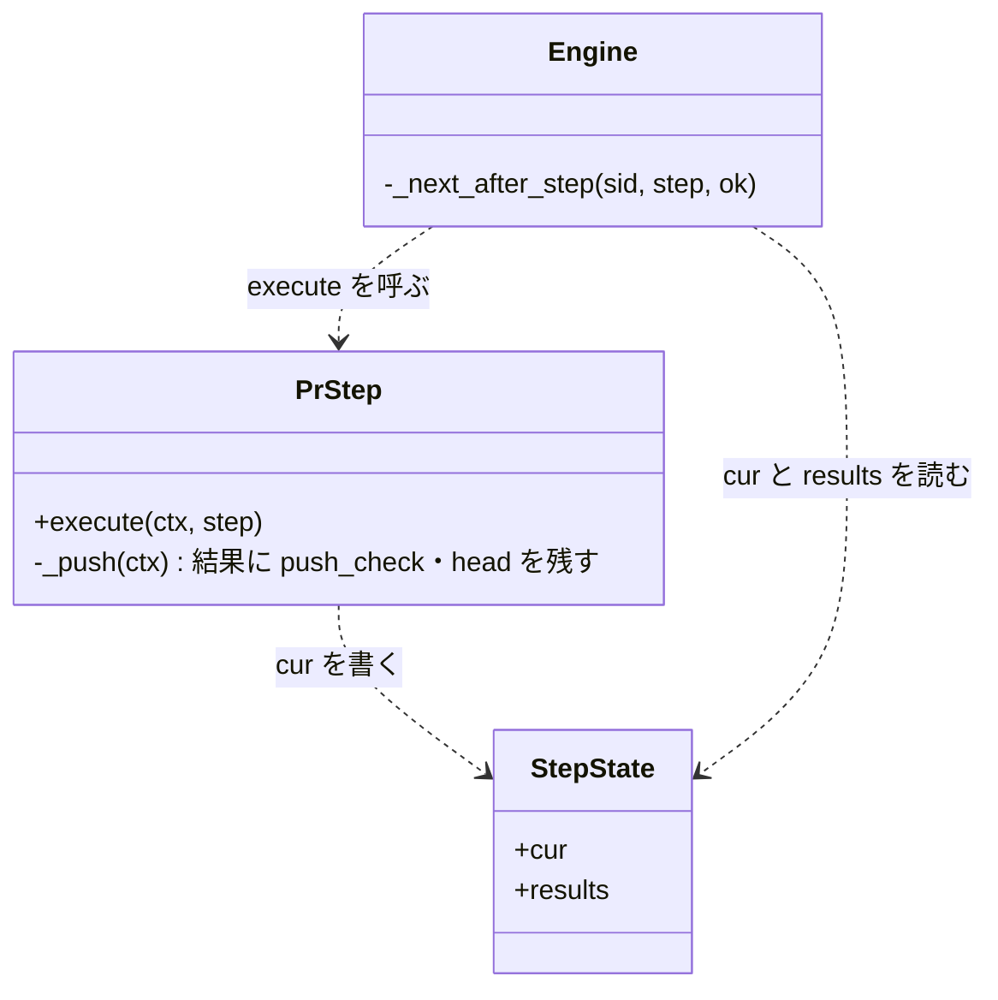
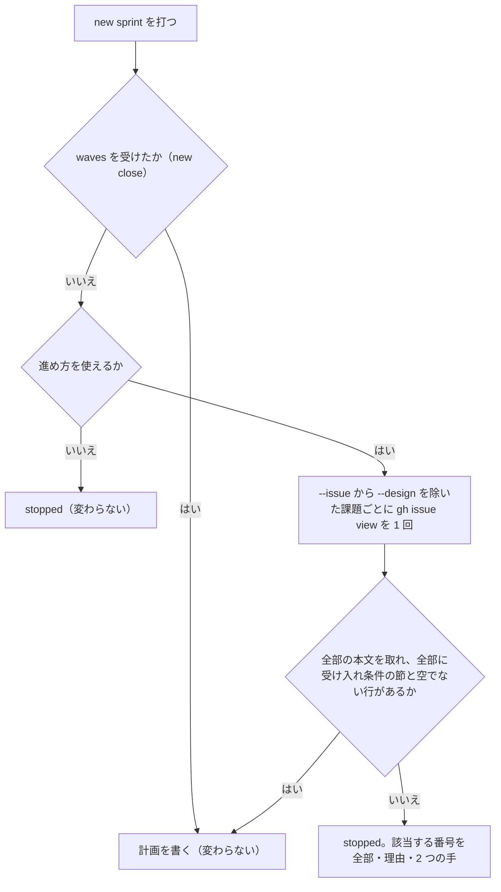
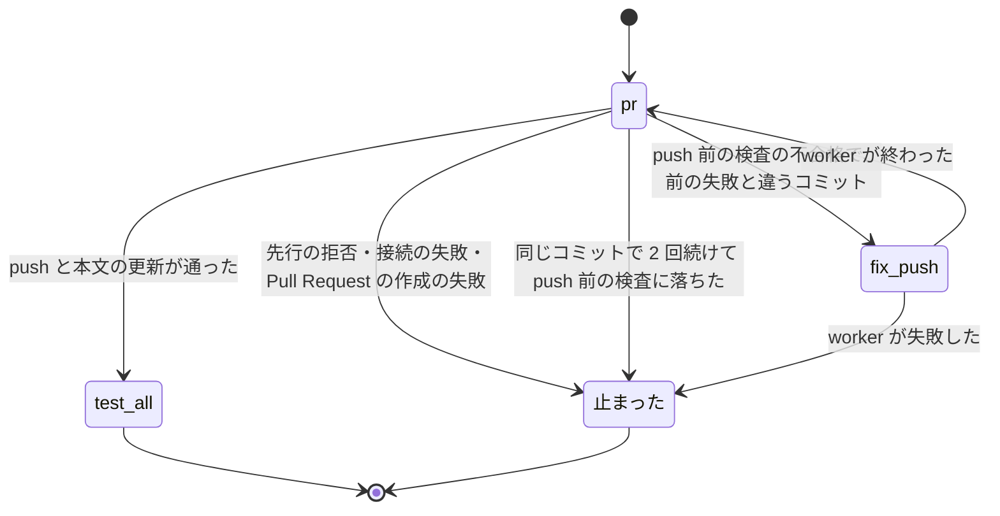

# supervise new sprint: 受け入れ条件の無い課題と push 前の検査の不合格でスプリントの実装のプランがキューの中で止まる → 受け入れ条件の無い課題は計画を書く前に止まって知らされ、push 前の検査の不合格は修正の worker が直して打ち直す（#1767 #1751）

## 目的

- **何が壊れているか**: `supervise.py new sprint` が組む実装のプランは、受け入れ条件の無い課題でも、push 前の検査を `sync` で確かめないままでも流れ、キューの中で止まる（m815 の #1685・m744 の #744）
- **誰が困るか**: conductor と利用者。止まるたびに利用者へ問い・本文を書き・手で直し・プランを流し直す手当てが要る
- **直すと何が成り立つか**: 受け入れ条件の無い課題は承認ゲート 1 より前に番号と次の手つきで知らされる。push 前の検査の不合格は `sync` で見つかるか、`pr` のステップの後の修正で直り、プランが止まらない

## 適用範囲

- **働く範囲**: 配布先のリポジトリでも働く。受け入れ条件の確かめと `pr` の修正の経路は雛形（`plugins/ndf/scripts/supervise_lib/`）に入る。`sync_checks` への 2 本の追加はこのリポジトリの宣言（`.ndf/supervise.json`）だけ
- **プロジェクトごとに違うもの**: push 前の検査の中身は、各リポジトリの `pre-push` フック（`core.hooksPath`）と `.ndf/supervise.json` の `sync_checks` が持つ。雛形は検査のコマンド名を持たない
- **当たるモード**: `new sprint` の normal / fast / auto（受け入れ条件の確かめ）。`plan_to_merge` が組む実装のプラン（スプリントの実装・`new impl`・`new fix`。`pr` の修正の経路）

## あるべき姿の根拠

| 根拠 | 種類 | 何を示すか |
| --- | --- | --- |
| `~/.local/state/ndf/sv/sprint-m815/5-impl-1685-state/01-impl.out`（25 秒・$0.275 で `判断が要る`） | 実測 | 受け入れ条件の無い課題は、組む時点で見つけないと実装の worker の起動 1 回を使ってから止まる |
| `~/.local/state/ndf/sv/sprint-m744/5-impl-744-state/06-pr.out`（push が exit=1） | 実測 | `sync` と範囲テストを通った変更が、push 前の検査で落ちてプランが止まった |
| 2026-10-05 に一時のリポジトリで実測した `git push` の出力（下の「push の失敗の形」） | 実測 | push 前の検査の不合格・先行の拒否・接続の失敗は、終了コードと `! [` の行で見分けられる。フックの標準出力は `git push` の標準出力へ出る |
| 依頼の原文（「どちらも supervise new sprint が組む実装のプランの不足の問題として 1 本の設計で扱う」） | 利用者の指示の原文 | 2 つの課題を 1 本の設計で扱う |

要求と受け入れ条件は #1767 の本文にある（写しは [issue-1767-requirements.md](issue-1767-requirements.md)）。#1751 の受け入れ条件は #1767 の受け入れ条件 6〜11 へ取り込んである。この文書は「どう作るか」だけを扱う。

### 例: 変えた後の形で m815 と m744 を流すと

1. conductor が `supervise.py new sprint --issue 815 1273 1752 1685 659 --design 815 1273 1752` を打つ
2. `new sprint` が `--design` に無い #1685 と #659 の本文を `gh issue view` で 1 回ずつ取る。#1685 に `## 受け入れ条件` が無い
3. 計画を書かずに `stopped` を返す。`items` に `{"issue": 1685, "reason": "受け入れ条件の節が無い"}`、`next` に「#1685 を `--design` へ入れて打ち直す（コマンド）」と「#1685 の本文に `## 受け入れ条件` を書いて打ち直す」が載る
4. conductor が `--design` に #1685 を足して打ち直す。#1685 は設計の工程で要求を書き、承認ゲート 1 で他の設計と一緒に承認される
5. m744 の実装のプランでは、`sync` の `validate` が description の Skill 数の食い違いで落ち、既存の `fix-sync` が直す
6. `sync` に無い検査が `pr` の push で落ちたときは、`pr` のステップが push の出力を残し、`fix-push` の worker が直してコミットし、`pr` を打ち直す

## ドメインモデル

### コンテキスト

| コンテキスト | 何の語が 1 つの意味に決まるか |
| --- | --- |
| NDF の開発ワークフロー（`ndf-workflow`） | プラン・ステップ・実装のプラン・受け入れ条件・push 前の検査 |

コンテキストは 1 つで、関係の宣言は要らない。

### 集約

| 集約 | 持ち主（書き換えてよいもの） | 根 | エンティティ | 値オブジェクト |
| --- | --- | --- | --- | --- |
| スプリントの計画 | `supervise.py new sprint`（`sprint.py` の `cmd_new_sprint`） | `sprint.json` | ステージ・計画のファイル | 課題の番号・受け入れ条件の有無 |
| 実装のプラン | 雛形 `plan_to_merge`（`templates.py`） | プランの JSON | ステップ（`pr`・`fix-push`） | `on_fail`・`on_fail_only`・上限 |
| プランの実行の状態 | 駆動（`engine.py` と `pr.py` の `pr` のハンドラー） | 状態ディレクトリ | ステップの結果 | 終了コード・出力・push したコミット |
| 同期とチェックの宣言 | 利用者（C7） | `.ndf/supervise.json` | `sync_checks` の行 | 名前・コマンド |

### 不変条件

| # | 集約 | 条件 | 破れたときの扱い |
| --- | --- | --- | --- |
| I1 | スプリントの計画 | `--design` に無い課題は、本文の `## 受け入れ条件` の節に空でない行を 1 行以上持つ。持たない課題があれば、`sprint.json` も計画のファイルも書かれない | 計画を書かずに `stopped` を返し、該当する番号を全部載せる |
| I2 | スプリントの計画 | 本文を取れなかった課題は確かめずに通さない | 計画を書かずに `stopped` を返し、番号と `gh` の出力を載せる |
| I3 | 実装のプラン | `fix-push` へ回るのは、push 前の検査の不合格（終了コード 1 で、`! [` で始まる拒否の行が無い）だけである | ほかの失敗はこれまでどおり `止まった` で終わる |
| I4 | プランの実行の状態 | 同じコミットで 2 回続けて push 前の検査に落ちたら、`fix-push` へ回さない | `止まった` で終わり、最後の push の出力を残す |
| I5 | 実装のプラン | 雛形のコードは、特定のリポジトリの検査のコマンド名を持たない | 実装の検査（テスト）で落とす |

### ドメインイベント

| # | イベント | 発生元 | 受け手 |
| --- | --- | --- | --- |
| E1 | `--design` に無い課題の本文を取った | `new sprint` | 受け入れ条件の確かめ |
| E2 | 受け入れ条件の無い課題を見つけて止まった | 受け入れ条件の確かめ | conductor（結果の `items` と `next`） |
| E3 | スプリントの計画を書いた | `new sprint` | queue |
| E4 | `sync` が push 前の検査の不合格を見つけた | `sync-check` | `fix-sync` の worker |
| E5 | `pr` の push が push 前の検査で拒まれた | `pr` のハンドラー | `fix-push` の worker |
| E6 | 修正しても直らずにプランが止まった | 駆動 | conductor（プランの報告） |

### 用語

| 用語 | 意味 | 用語集への反映 |
| --- | --- | --- |
| push 前の検査 | `core.hooksPath` の `pre-push` フックが `git push` の前に打つ検査。不合格なら push が拒まれる | 追加（`ndf-workflow`） |
| push の修正 | 実装のプランで、push 前の検査の不合格を直してコミットし、`pr` のステップを打ち直させる修正の worker（`fix-push` のステップ） | 追加（`ndf-workflow`） |

## 機能一覧

| # | 機能 | 誰が使うか |
| --- | --- | --- |
| F1 | `new sprint` が、`--design` に無い課題の受け入れ条件を計画を書く前に確かめ、無ければ止まって番号と次の手を返す | conductor |
| F2 | 実装のプランの `pr` が push 前の検査で落ちたとき、修正の worker が直して打ち直す | 駆動（queue の中のプラン） |
| F3 | 直せない push の失敗と、直しても同じコミットで落ちる失敗は、修正へ回さずに止める | 駆動 |
| F4 | このリポジトリの `sync` が、`pre-push` フックと同じ 2 本の検査を打つ | このリポジトリの実装のプラン・リリースプラン |

## 構成要素

| 要素 | 責務 | 変更 |
| --- | --- | --- |
| `sprint_inputs.py`（新規。`supervise_lib/`） | `--design` に無い課題の本文を取り、`## 受け入れ条件` の節の有無を判定して、足りない課題と取れなかった課題の一覧を返す | 追加 |
| `sprint.py` の `cmd_new_sprint` | `waves` を受けない（スプリントを組む）ときだけ、進め方の確かめの後・計画を書く前に `sprint_inputs` を呼び、足りなければ `stopped` を返す | 変更 |
| `procedures.py` | `pr` の修正の経路（`pr` のステップへ足す `on_fail`・`on_fail_only` と `fix-push` のステップ）を組む関数 `push_fix_steps` を持つ | 追加 |
| `templates.py` の `plan_to_merge` | `pr_step` に `push_fix_steps` を当て、`fix-push` のステップを並べる | 変更 |
| `pr.py` の `PrStep._push` | push の出力を標準出力と標準エラーの両方で残す。失敗を「push 前の検査の不合格」か否かに分け、押したコミットを結果に残す | 変更 |
| `engine.py` の `Engine._next_after_step` | ステップの `on_fail_only` に当たらない失敗を `on_fail` へ回さずに止める | 変更 |
| `.ndf/supervise.json` の `sync_checks` | `validate`（`bash scripts/validate-runtime-plugins.sh`）と `lint`（`bash scripts/check-lint.sh`）の 2 行を足す | 変更（C7） |
| `plan.py` のプランの説明 | ステップの `on_fail_only` の意味を足す | 変更 |



図に含めないもの: `plan.py`（プランの説明の文字列だけを変え、呼び出しの関係を持たない）。

### 構造



`StepState` は `state.py` の状態の型（名前だけ）。`PrStep` と `Engine` は、上に書いた操作だけが変わる。

### パッケージ・モジュール構成

```text
plugins/ndf/scripts/supervise_lib/
├── sprint_inputs.py   追加: 受け入れ条件の確かめ
├── sprint.py          変更: cmd_new_sprint が呼ぶ
├── procedures.py      変更: push_fix_steps
├── templates.py       変更: plan_to_merge が当てる
├── pr.py              変更: _push
├── engine.py          変更: _next_after_step
└── plan.py            変更: on_fail_only の説明
.ndf/supervise.json    変更: sync_checks に 2 行（C7）
```

## 入出力の契約

### `supervise.py new sprint` の結果

| 項目 | 書くこと |
| --- | --- |
| 名前 | `supervise.py new sprint`（`new close` は変わらない） |
| 入力 | 変わらない。`--issue`（必須）と `--design`（任意）の差が確かめの対象になる |
| 出力（成功） | 変わらない（`status: ok`、計画のファイルと `sprint.json`）。書く計画の中身も変わらない |
| 出力（止まった） | `status: stopped`。`summary` に該当する番号を全部、`items` に 1 課題 1 行、`next` に 2 つの手。計画のファイルも `sprint.json` も書かない |
| 失敗の形 | 終了コードは既存の `stopped` の扱いと同じ（進め方を使えないときと同じ） |
| 互換性 | 壊れるのは、受け入れ条件の無い課題を `--design` に入れずに渡す呼び出しだけ。その入力は前もキューの中で止まっていた。互換の経路は持たない |

`items` の 1 行:

| キー | 値 |
| --- | --- |
| `issue` | 課題の番号 |
| `reason` | `受け入れ条件の節が無い` / `受け入れ条件の節が空` / `本文を取れない` |
| `gh` | `本文を取れない` のときだけ、`gh` の標準エラー（末尾）と終了コード |

`next` は 1 つの文字列で、次の 2 つを順に並べる。番号は該当する課題の全部である。

1. 「#B を `--design` へ入れて打ち直す: `<打ち直すコマンド>`」。コマンドは今の引数をすべて写し、`--design` へ番号を足したもの（`normal_command` の組み方から、`--pace` と `--state` を外す処理を除いた形）
2. 「#B の本文に `## 受け入れ条件` を書いてから、同じコマンドを打ち直す」

本文を取れない課題だけのときは、2 の代わりに「`gh issue view <番号>` が通ることを確かめてから打ち直す」を載せる。

### 実装のプランの `pr` と `fix-push` のステップ

```json
{"id": "pr", "type": "pr", "...": "...", "on_fail": "fix-push", "on_fail_only": "push-check", "next": "test-all"},
{"id": "fix-push", "type": "work", "kind": "修正", "inputs": ["pr"], "prompt": "<下の指示>", "next": "pr"}
```

| キー | 意味 |
| --- | --- |
| `on_fail_only` | ステップの失敗のうち `on_fail` へ回すものの種類。値は `push-check`（push 前の検査の不合格）だけを持つ。無ければ、これまでどおりすべての失敗を `on_fail` へ回す |
| `fix-push` の `prompt` | 「入力は push 前の検査で拒まれた push の出力である。落ちた検査の指摘を直してコミットする（push しない）。検査はリポジトリの `pre-push` フック（`git config core.hooksPath`）が打つものなので、直した後に同じコマンドを手元で打って通ることを確かめる。変更に起因しない失敗は直さない」 |

`pr` のハンドラーが状態の `cur` へ足す値:

| キー | 値 |
| --- | --- |
| `text` | push の標準出力と標準エラーを続けたもの（失敗のとき） |
| `push_check` | push 前の検査の不合格なら `true`、ほかの失敗なら `false` |
| `head` | push しようとしたコミット（`git rev-parse HEAD`） |

## 処理の流れ

### 受け入れ条件の確かめ（`new sprint`）



節の取り出しは `gh_sections.get_section(body, "## 受け入れ条件")` を使う（次の同じか上の段の見出しまで。`###` の小見出しは節に含まれる）。

### push の失敗と修正（実装のプラン）



ステップの数が `上限`（20）を超えたときも `止まった` で終わる（既存）。

### push の失敗の形

2026-10-05 に git 2.53.0 で、一時のリポジトリ（裸のリポジトリを `origin` にしたもの）へ押して実測した。

| 失敗 | 終了コード | 標準出力 | 標準エラー |
| --- | --- | --- | --- |
| `pre-push` フックが exit 1 | 1 | フックが標準出力へ書いた行（`ERROR: hook says no`） | `error: failed to push some refs to '../remote.git'` |
| 先行の拒否（相手が先に進んでいる） | 1 | 無し | ` ! [rejected]        HEAD -> master (fetch first)` と `error: failed to push ...`・`hint:` |
| 相手のリポジトリが無い | 128 | 無し | `fatal: '/nonexist/x.git' does not appear to be a git repository` |

m744 の `06-pr.out` では、フックの前に資格情報の補助の `fatal: failed to get: -25308` が標準エラーへ出たまま、push 前の検査の不合格で終わっている。**`fatal:` の行の有無では見分けない。** 判定は「終了コードが 1」かつ「`^\s*! \[` に当たる行（`[rejected]`・`[remote rejected]`）が無い」で行う。

## 非機能の実現方式

| 大項目 | 実現方式 |
| --- | --- |
| 性能・拡張性 | 確かめは `--design` に無い課題 1 件あたり `gh_rest.view_json("issue", n, "body")` を 1 回だけ打つ（GraphQL の上限なら REST で読み直す既存の経路）。`sync` の延びは 2026-10-05 の実測で、要求の前提 6 では 11.2 秒 + 21.2 秒、設計の時点の再測で 5.2 秒 + 10.2 秒。実装の PR で実測を示す。`sync-check` を打つリリースプランも同じだけ延びる |
| 運用・保守性 | 止まったときの結果に、番号・理由・打ち直すコマンドをそろえる。`fix-push` で止まったときは、状態ディレクトリの `NN-pr.out` に最後の push の標準出力と標準エラーが残る |

## 決定の記録

### 決定 1: 同じファイルを触る 2 つの直しを 1 本で通すため、実装を #1767 の 1 本に寄せ、#1751 は「取り込む」にする

#1751 の直し（`pr` の修正の経路）と #1767 の直し（受け入れ条件の確かめ）は、どちらも `supervise_lib/` の雛形と `test_supervise_new.py` などの同じテストを触る。分けても queue が触るファイルの重なりで 1 本ずつ流すため、並べて速くはならず、PR とレビューの回数だけが増える。`.ndf/supervise.json` の 2 行（C7）は承認の取り方が違うだけで、同じ PR に載せられる（決定 7）。

分ける案は、C7 の承認が遅れても雛形の直しを先に出せる利点があるが、承認が無ければ 2 行を外して出せば足りるため採らない。

根拠: Value 1 / Value 6（MVV 版 2）

### 決定 2: 承認ゲート 1 より前に止めるため、受け入れ条件の確かめを `new sprint` の計画を書く前に置く

計画を書いた後（queue へ入れる時点や実装のプランの最初）に確かめると、設計のステージと承認ゲート 1 を通った後で止まり、受け入れ条件の無い課題を他の設計と一緒に承認できない。`new sprint` は `--design` を受け取る唯一の時点で、確かめの対象（`--issue` から `--design` を除いたもの）がここで決まる。

実装の worker の指示を「受け入れ条件が無ければ書く」に変える案は、直し方の判断（設計を通すか、本文を書くか）を worker に預けることになるため採らない（要求の対象範囲の「含まない」）。

根拠: Value 2 / Value 4（MVV 版 2）

### 決定 3: 機械が見分けられる失敗に LLM を使わないため、push の失敗の種類を終了コードと拒否の行で `pr` のハンドラーが見分ける

push 前の検査の不合格か否かは、出力の形で決まる（「push の失敗の形」の実測）。判定を judge のステップへ回すと、失敗のたびに LLM の起動 1 回を使い、同じ入力に違う答えが返りうる。見分けた結果は `cur["push_check"]` に残し、駆動はステップの `on_fail_only` と照らす。

先行の拒否・接続の失敗・Pull Request の作成の失敗は、コミットを直しても通らない。これらを `fix-push` へ回すと、worker は直すものを見つけられず、上限まで起動を繰り返す。

根拠: Value 4（MVV 版 2）

### 決定 4: 既存の `on_fail` の使い方を変えないため、修正へ回す失敗の絞り込みをステップの `on_fail_only` で宣言する

`pr` のハンドラーが「直せない」と記録したら駆動が一律に `on_fail` を飛ばす形にすると、差分の検査の `pr`（`on_fail: abort-before-pr`）が、直せない失敗のときに後始末を通らずに止まる。絞り込みを宣言したステップだけで働かせれば、既存のプランの振る舞いは変わらない。

根拠: Value 6（MVV 版 2）

### 決定 5: 直らない修正で起動を繰り返さないため、同じコミットで 2 回続けて push 前の検査に落ちたら止める

`fix-push` の worker が直せずにコミットしなかったときは、次の `pr` は同じコミットを押す。`pr` のハンドラーは前の `pr` の結果（`state.results["pr"]` の `head`）と今のコミットが同じで、前も push 前の検査の不合格だったなら、`push_check` を `false` にして止まらせる。これで `上限` を待たずに、2 回目の失敗で止まる。

回数をプランに数える案は、駆動に修正の回数の状態を新しく持たせることになる。コミットの比較なら、既にある前の結果だけで決まる。

根拠: Value 4（MVV 版 2）

### 決定 6: 修正の経路は `plan_to_merge` が組む実装のプランだけに置き、組み立ては `procedures.py` の共通の関数にする（要求の未決 1）

push 前の検査で落ちた実績は実装のプランだけにある。設計・確定仕様化のプランは `issues/` と `docs/` だけを触り、検査（Skill 数の照合・ruff・shellcheck）に当たりにくい。差分の検査の `pr` は既に `on_fail: abort-before-pr` を持つ。経路を `push_fix_steps` に寄せておけば、実績が出たときに 1 行で足せる。見分け（決定 3）は `pr` のハンドラーにあるため、どのプランの `pr` でも同じに働く。

根拠: Value 1 / Value 6（MVV 版 2）

### 決定 7: `pre-push` と同じ検査を `sync` で先に見つけるため、2 本を範囲に絞らず全体で `sync_checks` へ足す（要求の未決 3）

`check-lint.sh` はパスを受けて範囲に絞れるが、`sync_checks` のコマンドは固定の文字列で、変更したファイルを渡す仕組みが無い。絞る仕組みを足しても、`pre-push` は全体を打つため、範囲の外の違反は push で見つかる。全体で打てば `sync` の合否と push の合否が一致し、延びは 1 本あたり 15〜32 秒（実測）に収まる。

足す 2 行は C7（利用者の設定の書き換え）に当たる。承認ゲート 1 の承認資料に、設計の承認とは別の問いとして差分の 2 行を載せ、利用者の明示の承認を取る。`pace` の MVV 判定へは任せない。承認が得られなければ、conductor が「設計の結果」の触るファイルから `.ndf/supervise.json` を外し、受け入れ条件 10・11 を未完として残す。

根拠: Value 3 / Value 5 / C7（MVV 版 2）

### 決定 8: 修正の worker が検査の中身を読めるようにするため、push の出力を標準出力と標準エラーの両方で残す

実測で、`pre-push` フックが標準出力へ書いた行は `git push` の標準出力へ出る。今の `_push` は標準エラーだけを残すため、フックが標準出力へ書く検査では、`fix-push` の入力が `error: failed to push some refs` の 1 行になる。このリポジトリの検査は標準エラーへ書くが、雛形は他のリポジトリのフックの書き方を決められない。

根拠: Value 5（MVV 版 2）

## テスト設計

| 受け入れ条件・不変条件 | どの振る舞いで縛るか | どう壊したら落ちるべきか |
| --- | --- | --- |
| 受け入れ条件 1・I1 | `--issue A B --design A` で B の本文に `## 受け入れ条件` が無いと、`status` が `stopped` で、出力のディレクトリに `sprint.json` も計画のファイルも無い | 確かめを計画を書いた後へ動かす・確かめを外す |
| 受け入れ条件 2 | 該当が 2 件のとき、1 回の結果の `summary` か `items` に 2 件の番号が載り、`next` に `--design` へ入れたコマンドと本文を書く手の 2 つが載る | 最初の 1 件で返す・`next` を 1 つにする |
| 受け入れ条件 3・I2 | `gh` が失敗する課題があると、`stopped` で、番号と `gh` の出力が結果に載り、計画が書かれない | `gh` の失敗を「受け入れ条件あり」とみなす |
| 受け入れ条件 4 | `--design` に入った課題は、本文に節が無くても止まらない（その課題へ `gh` を打たない） | `--design` の課題も確かめの対象にする |
| 受け入れ条件 5 | 全課題が節を持つとき、normal・`--pace fast`・`--pace auto` で書いた計画のファイルが、確かめを通さずに組んだものと同じ | 確かめが計画の中身へ値を足す |
| 前提 2 | 節が見出しだけ（空行だけ）なら止まり、`###` の小見出しだけでも 1 行あれば通る | 空でない行の判定を外す |
| 受け入れ条件 6 | push 前の検査で 1 回落ちる `pr` の後、`fix-push` が push の出力を入力に受けて起き、`pr` を打ち直して `test-all` へ進む | `pr` の `on_fail` を外す・`fix-push` の `next` を `test-all` にする |
| 受け入れ条件 7・I4 | `fix-push` がコミットしないと、2 回目の `pr` の失敗で `止まった` になり、最後の push の出力が記録に残る | 同じコミットの比較を外す（上限まで回る） |
| I3 | 先行の拒否（`! [rejected]`）と終了コード 128 の失敗は `fix-push` へ回らずに止まる | 終了コードだけで見分ける・`fatal:` の行で見分ける |
| 決定 4 | `on_fail_only` を持たない `pr`（差分の検査の `abort-before-pr`）は、どの失敗でも `on_fail` へ回る | 絞り込みを全ステップに掛ける |
| 決定 8 | フックが標準出力へ書いた行が、`pr` の失敗の `text` に残る | 標準エラーだけを残す |
| 受け入れ条件 8 | `sync_checks` を持たない宣言で組んだ実装のプランにも `pr` の `on_fail` と `fix-push` がある | 経路を `sync` の有無で切り替える |
| 受け入れ条件 9・I5 | `supervise_lib/` のコードに `validate-runtime-plugins.sh` と `check-lint.sh` の語が無い | 雛形の既定にこのリポジトリの検査を書く |
| 受け入れ条件 10 | `.ndf/supervise.json` の `sync_checks` に 2 本がある（宣言の読み込みで確かめる） | 2 本のどちらかを消す |
| 受け入れ条件 11 | worktree で description の Skill 数を食い違わせて `sync-check --root .` を打つと終了コードが 0 でなく、`validate` が落ちた項目に載る（手動） | `validate` の行を消す |
| 受け入れ条件 12 | 既存のテストが通る。`--design` に無い課題を渡す既存の `new sprint` のテストは、`gh` を差し替えて受け入れ条件を持つ本文を返す | 差し替えずに本物の `gh` を打つ |

## 設計の結果

| 課題 | 扱い | 取り込み先 | 触るファイル |
| --- | --- | --- | --- |
| #1767 | 実装する | — | `plugins/ndf/scripts/supervise_lib/`、`plugins/ndf/scripts/tests/`、`.ndf/supervise.json` |
| #1751 | 取り込む | #1767 | — |

## 未確認のまま残ること

| 項目 | 内容 |
| --- | --- |
| C7 の承認 | 承認ゲート 1 で決定（2026-10-06）: `.ndf/supervise.json` の `sync_checks` へ `bash scripts/validate-runtime-plugins.sh` と `bash scripts/check-lint.sh` の 2 行を足すことを利用者が明示に承認した（決定 7）。受け入れ条件 5 は課題の本文で「受け入れ条件の確かめを通さずに組んだ計画と同じ」へ書き直した |
| 他の要求へ取り込んだ課題 | #1751 のように、他の課題の要求へ取り込んで自分の本文に `## 受け入れ条件` を持たない課題を、`--design` に入れずにスプリントへ渡すと止まる。本文に取り込み先の受け入れ条件を指す節を書けば通る。止める対象として妥当かは、実装の後のスプリントで止まった回数で見る |
| `ready` の push | `fix-doc` の後の `ready` のステップも push し、push 前の検査で落ちると止まる（`on_fail` が無い）。実績は無い。範囲外として #1771 に起票した |
| `sync` の延び | 実測が 15〜32 秒と幅を持つ。実装の PR で、変えた後の `sync-check` の所要を測って示す |
| フックの無いリポジトリ | `pre-push` フックを持たないリポジトリでは、`fix-push` へ回る失敗が起きない。働かないだけで害は無い |
