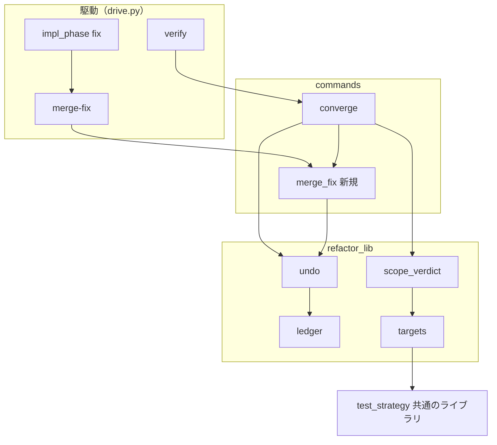
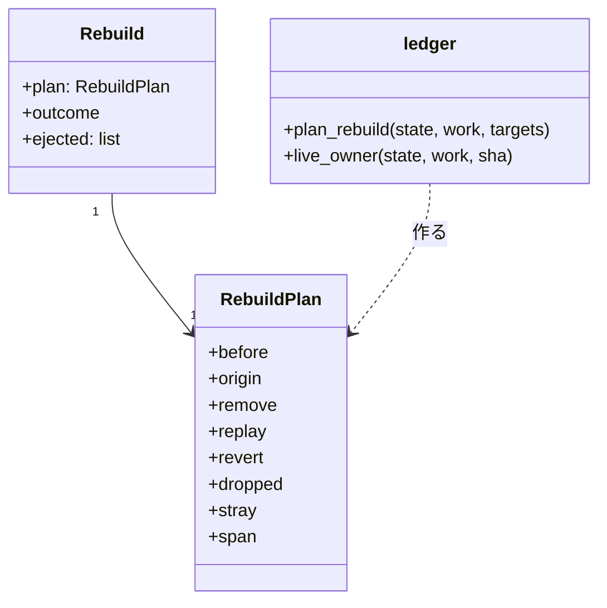
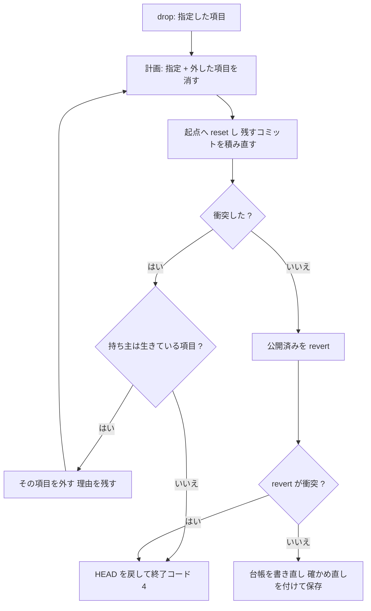
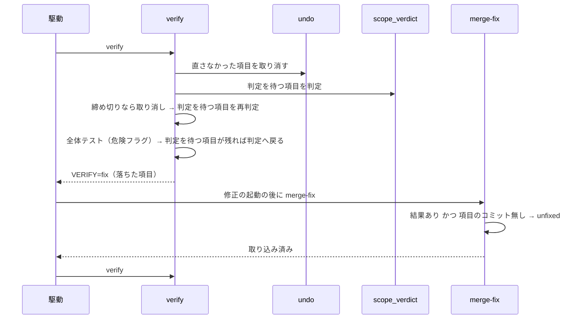
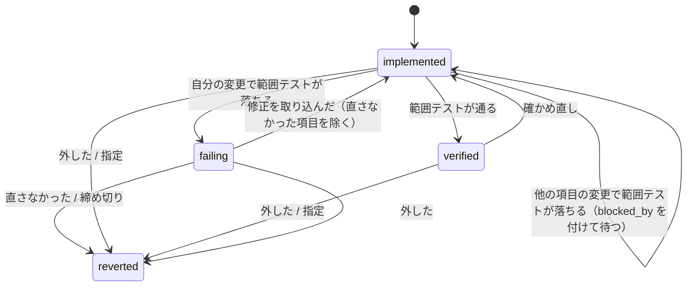

# cross-refactoring: 1 件の失敗が同じファイルの改善をまとめて捨て、直すものの無い項目に締め切りまで修正を回して採用 0 件で終わる → 残すかを範囲テストだけで決め、衝突したコミットの項目だけを外し、直さなかった項目はその回で取り消す（#1793 #1733）

## 目的

- **何が壊れているか**: 取り消しの積み直しが衝突すると、同じファイルを触った項目を範囲テストを掛け直さずにまとめて取り消す（`widened`）。広げても衝突すると全体を戻して終了コード 4 になる。あわせて、修正担当がコミットしなかった項目にも締め切りまで修正を回し続ける
- **誰が困るか**: cross-refactoring の利用者。takemi-ohama/novel PR 254 ではテストを通る 12 件のうち 11 件が捨てられ、devbasex/ai-plugins PR 1732（#1733）では 18 件を実装して採用 0 件・終了コード 4 だった
- **直すと何が成り立つか**: 項目を残すかは、その項目を積んだ HEAD の範囲テストだけで決まる。git の衝突で外れるのは衝突したコミットの項目だけで、直さなかった項目は締め切りを待たずに取り消される

## 適用範囲

- **働く範囲**: 配布先のどのリポジトリでも働く（cross-refactoring のスクリプトと、範囲テストを組み立てる共通のライブラリ `test_strategy`）
- **プロジェクトごとに違うもの**: 範囲テストの雛形（宣言の `scope_command` か `{paths}` を含む引数）。この変更は雛形の `{paths}` に入る語をパスに揃えるだけで、新しい設定も引数も足さない
- **当たるモード**: `standard`（取り消し・修正の打ち切り・範囲テストの組み立ての既定の振る舞いを変えるため安定版）

## あるべき姿の根拠

| 根拠 | 種類 | 何を示すか |
| --- | --- | --- |
| PR 254 の作業 worktree の reflog から取り出した 12 件を手元で積み直した結果（2026-10-06。#1793 の本文の表） | 実測 | 12 件を積んだ HEAD と 11 の途中の状態がすべて範囲テストと全体テスト（761 件）を通る。衝突する I-011・I-012 だけを除けば 6 件を残せる（実際は 1 件） |
| PR 1732 の実行の出力（`04-refactor.out`）と修正の結果ファイル（#1733 の本文） | 実測 | 8 件が同じ構造検査で落ち、修正担当は 43 回とも 8 件ともコミットせず、最後の積み直しの衝突で採用 0 件・終了コード 4 |
| PR 254 の範囲テストの出力 `unittest cannot select: tests/test_episodes_pipeline.py::Check` | 実測 | `::` 付きの対象を拒んだ終了コード 2 が、テストを 1 件も走らせないまま「テストの失敗」と数えられた |
| 「cross-refactoring のルールそのものを見直してください」（利用者、2026-10-06） | 利用者の指示の原文 | 局所的に繕わず、失敗した項目の扱いの規則の組を決め直す |

要求と受け入れ条件は #1793 の本文にある（コピーは `issues/issue-1793-requirements.md`。#1733 の要求も取り込んだ）。この文書は「どう作るか」だけを扱う。決定の記録は [issue-1793-design-decisions.md](issue-1793-design-decisions.md) に分けた。

## ドメインモデル

### コンテキスト

| コンテキスト | 何の語が 1 つの意味に決まるか |
| --- | --- |
| cross-refactoring（`ndf-cross-refactoring`） | 改善項目・取り消し・積み直し・外した項目・直さなかった項目・確かめ直し |
| ワークフロー（`ndf-workflow`） | 範囲テスト・範囲テストの雛形（`{paths}` の約束） |

cross-refactoring が顧客、ワークフローの `test_strategy` が供給者の関係（顧客 / 供給者）。cross-refactoring は雛形へ渡す対象を `test_strategy.scope_runs` に渡すだけで、`{paths}` へ何を入れるかは供給者が決める。R5 はこの供給者の側で `{paths}` の約束（パス）を守らせる。

### 集約

| 集約 | 持ち主（書き換えてよいもの） | 根 | エンティティ | 値オブジェクト |
| --- | --- | --- | --- | --- |
| 実行の状態（状態ファイル 1 つ） | 取り消し: `undo`（判定は `ledger`）。項目の検証の状態: `scope_verdict` と `commands/converge`。修正の取り込み: `commands/merge_fix` | 実行（`id`） | 改善項目（`items[]`）・取り消しの記録（`drops[]`） | 積み直しの計画（`RebuildPlan`）・外した記録（`ejected[]` の 1 行）・修正の起動の記録（`fix`） |

**改善項目を `reverted` へ落とす遷移は `ledger.mark_dropped` だけが持つ（今のまま）。** この変更で `reverted` へ落とす経路は「指定した項目」と「外した項目」の 2 つになり、どちらも `undo` の 1 回の取り消しの中で決まる。`verified` を `implemented` へ戻す遷移（確かめ直し）は `undo` が取り消しの記録と同じ保存で行う。

### 不変条件

| # | 集約 | 条件 | 破れたときの扱い |
| --- | --- | --- | --- |
| I1 | 実行の状態 | 1 回の取り消しで `reverted` になる項目は、指定した項目と、積み直しで衝突したコミットを持つ項目（外した項目）だけである。ファイルが同じというだけでは外さない | テストが落とす（実装の誤り） |
| I2 | 実行の状態 | 外した項目は `failure_reason` に「どの項目の取り消しで、どのコミット（12 桁の SHA）の積み直しが衝突したか」を持ち、取り消しの記録の `ejected[]` に 1 行ある。`mode` に `widened` は書かれない | テストが落とす |
| I3 | 実行の状態 | 最終ゲートより前の取り消しで HEAD が変わったら、残った項目は `verified` のまま残らない（`implemented` へ戻り、次の判定で範囲テストを走らせて、通れば `verified`・自分の変更で落ちれば `failing`・他の項目の変更で落ちれば `blocked_by` を付けて `implemented` のまま待つ（巻き込まれた項目）） | テストが落とす |
| I4 | 実行の状態 | 項目に属するコミット（テスト・実装・修正）の積み直しの衝突では HEAD を戻さず、終了コード 4 で止まらない。公開済みのコミットの revert の衝突と、項目に属さないコミット（オーケストレーター・最終ゲート修正）の積み直しの衝突は、HEAD を取り消しの前へ戻して終了コード 4 で止まる（`raise` なら `DropConflict`） | テストが落とす |
| I5 | 実行の状態 | 修正の起動が結果ファイルを残して終わり、修正の対象の項目のうち修正の範囲に `Item-Id` のコミットが 1 つも無い項目は、次の `fix.items` に入らず、次の検証の最初に取り消される | テストが落とす |
| I6 | 実行の状態 | 結果ファイルを残さずに終わった修正の起動は I5 に数えない（今のとおり振り替えと締め切りの経路） | テストが落とす |
| I7 | ワークフロー | 範囲テストの雛形の `{paths}` に入る語は `::` を含まない。`::` より前のパスにし、重なりを 1 つにまとめ、最初に現れた順を保つ | テストが落とす |
| I8 | 実行の状態 | 取り消しの途中で止まった実行を再開すると（`pending_drop`）、同じ指定の項目から同じ外した項目・残す項目になる | テストが落とす |

### ドメインイベント

| # | イベント | 発生元 | 受け手 |
| --- | --- | --- | --- |
| E1 | 計画が項目の範囲テストの対象（`test_targets`）を決めた | リファクタリング計画の取り込み（`merge-plan`） | 範囲テストの組み立て（`targets.limited_runs`） |
| E2 | 範囲テストのコマンドを組み立てた（`::` 以降を落としたパスを渡した） | `test_strategy.suite_groups` | 項目の `scope_commands`・失敗の走らせ直し |
| E3 | 項目の範囲テストが落ちた | `scope_verdict.judge_items` | 検証（`cmd_verify` が修正へ回すか締め切りで取り消す） |
| E4 | 修正担当を起動し、結果を残して終わった | 駆動（`impl_phase("fix")`）→ `merge-fix` | 修正の取り込み（`merge_fix`） |
| E5 | 修正担当がある項目のコミットを作らなかったと判定した | `merge_fix` | 次の検証（`converge._drop_unfixed`） |
| E6 | 項目を取り消すと決めた | 検証（E5・締め切り）・全体テストと最終ゲートの原因の判定・実装の取り込み | 取り消し（`undo.drop`） |
| E7 | 残す項目のコミットを順に積み直した | `undo._rebuild` | 台帳の書き直し（`_remap`） |
| E8 | 積み直しが衝突したコミットの項目を外した（理由を残した） | `undo._rebuild` | 取り消しの記録（`drops[].ejected`）・項目の `failure_reason` |
| E9 | 残った項目を新しい HEAD の範囲テストで確かめ直した | 検証（`_settle_scope` が `implemented` の項目を判定する） | `scope_verdict.judge_items` |
| E10 | 確かめ直しを通った項目を検証済みにした | `scope_verdict._settle_item` | 危険フラグ・最終ゲート |

E9 の引き金は「最終ゲートより前の取り消しで HEAD が変わった」である。`undo` が残った `verified` の項目を `implemented` へ戻し（I3）、検証の判定がそれを拾う。最終ゲートの中の取り消し（打ち切りの後の取り消し・最終ゲートの原因の判定）では、取り消した後に最終ゲートが HEAD を確かめ直す（`FINAL_GATE=recheck`）ため、範囲テストの確かめ直しは置かない（[決定 5](issue-1793-design-decisions.md#決定-5-最終ゲートの中の取り消しに締め切りを足さないため確かめ直しを最終ゲートの判定に任せる)）。

### 用語

| 用語 | 意味 | 用語集への反映 |
| --- | --- | --- |
| 積み直し | 取り消しで、取り消しの起点から HEAD までの残すコミット（未公開のもの）を cherry-pick で順に積み直すこと。項目に属するコミットが衝突したら、その項目だけを外して続ける | 追加（要求の工程で反映済み） |
| 外した項目 | 取り消しの積み直しで、自分のコミットが衝突したために取り消した改善項目。外した理由（どの項目の取り消しで、どのコミットが衝突したか）を持つ | 追加 |
| 直さなかった項目 | 結果を残して終わった修正の起動の後、修正の範囲に自分の `Item-Id` のコミットが 1 つも無い改善項目。次の検証の最初に取り消す | 追加 |
| 確かめ直し | 最終ゲートより前の取り消しで HEAD が変わった後、残った改善項目を新しい HEAD の範囲テストで判定し直すこと | 追加 |

「巻き込まれた項目」（範囲テストが他の項目の変更で落ち、取り消さずに待つ項目）は意味を変えない。今の取り消しが `widened` の項目の理由に書いていた「（widened の取り消しに巻き込まれた）」は、同じ語を別の意味に使っていたため無くす。外した項目の理由は「外した」と書く。

## 機能一覧

| # | 機能 | 誰が使うか |
| --- | --- | --- |
| F1 | 取り消しの積み直しが衝突したとき、衝突したコミットの項目だけを外して積み直しを続ける（R2） | cross-refactoring の利用者（結果の PR を受け取る） |
| F2 | 取り消した後、残った項目を新しい HEAD の範囲テストで確かめ直してから採る（R2） | 同上 |
| F3 | 修正担当がコミットしなかった項目を、次の修正へ回さずに取り消す（R3） | 同上（予算の使い方） |
| F4 | 範囲テストの `{paths}` へ `::` より前のパスだけを渡す（R5） | cross-refactoring の利用者・`test-run.py scope` を使う conductor |
| F5 | 外した理由・取り消した理由を状態ファイルとリファクタリング計画のコメントの項目の行で読める | 実行の結果を読む利用者と conductor |

## 構成要素

| 要素 | 責務 | 変える中身 |
| --- | --- | --- |
| `scripts/lib/test_strategy.py`（`suite_groups`） | 対象を suite ごとに分け、雛形の `{paths}` へ入れる語を決める | 対象を `::` より前のパスへ直し、重なりを 1 つにまとめる（R5・I7） |
| `refactor_lib/ledger.py` | 取り消しの判定（どのコミットを消し・積み直し・戻すか） | `_widen` と `plan_rebuild(widen=)` と `RebuildPlan.widened` を消す。コミットの持ち主の項目を返す `live_owner` を足す |
| `refactor_lib/undo.py` | 取り消しの実行（git） | 積み直しの衝突で、衝突したコミットの持ち主を外して計画を作り直す繰り返しにする（R2・I1・I4）。外した記録と確かめ直し（`verified` → `implemented`。I3）を同じ保存で残す |
| `refactor_lib/commands/merge_fix.py`（新規） | 修正の取り込み（`merge-fix`） | `converge.py` から `cmd_merge_fix` と取り込みの関数を移し、直さなかった項目の判定を足す（R3・I5・I6） |
| `refactor_lib/commands/converge.py` | 検証（`verify`） | 直さなかった項目を最初に取り消す（`_drop_unfixed`）。判定の対象を「待っている項目」から「判定を待つ項目」（`scope_verdict.pending`）へ広げ、全体テストの後にも確かめ直しが残れば判定へ戻る |
| `refactor_lib/scope_verdict.py` | 項目の範囲テストの判定 | `pending`（`implemented` で、原因の項目が `failing` で待たされていないもの）を足す |
| `scripts/refactor.py` | サブコマンドの登録 | `cmd_merge_fix` の取り込み元を `commands.merge_fix` へ変える |
| `prompts/plan.md`・`prompts/add-tests.md` | 計画・テスト追加の担当への指示 | `test_targets` をパスとして説明する（`::` のノード ID の例を消す） |
| `prompts/fix.md` | 修正担当への指示 | `fix_count` の説明を「コミットしなかった項目はその回で取り消される」に改める |
| 確定仕様と Skill の文書 | 利用者と担当が読む規則 | `docs/specifications/cross-refactoring-verify-and-final-gate.md`・`skills/cross-refactoring/docs/04-verify-and-report.md`・`references/design-principles.md`・`SKILL.md`・`CLAUDE.md` の cross-refactoring の節を R2・R3・R5 に合わせる |
| 用語集 | 語の意味 | 「外した項目」「直さなかった項目」「確かめ直し」を足す |



全体テスト（`wholetest`・`culprit`）・実装の取り込み（`implement`）・打ち切りの後の取り消し（`stop_revert`）は `undo.drop` を今のまま呼ぶ。呼ぶ側の順序は変えず（要求の対象範囲「含まない」）、図には描かない。`refactor.py`（登録）・プロンプト・文書・用語集は呼び出しの関係を持たないため描かない。`targets` は変えないが、`scope_verdict` から `test_strategy` への経路を示すために置いた。

## 構造

### パッケージ・モジュール構成

```text
plugins/ndf/
├── scripts/lib/test_strategy.py           # suite_groups: 対象をパスへ（R5）
└── skills/cross-refactoring/
    ├── scripts/refactor.py                # merge-fix の取り込み元
    ├── scripts/refactor_lib/
    │   ├── ledger.py                      # _widen を消す・live_owner を足す
    │   ├── undo.py                        # 外して作り直す繰り返し・確かめ直し
    │   ├── scope_verdict.py               # pending を足す
    │   └── commands/
    │       ├── converge.py                # verify（merge-fix を外へ）
    │       └── merge_fix.py               # 新規: merge-fix と直さなかった項目
    ├── prompts/{plan,add-tests,fix}.md
    └── tests/
```

**`merge_fix.py` を分けるのは、`converge.py` が今 500 行ちょうどで、構造検査（1 ファイル 500 行）の上限にあるためである。** 修正の取り込み（`_fix_problems`・`_inspect_fix_commits`・`_apply_fix_result`・`_account_fix`・`cmd_merge_fix`。約 110 行）は検証と別の工程（`merge-fix`）で、移しても互いの関数を呼ばない。`cmd_verify` は取り込んでいない修正を先に取り込むため `merge_fix.cmd_merge_fix` を呼ぶ。

### クラス図



- `RebuildPlan` から `widened` を消す。`plan_rebuild` は `widen` の引数を持たない
- `Rebuild` は `undo` の中の値（1 回の取り消しの結果）。最後に打った計画・git の結果・外した記録の並びを持つ。外した記録の 1 行は `{"item", "commit", "by"}`（データ構造の節）
- `live_owner(state, work, sha)` は、`sha` が取り消されていない改善項目に記録されたコミット（`kind` が `item`）ならその項目の ID、ほか（`orchestrator`・`final_fix`・`stray`）なら空を返す。git を書き換えない

## データ構造

状態ファイル（JSON）の形は足すだけで、旧い状態ファイルを読める（要求の非機能「移行性」）。

| 場所 | 鍵 | 型 | 新しい / 変更 | 意味 |
| --- | --- | --- | --- | --- |
| `drops[]` | `mode` | 文字列 | 値の変更 | `item`（指定した項目だけ）/ `ejected`（外した項目がある）/ `skip`（取り消すコミットが無い）。`widened` は書かなくなる。旧い記録の `widened` はそのまま読める（読む側は `mode` の値で分岐しない） |
| `drops[]` | `ejected` | 配列 | 新しい | 外した記録の並び（外した順）。各行は `item`（外した項目の ID）・`commit`（衝突したコミットの完全な SHA）・`by`（その取り消しで指定した項目の ID の並び）。外した項目が無ければ空の配列 |
| `drops[]` | `recheck` | 配列 | 新しい | 確かめ直しのため `verified` から `implemented` へ戻した項目の ID の並び。最終ゲートの中の取り消しでは空 |
| `drops[]` | `dropped` | 配列 | 意味は今のまま | 取り消した項目の ID の並び（指定した項目と外した項目） |
| `items[]` | `failure_reason` | 文字列 | 書き方の追加 | 外した項目は「`<by> の取り消しで <commit の 12 桁> の積み直しが衝突したため外した`」で上書きする。直さなかった項目は「修正担当が直さなかった（修正の範囲にこの項目のコミットが無い）」 |
| `items[]` | `unfixed` | 整数 | 新しい | 直さなかったと判定した修正の起動の番号（`fix.attempt`）。次の検証が取り消した後も記録として残る |
| `pending_drop` | `items` | 配列 | 意味は今のまま | 指定した項目だけを持つ。外した項目は再開で計算し直す（I8） |

**外した項目の `failure_reason` は上書きする。** `ledger.mark_dropped` は `setdefault` で、自分の範囲テストで落ちた項目の理由を残す。外した項目が取り消された理由は衝突であり、前の理由を残すと取り消しの理由を読み違える（PR 254 の I-007・I-009 は「自分の範囲テストで落ちた」と記録されたが、実際は広げる取り消しで消えた）。落ちた検査は `failed_check` に残る。

**見送り（`deferred_items`）へは入れない。** 外した項目と直さなかった項目は、どちらも取り消し（`reverted`）として数える。見送りの理由（`budget` / `rank` / `duplicate` / `vocabulary` / `threshold` / `no_target` / `test_failed` / `not_done`）は計画と実装の取り込みで外したものに限り、検証より後の取り消しは今も見送りに数えない。

## 処理の流れ

### 取り消しの積み直し（R2）



- 衝突のたびに計画を最初から作り直す（`plan_rebuild(state, work, 指定 + 外した項目)`）。外した項目のコミットのうち、衝突したものより前に積み直し終えていたもの（テストのコミットなど）も計画から消えるためである。1 回の衝突で 1 件を外すので、繰り返しは生きている項目の数の内で終わる
- 衝突したコミットが外した項目の修正のコミットでも、外すのはその項目の全体（テスト・実装・修正）である（R1 の項目単位を保つ）
- 確かめ直しを付けるのは、最終ゲートより前（`ledger.in_final_gate` が偽）で、計画が `remove` か `revert` を持ったとき（HEAD が変わったとき）だけである。生きている項目のうち `verified` のものを `implemented` へ戻し、`recheck` に並べる
- 公開済みの revert の衝突と、項目に属さないコミットの衝突の扱い（I4 の後半）は今のまま。`on_conflict="raise"` の呼び出し（打ち切りの後の取り消し）には `DropConflict` を返す

### 検証と修正（R3 と確かめ直し）



`cmd_verify` の順序:

1. 取り込んでいない修正を取り込み、途中の取り消しをやり直す（今のまま）
2. **直さなかった項目を 1 回の `drop` でまとめて取り消す**（`_drop_unfixed`。対象は生きていて `unfixed` を持つ項目。理由は「修正担当が直さなかった」）
3. 判定を待つ項目（`scope_verdict.pending`: `implemented` で、`blocked_by` の原因の項目がどれも `failing` でないもの）を判定する。今の「`implemented` の項目」と同じ集合に、確かめ直しの項目が入る
4. 締め切りなら落ちた項目を取り消し（今の `_give_up`）、判定を待つ項目を判定し直す。取り消しが無くなるまで繰り返す（今は `waiting` を判定し直していたものを `pending` にする）
5. 落ちた項目があれば修正へ回す（`VERIFY=fix`）
6. 危険フラグの全体テスト（今のまま）。修正へ回したら `VERIFY=fix`。全体テストの取り消しで判定を待つ項目が残ったら 2 へ戻る（全体テストは走らせ直さない。`whole_test.ran`）
7. 最終ゲートへ（今のまま）

`merge_fix.cmd_merge_fix` の判定（今の取り込みの後に足す）:

- 修正の起動が結果を残したか: `results.read_result(state, 起動した席, "fix").payload` が `None` でない
- 項目のコミットを作ったか: 修正の範囲（`fix.base_sha..HEAD`）のコミットのトレーラーの `Item-Id` に、その項目の ID があるか。**手順を外れて範囲ごと捨てたコミットも「作った」に数える**（判定は捨てる前の `ordered` で行う）。直そうとした項目を直さなかったとは扱わない
- 両方を満たす項目に `unfixed = fix.attempt` を付ける。状態は `failing` のまま残し、`fix_count` は今のとおり 1 足す（`fix_rounds` はその項目について 1 になる）
- 結果の申告（`fixed` / `not_fixed`）は読まない（前提 3）

### 改善項目の状態遷移



`verified --> implemented`（確かめ直し）と、`failing --> reverted` の「直さなかった」が新しい遷移である。`implemented` からの判定は I3 の 3 つに分かれ、他の項目の変更で落ちた項目（巻き込まれた項目）は `failing` にせず、`blocked_by` を付けて `implemented` のまま待つ（今の規則のまま。確かめ直しの項目にも同じく効く）。`widened` による `reverted` は「外した」に置き換わる。

## 非機能の実現方式

| 大項目 | 条件（要求） | 実現方式 |
| --- | --- | --- |
| 性能・拡張性 | 1 回の取り消しで増える範囲テストは、残った項目の語の並びの数まで | 確かめ直しは `scope_verdict._run_once` の「同じ語の並びは 1 回」をそのまま通す。R5 で同じファイルの対象は同じ語の並びになるため 1 回にまとまる。外す繰り返しの cherry-pick は 1 回の衝突ごとに残すコミットの数まで（PR 254 の 12 件で数秒） |
| 運用・保守性 | 外した理由・取り消した理由を状態ファイルとコメントの項目の行で読める | `failure_reason`（項目の行は今の `item_lines` が出す）と `drops[].ejected`・`recheck`。標準エラーへ「⚠ I-011 の積み直しが衝突したため外します（I-006 の取り消し・abc123def456）」を 1 行ずつ出す |
| 移行性 | 状態ファイルは足すだけ。旧い `widened` の記録を読める。途中で版を上げた実行は `pending_drop` の再開が新しい規則でやり直す | `drops[].mode` を読む処理は無い（`report` も読まない）。`pending_drop.items` は指定した項目だけなので、再開は新しい規則で外す項目を計算し直す。計画の時点で置いた項目の `scope_commands` に `::` が残る実行は、置き直さない（未確認のまま残ること） |

## テスト設計

| 受け入れ条件・不変条件 | どの振る舞いで縛るか | どう壊したら落ちるべきか |
| --- | --- | --- |
| I1・R2 の AC 1（A・B・C・D） | 実物の git で、同じファイルの A・B（A の行の上）・C（離れた行）と別のファイルの D を積み、A を取り消すと B だけが `reverted`、C と D は生きている | ファイルの一致で広げる（今の `_widen`）と C が落ちる。衝突の持ち主でなく直前の項目を外すと B 以外が落ちる |
| I2・R2 の AC 2 | 上の B の `failure_reason` に A の ID と衝突したコミットの 12 桁が入り、`drops[-1].ejected` に B の行があり、`mode` が `ejected` | 理由を `setdefault` のままにすると、先に理由を持つ B で落ちる。`mode` に `widened` を書くと落ちる |
| 外した項目の前のコミットも消える | テストと実装の 2 コミットの項目の実装のコミットが衝突すると、テストのコミットも HEAD から消える | 衝突したコミットだけを抜くと、テストのコミットが残って落ちる |
| 依存の連なり | B が A に、E が B に依存する 3 件で A を取り消すと B と E が外れ、`ejected` が 2 行（`by` はどちらも A） | 1 回の衝突で止めて終了コード 4 にすると落ちる |
| I3・R2 の AC 3 | 最終ゲートより前の取り消しの後、残った `verified` の項目が `implemented` になり、次の判定で範囲テストを走らせ、通れば `verified`・自分の変更で落ちれば `failing`・他の項目の変更で落ちれば `blocked_by` を付けて `implemented` のまま待つ | 確かめ直しを付けないと、範囲テストを落とす残りの項目が `verified` のまま最終ゲートへ進んで落ちる。確かめ直しの項目の範囲テストが他の項目の変更で落ちる場合を 1 件置き、その項目が `failing` でなく `blocked_by`（原因の項目の ID）を持つ `implemented` で残ることを確かめる。自分の変更か他の項目の変更かを見ずに `failing` にすると落ちる |
| 最終ゲートの中の取り消し | `phase` が `final` の取り消しでは `verified` の項目は `verified` のまま、`recheck` は空 | 最終ゲートの中でも `implemented` へ戻すと、最終ゲートが通っても採用が 0 になって落ちる |
| I4・R2 の AC 4・5 | 項目のコミットの衝突では HEAD が取り消しの前に戻らず終了コード 4 にならない。オーケストレーターのコミットの衝突と公開済みの revert の衝突では HEAD が戻り、終了コード 4（`raise` なら `DropConflict`） | 項目に属さないコミットの持ち主を探して外そうとすると、後者で落ちる |
| I8・R2 の AC 6 | `pending_drop` を残して止めた実行を再開すると、外した項目と残す項目が止めずに通した実行と同じ | 外した項目を `pending_drop.items` へ書き足すと、再開で指定の項目が変わって理由が変わり落ちる |
| R2 の AC 7 | `drops[].mode` が `widened` の旧い状態ファイルで `report` が終了コード 0 | `mode` の値で分岐して未知の値でエラーにすると落ちる |
| R2 の AC 8（手動） | PR 254 の reflog の 12 件（`dc3aee0` まで）から I-005・I-006 を新しい規則で取り消すと、6 件以上が残り範囲テストが通る | — （手動確認） |
| I5・R3 の AC 1・2 | 偽の修正担当が結果ファイルを書き、2 件のうち 1 件だけコミットすると、コミットしなかった項目は次の `fix.items` に入らず次の検証の最初に `reverted`（理由「修正担当が直さなかった」）、コミットした項目は範囲テストを走らせる | 結果の申告を読むように壊すと（申告 `fixed`・コミット無し）落ちる。締め切りまで回すと次の `fix.items` に残って落ちる |
| R3 の AC 3（#1733 の形） | 18 件のうち 8 件が同じ構造検査で落ち、偽の修正担当が 8 件ともコミットしない。8 件は 1 回目の修正の後に取り消され、その 8 件の `fix_count` は 1、残りが範囲テストを通れば `adopted` ≥ 1、終了コード 4 でない | 広げる取り消しを残すと、取り消しで同じファイルの残りが消えて落ちる |
| I6・R3 の AC 4 | 結果ファイルを残さずに終わった修正の起動の後、対象の項目に `unfixed` が付かない | 結果の有無を見ずにコミットの有無だけで判定すると落ちる |
| 手順を外れた修正 | 違反のコミットで範囲ごと捨てた修正の対象の項目に `unfixed` が付かない | 判定を捨てた後の HEAD で行うと落ちる |
| I7・R5 の AC 1・2 | `tests/test_a.py::Check`・`tests/test_a.py`・`tests/test_b.py::test_x` の対象で、雛形が `pytest {paths}`・`npx jest {paths}`・`npx vitest run {paths}`・unittest の包みのどれでも、組み立てたコマンドに `tests/test_a.py tests/test_b.py` が入り `::` を含まない | `::` を落とさないと落ちる。重なりをまとめないと `tests/test_a.py` が 2 度入って落ちる。順を並べ替えると落ちる |
| R5 の AC 3 | PR 254 の形（unittest の包みの `scope_command`、`test_targets` に `::`）の項目の範囲テストが `unittest cannot select` で終わらない | 組み立てを `test_strategy` でなく cross-refactoring の側だけで直すと、`test-run.py scope --paths` の経路で落ちる |
| 文書の AC | `.md` の文言を照合するテストは書かない。参照切れは `instructions-check.py` と既存のチェックが見る | — |

既存の `tests/test_undo_git.py` の `test_an_adjacent_change_widens_to_the_items_touching_the_same_file` と `test_a_conflict_left_after_widening_restores_head_and_stops` は、規則を変えるため上の I1・I4 の行の形へ書き換える。

## 設計の結果

| 課題 | 扱い | 取り込み先 | 触るファイル |
| --- | --- | --- | --- |
| #1793 | 実装する | — | `plugins/ndf/scripts/lib/test_strategy.py`、`plugins/ndf/skills/cross-refactoring/scripts/`、`plugins/ndf/skills/cross-refactoring/prompts/`、`plugins/ndf/skills/cross-refactoring/tests/`、`plugins/ndf/skills/cross-refactoring/docs/04-verify-and-report.md`、`plugins/ndf/skills/cross-refactoring/references/design-principles.md`、`plugins/ndf/skills/cross-refactoring/SKILL.md`、`plugins/ndf/scripts/tests/`、`docs/specifications/cross-refactoring-verify-and-final-gate.md`、`docs/glossary/`、`docs/glossary.md`、`CLAUDE.md` |
| #1733 | 取り込む | #1793 | — |

実装を 1 本に寄せる理由は [決定 6](issue-1793-design-decisions.md#決定-6-1733-の受け入れ条件を-1-本の変更で満たすため実装を-1793-の-1-本に寄せる) にある。

## 未確認のまま残ること

| 項目 | 内容 |
| --- | --- |
| 衝突しないが意味の上で依存する項目 | 積み直せても、取り消した項目に依存して範囲テストを落とす項目は、確かめ直しで `failing` になって修正か締め切りの取り消しへ進む。範囲テストが覆わない依存は最終ゲートの全体テストまで見つからない（今と同じ） |
| 確かめ直しの所要 | 確かめ直しの範囲テストは配分テーブルの `verify` の見積りに入っていない。実測は `verify_stats` に入り次回から反映されるが、取り消しの多い実行の初回は締め切りに近づく。締め切りの後に落ちた確かめ直しの項目は、今の `_give_up` で取り消す |
| `::` の項目の再開 | 計画の時点で置いた `scope_commands` は置き直さないため、この版へ上げる前に計画まで進んだ実行を再開すると `::` 付きのコマンドが残る |
| `::` を落としたことで走るテストの数 | ノード ID でなくファイルの全体を走らせるため、範囲テストの所要が増えうる（前提 4）。どれだけ増えるかは実装後の実測まで分からない |
| `CLAUDE.md` の書き換え | cross-refactoring の節の「同じファイルを触った項目まで取り消しを広げる」を R2 へ直す。共通原則 C7（指示書の運用の節の書き換え）に当たりうるため、設計の承認（ゲート 1）でこの書き換えを含めて承認を得る |
| 手動確認の材料 | PR 254 の作業 worktree の reflog（`/work/novel/.git/worktrees/work1/logs/HEAD`）が実装の時点まで残っているか。消えていれば手動確認の AC を満たせず、実装の報告で止めて人へ戻す |
