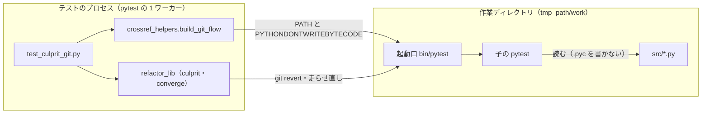
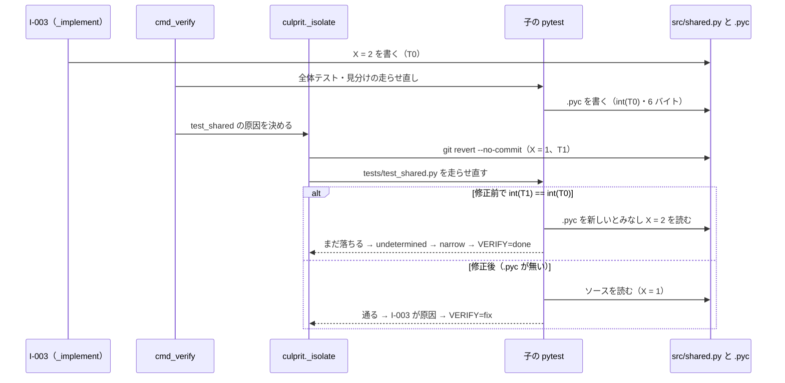

# cross-refactoring のテスト: 原因の項目が 2 件のテストが 3 日で 12 回フレーキーとして除かれ、確定仕様は直さなかった項目の取り消しを書いていない → 同じ秒の書き換えでも古い .pyc を読まずに毎回通り、確定仕様が今の検証の順序を書く（#1806 #1807）

## 目的

- **何が壊れているか**: `test_culprit_git.py::test_two_items_breaking_two_tests_are_both_culprits` が、取り消しが 1 秒の境目をまたがなかった回だけ古いバイトコード（`.pyc`）を読んで落ちる（#1806）。確定仕様 `cross-refactoring-final-fix-and-repo-wide-checks.md` の `_settle_scope` の段落は、#1793 で入った直さなかった項目の取り消しと確かめ直しを書いていない（#1807）
- **誰が困るか**: このリポジトリの実装・検査の工程。落ちるたびに走らせ直しを待ち、cross-refactoring の着手前のテストでは既存失敗として固定されて検出から外れる。確定仕様を読んで次に検証の順序を変える人
- **直すと何が成り立つか**: git を使うテストの子の Python がバイトコードを書かず、同じ秒・同じ大きさの書き換えでも新しい内容を読む。製品が worktree を書き換える 2 つの入口（`culprit._isolate` の戻しと、`undo.drop` の取り消し。`revert_in_order` の 1 件ずつの取り消しと `_settle_scope` の締め切りの取り消しはここを通る）は、直前の書き換えの秒が過ぎてから書き換え、利用者の worktree に前の内容の `.pyc` を残さない（決定 6）。確定仕様の段落が `_drop_unfixed` → `judge_items(pending)` → 締め切りの取り消しと判定し直しの繰り返し、の順で書かれる

## 適用範囲

- **働く範囲**: このリポジトリのテスト（`plugins/ndf/skills/cross-refactoring/tests/` の git を使うテストの土台）と、確定仕様の 1 段落と、配布物の worktree の書き換えの待ち（決定 6。`worktree` の印と、`culprit._isolate` の戻し・`undo.drop` の入口）。配布物で変わるのは、直前の書き換えと同じ秒のうちに次の書き換えが来たとき、次の秒まで待つことだけである
- **プロジェクトごとに違うもの**: 無し（戻しの待ちは言語を問わない更新時刻の規則で、設定も引数も足さない）
- **当たるモード**: `standard`（要求の前提 6 のとおり。共通原則の C1〜C8・固有の P1 に当たる操作を含まない）

## あるべき姿の根拠

| 根拠 | 種類 | 何を示すか |
| --- | --- | --- |
| m1793 の着手前のテストのログ `/tmp/ndf-worktrees/devbasex--ai-plugins/rf1801/work/.cross_refactoring/init-whole-0.log` の 156〜157 行 `assert verify == "fix"` / `AssertionError: assert 'done' == 'fix'` | 実測 | 揺れの現れ方は「原因が決まらず取り消しで終わった（`VERIFY=done`）」である |
| 取り消しの直後に `src/shared.py` の更新時刻を I-003 の書き込みの時刻へ揃えた探針（下の「揺れの原因」）が、ログと同じ `verify=done`・手がかり `undetermined`・原因 `['I-002']` で落ちる | 実測 | 古い `.pyc` を読むと、ログと同じ形で落ちる |
| 同じ探針で `-B` か `PYTHONDONTWRITEBYTECODE=1` を入れると、30 回中 0 回落ちる（修正前は 30 回中 17 回） | 実測 | バイトコードを書かせなければ揺れは消える |
| 最小の例: `X = 2` を import した後、`X = 1` を同じ大きさ・同じ更新時刻（秒）で書くと、次の `python -m pytest` は `X == 2` のまま読んで落ち、`-B` を付けた起動では `__pycache__` を作らず通る（2026-10-06 に手元で実行） | 実測 | Python は `.pyc` の新しさを、ソースの更新時刻（秒）と大きさだけで照らす |
| `test_fix_rules_git.py` の `flow` フィクスチャの `monkeypatch.setenv("PYTHONDONTWRITEBYTECODE", "1")`（#1793 の実装、コメント「同じ秒に同じ大きさで書き換えたモジュールを古い .pyc から読まない」） | 既存の形 | 同じ原因を 1 ファイルの中だけで塞いだ前例がある。共通の土台へ寄せれば 13 ファイルに効く |
| `docs/specifications/cross-refactoring-failed-item-rules.md` の 81〜82 行と、`converge.py` の `_settle_scope`（117〜133 行） | 正の文書と実装 | #1807 の段落を揃える先 |

要求と受け入れ条件は #1806 の本文にある（コピーは `issues/issue-1806-requirements.md`。#1807 の要求も取り込んだ）。この文書は「どう作るか」だけを扱う。

## 揺れの原因

**原因はテストの土台の側にある。** git を使うテストの土台（`crossref_helpers.build_git_flow`）が、項目の書き込みから取り消しまでを 1 秒弱で通し、その間に子の pytest がバイトコードを書く。取り消しが書き込みと同じ秒に入ると、元へ戻した `src/shared.py`（`X = 1`）を前の内容（`X = 2`）の `.pyc` で読む。

### 経路

1. I-003 が `src/shared.py` を `X = 1` から `X = 2` へ書く（時刻 T0。どちらも 6 バイト）
2. 検証の全体テスト（危険フラグ D1 が I-001 に立つ）が `tests/test_shared.py` を走らせ、`src/__pycache__/shared.cpython-313.pyc` を書く。`.pyc` はソースの更新時刻 `int(T0)` と大きさ 6 を持つ
3. 見分け（`triage.classify`）で `test_total`（本文に `src/calc.py`）と `test_shared` が変更起因になる。`test_total` は手がかり `path` で I-002 に決まる
4. 外す走らせ直し（`culprit._isolate`）が I-003 を `git revert --no-commit` で外す（時刻 T1）。`src/shared.py` は `X = 1`・6 バイトに戻る
5. **`int(T1) == int(T0)` なら**、走らせ直しの pytest は `.pyc` を新しいと判定して `X = 2` を読み、`test_shared` はまだ落ちる
6. I-002・I-001 を外しても通らず、`test_shared` が残る。手がかりは `undetermined`、`fixable` が偽になり、`narrow` が取り消して `VERIFY=done` で終わる

### 再現の手順と結果

**T0 を秒の頭へ寄せ、直列で走らせる。** 手元の直列の実行では T0 から T1 までが 0.975〜0.986 秒（3 回の実測）で、寄せなければ同じ秒に入るのは T0 の端数が 0.02 秒未満の回だけである。`-n 4` の並列では負荷で 1 秒を超え、寄せても落ちない（30 回中 0 回）。

再現の探針（コミットしない。`plugins/ndf/skills/cross-refactoring/tests/test_zz_repro_1806.py` に置いて走らせ、終わったら消す）:

```python
"""#1806 の再現。I-003 の書き込みを秒の頭へ寄せ、取り消しを同じ秒に入れる。"""
import os
import time

import pytest

import test_culprit_git as T
from test_culprit_git import flow  # noqa: F401


def _at_second_start():
    time.sleep(1.0 - (time.time() % 1.0) + 0.001)


@pytest.mark.parametrize("n", range(int(os.environ.get("PROBE_N", "30"))))
def test_aligned(n, flow, cmd_setup, cmd_implement, cmd_converge, capsys):  # noqa: F811
    T._existing(flow, {"tests/test_total.py": T.TEST_TOTAL, "src/shared.py": "X = 1\n", "tests/test_shared.py": T.OTHER_TEST})

    def i003(w):
        _at_second_start()
        T._write(w, "src/shared.py", "X = 2\n")

    T._implement(flow, cmd_setup, cmd_implement, {"I-001": T._flagged("other"), "I-002": T._calc(T.CALC_RAISES), "I-003": i003})
    verify, record = T._verify(flow, cmd_converge, capsys)
    assert verify == "fix"
    assert sorted(record["culprit"]["culprits"]) == ["I-002", "I-003"]
    assert record["culprit"]["basis"] == "isolate"
```

```bash
PROBE_N=30 uv run --frozen --project . --all-extras pytest \
  plugins/ndf/skills/cross-refactoring/tests/test_zz_repro_1806.py -q -p no:randomly
```

| 条件 | コミット | 落ちた回数 / 走らせた回数 |
| --- | --- | --- |
| 直列・秒の頭へ寄せる | 修正前 `658c12b67` | 17 / 30（ほかに 8 回の試行で 6 / 8） |
| `-n 4`・秒の頭へ寄せる | 修正前 `658c12b67` | 0 / 30 |
| 直列・秒の頭へ寄せる・起動口に `-B` | 修正前 + 試しの変更 | 0 / 30 |
| 直列・秒の頭へ寄せる・`build_git_flow` で `PYTHONDONTWRITEBYTECODE=1` | 修正前 + 試しの変更 | 0 / 30 |

落ちた回の出力は `verify=done`、手がかり `undetermined`、`.pyc` の中の更新時刻は `int(T0)`・大きさは 6 だった（探針で `.pyc` の 8〜16 バイト目を読んだ）。

### 同じ原因を持つほかのテスト

**`test_culprit_git.py` の中で同じ原因を持つのは、このテストだけである。** 古い `.pyc` を読むには、同じファイルを同じ大きさで書き換える必要がある。ほかのテストの書き換えは大きさが変わるか、ファイルを足すだけである。

| テスト | 項目が書き換えるもの | 大きさ（前 → 後） |
| --- | --- | --- |
| `test_a_path_in_the_failure_names_the_unflagged_item_and_only_it_goes_to_fix` | `src/calc.py` を `CALC_RAISES` へ・`src/other.py` を足す | 139 → 158 |
| `test_after_the_deadline_only_the_culprit_is_reverted` | 同上 | 139 → 158 |
| `test_without_a_path_the_item_whose_removal_makes_the_test_pass_is_the_culprit` | `src/calc.py` を `CALC_OFF_BY_ONE` へ | 139 → 143 |
| `test_two_items_breaking_two_tests_are_both_culprits` | `src/shared.py` を `X = 2` へ | **6 → 6** |
| `test_the_1634_and_1663_shape_reverts_no_flagged_item` | `src/calc.py` に関数を足す・`src/participants.py` を足す | 139 → 167 |
| `test_without_time_and_without_a_path_every_item_is_reverted_newest_first_until_it_passes` | `src/calc.py` を `CALC_OFF_BY_ONE` へ | 139 → 143 |

同じ土台を使うほかの 12 ファイル（`test_fix_rules_git.py` ほか）にも同じ大きさの書き換えはありうる。直す場所を土台にすれば、ファイルごとに調べずに塞げる（決定 1）。

## ドメインモデル

### コンテキスト

| コンテキスト | 何の語が 1 つの意味に決まるか |
| --- | --- |
| このリポジトリの開発の検査（`repo-dev-checks`） | 古いバイトコード・git を使うテストの土台 |
| cross-refactoring（`ndf-cross-refactoring`） | 原因の項目・原因の手がかり・確かめ直し・直さなかった項目 |

開発の検査が cross-refactoring に合わせる関係（順応者）。テストの土台は cross-refactoring の振る舞いを変えず、その振る舞いが正しく見える環境だけを用意する。

### 集約

| 集約 | 持ち主（書き換えてよいもの） | 根 | エンティティ | 値オブジェクト |
| --- | --- | --- | --- | --- |
| git を使うテストの作業ディレクトリ | `crossref_helpers.build_git_flow` | 作業ディレクトリ（`work`） | 起動口（`bin/pytest`） | 子プロセスの環境変数 |
| 確定仕様の文書 | `docs/specifications/` の各文書（書き換えるのは #1807 の段落だけ） | 文書 | 段落 | — |

**実行の状態（状態ファイル）は変えない。** 原因の項目の判定（`culprit`）の結果の決め方と検証の順序（`_settle_scope`）は今のままである。変えるのは worktree を書き換える時刻（`culprit._isolate` の戻しと `undo.drop`）だけである（決定 6）。

### 不変条件

| # | 集約 | 条件 | 破れたときの扱い |
| --- | --- | --- | --- |
| I1 | git を使うテストの作業ディレクトリ | 作業ディレクトリで動く子の Python はバイトコードを書かない。そのため同じ秒・同じ大きさで書き換えたモジュールも新しい内容で読む | テストが落とす |
| I2 | 確定仕様の文書 | `_settle_scope` の段落の順序と語が、`converge.py` の `_settle_scope` と `cross-refactoring-failed-item-rules.md` の 81〜82 行に一致する | 文書レビューで差し戻す |
| I3 | 製品による worktree の書き換え（`culprit._isolate` の戻しと `undo.drop`） | 書き換えは、同じプロセスが直前に worktree を書き換えた秒より後の秒に入る。そのため書き換えた後に読む言語の処理系は、前の内容から作った更新時刻（秒）基準のキャッシュを新しいとみなさない | テストが落とす（決定 6） |

### ドメインイベント

| # | イベント | 発生元 | 受け手 |
| --- | --- | --- | --- |
| E1 | 全体テストか範囲テストか着手前のテストを走らせた | 実装・検査・cross-refactoring の工程 | テストの土台（`build_git_flow`） |
| E2 | 危険フラグの無い 2 項目がそれぞれ別のテストを落とした | テストの組み立て（`_implement`） | 検証（`cmd_verify`） |
| E3 | 候補を新しい順に 1 件ずつ外して走らせ直した | `culprit._isolate` | 子の pytest（起動口） |
| E4 | 通るようになった ID の項目を原因の項目にした | `culprit.determine` | 検証（`_fix_or_narrow`） |
| E5 | 落ちたテストを走らせ直して通ったので、フレーキーとして除いた | `test-run.py` / 着手前のテスト | 実装・検査の報告 |
| E6 | 揺れの原因を特定した | 設計の調査（上の「揺れの原因」） | 実装（決定 1） |
| E7 | 原因の場所を直し、同じ再現の手順で落ちなくなった | 実装 | 実装の PR の本文 |
| E8 | 確定仕様の `_settle_scope` の段落を書き直した | 実装（文書） | 文書レビュー |

**この変更で E3 から E4 への流れは変わらない。** 変えるのは E3 の受け手（子の pytest）が読むものだけで、E5 は起きなくなる。

### 用語

| 用語 | 意味 | 用語集への反映 |
| --- | --- | --- |
| 古いバイトコード | Python が、書き換えたソースを、前の内容から作った `.pyc` で読むこと。`.pyc` はソースの更新時刻（秒）と大きさだけで新しさを照らすため、同じ秒に同じ大きさで書き換えると見分けられない | 追加（`repo-dev-checks`） |
| git を使うテストの土台 | cross-refactoring のテストで、git のリポジトリの作業ディレクトリ・`pytest` の起動口・状態ファイルを用意する補助（`crossref_helpers.build_git_flow`） | 追加（`repo-dev-checks`） |
| 原因の項目 | 用語集のまま | — |
| 確かめ直し | 用語集のまま | — |
| 直さなかった項目 | 用語集のまま | — |

## 機能一覧

| # | 機能 | 誰が使うか |
| --- | --- | --- |
| F1 | git を使うテストの子の Python が、バイトコードを書かずにソースを読む | このリポジトリのテスト（実装・検査の全体テストと範囲テスト・cross-refactoring の着手前のテスト） |
| F2 | 取り消しが書き込みと同じ秒に入っても、原因の項目が 2 件とも決まることを毎回確かめる | 同上 |
| F4 | 外す走らせ直しと取り消し（`revert_in_order`・締め切りの取り消し）の後の worktree で、続く走らせ直し・範囲テスト・全体テスト・最終ゲートが書き換えた後の内容を読む | 利用者の cross-refactoring の実行 |
| F3 | 確定仕様で、`_settle_scope` の中の取り消しと確かめ直しの順序を読む | 次に cross-refactoring の検証の順序を変える人 |

## 構成要素

| 要素 | 責務 | 変えること |
| --- | --- | --- |
| `plugins/ndf/skills/cross-refactoring/tests/crossref_helpers.py`（`build_git_flow`） | git を使うテストの作業ディレクトリと起動口を用意する | `monkeypatch.setenv("PYTHONDONTWRITEBYTECODE", "1")` を足し、理由（古いバイトコード）をコメントに書く |
| `plugins/ndf/skills/cross-refactoring/tests/test_fix_rules_git.py`（`flow`） | #1793 の規則を git で確かめる | フィクスチャの `PYTHONDONTWRITEBYTECODE` とそのコメントを消す（土台が持つ） |
| `plugins/ndf/skills/cross-refactoring/tests/test_culprit_git.py` | 原因の項目の判定を git で確かめる | 取り消しを同じ秒に入れた AC4 のテストを 1 つ足す。既存の 6 テストの表明は変えない |
| `docs/specifications/cross-refactoring-final-fix-and-repo-wide-checks.md` | 最終ゲート修正とリポジトリ全体の検査の確定仕様 | 178〜179 行の `_settle_scope` の段落だけを書き直す |
| `plugins/ndf/skills/cross-refactoring/scripts/refactor_lib/worktree.py` | worktree の書き換えと掃除 | 書き換えの印（このプロセスが最後に worktree を書き換え終えた時刻）を持つ関数を 2 つ足す。`wait_past_rewrite()` は印の秒が終わっていなければ次の秒の頭まで待ち、`mark_rewritten()` は印を今の時刻にする。理由（同じ秒の書き換えと古いキャッシュ）をコメントに書く |
| `plugins/ndf/skills/cross-refactoring/scripts/refactor_lib/culprit.py`（`_isolate`） | 候補を 1 件ずつ外して走らせ直し、項目の内容へ戻す | `git revert --no-commit` を終えたら `mark_rewritten()`、`finally` の戻し（`revert --quit` と `_discard_worktree_changes`）の前に `wait_past_rewrite()`、戻した後に `mark_rewritten()` を呼ぶ |
| `plugins/ndf/skills/cross-refactoring/scripts/refactor_lib/undo.py`（`drop`） | 項目を取り消し、残すコミットを積み直す | 書き換え（`_rebuild`）の前に `wait_past_rewrite()`、終えた後に `mark_rewritten()` を呼ぶ。`revert_in_order`・`_revert_shared`（締め切りの取り消し）・`_drop_unfixed`・`wholetest` の取り消しは、呼び出し側を変えずにこの待ちを通る |
| `plugins/ndf/skills/cross-refactoring/tests/test_culprit_rerun.py` | `_isolate` と `revert_in_order` の単体の振る舞い | 時刻と待ちを差し替え、直前の書き換えの秒の内に走らせ直しが終わった回で、`_isolate` の戻しの前と `revert_in_order` の次の取り消しの前に次の秒まで待つこと・秒をまたいだ回では待たないことを確かめるテストを足す |

**原因の項目の判定の結果の決め方（`culprit.determine`・`plugins/ndf/scripts/lib/test_triage.py`）と `converge.py` は変えない**（決定 2）。製品で変えるのは worktree を書き換える時刻（`worktree` の印と、それを通る `_isolate` の戻しと `undo.drop`）だけである（決定 6）。



図は揺れの経路だけを描く。`test_fix_rules_git.py`（設定を消すだけ）と確定仕様の文書は含めない。

## 構造

変える型は無い（テストの補助関数 1 つと文書の段落だけ）。置き場:

```text
plugins/ndf/skills/cross-refactoring/tests/
├── test_culprit_rerun.py    # _isolate の戻しと revert_in_order の取り消しの待ちを足す（決定 6）
├── crossref_helpers.py      # build_git_flow に環境変数を足す
├── test_culprit_git.py      # 同じ秒の AC4 を足す
└── test_fix_rules_git.py    # フィクスチャの環境変数を消す
plugins/ndf/skills/cross-refactoring/scripts/refactor_lib/
├── worktree.py              # 書き換えの印と待ち（決定 6）
├── culprit.py               # _isolate の戻しを印の秒の後へ（決定 6）
└── undo.py                  # drop の書き換えを印の秒の後へ（決定 6）
docs/specifications/
└── cross-refactoring-final-fix-and-repo-wide-checks.md   # _settle_scope の段落
```

## 処理の流れ

### 揺れが起きる回（修正前）と、修正後



### `_settle_scope` の段落（#1807）

書き直した後の段落（確定仕様の 178〜179 行を置き換える。実装で文面を整えてよいが、順序と指す先は変えない）:

```markdown
`converge.py` の `_settle_scope` は、最初に直さなかった項目を取り消し（`_drop_unfixed`）、判定を待つ項目
（`scope_verdict.pending`）を範囲テストで判定する（`judge_items`）。続けて、締め切り（`_give_up`）で `failing` の
項目を取り消したら `pending` を判定し直すことを、取り消しが無くなるまで繰り返す（項目の数 + 1 回の内）。
`pending` は `waiting` の項目だけではない。取り消しで HEAD が変わったため `verified` から `implemented` へ戻した
確かめ直しの項目も入る（規則は [cross-refactoring-failed-item-rules.md](cross-refactoring-failed-item-rules.md) の
R3・決定 2・決定 3）。巻き込まれた項目は修正へ回さない（`fix` の手順は `failing` の項目だけを渡す）。
```

実装との照合（2026-10-06 の `converge.py`）:

| 段落の語 | 実装 |
| --- | --- |
| 最初に直さなかった項目を取り消し | `_settle_scope` の 123 行 `_drop_unfixed(path, state)` |
| 判定を待つ項目を範囲テストで判定する | 124 行 `scope_verdict.judge_items(path, state, scope_verdict.pending(state))` |
| 締め切りで取り消したら判定し直す・取り消しが無くなるまで・項目の数 + 1 回の内 | 126〜133 行の `for _ in range(len(items) + 1)` と `_give_up` が偽で抜ける |
| `pending` に確かめ直しの項目が入る | `scope_verdict.pending`（203〜209 行）の docstring と条件（`implemented` で `blocked_by` が無いか `waiting`） |
| `fix` の手順は `failing` の項目だけを渡す | `cmd_verify` の 337 行で `_items_in(state, FAILING)` を集め、339 行で `_to_fix` へ渡す |

## 非機能の実現方式

| 大項目 | 要求の条件 | 実現方式 | 確かめ方 |
| --- | --- | --- | --- |
| 性能・拡張性 | 修正で `test_culprit_git.py` の所要が、修正前の手元の実測（単体 1.25 秒）の 2 倍を超えない。製品の側を直す場合、外す走らせ直しの回数を増やさない | 環境変数を 1 つ足す。製品の書き換えの待ちは、走らせ直しが直前の書き換えの秒の内に終わった回だけ 1 秒未満を足し、走らせ直しの回数は変えない（決定 6）。足すテストは 1 つで、同じ秒の回を作るのに待たない（更新時刻を揃える） | AC4 の単体の所要と、`test_culprit_git.py` 全体の所要を修正前後で測り、実装の PR に書く（試しの変更で全体 9.39 秒 → 9.75 秒） |
| 運用・保守性 | 揺れの原因・再現の手順・結果が設計の文書に残り、同じ揺れが出たときに同じ手順で確かめ直せる | 上の「揺れの原因」に探針の全文・コマンド・条件・結果を置く。`plan-to-spec` で確定仕様へ移す | 探針を手順のとおりに置いて走らせ、結果の表と同じ形で出ることを実装で確かめる |

## 決定の記録

### 決定 1: 古いバイトコードを全部の git のテストで塞ぐため、`PYTHONDONTWRITEBYTECODE=1` を `build_git_flow` に置く

揺れの原因は、テストの土台が書き込みから取り消しまでを 1 秒弱で通すことにある。直す場所は、その速さを作る土台である。土台に置けば、同じ土台を使う 13 ファイルのすべてで子の Python がバイトコードを書かなくなる。#1793 が `test_fix_rules_git.py` のフィクスチャへ置いた同じ設定は、土台へ移して消す。環境変数にするのは、起動口の pytest だけでなく、作業ディレクトリで動く子の Python すべてに効くためである。

採らなかった案: 起動口に `-B` を付ける（効くのは起動口を通る pytest だけになる）。`X = 2` を `X = 22` のように大きさの違う値へ変える（このテストの症状だけを消し、ほかのファイルの同じ形が残る）。`pytest.mark.flaky` などで再試行する（要求の「行わない」）。

根拠: Value 6（MVV 版 2）

### 決定 2: 項目の書き込みから外すまでの経路は利用者の実行で同じ秒に入らないため、原因の項目の判定の結果の決め方（`culprit.determine`・`test_triage`）は変えない

揺れの経路（項目の書き込み T0 と、外す `git revert --no-commit` T1 が同じ秒）で古いバイトコードを読むには、外す書き換えが項目の書き込みと同じ秒に入る必要がある。利用者の実行では、書き込み（実装担当の CLI）から外すまでに範囲テストと全体テストが入り、1 秒を大きく超える。この経路は製品を変えない。cross-refactoring は言語を問わない製品で、Python のバイトコードだけを扱う分岐を足すと特定の言語の形が既定に入る。

**ただし、`_isolate` 自身が作る外す→走らせ直す→戻すの経路はこの前提に当たらない。** 外す書き換え（T1）の後に子の pytest が外した後の内容で `.pyc`（`int(T1)`）を書き、直後の `revert --quit` と `_discard_worktree_changes`（`reset --hard`。`__pycache__` は無視されたファイルなので `clean -fd` でも消えない）が項目の内容へ戻す（T2）。小さなテストファイルの走らせ直しは手元で 0.20〜0.25 秒（2026-10-06、3 回の実測）で、`int(T2) == int(T1)` は利用者の実行でも普通に起きる。同じ大きさの書き換えなら、利用者の worktree に外した後の内容の `.pyc` が残り、続く候補の走らせ直し・範囲テスト・全体テスト・最終ゲートが項目の変更を読まずに通りうる。同じ形（worktree を書き換える→0.2 秒程度の走らせ直し→次の書き換え）は、取り消しの経路にもある。`revert_in_order` は項目 A を `drop`（`reset --hard` と積み直し）で取り消して `passes()` で走らせ直し、落ちれば次の項目 B を `drop` する。`_revert_shared`（締め切りの取り消し）も取り消すたびに範囲テストを走らせ直す。B が同じファイルを同じ大きさで書き換え、同じ秒に入ると、次の走らせ直しは B を外す前の内容を読み、取り消しすぎ・止めどころの誤りと、取り消し後の worktree に古い `.pyc` を残す。これらは要求の前提 3（製品の側に原因があれば製品を直す）に当たるため、決定 6 で製品を直す。揺れの原因（T0 と T1）とは別の経路で、受け入れ条件の「製品の側の条件を決定論的に作るテスト」は決定 6 のテストが受け持つ。

採らなかった案: 走らせ直しの前に `__pycache__` を消すか `PYTHONDONTWRITEBYTECODE` を渡す（Python に限った処理を言語を問わない手順へ入れる）。T0 と T1 の間にも待ちを入れる（利用者の実行では起きず、待ちだけが増える）。

根拠: Value 5 / Value 6（MVV 版 2）

### 決定 3: 決定 1 を外す変更を毎回の実行で落とすため、取り消しを同じ秒に入れた AC4 のテストを 1 つ足す

再現の探針は 30 回で約 80 秒かかり、秒の頭まで待つため全体テストに入れられない。足すテストは、外す走らせ直しの `git revert --no-commit` の直後に `src/shared.py` の更新時刻を I-003 の書き込みの時刻へ揃え、同じ秒に入った回を待たずに作る。表明は既存の AC4 と同じにする。修正前のコミットで落ち（`verify=done`）、試しの変更の後で通ることを確かめた（約 1.3 秒）。

採らなかった案: 探針の繰り返しを全体テストへ入れる（所要が増え、並列では再現しない）。土台だけを見るテスト（モジュールを書き換えて起動口で 2 回走らせる）にする（揺れの現れ方である原因の項目の判定との結び付きが読めない）。

根拠: Value 3（MVV 版 2）

### 決定 4: 確定仕様の段落を正の文書と食い違わせないため、`pending` の中身は規則の番号を指して書き、規則の本文を写さない

`_settle_scope` の段落は順序（`_drop_unfixed` → `judge_items(pending)` → 締め切りの取り消しと判定し直しの繰り返し）だけを書く。`pending` に確かめ直しの項目が入る理由は `cross-refactoring-failed-item-rules.md` の R3・決定 2・決定 3 が持つ。写すと、規則を変えたときに 2 か所を直すことになる。「巻き込まれた項目は修正へ回さない」は実装（`_to_fix` へ `failing` だけを渡す）と一致するため残す。

採らなかった案: 段落を消して正の文書へのリンクだけにする（この文書の「検証と最終ゲート修正」の流れの中で `_settle_scope` が何をするかが読めなくなる）。

根拠: Value 7（MVV 版 2）

### 決定 5: 工程を 1 回で済ませるため、#1807 の実装を #1806 の実装 1 本に寄せる

#1807 は確定仕様の 1 段落の書き直しで、#1806 の触るファイルと重ならず、同じ実装の PR の中で文書レビューを受けられる。分けると、同じ #1793 の周辺の変更に実装・検査の工程がもう 1 回ずつ要る。#1807 は「取り込む」（取り込み先 #1806）として扱う。

採らなかった案: #1807 を別の実装の PR にする（1 段落のために工程を 1 本増やす）。

根拠: Value 1 / Value 2（MVV 版 2）

### 決定 6: 利用者の worktree に前の内容のキャッシュを残さないため、製品の worktree の書き換えは直前の書き換えの秒が過ぎてから行う

待ちは、外す走らせ直し（`_isolate`）と取り消し（`undo.drop`）の両方が通る共通の層の `worktree` に置く。`worktree` はこのプロセスが最後に worktree を書き換え終えた時刻（書き換えの印）を持ち、`wait_past_rewrite()` は印の秒が終わっていなければ次の秒の頭まで待ち、`mark_rewritten()` は印を今の時刻にする。`_isolate` は `git revert --no-commit` を終えたら印を付け、`finally` の戻しの前に待ち、戻した後に印を付ける。`undo.drop` は書き換え（`_rebuild`）の前に待ち、終えた後に印を付ける。そのため `revert_in_order`・`_revert_shared`・`_drop_unfixed`・`wholetest` の取り消しは呼び出し側を変えずに待つ。書き換えの更新時刻（秒）は直前の書き換えより必ず後になり、Python の `.pyc` を含む更新時刻（秒）と大きさで新しさを照らすキャッシュは、前の内容から作ったものを古いとみなす。待ちは言語を問わない更新時刻の規則で、特定の言語の形を既定に入れない（決定 2 の理由を保つ）。待つのは直前の書き換えの秒の内に次の書き換えが来た回だけで、1 回の待ちは 1 秒未満、走らせ直しの回数は変えない。締め切り（`deadline`）を過ぎていても書き換えは省かず待つ（戻さないと worktree が外した後の内容のまま残るため）。印はプロセスの中だけに持つ。

採らなかった案: 書き換えた後に変えたファイルの更新時刻を 1 秒進める（未来の時刻を置き、ほかの道具の新しさの判定を狂わせる）。`_isolate` と `revert_in_order` のそれぞれに待ちを書く（同じ役割の処理を 2 か所に分け、`_revert_shared` などほかの取り消しの経路が漏れる。Value 6）。`reset_hard` などの git の 1 コマンドごとに待つ（`drop` の中の `reset --hard` と積み直しの間は走らせ直しが無いのに待ちが増える）。この設計の範囲外として別の課題に起こす（同じ原因を持つ製品の経路を知りながら設計を通すことになり、要求の前提 3 と Value 6 に反する）。

根拠: Value 5 / Value 6 / Value 1（MVV 版 2）

## テスト設計

| 受け入れ条件・不変条件 | どの振る舞いで縛るか | どう壊したら落ちるべきか |
| --- | --- | --- |
| 揺れの原因が再現の手順・修正前の結果・原因・根拠の形で書かれている | この文書の「揺れの原因」（文書レビュー） | — |
| 再現の手順で修正前は 1 回以上落ち、修正後は 30 回で 0 回 | 探針を修正前と修正後のコミットで走らせ、結果を実装の PR に書く | 修正後に 1 回でも落ちたら、原因の特定へ戻る |
| AC4 の表明が修正の前と同じ | 既存の `test_two_items_breaking_two_tests_are_both_culprits` を変えない（差分に現れない） | 表明を変えると差分に出て、レビューで差し戻す |
| I1・製品の側の決定論のテスト（決定 3 で土台の側に置く） | 外す走らせ直しが I-003 の書き込みと同じ秒に入っても、原因が I-002 と I-003・手がかり `isolate`・`VERIFY=fix` になる | `build_git_flow` から `PYTHONDONTWRITEBYTECODE` を外すと、`verify=done` で落ちる |
| 同じ原因を持つほかのテストが挙げられ、30 回で 0 回落ちる | 上の「同じ原因を持つほかのテスト」の表（該当はこのテストだけ）。`test_culprit_git.py` を直列で 30 回走らせ、0 回であることを実装の PR に書く | 1 回でも落ちたら原因の特定へ戻る |
| I3・製品の書き換えの待ち（決定 6。製品の側の条件を決定論的に作るテスト） | `test_culprit_rerun.py` で時刻と待ちを差し替え、走らせ直しが直前の書き換えの秒の内に終わった回は、`_isolate` の戻しの前と `revert_in_order` の次の `drop` の前に次の秒の頭まで待ち、秒をまたいだ回は待たない | `_isolate` か `undo.drop` の待ちを消すと、秒の内に終わった回のテストが落ちる。書き換えの後に待つ形へ動かしても落ちる（書き換えの呼び出しと待ちの順序を表明する） |
| 全体テストと cross-refactoring のテストが通る | `.ndf/project.json` の `test` の `command` と `pytest plugins/ndf/skills/cross-refactoring/tests -n 4` | — |
| I2・確定仕様の段落（#1807 の 4 つの条件） | 段落を `converge.py` の `_settle_scope` と `cross-refactoring-failed-item-rules.md` の 81〜82 行に並べて読む（文書レビュー。`.md` の文言を照合するテストは書かない） | 順序が入れ替わる・`waiting` だけと書く・規則の本文を写すと、レビューで差し戻す |
| 文書のチェックが通る | `python3 plugins/ndf/scripts/doc-lint.py` と CI の `glossary`・`lint` | — |

## 設計の結果

| 課題 | 扱い | 取り込み先 | 触るファイル |
| --- | --- | --- | --- |
| #1806 | 実装する | — | `plugins/ndf/skills/cross-refactoring/tests/crossref_helpers.py`、`plugins/ndf/skills/cross-refactoring/tests/test_culprit_git.py`、`plugins/ndf/skills/cross-refactoring/tests/test_fix_rules_git.py`、`docs/specifications/cross-refactoring-final-fix-and-repo-wide-checks.md`、`plugins/ndf/skills/cross-refactoring/scripts/refactor_lib/worktree.py`、`plugins/ndf/skills/cross-refactoring/scripts/refactor_lib/culprit.py`、`plugins/ndf/skills/cross-refactoring/scripts/refactor_lib/undo.py`、`plugins/ndf/skills/cross-refactoring/tests/test_culprit_rerun.py` |
| #1807 | 取り込む | #1806 | — |

## 未確認のまま残ること

| 項目 | 内容 |
| --- | --- |
| 全体テストの中での頻度 | 12 回の揺れがすべてこの原因かは、記録に本文が残る m1793 の 1 回でしか確かめていない。ほかの 11 回は `test-run` の記録に失敗の本文が無い。修正後の実装・検査の記録にこのテストのフレーキーが出なければ、同じ原因だったとみなす |
| 利用者の実行で起きないこと | 決定 2 の「項目の書き込みから外すまでに 1 秒を超える」は推論で、利用者の実行で測っていない。`_isolate` の外す→戻すの経路と、`drop` を通る取り消しの経路（`revert_in_order`・`_revert_shared` など）は決定 6 で塞ぐ |
| 書き換えの待ちが効く範囲 | 決定 6 は更新時刻を秒で照らすキャッシュを塞ぐ。印はプロセスの中だけに持つため、別のプロセスが直前に書き換えた秒は見ない（cross-refactoring の工程の間には CLI の起動とテストが入るため同じ秒に入らないとみなしたが、測っていない）。秒より粗い更新時刻のファイルシステム（2 秒単位など）と、内容でなく更新時刻だけで照らす道具が利用者の worktree で同じ形になるかは確かめていない |
| 未決 1（条件を上げても再現しないとき） | 再現したため決めない |
