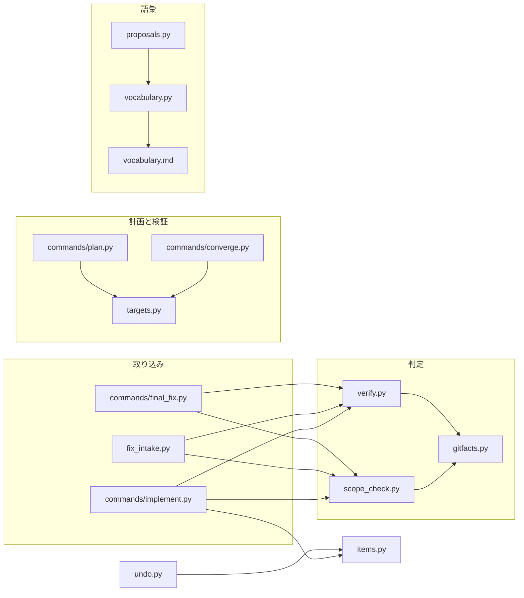
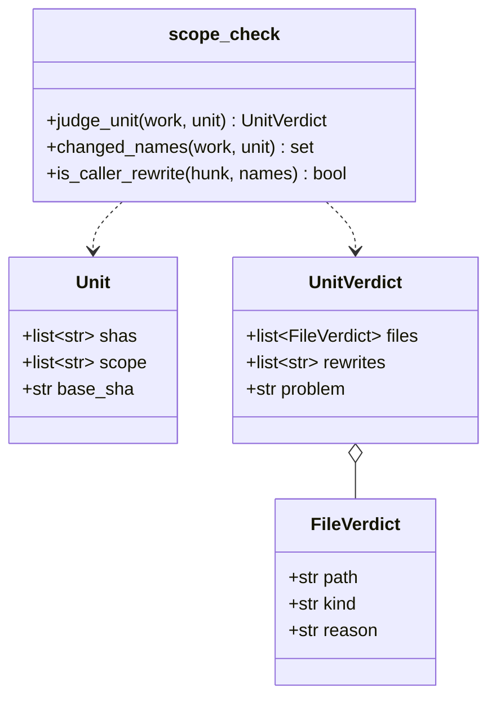
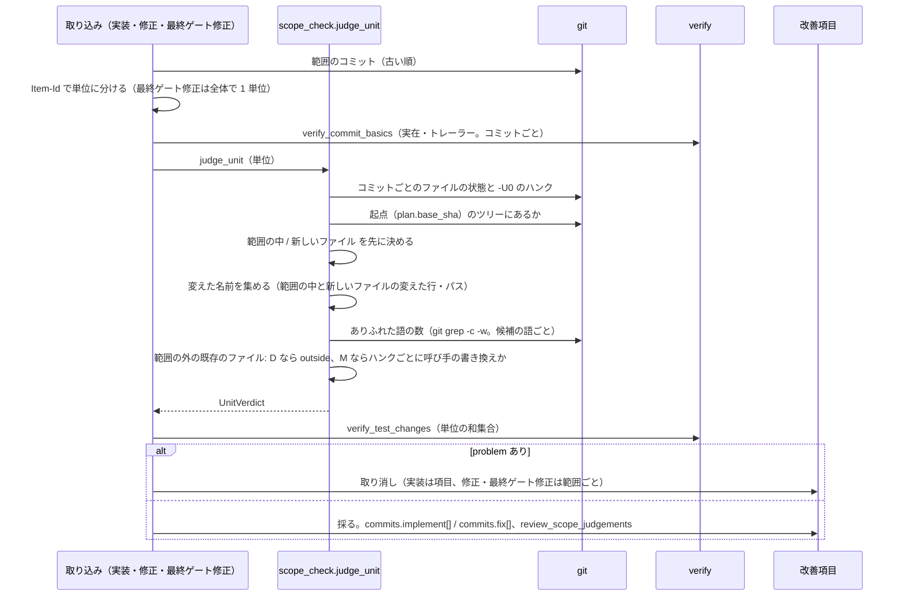
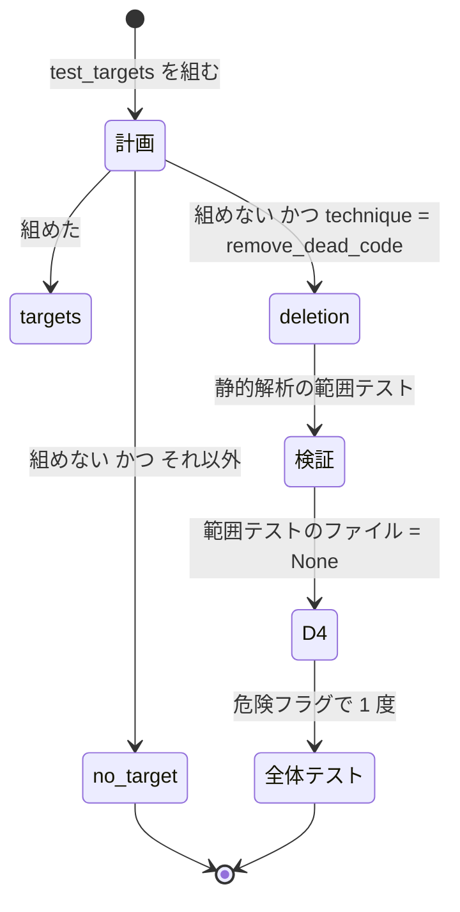

# cross-refactoring: ファイルの分割・クラスの抽出・移動・改名・テストの共通化などの基本の手法が、範囲・差分予算・期待値・コミットの数・語彙の制約で取り消される → 安全に直結する制約を残したまま、各手法の形の項目が採用まで進む（#1814）

## 目的

- **何が壊れているか**: 新しいファイルが必ず範囲の外になり、呼び手の書き換え・移した行・テストの値の移動・2 コミットの項目・語彙に無い手法がそれぞれ取り消しか見送りになる。PR 1732 では 8 件が分割という直す道を塞がれ、43 回の修正がすべて `not_fixed` で終わった
- **誰が困るか**: cross-refactoring を回す開発者。改善は取り消されるだけで、時間と費用だけが掛かる
- **直すと何が成り立つか**: 分割・クラスの抽出・共通モデルの抽出・移動・改名・シグネチャの変更・インライン化・テストの共通化・不要コードの削除・複数コミットの項目が、取り消されずに採用まで進む。push・生成物・トレーラー・テストの追加の純度・機能変更の禁止は今のまま残る

## 適用範囲

- **働く範囲**: cross-refactoring を使うすべてのリポジトリ（配布先を含む）。判定は git の事実だけで行い、言語を問わない
- **プロジェクトごとに違うもの**: 無し。新しく設定も引数も足さない（`--scope` の意味は、戦略に伴わない既存のファイルについて変わらない）
- **当たるモード**: cross-refactoring を通すすべての実行（単独起動・工程の 1 つ）

## あるべき姿の根拠

| 根拠 | 種類 | 何を示すか |
| --- | --- | --- |
| 利用者の判断（2026-10-07）「ファイル分割はリファクタリングの基本であり、範囲で禁じるのは融通が利かなさすぎる」「新しいファイルの置き場所を範囲の中のファイルと同じディレクトリに限る制約も付けない」 | 利用者の指示の原文 | 新しいファイルを置き場所によらず許す |
| 利用者の指示（2026-10-07）「リファクタリングの戦略（分割・統合等）を洗い出し、それを阻害する制約は排除する」「cross-refactoring の無意味な制約はどんどん外す」 | 利用者の指示の原文 | 表の 8 行をすべて外すか緩める |
| PR 1732（#1733）: 8 件が構造検査で落ち、修正担当が 43 回とも「新しいファイルは対象範囲の外」と返した | 実測 | 新しいファイルの禁止が直す道を塞いでいる |
| 9 回の実行（状態ファイル rf1673〜rf1801）の取り消し 16 件のうち 9 件が期待値の一次判定、予算超過 4 件はいずれも適用が成り立っていた、語彙で落ちた正当な提案 4 件 | 実測 | 期待値・差分予算・語彙の制約が正当な項目を落としている |
| `docs/03-review-viewpoints.md:20`「改名と中身の変更が同一コミットに混ざっていないか」 | 既存の規約 | 1 項目 = 1 コミットの規則がレビューの観点と食い違う |

要求と受け入れ条件は #1814 の本文にある（コピーは `issues/issue-1814-requirements.md`）。この文書は「どう作るか」だけを扱う。
決定の記録は [issue-1814-design-decisions.md](issue-1814-design-decisions.md) に分けた。

## ドメインモデル

### コンテキスト

| コンテキスト | 何の語が 1 つの意味に決まるか |
| --- | --- |
| cross-refactoring（`ndf-cross-refactoring`） | 改善項目・取り込み・新しいファイル・呼び手の書き換え・変えた名前・判定の単位 |
| refactoring の語彙（`ndf-workflow` の一部。`refactoring/references/vocabulary.md`） | 兆候・手法・観点の識別子 |

語彙が供給者、cross-refactoring が顧客の関係（顧客 / 供給者）。cross-refactoring は語彙の表を読むだけで、自分では呼び名を持たない（今の `vocabulary.py` の方針のまま）。

### 集約

| 集約 | 持ち主（書き換えてよいもの） | 根 | エンティティ | 値オブジェクト |
| --- | --- | --- | --- | --- |
| 改善項目 | 取り込み（`commands/implement.py`・`fix_intake.py`）と取り消し（`undo.py`） | 改善項目（`items[]`） | — | コミットの並び（`commits.test` / `commits.implement[]` / `commits.fix[]`）・レビューへ引き継ぐ判定（`review_test_judgements` / `review_scope_judgements`） |
| 判定の単位 | 範囲の判定（`scope_check.py`。新設） | 判定の単位（1 回の取り込みで同じ規則に掛けるコミットの組） | — | ファイルの分類・変えた名前の集まり |
| 語彙 | `refactoring/references/vocabulary.md` | 呼び名の表 | — | 兆候・手法・観点（代表の兆候つき） |

判定の単位は永続しない。取り込みのたびに git から組み立て、結論（受け入れ・取り消しの理由・レビューへ引き継ぐパス）だけを改善項目へ書く。

### 不変条件

| # | 集約 | 条件 | 破れたときの扱い |
| --- | --- | --- | --- |
| I1 | 判定の単位 | ファイルの分類は git の事実（起点のツリーにあるか・コミットの差分）だけから決まり、結果ファイルの申告を使わない | 申告を読む実装は受け入れない（テストで縛る） |
| I2 | 判定の単位 | 起点（`plan.base_sha`）のツリーに無いパスは、置き場所によらず範囲の中として扱う | 範囲の外として取り消す（今の振る舞いへの退行） |
| I3 | 判定の単位 | 起点のツリーにあり範囲の外のファイルを消す・名前を変えて元のパスを消すコミットは、手順を外れたものとして扱う | 項目（修正なら修正の範囲）を取り消す |
| I4 | 判定の単位 | 起点のツリーにあり範囲の外のファイルの変更は、すべてのハンクが呼び手の書き換えの条件を満たすときだけ受け入れる | 1 つでも満たさなければ項目（修正なら修正の範囲）を取り消す |
| I5 | 改善項目 | 呼び手の書き換えとして受け入れたファイルは、`review_scope_judgements` に載り、最終ゲートのレビューへ引き継がれる | 載らないまま採用へ進まない |
| I6 | 判定の単位 | 期待値の判定は、単位が変えたテストのファイルの和集合で、前にあった値が後のどこにも無いときだけ `changed` とする | 値が和集合のどこにも無ければ項目を取り消す |
| I7 | 改善項目 | 同じ `Item-Id` の実装のコミットは何件でも 1 項目として受け入れ、すべてを `commits.implement[]` に古い順で持つ | 2 件目以降を落とす実装は受け入れない |
| I8 | 改善項目 | 項目を取り消すときは、その項目のすべてのコミット（テスト・実装の全件・修正）を戻す | 一部だけ戻す実装は受け入れない |
| I9 | 改善項目 | 実差分の行数は取り消しの理由にならない | 差分予算で取り消す経路を残さない |
| I10 | 改善項目 | 範囲テストの対象が無い `remove_dead_code` の項目は `no_target` で見送らず、静的解析の範囲テストと全体テスト 1 回で検証する | 見送る・検証せずに採る、のどちらも受け入れない |
| I11 | 語彙 | 兆候・手法・観点の識別子の集まりは互いに重ならない | `vocabulary.py` の読み込みで止まる（`VocabularyUnavailable`） |
| I12 | 語彙 | 観点はすべて代表の兆候を 1 つ持ち、その兆候は兆候の表にある | 同上 |
| I13 | 判定の単位 | 実装・修正・最終ゲート修正は同じ関数（`scope_check.judge_unit`）で範囲を判定する | 経路ごとの判定を足さない |
| I14 | 改善項目 | 残す制約（push しない・生成物を同期しない・トレーラー・テストの追加でテスト以外を変えない・足したテストが今のコードで落ちたら見送る・修正で手順を外れたら修正の範囲ごと取り消す・文言を固定するテストの禁止・危険フラグ・直さなかった項目の取り消し）は今の振る舞いのまま | 緩める変更を受け入れない |

### ドメインイベント

| # | イベント | 発生元 | 受け手 |
| --- | --- | --- | --- |
| E0 | 参加者が、語彙の手法と兆候（または観点の識別子）で提案を書いた | 提案の参加者 | 提案の統合（`proposals.py`）。観点の識別子は代表の兆候へ写す |
| E1 | 実行の起点のコミットを記録した | リファクタリング計画（`commands/plan.py` の `plan.base_sha`） | 範囲の判定（I2 の起点） |
| E2 | 実装担当が項目のコミットで新しいファイルを作った・ファイルを移した | 実装担当 | 実装の取り込み |
| E2a | 実装担当が 1 項目を複数のコミット（同じ `Item-Id`）に分けた | 実装担当 | 実装の取り込み |
| E3 | 取り込みが、単位の各ファイルを 4 つに分けた | `scope_check.judge_unit` | 実装・修正・最終ゲート修正の取り込み |
| E3a | 取り込みが、単位が変えたテストのファイルの和集合で期待値を判定した | `verify.verify_test_changes` | 同上 |
| E4 | 危険フラグ D1 が立ち、全体テストを 1 度走らせた | 検証（`commands/converge.py`） | 全体テストの見分け |
| E5 | 範囲テストと静的解析の範囲テストが新しいファイルを含めて走った | 検証 | 範囲の判定（`scope_verdict.py`） |
| E5a | 不要コードの削除の項目を、静的解析と全体テストで検証した | 検証（D4 が立つ） | 全体テストの見分け |
| E6 | 修正担当が新しいファイルを直した、または新しいファイルへ分割した | 修正担当 | 修正の取り込み |
| E7 | 項目を取り消し、その項目のすべてのコミットと、項目が作ったファイルが消えた | 取り消し（`undo.drop`） | 台帳・報告 |
| E8 | 最終ゲートが新しいファイルを含む全体で走った | 最終ゲート | 最終ゲート修正（E6 と同じ判定）・レビュー（`review_scope_judgements` を読む） |

### 用語

| 用語 | 意味 | 用語集への反映 |
| --- | --- | --- |
| 新しいファイル | cross-refactoring の実行で、リファクタリング計画の起点（`plan.base_sha`）のツリーに無かったパス。置き場所によらず範囲の中として扱う | 追加（`ndf-cross-refactoring`） |
| 呼び手の書き換え | 範囲の外の既存のファイルで、項目が変えた名前の読み込み・呼び出しだけを書き換える変更。ハンクごとに機械で判定し、通したファイルは最終ゲートのレビューへ引き継ぐ | 追加（`ndf-cross-refactoring`） |
| 変えた名前 | 判定の単位のコミットが範囲の中のファイルと新しいファイルで変えた行に現れる識別子と、新しいファイル・消したファイルのパスの語幹とディレクトリ名から、ありふれた語を除いたもの | 追加（`ndf-cross-refactoring`） |
| 判定の単位 | 取り込みが 1 度に同じ規則へ掛けるコミットの組。実装は項目ごとの全コミット、修正は修正の範囲の項目ごと、最終ゲート修正は修正の全コミット | 追加（`ndf-cross-refactoring`） |
| 代表の兆候 | 観点の識別子を提案の `smell` に書いたとき、写す先の兆候 | 追加（`ndf-cross-refactoring`） |
| 改善項目 | リファクタリング計画が採った改善候補。I-001 の形の ID を持ち、`Item-Id` の同じコミットを何件でも持てる（テストを足すコミットは 1 件） | 意味の変更（`ndf-cross-refactoring`） |

## 機能一覧

| # | 機能 | 誰が使うか |
| --- | --- | --- |
| F1 | 単位の各ファイルを「範囲の中 / 新しいファイル / 呼び手の書き換え / 範囲の外」に分け、最後の分類があれば理由を返す | 実装・修正・最終ゲート修正の取り込み |
| F2 | 実装の取り込みが、同じ `Item-Id` の複数コミットを 1 項目として採る | 実装の取り込み |
| F3 | 期待値の判定を、単位が変えたテストのファイルの和集合で行う | 実装・修正の取り込み |
| F4 | 差分予算による取り消しを外し、実差分は名前の変更を 1 回に数えて記録だけする | 実装の取り込み・報告 |
| F5 | 範囲テストの対象が無い `remove_dead_code` の項目を、静的解析と全体テストで検証する | リファクタリング計画・検証 |
| F6 | 項目が足す新しいテストのファイルを、`--scope` のテストの置き場所の外でも `test_targets` に入れられる | リファクタリング計画 |
| F7 | 語彙に手法 5 つと兆候 3 つを足し、観点を語彙の表へ移して代表の兆候へ写す | 提案の統合 |
| F8 | プロンプトと文書が、新しいファイル・呼び手の書き換え・複数コミットを許すと書く | 実装担当・修正担当・読み手 |

## 構成要素

| 要素 | 責務 |
| --- | --- |
| `refactor_lib/scope_check.py`（新設） | 判定の単位を受け取り、ファイルの分類（F1）と、呼び手の書き換えとして通したファイルを返す。git の事実だけを読む |
| `refactor_lib/verify.py` | `verify_commit_basics` をトレーラーと実在の検査だけに減らし、範囲は `scope_check` へ渡す。`verify_scope` / `out_of_scope_files` / `verify_diff_budget` / `diff_budget_factor` を消す。`collect_test_changes` を「最初の前・最後の後」で組み、`verify_test_changes` を和集合で判定する（F3） |
| `refactor_lib/gitfacts.py` | `commit_diff_lines` に `-M` を付ける。コミットのファイルごとの状態（`A` / `M` / `D`）と `-U0` のハンクを返す関数を足す |
| `refactor_lib/items.py` | `implement_shas(item)`（`commits.implement` が文字列でも並びでも並びで返す）を足し、`item_shas` がそれを使う |
| `refactor_lib/commands/implement.py` | 実装の 2 コミット以上の拒否を外す（F2）。単位の判定・期待値の和集合・`review_scope_judgements` の記録。所要と締め切りは最後のコミットの時刻で測る。差分予算の呼び出しを消す。テストの追加の取り込みも同じ `judge_unit` を通す（1 コミットの規則とテスト以外を変えない規則は今のまま） |
| `refactor_lib/fix_intake.py` | 修正の範囲を項目ごとの単位に分けて `scope_check` と期待値の和集合に掛ける。手順を外れたら今と同じく修正の範囲ごと取り消す |
| `refactor_lib/commands/final_fix.py` | 最終ゲート修正の全コミットを 1 つの単位として `scope_check` に掛ける |
| `refactor_lib/targets.py` | 項目が足すテスト（`planned`）は、テストの suite の `paths` が覆えば `--scope` のテストの置き場所の外でも通す（F6）。`remove_dead_code` の対象無しを `deletion` で返す（F5） |
| `refactor_lib/commands/plan.py` | `deletion` の項目を見送らずに残す |
| `refactor_lib/commands/converge.py` | `command_source: deletion` の項目の D4 の範囲テストのファイルを無し（`None`）とする |
| `refactor_lib/plan.py` / `commands/plan_comment.py` / `undo.py` / `allocation.py` | `commits.implement` を並びとして読む（`implement_shas`）。計画の節に「レビューで確かめる呼び手の書き換え」を載せる |
| `refactor_lib/vocabulary.py` | `VIEWPOINTS` を語彙の表から読み、代表の兆候を持つ。差分予算の定数を消す。I11・I12 を読み込みで確かめる |
| `refactor_lib/proposals.py` | `smell` が観点の識別子なら代表の兆候へ写し、語彙外として降格しない |
| `refactoring/references/vocabulary.md` | 手法 5 つ・兆候 3 つ・観点の節（代表の兆候つき）を足し、「手法ごとの差分予算の倍率」の節を消す |
| `refactoring/references/refactoring-catalog.md` / `code-smells.md` | 足した手法と兆候の説明 |
| `prompts/implement.md` / `fix.md` / `final-fix.md` | 範囲・コミットの数・「提案された手順」の文言（F8。決定 10） |
| `SKILL.md` / `docs/01`〜`04` / `references/design-principles.md` / `docs/specifications/cross-refactoring-*.md` / `CLAUDE.md` | 各制約の説明（AC5。`CLAUDE.md` は C7 の承認の後） |
| `docs/glossary/glossary.json` / `docs/glossary.md` | 用語の表の 6 語 |

## 構造

`FileVerdict.kind` は `in_scope` / `new` / `rewrite` / `outside` の 4 つ。`UnitVerdict.problem` は `outside` が 1 件でもあれば理由の文、無ければ空。`rewrites` は `rewrite` のパスで、呼ぶ側が `review_scope_judgements` へ書く。型は `dataclass` で持ち、状態ファイルへは書かない。

## データ構造

状態ファイル（`statefile`）の改善項目の 2 か所が変わる。新しい集計・比較の単位は増やさない。

| 欄 | 今 | 変更後 | 古い状態ファイルの読み方 |
| --- | --- | --- | --- |
| `items[].commits.implement` | 文字列か `null` | 文字列の並び（古い順。無ければ空） | `items.implement_shas` が文字列を 1 件の並びとして読む。書くときは並びで書く |
| `items[].review_scope_judgements` | 無し | `[{"path": ..., "sha": ...}]`。呼び手の書き換えとして通したファイルとコミット | 無ければ空として読む |
| `items[].diff_lines` | 実装の 1 コミットの追加 + 削除 | 実装の全コミットの和（`-M` で名前の変更を 1 回に数える）。記録だけで判定に使わない | そのまま読む |
| `phases.implement.intake.rejected` | 理由の文 | 同じ（理由の文の中身だけが変わる） | — |

結果 JSON の取り消しの理由から差分予算の文が消える。理由の文の形は自由文のままで、機械で読む側は無い（`grep` で確かめる対象は実装計画が持つ）。

## 処理の流れ

処理の流れの図に含めない要素: 語彙（`vocabulary.md`・`vocabulary.py`・`proposals.py`。提案の統合で表を読むだけで、取り込みの順序に関わらない）、プロンプトと文書、`commits.implement` の読み手（`plan.py`・`plan_comment.py`・`undo.py`・`allocation.py`。`items.implement_shas` を通して読むだけ）。`targets.py`・`commands/plan.py`・`commands/converge.py` は「不要コードの削除の検証」の図に現れる。

### ファイルの分類の順序

1 つのパスは上から最初に当たった分類になる。

| 順 | 条件 | 分類 |
| --- | --- | --- |
| 1 | `path_in_scope(path, scope)`（今の前方一致のまま） | `in_scope` |
| 2 | 起点のツリーにパスが無い（`git cat-file -e <base>:<path>` が失敗） | `new` |
| 3 | 単位のどれかのコミットでそのパスが `D`（名前の変更の元を含む。`--no-renames` で読む） | `outside`（I3） |
| 4 | 単位のコミットのそのパスのハンクがすべて呼び手の書き換え | `rewrite` |
| 5 | それ以外 | `outside`（I4） |

### 呼び手の書き換えの条件（ハンク 1 つ）

`git show -U0 --no-renames <sha> -- <path>` の 1 ハンクについて、識別子は `[A-Za-z_][A-Za-z0-9_]*`、文字列とコメントの中も区別せずに拾う。

| # | 条件 | 例（通る） | 例（落ちる） |
| --- | --- | --- | --- |
| H1 | ハンクの変えた行（削除と追加）に、変えた名前が 1 つ以上ある | `from pkg.a import f` → `from pkg.b import f`（`f` は `a.py` の削除行にあった） | `timeout = 30` → `timeout = 60`（変えた名前が無い） |
| H2 | 追加の行にだけ現れる識別子が、ありふれた語か、変えた名前か、同じハンクの削除の行にある | `g(1, 2)` → `g(1)` / `foo(x)` → `bar(x)` | `f(x)` → `f(x, retry=True)`（`retry` が変えた名前に無い） |

**ありふれた語**は、起点のツリーで追跡しているコードのファイル（`CODE_EXTENSIONS`）の 20% 以上、かつ 3 ファイル以上に現れる識別子である（`import`・`return`・`self` が当たる）。H1 の判定からは除き、H2 では追加の行に現れてよい。値は初期値で、リリース後テストの結果で較正する（決定 2）。

**変えた名前**は次の和集合からありふれた語を除いたもの（決定 2）。

- 単位のコミットが範囲の中のファイルと新しいファイルで変えた行（削除と追加）に現れる識別子
- 単位のコミットが作った・消した・移したパスの語幹とディレクトリ名

### 複数コミットの項目の取り込み

| 手順 | 今 | 変更後 |
| --- | --- | --- |
| 振り分け | `Item-Id` で項目へ | 同じ |
| コミットの数 | 2 件以上で取り消し | 何件でも受け入れる（テストの追加は今のまま 1 件） |
| 締め切り | 最初のコミットの時刻 | 最後のコミットの時刻（完了の時刻） |
| 所要 | 最初のコミットの時刻 | 最後のコミットの時刻（AC6a） |
| 記録 | `commits.implement = sha` | `commits.implement = [sha, ...]` |
| 取り消し | `item_shas` の全件 | 同じ（`item_shas` が実装の全件を返す。I8） |
| 積み直しの再開 | `_remember` の結論を使う | 同じ（積み直した 2 コミットを読み直さない理由は残る） |

### 不要コードの削除の検証

## 非機能の実現方式

| 大項目 | 条件 | 実現方式 |
| --- | --- | --- |
| 運用・保守性 | 範囲・期待値・コミットの数の判定を 1 つの関数に通す | 範囲は `scope_check.judge_unit`、期待値は `verify.verify_test_changes` を実装・修正（・最終ゲート修正の範囲）で共有する。経路ごとの判定を持たない（I13） |
| セキュリティ | 判定の事実を git から取り、申告を使わない | `scope_check` の入力は SHA・範囲・起点だけ。結果ファイルの欄を読まない（I1） |
| 性能 | 全体テストが増えるのは D1 の項目と 6b の項目の 1 回ずつ | 全体テストは今の危険フラグの経路（1 実行に 1 度）だけを使い、新しい全体テストの起動を足さない。`git grep -c -w` は候補の語ごとに 1 回で、候補は単位の変えた行の識別子に限る |

## テスト設計

| 受け入れ条件・不変条件 | どの振る舞いで縛るか | どう壊したら落ちるべきか |
| --- | --- | --- |
| AC1・I2 | 範囲の外の別ディレクトリに新しいファイルを作り範囲の中を変えた実装・修正・最終ゲート修正のコミットが、どれも取り消されない | 分類 2 を外す・起点を HEAD にする |
| AC1a | 実装で作ったファイルを同じ項目の後のコミット・修正・最終ゲート修正が変えても取り消されない | 「作ったコミットだけを許す」判定に変える |
| AC1b・I3・I4 | 範囲の外の既存のファイルで、変えた名前と関係の無い行を変えた・ファイルを消した・名前を変えて元を消したコミットは取り消される | 分類 3 を外す・H1 を外す・H2 を外す |
| AC1c | 範囲の中の関数を新しいモジュールへ移し、範囲の外の呼び手の import だけを書き換えた項目が採られる。範囲の中のファイルを範囲の外のまだ無いパスへ移した項目も採られる | H1 で削除の行の名前を数えない・パスの語幹を変えた名前に入れない |
| AC2 | PR 1732 の形（範囲の中の 1 ファイルが構造検査で落ち、修正担当がその一部を範囲の外の新しいモジュールへ移す）で、項目が採用まで進む | 修正の取り込みが新しいファイルを範囲の外と数える |
| AC3 | 新しいファイルを作った項目で D1 が立ち、静的解析の範囲テストの対象に新しいファイルが入り、最終ゲートの全体テストがそのファイルを含む worktree で走る | `changed_files` から新しいファイルを落とす |
| AC3a | 項目の `tests` に挙げた新しいテストのファイルが `--scope` のテストの置き場所の外でも、suite が覆えば範囲テストで走る。suite が覆わなければ今と同じく組まない | `planned` の置き場所の条件を外し忘れる・suite の条件を外す |
| AC4 | （文書の文言なのでテストを書かない。`AGENTS.md` の規約）レビューで読む | — |
| AC5 | （同上）。`instructions-check.py` と参照切れのチェックスクリプトを通す | — |
| AC6 | 戦略ごとに 1 つ以上の結合テスト（分割・クラスの抽出・共通モデルの抽出・移動・改名・シグネチャの変更・インライン化・テストの共通化・不要コードの削除）で、項目が取り込みから採用まで進む | 該当の判定のどれかを今の形へ戻す |
| AC6a・I7・I8 | 同じ `Item-Id` の 2 コミット（改名・中身の変更）が 1 項目として採られ、所要は最後のコミットの時刻で測られ、取り消しでは 2 コミットとも戻る | 2 件以上の拒否を戻す・最初の時刻を使う・`item_shas` が実装の 1 件だけを返す |
| AC6b・I10 | 対象の無い `remove_dead_code` の項目が見送られず、D4 が立って全体テストが 1 度走り、静的解析も走る。どちらかが落ちれば修正へ回る | `deletion` を `none` に戻す・D4 の範囲テストのファイルを返す |
| AC7・I9 | 見積の 4 倍の実差分の項目が取り消されない。範囲の判定（AC1b）は同じ項目で今どおり働く | 差分予算の判定を残す |
| AC8・I6 | テストの値を同じ項目で作った補助のファイルへ移しただけの項目が採られる。値がどのテストのファイルにも無くなった項目は取り消される | 判定をファイルごとに戻す・`collect_test_changes` で後のコミットの「前」が最初の「前」を上書きする |
| AC9・I11・I12 | 足した 5 つの手法の提案、観点の識別子 8 つを `smell` に書いた提案が `vocabulary` で見送られず、`smell` が代表の兆候になる。兆候・手法・観点が重なる表は読み込みで止まる | 観点の写しを外す・重なりの検査を外す |
| AC10・I14 | push しない・生成物を同期しない・トレーラーが欠けたコミットを取り消す・テストの追加でテスト以外を変えたら取り消す・期待値が本当に変わったら取り消す・戦略に伴わない範囲の外の既存のファイルの変更を取り消す、の今のテストが通り続ける | 残す制約のどれかを緩める |
| I1 | 結果ファイルに「新しく作った」「呼び手の書き換え」と書いても分類が変わらない | 結果ファイルの欄を読む |
| I5 | 呼び手の書き換えで通したファイルが `review_scope_judgements` に載り、リファクタリング計画の節に出る | 記録を落とす |
| I13 | 実装・修正・最終ゲート修正の取り込みが同じ `judge_unit` を呼ぶ（同じ入力で同じ分類になる） | 経路の 1 つに別の判定を足す |

## 設計の結果

| 課題 | 扱い | 取り込み先 | 触るファイル |
| --- | --- | --- | --- |
| #1814 | 実装する | — | `plugins/ndf/skills/cross-refactoring/scripts/refactor_lib/`、`plugins/ndf/skills/cross-refactoring/tests/`、`plugins/ndf/skills/cross-refactoring/prompts/`、`plugins/ndf/skills/cross-refactoring/docs/`、`plugins/ndf/skills/cross-refactoring/SKILL.md`、`plugins/ndf/skills/cross-refactoring/references/design-principles.md`、`plugins/ndf/skills/refactoring/references/`、`docs/specifications/`、`docs/glossary/glossary.json`、`docs/glossary.md`、`CLAUDE.md` |

## 未確認のまま残ること

| 項目 | 内容 |
| --- | --- |
| ありふれた語の閾値 | 20% かつ 3 ファイルは初期値で、実測していない。呼び手の書き換えが落ちすぎる・通りすぎるかは、リリース後テストで結果 JSON の取り消しの理由と `review_scope_judgements` の件数を見て較正する |
| 呼び手の書き換えの取りこぼし | 動的な読み込み・文字列で組み立てた名前・識別子の規則に当たらない言語の呼び手は H1 で落ちる（項目は取り消される。今の振る舞いと同じ側に倒れる） |
| 呼び手の書き換えの通しすぎ | 変えた名前を含む行の値（リテラル）だけを変えたハンクは H1・H2 を通る。D1 の全体テストと最終ゲートのレビュー（I5）が拾う前提である |
| 生成物を新しいファイルとして作る | 新しいファイルを置き場所によらず許すため、実装担当が生成物の置き場所へ新しいファイルを作っても範囲の判定では落ちない。プロンプトの「同期をしない」と、公開直前の同期（同期の結果が差分になる）で拾う前提である |
| `CLAUDE.md` の書き換え | C7 に当たる。設計の承認とは別に、実装の PR で人の承認を取ってから書く |
| #622 | 呼び手の書き換えはハンク単位で縛るため悪化しない見込み（決定 3）。実測は次の実行で `review_scope_judgements` の件数として見る |
