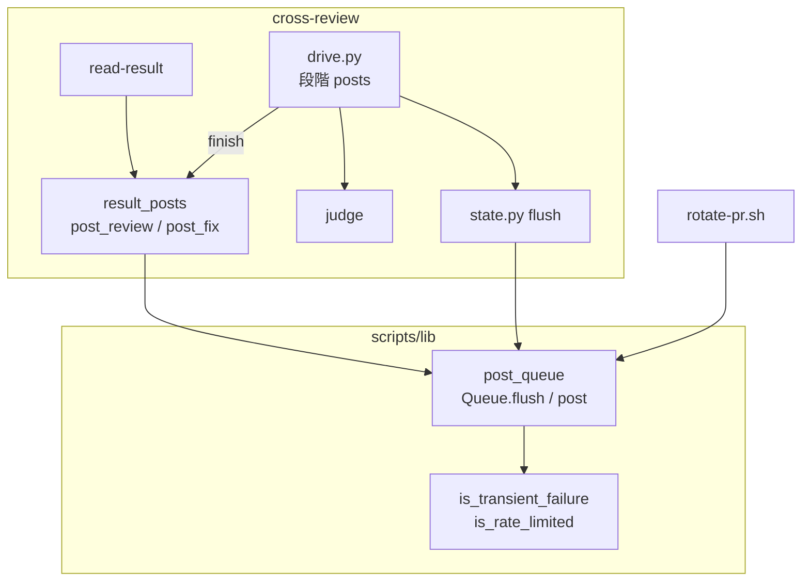
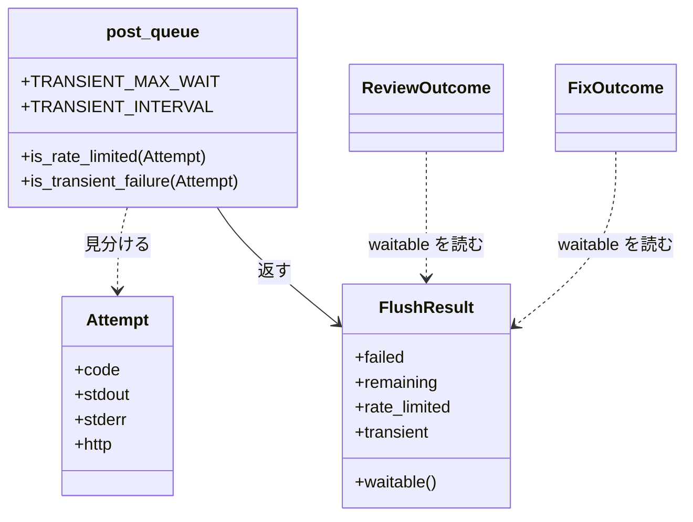
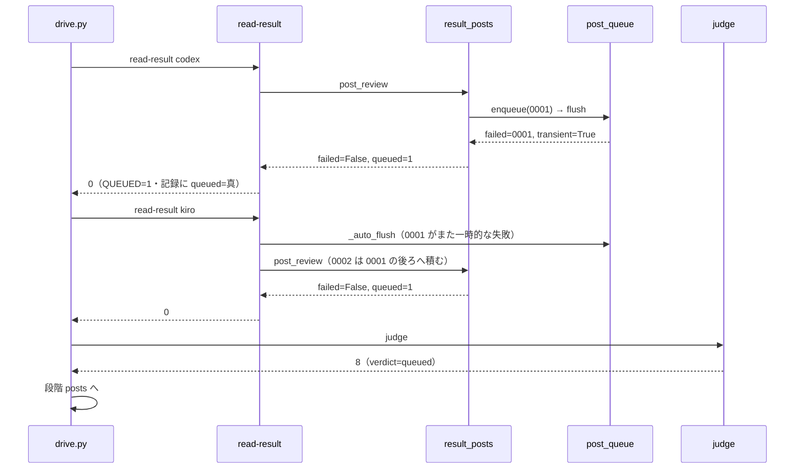
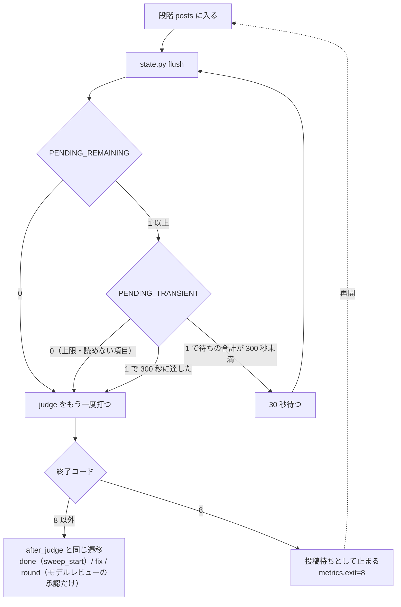
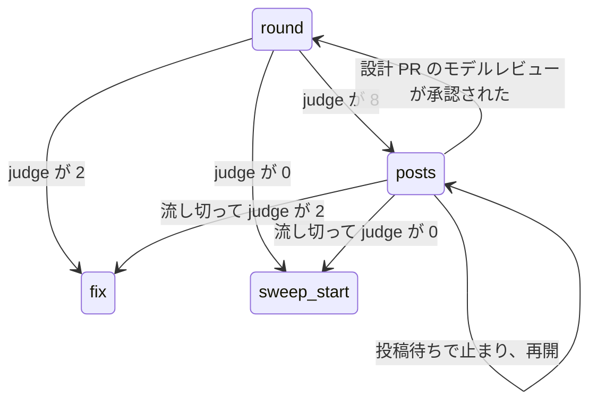

# cross-review: GitHub が一時的に 5xx を返すと、書き終えたレビューが「結果なし」と数えられて起動し直し・中断へ進み、同じラウンドのレビューが二重に並ぶ → 投稿だけを積んで結果を取り込み、担当を起動し直さずに流し直して判定へ進む（#1843）

## 目的

- **何が壊れているか**: GitHub の POST が一時的に失敗する（HTTP 500・本文なし）と、`read-result` が止まり、書き終えたレビューが「結果なし」と数えられる。cross-review は担当を起動し直し、振り替え、中断（`final=error`）へ進む
- **誰が困るか**: cross-review を回す conductor と、検査のプランの持ち主。起動し直した分の LLM の費用とレビューの時間が増え、PR には同じラウンド・同じ席のレビューが二重に並ぶ
- **直すと何が成り立つか**: 一時的な失敗は上限と同じ「待てば流れる」側で扱われる。結果は取り込まれ、担当は起動し直されず、投稿は間をあけて流し直される。戻らなければ「投稿待ち」として止まり、再開で同じラウンドの判定へ進む

## 適用範囲

- **働く範囲**: NDF を入れたすべてのリポジトリの cross-review と、投稿キューを使う単独の `/ndf:fix`（`result_posts.py fix`）・巻き直し（`rotate-pr.sh` の旧 PR へのコメント）
- **プロジェクトごとに違うもの**: 無し（GitHub の応答と `gh` の出力の形にだけ依存し、設定も引数も足さない）
- **当たるモード**: `standard`

## あるべき姿の根拠

| 根拠 | 種類 | 何を示すか |
| --- | --- | --- |
| PR 1842 の round 1（2026-10-07 16:57 UTC）の出力 `02-review.out`: `❌ codex: レビューを投稿できませんでした (exit=1 unexpected end of JSON input)` → `結果が残らず、振り替え先もありません … 中断します` | 実測 | 5xx・本文なしの失敗が今は恒久の失敗と同じ経路へ入り、結果のある担当が中断の理由になる |
| `gh api --hostname nonexistent.invalid ...` が `error connecting to nonexistent.invalid` を標準エラーへ出して終了コード 1、プロキシへ届かないときは `dial tcp 127.0.0.1:9: connect: connection refused`（gh 2.101.0、2026-10-08 に実測） | 実測 | ネットワークの失敗は `(HTTP nnn)` を持たず、標準エラーの語で見分ける |
| `post_queue.py` の冒頭の注記「失敗をそのまま止める側へ倒すと、レビューを 1 巡も進められない。上限のときだけ…積み、回復した後に順に流す（#291）」 | 既存の形 | 積んで後で流す仕組みは既にあり、見分ける対象を足すだけで済む |

要求と受け入れ条件は #1843 の本文にある（コピーは `issues/issue-1843-requirements.md`）。この文書は「どう作るか」だけを扱う。

## ドメインモデル

### コンテキスト

| コンテキスト | 何の語が 1 つの意味に決まるか |
| --- | --- |
| cross-review（`ndf-cross-review`） | 投稿キュー・一時的な失敗・投稿待ち・結果なし・ラウンドの判定 |

1 つのコンテキストに収まる。投稿キュー（`lib/post_queue.py`）は Skill の外の `scripts/lib/` に置かれているが、語は `ndf-cross-review` が持ち、`/ndf:fix` の単独の送りと巻き直しはこの語をそのまま使う。

### 集約

| 集約 | 持ち主（書き換えてよいもの） | 根 | エンティティ | 値オブジェクト |
| --- | --- | --- | --- | --- |
| 投稿キュー | `lib/post_queue.py` の `Queue`（積む・流す・控える） | 待ち行列のディレクトリ 1 つ（PR 1 本分） | 項目（名前 `<連番>-<種別>-<識別子>`） | 送りの試行の結果（`Attempt`）・流した結果（`FlushResult`） |
| ラウンドの記録 | cross-review の `state.py` の副命令（`read-result` が担当の記録、`judge` が判定） | 状態ファイルのラウンド（`rounds[-1]`） | 担当の記録（`rounds[-1].<席>`） | 判定（`verdict`）・結果なしの理由 |
| 収束ループの進行 | `drive.py`（段階の遷移） | 耐久ワークフロー `review-<鍵>` | — | 段階（`round` / `posts` / `fix` …）・止まりの結果 |

**投稿キューとラウンドの記録は ID で結ぶ。** 項目の `extra` が担当とラウンドの番号を持ち、ラウンドの記録は `queued` の真偽だけを持つ。流した後の書き戻し（`queued` の解除と `review_url`）は既存の `posts._confirm_flushed` が行い、この変更では変えない。

### 不変条件

| # | 集約 | 条件 | 破れたときの扱い |
| --- | --- | --- | --- |
| I1 | 投稿キュー | 一時的な失敗で送れなかった項目は消えずに残り、上限・恒久の失敗・位置の拒否のどれとも見分けられる | 流した結果に一時的な失敗の印を立てて返す。印の無い失敗は今までどおり呼び出し側が止める |
| I2 | 投稿キュー | 一時的な失敗の印と上限の印は同時に立たない。恒久の失敗（`dropped/` へ控える）にも数えない | 上限の判定を先に行い、上限に当たれば一時的な失敗を見ない |
| I3 | 投稿キュー | 前の送りが一時的な失敗で終わった項目は、既投稿の照会ができないときは送らない（届いたか分からない項目を二重に送らない） | 送らずに残し、一時的な失敗の印で返す |
| I4 | ラウンドの記録 | 担当の結果ファイルが使え、投稿が上限か一時的な失敗で投稿キューに残っている（待てば流れる）ときに限り、投稿が送れていないことを理由にその担当を結果なし（`NO_RESULT`）に数えない。恒久の失敗（400・404・410・422 と印の無い失敗）と、流した後に届いたと確かめられない場合（`posts._confirm_flushed` の経路）はこれまでどおりである | `read-result` は待てば流れる失敗のときだけ担当の記録に `queued` を真で書き、終了コード 0 で終わる。それ以外の失敗は今までどおり終了コード 1 |
| I5 | 収束ループの進行 | 投稿だけが残っているラウンドで、担当を起動し直さない・新しいラウンドを開かない | 流し直しの段階（`posts`）に留まり、上限まで待って止まる。再開もこの段階から始める |
| I6 | 収束ループの進行 | 流し直しの待ちの合計は、上限の再実行の既定（900 秒）を超えない | 定数を `post_queue` の 1 か所に置き、`drive.py` はそれを読む |

### ドメインイベント

| # | イベント | 発生元 | 受け手 |
| --- | --- | --- | --- |
| E1 | 担当がレビューを書き終えた（結果ファイルと payload が残った） | 担当の CLI | `read-result` |
| E2 | 投稿を投稿キューへ積んだ | `read-result`（`result_posts.post_review`） | 投稿キュー |
| E3 | 積んだ投稿を送ろうとして、一時的な失敗が返った | 投稿キューの `flush` | `result_posts.post_review`（失敗とせず `queued` を返す） |
| E4 | 送れていない投稿のまま、担当の結果を記録へ取り込んだ（`queued` が真） | `read-result` | `judge` |
| E5 | 判定が「投稿が残っている」と答えた（終了コード 8） | `judge` | `drive.py` |
| E6 | 投稿キューを流し直し、送れた | `drive.py` の流し直しの段階（`state.py flush`） | `judge`（もう一度打つ） |
| E7 | 流し直しの上限を超え、「投稿待ち」として止まった | `drive.py` の流し直しの段階 | 収束ループを呼んだ側（conductor・検査のプラン） |
| E8 | 再開で投稿キューを流し、判定へ進んだ | `drive.py` の再開（同じ段階 `posts` から） | `judge` |

### 用語

| 用語 | 意味 | 用語集への反映 |
| --- | --- | --- |
| 一時的な失敗 | 送り直せば届く見込みのある投稿の失敗（HTTP 500・502・503・504、`(HTTP nnn)` の無い本文なしの応答、ネットワークの失敗）。上限とは別に見分け、投稿キューに残して後で流す | 追加（要求の工程で反映済み） |
| 投稿待ち | 担当の結果は記録へ取り込んであり、投稿だけが投稿キューに残っている状態 | 追加（要求の工程で反映済み） |
| 投稿キュー | 送る前に投稿を積み、上限か一時的な失敗で送れなければ残す仕組み（`lib/post_queue.py`） | 意味の変更（`ndf-cross-review`。「上限で」を「上限か一時的な失敗で」へ） |

## 機能一覧

| # | 機能 | 誰が使うか |
| --- | --- | --- |
| F1 | 送りの失敗が一時的なものかを見分け、投稿キューに残す | cross-review・`/ndf:fix` の単独の送り・巻き直しのコメント |
| F2 | 一時的な失敗で送れなかったレビューの結果を、記録へ取り込んで先へ進む | cross-review の `read-result` |
| F3 | 投稿だけが残ったラウンドで、担当を起動し直さずに間をあけて流し直し、判定へ進む | cross-review の `drive.py` |
| F4 | 流し直しの上限を超えたら「投稿待ち」として止まり、再開で同じラウンドの判定へ戻る | conductor・検査のプラン |

## 構成要素

| 要素 | 責務 | 変更 |
| --- | --- | --- |
| `scripts/lib/post_queue.py` | 一時的な失敗の見分け（`is_transient_failure`）、流した結果の印（`FlushResult.transient` と `waitable`）、照会できないときに送らない規則（I3）、待ちの上限の定数、`post()` と CLI の `post` / `flush` の出力 | 変える |
| `scripts/lib/result_posts.py` | `post_review` と `post_fix` が、待てば流れる失敗（上限か一時的な失敗）を失敗に数えない | 変える |
| `skills/cross-review/scripts/review_lib/commands/read_result.py` | 変えない（`posted.failed` が偽になれば、既存の経路で `queued` を書き 0 で終わる） | 変えない |
| `skills/cross-review/scripts/review_lib/commands/judge.py` の `cmd_flush` | `PENDING_TRANSIENT=` を出し、残りの理由を「上限」「一時的な失敗」で書き分ける | 変える |
| `skills/cross-review/scripts/drive.py` | 判定が 8 のとき流し直しの段階 `posts` へ移り、一時的な失敗の間だけ間をあけて流し直す。上限を超えたら「投稿待ち」で止まり、再開はこの段階から行う | 変える |
| `skills/cross-review/docs/07-posts-and-records.md`・`docs/01-state-and-review.md` | 積むかどうかの表と、終了コード 8 の後の扱いを振る舞いに合わせる | 変える |
| `docs/glossary/glossary.json`（と `glossary.py render` の出力） | 「投稿キュー」の意味の変更 | 変える |

`read-result` は変えないが、F2 の振る舞いは `result_posts` の変更を通して `read-result` に現れるため図に置く。図は振る舞いが変わる呼び出しだけを描き、変わらない呼び出し（`judge`・`start-round`・`init` の `_auto_flush`、`upkeep_gh.py`）と、構成要素の表の文書 2 行（cross-review の文書・用語集）は含めない。

### 呼び出し元の一覧

| 呼び出し元 | 呼ぶもの | この変更で振る舞いが変わるか |
| --- | --- | --- |
| cross-review の `read-result` | `result_posts.post_review` | 変わる（一時的な失敗で 0 を返す） |
| cross-review の `drive.py` の `finish`・単独の `/ndf:fix` | `result_posts.py fix`（`post_fix`） | 変わる（一時的な失敗で 0 を返し `QUEUED=` に残りが出る） |
| cross-review の `judge`・`start-round`・`init` | `posts._auto_flush`（`Queue.flush`） | 変わらない（流せなくても止めない経路のまま） |
| cross-review の `state.py flush` | `Queue.flush` | 出力に `PENDING_TRANSIENT=` が加わる |
| `rotate-pr.sh` の旧 PR へのコメント | `post_queue.py post` | 変わる（一時的な失敗でも積んで 0 で進む） |
| backlog-refinement の `upkeep_gh.py` | `post_queue.run`・`is_rate_limited` | 変わらない（上限の判定は変えない） |
| cross-refactoring | 投稿キューを呼ばない（計画のコメントは `gh api` を直接呼ぶ） | 変わらない（前提 5 の確認の結果） |

## 構造

| 型・関数 | 追加・変更 | 責務 |
| --- | --- | --- |
| `is_transient_failure(attempt)` | 追加 | 失敗が前提 1 の 3 つの形のどれかで、上限ではないか。純粋な判定（`gh` を呼ばない。上限は語だけ（`_has_rate_words`）で除き、残り回数を引く `is_rate_limited` は呼ばない） |
| `FlushResult.transient` | 追加（末尾・既定 `False`） | 先頭で止まった項目の失敗が一時的なものか |
| `FlushResult.waitable` | 追加（プロパティ） | `rate_limited or transient`。呼び出し側が「失敗に数えない」を決める唯一の印 |
| `TRANSIENT_MAX_WAIT` / `TRANSIENT_INTERVAL` | 追加（定数） | 流し直しの待ちの上限 300 秒と間隔 30 秒（決定 4） |
| `_try_once` | 変更 | 送りの失敗に `transient` を添えて返す。前回が一時的な失敗で照会が `None` なら送らない（I3） |
| `post()` | 変更 | 送りの失敗が `waitable` に当たれば積んで `QUEUED` を返す |

`rate_limited` の意味は広げない（決定 2）。`ReviewOutcome` と `FixOutcome` の欄は変えない。

## 入出力の契約

| 名前 | 入力 | 出力（成功） | 出力（失敗） | 変更 |
| --- | --- | --- | --- | --- |
| `state.py read-result <PR> <席>` | 変えない | 一時的な失敗のとき: `INLINE=0 BODY=0 QUEUED=1`・`FINDINGS=<件数>`・終了コード 0。送れたときの出力は変えない（AC9） | 400・404・410・422（位置の拒否を除く）と、印の無い失敗は今までどおり終了コード 1 | 終了コードが一時的な失敗のとき 1 → 0 |
| `state.py judge <PR>` | 変えない | 変えない（投稿が残れば 8・`verdict=queued`） | 変えない | 無し |
| `state.py flush <PR>` | 変えない | `PENDING_BEFORE=` / `PENDING_SENT=` / `PENDING_SKIPPED=` / `PENDING_DROPPED=` / `PENDING_REMAINING=` に、`PENDING_RATE_LIMITED=0|1` と `PENDING_TRANSIENT=0|1` を足す。終了コードは常に 0 | — | 行を 2 つ足す |
| `post_queue.py post` | 変えない | 一時的な失敗のとき `QUEUED=1`・終了コード 0。標準エラーは「一時的な失敗のため待ち行列へ積みました（残り N 件）」 | 印の無い失敗は今までどおり 1 | 一時的な失敗のとき 1 → 0 |
| `post_queue.py flush` | 変えない | `PENDING_TRANSIENT=0|1` を足す | — | 行を 1 つ足す |
| `result_posts.py fix` | 変えない | 一時的な失敗のとき終了コード 0・`QUEUED=<残り>` | 印の無い失敗は今までどおり 1 | 一時的な失敗のとき 1 → 0 |
| `drive.py <PR>` が投稿待ちで止まる | 変えない | — | 状態 `stopped`、`summary` は `投稿待ち: 投稿キューに <N> 件残っています（最後の失敗: <last_error>）。再開すると担当を起動し直さずに流し直します`、`metrics.exit` は 8、プロセスの終了コードは 1（`EXIT_STOPPED`）。状態ファイルの `final` は書かない | 止まりの種類を 1 つ足す |

**互換の経路は持たない。** 呼び出し側はすべて同じリポジトリの中にあり、上の一覧で尽きる。`FlushResult` の欄は末尾へ既定つきで足すため、位置で組み立てている既存の呼び出しは壊れない。

## 処理の流れ

### 取り込みから判定まで（PR 1842 の round 1 を変えた後の形で通す）

印の無い失敗（400・404・410・422 の位置以外の拒否、401、上限でない 403）は、今までどおり `post_review` が `failed=True` を返し、`read-result` が 1 で止まる。

### 流し直しの段階 `posts`

- 上限で残っているときは待たない。今までと同じく 1 度だけ流して判定を打ち直し、なお 8 なら止まる（待ちを足すのは一時的な失敗のときだけ。決定 5）
- 判定の 8 以外の終了コードは、段階 `round` の判定の後と同じ遷移へ渡す（`after_judge` を共有する）
- 止まった後の再開（`--from review` で `drive.py` を打ち直す）は、耐久ワークフローが同じ段階 `posts` から続ける。`start-round` を通らないため、新しいラウンドを開かず担当も起動しない（I5）

### 段階の遷移（変わる部分だけ）

`posts` から `init` と、`posts` から担当の起動（`run_reviewers`）への遷移は無い。`posts --> round` は、モデルレビューが投稿待ち（8）で `posts` に入り、流し切った後の `judge` が `MODEL_CONFIRMED=1` と 2 を返したときの遷移で、`after_judge` が `round` を返す（#1111）。投稿が残っていない状態で詳細レビューの次のラウンドを開くため、I5（投稿だけが残っているラウンドで新しいラウンドを開かない）に反しない。

## 非機能の実現方式

| 大項目 | 要求の条件 | 実現方式 | 確かめ方 |
| --- | --- | --- | --- |
| 可用性 | GitHub の一時的な障害（前提 4 の範囲）で cross-review が中断しない（AC3〜AC6） | 一時的な失敗を「待てば流れる」に数え、`read-result` を 0 で終える。`drive.py` は段階 `posts` で最大 300 秒、30 秒おきに流し直し、超えたら `final` を書かずに止まる | `gh` を差し替えて 500 を返した結合テストで、`judge` が 7 も 1 も返さず、`drive.py` が段階 `posts` で止まり、再開で判定へ進むこと |
| 性能・拡張性 | 一時的な失敗で担当を起動し直さないため、LLM の費用とレビューの時間が増えない。流し直しの待ちは前提 4 の上限に収まる | 段階 `posts` は担当を起動しない。待ちの上限 300 秒 ≤ 900 秒 | テストで担当の起動の回数が 0 であること。定数の値を単体テストで縛る |
| 運用・保守性 | 止まったときの出力から、投稿待ちと結果なしを読み分けられる（AC5） | 止まりの `summary` の先頭を `投稿待ち:` にし、残りの件数と `last_error` を載せる。`metrics.exit` を 8 にする（結果なしの中断は judge の 1） | 止まりの結果 JSON の `summary` と `metrics.exit` を見るテスト |

## 決定の記録

### 決定 1: 見分ける場所を 1 つにするため、一時的な失敗の判定を `post_queue` に置き、`gh` の出力の形だけで決める

一時的な失敗かどうかは、上限の判定と同じ材料（標準エラーの `(HTTP nnn)`・標準出力の本文・標準エラーの語）で決まる。判定を `post_queue.is_transient_failure` に置けば、`result_posts`・`state.py flush`・`post_queue.py post` が同じ関数を通る。形は前提 1 の 3 つに限る: `(HTTP 500|502|503|504)`、`(HTTP nnn)` が無く標準出力が空で標準エラーに `unexpected end of JSON input` か `unexpected EOF` がある、`(HTTP nnn)` が無く標準エラーにネットワークの失敗の語（`error connecting to`・`dial tcp`・`connection reset`・`connection refused`・`i/o timeout`・`TLS handshake timeout`・`context deadline exceeded`）がある。上限の語を持つものは先に除く（I2）。5xx とネットワークの失敗は上限の状態（403・429）を持たないため、残り回数の照会は要らない。

cross-review の `review_lib` に判定を足す案は採らない。`/ndf:fix` の単独の送りと巻き直しのコメントが同じ失敗に当たり、Skill ごとに同じ役割の関数が分かれる。

根拠: Value 6（MVV 版 2）

### 決定 2: 上限の意味を変えないため、`FlushResult` に `transient` を足し、呼び出し側は `waitable` だけを読む

`rate_limited` の意味を広げると、`judge` の `cmd_flush` が出す「まだ上限です」が 5xx のときにも出て、止まった理由を読み違える。欄を分ければ、表示と待ち方（決定 5）を理由ごとに分けられる。呼び出し側が「失敗に数えるか」を決める箇所は `waitable` 1 つにし、`result_posts` の 2 か所の `not flushed.rate_limited` を置き換える。

`rate_limited` を「待てば流れる」の意味に改名する案は採らない。上限の語は用語集と cross-review の文書で上限だけを指しており、改名すると語の意味が 2 つになる。

根拠: Value 8 / Value 6（MVV 版 2）

### 決定 3: 二重に並ばないため、前の送りが一時的な失敗で照会もできない項目は送らない

HTTP 500 は GitHub 側でレビューが作られた後に返ることがある。既存の `_try_once` は照会ができない（`posted_match` が `None`）と送る側へ倒すため、照会と送りが続けて失敗から戻った瞬間に、作られていたレビューの隣へもう 1 件作りうる。前回の失敗が一時的な失敗だった項目に限り、照会ができないときは送らずに一時的な失敗として残す。要求の前提 3 はこれを既存の振る舞いとして書いているが、既存の経路は送る側へ倒すため、この変更で前提 3 を成り立たせる。

照会ができないときを常に送らない側へ倒す案は採らない。上限で積んだ項目は照会も上限で落ちるが、上限の応答は作成を伴わないため二重にならず、送る側へ倒す既存の理由（項目が永久に残る）が今も効く。

根拠: Value 1（MVV 版 2）

### 決定 4: 検査のプランを長く止めないため、流し直しの待ちを合計 300 秒・30 秒おきにする

前提 4 は上限の再実行の既定（900 秒・30 秒おき）を超えないことを求める。投稿待ちで止まっても、結果は記録に入っており再開で同じラウンドへ戻れるため、長く待つ利点は小さい。一方で待つ間は検査のプランが進まない。GitHub の 5xx の多くは数分で戻るという前提 4 に合わせ、間隔は既存と同じ 30 秒、合計を 300 秒にする。値は `post_queue` の定数に置き、`drive.py` が読む。

900 秒を使う案は採らない。上限は時間の窓で解けるため長く待つ理由があるが、一時的な失敗は戻らなければ人の調査が要り、待ちを伸ばしても止まるまでが延びるだけである。

根拠: Value 2 / Value 4（MVV 版 2）

### 決定 5: 待ちを 1 ラウンドに 1 か所へ集めるため、`flush` ではなく `drive.py` の流し直しの段階で待つ

`flush` の中で待つと、`read-result` が担当ごとに `flush` を呼ぶため、2 席なら待ちが 2 回重なり、`_auto_flush` を呼ぶ `start-round`・`init` まで待つようになる。`drive.py` の判定の後に段階 `posts` を設ければ、待ちは 1 ラウンドに 1 回で、止まりと再開も耐久ワークフローの段階として扱える。待ちとやり直しは `lib/waits.retry_call` を使い、手で `sleep` のループを書かない。上限で残っているときは待たない（今の振る舞いのまま）。

今の `drive.py` の 8 の扱い（1 度流して打ち直し、なお 8 なら `Stop` で同じ段階 `round` を続きでやり直す）を残す案は採らない。続きが `start-round` から始まり、前のラウンドが `queued` のまま新しいラウンドを開いて担当を起動する。AC6 の「担当を起動し直さない」を満たさない。

根拠: Value 4 / Value 6（MVV 版 2）

### 決定 6: 投稿待ちと結果なしを読み分けるため、投稿待ちの止まりは `final` を書かず `metrics.exit` を 8 にする

`final=error` は終わったループの印で、結果なしの中断（`judge` の 1）と同じ値になる。投稿待ちは結果がそろっており再開で進めるため、`final` を書かずに止まる。止まりの結果 JSON は `metrics.exit` に止まった元の終了コードを持つ規約（`drive_pause.stopped`）なので、判定の 8 をそのまま入れる。プロセスの終了コードは止まり共通の 1 のままにし、呼ぶ側（検査のプラン）の止まりの扱いを変えない。

新しい止まりの種類（`gate` の `pause`）を足す案は採らない。`pause` は人か AI が結果ファイルを書いて進める地点で、投稿待ちは書くものが無く、打ち直すだけで進む。

根拠: Value 2 / Value 4（MVV 版 2）

## テスト設計

| 受け入れ条件・不変条件 | どの振る舞いで縛るか | どう壊したら落ちるべきか |
| --- | --- | --- |
| AC1・I1 | `run` を差し替え、HTTP 500・502・503・504、`(HTTP nnn)` 無しで本文が空の `unexpected end of JSON input`、`error connecting to <host>` の各失敗で `flush` を流すと、項目が残り `failed` が立ち `transient` と `waitable` が真になる | `is_transient_failure` が 5xx のどれかを落とす・本文の有無を見ない・項目を `dropped/` へ控えるように壊すと落ちる |
| I2・AC8 | 上限の 403・429・上限の語の失敗で `transient` が偽・`rate_limited` が真。400・404・410・422 で `transient` が偽、422 の位置の拒否は今までどおり退避して送り直す | 判定の順序を入れ替える・4xx を一時的な失敗に数えると落ちる |
| I3・AC7 | 前回が一時的な失敗の項目で、照会が失敗するときは `send` が呼ばれず項目が残る。照会が既存のレビュー（同じラウンド・同じ席）を見つけると送らずに `skipped` で消える | 照会が `None` のときに送るよう戻すと、送りの回数が 1 になって落ちる |
| AC2・I4 | `read-result` で今回分の送りが 500 で失敗すると、終了コード 0・記録の `queued` が真・`FINDINGS=` が件数・`QUEUED=1` | `result_posts` が `transient` を見ずに `failed` を立てると、終了コード 1 になって落ちる |
| AC3 | AC2 の後の `judge` が担当を `NO_RESULT` に数えず、7 も 1 も返さず 8（`verdict=queued`）を返す | `read-result` が結果なしを書くよう戻すと落ちる |
| AC4・I5 | `drive.py` の段階 `posts` で、1 回目の `flush` が一時的な失敗・2 回目で送れると、判定へ進み担当の起動の回数が 0 | 段階 `posts` が `start-round` か `run_reviewers` を呼ぶと落ちる |
| AC5・I6 | 一時的な失敗が続くと、待ちの合計が 300 秒（`sleep` を差し替えて数える）で止まり、`summary` が `投稿待ち:` で始まり残りの件数と `last_error` を含み、`metrics.exit` が 8、状態ファイルの `final` が空 | 待ちに上限を付けない・`final=error` を書く・定数を 900 秒を超える値にすると落ちる |
| AC5（上限） | 上限で残っているときは待たずに止まる | 上限でも待つと `sleep` の回数が 0 でなくなって落ちる |
| AC6 | AC5 の後に打ち直すと、段階 `posts` から続き、`flush` で送れたら判定へ進む。ラウンドの数は増えない | 再開が段階 `round` から始まると、ラウンドが 1 つ増えて落ちる |
| AC9 | 送りが成功したときの `read-result` の出力の 3 行と記録の形が変わらない | 既存の `test_read_result_posts.py` が落ちる |
| AC10 | `post_fix` の返信と決着の送りが 500 で失敗すると `failed` が偽で `queued` に残りが入る。`post_queue.post` の `pr-comment` が 500 で `QUEUED` を返し、CLI の `post` が 0 で終わる | `post()` が `is_rate_limited` だけを見るよう戻すと落ちる |
| AC11 | 判定は `post_queue.is_transient_failure` 1 つを通る（`result_posts` と `cmd_flush` は `FlushResult` の印だけを読む） | テストでは縛らない。`grep` で 5xx の番号の並びが `post_queue.py` 以外に無いことをレビューで見る |

## 設計の結果

| 課題 | 扱い | 取り込み先 | 触るファイル |
| --- | --- | --- | --- |
| #1843 | 実装する | — | `plugins/ndf/scripts/lib/post_queue.py`、`plugins/ndf/scripts/lib/result_posts.py`、`plugins/ndf/skills/cross-review/scripts/drive.py`、`plugins/ndf/skills/cross-review/scripts/review_lib/commands/judge.py`、`plugins/ndf/skills/cross-review/docs/`、`plugins/ndf/scripts/tests/`、`plugins/ndf/skills/cross-review/tests/`、`docs/glossary/`、`docs/glossary.md` |

## 未確認のまま残ること

| 項目 | 内容 |
| --- | --- |
| HTTP 5xx の実際の出力 | 500・本文なしの形は PR 1842 の実例だけで確かめた。502・503・504 で GitHub が本文を返したとき `gh` は `(HTTP nnn)` を付けると見込むが、障害を起こせないため実測していない。リリース後に 5xx に当たった cross-review の出力で確かめる（要求の検証手段の「手動確認」） |
| ネットワークの失敗の語 | 名前解決の失敗（`error connecting to`）と接続の拒否（`dial tcp … connection refused`）だけを実測した。`i/o timeout`・`connection reset`・`TLS handshake timeout`・`context deadline exceeded` は Go の標準の言い回しから採った語で、実測していない |
| 待ちの上限 300 秒の妥当さ | 実測の根拠は無く、前提 4（数分で戻ることが多い）に拠る。投稿待ちで止まった回数を振り返りで数え、多ければ値を見直す |
| GraphQL の送り（`thread-resolve`）の 5xx | `gh api graphql` が 5xx で `(HTTP nnn)` を付けるかは実測していない。付かなければ本文なしかネットワークの語の経路で拾う |
