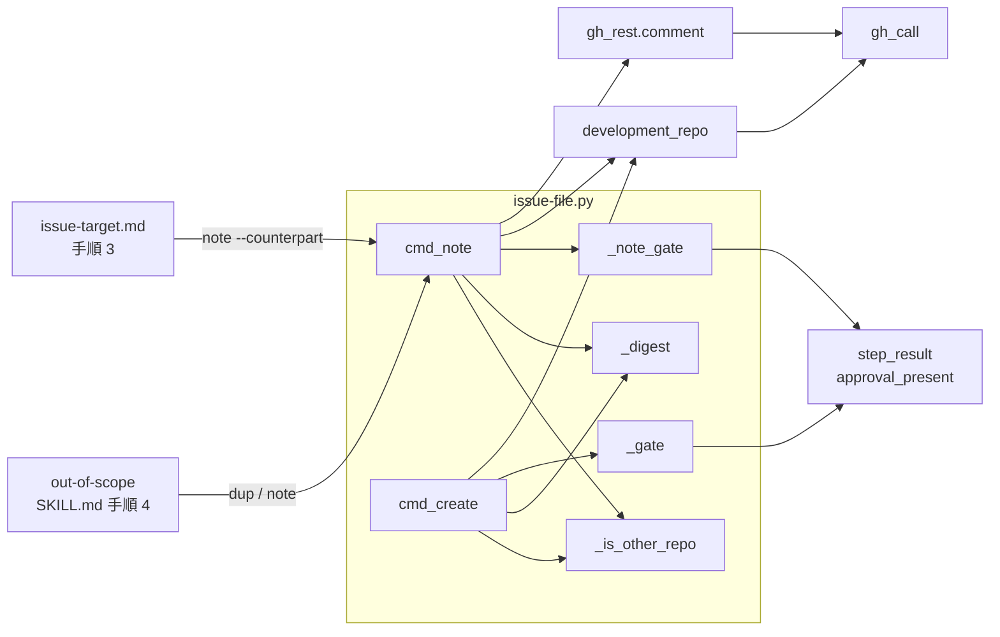
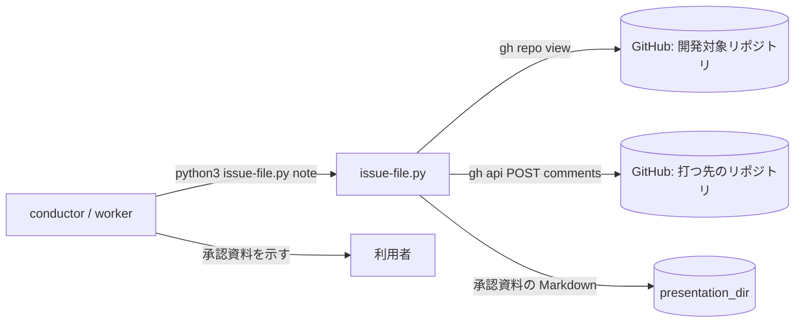
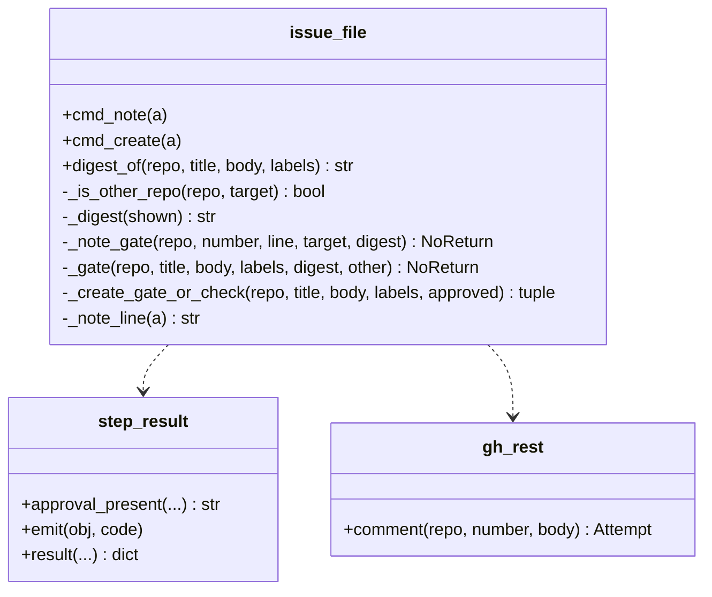
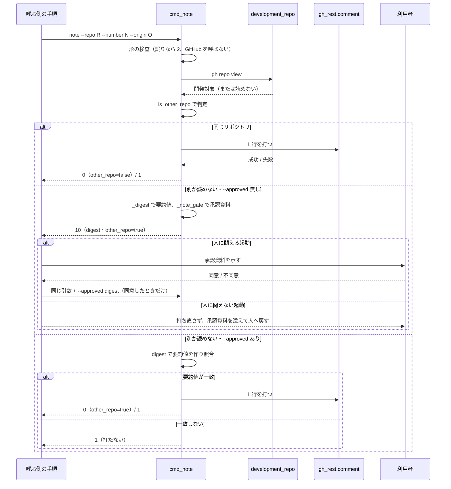

# out-of-scope: 範囲外の課題が別リポジトリの既存課題と重なると、同意を取らずにその課題へコメントが公開される → 別リポジトリへの 1 行は承認資料を示して同意を得たときだけ打ち、同じリポジトリへの 1 行は今までどおり打つ（#1847）

## 目的

- **何が壊れているか**: `issue-file.py note` は、打つ先が開発対象リポジトリと別（NDF の上流など）でも、利用者の同意を取らずに既存の課題へコメントを公開する。共通原則 C5（他のリポジトリへ公開する）は人の承認を省かない
- **誰が困るか**: 開発対象と NDF の上流が別のプロジェクトで `out-of-scope` を通す利用者。範囲外の課題が上流の既存課題と重なったとき、または両方にまたがる課題の手順 3 で、見ていない 1 行が上流へ公開される
- **直すと何が成り立つか**: 別リポジトリ（と開発対象リポジトリを読めないとき）への 1 行は、承認資料で示した内容と同じものだけが同意の後に打たれる。同じリポジトリへの 1 行は止まらない

## 適用範囲

- **働く範囲**: 配布先のすべてのリポジトリ（`issue-file.py` は NDF の配布物で、`out-of-scope` を呼ぶどの工程からも働く）。ai-plugins 自身の開発では打つ先が同じリポジトリのため、振る舞いは変わらない
- **プロジェクトごとに違うもの**: 開発対象リポジトリは `gh repo view` から、打つ先は `--repo` の引数から受ける。設定は足さない
- **当たるモード**: すべてのモード（`out-of-scope` は工程の外に置かれ、どの工程からも呼ばれる）

## あるべき姿の根拠

| 根拠 | 種類 | 何を示すか |
| --- | --- | --- |
| 課題 #1847 の「決めることは 2 つ」と、要求の「決めたこと」（同意つきにする・リポジトリの一致で分ける） | 利用者の指示の原文 | 別リポジトリだけを同意つきにし、同じリポジトリは止めない形 |
| `issue-file.py` の `create`（`_create_gate_or_check`・`_gate`・`digest_of`） | 既存の形に揃える | 承認資料を書いて 10 で止まり、`--approved <digest>` の一致で打つ形と、`other_repo` の判定の規則がすでにある |
| `release-steps.py` の `--approved-sha` | 既存の形に揃える | 示した内容の要約値で同意を受ける前例 |

要求と受け入れ条件は #1847 の本文にある（コピーは `issues/issue-1847-requirements.md`）。この文書は「どう作るか」だけを扱う。

## ドメインモデル

### コンテキスト

| コンテキスト | 何の語が 1 つの意味に決まるか |
| --- | --- |
| 課題の棚卸し（`ndf-issue-upkeep`） | 起票先・由来・上流リポジトリ・開発対象リポジトリ・提示の要約値 |

コンテキストは 1 つで、関係の宣言は要らない。

### 集約

| 集約 | 持ち主（書き換えてよいもの） | 根 | エンティティ | 値オブジェクト |
| --- | --- | --- | --- | --- |
| 既存の課題への 1 行（`note`） | `issue-file.py` の `cmd_note` | 打つ 1 行 | — | 打つ先（リポジトリ・番号）・1 行の本文・提示の要約値・開発対象リポジトリと別か |

**集約は 1 つで、`create` の起票は変えない。** `create` と共有するのは「別のリポジトリか」の判定と要約値の作り方
（どちらも値を返すだけの関数）で、`create` の集約の状態を `note` が書き換える経路は作らない。

### 不変条件

| # | 集約 | 条件 | 破れたときの扱い |
| --- | --- | --- | --- |
| I1 | 1 行 | 開発対象リポジトリと別のリポジトリ（と、開発対象リポジトリを読めないとき）へは、`--approved` が、打つ先・番号・1 行から作った提示の要約値と一致したときだけ打つ | `--approved` が無ければ承認資料を書いて 10、合わなければ打たずに 1 |
| I2 | 1 行 | 「別のリポジトリか」の判定は `create` と同じ規則（開発対象リポジトリと `--repo` を大小文字を無視して比べ、読めなければ別）で、規則の実体は 1 つである | テストが落とす（`create` と `note` で同じ入力に違う判定が出る） |
| I3 | 1 行 | 開発対象リポジトリと同じリポジトリへの 1 行は、承認資料を書かずに打つ | テストが落とす |
| I4 | 1 行 | 引数の形の誤りは、GitHub を呼ぶ前（開発対象リポジトリの読み取りより前）に 2 で止まる | テストが落とす（`gh repo view` を含めて GitHub の呼び出しが 0 件でない） |
| I5 | 1 行 | 承認資料には、打つ先のリポジトリと番号・1 行の本文・開発対象リポジトリと別であることが載る | テストが落とす |

### ドメインイベント

| # | イベント | 発生元 | 受け手 |
| --- | --- | --- | --- |
| E1 | 重複の候補が見つかった | `dup` | `out-of-scope` の手順 4（`note` を呼ぶ） |
| E2 | 打つ先が開発対象リポジトリと同じか別かを判定した | `cmd_note`（共通の判定関数） | `cmd_note`（打つか止まるかを分ける） |
| E3 | 同じリポジトリへ 1 行を打った | `cmd_note` | 呼ぶ側（結果 JSON の `items` と `metrics.other_repo: false`） |
| E4 | 別リポジトリへの 1 行の承認資料を書いて止まった | `cmd_note`（`_note_gate`） | 呼ぶ側の手順（`out-of-scope` の手順 4・`issue-target.md` の手順 3） |
| E5 | 利用者が承認資料を見て同意した | 呼ぶ側の手順（人） | 呼ぶ側の手順（`--approved` を足して打ち直す）。人に問えない起動では人へ戻す |
| E6 | 別リポジトリへ 1 行を打った | `cmd_note` | 呼ぶ側（結果 JSON の `items` と `metrics.other_repo: true`） |

### 用語

| 用語 | 意味 | 用語集への反映 |
| --- | --- | --- |
| 提示の要約値 | 承認資料に載せた内容から作る sha256。`create` では起票先・題・本文・ラベル、`note` では打つ先・番号・1 行から作り、同意の後の `--approved` に渡して、示した内容と打つ内容が同じことを確かめる | 意味の変更（`ndf-issue-upkeep`） |
| 開発対象リポジトリ | 用語集のとおり（`gh repo view` が返すリポジトリ） | — |
| 上流リポジトリ | 用語集のとおり | — |

## 機能一覧

| # | 機能 | 誰が使うか |
| --- | --- | --- |
| F1 | 開発対象リポジトリと同じリポジトリの既存課題へ、由来か相手の課題の 1 行を打つ（今までどおり） | `out-of-scope` を通す conductor / worker |
| F2 | 別リポジトリの既存課題への 1 行の承認資料を書いて止まる | `out-of-scope` を通す conductor / worker |
| F3 | 示した要約値が一致したときだけ、別リポジトリの既存課題へ 1 行を打つ | 承認資料を見て同意した利用者（打つのは conductor / worker） |
| F4 | 手順書が、`note` の 10 を受けて同意を取り、人に問えない起動では人へ戻す | `out-of-scope` を通す conductor / worker |

## 構成要素

| 要素 | 責務 |
| --- | --- |
| `plugins/ndf/scripts/issue-file.py` の `_is_other_repo`（新設） | `--repo` が、呼ぶ側が読んだ開発対象リポジトリと別か（読めなければ別）を返す純粋な関数。`_create_gate_or_check` の中にある判定をここへ移し、`create` と `note` の両方が呼ぶ（I2） |
| `issue-file.py` の `_digest`（新設）と `digest_of` | `_digest` は示した値の辞書から sha256 を作る。`digest_of`（`create`）は今と同じ辞書を `_digest` へ渡し、値は変わらない。`note` は `{"repo", "number", "line"}` を渡す |
| `issue-file.py` の `_note_gate`（新設） | `note` の承認資料（打つ先・番号・1 行・開発対象リポジトリ・別であること）を `approval_present` で書き、10 で止まる（I5） |
| `issue-file.py` の `cmd_note`（変更） | 形の検査 → 判定 → 別なら承認資料か要約値の照合 → コメント。結果 JSON の `metrics` に `other_repo`（別のときは `digest` も）を出す |
| `issue-file.py` の `parser`（変更） | `note` に `--approved` を足す |
| `issue-file.py` の冒頭の説明（変更） | `note` の使い方に `[--approved <提示の要約値>]` を足し、終了コード 10 の対象に `note`（別リポジトリのとき）を入れる（AC10） |
| `plugins/ndf/skills/out-of-scope/SKILL.md` の手順 4（変更） | `note` が 10 を返したら承認資料を示して同意を取り、`--approved <metrics.digest>` を足して打ち直す。人に問えない起動では打ち直さず承認資料を添えて人へ戻す（AC9） |
| `plugins/ndf/skills/out-of-scope/references/issue-target.md` の「両方にまたがる課題」の手順 3（変更） | 上流の課題への `note --counterpart` は開発対象と別のリポジトリへの 1 行なので、手順 4 と同じく 10 を受けて同意を取ることを書く（AC9） |
| `docs/specifications/out-of-scope-issue-file.md` の「既知の限界」（変更） | 「既存の課題へのコメントと C5」の行を、決めた扱い（別リポジトリは同意つき、同じなら同意なし）へ置き換える（AC11） |
| `docs/glossary/glossary.json` と `docs/glossary.md`（変更） | 「提示の要約値」の意味に `note` を足し、`glossary.py render` で文書を作り直す。**この設計の変更で反映済み**で、実装では触らない |
| `plugins/ndf/scripts/tests/test_issue_file.py`（変更） | AC1〜AC8・AC12 と I1〜I5 を縛る。既存の `note` のテストは開発対象リポジトリの応答を足す（偽の `gh` は登録の無い呼び出しで落ちるため） |

**値の集合へ値を足す判定。** 終了コード 10 を返すサブコマンドの集合へ `note` を足す。集合を前提にした既存の規則を、
`issue-file`・`other_repo`・`EXIT_GATE` の検索と、`note` が通る手順（`out-of-scope` の手順 4・`issue-target.md` の手順 3・
`create` の `next`）から集めた。当てはまらないもの（`create` だけを 10 の対象とする冒頭の説明、10 を受けないまま `note` を
打つ手順 4 と手順 3）は上の表に載せた。`create` の `next` が返す `note` のコマンドは `--approved` を持たないが、1 回目は
承認資料を出すために `--approved` 無しで打つのが正しいため変えない。`retrospective` は `by-origin` だけを使い、`note` を通らない。

図は呼び出しの関係だけを描く。`parser`・冒頭の説明・確定仕様・用語集・テストは呼び出しを持たないため図に含めない。



### システム構成

配置は変えない。`issue-file.py` は呼ぶ側（conductor / worker）の作業ディレクトリで動き、GitHub へは `gh` を通して
届く。承認資料は `presentation_dir()`（`NDF_PRESENTATION_DIR`）へ書く。



### パッケージ・モジュール構成

ファイルは足さない。

```text
plugins/ndf/
├── scripts/
│   ├── issue-file.py                 # _is_other_repo・_digest・_note_gate を足し、cmd_note を変える
│   └── tests/test_issue_file.py      # note の同意のテストを足す
└── skills/out-of-scope/
    ├── SKILL.md                      # 手順 4
    └── references/issue-target.md    # 両方にまたがる課題の手順 3
docs/
├── specifications/out-of-scope-issue-file.md  # 既知の限界
├── glossary/glossary.json            # 提示の要約値（この設計の変更で反映済み）
└── glossary.md                       # render で作り直す（同上）
```

## 構造

`issue-file.py` は型を持たず関数でできているため、モジュールを 1 つの箱として、変える関数だけを載せる。



`_is_other_repo(repo, target)` は GitHub を読まない純粋な関数で、`target` が `None` か、大小文字を無視して `repo` と
違えば真を返す。`development_repo()` は呼ぶ側（`cmd_note` と `_create_gate_or_check`）が 1 回読んで渡す。`_note_gate`
の承認資料へ開発対象リポジトリの名前を載せるため、`cmd_note` は読んだ名前を手元に持つ必要があるからである。

## 入出力の契約

### `issue-file.py note`

| 項目 | 書くこと |
| --- | --- |
| 名前 | `python3 issue-file.py note --repo <R> --number <N> (--origin <由来> \| --counterpart <R>#<N>) [--approved <提示の要約値>]` |
| 入力 | `--repo`（必須・`<所有者>/<リポジトリ>`）・`--number`（必須・1 以上）・`--origin` と `--counterpart` のどちらか 1 つ（今までどおり）・`--approved`（任意・新設。別リポジトリのときだけ照合する） |
| 出力（同じリポジトリ） | 0。`items` に `{repo, number, url}`、`metrics` は `{"other_repo": false}` |
| 出力（別・`--approved` 無し） | 10・`status: gate`。`presentation_path` に承認資料、`metrics` は `{"digest": <sha256>, "other_repo": true}`、`next` は「承認資料を示し、同意を得たら同じ引数に `--approved <digest>` を足して打ち直す」 |
| 出力（別・要約値が一致） | 0。`items` に `{repo, number, url}`、`metrics` は `{"digest": <sha256>, "other_repo": true}` |
| 失敗の形 | 形の誤り（`--origin` と `--counterpart` の両方・どちらも無し・形違い・番号が 1 未満・リポジトリの形違い）は GitHub を呼ばずに 2（今までどおり）。別リポジトリで要約値が合わなければ打たずに 1（`metrics.digest` に今の要約値）。書き込みの失敗は 1（今までどおり）。承認資料を書けなければ 2 |
| 互換性 | 同じリポジトリでの呼び出しは変わらない。別リポジトリでは 1 回目が 10 になる。呼び出し元は `out-of-scope` の手順書だけで、同じ変更で直す。互換の経路は持たない |

**提示の要約値の入力。** `{"repo": <--repo のまま>, "number": <番号>, "line": <打つ 1 行>}` を `create` と同じ形
（`sort_keys`・区切りの詰め・`ensure_ascii=False`）で JSON にした sha256。1 行は `--origin` / `--counterpart` から
組み立てた後の文字列なので、どちらを変えても一致しない（AC4）。

**承認資料の項目**（`approval_present` の 2 層の形）:

| 欄 | 中身 |
| --- | --- |
| 題 | `既存の課題へのコメント: <R>#<N>` |
| 対象 | `https://github.com/<R>/issues/<N>` |
| 変更量 | コメント 1 件（1 行） |
| 判断に使うもの | 打つ先（`<R>#<N>`）・コメントの 1 行・開発対象リポジトリ（名前か「読めない（別とみなす）」）・開発対象リポジトリと別か（「別（他のリポジトリへの公開に当たる）」） |
| 同意を求めること | `<R>#<N>` へ、この 1 行をコメントとして公開する |
| 戻し方 | 書いた人が GitHub の画面からコメントを消せる。通知と検索の索引には残るため、公開しなかった状態へは戻らない |

### `issue-file.py create`

変えない。`other_repo` の判定は `_is_other_repo` を呼ぶ形に移すが、入力・出力・要約値の値は今と同じである（AC12）。

## 処理の流れ



同じリポジトリのとき `--approved` は照合しない（決定 3）。図は `note` の流れだけを描く。`create` は判定と要約値の関数を
共通のものへ移すだけで、流れは変えない。

## 非機能の実現方式

| 大項目 | 要求の条件 | 実現方式 | 確かめ方 |
| --- | --- | --- | --- |
| セキュリティ | 開発対象リポジトリと別のリポジトリ（と、判定できないとき）へのコメントは、利用者が見た内容と同じものだけが打たれる（C5）。示していない 1 行は打たれない | 打つ先・番号・組み立てた後の 1 行から要約値を作り、`--approved` と一致したときだけ `gh_rest.comment` を呼ぶ。判定は読めなければ別へ倒す | 別リポジトリで `--approved` 無し・番号違い・1 行違いのそれぞれで `gh_rest.comment` が呼ばれないことをテストで見る（AC2・AC4・AC5） |

## 決定の記録

### 決定 1: C5 を解釈で緩めないため、別リポジトリへの `note` を `create` と同じ承認資料と要約値の形で同意つきにする

C5 は他のリポジトリへの公開に人の承認を要求し、1 行のコメントでも公開であることは変わらない。同意の受け方を `create` と
揃えると、呼ぶ側の手順（10 を受けて示し、`--approved` で打ち直す）と、人に問えない起動で人へ戻す決まりが 1 つで済む。

真偽の引数（`--yes`）は、示した内容と打つ内容が同じかを確かめられず、最初から付ければ承認資料を経ずに打てるため採らない。
手順書で「打つ前に利用者へ聞く」とだけ書く形は、部品が同意の有無を見ないため、手順を読み落とした起動で公開が通るため採らない。

根拠: C5 / Value 6（MVV 版 2）

### 決定 2: 人が止まる回数を C5 の場面だけに絞るため、同意の要否を打つ先と開発対象リポジトリの一致で機械的に分け、読めなければ別とみなす

同じリポジトリへの 1 行は他のリポジトリへの公開ではなく、止める理由が無い。判定は `create` の `other_repo` と同じ規則を
`_is_other_repo` へ移して両方から呼び、規則の実体を 1 つにする。開発対象リポジトリを読めないときは、公開を通すより
止めるほうが安いため、`create` と同じく別の側へ倒す。

すべての `note` を同意つきにする案は、ai-plugins 自身の開発のように打つ先が同じリポジトリの起動で、C5 に当たらない 1 行
のたびに人が止まるため採らない。`resolve-target` の `metrics.same` を呼ぶ側から渡させる案は、渡し忘れや取り違えで判定が
外れ、部品が自分で確かめられないため採らない。

根拠: C5 / Value 2 / Value 6（MVV 版 2）

### 決定 3: 呼ぶ側の手順を 1 つに保つため、同じリポジトリのときは `--approved` を照合せずに打つ

同じリポジトリへの 1 行は同意を要しないため、`--approved` があってもなくても打つ。照合すると、承認資料を出した後に
作業ディレクトリが変わって同じリポジトリと判定された打ち直しが、同意の要らない 1 行なのに 1 で止まる。

同じリポジトリでも `--approved` があれば照合する案は、止める理由の無い場面で止まりうるうえ、守るもの（他のリポジトリへの
公開）が無いため採らない。

根拠: Value 2（MVV 版 2）

### 決定 4: 要約値の作り方を 1 つにするため、`create` と `note` の要約値を共通の `_digest` で作り、`note` は組み立てた後の 1 行を入れる

`digest_of` の JSON の作り方（並べ替え・区切りの詰め・sha256）を `_digest` へ移し、`create` は今と同じ辞書を渡すので値は
変わらない。`note` は `--origin` / `--counterpart` そのものではなく組み立てた後の 1 行を入れ、利用者が承認資料で読んだ文と
同じものを縛る。辞書の鍵の組が `create` と違うため、2 つの要約値が取り違えられることはない。

`note` 専用の要約の関数を別に書く案は、同じ役割の関数を 2 つ持つことになるため採らない。

根拠: Value 6（MVV 版 2）

### 決定 5: 形の誤りで GitHub を呼ばない約束を保つため、開発対象リポジトリの読み取りを形の検査の後に置く

今の `note` は形の誤りで GitHub を 1 回も呼ばずに 2 で止まり、テストもその形で縛っている（AC8）。判定の `gh repo view`
を形の検査より前に置くと、この約束が破れる。そのため順序は「形の検査 → 判定 → 承認資料か照合 → コメント」とする。
同じリポジトリの `note` は `gh repo view` を 1 回多く呼ぶが、1 行のために 1 回であり、判定を省く手段は決定 2 で退けた。

根拠: Value 6（MVV 版 2）

## テスト設計

| 受け入れ条件・不変条件 | どの振る舞いで縛るか | どう壊したら落ちるべきか |
| --- | --- | --- |
| AC1・I3 | 開発対象 `A/x` で `note --repo A/x` が承認資料を書かずに 1 件打ち、0、`metrics.other_repo` が偽 | 同じリポジトリでも承認資料へ回すように壊すと落ちる |
| AC2・I1 | 開発対象 `A/x` で `note --repo B/y`（`--approved` 無し）が `gh_rest.comment` を呼ばず、10、`other_repo` が真、`digest` が 64 桁、`next` に `--approved` | 判定を常に「同じ」にする・`--approved` 無しでも打つように壊すと落ちる |
| AC3・I1 | AC2 の `digest` を `--approved` に足すと 1 件打ち、0 | 要約値の入力を呼ぶたびに変わる値にすると落ちる |
| AC4・I1 | AC2 の `digest` のまま番号か `--origin` / `--counterpart` を変えると打たずに 1 | 要約値から番号か 1 行を外すと落ちる |
| AC5・I1 | `gh repo view` が失敗すると 10、`other_repo` が真 | 読めないときを「同じ」へ倒すと落ちる |
| AC6・I2 | `--repo a/X` と開発対象 `A/x` で AC1 と同じく打つ | 大小文字を区別して比べると落ちる |
| AC7・I5 | 承認資料に打つ先のリポジトリと番号・1 行・別であることが載る | 承認資料から 1 行か「別」の表示を落とすと落ちる |
| AC8・I4 | 形の誤り（両方・無し・形違い）で GitHub の呼び出しが 0 件で 2。同じリポジトリと別リポジトリ（同意の後）の両方で、`--origin` / `--counterpart` の 1 行の文面が今と同じで、書き込みの失敗が 1 | 判定を形の検査より前に置くと落ちる。別リポジトリの経路で 1 行の組み立てを変えると落ちる |
| AC12・I2 | 既存の `create` のテストが変えずに通る。`create` と `note` へ同じ `--repo` と開発対象を与えたとき `other_repo` が一致する | `create` の要約値の入力か判定を変えると落ちる |
| AC9・AC10・AC11 | 手順書・冒頭の説明・確定仕様の文面 | テストを書かない（`.md` の文言を照合するテストは書かない）。レビューで見る。参照切れは既存のチェックスクリプトが見る |

## 設計の結果

| 課題 | 扱い | 取り込み先 | 触るファイル |
| --- | --- | --- | --- |
| #1847 | 実装する | — | `plugins/ndf/scripts/issue-file.py`、`plugins/ndf/scripts/tests/test_issue_file.py`、`plugins/ndf/skills/out-of-scope/SKILL.md`、`plugins/ndf/skills/out-of-scope/references/issue-target.md`、`docs/specifications/out-of-scope-issue-file.md` |

## 未確認のまま残ること

| 項目 | 内容 |
| --- | --- |
| 止まる回数 | 開発対象と上流が別のプロジェクトで、別リポジトリへの `note` が承認資料で止まる回数は測っていない。このスプリントの振り返りで回数を見て、見直すかを利用者が決める（要求の「未決」） |
| 実機での通し | 開発対象と上流が別のリポジトリで `out-of-scope` を通し、上流の既存課題への `note` が承認資料で止まり、同意の後に打てることは、リリース後の手動確認で見る（要求の「検証手段」） |
| 範囲外の書き込みの経路 | `fix` の返信・`gh pr comment` など `out-of-scope` 以外で他のリポジトリへ書き込む経路は点検していない（要求の「含まない」） |
