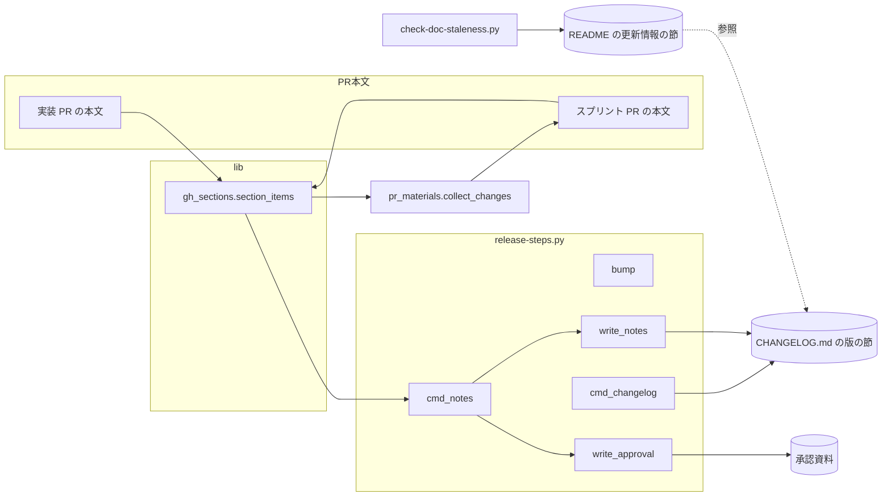
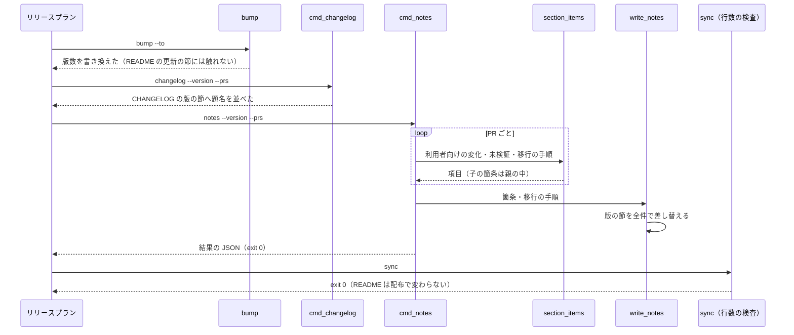

# release: 配布のたびに README の更新の案内が書き足されて行数の上限を超え、LLM が README を手で縮める → README は現行版の説明だけを持ち、更新情報は CHANGELOG.md の版の節を正本にする（#1867）

## 目的

- **何が壊れているか**: `release-steps.py notes` が PR 本文の箇条をすべて README の版ごとの更新の節（`## v<版> へ更新するとき`）へ写すため、10.17.68 では README が 500 行を超え、開発版と本番の両方で `sync` が落ちて `fix` の worker（LLM）が README を縮めた。字下げした子の箇条は独立した項目に割れ、行数をさらに増やした。そもそも README に版ごとの変化を書く必要が無い（利用者の指示）
- **誰が困るか**: 配布を回す conductor と、その費用を払う利用者（1 回の配布で LLM の修正が 2 回・各約 $0.25）。案内の削り方が版ごとに変わり、README の読み手も困る
- **直すと何が成り立つか**: 配布の手順（`bump`・`changelog`・`notes`）は plugin の README に触れず、README の行数は配布で変わらない。README は現行版の説明と、CHANGELOG.md を参照する固定の節だけを持つ。変化と移行の手順の全件は CHANGELOG の版の節に欠けずに並び、子の箇条は親の項目の中に残る

## 適用範囲

- **働く範囲**: NDF を使うすべてのリポジトリの `release-steps.py` の `bump`・`changelog`・`notes`（`--approval` なし）と、PR 本文の箇条を読む共通の部品 `gh_sections.section_items`。README の固定の節と、版ごとの更新の節を禁じるチェック（`scripts/check-doc-staleness.py`）は ai-plugins の中だけ
- **プロジェクトごとに違うもの**: README の固定の節の文面（CHANGELOG.md の在りか）は各プロジェクトの README の本文が持つ。スクリプトは README を読まず書かないため、設定も引数も足さない
- **当たるモード**: リリースの工程（開発版と本番のリリースプランの `bump`・`changelog`・`notes` のステップ）。モードの判定には関わらない

## あるべき姿の根拠

| 根拠 | 種類 | 何を示すか |
| --- | --- | --- |
| 承認ゲート 1（設計 PR #1874）での指示: 「そもそもREADME.mdに更新情報を記載する必要はない。as-isの現行版の情報のみを記載すれば良い。『更新情報はCHANGELOG.md』を参照、と書かれていれば十分では？」 | 利用者の指示の原文 | README は現行版の説明だけを持ち、更新情報は CHANGELOG.md を参照する 1 行で足りる |
| スプリント m1847 の `7-release-1863-state/progress.jsonl` と `8-release-prod-state/progress.jsonl` | 実測 | 開発版と本番の両方で `sync(exit=1) → judge[fix] → fix → sync(exit=0)` が通った |
| コミット `4f7abe29e` と `3c67921ac` | 実測 | worker が README を 506 行から 499 行へ縮めた。縮め方が 2 回で違う（項目の併合と、1 項目 1 行の分割の取り消し） |
| `plugins/ndf/README.md`（10.17.68 の後で 499 行、更新の節の外が 478 行） | 実測 | 更新の節に使えるのは 21 行だけで、PR 本文の箇条を写す限りいずれ超える |
| `plugins/ndf/README.md`・`plugins/playwright-kit/README.md`・`plugins/mcp/` の 9 本の README | 実測 | 版ごとの更新の節が 11 本・12 節にある（mcp-playwright は v2.0.1 と v2.0.0 の 2 節）。ndf のほかは手書きで、`bump` が見出しの版数だけを書き換えるため、本文が前の版の説明のまま残りうる |
| CHANGELOG.md の版の節（`## [ndf 10.17.68]` ほか） | 実測 | ndf の版の節は README の更新の節と同じ箇条を持つ。MCP プラグインの版の節は `mcp-serena 2.1.0` だけで、README にしか無い記述がある |
| PR #1861 の本文の「利用者向けの変化」（2 字下げの子の箇条 3 行） | 実測 | `section_items` が子の箇条を独立した項目として返し、スプリント PR #1863 の本文で 3 行の独立した項目になった |

要求と受け入れ条件は #1867 の本文にある（コピーは `issues/issue-1867-requirements.md`）。この文書は「どう作るか」だけを扱う。

## ドメインモデル

### コンテキスト

| コンテキスト | 何の語が 1 つの意味に決まるか |
| --- | --- |
| NDF のリリース（`ndf-release`） | 版の節・更新情報の節・子の箇条。PR 本文の箇条から変更履歴を組むまで |

1 つのコンテキストに収まる。PR 本文を書く側（`pr` の Skill・スプリント PR の本文の組み立て）とは、PR 本文の `## 利用者向けの変化` の節の形（Markdown の箇条書き）を公開された言語としてやり取りする。

### 集約

| 集約 | 持ち主（書き換えてよいもの） | 根 | エンティティ | 値オブジェクト |
| --- | --- | --- | --- | --- |
| 版の節 | `release-steps.py` の `write_notes`（見出しと題名の箇条を足すのは `changelog` の `_update_changelog`） | CHANGELOG.md の `## [<plugin> <基底の版>]` の見出し | 利用者向けの変化の項目 | 子の箇条・`（#番号）` の印・移行の手順の項目 |
| 更新情報の節 | README の書き手（人）。スクリプトは書かない | README の `## 更新情報` の見出し | — | CHANGELOG.md への案内の行 |
| PR 本文の箇条（読むだけ） | 書き手は PR の作成者。`section_items` は読むだけ | PR の本文の節の見出し | 項目 | 子の箇条 |

更新情報の節は版を名乗らず、版の節の項目を持たない。版が変わっても書き換える必要が無い。

### 不変条件

| # | 集約 | 条件 | 破れたときの扱い |
| --- | --- | --- | --- |
| I1 | 更新情報の節 | `bump`・`changelog`・`notes` は plugin の README を読まず書かない。走らせる前後で README はバイト単位で同じ | テストで落とす |
| I2 | 更新情報の節 | plugin の README（`plugins/*/README.md`・`plugins/mcp/*/README.md`）に `## v<版> へ更新するとき` の見出しが無い | `check-doc-staleness.py` が非 0 で落とす（`validate-runtime-plugins.sh` から走る） |
| I3 | 版の節 | 版の節には、渡した PR のうちマージされたものの利用者向けの変化の項目と移行の手順の項目が 1 件も欠けずに並ぶ（今と同じ） | テストで落とす |
| I4 | 版の節 | 同じ版・同じ PR の組で `notes` を続けて走らせると、2 回目の後の CHANGELOG.md は 1 回目の後とバイト単位で同じ | テストで落とす |
| I5 | PR 本文の箇条 | 字下げした子の箇条は親の項目の中に 1 段の入れ子として残り、独立した項目にならない。`（#番号）` は親の 1 行目にだけ付く | テストで落とす |
| I6 | 承認資料 | `notes --approval` が書く 2 つの欄・未検証の節・移行の手順の節は、子の箇条を含まない入力で今と同じ中身になる | テストで落とす |

### ドメインイベント

| # | イベント | 発生元 | 受け手 |
| --- | --- | --- | --- |
| E1 | 版を上げた（**変わる**: README の更新の節の見出しを書き換えない） | `bump` | `changelog` |
| E2 | CHANGELOG の版の節へ PR の題名を並べた（**変わる**: README を書かない） | `changelog` | `notes` |
| E3 | PR 本文の「利用者向けの変化」と「移行の手順」から、CHANGELOG の版の節を組み直した（**変わる**: README を書かない） | `notes` | 版の節の読み手（利用者・`approval-facts`） |
| E4 | 行数の検査が README を見た | `sync`（`check-doc-line-limit.py`） | リリースプランの `release`。README は配布で変わらないため落ちない |
| E5 | 本番の `notes` が、開発版と同じ PR の組から CHANGELOG を組み直した | 本番のリリースプランの `notes` | `sync`。版の節の本文は開発版の後と同じになる |

### 用語

| 用語 | 意味 | 用語集への反映 |
| --- | --- | --- |
| 更新情報の節 | plugin の README の `## 更新情報` の節。版を名乗らず、CHANGELOG.md の版の節を参照する固定の案内だけを持つ。スクリプトは書かない | 追加（`ndf-release`） |
| 版の節 | CHANGELOG.md の `## [<plugin> <基底の版>]` の見出しから次の `## ` までの節。その版の利用者向けの変化と移行の手順の全件の正本 | 追加（`ndf-release`） |
| 子の箇条 | PR 本文の箇条書きで、前の項目より字下げした箇条。親の項目の一部として読む | 追加（`ndf-release`） |

承認ゲート 1 の前の案で用語集へ足した「更新の節」（README の `## v<版> へ更新するとき` の節）は外す。この設計の後は README にその節を置かず、CHANGELOG の版の節が同じ役を持つ。

## 機能一覧

| # | 機能 | 誰が使うか |
| --- | --- | --- |
| F1 | 配布の手順（`bump`・`changelog`・`notes`）が plugin の README に触れない | リリースプランのステップ |
| F2 | CHANGELOG の版の節へ利用者向けの変化と移行の手順の全件を書く（今と同じ。子の箇条は入れ子で残る） | リリースプランの `notes` のステップ・CHANGELOG の読み手 |
| F3 | PR 本文の節の箇条を、子の箇条を親の中に残して読む | `notes`・`notes --approval`・スプリント PR の本文の組み立て（`pr_materials.collect_changes`） |
| F4 | plugin の README に版ごとの更新の節があれば検査で落とす | `validate-runtime-plugins.sh`・CI |
| F5 | 今の README の版ごとの更新の節を、更新情報の節へ置き換え、版の記述を CHANGELOG の版の節へ移す（1 回だけの移し替え） | 実装の PR |

## 構成要素

| 要素 | 責務 |
| --- | --- |
| `plugins/ndf/scripts/lib/gh_sections.py` の `section_items`（変える） | 節の箇条を項目の列で返す。字下げした箇条は前の項目の子として `\n  - <本文>` でつなぎ、`（#番号）` を親の 1 行目へ付ける（I5） |
| `plugins/ndf/scripts/release-steps.py` の `write_notes`（変える） | 版の節へ全件を書く（今と同じ）。README を探して差し替える後半を消す（I1）。結果の JSON の `items[]` は CHANGELOG.md の 1 件だけになる |
| `plugins/ndf/scripts/release-steps.py` の `_update_plugin_readme`（消す）と `cmd_changelog`（変える） | `cmd_changelog` は `_update_changelog` だけを呼ぶ。`next`（「更新案内の本文を利用者向けの説明へ書き直す」）を出さない |
| `plugins/ndf/scripts/release-steps.py` の `bump` の組み立て（変える）と `release_lib/bump.py` の `bump_update_heading`（消す） | `bump` は README の更新の節の見出しを書き換えず、見出しが無いことも `manual` に出さない |
| `plugins/ndf/scripts/release-steps.py` の冒頭の説明（変える） | `notes` の説明から README の更新の節を外す |
| `scripts/check-doc-staleness.py` の `check_upgrade_heading`（変える）と `UPGRADE_HEADING` | 見出しの版数を突き合わせる代わりに、plugin の README に `## v<版> へ更新するとき` があれば落とす（I2）。対象は `plugins/*/README.md` と `plugins/mcp/*/README.md`。冒頭の説明の「F」も合わせる |
| `plugins/ndf/README.md` ほか 11 本の README（変える）と `plugins/mcp/mcp-bigquery/README.md`（足す） | 版ごとの更新の節を外し、同じ位置に更新情報の節を置く（下の「README の移し替え」）。節を持たなかった mcp-bigquery にも置く |
| `CHANGELOG.md`（足す） | README の版ごとの更新の節にしか無かった版の記述を、その版の節へ移す。版の節が無ければ足す |
| `plugins/ndf/scripts/experimental/hook-trial/ht_bump.py`（変える） | bump-my-version の設定から `plugins/ndf/README.md` の更新の節の見出しの項目を外す（見出しが無くなり、置き換えに失敗するため） |
| テスト（変える・足す） | `plugins/ndf/scripts/tests/test_release_steps.py`・`test_step_scripts.py`・`scripts/tests/test_doc_staleness.py`・`scripts/tests/doc_staleness_helpers.py`。受け入れ条件 1〜11 と I1〜I6 を縛る。README の更新の節を前提にした既存のテストは、README が変わらないこと・見出しがあると落ちることを見るように直す |
| `plugins/ndf/skills/release/references/release-steps.md`・`plugins/ndf/skills/release/SKILL.md`（変える） | `notes`・`changelog` が README を書かないこと、子の箇条の扱い。「更新案内に載せたコマンドを確かめる」の対象を CHANGELOG の版の節（移行の手順を含む）へ向け直す |
| `plugins/ndf/skills/pr/SKILL.md`・`plugins/ndf/scripts/supervise_lib/prompts.py`・`plugins/ndf/scripts/pr-steps.py`（変える） | 「`## 利用者向けの変化` は CHANGELOG と更新案内へ載る」の「更新案内」を外す |
| `docs/versioning-and-distribution.md`（変える） | 版数を持つ箇所の表から更新案内の見出しを外し（8 箇所 → 7 箇所）、「チェックに載らず手で直す箇所」と「バージョン更新時の手順」の 3 番から更新の節の本文を書き直す手順を外す |
| `docs/specifications/ndf-knowledge-and-kiro.md`・`docs/specifications/ndf-release-other-plugin-levels-and-migration.md`・`docs/plugin-development-guide.md`・`scripts/validate-runtime-plugins.sh` のコメント（変える） | 「更新案内は入口に残す」などの記述を、更新情報の節と CHANGELOG の版の節の役割へ書き換える |
| `docs/glossary/glossary.json` と `docs/glossary.md`（変える） | 用語の表のとおりに直し、`glossary.py render` で作り直す |

変えないもの: `_update_changelog`、`check-doc-line-limit.py`、`write_approval`、`section_items` のほかの呼び手（`pr_materials.collect_changes`・`release_lib/others.migration_items`・`supervise_lib/pr.py` の移行の手順の有無の判定。返す項目の形だけが変わり、`pr.py` は項目の有無しか見ない）、`scripts/ci-heavy-skip.py`（README を文書として扱うだけで、見出しを読まない）。

下の図と処理の流れの図には、実行の経路に乗らない要素（テスト・手順書・用語集・README の移し替え）と、項目の有無だけを見る `supervise_lib/pr.py` を載せない。



`bump`・`cmd_changelog`・`write_notes` から README への矢印は無い（I1）。

## 構造

型は増やさない。`section_items` の返り値は今と同じ `list[str]` で、1 項目が複数行を持ちうる形に変わる。

```text
plugins/ndf/scripts/
├── lib/gh_sections.py          section_items（子の箇条を親の中に残す）
├── release-steps.py            write_notes（CHANGELOG の版の節だけ）
│                               cmd_changelog（_update_plugin_readme を消す）
├── release_lib/bump.py         bump_update_heading を消す
└── supervise_lib/pr_materials.py   変えない（section_items の返す形が変わるだけ）
scripts/
└── check-doc-staleness.py      check_upgrade_heading（版ごとの更新の節があれば落とす）
```

項目の形（PR #1861 の本文を `n=1861` で読んだとき）:

```text
ndf の design Skill では、決定を分けたファイルの形が次の 3 点に決まっています。（#1861）
  - ファイルの名前
  - `## 決定の記録` の節
  - `### 決定 N` の見出し
```

呼び手は今と同じく `f"- {item}"` で箇条にするため、版の節とスプリント PR の本文では親の箇条の下に 1 段の入れ子として並ぶ。承認資料の表のセルでは `approval_cell` が改行を `<br>` に変える（今の仕組みのまま）。

## 入出力の契約

### `release-steps.py notes`（`--approval` なし）

| 項目 | 今 | 変更後 |
| --- | --- | --- |
| 引数 | `--version` `--prs` `--plugin` | 変えない |
| 終了コード | 0 / 2 / 3 | 変えない |
| 版の節 | 利用者向けの変化の項目 → 空行 → `### 移行の手順` → 項目（0 件なら見出しを作らない） | 変えない。項目が子の箇条を持つときは親の下に `  - ` の行が続く |
| README | 更新の節を版の節と同じ行で差し替える | 読まず書かない |
| 結果の JSON の `items[]` | CHANGELOG.md と README の 2 件 | CHANGELOG.md の 1 件 |
| 結果の JSON の `metrics` | `version` `prs` `lines` `migration` `fallback` `unmerged` | 変えない |

### `release-steps.py changelog`

| 項目 | 今 | 変更後 |
| --- | --- | --- |
| 引数・終了コード | `--version` `--prs` `--plugin`・0 / 2 / 3 | 変えない |
| README | 更新の節を PR の題名の一覧で差し替える | 読まず書かない |
| 結果の JSON | `items[]` に README の節、`next` に「更新案内の本文を利用者向けの説明へ書き直す」 | `items[]` は CHANGELOG.md の節だけ、`next` は出さない |

### `release-steps.py bump`

| 項目 | 今 | 変更後 |
| --- | --- | --- |
| README の更新の節の見出し | 新しい版へ書き換える。見出しが無ければ `manual` に「手で足す」、基底の版が変われば `manual` に「本文を書き直す」 | 触れない。`manual` にも出さない |
| ほかの版数を持つ箇所 | 書き換える | 変えない |

### `scripts/check-doc-staleness.py`

| 入力 | 今 | 変更後 |
| --- | --- | --- |
| `plugins/ndf/README.md` に現行版の更新の節の見出しが 1 つ | 通る | 落とす（見出しの位置とファイルを出す） |
| 見出しが無い | 落とす | 通る |
| `plugins/playwright-kit/README.md`・`plugins/mcp/*/README.md` に見出しがある | 見ない | 落とす |

### README の更新情報の節（実装の PR で 12 本へ置く）

```markdown
## 更新情報

版ごとの変更と移行の手順は [CHANGELOG.md](https://github.com/devbasex/ai-plugins/blob/main/CHANGELOG.md) の `[ndf <版>]` の節にあります。
```

- `[ndf <版>]` の `ndf` は plugin の名前（`playwright-kit`・`mcp-serena` など）に置き換える。版数は書かない
- 置く位置は今の版ごとの更新の節があった位置。節を持たなかった `plugins/mcp/mcp-bigquery/README.md` では導入の節の後に置く

### README の移し替え（実装の PR で 1 回だけ）

| README の節の記述 | 行き先 |
| --- | --- |
| その版で変わったこと・移行の手順（例: mcp-redash 3.0.0 の Skill の統合、mcp-aws-docs 2.0.0 の配布ディレクトリの移動） | CHANGELOG.md の `## [<plugin> <版>]` の節。節が無ければ足す（日付は `plugin.json` の `version` がその版になったコミットの日付）。ndf 10.17.68 のように同じ箇条がすでに版の節にあれば足さない |
| 版に依らない手順（`/plugin marketplace update` などの更新のコマンド） | README の導入の節に同じ手順が無ければ、そこへ移す。あれば消す |
| 節の外から版ごとの更新の節を指すリンク（mcp-redash の「`/redash-add` などの名前で呼んでいた場合」など） | 指す先の節も版に固有の移行の手順なら CHANGELOG の版の節へ移し、リンクを外す。現行版の使い方の説明なら README に残す |

## 処理の流れ



## 非機能の実現方式

| 大項目 | 実現方式 |
| --- | --- |
| 運用・保守性 | README の行数を配布の入力から切り離す（I1）。10.17.68 の後の README は更新の節の外が 478 行で、版ごとの更新の節（21 行）を更新情報の節（見出し・空行・案内・空行の 4 行）へ置き換えると 482 行になる。以後の配布は README に触れないため、`sync` が README の行数で落ちる経路が無くなり、`fix` の LLM の呼び出しが要らなくなる |
| 移行性 | 利用者の操作は要らない。README の版ごとの更新の節は実装の PR で更新情報の節へ置き換わる。過去の版の記述は CHANGELOG の版の節で読める |

## 決定の記録

### 決定 1: README の行数を配布で変えないため、README に版ごとの更新の節を置かず、配布の手順は README に触れない

plugin の README は現行版の説明だけを持ち、版ごとの変化と移行の手順の全件は CHANGELOG.md の版の節を正本にする。`bump` の `bump_update_heading`、`changelog` の `_update_plugin_readme`、`write_notes` の README の差し替えを消し、配布の手順が README を読まず書かない形にする。行数の上限を `notes` が知る必要が無く、上限の宣言も引数も足さずに済む。同じ箇条を README と CHANGELOG の 2 か所へ書かないため、どちらかを直して食い違う経路も無くなる。

README の更新の節を残し、版の節への案内と移行の手順の件数だけを毎版書き直す形は採らない（承認ゲート 1 の前の案）。見出しが版を名乗る限り `bump`・`notes`・`check-doc-staleness.py` が毎版 README に触れ続け、案内の文面を組む関数も要る。行数の予算の中で箇条を載せ、載らない分を案内 1 行に置き換える形も採らない。上限の値の宣言・箇条の順序・止まる経路が要り、それでも同じ箇条が二重に残る。

根拠: 利用者の指示 / Value 7 / Value 5 / Value 4（MVV 版 2）

### 決定 2: 版が変わっても書き直さずに済むよう、README には版を名乗らない固定の「更新情報」の節を 1 つ置き、CHANGELOG.md の GitHub の URL を指す

節の見出しは `## 更新情報`、本文は CHANGELOG.md へのリンクと、版の節の見出しの形（`[<plugin> <版>]`）を示す 1 行にする。版数を持たないため、版を上げても誰も書き換えない。リンクの先は `main` の CHANGELOG.md の GitHub の URL にする。plugin のディレクトリだけが配られるプラグインのキャッシュには CHANGELOG.md が無く、相対パスでは辿れないためである。URL はスクリプトの既定ではなく README の本文が持つため、ほかのプロジェクトへ ai-plugins の値は漏れない。

README からリンクの 1 行も外し、案内を置かない形は採らない。README の読み手が CHANGELOG.md の在りかを知る手がかりが無くなる。相対パス（`../../CHANGELOG.md`）でリンクする形も採らない。キャッシュで開いた読み手には切れたリンクになる。

根拠: 利用者の指示 / Value 7（MVV 版 2）

### 決定 3: 版ごとの更新の節にしか無い記述を失わないため、今の 11 本の節は CHANGELOG の版の節へ移してから外す

実装の PR で 1 回だけ、各 README の版ごとの更新の節の記述を CHANGELOG.md の該当する版の節と突き合わせ、版の節に無い記述を移す。版の節が無い MCP プラグインの版（mcp-redash 3.0.0 など）は節を足す。版に依らない更新のコマンドは README の導入の節へ寄せる。移したあと、節を更新情報の節へ置き換える。

節をそのまま消す形は採らない。MCP プラグインの多くは CHANGELOG に版の節を持たず、移行の手順（再インストールが要ること・旧名の Skill の対応）がworktreeから消え、git の履歴にしか残らない。

根拠: Value 7 / Value 2（MVV 版 2）

### 決定 4: 版ごとの更新の節が人の手で戻っても気づけるよう、`check-doc-staleness.py` のチェックを逆向きにし、全 plugin の README へ広げる

`check_upgrade_heading` は見出しの版数を `plugin.json` と突き合わせる代わりに、`plugins/*/README.md` と `plugins/mcp/*/README.md` に `## v<版> へ更新するとき` の見出しがあれば落とす。配布の手順が見出しを書き換えなくなったため、書き足された節は版を上げても古いまま残る。それを CI で止める。

チェックを消す形は採らない。手書きの節が戻ると、今の MCP プラグインの README のように前の版の説明が残り続け、決定 1 の「README は現行版だけ」が崩れても誰も気づかない。

根拠: Value 4 / Value 7（MVV 版 2）

### 決定 5: 子の箇条を割らないため、子の箇条は親の項目の中に Markdown の入れ子のまま残す

字下げした箇条を親の項目へ `\n  - <本文>` でつなぎ、`（#番号）` は親の 1 行目にだけ付ける。書き手が付けた構造をそのまま読み手へ渡せ、呼び手は今と同じ `f"- {item}"` で正しい入れ子の Markdown になる。スプリント PR の本文から読み直しても同じ形に戻る（I4 の前提）。README を書かなくなっても、CHANGELOG の版の節とスプリント PR の本文で同じ割れ方が起きるため、この扱いは要る。

子の箇条を親の 1 行へつなぐ形は採らない。区切りの語（`・` や `：`）を選ぶ規則が要り、親の文末の句点と組み合わせると文が崩れる。

根拠: Value 4（MVV 版 2）

### 決定 6: 字下げの幅が違っても入れ子として読めるよう、子の箇条は 1 段の `  - ` に揃える

元の字下げを保つと、1 字下げの箇条は Markdown で入れ子にならず、親と並んだ別の箇条として描かれる。2 段以上の深さは PR 本文で使われておらず、1 段に揃えても文は失われない。

元の字下げを保つ形は採らない。描かれ方が書き手の字下げの幅で変わる。

根拠: 根拠なし（MVV 版 2）

### 決定 7: 実装 PR からスプリント PR へ写すときにも割れないよう、直す場所を共通の部品の `section_items` にする

PR #1863 の本文で子の箇条が独立した項目になったのは、スプリント PR の本文を組む `pr_materials.collect_changes` が `section_items` で実装 PR の本文を読んだ時点である。`notes` だけで直すと、スプリント PR の本文には割れた形が残り、`notes` はそれを読む。

`notes` の中で子の箇条をつなぎ直す形は採らない。割れた後の項目からは、どれが子だったかを読み取れない。

根拠: Value 6（MVV 版 2）

## テスト設計

| 受け入れ条件・不変条件 | どの振る舞いで縛るか | どう壊したら落ちるべきか |
| --- | --- | --- |
| 受け入れ条件 1・I1 | PR #1863 の実物の本文と 10.17.68 の配布の直前の README・CHANGELOG へ `changelog` と `notes` を走らせると、README が走らせる前とバイト単位で同じで、`check-doc-line-limit.py --root` を exit 0 で通る | `write_notes` か `_update_plugin_readme` が README を書く形へ戻すと落ちる |
| 受け入れ条件 2・I1・I3 | 箇条が 40 行分ある入力で、`changelog` と `notes` の後の README がバイト単位で同じで、版の節に利用者向けの変化の項目が全件並ぶ | README へ箇条を写す・版の節を縮めると落ちる |
| 受け入れ条件 3・I3 | 移行の手順が 1 件以上の入力で、版の節の `### 移行の手順` の下に全件が並ぶ。0 件では見出しを作らない | 移行の手順を落とす・0 件で見出しを作ると落ちる |
| 受け入れ条件 4 | 実装の後のworktreeで、12 本の README に `## 更新情報` の節が 1 つあり、`## v<版> へ更新するとき` が無い。`check-doc-staleness.py --root .` と `check-markdown-links.py --root .` が exit 0 | 節を置き忘れる・版ごとの更新の節を残すと落ちる |
| 受け入れ条件 5 | 実装の PR のレビューで、外した 11 本の節の記述ごとに CHANGELOG の版の節の行き先を PR 本文の表で示す（1 回だけの移し替えのため、自動のテストを書かない） | — |
| 受け入れ条件 6 | `bump` を版ごとの更新の節が無い README のリポジトリで走らせると、README がバイト単位で同じで、`manual` に README の更新案内の項目が無い | `bump_update_heading` を戻すと落ちる |
| 受け入れ条件 7・I2 | `check-doc-staleness.py` が、ndf・playwright-kit・MCP プラグインのいずれかの README に `## v<版> へ更新するとき` があると非 0、無ければ見出しを理由に落ちない | 見出しの版数を突き合わせる形へ戻す・ndf だけを見ると落ちる |
| 受け入れ条件 8・I4 | 同じ版・同じ PR の組で `notes` を 2 回走らせ、2 回目の後の CHANGELOG.md が 1 回目の後とバイト単位で同じ | 走らせるたびに空行や箇条が増えると落ちる |
| 受け入れ条件 9・I5 | PR #1861 の本文の形（2 字下げの子の箇条 3 行）を読むと、項目は 1 件で、子の箇条は `  - ` の行として親の中に残り、`（#番号）` は 1 行目にだけ付く。版の節にも同じ入れ子で並び、スプリント PR の本文に組んで読み直しても同じ項目に戻る | 子の箇条を独立した項目に返す・`（#番号）` を最後の行へ付けると落ちる |
| 受け入れ条件 10・I6 | PR #1863 の実物の本文で `notes --approval` が書く 2 つの欄・未検証の節・移行の手順の節が、変更前の出力と同じ | 承認資料の組み方を変えると落ちる |
| 受け入れ条件 11 | 全体テストが通る。README の更新の節を前提にした既存のテスト（`test_release_steps.py` の README の差し替え、`test_step_scripts.py` の見出しの書き換え、`test_doc_staleness.py` の「F」）は、README が変わらないこと・見出しがあると落ちることを見るように直す | — |

## 設計の結果

| 課題 | 扱い | 取り込み先 | 触るファイル |
| --- | --- | --- | --- |
| #1867 | 実装する | — | `plugins/ndf/scripts/release-steps.py`、`plugins/ndf/scripts/release_lib/bump.py`、`plugins/ndf/scripts/lib/gh_sections.py`、`plugins/ndf/scripts/experimental/hook-trial/ht_bump.py`、`plugins/ndf/scripts/pr-steps.py`、`plugins/ndf/scripts/supervise_lib/prompts.py`、`plugins/ndf/scripts/tests/`、`scripts/check-doc-staleness.py`、`scripts/tests/`、`scripts/validate-runtime-plugins.sh`、`plugins/ndf/README.md`、`plugins/playwright-kit/README.md`、`plugins/mcp/*/README.md`、`CHANGELOG.md`、`plugins/ndf/skills/release/`、`plugins/ndf/skills/pr/SKILL.md`、`docs/versioning-and-distribution.md`、`docs/plugin-development-guide.md`、`docs/specifications/ndf-knowledge-and-kiro.md`、`docs/specifications/ndf-release-other-plugin-levels-and-migration.md`、`docs/glossary/`、`docs/glossary.md` |

## 未確認のまま残ること

| 項目 | 内容 |
| --- | --- |
| リリース後の実測 | 次の配布（開発版と本番）の `progress.jsonl` に、README の行数による `sync(exit=1) → fix` の並びが無いこと。リリース後テストで見る |
| 開発版の読み手 | CHANGELOG.md は開発版を載せない（冒頭の取り決め）。開発版を入れた利用者は、次の正式版の版の節がまだ無い間、README からその版の変化を辿れない。開発版の変化は `develop` の CHANGELOG.md の作業中の版の節（`notes` が基底の版で書く）で読めるが、更新情報の節のリンクは `main` を指す。開発版の読み手がどこを読むかを測ってから、リンク先を変えるかを決める |
| PR #1863 の本文 | 割れた形の子の箇条（3 行）は過去の記録として残す。書き直さない |
| ほかのプロジェクトの README | NDF を使うほかのプロジェクトの README に版ごとの更新の節があっても、配布の手順はもう書き換えない。節を外すかはそのプロジェクトが決める（`check-doc-staleness.py` は ai-plugins の中だけ） |
