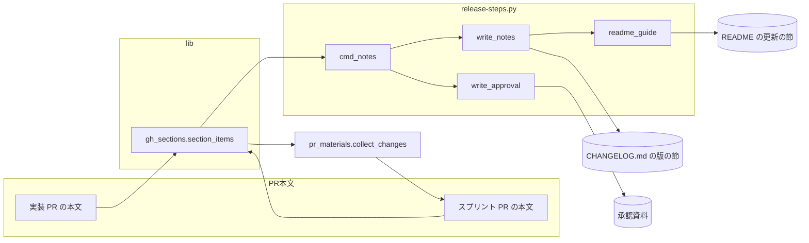
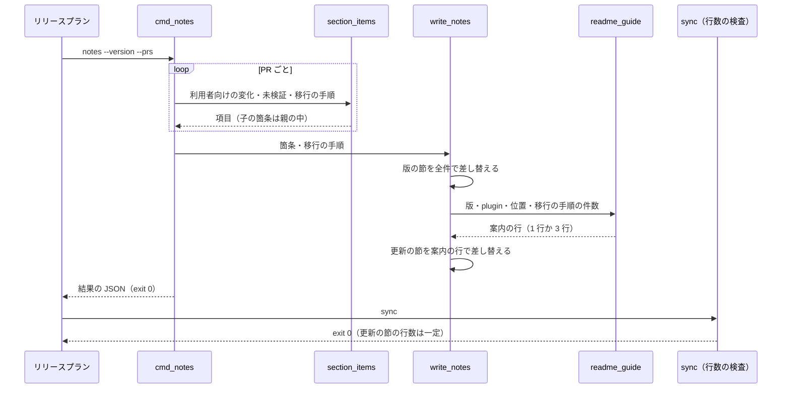

# release: 配布のたびに README が行数の上限を超えて sync が落ち、LLM が README を手で縮める → README の更新の節は版ごとに同じ行数で書かれ、変化の全件は CHANGELOG の版の節で読める（#1867）

## 目的

- **何が壊れているか**: `release-steps.py notes` が PR 本文の箇条をすべて README の更新の節へ写すため、10.17.68 では README が 500 行を超え、開発版と本番の両方で `sync` が落ちて `fix` の worker（LLM）が README を縮めた。字下げした子の箇条は独立した項目に割れ、行数をさらに増やした
- **誰が困るか**: 配布を回す conductor と、その費用を払う利用者（1 回の配布で LLM の修正が 2 回・各約 $0.25）。案内の削り方が版ごとに変わり、README の読み手も困る
- **直すと何が成り立つか**: `notes` の後の README の更新の節は、PR の数と箇条の数に依らず同じ行数になり、行数の検査で落ちない。変化の全件は CHANGELOG の版の節に欠けずに並び、子の箇条は親の項目の中に残る

## 適用範囲

- **働く範囲**: NDF を使うすべてのリポジトリの `release-steps.py notes`（`--approval` なし）と、PR 本文の箇条を読む共通の部品 `gh_sections.section_items`
- **プロジェクトごとに違うもの**: README と CHANGELOG.md の置き場（`plugin_dir` とリポジトリの根から求める）。行数の上限は `notes` に持ち込まないため、設定も引数も足さない
- **当たるモード**: リリースの工程（開発版と本番のリリースプランの `notes` のステップ）。モードの判定には関わらない

## あるべき姿の根拠

| 根拠 | 種類 | 何を示すか |
| --- | --- | --- |
| スプリント m1847 の `7-release-1863-state/progress.jsonl` と `8-release-prod-state/progress.jsonl` | 実測 | 開発版と本番の両方で `sync(exit=1) → judge[fix] → fix → sync(exit=0)` が通った |
| コミット `4f7abe29e` と `3c67921ac` | 実測 | worker が README を 506 行から 499 行へ縮めた。縮め方が 2 回で違う（項目の併合と、1 項目 1 行の分割の取り消し） |
| `plugins/ndf/README.md`（10.17.68 の後で 499 行、更新の節の外が 478 行） | 実測 | 更新の節に使えるのは 21 行だけで、PR 本文の箇条を全件写す限りいずれ超える |
| PR #1861 の本文の「利用者向けの変化」（2 字下げの子の箇条 3 行） | 実測 | `section_items` が子の箇条を独立した項目として返し、スプリント PR #1863 の本文で 3 行の独立した項目になった |
| 課題 #1867 の「未決」の (b)（正本を 1 か所にする） | 利用者の指示の原文 | 更新の節を案内だけにする形を候補に挙げている |

要求と受け入れ条件は #1867 の本文にある（コピーは `issues/issue-1867-requirements.md`）。この文書は「どう作るか」だけを扱う。

## ドメインモデル

### コンテキスト

| コンテキスト | 何の語が 1 つの意味に決まるか |
| --- | --- |
| NDF のリリース（`ndf-release`） | 更新の節・版の節・子の箇条。PR 本文の箇条から変更履歴と更新の案内を組むまで |

1 つのコンテキストに収まる。PR 本文を書く側（`pr` の Skill・スプリント PR の本文の組み立て）とは、PR 本文の `## 利用者向けの変化` の節の形（Markdown の箇条書き）を公開された言語としてやり取りする。

### 集約

| 集約 | 持ち主（書き換えてよいもの） | 根 | エンティティ | 値オブジェクト |
| --- | --- | --- | --- | --- |
| 版の節 | `release-steps.py` の `write_notes`（見出しを足すのは `changelog`） | CHANGELOG.md の `## [<plugin> <基底の版>]` の見出し | 利用者向けの変化の項目 | 子の箇条・`（#番号）` の印・移行の手順の項目 |
| 更新の節 | `release-steps.py` の `write_notes`（見出しを書き換えるのは `bump`） | README の `## v<版> へ更新するとき` の見出し | — | 版の節への案内の行・移行の手順の件数の行 |
| PR 本文の箇条（読むだけ） | 書き手は PR の作成者。`section_items` は読むだけ | PR の本文の節の見出し | 項目 | 子の箇条 |

更新の節は版の節を見出しの名前で参照するだけで、版の節の項目を持たない。

### 不変条件

| # | 集約 | 条件 | 破れたときの扱い |
| --- | --- | --- | --- |
| I1 | 更新の節 | `notes` の後の更新の節の行数は、渡した PR の数と箇条の数に依らない（移行の手順の有無で決まる 2 通りだけ） | テストで落とす。行数の検査（`check-doc-line-limit.py`）で落ちる経路を作らない |
| I2 | 更新の節 | 更新の節には版の節への案内の行が 1 行あり、版の節の見出しの名前（`[<plugin> <基底の版>]`）と CHANGELOG.md へのリンクを持つ | テストで落とす |
| I3 | 更新の節 | 移行の手順の項目が 1 件以上あるとき、更新の節にはその件数と在りか（版の節の `### 移行の手順`）を示す行が 1 行ある。0 件なら置かない | テストで落とす |
| I4 | 版の節 | 版の節には、渡した PR のうちマージされたものの利用者向けの変化の項目が 1 件も欠けずに並ぶ（今と同じ） | テストで落とす |
| I5 | 版の節・更新の節 | 同じ版・同じ PR の組で `notes` を続けて走らせると、2 回目の後の README と CHANGELOG.md は 1 回目の後とバイト単位で同じ（間に `bump` を挟む開発版から本番への組み直しには当てない。E6 を見る） | テストで落とす |
| I6 | PR 本文の箇条 | 字下げした子の箇条は親の項目の中に 1 段の入れ子として残り、独立した項目にならない。`（#番号）` は親の 1 行目にだけ付く | テストで落とす |
| I7 | 承認資料 | `notes --approval` が書く 2 つの欄・未検証の節・移行の手順の節は、子の箇条を含まない入力で今と同じ中身になる | テストで落とす |

### ドメインイベント

| # | イベント | 発生元 | 受け手 |
| --- | --- | --- | --- |
| E1 | 版を上げ、README の更新の節の見出しを新しい版へ書き換えた | `bump` | `changelog` |
| E2 | CHANGELOG と README の更新の節へ PR の題名を並べた | `changelog` | `notes` |
| E3 | PR 本文の「利用者向けの変化」と「移行の手順」から、CHANGELOG の版の節を組み直した | `notes` | 版の節の読み手（利用者・`approval-facts`） |
| E4 | README の更新の節を、版の節への案内と移行の手順の件数の行で組み直した（**変わる**: 箇条を写さない） | `notes`（E3 と同じ実行） | `sync` |
| E5 | 行数の検査が README を見た | `sync`（`check-doc-line-limit.py`） | リリースプランの `release`。**README の行数で落ちない** |
| E6 | 本番の `notes` が、開発版と同じ PR の組から README と CHANGELOG を組み直した | 本番のリリースプランの `notes` | `sync`。`bump` が更新の節の見出しを開発版から正式版へ書き換えるため、ファイル全体のバイト一致（I5）は求めない。一致するのは更新の節の本文（案内の行は I2 で基底の版を名乗る）と版の節の本文で、どちらも開発版の後と同じになる |

### 用語

| 用語 | 意味 | 用語集への反映 |
| --- | --- | --- |
| 更新の節 | plugin の README の `## v<版> へ更新するとき` の見出しから次の `## ` までの節。`notes` は版の節への案内と移行の手順の件数だけを書く | 追加（`ndf-release`） |
| 版の節 | CHANGELOG.md の `## [<plugin> <基底の版>]` の見出しから次の `## ` までの節。その版の利用者向けの変化と移行の手順の全件の正本 | 追加（`ndf-release`） |
| 子の箇条 | PR 本文の箇条書きで、前の項目より字下げした箇条。親の項目の一部として読む | 追加（`ndf-release`） |

## 機能一覧

| # | 機能 | 誰が使うか |
| --- | --- | --- |
| F1 | README の更新の節を、版の節への案内と移行の手順の件数の行で書く | リリースプランの `notes` のステップ・README の読み手 |
| F2 | CHANGELOG の版の節へ利用者向けの変化と移行の手順の全件を書く（今と同じ。子の箇条は入れ子で残る） | リリースプランの `notes` のステップ・CHANGELOG の読み手 |
| F3 | PR 本文の節の箇条を、子の箇条を親の中に残して読む | `notes`・`notes --approval`・スプリント PR の本文の組み立て（`pr_materials.collect_changes`） |

## 構成要素

| 要素 | 責務 |
| --- | --- |
| `plugins/ndf/scripts/lib/gh_sections.py` の `section_items`（変える） | 節の箇条を項目の列で返す。字下げした箇条は前の項目の子として `\n  - <本文>` でつなぎ、`（#番号）` を親の 1 行目へ付ける（I6） |
| `plugins/ndf/scripts/release-steps.py` の `write_notes`（変える） | 版の節へ全件を書く（今と同じ）。更新の節へは `readme_guide` が組んだ行だけを書く（I1〜I3） |
| `plugins/ndf/scripts/release-steps.py` の `readme_guide`（作る） | 版・plugin 名・README と CHANGELOG.md の位置・移行の手順の件数から、更新の節の行を組む純粋な関数。入出力は文字列の列で、終了コードを持たない |
| `plugins/ndf/scripts/tests/test_release_steps.py`・`test_sprint_procedures.py` ほか（変える・足す） | 受け入れ条件 1〜10 と I1〜I7 を縛る。README の中身を旧い形で見ている既存のテストを新しい形へ直す |
| `plugins/ndf/skills/release/references/release-steps.md`（変える） | `notes` の説明: 更新の節には箇条を写さず案内を書くこと、子の箇条の扱い |
| `plugins/ndf/skills/release/SKILL.md`（変える） | 「更新案内に載せたコマンドを確かめる」の対象を、版の節（移行の手順を含む）へ向け直す |
| `docs/versioning-and-distribution.md`（変える） | 「チェックに載らず手で直す箇所」と「バージョン更新時の手順」の 3 番から、更新の節の本文を人が書き直す前提を外す |
| `docs/glossary/glossary.json` と `docs/glossary.md`（変える） | 用語の 3 語を足し、`glossary.py render` で作り直す |

変えないもの: `changelog`（`_update_plugin_readme` は題名を並べたまま。続く `notes` が更新の節を組み直す）、`bump`、`check-doc-line-limit.py`、`write_approval`、`section_items` のほかの呼び手（`pr_materials.collect_changes`・`release_lib/others.migration_items`・`supervise_lib/pr.py` の移行の手順の有無の判定。返す項目の形だけが変わり、`pr.py` は項目の有無しか見ない）。

下の図と処理の流れの図には、実行の経路に乗らない要素（テスト・手順書・用語集）と、項目の有無だけを見る `supervise_lib/pr.py` を載せない。



## 構造

型は増やさない。`section_items` の返り値は今と同じ `list[str]` で、1 項目が複数行を持ちうる形に変わる。

```text
plugins/ndf/scripts/
├── lib/gh_sections.py          section_items（子の箇条を親の中に残す）
├── release-steps.py            write_notes（版の節は全件・更新の節は readme_guide の行）
│                               readme_guide（作る）
└── supervise_lib/pr_materials.py   変えない（section_items の返す形が変わるだけ）
```

項目の形（PR #1861 の本文を `n=1861` で読んだとき）:

```text
ndf の design Skill では、決定を分けたファイルの形が次の 3 点に決まっています。（#1861）
  - ファイルの名前
  - `## 決定の記録` の節
  - `### 決定 N` の見出し
```

呼び手は今と同じく `f"- {item}"` で箇条にするため、版の節とスプリント PR の本文では親の箇条の下に 1 段の入れ子として並ぶ。承認資料の表のセルでは `approval_cell` が改行を `<br>` に変える（今の仕組みのまま）。

## 入出力の契約

### `release-steps.py notes`（`--approval` なし）

| 項目 | 今 | 変更後 |
| --- | --- | --- |
| 引数 | `--version` `--prs` `--plugin` | 変えない（行数の上限の引数・宣言を足さない） |
| 終了コード | 0 / 2 / 3 | 変えない |
| 版の節 | 利用者向けの変化の項目 → 空行 → `### 移行の手順` → 項目（0 件なら見出しを作らない） | 変えない。項目が子の箇条を持つときは親の下に `  - ` の行が続く |
| 更新の節 | 版の節と同じ行 | 下の 2 通りだけ |
| 結果の JSON の `items[]` の README の行 | `"lines"` は版の節と同じ箇条の行数 | `"lines"` は更新の節へ書いた行数（1 か 3） |
| 結果の JSON の `metrics` | `version` `prs` `lines` `migration` `fallback` `unmerged` | 変えない |

更新の節（移行の手順が 0 件のとき）:

```markdown
## v10.17.68 へ更新するとき

この版で変わることの全件は [CHANGELOG.md](../../CHANGELOG.md) の `[ndf 10.17.68]` の節にあります。

## Playwright テストについて
```

更新の節（移行の手順が 1 件以上のとき。件数は `migration` の項目の数）:

```markdown
## v10.17.68 へ更新するとき

この版で変わることの全件は [CHANGELOG.md](../../CHANGELOG.md) の `[ndf 10.17.68]` の節にあります。

移行の手順が 1 件あります。更新する前に、同じ節の `### 移行の手順` を読んでください。

## Playwright テストについて
```

- リンクの先は README の置き場から CHANGELOG.md への相対パス（`os.path.relpath` を POSIX の区切りで書く）。アンカーは付けない（見出しに日付が入り、生成の規則が表示先で違うため）
- 見出しの名前は `changelog_section` と同じ基底の版（開発版の接尾辞を外した版）を使う。README の見出しは今と同じく接尾辞つきの版のまま
- README が無い・更新の節の見出しが無いときは今と同じく書かない

### `gh_sections.section_items(body, heading, n)`

| 入力の行 | 今 | 変更後 |
| --- | --- | --- |
| 字下げなしの箇条 `- x` | 新しい項目 | 変えない |
| 字下げした箇条 `  - y`（前に項目がある） | 新しい項目（`（#n）` が付く） | 前の項目へ `\n  - y` でつなぐ。字下げの深さに依らず 1 段に揃え、`*` は `-` に揃える |
| 字下げした箇条（前に項目が無い） | 新しい項目 | 変えない（新しい項目） |
| 字下げした箇条でない続きの行 | 前の項目へ ` ` でつなぐ | 変えない（項目の最後の行へつなぐ） |
| `（#n）` の付け方 | 項目に `#n` が無ければ末尾へ | 項目に `#n` が無ければ 1 行目の末尾へ |
| 「無し」「なし」だけの項目 | 除く | 変えない |

## 処理の流れ



## 非機能の実現方式

| 大項目 | 実現方式 |
| --- | --- |
| 運用・保守性 | 更新の節の行数を入力から切り離す（I1）。10.17.68 の後の README は更新の節の外が 478 行で、節に使えるのは見出しを含めて 22 行である。`notes` が書く節は見出しを含めて最大 6 行（見出し・空行・案内・空行・移行の行・空行）で、PR と箇条がいくつあっても `sync` が README の行数で落ちない。`fix` の LLM の呼び出しが要らなくなる |
| 移行性 | 利用者の操作は要らない。次の版の `notes` が更新の節を新しい形へ書き換え、過去の版の README と CHANGELOG は書き換えない |

## 決定の記録

### 決定 1: README の行数が入力で増えないよう、更新の節には箇条を写さず版の節への案内だけを書く

更新の節を版の節への案内と移行の手順の件数の 2 行に限り、変化の全件の正本を CHANGELOG の版の節の 1 か所に置く。行数が入力に依らないため、行数の上限を `notes` が知る必要が無く、上限の宣言も引数も足さずに済む。同じ中身を 2 か所へ書かないため、どちらかを直して食い違う経路も無くなる。

行数の予算の中で箇条を載せ、載らない分を案内 1 行に置き換える形は採らない。上限の値をプロジェクトごとの宣言に置き、どの箇条を残すかの順序を決め、上限を守れないときに止まる経路を持つ必要があり、それでも README と CHANGELOG に同じ箇条が二重に残る。

根拠: Value 7 / Value 5 / Value 4（MVV 版 2）

### 決定 2: 移行の手順の項目数で README が伸びないよう、更新の節には移行の手順の件数と在りかだけを書く

移行の手順は版の節の `### 移行の手順` に全件を残し、更新の節には件数と見る場所を 1 行で書く。件数を示すため、「該当なし」の項目しか無い版でも、読み手は 1 回開けば手順の要否が分かる。

移行の手順の全件を更新の節へ写す形は採らない。項目の数だけ README が伸び、決定 1 で切り離した行数が入力に戻る。

根拠: Value 7 / Value 2（MVV 版 2）

### 決定 3: 子の箇条を割らないため、子の箇条は親の項目の中に Markdown の入れ子のまま残す

字下げした箇条を親の項目へ `\n  - <本文>` でつなぎ、`（#番号）` は親の 1 行目にだけ付ける。書き手が付けた構造をそのまま読み手へ渡せ、呼び手は今と同じ `f"- {item}"` で正しい入れ子の Markdown になる。スプリント PR の本文から読み直しても同じ形に戻る（I5 の前提）。

子の箇条を親の 1 行へつなぐ形は採らない。区切りの語（`・` や `：`）を選ぶ規則が要り、親の文末の句点と組み合わせると文が崩れる。

根拠: Value 4（MVV 版 2）

### 決定 4: 字下げの幅が違っても入れ子として読めるよう、子の箇条は 1 段の `  - ` に揃える

元の字下げを保つと、1 字下げの箇条は Markdown で入れ子にならず、親と並んだ別の箇条として描かれる。2 段以上の深さは PR 本文で使われておらず、1 段に揃えても文は失われない。

元の字下げを保つ形は採らない。描かれ方が書き手の字下げの幅で変わる。

根拠: 根拠なし（MVV 版 2）

### 決定 5: 実装 PR からスプリント PR へ写すときにも割れないよう、直す場所を共通の部品の `section_items` にする

PR #1863 の本文で子の箇条が独立した項目になったのは、スプリント PR の本文を組む `pr_materials.collect_changes` が `section_items` で実装 PR の本文を読んだ時点である。`notes` だけで直すと、スプリント PR の本文には割れた形が残り、`notes` はそれを読む。

`notes` の中で子の箇条をつなぎ直す形は採らない。割れた後の項目からは、どれが子だったかを読み取れない。

根拠: Value 6（MVV 版 2）

## テスト設計

| 受け入れ条件・不変条件 | どの振る舞いで縛るか | どう壊したら落ちるべきか |
| --- | --- | --- |
| 受け入れ条件 1 | PR #1863 の実物の本文と 10.17.68 の配布の直前の README・CHANGELOG へ `notes` を走らせると、README が `check-doc-line-limit.py --root` を exit 0 で通る | 更新の節へ箇条を全件写す形へ戻すと落ちる |
| 受け入れ条件 2・I1 | 更新の節の外が 479 行の README と、箇条が 40 行分ある入力で `notes` の後に README が 500 行以下。箇条の数を変えても更新の節の行数が同じ | 箇条の数に比例して更新の節が伸びると落ちる |
| 受け入れ条件 3・I4 | 受け入れ条件 2 の入力で、版の節に利用者向けの変化の項目が全件並ぶ | 版の節も案内だけに縮めると落ちる |
| 受け入れ条件 4・I2 | 更新の節に CHANGELOG.md へのリンクと `[<plugin> <基底の版>]` の名前を持つ行が 1 行ある。開発版の版でも基底の版を名乗る | 案内の行を書かない・接尾辞つきの版を名乗ると落ちる |
| 受け入れ条件 5・9 | 行数の上限の宣言も引数も無いリポジトリで、箇条が多くても `notes` が 0 で終わる。`release-steps.py` に 500 の値が現れない | 上限で止まる経路や、上限の既定値を足すと落ちる |
| 受け入れ条件 6・I3 | 移行の手順が 1 件以上の入力で、更新の節に件数と `### 移行の手順` を示す行がある。0 件の入力ではその行が無い | 移行の行を書かない・0 件でも書くと落ちる |
| 受け入れ条件 7・I5 | 同じ版・同じ PR の組で `notes` を 2 回走らせ、2 回目の後の README と CHANGELOG.md が 1 回目の後とバイト単位で同じ | 走らせるたびに空行や案内の行が増えると落ちる |
| 受け入れ条件 8・I6 | PR #1861 の本文の形（2 字下げの子の箇条 3 行）を読むと、項目は 1 件で、子の箇条は `  - ` の行として親の中に残り、`（#番号）` は 1 行目にだけ付く。版の節にも同じ入れ子で並び、スプリント PR の本文に組んで読み直しても同じ項目に戻る | 子の箇条を独立した項目に返す・`（#番号）` を最後の行へ付けると落ちる |
| 受け入れ条件 10・I7 | PR #1863 の実物の本文で `notes --approval` が書く 2 つの欄・未検証の節・移行の手順の節が、変更前の出力と同じ | 承認資料の組み方を変えると落ちる |
| 受け入れ条件 11 | 全体テストが通る。README の更新の節を旧い形（箇条の全件）で見ている既存のテストは、新しい形を見るように直す | — |

## 設計の結果

| 課題 | 扱い | 取り込み先 | 触るファイル |
| --- | --- | --- | --- |
| #1867 | 実装する | — | `plugins/ndf/scripts/release-steps.py`、`plugins/ndf/scripts/lib/gh_sections.py`、`plugins/ndf/scripts/tests/`、`plugins/ndf/skills/release/`、`docs/versioning-and-distribution.md`、`docs/glossary/`、`docs/glossary.md` |

## 未確認のまま残ること

| 項目 | 内容 |
| --- | --- |
| リリース後の実測 | 次の配布（開発版と本番）の `progress.jsonl` に、README の行数による `sync(exit=1) → fix` の並びが無いこと。リリース後テストで見る |
| 配布先での CHANGELOG.md へのリンク | plugin のディレクトリだけが配られた環境（プラグインのキャッシュ）では、`../../CHANGELOG.md` のリンク先が無い。案内の行は見出しの名前も持つため、GitHub の上で辿れる。リンクの先を GitHub の URL にするかは、利用者の読み方を測ってから決める |
| PR #1863 の本文 | 割れた形の子の箇条（3 行）は過去の記録として残す。書き直さない（要求の「含まない」） |
| `changelog` の後に `notes` を走らせない手順 | `changelog` だけを走らせると、更新の節は題名の一覧のまま残る。リリースプランは必ず `changelog → notes` の順に組むため、プランの外で `changelog` だけを打ったときに限る |
