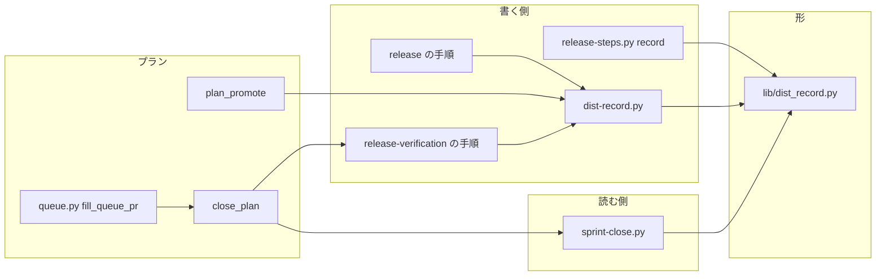
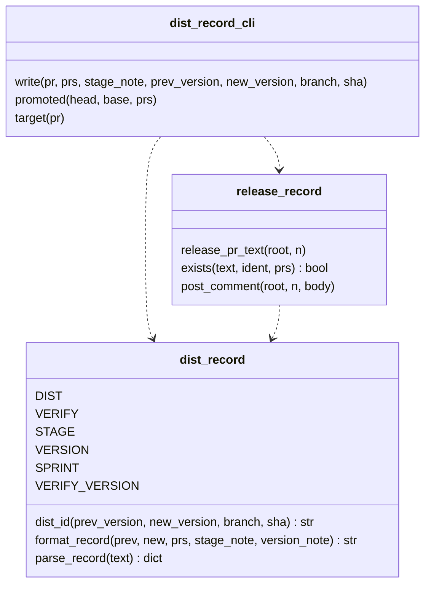
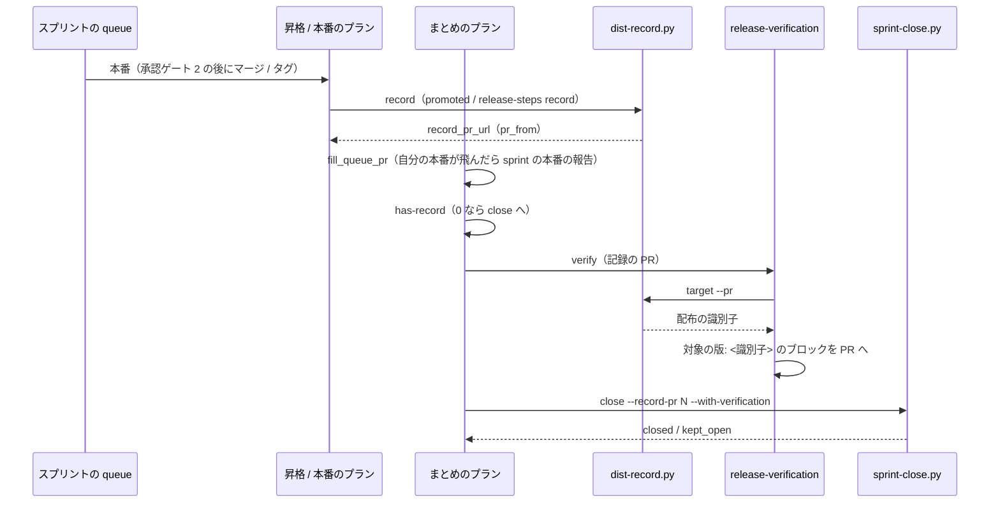

# sprint-close: 本番まで出たスプリントの課題が、リリース記録が読めない・版の書き方が食い違う・リリース後テストの記録が無いために閉じられず、conductor が手で閉じている → リリース記録とリリース後テストの記録を書く側が同じ規則で書き、まとめのプランが記録を置いた後に課題を閉じる（#1870 #837 #1789 #1683）

## 目的

- **何が壊れているか**: `sprint-close.py` が読むリリース記録を、昇格（promote）の形は配布の後に書かず（#837）、版数を上げない配布ではリリース記録の `版:` とリリース後テストの記録の `対象の版:` が別の値になり（#1789）、まとめのプランはリリース後テストの記録を置かないまま `--with-verification` で閉じる（#1683）
- **誰が困るか**: スプリントを閉じる conductor。課題が `kept_open` か「配布なし」で閉じるため、プランの外で `gh issue close` を打つ手当てが 4 スプリントで続いた（m1340・m1649・m815・m1847）
- **直すと何が成り立つか**: 配布の形（package-plugin・promote）と版数を上げるか否かによらず、まとめのプランの `close` ステップが、リリース記録とリリース後テストの記録を読んで課題を閉じる

## 適用範囲

- **働く範囲**: 配布先のリポジトリでも働く。リリース記録の形・`dist-record.py`・昇格のプラン・まとめのプラン・`release` / `release-verification` / `progress-tracking` の手順はすべて配布物である
- **プロジェクトごとに違うもの**: 本番チャネルのブランチは `.ndf/worktree.json` の `production_branch` か `--production-branch`、ベースブランチは `base_branch` か `--base`、版数は引数（`--version` / `--prod`）から受ける。`main` / `develop`・`ndf--v<版数>` のタグを既定に埋め込まない
- **当たるモード**: `pace: fast` / `auto` のスプリント（`supervise.py new close` のまとめのプランを持つ）。`normal` はまとめのプランを持たず、`release`・`release-verification`・`retrospective` の手順（LLM）が同じ形で書いて閉じる

## あるべき姿の根拠

| 根拠 | 種類 | 何を示すか |
| --- | --- | --- |
| devbasex/devbase PR #212 の本文の `段階: 検証（… 承認待ちのため未実施）` が、`main` へのマージの後も更新されなかった | 実測 | 承認の前に置いた記録を、配布の後に実施後の値で置き直す段が要る（#837） |
| devbasex/devbase PR #432 の `版: 4.0.0 → 4.0.0（… main の c427284 で配布）` と `対象の版: main c427284（…）` | 実測 | 2 つの記録を別々の規則で書くと、同じ配布でも一致しない（#1789） |
| m1340・m1649 で conductor が本番の直後に `gh issue close` を 4 回・3 回打った記録 | 実測 | 閉じる工程がプランのステップとして通らず、受け入れ条件を確かめないまま閉じた（#1683） |
| 依頼の「統合: 記録の形を 1 か所で決め、release-verification はその値を写す」「移動: 課題を閉じる工程を、conductor の手から本番のプランのステップへ移す」 | 利用者の指示の原文 | 書く側の契約で直し、読む側の一致規則を緩めない |
| `release` の SKILL.md の手順 2「版数を持たないリリースもある。何が出ているかを一意に指せる値（リビジョン・ビルド番号）を記録の対象にする」 | 既存の規約 | 版数を上げない配布の `版:` の右に、配布したコミットを書いてよい |

要求と受け入れ条件は #1870 の本文にある（コピーは `issues/issue-1870-requirements.md`）。この文書は「どう作るか」だけを扱う。

## ドメインモデル

### コンテキスト

| コンテキスト | 何の語が 1 つの意味に決まるか |
| --- | --- |
| NDF のリリース（`ndf-release`） | リリース記録・リリース後テストの記録・配布の識別子・版数を上げない配布 |
| NDF の開発ワークフロー（`ndf-workflow`） | 昇格のプラン・まとめのプラン・スプリント課題・スプリントを閉じる |

関係は**公開された言語**である。リリース記録とリリース後テストの記録は、`lib/dist_record.py` が定める文書化された形（見出し・行の名前・配布の識別子の規則）でやり取りし、書く側（`release-steps.py record`・`dist-record.py`・`release` / `release-verification` の手順）と読む側（`sprint-close.py`）はこの形だけを介して独立に変わる。受け手が 3 つ以上あり、LLM が書く経路もあるため、形を先に固める。

### 集約

| 集約 | 持ち主（書き換えてよいもの） | 根 | エンティティ | 値オブジェクト |
| --- | --- | --- | --- | --- |
| リリース記録 | `lib/dist_record.py`（形）。組んで投稿するのは `release-steps.py record`（package-plugin）と `dist-record.py`（promote と手順で書く形） | `## 配布の記録` のブロック | — | 段階・配布の識別子（`版:` の `→` の右）・前の版・スプリントの PR の並び |
| リリース後テストの記録 | `lib/dist_record.py`（形）。書くのは `release-verification` の手順 | `## リリース後テスト` から `合否:` までのブロック | 課題ごとの行 | 対象の版（配布の識別子の写し）・合否 |
| まとめのプラン | `supervise_lib/sprint.py` の `close_plan` | プラン | ステップ | 記録の PR の参照（`{queue_pr:<名>}` か `0`） |
| 昇格のプラン | `supervise_lib/delivery_templates.py` の `plan_promote` | プラン | ステップ | — |

2 つの記録は別の集約である。リリース後テストの記録はリリース記録を ID（配布の識別子）でだけ参照し、書き換えない。

### 不変条件

| # | 集約 | 条件 | 破れたときの扱い |
| --- | --- | --- | --- |
| I1 | リリース記録 | 見出し・行の名前（`## 配布の記録`・`## リリース後テスト`・`段階: `・`版: `・`スプリント: `・`対象の版: `）の文字列を定義するのは `lib/dist_record.py` だけである | 全体テストが落ちる（ほかのスクリプトに文字列の定義があれば検出する） |
| I2 | リリース記録 | 配布の識別子は、新しい版数があり前の版数と違えば新しい版数、そうでなければ `<本番のブランチ> <配布したコミットの先頭 7 文字>` である。決めるのは `dist_record.dist_id` だけである | 書く側が誤った値を渡せない（関数の外で組まない） |
| I3 | リリース後テストの記録 | `対象の版:` の値（括弧の注記を除く）は、同じ PR の最後のリリース記録の配布の識別子と同じ文字列である | 一致しなければ `sprint-close.py` が全課題を `kept_open` にする（読む側を緩めない） |
| I4 | リリース記録 | `段階: 本番` の記録を書くのは、配布（タグ・昇格の PR のマージ・手動の反映）を実施した後だけである | `dist-record.py` と `release-steps.py record` は配布の証拠（マージ済みの PR・タグ）が無ければ書かずに 3 で止まる |
| I5 | リリース記録 | 同じ PR に、承認の前に置いた記録（`段階: 検証`）があっても、配布の後に書いた記録が最後のブロックになる | 配布の後の記録はコメントで足す（本文を書き換えない）ため、投稿の順で最後になる |
| I6 | 昇格のプラン | リリース記録の書き込みが落ちても、配布（マージ）をやり直さない | 落ちたら `judge-record`（`record` か `stop`）へ回す |
| I7 | まとめのプラン | 雛形と昇格の経路では、`close` ステップの `--record-pr` が `0` になるのは、スプリントの中で本番の配布を実施したプランが 1 つも無いときだけである（merge・manual の経路は #1875） | 本番を実施したプランがあれば、その PR の番号が入る |
| I8 | まとめのプラン | `close` は `--with-verification` で打ち、リリース後テストの記録が無い課題を閉じない | `sprint-close.py` の閉じる条件 2 のとおり `kept_open` |

### ドメインイベント

| # | イベント | 発生元 | 受け手 |
| --- | --- | --- | --- |
| E1 | 配布の承認を得た（承認ゲート 2） | 人か MVV 判定 | 本番のリリースプラン・昇格のプラン |
| E2 | 本番へ配布した | `release-steps.py release`・`merged-steps.py promote`・手動の反映 | E3 のステップ |
| E3 | 実施後の値でリリース記録を置いた | `record` のステップ（package-plugin・promote）か `release` の手順 | `release-verification`（配布の識別子を写す）・`sprint-close.py` |
| E4 | 導入の確認をした | `verify`（verify-install / verify-facts） | プラン（落ちたら止まる） |
| E5 | リリース後テストの記録を置いた | まとめのプランの `verify` ステップ（`/ndf:release-verification`） | `sprint-close.py` |
| E6 | スプリントの課題を閉じた | まとめのプランの `close` ステップ | 振り返り（`retro`）・棚卸し（`refine`） |

### 用語

| 用語 | 意味 | 用語集への反映 |
| --- | --- | --- |
| 配布の識別子 | 1 回の本番の配布を指す値。新しい版数があり前の版数と違えば新しい版数、そうでなければ `<本番のブランチ> <配布したコミットの先頭 7 文字>`。リリース記録の `版:` の `→` の右に書き、リリース後テストの記録の `対象の版:` へ写す | 追加（`ndf-release`） |
| リリース後テストの記録 | （要求で足した語のまま） | 変更なし |
| 版数を上げない配布 | （要求で足した語のまま） | 変更なし |

## 機能一覧

| # | 機能 | 誰が使うか |
| --- | --- | --- |
| F1 | 配布の識別子を 1 つの規則で決め、リリース記録の `版:` の右に書く | `release-steps.py record`・`dist-record.py`・`release` の手順 |
| F2 | リリース記録の PR から配布の識別子を読み出し、`対象の版:` に写す値として出す | `release-verification` の手順 |
| F3 | 昇格の PR のマージの後に、実施後の値でリリース記録をその PR へ書く | 昇格のプラン |
| F4 | 手順で配布する形でも、配布を実施した後に同じ形のリリース記録を書く | `release` の手順（LLM） |
| F5 | まとめのプランが、本番を実施したプランの PR を記録の PR として読み、リリース後テストの記録を置いてから課題を閉じる | まとめのプラン（conductor が流す） |

## 構成要素

| 要素 | 責務 | 変更 |
| --- | --- | --- |
| `scripts/lib/dist_record.py` | 2 つの記録の見出し・行の名前・配布の識別子の規則（`dist_id`）・組み立て（`format_record`）・読み取り（`parse_record`）を持つ唯一の場所 | `dist_id` を足す。`format_record` と `parse_record` は変えない |
| `scripts/release_lib/record.py` | PR の本文とコメントの読み取り・同じ記録の有無の判定・コメントの投稿 | 判定の `exists` を版数でなく配布の識別子で比べる名前にそろえる。PR の読み取りを `dist-record.py` と共有する |
| `scripts/dist-record.py`（新規） | `dist_record` の CLI。`write`（手順で配布する形がリリース記録を書く）・`promoted`（昇格の PR のマージの後に書く）・`target`（PR から配布の識別子を出す） | 新規 |
| `scripts/release-steps.py` の `record` | package-plugin の本番の配布の後にリリース記録を書く（タグと GitHub Release を確かめる） | 識別子を `dist_id` で決める。出力は今と同じ |
| `scripts/supervise_lib/delivery_templates.py` の `plan_promote` | 昇格のプランを組む | normal と fast / auto の両方で、マージの後に `record`（`dist-record.py promoted`）と `judge-record` を置く |
| `scripts/supervise_lib/release_templates.py` の `_judge_record_step` | `record` が落ちたときの判断 | 問いの文を配布の形によらない語にし、昇格のプランからも使う |
| `scripts/supervise_lib/sprint.py` の `close_plan` | まとめのプランを組む | 記録の PR の参照を経路から決め（`record_pr_ref`）、`close` の前に `has-record`（記録の PR が `0` なら飛ばす）と `verify`（`/ndf:release-verification`）を置く |
| `scripts/supervise_lib/queue.py` の `fill_queue_pr` | `{queue_pr:<名>}` を PR の番号へ置き換える | 前のステージの同名のプランが PR を持たない（飛ばされた）とき、同じディレクトリの同名のプランの報告のうち最も新しい PR へ落ちる |
| `skills/release/SKILL.md` | 配布の手順 | 手順 3 と「出力物」に「配布を実施した後に、実施後の値でリリース記録を置く」段を足す。スクリプトが書く形はそのステップを指し、それ以外は `dist-record.py write` を打つ |
| `skills/release-verification/SKILL.md` | リリース後テストの手順 | 「出力物」の `対象の版:` を `dist-record.py target` の出力から写す |
| `skills/progress-tracking/SKILL.md` | 記録の形の表（「配布の記録」） | `版:` の右を配布の識別子とし、`対象の版:` はそれを写すと書く |
| `skills/development-workflow/references/pace.md`・`conductor-entrypoints.md` | まとめのプランの説明・conductor が打つスクリプトの一覧 | まとめのステップの並びと `dist-record.py` を足す。課題はまとめのプランが閉じ、conductor は手で閉じないと書く |



図に含めない要素: `release_lib/record.py`（`dist-record.py` と `release-steps.py record` の内部の部品）、`_judge_record_step`（昇格のプランと本番のリリースプランの中のステップ）、`progress-tracking`・`pace.md`・`conductor-entrypoints.md`（形と流れを説明する文書で、呼び出しの辺を持たない）。

## 構造



```text
plugins/ndf/scripts/
├── dist-record.py            # 新規。dist_record の CLI
├── lib/dist_record.py        # 形と規則（dist_id を足す）
├── release_lib/record.py     # 読み取り・判定・投稿（dist-record.py と共有）
├── release-steps.py          # record が dist_id を使う
└── supervise_lib/
    ├── delivery_templates.py # plan_promote に record・judge-record
    ├── release_templates.py  # _judge_record_step の問いを形によらない語に
    ├── sprint.py             # close_plan に has-record・verify、record_pr_ref
    └── queue.py              # fill_queue_pr の落ち先
```

## 入出力の契約

### リリース記録の形

```markdown
## 配布の記録

段階: 本番（<配布の事実。承認ゲート 2 の後、<時刻> に <タグ / 昇格の PR #N> を ...>）
版: <前の版数か なし> → <配布の識別子>（<根拠の注記>）
スプリント: PR #<番号> / #<番号>
```

| 配布 | `版:` の行の例 | 配布の識別子 |
| --- | --- | --- |
| 版数を上げる（package-plugin） | `版: 10.17.67 → 10.17.68（タグ ndf--v10.17.68。直前はタグ ndf--v10.17.67）` | `10.17.68`（今と同じ） |
| 版数を上げない（手順で配布） | `版: 4.0.0 → main c427284（版数は上げない。main へのマージで配布）` | `main c427284` |
| 昇格（promote） | `版: なし → main 1a2b3c4（昇格の PR #N のマージコミット）` | `main 1a2b3c4` |

左は前の版数で、`parse_record` は読まない。リリース後テストの記録の形は変えず、`対象の版: <配布の識別子>（<配布した時刻>）` と書く。

### `dist-record.py`

結果は `lib/step_result.py` の 1 行の JSON。終了コードは 0 = ok / 1 = 投稿の失敗 / 2 = PR を読めない / 3 = 前提が無い（配布の証拠が無い・引数が足りない）。

| 副コマンド | 引数 | 何をするか | `metrics` |
| --- | --- | --- | --- |
| `write` | `--pr N --prs a,b --stage-note <文> [--version-note <文>] [--prev-version V] [--new-version V] [--branch B --sha S] [--root]` | `dist_id` で識別子を決め、`format_record` で組んで PR へコメントで書く。同じ識別子・同じスプリントの PR の本番の記録が最後にあれば書かない（`exists`）。識別子がコミットの形になるのに `--branch` か `--sha` が無ければ 3 | `record_pr`・`record_pr_url`・`target`・`sprint_prs` |
| `promoted` | `--head <ベースブランチ> --base <本番のブランチ> --prs <番号...> [--root]` | `head → base` のマージ済みの最新の昇格の PR とそのマージコミットを読み、`write` と同じ形でその PR へ書く。マージ済みの PR が無ければ書かずに 3 | 同上 |
| `target` | `--pr N [--repo O/R] [--root]` | PR の最後のリリース記録を `parse_record` で読み、配布の識別子を出す。`段階:` が `本番` でなければ 3、`配布なし` なら 0 で `target` を空にする | `target`・`stage` |

`write` の `--stage-note` は `段階: 本番（…）` の括弧の中だけで、`段階:` の値（`本番`）は CLI が決める。手順で書く LLM が段階の語を誤れないようにするためである。

### プランのステップ

| プラン | ステップ | `cmd` / `prompt` | 遷移 |
| --- | --- | --- | --- |
| 昇格（normal） | `promote` → `promote-approved` → `record` | `record`: `dist-record.py promoted --head <base> --base <production> --prs {queue_prs}`、`pr_from: record_pr_url` | `promote-approved` の `next` を `record` に。`record` の `on_fail` は `judge-record`、`next` は `end` |
| 昇格（fast / auto） | `verify` → `prepare` → `mvv` → `note` → `promote` → `record` | 同上 | `promote` の `next` を `record` に（`gate_next` は `end` のまま） |
| まとめ | `spec` → `pr` → `ready` → マージ → `has-record` → `verify` → `close` → `retro` → `refine` | `has-record`: `sh -c 'test "$1" != 0 \|\| exit 3' _ <記録の PR>`、`skip_to: close`。`verify`: `/ndf:release-verification` に記録の PR・課題・`dist-record.py target` を渡す work | 記録の PR の参照が `0` に固まる経路では 2 つを置かない |

記録の PR の参照（`record_pr_ref`）は経路から決める。

| 経路 | 参照 |
| --- | --- |
| 雛形（`release.form`） | `{queue_pr:release-prod}` |
| 昇格（promote） | `{queue_pr:promote}` |
| それ以外（merge・manual・none） | `0`（今と同じ。merge と manual は #1875） |

## 処理の流れ



`fill_queue_pr` の落ち先は、前のステージに同名のプランがあり PR を持たないときにも働く。まとめの queue の自分の「本番」が実行条件で飛ばされても、同じディレクトリにある `new sprint` の「本番」の報告の PR を読む。報告が複数あれば、報告のファイルの更新時刻が最も新しいものを採る。

## 非機能の実現方式

| 大項目 | 実現方式 |
| --- | --- |
| 運用・保守性 | 文字列と規則は `lib/dist_record.py` だけに置き、書く側は `format_record` と `dist_id`、手順は `dist-record.py` を通す。形を変えるときに直すモジュールは 1 つ |
| 移行性 | `format_record` と `parse_record` を変えない。版数を上げる配布の識別子は今の `版:` の右と同じ値で、改名の前の `スプリント:` の見出しも `legacy_names` で読み続ける |
| システム環境 | 本番のブランチは `plan_promote` が受ける `production`（宣言か引数）を `--base` で渡し、`dist-record.py write` の `--branch` も呼び手が渡す。既定のブランチ名を持たない |

## 決定の記録

### 決定 1: 形の持ち主を 1 つに保つため、定数と規則を `lib/dist_record.py` に置いたままにする

読む側の `sprint-close.py` と書く側の `release_lib/` の両方が使うため、共通の層（`lib/`）に置く。`release_lib/record.py` へ移すと、読む側がリリースの書き手のパッケージに依存し、`release-verification` の手順から呼ぶ CLI もリリースの書き手を通ることになる。依頼の「`release_lib/record.py` の 1 か所」は、両ファイルの docstring のとおり形の持ち主を指すと読む（要求の前提 1）。

採らなかったのは `release_lib/record.py` へ移す形で、依存の向きが読む側から書く側へ逆になる。

根拠: Value 6（MVV 版 2）

### 決定 2: 版数を上げない配布を一意に指すため、配布の識別子を `<本番のブランチ> <コミットの先頭 7 文字>` にする

版数を上げない配布では、版数は前の配布と同じで、同じ PR に別の配布の記録が並んだときに区別できない。コミットは利用者が実際に導入したものを指し、`release-verification` が確かめる対象とも一致する。ブランチを添えるのは、同じコミットを検証のチャネルと本番チャネルへ出したときに分けるためである。版数を上げる配布は今の値（版数）のままにし、直す前の記録と読み方を変えない（受け入れ条件 3）。

採らなかったのは、版数を上げない配布でも版数を書く形である。両方が写すなら一致はするが、同じ版数の前の配布のリリース後テストの記録を誤って選びうる。

根拠: Value 5 / Value 6（MVV 版 2）

### 決定 3: 2 つの記録の値を揃えるため、`対象の版:` はリリース記録から `dist-record.py target` で写す

書き手が 2 つの手順で同じ規則を別々に当てると、#1789 のように自然な書き方が食い違う。写す形なら、規則を持つのはリリース記録を組む側の `dist_id` 1 つだけになる。`target` は `parse_record` の結果をそのまま出すため、読む側と同じ値になる。

採らなかったのは、`_pick_verify_block` が一致しないときに後ろのブロックを採る形（読む側の緩和）で、要求が含まないとしている。

根拠: Value 4 / Value 6（MVV 版 2）

### 決定 4: 昇格の形でも配布の後の記録をプランが書くため、`record` を昇格のプランのマージの後に置き、`judge-record` を共有する

package-plugin の `record` と同じ位置（配布の直後）と同じ失敗の扱い（`record` のやり直しか停止）にそろえる。`merged-steps.py promote` の中で書くと、書き込みの失敗がマージのステップの失敗になり、やり直しがマージへ戻る。`judge-record` は `release_templates.py` の 1 つを両方のプランが使う。

採らなかったのは、`merged-steps.py promote` がマージの後に続けて書く形である。

根拠: Value 4 / Value 6（MVV 版 2）

### 決定 5: 閉じる工程を 1 か所に保つため、課題を閉じるステップは本番のプランに置かず、まとめのプランの入力を直す

まとめのプランは既に `close`（`--with-verification`）を持ち、最終の検査で直した変更の配布もその前に流れる。本番のプランに閉じるステップを足すと、閉じる場所が 2 つになり、最終の検査の前に閉じる経路ができる。まとめのプランが読む記録の PR を、自分の「本番」が飛ばされたときにスプリントの「本番」の報告から得るように `fill_queue_pr` の落ち先を広げ、「本番まで出たのに配布なしで閉じる」（#837 のプランの経路）を無くす。

採らなかったのは、本番のプラン（`release-prod`・`promote`）の最後に `close` を置く形と、`new close` に記録の PR の番号を conductor が渡す形（プランの外の手当てが残る）である。

根拠: Value 4 / Value 6（MVV 版 2）

### 決定 6: リリース後テストの記録をプランの中で置くため、まとめのプランの `close` の前に `/ndf:release-verification` の work ステップを置く

受け入れ条件の確かめは判断を伴うため LLM の work ステップにし、記録の PR が無い（`0`）ときに飛ばすのは run ステップの終了コード（`skip_to`）で決める。実施できない条件は `release-verification` の規則どおり保留で書き、`sprint-close.py` がその課題を `kept_open` にする。プランを止めて人か conductor が置くのを待つ形では、待つ間に conductor が手で閉じる経路が残る。

採らなかったのは、プランを止めて記録を待つ形である。

根拠: Value 2 / Value 4（MVV 版 2）

### 決定 7: 手順で配布する形の LLM が形を誤らないため、`release` の手順は `dist-record.py write` を打つ

#837 の案 A（配布の後に実施後の値で記録を置く段を足す）を採り、承認の前に本文へ置く記録は残してよい。配布の後の記録をコメントで足すと、最後のブロックが配布の後の記録になる（I5）。段階の語と識別子の規則は CLI が決め、LLM は配布の事実の注記とブランチ・コミットを渡すだけにする。

採らなかったのは、承認の前に記録を置かない形（#837 の案 B）で、Draft の段階で本文を用意する運用を変えることになる。

根拠: Value 1 / Value 4（MVV 版 2）

## テスト設計

| 受け入れ条件・不変条件 | どの振る舞いで縛るか | どう壊したら落ちるべきか |
| --- | --- | --- |
| 1・I1 | `plugins/ndf/scripts` の `.py`（`lib/dist_record.py` を除く）に、6 つの見出し・行の名前の文字列の定義（代入・引数の既定値）が無い | ほかのスクリプトに `"対象の版: "` などを定義すると落ちる |
| I2 | `dist_id` が版数を上げる・同じ版数・版数なしの 3 つで、版数・`<ブランチ> <7 文字>`・`<ブランチ> <7 文字>` を返す | 同じ版数で版数を返すように壊すと落ちる |
| 2・12（#1789） | 版数を上げない配布の記録を `format_record` + `dist_id` で組み、`target` の値を `対象の版:` へ写したブロックを並べると、`parse_record` の `verify_block` がそのブロックになる | `dist_id` か `target` が別の値を返すと落ちる |
| 3 | package-plugin の `record` が組む `版: 10.17.67 → 10.17.68` と `対象の版: 10.17.68（…）` で、`parse_record` の結果が直す前と同じ | 版数を上げる配布でコミットの形を返すと落ちる |
| 4・I3 | `dist-record.py target` の `metrics.target` を `対象の版:` へそのまま書いたブロックが、2 の規則で選ばれる | `target` が括弧の注記を残すと落ちる |
| 5・12（#837） | `plan_promote` の normal と fast / auto の JSON に、マージの後の `record`（`dist-record.py promoted`・`pr_from`）があり、`promoted` が書いた記録を `parse_record` が `本番` で始まる段階として読む | `record` を外す・`promote` の `next` を `end` に戻すと落ちる |
| 6・I6 | 昇格のプランの `record` の `on_fail` が `judge-record` で、その `choices` が `record` と `stop` だけ | `choices` に `promote` か `fix` を足すと落ちる |
| 7・12・I7 | 昇格の経路のまとめの `close` の `--record-pr` が `{queue_pr:promote}` で、まとめの「本番」が飛ばされても同じディレクトリのスプリントの「本番」の報告の PR に置き換わる。どの報告にも PR が無いときだけ `0` | 落ち先を外すと、飛ばされたときに `0` になって落ちる |
| 8・12（#837） | 本文に `段階: 検証（… 承認待ちのため未実施）` を置いた PR に、`promoted` か `record` がコメントで記録を足すと、`sprint-close.py` は `本番` として読む | 書き込みを本文の書き換えにする・最初のブロックを読むように壊すと落ちる |
| 9 | `release` の手順の「配布を実施した後に記録を置く」段（文言は照合しない。`dist-record.py write` の引数の形を手順の例どおりに 1 度打って 0 で終わることを実装の検証で確かめる） | — |
| 10・12（#1683） | package-plugin と promote の両方で、`new close` が書いたまとめのプランの JSON に `has-record` → `verify` → `close`（`--with-verification`）がこの順で並ぶ | `verify` を `close` の後へ置くと落ちる |
| 11・I8 | リリース後テストの記録が無い PR で `sprint-close.py --with-verification` が全課題を `kept_open` にする（今のテストを残す） | 閉じる条件 2 を外すと落ちる |
| I4 | `promoted` はマージ済みの昇格の PR が無ければ書かずに 3、`write` は識別子がコミットの形なのに `--sha` が無ければ 3 | 証拠が無いのに書くと落ちる |
| I5 | 同じ記録が最後にあれば `write` はコメントを足さない（`exists`）。別の記録が後ろにあれば足す | 毎回書く・最初の記録と比べると落ちる |
| 13 | `uv run --frozen --project . --all-extras pytest plugins/ndf/scripts/tests -q -n 4` が通る | — |

## 設計の結果

| 課題 | 扱い | 取り込み先 | 触るファイル |
| --- | --- | --- | --- |
| #1870 | 実装する | — | `plugins/ndf/scripts/lib/dist_record.py`、`plugins/ndf/scripts/release_lib/record.py`、`plugins/ndf/scripts/dist-record.py`、`plugins/ndf/scripts/release-steps.py`、`plugins/ndf/scripts/supervise_lib/`、`plugins/ndf/scripts/tests/`、`plugins/ndf/skills/release/`、`plugins/ndf/skills/release-verification/`、`plugins/ndf/skills/progress-tracking/`、`plugins/ndf/skills/development-workflow/references/` |

子 issue（#837・#1789・#1683）はこの表に載せない。表の行はスプリント PR の closing keywords になり、子は閉じないためである（要求の前提 5）。

## 未確認のまま残ること

| 項目 | 内容 |
| --- | --- |
| merge・manual の経路のまとめ | ベースブランチへのマージで本番へ届く経路と手で届ける経路では、リリース記録を置く PR をプランが知らず、`close` は今と同じ `--record-pr 0`（閉じる条件を見ない）で打つ。範囲外の課題として #1875 に起票した |
| `fill_queue_pr` の落ち先を広げる影響 | `{queue_pr:check}`（auto のスプリントと手動反映の本番系の承認ゲート 2）も、前のステージの同名のプランが PR を持たないときに同じディレクトリの報告へ落ちる。同じスプリントのディレクトリの検査の PR を指すため誤りにならないと見ているが、実装で既存のテストを通して確かめる |
| `verify` の work ステップの所要 | まとめのプランの上限（12）とステップの `timeout` に収まるかは、最初に流すスプリントで実測する |
| 手動確認 | 次に promote の形か版数を上げない配布で本番まで出た devbasex/devbase のスプリントで、まとめの `close` が課題を `closed` にし、conductor が手で閉じていないことを、キューの記録と課題を閉じた主体で確かめる |
