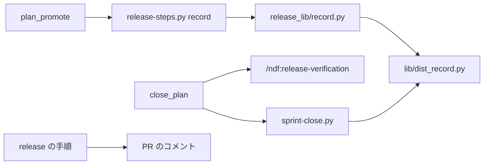
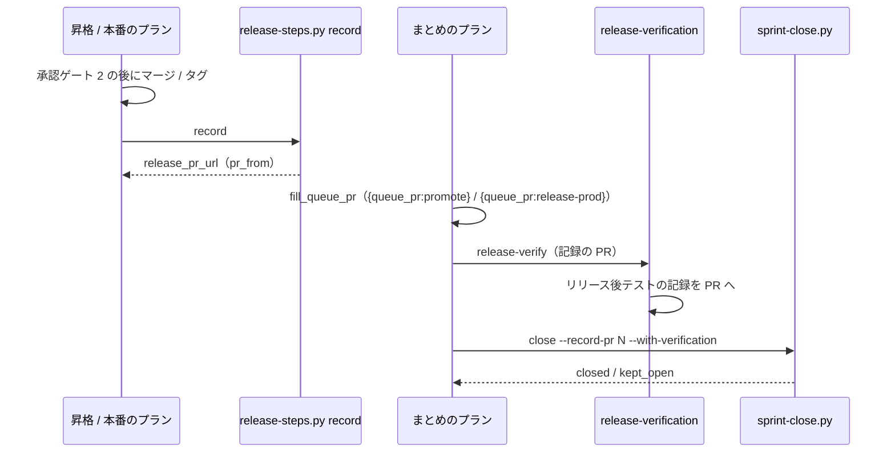

# sprint-close: 昇格の後のリリース記録が無い・版の書き方が食い違う・リリース後テストの記録が無いため課題が閉じず、conductor が手で閉じている → 既存の record を昇格のプランに足し、読む側が版の食い違いを受け、まとめのプランがリリース後テストを置いてから閉じる（#1870 #837 #1789 #1683）

## 目的

- **何が壊れているか**: `sprint-close.py` が読むリリース記録を、昇格（promote）の形は配布の後に書かない（#837）。版数を上げない配布では、リリース記録の `版:` とリリース後テストの記録の `対象の版:` が別の値になり、読む側が記録を選べない（#1789）。まとめのプランはリリース後テストの記録を置かないまま `--with-verification` で閉じ、課題が `kept_open` に残る（#1683）
- **誰が困るか**: スプリントを閉じる conductor。プランの外で `gh issue close` を打つ手当てが 4 スプリントで続いた（m1340・m1649・m815・m1847）
- **直すと何が成り立つか**: package-plugin と昇格の経路で本番まで出たスプリントの課題が、まとめのプランの `close` ステップで閉じる。3 つの問題を、それぞれ既存の関数かステップの 1〜2 か所で直す

## 適用範囲

- **働く範囲**: 配布先のリポジトリでも働く。`lib/dist_record.py`・`release-steps.py record`・昇格のプラン・まとめのプラン・`release` の手順はすべて配布物である
- **プロジェクトごとに違うもの**: 昇格の `record` に渡すベースブランチと本番チャネルは、`plan_promote` が今受けている値（`a.base` と宣言か引数の `production`）をそのまま渡す。ブランチ名を既定に埋め込まない
- **当たるモード**: まとめのプランの変更は `pace: fast` / `auto`（`supervise.py new close` を使う）。昇格のプランの変更は昇格の経路を持つすべてのモード。`release` の手順の変更は、LLM が配布する形（`normal` を含む）

## あるべき姿の根拠

| 根拠 | 種類 | 何を示すか |
| --- | --- | --- |
| 「1876はこんなに複雑にする必要ある？もっと素直にできそう」（2026-10-09、承認ゲート 1） | 利用者の指示の原文 | 新しいスクリプト・記録の形の規則・用語を足さず、既存の関数とステップを直す形にする。読む側と書く側は、直す箇所の少ない方を選ぶ |
| devbasex/devbase PR #432 の `版: 4.0.0 → 4.0.0（… main の c427284 で配布）` と `対象の版: main c427284（…）` | 実測 | 2 つの記録は別の手順が書き、自然な書き方が違う。値の規則を 2 つの手順へ足すより、読む側が「リリース記録より後の記録」を採る方が 1 か所で済む（#1789） |
| devbasex/devbase PR #212 の本文の `段階: 検証（… 承認待ちのため未実施）` が、`main` へのマージの後も更新されなかった | 実測 | 配布の後に実施後の値で記録を置く段が、LLM の手順に無い（#837） |
| `plan_promote` のステップ（`promote` → `promote-approved`）に記録の書き込みが無く、まとめの `close` は昇格の経路で `--record-pr 0` を打つ（`supervise_lib/sprint.py` の `close_plan`） | 実測（コード） | 昇格の経路は、package-plugin の `record` と同じ位置のステップが欠けている（#837 のプランの経路） |
| m1340・m1649 で conductor が本番の直後に `gh issue close` を 4 回・3 回打った記録 | 実測 | まとめのプランの `close` は、リリース後テストの記録が無いため課題を閉じられない（#1683） |

要求と受け入れ条件は #1870 の本文にある（コピーは `issues/issue-1870-requirements.md`）。この文書は「どう作るか」だけを扱う。

## ドメインモデル

### コンテキスト

| コンテキスト | 何の語が 1 つの意味に決まるか |
| --- | --- |
| NDF のリリース（`ndf-release`） | リリース記録・リリース後テストの記録・版数を上げない配布 |
| NDF の開発ワークフロー（`ndf-workflow`） | 昇格のプラン・まとめのプラン・スプリントを閉じる |

関係は今のまま**公開された言語**である。形は `lib/dist_record.py` が持ち、この設計は形を変えない。

### 集約

| 集約 | 持ち主 | 変えるもの |
| --- | --- | --- |
| リリース記録・リリース後テストの記録 | `lib/dist_record.py`（形と読み方） | 読み方の 1 つ（`_pick_verify_block`） |
| 昇格のプラン | `supervise_lib/delivery_templates.py` の `plan_promote` | マージの後の `record` と `judge-record` |
| まとめのプラン | `supervise_lib/sprint.py` の `close_plan` | 記録の PR の参照と、`close` の前の `release-verify` |

### 不変条件

| # | 条件 | 破れたときの扱い |
| --- | --- | --- |
| I1 | リリース後テストの記録は、版の一致するブロックがあればそれを、無ければ最後のリリース記録より後の最後のブロックを使う。どちらも無ければ使わない | `sprint-close.py` が全課題を `kept_open` にする（今の閉じる条件 2） |
| I2 | `段階: 本番` の記録を書くのは、配布を実施した後だけである。昇格の形は、`head → base` のマージ済みの PR があるときだけ書く | 無ければ書かずに 3 で止まり、`judge-record` へ回る |
| I3 | 記録の書き込みが落ちても、配布（タグ・マージ）をやり直さない | `judge-record` の選択は `record` と `stop` だけ（今の package-plugin と同じ） |
| I4 | 課題を閉じるのはまとめのプランの `close` だけで、`--with-verification` で打つ | リリース後テストの記録が無い課題は `kept_open` |

### ドメインイベント

| # | イベント | 発生元 | 受け手 |
| --- | --- | --- | --- |
| E1 | 本番へ配布した | `release-steps.py release`・`merged-steps.py promote`・手の反映 | `record` ステップか `release` の手順 |
| E2 | 実施後の値でリリース記録を置いた | `release-steps.py record`（package-plugin・昇格）か `release` の手順 | `sprint-close.py` |
| E3 | リリース後テストの記録を置いた | まとめのプランの `release-verify`（`/ndf:release-verification`） | `sprint-close.py` |
| E4 | スプリントの課題を閉じた | まとめのプランの `close` | 振り返り（`retro`） |

### 用語

| 用語 | 意味 | 用語集への反映 |
| --- | --- | --- |
| リリース後テストの記録 | （要求で足した語のまま） | 変更なし |
| 版数を上げない配布 | （要求で足した語のまま） | 変更なし |

旧設計の「配布の識別子」は使わない。用語集から外した。

## 機能一覧

| # | 機能 | 誰が使うか | 直す問題 |
| --- | --- | --- | --- |
| F1 | 版の一致しないリリース後テストの記録も、リリース記録より後にあれば読む | `sprint-close.py`（`parse_record` 経由） | #1789 |
| F2 | 昇格の PR のマージの後に、その PR へリリース記録を書く | 昇格のプラン | #837（プランの経路） |
| F3 | LLM が配布する形でも、配布の後に実施後の値でリリース記録を置く | `release` の手順 | #837（devbase PR #212） |
| F4 | まとめのプランが、リリース後テストの記録を置いてから課題を閉じる | まとめのプラン | #1683 |

## 構成要素

| 要素 | 責務 | 変更 |
| --- | --- | --- |
| `scripts/lib/dist_record.py` の `_pick_verify_block` | 使うリリース後テストの記録を選ぶ | 本番で版の一致するブロックが無いとき、`配布なし` と同じく最後のリリース記録より後の最後のブロックを採る（数行） |
| `scripts/release-steps.py` の `record` | 本番の配布の後に、配布の PR へリリース記録を書く | `--head <ベースブランチ> --base <本番チャネル>` を受けたら、タグと GitHub Release の代わりに `head → base` のマージ済みの PR を証拠にし、その PR へ書く。`版:` の右は `<本番チャネル> <マージコミットの先頭 7 文字>`。`--version` とどちらか一方を要る |
| `scripts/release_lib/record.py` | 組み立て・同じ記録の有無の判定・投稿 | 昇格の形の `stage_note` / `version_note` を組む関数を 1 つ足す。`exists` と `post_comment` はそのまま使う |
| `scripts/supervise_lib/delivery_templates.py` の `plan_promote` | 昇格のプランを組む | normal は `promote-approved` の、fast / auto は `promote` の `next` を `record` にし、`record` と `judge-record` を足す |
| `scripts/supervise_lib/release_templates.py` の `_judge_record_step` | `record` が落ちたときの判断 | 昇格のプランからも使う。問いの文の「本番のリリースの PR」を「配布の PR」にする |
| `scripts/supervise_lib/sprint.py` の `close_plan` | まとめのプランを組む | 昇格の経路の記録の PR を `{queue_pr:promote}` にする。記録の PR が `0` に固まらないとき、`close` の前に `release-verify` の work ステップを置く |
| `skills/release/SKILL.md` | 配布の手順 | 手順 4 の「済んだことを確かめる」の後と「出力物」に、配布の後に `段階: 本番` の記録をコメントで置く段を足す。スクリプトが書く形（package-plugin・昇格）は `record` のステップが行うと書く |



図に含めない要素: `_judge_record_step`（昇格のプランと本番のリリースプランの中のステップ）。

## 構造

```text
plugins/ndf/scripts/
├── lib/dist_record.py        # _pick_verify_block の落ち先
├── release-steps.py          # record が --head / --base を受ける
├── release_lib/record.py     # 昇格の形の注記
└── supervise_lib/
    ├── delivery_templates.py # plan_promote に record・judge-record
    ├── release_templates.py  # _judge_record_step の問いの文
    └── sprint.py             # close_plan の記録の PR と release-verify
plugins/ndf/skills/release/SKILL.md
```

新しいファイルは無い。

## 入出力の契約

### `_pick_verify_block`

| 段階 | 今 | 直した後 |
| --- | --- | --- |
| `配布なし` | 最後のリリース記録より後の最後のブロック | 同じ |
| `本番` | `対象の版:` が `版:` の右と一致する最後のブロック。無ければ None | 一致する最後のブロック。無ければ最後のリリース記録より後の最後のブロック。それも無ければ None |

#1789 の組（`版: 4.0.0 → 4.0.0` の記録の後に `対象の版: main c427284` の記録）は、2 段目で選ばれる。版の一致するブロックがある PR では今と同じものを選ぶ（移行性）。

### `release-steps.py record`

| 形 | 引数 | 証拠（無ければ書かずに 3） | 書く先 | `版:` の行 |
| --- | --- | --- | --- | --- |
| package-plugin（今） | `--version V --prs ...` | origin のタグ・同じタグの GitHub Release・`release/v<V> → base` のマージ済みの PR | その PR | `版: <直前の版> → V（タグ …）` |
| 昇格（足す） | `--head <ベースブランチ> --base <本番チャネル> --prs ...` | `head → base` のマージ済みの最新の PR とマージコミット | その PR | `版: なし → <本番チャネル> <マージコミットの先頭 7 文字>（昇格の PR #N のマージコミット）` |

結果の `metrics` は今と同じ名前（`release_pr`・`release_pr_url`・`version`・`sprint_prs`）で、昇格の形では `release_pr` に昇格の PR を入れる。プランの `pr_from: release_pr_url` が、その PR を計画の Pull Request にする。

### プランのステップ

| プラン | 並び | 足すステップ |
| --- | --- | --- |
| 昇格（normal） | `promote` → `promote-approved` → `record` | `record`: `release-steps.py record --head <base> --base <production> --prs <前のステージの PR>`、`pr_from: release_pr_url`、`on_fail: judge-record`、`next: end` |
| 昇格（fast / auto） | `verify` → `prepare` → `mvv` → `note` → `promote` → `record` | 同上。`gate_next` は今の `end` のまま |
| まとめ | `spec` → `pr` → `ready` → マージ → `release-verify` → `close` → `retro` → `refine` | `release-verify`: work。`/ndf:release-verification` に記録の PR の番号とスプリントの課題を渡し、リリース後テストの記録をその PR へコメントで置かせる。記録の PR が `0` になったら何もせず終える |

`--prs` には、同じ pace の雛形の本番のプランが `record` に渡す値（auto は `{queue_pr:check}`、それ以外は `{queue_prs}`）を渡す。

記録の PR の参照は経路から決める。

| 経路 | 参照 | `release-verify` |
| --- | --- | --- |
| 雛形（`release.form`） | `{queue_pr:release-prod}`（今と同じ） | 置く |
| 昇格（promote） | `{queue_pr:promote}`（`0` から変える） | 置く |
| それ以外（merge・manual・none） | `0`（今と同じ。merge と manual は #1875） | 置かない |

## 処理の流れ



## 非機能の実現方式

| 大項目 | 実現方式 |
| --- | --- |
| 移行性 | `format_record` と記録の形を変えない。`_pick_verify_block` は版の一致を先に見るため、今読めている記録は同じ結果になる |
| システム環境 | 昇格の `record` のブランチは `plan_promote` が今 `merged-steps.py promote` へ渡している値と同じものを渡す |

## 決定の記録

### 決定 1: 版の食い違い（#1789）は、読む側の `_pick_verify_block` がリリース記録より後の記録へ落ちて受ける

直す箇所が 1 関数の数行で済み、2 つの記録を書く手順（`release`・`release-verification`）と記録の形を変えない。「リリース記録より後に置いたリリース後テストの記録」はその配布の確かめであり、`配布なし` の段階で今使っている規則と同じである。版の一致するブロックを先に見るため、今読めている記録の結果は変わらない。

採らなかったのは旧設計の、配布の識別子の規則を決め（`dist_id`）、`対象の版:` をリリース記録から写す CLI（`dist-record.py target`）を足して 2 つの手順を揃える形である。新しいスクリプト・用語・2 つの Skill の文書の変更が要り、利用者の指摘（素直な形）に反する。依頼の「読む側を緩めるのは補助」より、利用者の 2026-10-09 の指摘を優先した（要求の前提 1）。

根拠: Value 6（MVV 版 2）・利用者の指示の原文

### 決定 2: 昇格の後の記録（#837 のプランの経路）は、既存の `release-steps.py record` に昇格の形を足し、`plan_promote` のマージの後に置く

package-plugin の `record` と同じステップ・同じ失敗の扱い（`judge-record` の `record` か `stop`）・同じ `pr_from` をそのまま使う。新しいスクリプトは作らない。`merged-steps.py promote` の中で書くと、書き込みの失敗がマージのステップの失敗になる。そのステップをやり直すと、開いた昇格の PR が無いため「昇格する変更が無い」で ok に終わり、記録を書かないまま進む（`merged_lib/merge.py` の `_find_or_create_promote_pr`）。そのため別のステップにする。まとめのプランは昇格の経路で記録の PR を `{queue_pr:promote}` にし、「本番まで出たのに配布なしで閉じる」を無くす。

採らなかったのは、旧設計の新しい CLI（`dist-record.py promoted` / `write`）と、`merged-steps.py promote` がマージの後に続けて書く形である。

根拠: Value 4 / Value 6（MVV 版 2）

### 決定 3: LLM が配布する形（#837 の devbase PR #212）は、`release` の手順に「配布の後に記録をコメントで置く」段を足すだけにする

#837 の案 A を採る。読む側は最後のリリース記録を読むため、承認の前に本文へ置いた `段階: 検証` の記録は残してよく、配布の後にコメントで足した記録が最後になる。スクリプトが書く形（package-plugin・昇格）は `record` のステップが行うと手順に書き、LLM は書かない。

採らなかったのは、旧設計の LLM が `dist-record.py write` を打つ形（新しい CLI が要る）と、承認の前に記録を置かない形（#837 の案 B。Draft の時点で本文を用意する運用を変える）である。

根拠: Value 1 / Value 4（MVV 版 2）

### 決定 4: 閉じる工程（#1683）は今のまとめのプランの `close` に残し、その前に `/ndf:release-verification` の work ステップを 1 つ置く

まとめのプランは既に `close`（`--with-verification`）を持つ。欠けているのはリリース後テストの記録だけなので、それを置くステップを 1 つ足す。受け入れ条件の確かめは判断を伴うため work にする。記録の PR が実行時に `0` になったとき（最終の検査で変更が無く本番を飛ばした）は、ステップの指示で何もせず終え、飛ばすための run ステップ（旧設計の `has-record`）を足さない。実施できない条件は `release-verification` の規則どおり保留で書き、その課題は `kept_open` になる。

採らなかったのは、本番のプランに `close` を置く形（閉じる場所が 2 つになる）、プランを止めて人か conductor が記録を置くのを待つ形（待つ間に手で閉じる経路が残る）、旧設計の `fill_queue_pr` の落ち先を広げる形（下の「旧設計から外したもの」）である。

根拠: Value 2 / Value 4（MVV 版 2）

## 旧設計から外したもの

| 旧設計にあったもの | 外した理由 |
| --- | --- |
| `dist-record.py`（`write` / `promoted` / `target`） | 昇格の記録は既存の `record` に引数を足せば書ける（決定 2）。`target` は決定 1 で要らない |
| 用語「配布の識別子」と `dist_id` の規則 | `版:` の右の値が 2 つの記録で揃わなくても、決定 1 で読める。用語集から外した |
| 見出しと行の名前の定数の集約（旧の受け入れ条件 1・不変条件 I1） | 今すでに `lib/dist_record.py` だけが定義している（要求の前提 2） |
| `release-verification`・`progress-tracking`・`pace.md`・`conductor-entrypoints.md` の文書の変更 | 記録の形も conductor が打つスクリプトも変わらない |
| まとめのプランの `has-record` ステップ | `release-verify` の指示で `0` を受ける（決定 4） |
| `fill_queue_pr` の落ち先の拡張（まとめの queue の本番が飛ばされたとき、`new sprint` の本番の報告の PR へ落ちる） | 雛形の経路も今は同じ場面で `--record-pr 0` になっており、昇格だけの問題ではない。`{queue_pr:check}` など他の参照にも効くため、この課題では変えない（「未確認のまま残ること」） |

## テスト設計

| 受け入れ条件・不変条件 | どの振る舞いで縛るか | どう壊したら落ちるべきか |
| --- | --- | --- |
| 1・I1（#1789） | devbase PR #432 の形の組（`版: 4.0.0 → 4.0.0` の記録の後に `対象の版: main c427284` の記録）で、`parse_record` の `verify_block` がその記録になる。記録より前にだけ記録がある PR では None | 落ち先を外す・記録より前のブロックも採るように壊すと落ちる |
| 7・I1 | 版の一致するブロックと、その後ろに別の版のブロックがある PR で、一致する方を選ぶ。`版: 10.17.67 → 10.17.68` の組で結果が直す前と同じ | 落ち先を先に見るように壊すと落ちる |
| 2・I2 | `record --head --base` がマージ済みの PR があればその PR へ書き、無ければ書かずに 3。書いた記録を `parse_record` が `本番` で読む | 証拠が無いのに書くと落ちる |
| 2・I3 | `plan_promote` の normal と fast / auto の JSON に、マージの後の `record`（`pr_from: release_pr_url`・`on_fail: judge-record`）があり、`judge-record` の `choices` が `record` と `stop` だけ | `record` を外す・`choices` に `promote` を足すと落ちる |
| 3 | 昇格の経路の `new close` が書くまとめのプランの `close` が `--record-pr {queue_pr:promote}`、merge・manual・none は `0` | 昇格を `0` に戻すと落ちる |
| 4（#837） | 本文に `段階: 検証（… 承認待ちのため未実施）` を置いた PR に `record` がコメントで記録を足すと、`sprint-close.py` は `本番` として読む | 本文を書き換える・最初のブロックを読むように壊すと落ちる |
| 5 | `release` の手順の段（文言は照合しない。実装の検証で手順のとおりに 1 度置き、`sprint-close.py --dry-run` が `本番` として読むことを確かめる） | — |
| 6・I4（#1683） | 雛形と昇格の経路のまとめのプランの JSON に、マージ → `release-verify` → `close`（`--with-verification`）がこの順で並び、`0` に固まる経路には `release-verify` が無い | `release-verify` を `close` の後へ置くと落ちる |
| 7 | `uv run --frozen --project . --all-extras pytest plugins/ndf/scripts/tests -q -n 4` が通る | — |

## 設計の結果

| 課題 | 扱い | 取り込み先 | 触るファイル |
| --- | --- | --- | --- |
| #1870 | 実装する | — | `plugins/ndf/scripts/lib/dist_record.py`、`plugins/ndf/scripts/release-steps.py`、`plugins/ndf/scripts/release_lib/record.py`、`plugins/ndf/scripts/supervise_lib/delivery_templates.py`、`plugins/ndf/scripts/supervise_lib/release_templates.py`、`plugins/ndf/scripts/supervise_lib/sprint.py`、`plugins/ndf/scripts/tests/`、`plugins/ndf/skills/release/SKILL.md` |

子 issue（#837・#1789・#1683）はこの表に載せない。表の行はスプリント PR の closing keywords になり、子は閉じないためである（要求の前提 4）。

## 未確認のまま残ること

| 項目 | 内容 |
| --- | --- |
| merge・manual の経路のまとめ | リリース記録を置く PR をプランが知らず、`close` は今と同じ `--record-pr 0` で打つ。範囲外の課題 #1875 にある |
| まとめの queue の本番が飛ばされたとき | 最終の検査で変更が無いと、まとめの queue の `release-prod` / `promote` が飛ばされ、記録の PR が `0` になる。`new sprint` の本番で出た配布のリリース後テストは見ずに閉じる（雛形の経路の今の振る舞いと同じ）。困る例が出たら別の課題で `fill_queue_pr` の落ち先を考える |
| `release-verify` の所要 | まとめのプランの上限（12）とステップの `timeout` に収まるかは、最初に流すスプリントで実測する |
| 手動確認 | 次に昇格の形か版数を上げない配布で本番まで出た devbasex/devbase のスプリントで、まとめの `close` が課題を `closed` にし、conductor が手で閉じていないことを、キューの記録と課題を閉じた主体で確かめる |
