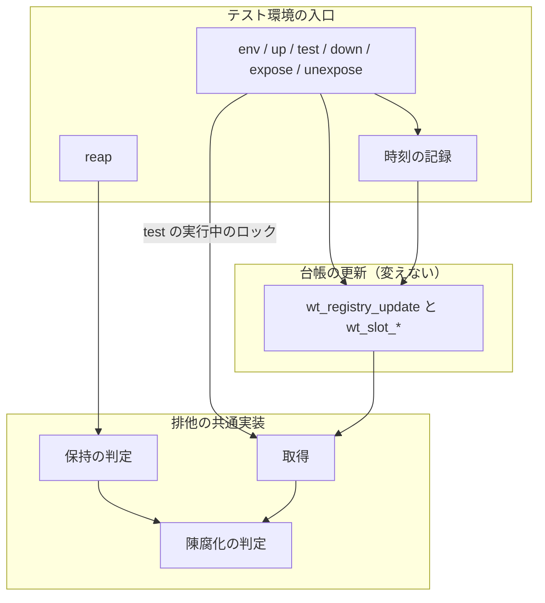
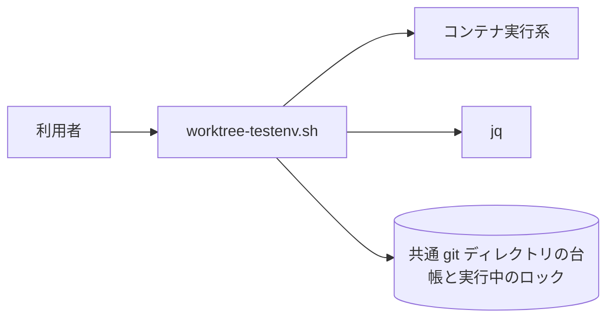
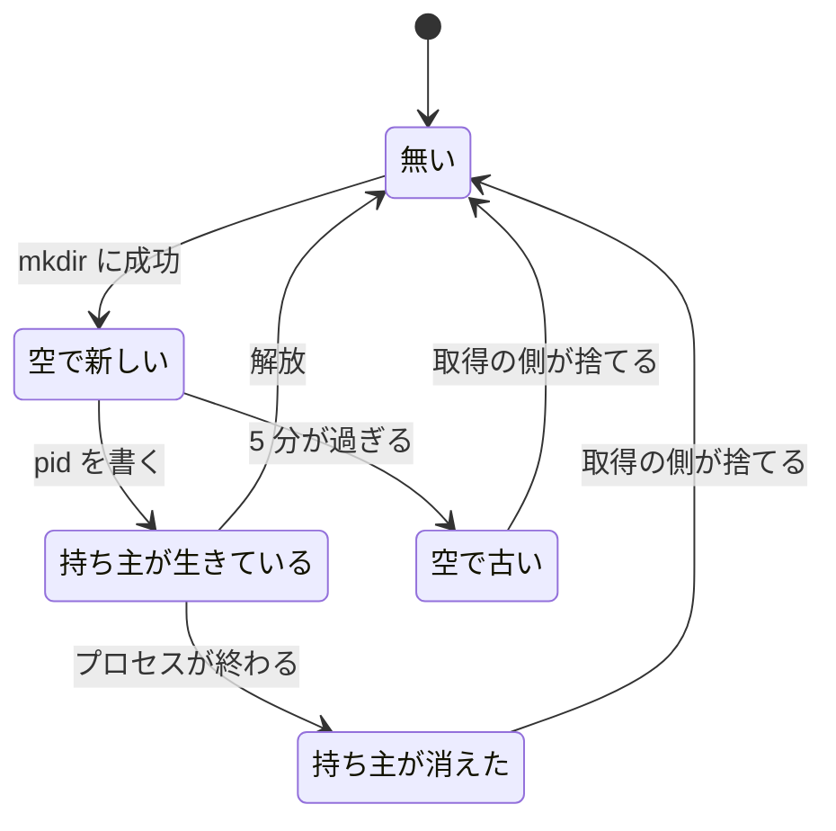
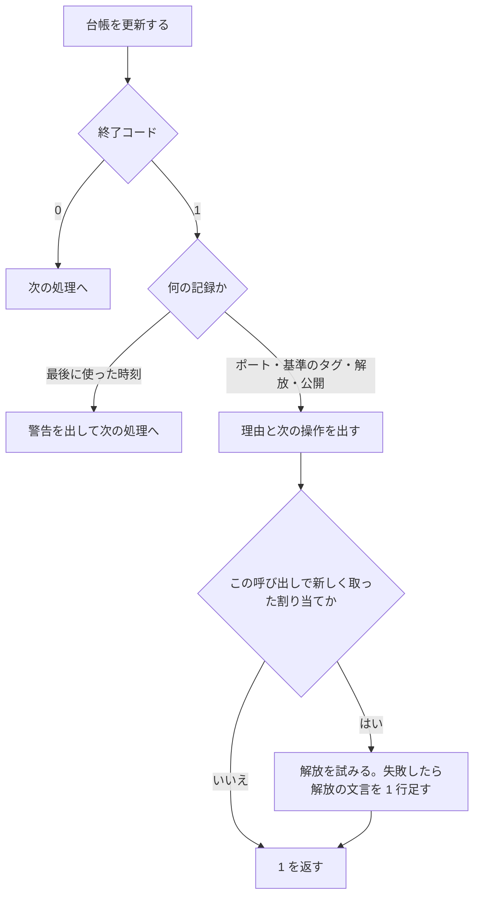

# #312 / #315: 保持の判定を陳腐化の規則へ揃え、台帳の更新の失敗をすべての呼び出しで受け取る

要求と受け入れ条件は [issue-312-315-requirements.md](issue-312-315-requirements.md) にある。この文書は「どう作るか」だけを扱う。

## 機能一覧

| # | 機能 | 誰が使うか |
| --- | --- | --- |
| F1 | ロックが握られているかを、取得の側と同じ規則で返す（`ndf_lock_is_held`） | `reap`（`wt_lock_is_held` 経由） |
| F2 | 台帳へ書けなかったとき、サブコマンドを止めて理由と次の操作を出す | `env` / `up` / `down` / `expose` / `unexpose` の利用者 |
| F3 | 最後に使った時刻を書けなかったとき、警告だけを出して続ける | `up` / `test` の利用者 |

## 構成要素

| 要素 | 責務 | 変更 |
| --- | --- | --- |
| 排他の共通実装（`lock-common.sh`） | 取得・解放・陳腐化の判定・保持の判定 | 保持の判定を陳腐化の判定の否定にする |
| 既存の名前への委譲（`worktree-common.sh` の排他の節） | `wt_lock_*` を `ndf_lock_*` へ結ぶ | 変えない |
| 台帳の更新（`worktree-common.sh` の `wt_registry_update` / `wt_slot_*`） | 排他のもとで台帳を書き換え、書けなければ 1 を返す | 変えない |
| テスト環境の入口（`worktree-testenv.sh`） | サブコマンドごとに台帳を更新し、コンテナ実行系を呼ぶ | 更新の戻り値を受け、止めるか警告する |
| 時刻の記録（`worktree-testenv.sh` に新設する小関数 `touch_or_warn`） | 最後に使った時刻を書き、失敗しても 0 を返す | 新設 |
| 停止の対象の選別（`worktree-testenv.sh` の `do_reap`） | 実行中のロックが握られていれば止めない | 変えない（F1 の結果が変わる） |



## 文脈と配置

変更は利用者の端末で動くシェルの中に閉じる。外部の系はコンテナ実行系（`docker compose`）と
`jq` だけで、どちらも呼び方を変えない。



| 境界 | 流れるもの | 変更 |
| --- | --- | --- |
| 入口 → 台帳のファイル | 台帳の JSON、ロックのディレクトリ | 無し |
| 入口 → コンテナ実行系 | `compose up` / `stop` / `down` | 台帳へ書けないときに `up` を呼ばなくなる |
| 入口 → 標準エラー | 失敗と警告の文言 | 文言が 7 つ増える。「記録を戻しました」の出る条件が狭まる |

## 置き場所

```text
plugins/ndf/
├── scripts/
│   ├── lib/lock-common.sh                     # ndf_lock_is_held を変える
│   └── worktree-testenv.sh                    # 台帳の更新の 10 か所と小関数 1 つ
└── skills/worktree/
    ├── references/test-execution.md           # reap の説明に 1 文足す
    └── tests/test_testenv.py                  # 追加するテストの置き場所
```

`dev.agy/scripts` は `../scripts` への symlink である（`ls -la plugins/ndf/dev.agy` で確認）。
配布物の同期で差分は出ない。

## 処理の流れ: 保持の判定

**判定の規則を 1 つにする。** `ndf_lock_is_held` は、まずパスがディレクトリであることを確かめる。
そのうえで `_ndf_lock_is_stale "$dir" "<いまの token>"` の否定を返す。

```bash
ndf_lock_is_held() {
  local dir="${1:-}"
  [ -n "$dir" ] && [ -d "$dir" ] || return 1
  ! _ndf_lock_is_stale "$dir" "$(cat "$dir/token" 2>/dev/null)"
}
```

判定がとる状態は次のとおりである。**「空で新しい」から「空で古い」へ移る引き金は時間の経過だけである。**



| 状態 | 変更前の戻り値 | 変更後の戻り値 | `reap` |
| --- | --- | --- | --- |
| 無い / ディレクトリでない / 空の引数 | 1 | 1 | 止める |
| 空で新しい（`held` の有無を問わない） | 0 | 0 | 止めない |
| **空で古い** | **0** | **1** | **止める** |
| 持ち主が生きている（更新時刻の新旧を問わない） | 0 | 0 | 止めない |
| 持ち主が消えた | 1 | 1 | 止める |

`reap` は、握られていないと読んだロックを**取り除かない**（決定 2）。

## 処理の流れ: 台帳の更新の失敗

`worktree-testenv.sh` で台帳を更新する呼び出しは次の 10 か所である。行番号は現行の `develop`
（f081502）のものである。

| # | 行 | サブコマンド | 呼び出し | 失敗したとき | 文言 |
| --- | --- | --- | --- | --- | --- |
| 1 | 123 | `env` | `wt_slot_acquire` | 変えない（既に受けている） | 変えない（#626） |
| 2 | 139 | `env` | 帯を超えた後の `wt_slot_release` | 1 を返す（変えない） | スロットの解放を台帳へ記録できませんでした |
| 3 | 144 | `env` | `wt_slot_set_ports` | 新しく取った割り当ての解放を試み、JSON を出さずに 1 を返す | ポートを台帳へ記録できませんでした。解放も失敗したときは 2 の文言を続けて出す |
| 4 | 266 | `up` | 基準のタグの `wt_registry_update` | `compose up` を呼ばずに 1 を返す | 基準のタグを台帳へ記録できませんでした。起動していません |
| 5 | 277 | `up` | `wt_slot_touch` | 警告を出して続ける | 警告: 最後に使った時刻を台帳へ記録できませんでした |
| 6 | 306 | `down` | `wt_slot_release` | 1 を返す | 破棄しましたが、スロットの解放を台帳へ記録できませんでした。down を再実行してください |
| 7 | 374 | `test` | 実行前の `wt_slot_touch` | 警告を出して続ける | 5 と同じ |
| 8 | 388 | `test` | 実行後の `wt_slot_touch` | 警告を出し、コマンドの終了コードを返す | 5 と同じ |
| 9 | 424 | `unexpose` | `_close_record` | 1 を返す | 公開を閉じる手段は実行しましたが、台帳を閉じられませんでした。unexpose を再実行してください |
| 10 | 510 | `expose` | 巻き戻しの `_close_record` | 1 を返す。「記録を戻しました」を出さない | 公開の手段が失敗し、記録も戻せませんでした。unexpose で閉じてください |

485 行（`expose` の先着 1 本の関門）は `|| return 1` で受けているため、表に入れない。

5 / 7 / 8 は同じ処理であるため、時刻の記録の小関数 `touch_or_warn` にまとめる。この関数は
`wt_slot_touch` を呼び、失敗したら警告を 1 行出す。**戻り値は常に 0 である。**



`G` の分岐を通るのは表の 3 だけである。

## 入出力の契約

関数名・引数・サブコマンドの形は変わらない。変わるのは戻り値と標準エラーである。

| 名前 | 入力 | 出力（成功） | 失敗の形（変更後） | 互換性 |
| --- | --- | --- | --- | --- |
| `ndf_lock_is_held` / `wt_lock_is_held` | ロックのパス | 0 = 握られている | 1 = 無い・ディレクトリでない・陳腐化している（空で古い、または持ち主が消えた）。標準出力へは書かない | 呼び出し元は `do_reap` の 1 か所だけ（`grep -rn "lock_is_held"` で確認）。空で古いロックだけが 0 から 1 へ変わる |
| `worktree-testenv.sh env` | 作業ツリー | 0 と JSON | ポートを記録できなければ 1、標準出力は空 | 変更前は 0 と、台帳に無いポートを載せた JSON を返す |
| `worktree-testenv.sh up` | 作業ツリー、`--tag` / `--profile` | `compose up` の終了コード | 基準のタグを記録できなければ 1、`compose up` を呼ばない。最後に使った時刻だけ書けないときは警告を出して起動する | 変更前は台帳に書けなくても起動する |
| `worktree-testenv.sh test` | 作業ツリー、`--kind` | コマンドの終了コード | 変えない。最後に使った時刻を書けないときは警告だけを出す | 変わらない |
| `worktree-testenv.sh down` | 作業ツリー、`--volumes` | 0 | 解放を記録できなければ 1（変更前も 1）と、再実行の案内 | 文言が増えるだけ |
| `worktree-testenv.sh unexpose` | 作業ツリー | 0 | 台帳を閉じられなければ 1（変更前も 1）と、再実行の案内 | 文言が増えるだけ |
| `worktree-testenv.sh expose` | 作業ツリー | 0 と URL | 巻き戻しに失敗したら 1 と、`unexpose` の案内。「記録を戻しました」を出さない | 終了コードは変わらない |

## 非機能の実現方式

| 大項目 | 要求の条件 | 実現方式 | 確かめ方 |
| --- | --- | --- | --- |
| 運用・保守性 | 台帳へ書けなかったときの文言は、どの記録（ポート・基準のタグ・解放・公開）が書けなかったかと、次の操作を 1 行で示す | 台帳の更新の失敗の表の「文言」列の 1 行を、呼び出しの直後に `printf ... >&2` で出す | 各場面のテストで標準エラーの語を照合する |
| システム環境 | `flock` を使わない。`bash` 以外に `dash` で読み込まれても `lock-common.sh` の構文が通る | `!` による否定と `local` だけを使う。どちらも `dash` が受ける | `dash -n plugins/ndf/scripts/lib/lock-common.sh`（試作で終了コード 0 を確認） |

## 決定の記録

### 決定 1: 保持の判定を、陳腐化の判定の否定として 1 行で書く

#312 の原因は、取得の側（`ndf_lock_acquire`）が捨ててよいと読むロックを、`reap` が握られていると
読む食い違いである。**規則を 2 か所に書くと、片方だけが変わって同じ食い違いが再び起きる。**
否定で書けば、5 分の規則・`token` の照合・`pid` の生死のすべてが 1 か所に残る。判定の途中で
`token` が替わると、陳腐化の判定は「捨てない」を返す。そのため保持の判定は「握られている」の
側へ倒れる。

**`pid` が無ければすぐ「握られていない」と返す形は採らない。** 取得の途中にも `pid` の無い
時間がある。取得と解放を 4 秒回しながら外から覗くと、ディレクトリを観測した 324 回のうち
170 回で `pid` が無かった（解放の途中も含む）。この形では、テストを始めたばかりのテスト環境を
`reap` が止めうる。

**`wt_lock_is_held` の側だけを直す形も採らない。** 排他の実装を `lock-common.sh` の 1 か所に
寄せた #293 の構成を崩す。

### 決定 2: `reap` は握られていないと読んだロックを取り除かない

取り除きは、`token` を照合する関門（`_ndf_lock_discard`）を通す必要がある。関門を通らずに消すと、
#297 で直した「別の担当が取り直したロックを壊す」が起きる。`reap` から関門を呼べば正しく
取り除ける。ただし残ったディレクトリは次の `test` の取得が捨てるため、結果は変わらない。
取り除く経路を増やさない。

### 決定 3: 最後に使った時刻の記録だけは、失敗しても止めない

最後に使った時刻（`last_used_at`）を読むのは `reap` だけである。書けなくても、スロット・ポート・
公開の記録は食い違わない。`test` の実行中は実行中のロックが `reap` から守るため、実行前の記録が
無くても止められない。書けないことで起きるのは、`up` や `test` の後に `reap` が期間より早く
止めることで、`up` で戻せる。

**他の記録と同じく 1 を返して止める形は採らない。** `test` は、実行したコマンドの終了コードを
そのまま返す約束を持つ（`references/test-execution.md`）。実行後の記録の失敗で終了コードを
変えると、その約束を破る。台帳の記録の失敗がテストの失敗に見える。

### 決定 4: `env` でポートを記録できないときは、JSON を出さずに新しく取った割り当てを解放する

JSON を出すと、読む側は台帳に無いポートで起動を組み立てる。ポートの無い割り当てを残すと、
次の `env` は「既にある」として同じスロットを返し、ポートは `{}` のままになる。解放の条件は、
帯を超えたときの既存の分岐と同じにする（`had_slot` が 0 のときだけ解放する）。解放も失敗したときは、
表の 2 と同じ「スロットの解放を台帳へ記録できませんでした」を続けて出す。排他を取れないことが原因なら
解放も同じ理由で失敗しうるため、割り当てが残ったことを利用者へ知らせる。

**JSON を出したうえで 1 を返す形は採らない。** `up` と `test` は `do_env >/dev/null` で呼ぶため
影響しない。一方で利用者が `env` の出力を直接読むと、終了コードを見ない限り台帳に無い値を使う。

### 決定 5: 失敗の原因（排他の待ち・jq・書き出し）を文言で区別しない

`wt_registry_update` はどの原因でも 1 を返す。区別するには `worktree-common.sh` の戻り値の形を
変える必要があり、要求の前提 2 から外れる（同じファイルの別の節を他の担当が設計している）。
文言は「どの記録が書けなかったか」と「次の操作」までに留める。原因の区別が要る場面
（`env` の「空きスロットがありません」）は #626 として分けた。

### 決定 6: 呼び出しごとの失敗は、`jq` を差し替えて作る

テストでは `PATH` の先頭に偽の `jq` を置く。偽の `jq` は、引数のどれかが指定の部分文字列を
含むときだけ終了コード 5 で終わり、それ以外は本物の `jq` へ渡す。部分文字列は代入式にする。

| 部分文字列 | 失敗する呼び出し |
| --- | --- |
| `.ports = $ports` | ポートの記録 |
| `.golden_tag = $tag` | 基準のタグの記録 |
| `.released_at = (now` | 割り当ての解放 |
| `.last_used_at = (now` | 最後に使った時刻の記録 |
| `.expose.closed_at = (now` | 公開の記録を閉じる・巻き戻す |

採番の `jq` プログラムも `released_at` と `last_used_at` の語を含むが、`名前: 値` の形で書かれて
いるため当たらない。試作で 8 場面を作り、狙った 1 か所だけが失敗することを確かめた。

排他を取れない場面（#315 の原文の原因）は、台帳のロックを生きている `pid` で握って 1 件だけ
作る。待ちの上限の 5 秒がかかるため、場面ごとには使わない。

**台帳の置き場所を書き込み不可にする形は採らない。** ロックのディレクトリも同じ場所に作るため、
取得の段階で 5 秒待って失敗する（実測）。呼び出しを 1 か所に絞れない。

**試験のための切り替えを `worktree-testenv.sh` へ足す形も採らない。** 本番のコードに試験だけの
分岐が残る。

## テスト設計

追加先は `plugins/ndf/skills/worktree/tests/test_testenv.py` である。関数の判定は排他の節へ、
サブコマンドの結果は reap の節と公開の節へ足す。偽の `jq` を作る補助関数を 1 つ足す。

| 受け入れ条件 | 何で確かめるか |
| --- | --- |
| AC1 | 空のロックの更新時刻を 1 時間前にし、`run_lib` で両関数の終了コードが 1 |
| AC2 | 空のロックと、`held` だけを置いたロックで、両関数の終了コードが 0 |
| AC3 | 生きている `pid`（テストのプロセス）を置き、更新時刻を 1 時間前にしても 0 |
| AC4 | `pid` に 999999、存在しないパス、通常のファイル、空の引数で 1（パラメータ化） |
| AC5 | AC1〜AC4 の各状態で、`ndf_lock_is_held` と `_ndf_lock_is_stale "$d" "$(cat "$d/token")"` の結果が逆（パラメータ化。存在しないパスとファイルを除く） |
| AC6 | 判定の後に `case "$-" in *C*)` と標準出力の空を確かめる |
| AC7 | `reap` の既存テストの形（稼働中のコンテナを返す偽の実行系）で、実行中のロックを古い空のロックにし、`stop` が呼ばれる |
| AC8 | 同じ形で、新しい空のロックと生きている `pid` のロックでは `stop` が呼ばれない（パラメータ化） |
| AC9 | 偽の `jq`（`.ports = $ports`）で `env`。終了コード 1・標準出力が空・標準エラーの語・割り当ての行が解放済み |
| AC10 | 帯を超える宣言と偽の `jq`（`.released_at = (now`）で `env`。終了コード 1・解放できなかった語 |
| AC11 | 偽の `jq`（`.golden_tag = $tag`）で `up --tag`。終了コード 1・偽の実行系に `up` が記録されない |
| AC12 | 台帳のロックを生きている `pid` で握って `up --tag`。終了コード 1・`up` が記録されない・経過が 8 秒未満 |
| AC13 | 偽の `jq`（`.released_at = (now`）で `down`。終了コード 1・`down を再実行` の語 |
| AC14 | 公開した後、偽の `jq`（`.expose.closed_at = (now`）で `unexpose`。終了コード 1・再実行の語・台帳の `closed_at` が空のまま |
| AC15 | `open_command` を失敗させ、偽の `jq`（`.expose.closed_at = (now`）で `expose`。終了コード 1・`記録を戻しました` が無い・`unexpose で閉じて` がある |
| AC16 | 偽の `jq`（`.last_used_at = (now`）で、`up` は終了コード 0 と `up` の記録と警告。`test`（`run` が `exit 3`）は終了コード 3 と警告 |
| AC17 | `uv run --with pytest pytest plugins/ndf/skills/worktree/tests scripts/tests/test_lock_common.py -q` が通る（試作の状態で、対象の 3 ファイルの 141 件が通ることを確認） |
| AC18 | 既存の `test_stale_lock_is_taken_over` / `test_lock_without_a_pid_is_not_taken_immediately` / `test_old_lock_without_a_pid_is_taken` / `test_six_at_once_leave_one_owner` が変更なしで通る |

**実装の前に、AC1・AC7・AC9・AC11・AC15 が変更前のコードで落ちることを確かめる。** 変更前の
実測は次のとおりである。

| 受け入れ条件 | 変更前の実測 |
| --- | --- |
| AC1 | 終了コード 0 |
| AC7 | `stop` が呼ばれない |
| AC9 | 終了コード 0 と JSON。台帳のポートは `{}` |
| AC11 | `compose up` が呼ばれ、終了コード 0 |
| AC15 | 「記録を戻しました」が出る。台帳の公開の記録は閉じていない |

## 未確認のまま残ること

| 項目 | 内容 |
| --- | --- |
| 実物のコンテナ実行系での `down` の再実行 | 案内する「down を再実行」は、既に破棄したプロジェクトに対して `compose down` が 0 を返すことを前提にしている。この段階ではコンテナを起動しないため、偽の実行系でしか確かめていない |
| `unexpose` の再実行で閉じる手段がもう一度走ること | 閉じる手段を 2 度実行してよいかは、各リポジトリが宣言した手段に依る。文言は再実行だけを案内する |
| `ndf_lock_is_held` の呼び出し元の増加 | 現時点の呼び出し元は `do_reap` の 1 か所である。`workflow-common.sh` は保持の判定を使わない（`grep` で確認）。他の担当の設計が新しく使う場合、判定の意味が「陳腐化していない」であることを共有する必要がある |
