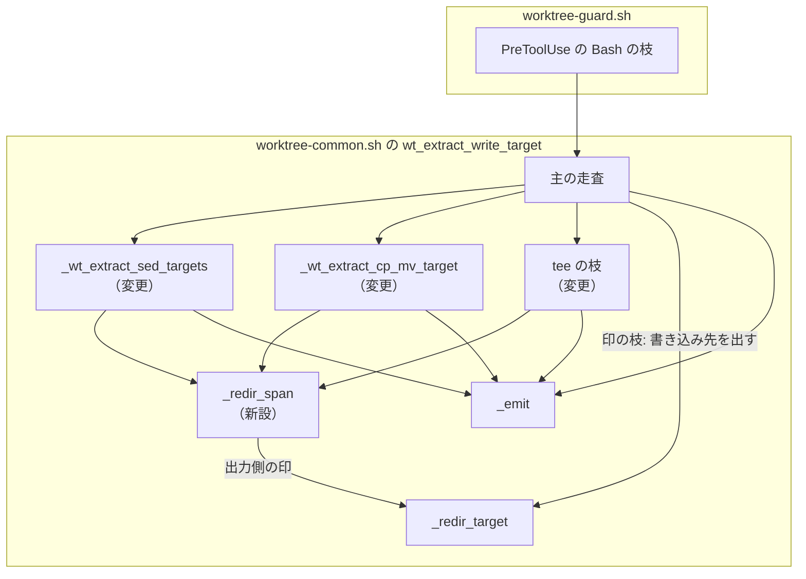
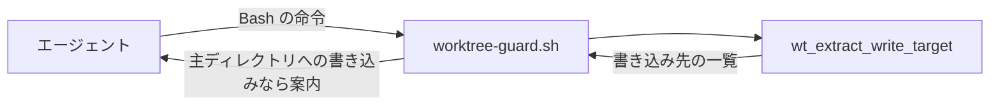
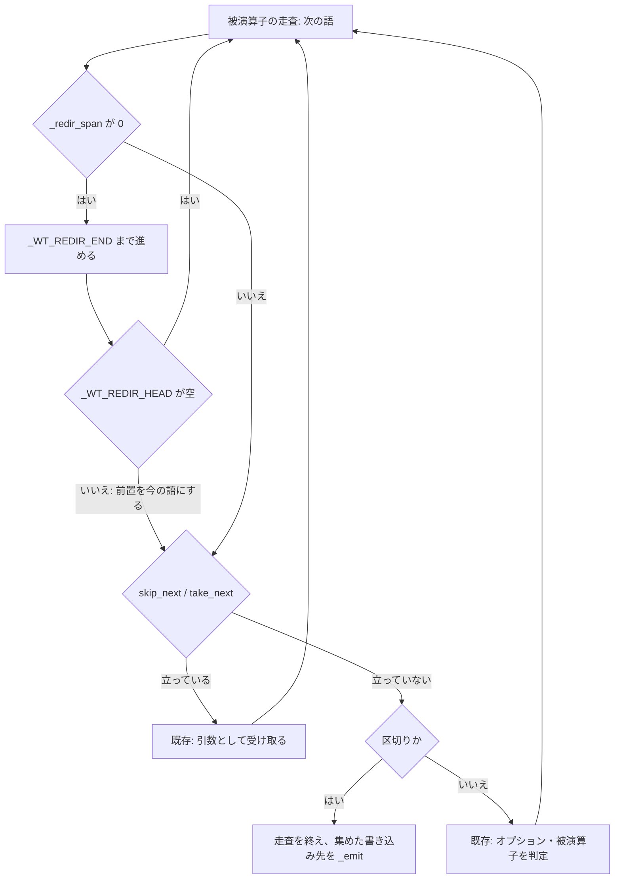

# #313: 被演算子の走査がリダイレクトを読み飛ばして続く形にする

要求と受け入れ条件は [issue-313-requirements.md](issue-313-requirements.md) にある。この文書は「どう作るか」と、
直し方の候補を最新の `develop`（f081502）で確かめた結果を扱う。

**リダイレクトの語が読み終える位置を返す補助関数を 1 つ足し、被演算子を走査する 3 つの枝がその位置まで
読み飛ばす。** 読み飛ばしは区切りの判定と、オプションの引数を取る判定（`-e` / `-t`）より前に置く。
前の被演算子に密着した入力側のリダイレクト（`b<in`）は、補助関数が `<` の前を被演算子として返す。
リダイレクトの書き込み先は、これまでどおり主の走査が出す。

## 現状と bash の振る舞い

### 走査が止まる理由

`_wt_is_separator` は `__WT_*` に当たる語をすべて区切りとして扱う。出力側のリダイレクトは字句解析の前に
印 `__WT_REDIR__` / `__WT_APPEND__` へ置き換わるため、**被演算子を走査する枝はリダイレクトの印を命令の
区切りとして読み、そこで走査を終える。** 印の後ろの被演算子は、どの枝からも読まれない。

入力側のリダイレクト（`<` `<<<` `<<`）は印へ置き換わらず、語のまま残る。被演算子を走査する枝は
これらを被演算子として読む。

**字句解析は語の途中の `<` で語を分けない。** `cp a b<in` は `cp` `a` `b<in` の 3 語になる。bash は引用符の
外の `<` で語を分けるため、`b` と `in` は別の語である。出力側の `cp a b>log c` が `b` `__WT_REDIR__` `log` `c`
に分かれるのは、字句解析の前に `>` を前後に空白を挟んだ印へ置き換えるためである（入力側は置き換えない。
決定 3）。

### 実測

**確かめ方:** 作業ツリーの `worktree-common.sh` を読み込んで抽出関数を呼んだ。bash の振る舞いは、一時
ディレクトリで同じ命令を `bash -c` で走らせ、書き換わったファイルを見た。

| 命令 | bash が書き換える / 作るもの | 抽出関数（現状） |
| --- | --- | --- |
| `sed -i 's/a/b/' x.md >log y.md` | `x.md` `y.md` `log` | `x.md` `log` |
| `sed -i 's/a/b/' x.md 2>&1 y.md` | `x.md` `y.md` | `x.md` |
| `sed -i 's/a/b/' x.md &>log y.md` / `>&log` / `>& log` | `x.md` `y.md` `log` | `x.md` `log` |
| `sed -i 's/a/b/' x.md 2>/dev/null y.md` | `x.md` `y.md` | `x.md` |
| `sed -i s/a/b/ >log x.md` | `x.md` `log` | `log` |
| `sed -i 's/a/b/' x.md <in y.md` | `x.md` `y.md` | `x.md` `<in` `y.md` |
| `sed -i 's/a/b/' x.md < in y.md` | `x.md` `y.md` | `x.md` `<` `in` `y.md` |
| `sed -i 's/a/b/' x.md <<<word y.md` | `x.md` `y.md` | `x.md` `<<<word` `y.md` |
| `sed -i s/a/b/ x.md <<EOF y.md`（本文と終端が続く） | `x.md` `y.md` | `x.md` `<<EOF` `y.md` |
| `sed -i s/a/b/ x.md <>rw y.md` | `x.md` `y.md` と、`rw` を作る | `x.md` `<` `rw` |
| `cp a b >log c`（`c` はディレクトリ） | `c/a`（`b` も複製元として読む） | `b` `log` |
| `cp a b < in` | `b` | `in` |
| `cp -t >log dir a b` | `dir/a` `dir/b` | `>` `log`（`-t` が印を引数として受け取り、印が字面へ戻って出る） |
| `tee a >log b` | `a` `b` `log` | `a` `log` |
| `echo hi >| f` | `f` | 出ない（#625） |
| `cd sub && cp a b <in`（起点 `/base`） | `sub/b` | `/base/sub/<in`（試作では `/base/sub/b`） |
| `cp a b<in` / `cp a b<&0` / `cp a b<<<word` | `b` | `b<in` / `b<&0` / `b<<<word` |
| `cp a b< in` | `b` | `in` |
| `sed -i s/a/b/ x.md<in y.md` | `x.md` `y.md` | `x.md<in` `y.md` |
| `cp -t dir<in a b` | `dir/a` `dir/b` | `dir<in` |
| `cp a b<>rw` | `b` と、`rw` を作る | `b<` `rw` |
| `cp a<(echo) d` | 何も作らない（`a<(echo)` は 1 語の `a/dev/fd/63` になり、`cp` が失敗する） | `d` |
| `cp a "b<c"` | `b<c` | `b<c`（試作では `b`） |

**`2>&1` の `2` は、字句解析の後に並びから落ちる**（#197）。記述子の複製 `&1` は `_redir_target` が
ファイルとして扱わない。どちらもこの変更の前から働いている。

## 機能一覧

| # | 機能 | 誰が使うか |
| --- | --- | --- |
| F1 | 被演算子の走査が、出力側のリダイレクトを読み飛ばして区切りまで続く | `worktree-guard.sh`（主ディレクトリの編集の案内） |
| F2 | 被演算子の走査が、入力側のリダイレクトとその被演算子を被演算子として読まない | 同上 |

## 構成要素

**新しいファイルは作らない。** 変えるのは抽出関数の内側とそのテストである。

| 要素 | 責務 |
| --- | --- |
| `_redir_span`（抽出関数の内側に新設） | 添字の語がリダイレクトかを判定し、リダイレクトの被演算子を読み終えた最後の語の位置を `_WT_REDIR_END` に、語の中の `<` より前の被演算子を `_WT_REDIR_HEAD` に置く。書き込み先は出さない |
| `_redir_target`（既存・変えない） | 出力側の印の後ろから、開かれるファイルと読み終えた位置を決める。`_redir_span` が出力側の判定に使う |
| `_wt_extract_sed_targets`（変更） | 各語の先頭で `_redir_span` を呼び、当たれば読み終えた位置まで進める。`_WT_REDIR_HEAD` が空でなければ、それを今の語として後の判定へ渡す。`skip_next` の判定より前に置く |
| `_wt_extract_cp_mv_target`（変更） | 同上。`take_next` の判定より前に置く |
| `tee` の枝（変更） | 同上。区切りの判定より前に置く |
| 末尾の `unset -f`（変更） | `_redir_span` を足す |
| `plugins/ndf/skills/worktree/tests/test_write_target.py`（変更） | 受け入れ条件ごとのテスト |



図は呼び出しの関係だけを描く。字句解析（`_wt_tokenize`）・ヒアドキュメントの除去・`cd` の枝は変えないため
含めない。

## 文脈と配置

**外部の系は無い。** 抽出関数は Claude Code の PreToolUse フックとして動く `worktree-guard.sh` の中で、同じ
bash のプロセスとして呼ばれる。配置は変わらないため、配置の図は描かない。



## 変わるファイル

```text
plugins/ndf/
├── scripts/lib/worktree-common.sh          # 変更: _redir_span の新設、3 つの枝の先頭、unset -f
└── skills/worktree/tests/test_write_target.py  # 変更: 受け入れ条件のテスト
```

## 入出力の契約

抽出関数の引数・終了コード・出力の形は変わらない。変わるのは `_redir_span` という内側の約束だけである。

### `_redir_span <添字>`

語の中の最初の `<` で、語を前置と残りに分ける。表の「前置」は `_WT_REDIR_HEAD` に置く値である。

| 語の形（字句解析の後） | 戻り値 | `_WT_REDIR_HEAD` | `_WT_REDIR_END` | 例 |
| --- | --- | --- | --- | --- |
| `__WT_REDIR__` / `__WT_APPEND__` | 0 | 空 | `_redir_target` が決めた位置 | `>log` `2>&1` `>& log` `&>>log` |
| `<` を含まない | 1 | 空 | 変えない | `x.md` `-i` |
| 残りが `<(` で始まる | 1 | 空 | 変えない | `<(echo)` `a<(echo)`（プロセス置換は被演算子の一部である） |
| 残りが `<<<` / `<<-` / `<<` / `<&` / `<` の後ろに文字を持つ | 0 | 前置 | 添字そのもの | `<in` `2<in` `b<in` `<<<word` `<<EOF` `<&0` `s/<a>/b/` |
| 残りが `<<<` / `<<-` / `<<` / `<&` / `<` だけで、次の語が `__WT_REDIR__` | 0 | 前置 | 次の語を `_redir_target` に渡して決めた位置 | `<>rw` `3<>rw` `b<>rw`（字句解析の後は `b<` と印と `rw`） |
| 残りが上の 5 つだけで、次の語が印でない | 0 | 前置 | 添字 + 1 | `< in` `b< in` `<<< word` `<< EOF` |

- **前置が数字だけなら記述子の番号として空にする**（`2<in`）。bash が記述子の番号と読むのは、`<` の前が
  数字だけのときである（`b2<in` は `b2` を被演算子として残す。実測）
- **前置が空でないとき、枝は前置を今の語として順 2〜4 の判定へ渡す。** `cp -t dir<in a b` の `-t` は `dir`
  を受け取る
- 引用符の中の `<` を含む語（`sed` のスクリプト `'s/<br>/x/'`）も分ける。前置が被演算子として残るため、
  被演算子の数は変わらない。`sed` はスクリプトを出さないため、出力も変わらない（試作で実測）
- **`<>` の書き込み先は主の走査の印の枝が出す。** `_redir_span` は読み飛ばすだけである

### 被演算子を走査する枝の、1 語ごとの判定の順序

| 順 | 判定 | 当たったとき |
| --- | --- | --- |
| 1 | `_redir_span` が 0 を返す | 読み終えた位置まで進める。`_WT_REDIR_HEAD` が空なら次の語へ、空でなければそれを今の語として順 2 へ |
| 2 | `skip_next` / `take_next` が立っている（`sed` / `cp`・`mv` のみ） | 既存どおり |
| 3 | `_wt_is_separator` に当たる | 既存どおり走査を終える |
| 4 | オプション・被演算子の判定 | 既存どおり |

## 処理の流れ



主の走査は変わらない。被演算子を走査する枝から戻った後も、`sed` / `cp` / `tee` の次の語から走査を続け、
印の枝がリダイレクトの書き込み先を出す。**そのため出力の順序が変わる**（`x.md` `y.md` `log` の順になる。
現状は `x.md` `log`）。順序は契約に含めない（要求の前提 2）。

## 非機能の実現方式

| 大項目 | 実現方式 | 確かめ方 |
| --- | --- | --- |
| 性能・拡張性 | `_redir_span` は語 1 つにつき `case` と最初の `<` での分割だけを行い、ループの添字を前へ進めるだけで戻さない | 変更後の `test_write_target.py` の実行時間が、変更前（350 件で約 6〜7 秒）から目立って延びないことを見る |

## 決定の記録

### 決定 1: 被演算子を走査する枝の先頭でリダイレクトを読み飛ばし、区切りの定義は変えない

`_wt_is_separator` は `cd` の枝・`||` の右辺の判定・`case` の印など多くの箇所が共有する。区切りの定義を
変えずに、被演算子を走査する枝だけが先にリダイレクトを除けば、影響はその 3 つの枝に閉じる。試作を
当てた写しで既存のテストがすべて通った。

区切りの判定から出力側の印を外す案は、印とその後ろの語を被演算子として読む。試作では
`sed -i s/a/b/ x.md >log y.md` が `>` を書き込み先として出して `log` を 2 回出し、`cp a b >log` の宛先が `log` になって `b` が消えた。

### 決定 2: 入力側のリダイレクトも読み飛ばす

同じ走査の中で、入力側の語は被演算子の位置を奪っている（`cp a b < in` の宛先が `in`、`sed` の書き込み先に
`<in` が出る）。出力側だけを読み飛ばすと、リダイレクトの前後の被演算子を正しく並べる目的が入力側で
果たせない。**原因が同じ走査の読み方で、分けると片方だけが残る**ため範囲へ入れた。

出力側だけを直す案は、issue の例（`>log`）を満たすが、`cp a b < in` の宛先の取り違えを残す。

### 決定 3: 入力側のリダイレクトは字句解析の後の語の中の `<` で見分け、印へ置き換えない

出力側と同じく字句解析の前に `<` を印へ置き換えれば、引用符の中の `<`（`cp a "<b"`）と区別できる。
しかし字句解析は、`<` の直後の `&` を記述子の複製として 1 語に繋げる。`<` の置き換えだけを試作に入れると、
この繋ぎが外れた。`cd sub && cat 2<&1 x; echo hi > f` の `f` は `/base/sub/f` から `/base/f` へ変わった。**この退行は既存の
テスト 350 件を通過した。** 置き換えを採るなら字句解析の `&` の扱いも直す必要があり、`cd` の追跡の全体へ
退行の範囲が広がる。

字句解析の後の語で見分ける形は字句解析を触らない。**見分けるのは語の頭ではなく、語の中の最初の `<` である。**
字句解析は `b<in` を 1 語のまま渡すため、語の頭だけを見ると `cp a b<in` の宛先を `b<in` と出す（bash の
宛先は `b`）。`<` の前を被演算子として返せば、試作で `cp a b<in` の宛先が `b`、`cp -t dir<in a b` の宛先が
`dir` になり、既存のテスト 350 件も通った。`cd sub && cat 2<&1 x; echo hi > f` の `f` は `/base/sub/f` のまま
である。

代わりに引用符で囲んだ `<` を含む名前をリダイレクトと取り違える（`cp a "<b"` の宛先が `a`、`cp a "b<c"` の
宛先が `b` になる。現状はどちらも字面のまま出る）。この名前は実用上現れないものとして受け入れる（要求の
前提 3）。

語の頭だけで見分ける案は、密着した形の宛先の取り違えを残す。字句解析の前に `<` の前へ空白を挟む案は、
引用符の中の語の字面を変え（`cp a "b<c"` が `b <c` の 1 語になる）、記述子の番号を `<` から離す（`cp a b 2<in`
が `2` と `<in` になり、`2` が宛先の位置を奪う）。どちらも実測で、直すには字句解析と番号の除去の段に手が入る。

### 決定 4: 読み飛ばしを `skip_next` / `take_next` の判定より前に置く

bash はリダイレクトを引数の並びから除いてから命令へ渡す。`sed -e >log s/a/b/ x.md` の `-e` の引数は
`s/a/b/` で、`cp -t >log dir a b` の宛先は `dir` である（どちらも実測）。後に置くと、オプションが印を
引数として受け取る。試作では `cp -t >log dir a b` が `>` と `log` を出し、`dir` を出さなかった。

### 決定 5: `cd` の枝と、命令名より前の入力側のリダイレクトは変えない

`cd` の枝は出力側のリダイレクトを既に読み飛ばしている。入力側を与えた `cd`（`cd <in sub`）は書く場面が無い。
`cd` の枝は現在地の追跡の起点であり、変えると `cd` を含むテスト群の全体が退行の範囲に入る。
`_redir_span` を `cd` の枝でも呼ぶ形は 1 行で済むが、得るものが無いため採らない。

### 決定 6: `<(` はリダイレクトとして扱わない

プロセス置換 `<(cmd)` は `/dev/fd/N` というパスへ展開される被演算子で、bash は引数の並びに残す。
語の途中にあっても語を分けない（`echo a<(true)` は `a/dev/fd/63` を出す。実測）。リダイレクト
として読み飛ばすと、最後の被演算子が消えて手前の複製元が宛先の位置に来る。試作から除外の 1 行を外すと、
`cp a <(x)` の宛先が複製元の `a` になった（除外した形と現状はどちらも `<(x)`）。

## テスト設計

テストは `plugins/ndf/skills/worktree/tests/test_write_target.py` に置き、既存の `extract`（起点なし）と、
起点を渡す既存の呼び方を使う。「変更前」は develop（f081502）での結果である。

| 実行の場面 | コマンド |
| --- | --- |
| 変更した枝の確認 | `uv run --with pytest pytest plugins/ndf/skills/worktree/tests/test_write_target.py -q` |
| 仕上げ | `uv run --with pytest pytest scripts/tests plugins/ndf -q` |

| 受け入れ条件 | 何で確かめるか | 変更前 |
| --- | --- | --- |
| AC1 | `sed -i 's/a/b/' x.md >log y.md` の結果を集合で比べ、`{x.md, y.md, log}` になる | 落ちる |
| AC2 | `2>&1` / `2>/dev/null` / `&>log` / `>&log` / `>& log` / `>>log` を parametrize し、`y.md` を含み `/dev/null` と数字だけの語を含まない | 落ちる |
| AC3 | `cp a b >log c` と `mv a b >log c` を parametrize し、`c` を含み `b` を含まない | 落ちる |
| AC4 | `tee a >log b` の結果が `{a, b, log}` | 落ちる |
| AC5 | `sed -i >log 's/a/b/' x.md` が `x.md` を含む。`cp -t >log dir a b` と `cp a >log -t dir b` が `dir` を含み `a` `b` `>` を含まない | 落ちる |
| AC6 | `<in` / `< in` / `<<<word` / `<<< word` / `2<in` / `<&0` を parametrize し、結果が `{x.md, y.md}` と等しい | 落ちる |
| AC7 | `<<EOF` と `<< EOF` の 2 形を、本文と終端を含む複数行の命令で渡し、結果が `{x.md, y.md}` と等しい | 落ちる |
| AC8 | `cp a b <in` と `cp a b < in` の結果が `["b"]` | 落ちる |
| AC9 | `sed -i s/a/b/ x.md <>rw y.md` の結果が `{x.md, y.md, rw}` | 落ちる |
| AC10 | `cp a b<in` / `cp a b< in` / `cp a b<&0` / `cp a b<<<word` を parametrize し結果が `["b"]`。`sed -i s/a/b/ x.md<in y.md` が `{x.md, y.md}`、`cp -t dir<in a b` が `["dir"]`、`cp a b<>rw` が `{b, rw}` | 落ちる |
| AC11 | 起点 `/base` を渡し、`cd sub && sed -i s/a/b/ x.md >log y.md` の結果が `/base/sub/` 配下の 3 件 | 落ちる |
| AC12 | `cp a b 2>&1 \|\| echo c` の結果が `["b"]` | 通る |
| AC13 | `cp <(echo) dest` と `cp a<(echo) d` を parametrize し、最後の被演算子だけが出る | 通る |
| AC14 | `sed -i 's/<br>/x/' y.md` と `sed -e 's/<a/b/' -i x.md` の結果が、それぞれ `["y.md"]` と `["x.md"]` | 通る |
| AC15 | テスト一式の実行。`test_write_target.py` の既存テストの差分が追加だけであることを差分で確かめる | 通る |

**比べ方は集合にする。** 変更で出力の順序が変わるため、順序を含めて比べるテストを足すと、契約に無い順序を
固定する。

AC7 のヒアドキュメントは、`extract` が命令を `<<'WT_EOF'` で包んで渡すため、命令側の終端の語は `EOF` の
ままでよい（包む側の終端と重ならない）。

## 未確認のまま残ること

| 項目 | 内容 |
| --- | --- |
| 実際の案内の頻度 | リダイレクトを挟んだ `sed -i` / `cp` をエージェントがどの程度書くかは測っていない。案内が増えるのは主ディレクトリのパスを含む場合だけである |
| 引用符で囲んだ `<` を含む名前 | 実用上現れないとして受け入れた（決定 3）。現れたときは宛先を取り違える（`cp a "b<c"` の宛先が `b`） |
| bash 以外のシェル | 抽出関数は bash の文法を前提にする。zsh の `<<<` や `>!` は確かめていない |
