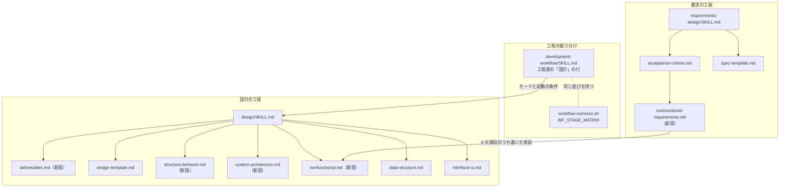
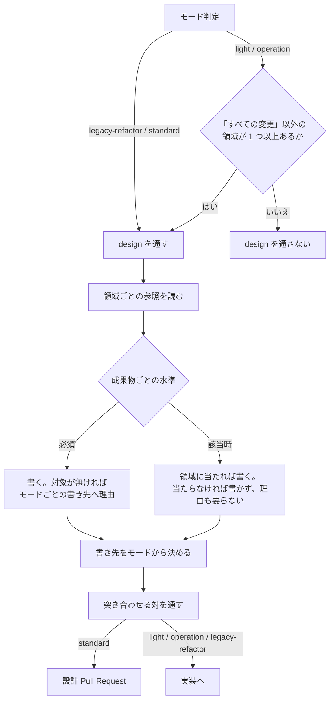

# #375 / #376 / #463: 設計と要求の成果物の定義

要求と受け入れ条件は [issue-375-376-463-requirements.md](issue-375-376-463-requirements.md)
にある。この文書は「どう作るか」だけを扱う。

## 機能一覧

この変更が作る・変える機能を、利用者（Skill を起動する AI）から見た単位で並べる。

| # | 機能 | 誰が使うか | 課題 |
| --- | --- | --- | --- |
| F1 | 非機能の要求を 6 大項目で書く | `requirements-design` を通す担当 | #376 |
| F2 | 非機能の項目が該当するかを判定する | 同上 | #376 |
| F3 | 設計の成果物の要否を、モードと領域から決める | `design` を通す担当 | #375 |
| F4 | 設計の書き先をモードから決める | 同上 | #375 |
| F5 | `light` / `operation` で `design` を通すかを判定する | `development-workflow` を通す担当 | #375 |
| F6 | 設計 Pull Request の前に、文書の内部整合を突き合わせる | `design` を通す担当 | #463 |

## 構成要素

**新しいスクリプトも新しい Skill も作らない。** 変えるのは Skill 本文と参照、および工程の
分類を持つ 1 つの定数である。

| 要素 | 責務 |
| --- | --- |
| `requirements-design/references/nonfunctional-requirements.md`（新設） | 6 大項目それぞれの書き方・例・該当の判定（F1 / F2） |
| `requirements-design/references/acceptance-criteria.md` | 非機能の節を入口だけにし、詳細を新設の参照へ渡す |
| `requirements-design/references/spec-template.md` | 非機能の雛形を 6 大項目へ差し替える |
| `requirements-design/SKILL.md` | 参照の一覧へ新設ファイルを足す |
| `design/references/deliverables.md`（新設） | モード × 成果物の要否表と、成果物ごとの中身・書き先（F3 / F4） |
| `design/references/structure-behavior.md`（新設） | クラス図・オブジェクト図・状態遷移図・シーケンス図の書き分けと粒度 |
| `design/references/system-architecture.md`（新設） | 文脈・構成・配置の図。C4 の階層との対応 |
| `design/references/nonfunctional.md`（新設） | 6 大項目に対する実現方式 |
| `design/references/data-structure.md` | ER 図・テーブル定義・CRUD 図を足す |
| `design/references/interface-ui.md` | 画面一覧・項目定義・レイアウトの粒度を決める |
| `design/references/design-template.md` | 雛形の節を拡張し、「図の水準」を差し替え、突き合わせる対の一覧を置く（F6） |
| `design/SKILL.md` | 成果物の節を要否表と書き先の表へ置き換え、必須の成果物を省いた理由の書き先をモードで分け、領域の表へ 3 行足し、手順 4 の前に突き合わせを置き、手順 4 とドキュメント再構成と進行の記録（ドキュメントレビュー）を設計 Pull Request を出すモードに限る |
| `development-workflow/SKILL.md` | 工程表の「設計」の行、工程の図と注記の `light` / `operation` の経路、設計 Pull Request のマージの節が `light` を外す理由（F5） |
| `development-workflow/scripts/lib/workflow-common.sh` | `WF_STAGE_MATRIX` の「設計」の行（F5） |
| `development-workflow/references/stage-notes.md` | 「設計」の工程の注記を、`light` / `operation` が条件付きで通る形へ改める（F5） |
| `development-workflow/references/workflow-modes.md` | `operation` の節の「設計を行わない」を条件付きへ改める（F5） |
| `development-workflow/references/operation-run.md` | `operation` の設計の書き先と、再掲しない範囲 |
| `plan-to-spec/SKILL.md` | クラス図の同期の時点 |
| `docs/specifications/ndf-design-phase.md` | 決定の理由 |

### 構成要素の関係



**`nonfunctional-requirements.md` と `nonfunctional.md` の関係が、#375 と #376 を対にする
唯一の線である。** 要求側が書いた項目だけが、設計側で実現方式を求められる。

**図は参照を読む関係だけを描く。** 構成要素の表に挙げた 19 個のうち、次の 5 つは図に
含めない。この線のどれにも乗らないためである。

| 図に含めないもの | 何をする先か |
| --- | --- |
| `development-workflow/references/stage-notes.md` | 決まったことを自分の側へ書き写す |
| `development-workflow/references/workflow-modes.md` | 同上 |
| `operation-run.md` | 同上 |
| `plan-to-spec/SKILL.md` | 同上 |
| `docs/specifications/ndf-design-phase.md` | 決定の理由を残す |

## 入出力の契約

`design` は**コマンドとして呼ばれる約束**を持つ。API を持たないため、仕様記述形式は使わず
表で書く（`interface-api.md` の「API 以外の呼び出される約束」の形）。

| 項目 | 変更前 | 変更後 |
| --- | --- | --- |
| 名前 | `/ndf:design` | 変わらない |
| 入力 | モード / 受け入れ条件 / 触る領域 | 変わらない |
| 出力 | 設計文書（`standard` は独立したファイル、`legacy-refactor` は任意） | **`light` / `operation` では、受け入れ条件または実行の記録と同じファイルの節** |
| 失敗の形 | 定めていない | 変わらない |
| 互換性 | — | **`light` / `operation` からの起動が増える（破壊的）** |

**互換性の扱い**: これまで `light` と `operation` は設計工程を通らなかった。領域が該当する
変更では通るようになる。**既存の設計文書を新しい要否表へ書き直すことは求めない**（仕様の
「対象範囲（含まない）」）。

`WF_STAGE_MATRIX` は内部の定数であり、外から呼ぶ約束ではない。ただし工程表と同じ並びを
持つことがテストの契約になっている。

| 項目 | 変更前 | 変更後 |
| --- | --- | --- |
| `WF_STAGE_MATRIX` の「設計」の行 | `-\t-\tR\tR` | `C\tC\tR\tR` |
| 工程表の「設計」の行 | `—` / `—` / `design` / `design` | `design`（該当時）/ `design`（該当時）/ `design` / `design` |

**工程名の並びは変えない。** 盤面の値の一覧・対応表の 2 つの列・工程表の 4 箇所は現状のまま
である。

## 処理の流れ



**判定は 3 段である。** モードが起動の要否を決め、領域が成果物の該当を決め、モードが書き先を
決める。**この順序を崩さない。** 書き先を先に決めると、書く対象が無いまま独立したファイルが
生まれる。

### 水準の 2 つと、省いたときの扱い

**「必須」と「該当時」の違いは、省いたときに理由が要るかである。**

| 水準 | 対象が存在するとき | 対象が存在しないとき |
| --- | --- | --- |
| 必須 | 書く | 書かない。**対象が無いことを、下の表が定める書き先へ書く** |
| 該当時 | 領域に当たれば書く | 書かない。理由も要らない |

**この違いを置くのは、「不要」を表す値を持たない要否表を成り立たせるためである。** 値が
2 つとも「書きうる」を意味する以上、区別できるのは省いたときの扱いだけになる。

**理由の書き先はモードで変わる。** 既定は仕様の「対象範囲（含まない）」だが、
**`legacy-refactor` は仕様を入力に取らない**（`design/SKILL.md` の「受け取るもの」。工程表でも
「要求と受け入れ条件」が `-` である）。書き先を仕様に限ると、型を持たないリポジトリで
`legacy-refactor` の変更を行い、クラス図を省くときに書く先が存在しない。

| モード | 省いた理由の書き先 |
| --- | --- |
| `light` / `operation` / `standard` | 仕様の「対象範囲（含まない）」 |
| `legacy-refactor` | 設計文書の「決定の記録」 |

**`legacy-refactor` で「決定の記録」を選ぶのは、そのモードで既に必須の節だからである。**
省略のための節を新しく作ると、書くことが無いモードでも空の見出しが残る。

**水準を「無条件に書く」と読まないのは、対象が存在しない変更があるためである。** 型を持たない
リポジトリ（このリポジトリの Skill 本文がそれにあたる）で `standard` の変更を行うと、クラス図の
対象が 1 つも無い。無条件に求めると、空の見出しか作り話が入る。

### 起動の条件（`light` / `operation`）

**「すべての変更」の行は数に入れない。** 数に入れると常に該当し、条件が条件でなくなる。

| 例 | 当たる領域 | `design` を通すか |
| --- | --- | --- |
| 文言・コメント・書式の修正 | 無し | 通さない |
| ログ出力の追加 | 非機能（運用・保守性） | 通す |
| 権限や保護の規則の設定 | 非機能（セキュリティ） | 通す |
| 反映先の構成の変更 | 構成要素・配置 | 通す |

## 決定の記録

### 決定 1: 水準の違いを「省いたときに理由が要るか」に置く

要否表から「不要」を無くすと、2 つの値がどちらも「書きうる」を意味する。**そのままでは
モードが何を決めているのかが読めない。** 省いたときの扱いに差を置けば、値が判定に効く。

「必須は無条件に書く」と定める案は採らない。対象が存在しない変更で、空の見出しか作り話が
入る。この設計文書自身が、型を持たない `standard` の変更にあたる。

### 決定 2: 成果物の要否表を `deliverables.md` へ置き、`SKILL.md` には水準の定義と書き先だけを残す

要否表は 17 行あり、成果物ごとの中身と書き分けを添えると 200 行を超える。`SKILL.md` は
現在 163 行で、置くと分割の基準へ当たる。

`SKILL.md` へ要否表だけを置き、中身を参照へ回す案は採らない。表と中身が離れると、成果物を
足すときに片方だけが更新される。

### 決定 3: 「触る領域 → 読む参照」の仕組みを変えず、行だけを足す

新設の 3 つを領域の表へ足す。読ませ方（当たった領域の参照だけを読む）は現行のままにする。

| 足す行（触る領域） | 読む参照 |
| --- | --- |
| 構成要素の配置・依存・反映先を変える | `system-architecture.md` |
| 型・クラスを追加または変更する、**または型を変えずに状態遷移か処理の順序を変える** | `structure-behavior.md` |
| 非機能の条件が仕様にある | `nonfunctional.md` |

**`structure-behavior.md` の行は、振る舞いだけを変える変更でも当たる。** この参照はクラス図・
オブジェクト図に加えて状態遷移図とシーケンス図の書き分けを持つ。条件を型の変更だけにすると、
型を変えずに状態遷移や処理の順序を変える変更で後ろ 2 つへ到達できず、参照の中身の半分が
どの領域からも読まれない。振る舞いの側を別の行に分けず 1 行の中で並べるのは、読む参照が
同じであり、分けても同じファイルを 2 回指すだけになるためである。

領域を細かく割り直す案は採らない。既存の 4 行を動かすと、いま設計を書いている途中の変更が
別の参照を読むことになる。

### 決定 4: `light` / `operation` の工程の分類を `C` にし、`R` にしない

条件付きの工程は、記録が無くても欠落として案内されない。`R` にすると、領域に当たらない
変更でも「設計の記録がありません」が毎回出る。**案内が毎回出ると読まれなくなる。**

### 決定 5: ドキュメント再構成とドキュメントレビューは `-` のままにする

どちらも独立した設計文書と設計 Pull Request を前提にする工程で、`light` / `operation` は
それを作らない。`design` の起動が増えることと、設計を単独でレビューへ通すことは別である。

### 決定 6: `operation` の設計は、実行の記録と同じファイルの節へ書く

`operation-run.md` が既に実行の範囲・取り消しの手段・記録の置き場所を持つ。**設計が足すのは、
その構成を選んだ理由と非機能の実現方式だけである。** 独立した設計文書を求めると、1 節で足りる
内容のために設計 Pull Request が生まれる。

### 決定 7: クラス図は変更が触る型だけに絞り、実装後の追随義務を負わせない

「図は書いた時点で古くなる」は事実である。全クラスを描く義務にすると維持できない。触る型
だけに絞れば、設計の差分と実装の差分が同じ範囲を指す。

同期の時点は `plan-to-spec` が `docs/` へ移すときの 1 回に限る。継続的に同期する案は採らない。
図の維持のために実装が止まる。

### 決定 8: 現行 4 種（性能・容量・権限・記録）の書き方と例を残し、親だけを付け替える

4 種の書き方と例は具体的で使える。**捨てると、既存の仕様文書を持つ利用者の手が止まる。**
6 大項目へ入れ替えるのではなく、6 大項目の下へ移す。

### 決定 9: 内部整合の突き合わせは、確かめた結果を成果物として残さない

**残らないことが結果である。** レビューが内部整合の指摘を出さなくなることで効果が見える。
チェックリストを成果物にすると、埋めること自体が目的になり、埋めたかどうかのレビューが
新しく増える。

### 決定 10: 突き合わせる対の一覧を `design-template.md` へ置く

一覧が突き合わせるのは、その雛形が定める節どうしである。`SKILL.md` へ置くと、節の定義と
突き合わせの規則が別の場所に分かれる。`SKILL.md` の手順 4 の前には、一覧を通す 1 手だけを
書く。

置く一覧は次の 6 つの対である。**いずれも同じ文書の中だけで確かめられる。** 外部の情報を
必要とする対は入れない。それはレビューが拾うものである。

| 突き合わせる対 | 何を見るか |
| --- | --- |
| 構成要素の表 ↔ 処理の流れの図 | 表に挙げた要素が、すべて図に現れるか |
| 責務の記述 ↔ 失敗の形 | 「純粋な処理」としたものが、終了コードや出力を持っていないか |
| 件数の記述 ↔ 表の行数 | 「次の N か所」と書いた直下の表が N 行あるか |
| 影響範囲の図 ↔ 呼び出し元の一覧 | 図の辺が、一覧に挙げた呼び出しと一致するか |
| 受け入れ条件 ↔ テスト設計 | 条件ごとに確かめ方が対応しているか |
| 決定の記録 ↔ 構成要素・処理の流れ | 決定で退けた案が、他の節に残っていないか |

**表に挙げた要素が図に現れるかを見る対は、図に含めない要素を明示している文書では、その
一覧を差し引いて数える。** この設計文書自身が 19 個のうち 5 個を差し引く形にあたる。

## テスト設計

| 受け入れ条件 | 何で確かめるか |
| --- | --- |
| 工程表の「設計」の行と `WF_STAGE_MATRIX` が一致する | `test_workflow_stage_matrix.py`（既存。表のセルの丸括弧を `C` と読む） |
| 参照ファイルがいずれも 500 行以下 | `python3 scripts/check-doc-line-limit.py` |
| frontmatter の規約を満たす | `python3 scripts/check-skill-frontmatter.py` |
| 自リポジトリ前提を持たない | `python3 scripts/check-skill-repo-assumptions.py` |
| 配布 Skill の数と版数が変わらない | `python3 scripts/check-doc-staleness.py` |
| 既存の振る舞いを壊さない | `uv run --with pytest pytest scripts/tests plugins/ndf -q` |
| 要否表・領域の表・6 大項目の記述がある | 目視。**文章の中身は機械で判定しない** |
| 領域の表が振る舞いだけの変更でも `structure-behavior.md` へ当たる | 目視。行の条件を読む |
| 省いた理由の書き先が、モードごとに存在する成果物を指している | 目視。`legacy-refactor` の必須の節と突き合わせる |
| `development-workflow` の説明文書が条件付きの起動と食い違わない | 目視。`light` / `operation` と「設計」を含む行を全文検索して読む |

**新しいテストは足さない。** 変えるのは Skill 本文と 1 つの定数で、定数の側は既存のテストが
表との一致を見る。文章の中身を検査する仕組みを作ると、規約を変えるたびに検査も変えることに
なる。

### 既存のテストが通ることは、設計の時点で確かめてある

`test_workflow_stage_matrix.py` は工程表のセルを読んで分類を導く。**丸括弧を含むセルは
`C` になる。**

```python
# plugins/ndf/skills/development-workflow/tests/test_workflow_stage_matrix.py:60
if body == "任意" or "（" in body:
    return "C"
```

`` `design`（該当時） `` はこの条件に当たるため、テストの側は変えない。この形は
`` `plan-to-spec`（仕様が変わった場合） `` が既に使っており、同じテストの中で期待値として
固定されている（同ファイル 105 行目）。

## 未確認のまま残ること

| 項目 | 内容 |
| --- | --- |
| `design-template.md` の行数 | 節の拡張と突き合わせの一覧を足した後の行数。現在 90 行で、超えるなら雛形と突き合わせを分ける |
| `light` の起動の頻度 | 領域に当たる `light` の変更がどれくらいあるかの実測が無い。多すぎるなら条件を絞り直す |
| 6 大項目の粒度 | IPA の中項目（35 個）まで降りるかは決めていない。大項目の 6 つで足りるかは運用で見る |
