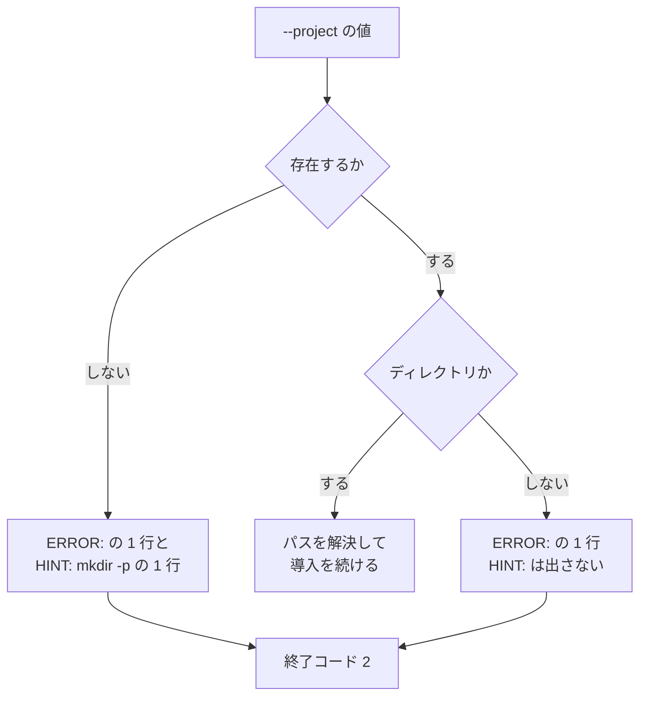

# #415: Kiro のインストーラに導入先の検査を足す

要求と受け入れ条件は [issue-415-requirements.md](issue-415-requirements.md) にある。この文書は
「どう作るか」だけを扱う。

## 構成要素

| 要素 | 責務 |
| --- | --- |
| `--project` の分岐（`plugins/ndf/dev.kiro/install.sh`） | 値を受け取り、存在することとディレクトリであることを確かめてから解決する |
| `scripts/tests/test_kiro_installer_project.py` | 誤った値に対する出力・終了コードと、正しい値での通過を固定する |

**新しい関数を作らない。** 検査は 1 箇所で、他の選択肢の分岐と同じ形（`[ 条件 ] || { echo
"ERROR: ..." >&2; exit 2; }`）を 2 つ並べれば書ける。

## 処理の流れ



## 出力の形

既存の案内と同じく、`ERROR:` で始まる行を標準エラーへ出す。**存在しないパスにだけ、作り方を
添える行を 1 行足す。**

存在しないパスを渡した場合。

```text
ERROR: --project points at a path that does not exist: /nonexistent-xyz
HINT: mkdir -p /nonexistent-xyz
```

ディレクトリではないパス（ファイル）を渡した場合。

```text
ERROR: --project points at a path that is not a directory: /tmp/example/afile
```

**2 つの文言を分けるのは、片方の案内がもう片方では成り立たないためである。** ファイルに対して
`mkdir -p` はそのパスが既にあるとして失敗する（実測）。1 つの文言にまとめると、存在している
パスを「does not exist」と述べたうえで、実行すると失敗する手順を案内することになる。

**`HINT:` の行のパスは、シェルの語 1 つとして読める形へ整える。** 受け取った値をそのまま
埋め込むと、空白を含むパスが 2 つの語に割れる。案内どおりに打っても、意図した導入先は作られない。

```console
$ pwd
/tmp
$ mkdir -p /tmp/qdemo/my project
$ ls -1 /tmp/qdemo
my
$ ls -d /tmp/project
/tmp/project
```

`/tmp/qdemo/my` と、現在地の下の `project` の 2 つが作られ、`/tmp/qdemo/my project` はどこにも
残らない（実測）。整形は `printf '%q'` で行う。**`ERROR:` の行のパスは整形しない。** こちらは
止まった理由を述べる文であって、利用者が打つ語ではない。

```text
ERROR: --project points at a path that does not exist: /tmp/qdemo/my project
HINT: mkdir -p /tmp/qdemo/my\ project
```

**英語で書く。** 既存の `--project requires a path` / `unknown option` と同じ言語にする。
このスクリプトの案内には日本語の行（`--scope global には HOME が必要です`）も混ざるが、
`--project` に関わる案内は英語で揃っている。

## 決定の記録

### 決定 1: 存在しない導入先を作らない

作る側に倒すと、綴りを誤った利用者が誤った場所へ導入したことに気づけない。導入は最初の操作で
あるため、この時点で止めるほうが取り返しがつく。案内へ `mkdir -p` を書けば、意図した場所で
あれば 1 手で先へ進める。

### 決定 2: ディレクトリではないパスは、別の文言で止める

`cd` はファイルに対しても失敗する（`Not a directory`）。存在するかどうかだけを見ると、
ファイルを渡したときに現在の状態（`cd` の裸のエラー）が残る。判定は `[ -e "$2" ]` と
`[ -d "$2" ]` の 2 つに分け、**どちらで落ちたかで文言を変える**。1 つの判定にまとめると、
「出力の形」に書いた誤りが出る。

### 決定 3: 終了コードは 2 にする

このスクリプトは入力の誤りに 2、実行の前提が欠けていることに 1 を使い分けている。導入先の
指定は入力であるため 2 を採る。**現在の 1 は `cd` が返した値であって、割り当てた値ではない。**

### 決定 4: 案内の行に `HINT:` を足す

このスクリプトの語彙は `ERROR:` と `WARN:` の 2 つで、作り方を添える行に当たる接頭辞が無い。
3 つ目を足すか、`ERROR:` の行に続けて接頭辞なしで書くかのどちらかになる。**接頭辞を足す側を
採る。** `ERROR:` は止まった理由を述べる行で、作り方は利用者が次に打つ手であるため、同じ
接頭辞にすると 2 行の役割が読み分けられない。接頭辞なしの行は、シェルが出す裸の出力と
見分けがつかない。要求側の受け入れ条件が `HINT: mkdir -p <パス>` の形を固定するため、
実装で任意にはならない。

### 決定 5: 検査は選択肢を解析する時点に置く

値を受け取る分岐（`--project`）がパスを解決しているため、検査もそこへ置く。`--scope` の解決は
この後にあり、**`--scope global` と併用した場合も検査が先に働く**。

併用の現在の振る舞いは、渡したパスによって分かれる（実測）。

| 併用した値 | 現在 | 変更後 |
| --- | --- | --- |
| 存在しないパス | `cd` のエラー、終了コード 1。`WARN:` は出ない | `ERROR:` と `HINT:` の 2 行、終了コード 2 |
| 存在するディレクトリ | `WARN:` を出して `--project` を無視し、導入が進む | 変わらない |

**警告を先に出す側へは倒さない。** `--scope` の解決まで検査を遅らせると、値を受け取る分岐と
確かめる分岐が離れ、`--project` を読む箇所が 2 つになる。誤った値を渡したことは、無視される
場合でも利用者に伝わるほうがよい。

### 決定 6: 案内のパスの整形に `printf '%q'` を使う

単引用符で囲む案（`mkdir -p '<パス>'`）は、パスに単引用符が含まれると囲みが閉じてしまう。
`printf '%q'` は bash が自分で読み戻せる形を返し、次のいずれも 1 つの語として通る（実測）。

| 渡した値 | `printf '%q'` の出力 |
| --- | --- |
| `/tmp/qtest2/my project` | `/tmp/qtest2/my\ project` |
| `/tmp/qtest2/it's here` | `/tmp/qtest2/it\'s\ here` |
| `/tmp/qtest2/a$b` | `/tmp/qtest2/a\$b` |

**案内を読む側のシェルも bash を前提にする。** 制御文字を含むパスでは `$'...'` の形になり、
これは bash と zsh が解釈する書式である。このスクリプト自身が `#!/usr/bin/env bash` で動き、
案内も `bash plugins/ndf/dev.kiro/install.sh ...` の形で載っているため、前提は揃っている。

## テスト設計

`scripts/tests/test_kiro_installer_project.py` に置く。既存の `test_agy_install_hooks.py` と
同じく、`subprocess` でスクリプトを起動して出力と終了コードを見る。

| 受け入れ条件 | 何で確かめるか |
| --- | --- |
| 存在しないパスで止まる | 一時ディレクトリの下の未作成のパスを渡し、終了コード 2 と `ERROR:` の行を見る |
| 作り方が案内に出る | 同じ出力に `HINT: mkdir -p <渡したパス>` が含まれることを見る |
| 空白を含むパスでも案内が通る | 空白を含む未作成のパスを渡し、`HINT:` の行のパスがシェルの語 1 つへ戻ることを見る（`shlex.split` で 1 語になる） |
| ディレクトリではないパスで止まる | 一時ファイルを作って渡し、終了コード 2 と、`not a directory` を述べる `ERROR:` の行を見る |
| ファイルには作り方を案内しない | 同じ出力に `HINT:` の行が現れないことを見る |
| 併用でも同じ形で止まる | `--scope global` と未作成のパスを渡し、終了コード 2 と `ERROR:` / `HINT:` の 2 行を見る |
| シェルの裸のエラーが出ない | 上のすべての出力に `cd:` が現れないことを見る |
| 正しい値では変わらない | 一時ディレクトリを渡し、`--dry-run --yes` で終了コード 0 を見る |

**出力の文言まで見るのは、終了コードだけでは 2 つの誤りを区別できないためである。** どちらも
2 で終わるため、ファイルに対して存在しない旨の文言が出ていても検査が通ってしまう。

**`--dry-run` を使うのは、テストが利用者の環境へ書き込まないためである。**

## 未確認のまま残ること

| 項目 | 内容 |
| --- | --- |
| 併用を止めることの影響 | `--scope global` と `--project` を併用する手順が利用者の側に実在するかは確かめていない。リポジトリ内の案内（`README.md` / `AGENTS.md`）にこの併用は無い |
