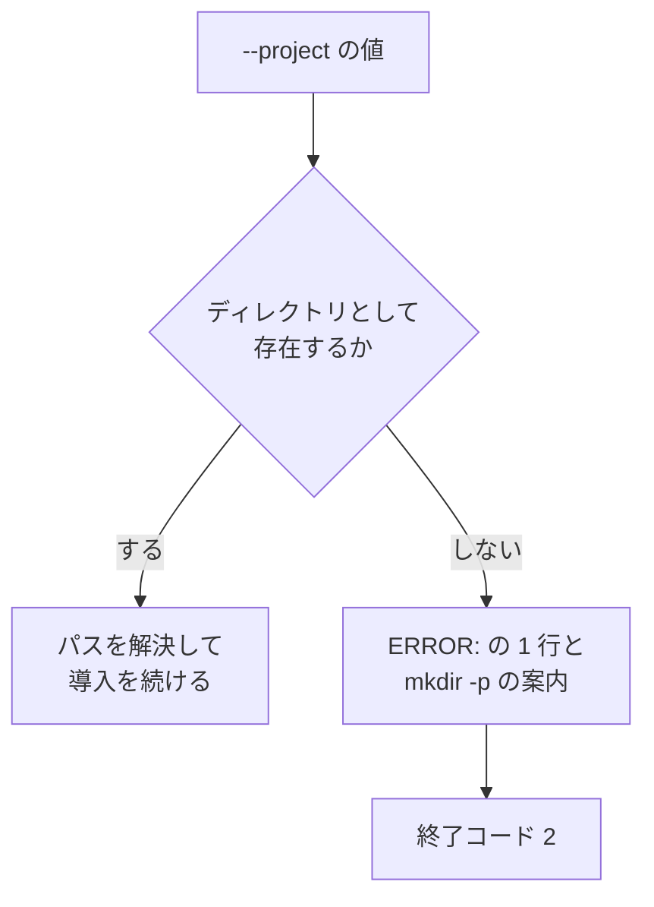

# #415: Kiro のインストーラに導入先の検査を足す

要求と受け入れ条件は [issue-415-requirements.md](issue-415-requirements.md) にある。この文書は
「どう作るか」だけを扱う。

## 構成要素

| 要素 | 責務 |
| --- | --- |
| `--project` の分岐（`plugins/ndf/dev.kiro/install.sh`） | 値を受け取り、ディレクトリとして存在することを確かめてから解決する |
| `scripts/tests/test_kiro_installer_project.py` | 誤った値に対する出力・終了コードと、正しい値での通過を固定する |

**新しい関数を作らない。** 検査は 1 箇所で、他の選択肢の分岐と同じ形（`[ 条件 ] || { echo
"ERROR: ..." >&2; exit 2; }`）で書ける。

## 処理の流れ



## 出力の形

既存の案内と同じく、`ERROR:` で始まる行を標準エラーへ出す。**作り方を添える行を 1 行足す。**

```text
ERROR: --project points at a path that does not exist: /nonexistent-xyz
HINT: mkdir -p /nonexistent-xyz
```

**英語で書く。** 既存の `--project requires a path` / `unknown option` と同じ言語にする。
このスクリプトの案内には日本語の行（`--scope global には HOME が必要です`）も混ざるが、
`--project` に関わる案内は英語で揃っている。

## 決定の記録

### 決定 1: 存在しない導入先を作らない

作る側に倒すと、綴りを誤った利用者が誤った場所へ導入したことに気づけない。導入は最初の操作で
あるため、この時点で止めるほうが取り返しがつく。案内へ `mkdir -p` を書けば、意図した場所で
あれば 1 手で先へ進める。

### 決定 2: ディレクトリではないパスも同じ扱いにする

`cd` はファイルに対しても失敗する。存在するかどうかだけを見ると、ファイルを渡したときに
現在の状態（`cd` の裸のエラー）が残る。判定は `[ -d "$2" ]` の 1 つで両方を覆う。

### 決定 3: 終了コードは 2 にする

このスクリプトは入力の誤りに 2、実行の前提が欠けていることに 1 を使い分けている。導入先の
指定は入力であるため 2 を採る。**現在の 1 は `cd` が返した値であって、割り当てた値ではない。**

## テスト設計

`scripts/tests/test_kiro_installer_project.py` に置く。既存の `test_agy_install_hooks.py` と
同じく、`subprocess` でスクリプトを起動して出力と終了コードを見る。

| 受け入れ条件 | 何で確かめるか |
| --- | --- |
| 存在しないパスで止まる | 一時ディレクトリの下の未作成のパスを渡し、終了コード 2 と `ERROR:` の行を見る |
| 作り方が案内に出る | 同じ出力に `mkdir -p <渡したパス>` が含まれることを見る |
| ディレクトリではないパスで止まる | 一時ファイルを作って渡し、終了コード 2 を見る |
| シェルの裸のエラーが出ない | 出力に `cd:` が現れないことを見る |
| 正しい値では変わらない | 一時ディレクトリを渡し、`--dry-run --yes` で終了コード 0 を見る |

**`--dry-run` を使うのは、テストが利用者の環境へ書き込まないためである。**

## 未確認のまま残ること

| 項目 | 内容 |
| --- | --- |
| `--scope global` との併用 | 現在は警告を出して `--project` を無視する。この変更では、存在しないパスを渡した場合に警告より先に止まる |
