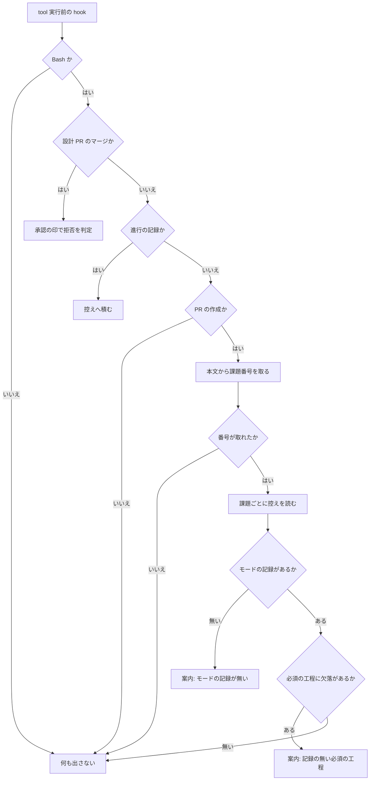

# 工程の抜けを塞ぎ、事後レビューの指摘を直す（#418 / #417）

## 依頼（原文のまま）

> 全体的に cross-reviewやcross-refactoringやってなくないですか？

> あと、gateでモードごとの実行証跡が残っているかをチェックする再発防止策も追加

> lightもprをだす以上cross-reviewは実施した方がよさそうです

## 解釈

3 つの依頼を、次の 3 つの変更として読む。

| 依頼 | 読み取った要求 |
| --- | --- |
| 1 つ目 | 落とした `cross-review` を事後に行い、出た指摘を直す（#417） |
| 2 つ目 | 判定したモードに対する実行証跡が残っているかを、機械が見る（#418 の C） |
| 3 つ目 | `light` にもレビュー工程を課す（#418 の A） |

**`cross-refactoring` は落ちていない。** 工程表では `architecture` と `legacy-refactor` の
構造改善だけが対象で、v10.5.0 のまとまりにはどちらのモードも無かった。

## 目的

**判定したモードと、実際に通った工程の食い違いが、機械で見えるようにする。**
あわせて Pull Request を出す変更が必ずレビューを通るようにし、事後レビューで出た
8 件を直す。

## 前提

- **拒否はしない。** #221 が定めた「記録の無い工程は拒否しない」を変えない。案内
  （`additionalContext`）で出す。記録の側が遅れているだけの状態でマージが止まると、
  正当な操作が止まる
- **`light` のレビューは `cross-review` にする。** 単独 AI の `pr-review` ではなく、
  `standard` と同じ収束ループにする。理由は「レビューの深さをモードで変える根拠が無い」
  ことである。差分の小ささはレビューの回数（ラウンド）で自然に吸収される
- 束ねるときのモードは**束の中で最も高いものを採る**。低い側へ倒すと、今回と同じ
  引きずられ方が再発する
- 前提が誤っていた場合の影響は局所的である（工程表と gate の案内の文言）

## 成功条件（受け入れ条件）

### A. `light` にレビュー工程を課す

- [ ] A1: `development-workflow/SKILL.md` の工程表で、`light` の「レビュー」が
      `cross-review` になっている
- [ ] A2: `WF_STAGE_MATRIX` の「レビュー」の `light` 列が `R` になっている
- [ ] A3: `tests/test_workflow_stage_matrix.py` が終了コード 0 で通る
      （工程表と行列のズレを機械が止める）
- [ ] A4: 標準フローの mermaid 図で、`light` の経路がレビューを通る
- [ ] A5: `references/workflow-modes.md` の `light` の経路の記述が A4 と一致する
- [ ] A6: `stage-check.sh report <番号>` が `light` のとき「レビュー」を必須として扱う
      （記録が無ければ `記録なし:` に現れる）

### B. 束ねるときのモードを定める

- [ ] B1: `development-workflow/SKILL.md` に「複数の課題を 1 本の Pull Request へ束ねる
      ときは、束の中で最も高いモードを採る」と書かれている
- [ ] B2: モードの高さの順序（`light` < `standard` < `legacy-refactor` < `architecture`）が
      本文に書かれている
- [ ] B3: 束ねずに分ける判断の基準（触るファイルが重ならないなら分けてよい）が書かれている

### C. gate がモードごとの実行証跡を見る

- [ ] C1: `gh pr create` を tool 実行前の hook が観測する
- [ ] C2: 本文の閉じる語（`Closes #N` 等）から課題番号を取り出す。取り出せないときは
      何も出さずに通す
- [ ] C3: 課題にモードの記録が無いとき、案内へ「モードの記録が無い」と出す
- [ ] C4: モードの記録があり、必須の工程に記録の無いものがあるとき、案内へその一覧を出す
- [ ] C5: どの場合も**拒否しない**（`permissionDecision` を出さない）
- [ ] C6: `gh` / `jq` が無い、番号を取れない、控えが読めないときは何も出さずに通す
- [ ] C7: hook の判定が 10 秒以内に終わる（既存の制限時間を超えない）
- [ ] C8: 今回の失敗が再現できる。`standard` を記録した課題を閉じる `gh pr create` に対し、
      必須の工程の欠落が案内に出る

### D. 事後レビューの指摘 8 件（#417）

- [ ] D1: `git ls-files -z` を使い、非 ASCII のファイル名を含む文書が検査される
- [ ] D2: 除外の後に対象が 0 件のとき、終了コード 2 で失敗する
- [ ] D3: `--plugin-dir` の相対パスが絶対パスへ解決される
- [ ] D4: 導入先に空白やシェルの特殊文字が含まれても、保存された command が
      `bash -c` で実行できる
- [ ] D5: `notion-writing/SKILL.md` のバッククォートが対になっている
- [ ] D6: `EXEMPT` に載っているファイルが存在しないとき、終了コード 1 で失敗する
- [ ] D7: `_drive_auth.py` のメッセージが配布後の前提と一致し、`_CANDIDATES` に agy の
      パスが入っている
- [ ] D8: `--uninstall` が消すのは配布する `hooks.json` が持つ名前だけである
- [ ] D9: `hooks.json` の書き込みが一時ファイル経由の置き換えで行われる
- [ ] D10: スモークの assertion がパイプを使わない形になっている

## 検証手段

| 条件 | 手段 |
| --- | --- |
| A1〜A5, B1〜B3 | `uv run --with pytest pytest plugins/ndf/skills/development-workflow/tests -q` |
| A6, C1〜C8 | 新しく足すテスト（`plugins/ndf/skills/development-workflow/tests/`） |
| D1〜D2, D6 | `uv run --with pytest pytest scripts/tests/test_doc_line_limit.py -q` |
| D3〜D4, D8〜D9 | `uv run --with pytest pytest scripts/tests/test_agy_install_hooks.py -q` |
| D5 | `python3 scripts/check-markdown-links.py --root .` と目視 |
| D7 | `uv run --with pytest pytest plugins/playwright-kit -q` |
| D10 | `bash scripts/runtime-smoke-test.sh --runtime claude --with-secrets=off` |
| 全体 | `uv run --project plugins/playwright-kit/skills/playwright-kit-ops --with pytest pytest . -q` |

**合否は終了コードで見る**（v10.5.0 で `quality-gates` へ入れた規則）。

## 対象範囲

### 含む

- `plugins/ndf/skills/development-workflow/`（`SKILL.md` / `scripts/` / `references/` / `tests/`）
- `scripts/check-doc-line-limit.py` と そのテスト
- `plugins/ndf/dev.agy/install-hooks.sh` と そのテスト
- `plugins/ndf/skills/notion-writing/SKILL.md`
- `plugins/playwright-kit/skills/playwright-kit-ops/scripts/_drive_auth.py`
- `tests/runtime-smoke/assertions/`

### 含まない

- **`cross-review` / `cross-refactoring` の実装そのもの。** 工程表がどちらを呼ぶかを
  変えるだけで、収束ループの中身は触らない
- **拒否（`permissionDecision: deny`）の範囲を広げること。** 設計 Pull Request の
  マージ以外は案内にとどめる
- **モードの判定基準そのもの。** 4 つのモードの定義は変えない
- 盤面（GitHub Projects）の値の一覧。工程名は増えない
- v10.5.0 で配布済みの版数の巻き戻し

## 境界

```text
常に行う         … 既存テストの実行、工程表と行列の同時更新、終了コードの記録
確認してから行う  … 工程表の列の意味を変えること、hook の拒否の範囲を広げること
行わない         … 依頼範囲外の整形、収束ループの実装変更、モードの定義の変更
```

## 進行

- モード: `standard`
- 起点: #418（工程）/ #417（指摘の修正）

---

# 設計

要求と受け入れ条件はこのファイルの前半にある。この節は「どう作るか」だけを扱う。

**触る領域は「すべての変更」だけである。** 永続データのスキーマは変えず（gate が読む控えの
形は既存のまま）、呼び出される約束も画面も持たない。そのためデータ構造と入出力の契約の節は
作らない。

## 構成要素

| 要素 | 責務 |
| --- | --- |
| `development-workflow/SKILL.md` の工程表 | `light` のレビューを `cross-review` にする。束ねるときのモードの決め方を書く |
| `lib/workflow-common.sh` の `WF_STAGE_MATRIX` | 工程表と同じ分類を機械の側に持つ。`レビュー` の `light` 列を `R` へ |
| `lib/workflow-common.sh` の `wf_parse_pr_create`（新設） | `gh pr create` のコマンドから、本文と閉じる語が指す課題番号を取り出す |
| `lib/workflow-common.sh` の `wf_evidence_report`（新設） | 課題番号の一覧に対し、モードの記録の有無と必須の工程の欠落を 1 つの文字列にまとめる |
| `workflow-guard.sh` | 観測点へ Pull Request の作成を足し、案内を出す。**拒否はしない** |
| `merged/scripts/closing-issues.sh` | 閉じる語の読み取りの正本。gate から呼ぶのではなく、同じ規則を共通層へ写す（後述の決定 3） |
| `scripts/check-doc-line-limit.py` | 非 ASCII のファイル名・実質 0 件・`EXEMPT` の不在を塞ぐ |
| `plugins/ndf/dev.agy/install-hooks.sh` | 相対パスの解決・クォート・削除対象の限定・アトミックな書き込み |

## 処理の流れ



**`G` の分岐は既存の 3 つの後ろに置く。** 前に置くと、進行の記録のコマンドが Pull Request の
作成と誤って一致したときに、記録が積まれなくなる。

## 決定の記録

### 決定 1: `light` のレビューは `cross-review` にする

**Pull Request を出す以上、その差分は誰かがレビューする。** `light` は「本番の振る舞いも
本番コードの構造も変えない」変更だが、**変えないことの確認**が要る。v10.5.0 で `light` として
通した Skill 本文の変更から、事後レビューが 2 件の指摘を出した（#417 の 5 と 7）。

単独 AI の `pr-review` は採らない。レビューの深さをモードで変える根拠が無く、差分の小ささは
ラウンド数で自然に吸収される。**`light` の費用は上がる。** それでも採るのは、費用の増加が
「レビューを通さない」ことの代償より小さいと判断したためである。

### 決定 2: 束ねるときは、束の中で最も高いモードを採る

低い側へ倒すと、今回と同じ引きずられ方が再発する。高い側へ倒すと、`light` の課題にも
`standard` の工程が掛かる。**後者を選ぶ。** 落とした工程は後から取り戻せないが、余分に
通した工程は費用だけで済む。

**分ける判断を先に置く。** 触るファイルが重ならないなら、束ねずにモードごとに分ける。
束ねる理由は競合の回避であり、モードを混ぜたいからではない。

### 決定 3: 閉じる語の読み取りは、共通層へ写す

`merged/scripts/closing-issues.sh` が正本を持つ。**gate からそれを呼ばない。** hook は
`development-workflow` の frontmatter が登録するもので、`merged` を配らない配布先でも
走るためである。同じ規則を `lib/workflow-common.sh` へ写し、**両者が同じ結果を返すことを
テストで固定する**。

写しを持つのは規約に反するが、代替はどちらも成立しない。共通層へ移すと `merged` の側が
`development-workflow` へ依存し、Skill の境界をまたぐ参照が増える（#344 と同じ形）。
gate が読み取りを持たないと、案内そのものが出せない。

### 決定 4: 案内は出すが、拒否はしない

#221 が定めた方針を変えない。**記録が無いことは、工程を通っていないことと同じではない。**
記録の側が遅れているだけの状態で Pull Request の作成が止まると、正当な操作が止まる。

**設計 Pull Request のマージだけが拒否のままである。** そちらは取り消せない操作で、承認の印が
付けば同じコマンドが通る。Pull Request の作成は何度でもやり直せる。

### 決定 5: `check-doc-line-limit.py` は `git ls-files -z` を使う

`core.quotepath` の設定に依存しない。`-c core.quotepath=false` でも同じ結果になるが、
**利用者の設定を上書きする形は避ける**。`-z` は出力の形だけを変え、設定を読まない。

### 決定 6: `install-hooks.sh` は command を組み立て直す

`str.replace("./scripts/", ...)` は置換であって、シェルの語としての正しさを保証しない。
**`bash ./scripts/<名前>` の形だけを対象にし、`shlex.quote` した絶対パスで組み立て直す。**
置換のままクォートを足す案は、command 全体のどこを引用すべきかを決められない。

対象の形に当たらない command は書き換えない。**書き換えられなかったことを出力へ出す**
（黙って相対パスのまま保存すると、正常終了して効かない状態になる）。

## テスト設計

| 受け入れ条件 | 何で確かめるか |
| --- | --- |
| A1〜A3 | `test_workflow_stage_matrix.py`（既存。工程表を読み直して行列と突き合わせる） |
| A4〜A5 | 新しいテスト。mermaid の経路と `workflow-modes.md` の記述に `レビュー` が現れる |
| A6 | 新しいテスト。`light` のモードで `wf_report` の `記録なし:` に `レビュー` が出る |
| B1〜B3 | 新しいテスト。`SKILL.md` に順序の記述と束ねる規定があること |
| C1〜C2 | 新しいテスト。`gh pr create` の本文から番号を取り出す。取れない形では空を返す |
| C3〜C4 | 新しいテスト。控えを作って案内の文字列を突き合わせる |
| C5 | 新しいテスト。出力に `permissionDecision` が含まれない |
| C6 | 新しいテスト。`jq` を PATH から外した環境で何も出さずに終了コード 0 |
| C7 | 新しいテスト。判定が 10 秒以内（既存の hook の制限時間と同じ） |
| C8 | 新しいテスト。v10.5.0 の失敗（`standard` を記録し工程を飛ばす）を再現して案内が出る |
| D1〜D2, D6 | `test_doc_line_limit.py` へ追加（非 ASCII・実質 0 件・`EXEMPT` の不在） |
| D3〜D4, D8〜D9 | `test_agy_install_hooks.py` へ追加（相対パス・空白を含むパス・削除対象・置き換え） |
| D5 | `check-markdown-links.py` と、バッククォートの個数を数えるテスト |
| D7 | `plugins/playwright-kit` のテストへ追加 |
| D10 | スモークの実行（4 ランタイム） |

**D4 は「保存された command が実行できる」ところまで確かめる。** 文字列の一致だけでは、
シェルの語として壊れていることを捕まえられない。

## 未確認のまま残ること

| 項目 | 内容 |
| --- | --- |
| `light` の費用 | `cross-review` を全 Pull Request へ課したときの実行時間と費用を測っていない。次のまとまりで実測する |
| 閉じる語の写し | 共通層と `closing-issues.sh` が同じ結果を返すことはテストで固定するが、**将来 GitHub が構文を変えたときに 2 箇所を直す必要がある**。その負担は受け入れる |
| `gh pr create` 以外の経路 | REST（`gh api .../pulls`）で作る経路は #384 で退避先として書いた。gate がこちらも観測するかは C の実装で決める |
| agy のパスの候補 | `_drive_auth.py` へ足す agy のパスが、agy の将来の配置変更で古くなりうる |
