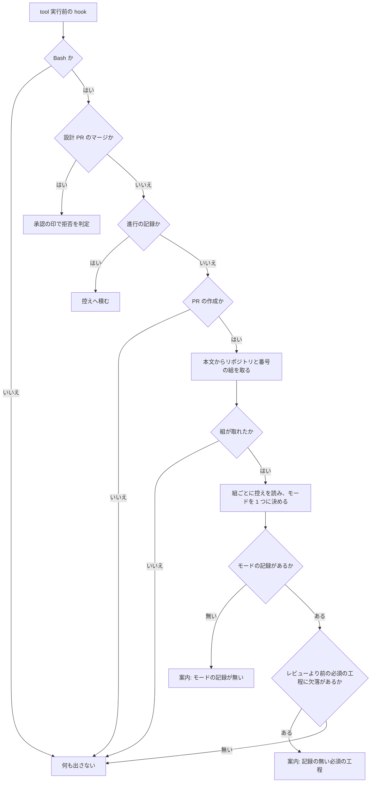

# 工程の抜けを塞ぎ、事後レビューの指摘を直す — 設計

**この記録は 2 本に分かれている。**

- [要求と受け入れ条件](01-requirements.md)
- [設計](02-design.md)

要求と受け入れ条件は [01-requirements.md](01-requirements.md) にある。この文書は「どう作るか」だけを扱う。

**触る領域は「すべての変更」だけである。** 永続データのスキーマは変えず（gate が読む控えの
形も、それを読み書きする CLI の引数も既存のまま。理由は決定 9）、呼び出される約束も画面も
持たない。そのためデータ構造と入出力の契約の節は作らない。**宣言ファイル
（`.ndf/worktree.json`）へは鍵を 1 つ足すが、既存の鍵の意味は変えない**（決定 10）。

## 構成要素

| 要素 | 責務 |
| --- | --- |
| `development-workflow/SKILL.md` の工程表 | `light` のレビューを `cross-review` にする。モードを判定する単位を Pull Request と定め、工程の順序を「要求と受け入れ条件 → モード判定」へ直す。束ねずに分ける判断の基準を書く（束ねたときにどのモードを採るかの規約は置かない） |
| `development-workflow/SKILL.md` の本文 | 人手の承認を求める関門を 2 つ（設計 Pull Request のマージ / 本番のチャネルへ届く操作）と定め、承認の要否をマージ先のチャネルで決めることを書く。本番のチャネルの宣言（`production_branch`）の読み取りと、宣言が無いときの既定を書く。分割・束ね方・並行度は担当の判断に任せること、複数のマイルストーンは原則として順次にすることを書く。`/goal` の引数として呼ばれたときの止まり方を 2 つの関門へ合わせる |
| `lib/workflow-common.sh` の `WF_STAGE_MATRIX` | 工程表と同じ分類を機械の側に持つ。`レビュー` の `light` 列を `R` へ |
| `lib/workflow-common.sh` の `wf_is_candidate` | 走査の前の安い絞り込み。`pr[[:space:]]+create` を足す。ここで落ちると本体へ届かない |
| `lib/workflow-common.sh` の `wf_parse_pr_create`（新設） | `gh pr create` のコマンドから本文を取り、閉じる語が指す `<所有者>/<リポジトリ>` と `<番号>` の組を出す |
| `lib/workflow-common.sh` の `wf_evidence_report`（新設） | リポジトリと番号の組の一覧に対し、モードの記録の有無と、Pull Request の作成の時点で求める必須の工程の欠落を 1 つの文字列にまとめる。複数の課題を閉じるときはモードが 1 つに揃っていることを前提とし、食い違うときだけ最も高いものを採ってその旨を添える |
| `workflow-guard.sh` | 観測点へ Pull Request の作成を足し、案内を出す。**拒否はしない** |
| `<プラグインルート>/scripts/lib/closing-issues.sh` | 閉じる語の読み取りを 1 箇所で持つ。`merged` と gate の両方がここから読む（後述の決定 3）。`merged/scripts/` から移設する |
| `references/approval-request.md` | 提示物を複数の Pull Request へ対応させる。URL は生のまま全て並べる。**関門ごとに節を分け、要否の決まり方の違いを読めるようにする** |
| `references/workflow-modes.md` または新しい参照 | 並行開発への対応（4 つの形・工程の単位・下限 6 つ）を置く。`SKILL.md` の分量を増やしすぎない |
| `.ndf/worktree.json` の `production_branch`（新設） | どのブランチが本番のチャネルかを持つ。承認の要否がここから決まる。既存の `base_branch`（開発の起点）とは別の鍵にする |
| `scripts/check-doc-line-limit.py` | 非 ASCII のファイル名・実質 0 件・`EXEMPT` の不在を塞ぐ |
| `plugins/ndf/dev.agy/install-hooks.sh` | 相対パスの解決・クォート・削除対象の限定・アトミックな書き込み |

## 処理の流れ

**`G` の分岐は既存の 3 つの後ろに置く。** 前に置くと、進行の記録のコマンドが Pull Request の
作成と誤って一致したときに、記録が積まれなくなる。

## 決定の記録

### 決定 1: `light` のレビューは `cross-review` にする

**Pull Request を出す以上、その差分は誰かがレビューする。** `light` は「本番の振る舞いも
本番コードの構造も変えない」変更だが、**変えないことの確認**が要る。v10.5.0 で `light` として
通した Skill 本文の変更から、事後レビューが 2 件の指摘を出した（#417 の 5 と 7）。

単独 AI の `pr-review` は採らない。レビューの深さをモードで変える根拠が無く、差分の小ささは
ラウンド数で自然に吸収される。**`light` の費用は上がる。** それでも採るのは、費用の増加が
「レビューを通さない」ことの代償より小さいと判断したためである。

### 決定 2: モードを判定する単位を Pull Request にする

**束ねたときにどのモードを採るかは、規約では解けない。** v10.5.0 では触るファイルの
重なりで 22 件を 5 本へ束ね、束の中の `standard` 3 件が束全体の進め方に引きずられた。
「最も高いモードを採る」という規約を置く案は、規約を読む人が束の中身を数え直すことを
前提にする。**判定の単位を Pull Request にすれば、数える対象が 1 つになる。**

**代わりに工程の順序が変わる。** Pull Request に何が入るかが決まらないと判定できないため、
`requirements-design` が判定より前に来る。**`light` にも要求と受け入れ条件が掛かる。**
その費用は受け入れる。判定の入力が無いまま判定する状態のほうが高くつく。

採らなかった案は「束ねるときは最も高いモードを採る」である。単位を変えずに規約だけを足すと、
束ね方を変えるたびに同じ判断が要る。

### 決定 2-b: 高さの順序は列の位置から導かない

束ねる規約は置かないが、**モードの高さそのものは残る**（課題ごとの記録が食い違うときの
選び方（C9）と、`stage-check.sh` の報告で使う）。`_wf_mode_column` の戻り値で比較すると、`WF_MODES` の
並び（`light` / `standard` / `architecture` / `legacy-refactor`）がそのまま高さになり、
`architecture` と `legacy-refactor` の高低が入れ替わる。高さは列とは別の並びとして持つ。

**モードの母集合は #421 と #423 で変わる。** 高さを別の並びとして持っておくと、列が
動いても高さの定義を直さずに済む。

### 決定 3: 閉じる語の読み取りは、共通層へ移す

`closing-issues.sh` を `<プラグインルート>/scripts/lib/` へ移し、`merged` と gate の両方が
そこから読む。**写しは持たない。**

`merged` は 4 つの manifest（claude / codex / kiro / agy）すべてに載っており、配らない
配布先は無い。`<プラグインルート>/scripts/lib/` はプラグインルート直下の共通層で、
4 ランタイムのすべてから相対でたどれる。`check-cross-skill-refs.py` が共通化の置き場所として
案内するディレクトリそのものであり、Skill の境界をまたぐ参照にもならない。

読み込みは `. "$DIR/../../../../scripts/lib/<名前>"` の形で行う（v10.1.0 で定めた契約）。
`cd` で解決すると、Skill だけを複製する Kiro CLI の配置で symlink の手前へ戻る。

**採らなかった案: 同じ規則を写して 2 箇所に持つ。** 二重管理になり、GitHub が閉じる語の
構文を変えたときに 2 箇所を直すことになる。同じ結果を返すことをテストで固定しても、
直し忘れた側は次の変更まで残る。

### 決定 4: 案内は出すが、拒否はしない

#221 が定めた方針を変えない。**記録が無いことは、工程を通っていないことと同じではない。**
記録の側が遅れているだけの状態で Pull Request の作成が止まると、正当な操作が止まる。

**設計 Pull Request のマージだけが拒否のままである。** そちらは取り消せない操作で、承認の印が
付けば同じコマンドが通る。Pull Request の作成は何度でもやり直せる。

### 決定 5: `check-doc-line-limit.py` は `git ls-files -z` を使う

`core.quotepath` の設定に依存しない。`-c core.quotepath=false` でも同じ結果になるが、
**利用者の設定を上書きする形は避ける**。`-z` は出力の形だけを変え、設定を読まない。

### 決定 6: `install-hooks.sh` は command を組み立て直す

`str.replace("./scripts/", ...)` は置換であって、シェルの語としての正しさを保証しない。
**`bash ./scripts/<名前>` の形だけを対象にし、`shlex.quote` した絶対パスで組み立て直す。**
置換のままクォートを足す案は、command 全体のどこを引用すべきかを決められない。

対象の形に当たらない command は書き換えない。**書き換えられなかったことを出力へ出す**
（黙って相対パスのまま保存すると、正常終了して効かない状態になる）。

### 決定 7: Pull Request の作成時に求めるのは、レビューより前の必須の工程だけ

検査の終点を、記録済みの最も先の工程（`_wf_frontier`）に置かない。既存の `wf_report` は
配布の工程から呼ぶことを前提にしており、記録がそこまで進んでいないと、その先の工程を
「まだ来ていない」として欠落に数えない。Pull Request を作る時点では常にその状態であるため、
欠落が 1 件も出ない。

終点は工程表が持つ並びで決める。**工程表で `Pull Request` より前にある必須の工程**を
検査の対象にする。

**「レビュー」だけは Pull Request の作成時には求めない。** 工程表では `Pull Request` の
前にあるが、`cross-review` は Pull Request が無いと回せない。求めれば毎回欠落として出て、
案内が読まれなくなる。

### 決定 8: `light` を検査の対象から外さない

**必須の工程が少ないモードほど、通していないことが見えにくい。** `light` は実装・完了判定・
Pull Request・後片付け・配布（本設計でレビューが加わる）だけを必須にする。

**外すと、モードを `light` と申告するだけで検査を回避できる。** 判定の入口を通らずに
進めた変更と、`light` として正しく進めた変更を区別できなくなる。

**記録が 0 件であることも案内の対象にする。** v10.5.0 では進行の記録を一度も書かなかった
ため、gate が一度も走らなかった。記録が無いことは工程を通っていないことと同じではないが、
**どちらであるかを人が確かめる契機にはなる**。断定しない文面で出す。

### 決定 9: 判定の単位は Pull Request にし、控えの鍵は課題のままにする

**判定の時点で Pull Request の番号は無い。** 工程表では `Pull Request` はモード判定より
後にあり、判定は「これから 1 本にまとめる変更」に対して行う。番号を鍵にできるのは
Pull Request を作った後だけで、鍵にすると判定から作成までの記録の置き場所が無くなる。

**「1 つの Pull Request に 1 つのモード」は、鍵ではなく値の一致で表す。** 判定した 1 つの
モードを、その Pull Request が閉じる課題すべての控えへ同じ値で書く。gate は閉じる語が
指す課題の控えを読み、値が揃っていることを見る。

そのため次の 4 つはいずれも変わらない。

| 契約 | 現状 | 本設計での扱い |
| --- | --- | --- |
| 控えの名前 | `<所有者>__<リポジトリ>__<課題番号>.json` | 変えない |
| 控えの JSON | `.repo` / `.issue` / `.mode` / `.stages` | 変えない |
| `stage-check.sh` | `record <課題番号> <stage\|mode> <値>` / `report <課題番号>` | 変えない（課題番号が数値であることの検証も残す） |
| `projects-sync.sh` | `<issue番号> <キー> <値>` | 変えない（盤面の項目は課題であり、Pull Request の番号を渡す先が無い） |

**採らなかった案は、控えの鍵を Pull Request へ広げることである。** ファイル名へ種別を足し、
JSON へ種別の鍵を足し、CLI へ Pull Request を指す引数を足すことになる。3 つの契約が同時に
変わるのに対し、得られるのは「モードが 1 つであること」だけで、それは値の一致でも表せる。
**記録が食い違うのは記録の誤りであって、鍵の不足ではない。**

### 決定 10: 承認の関門は 2 つで、増やさない

**設計 Pull Request のマージ**と**本番のチャネルへ届く操作**の 2 つに集約する。
どちらも取り消せない。設計はマージが済んだ時点で実装の前提になり、本番への配布は
反映した瞬間に利用者へ届く。

**実装 Pull Request のマージは、それ自体では関門にしない。** 承認の要否を決めるのは
マージ先のチャネルであり、検証環境や開発版のチャネルへ入れるマージは取り消せる。
`ai-plugins` では `develop` が、Web の系では `qa/*` や `staging` がこれに当たる。

**関門を増やさないのは、増やすほど「承認したこと」の意味が薄れるためである。** 通過の
回数が増えると、内容を読まずに通す動きが入る。採らなかった案は「実装 Pull Request の
マージを 3 つ目の関門にする」で、マージ先を見ずに一律で止めると検証への反映まで止まる。

**本番のチャネルの宣言には `production_branch` を新設する。** 既存の
`.ndf/worktree.json` の `base_branch` は流用しない。`base_branch` は開発の起点であり、
作業ツリーの起点・主ディレクトリの追従先・Pull Request の宛先の検査がこれを読む。
このリポジトリの値は `develop` で、本設計が本番のチャネルと定める `main` とは別の
ブランチである。流用すると、開発版のチャネルへのマージが本番の扱いになる。

**2 つの関門は、要否の決まり方が違う。** 設計 Pull Request のマージは、マージ先が開発の
起点ブランチであっても承認が要る。承認するのは配布の可否ではなく、**この設計で実装へ
進んでよいか**である。マージした時点で設計は実装の前提になり、後から直すと設計文書と
コードの両方を書き直すことになる。この費用はマージ先のチャネルで変わらない。

**チャネルで決まるのは 2 つ目の関門だけである。** 表と規則を並べて書くと、片方に掛かる
規則が両方に掛かって読める。**関門ごとに節を分けて書く。**

### 決定 11: 並行開発の方法は担当の判断に任せる

課題と Pull Request は 1 対 1 にならない（1 : N / N : 1 / N : M）。**4 つすべてに規約を
書くと、書いた規約の数だけ判断が増える。** 分割の粒度も束ね方も、触るファイルの重なり・
依存の順序・レビューの読みやすさで決まるもので、**その場で見えている情報のほうが多い。**

**関門で集約すれば、どう並行させても人が見る点は 2 つに固定される。** 方法が変わっても
関門は動かない。判断の材料は挙げるが、基準にはしない。

**複数のマイルストーンが渡されたときだけは、原則として順次にする。** マイルストーンは
配布の単位であり、並行させるとどの版に何が入るかが確定しない。

### 決定 12: 手法は任せ、下限と関門を固定する

**分割の粒度・束ね方・並行度は担当の判断に任せる。** 課題と Pull Request は 1 対 1 に
ならず、4 つの形（1:1 / 1:N / N:1 / N:M）を取る。**4 つすべてに手法の規約を書くと、
書いた規約の数だけ判断が増える。** 分割の粒度も束ね方も、その場で見えている情報のほうが多い。

**代わりに下限を定める。** 任せることと、何をしてもよいことは別である。v10.5.0 で
`standard` の 3 件が `light` の進め方で通ったのは、束ね方が悪かったからではなく、
**束ねた後にモードを見直す下限が無かった**ためである。下限は 6 つ（F5〜F10）で、
いずれも今回の事故か、その予防に当たる。

**下限のうち機械で見られるものは gate へ載せ、見られないものは手順として書く。**
どちらに振り分けたかを読めるようにする。振り分けを書かないと、手順の側にある下限が
「機械が見ているはず」と読まれる。

採らなかった案は「手法まで規約にする」である。束ね方を変えるたびに規約を読み直すことになり、
規約の数が増えるほど守られなくなる。

## テスト設計

| 受け入れ条件 | 何で確かめるか |
| --- | --- |
| A1〜A3 | `test_workflow_stage_matrix.py`（既存。工程表を読み直して行列と突き合わせる） |
| A4〜A5 | 新しいテスト。mermaid の経路と `workflow-modes.md` の記述に `レビュー` が現れる |
| A6 | 新しいテスト。`light` のモードで `wf_report` の `記録なし:` に `レビュー` が出る |
| B1〜B2, B4 | 新しいテスト。`SKILL.md` が判定の単位を Pull Request と定め、工程の順序で `requirements-design` が判定より前にあること |
| B3 | `test_workflow_stage_matrix.py`（既存）。`light` の「要求と受け入れ条件」が `—` でなくなったことを、工程表と行列の両方で見る |
| B5〜B6 | 新しいテスト。複数の課題を閉じる Pull Request で全課題の控えのモードが揃うこと。控えの名前・JSON の鍵・CLI の引数が変わっていないこと |
| C1〜C2 | 新しいテスト。`gh pr create` の本文からリポジトリと番号の組を取り出す。取れない形では空を返す |
| C3〜C4 | 新しいテスト。控えを作って案内の文字列を突き合わせる。レビューだけが欠落のとき、案内に出ない |
| C5 | 新しいテスト。出力に `permissionDecision` が含まれない |
| C6 | 新しいテスト。`jq` を PATH から外した環境で何も出さずに終了コード 0 |
| C7 | 新しいテスト。判定が 10 秒以内（既存の hook の制限時間と同じ） |
| C8 | 新しいテスト。v10.5.0 の失敗（`standard` を記録し工程を飛ばす）を再現して案内が出る |
| C9 | 新しいテスト。課題ごとのモードの記録が食い違う控えで、最も高いモードを基準に案内が出て、食い違いも案内に現れる |
| C10 | 新しいテスト。別のリポジトリを指す閉じる語で、そのリポジトリの控えを引く。同じ番号の別リポジトリの控えに当たらない |
| C11 | 新しいテスト。`light` の必須の工程を欠いた控えで案内が出る |
| C12 | 新しいテスト。控えが 0 件のときに案内が出る（いまは出ない） |
| C13 | 新しいテスト。案内の文面に、工程を通していないと断定する語が含まれない |
| E1〜E2 | 新しいテスト。`SKILL.md` が関門を 2 つと定め、承認の要否がマージ先で決まると書いていること。`merged` と `pr` の `SKILL.md` から `release` の規則へ辿れること |
| E3〜E4 | 新しいテスト。`production_branch` の宣言から本番のチャネルを読める。`base_branch` を読む経路が入っていない。宣言が無いときは既定ブランチになる |
| E5〜E8 | 新しいテスト。`approval-request.md` が複数の Pull Request の並べ方と、URL を生のまま書く規約を持つこと |
| E9〜E11 | 新しいテスト。`/goal` の止まり方と、方法を縛らない旨と、複数マイルストーンの既定が書かれていること |
| D1〜D2, D6 | `test_doc_line_limit.py` へ追加（非 ASCII・実質 0 件・`EXEMPT` の不在） |
| D3〜D4, D8〜D9 | `test_agy_install_hooks.py` へ追加（相対パス・空白を含むパス・削除対象・置き換え） |
| D5 | `check-markdown-links.py` と、バッククォートの個数を数えるテスト |
| D7 | `plugins/playwright-kit` のテストへ追加 |
| D10 | スモークの実行（4 ランタイム） |

**D4 は「保存された command が実行できる」ところまで確かめる。** 文字列の一致だけでは、
シェルの語として壊れていることを捕まえられない。

## 未確認のまま残ること

| 項目 | 内容 |
| --- | --- |
| `light` の費用 | `cross-review` を全 Pull Request へ課したときの実行時間と費用を測っていない。次のまとまりで実測する |
| `gh pr create` 以外の経路 | REST（`gh api .../pulls`）で作る経路は #384 で退避先として書いた。gate がこちらも観測するかは C の実装で決める |
| agy のパスの候補 | `_drive_auth.py` へ足す agy のパスが、agy の将来の配置変更で古くなりうる |
