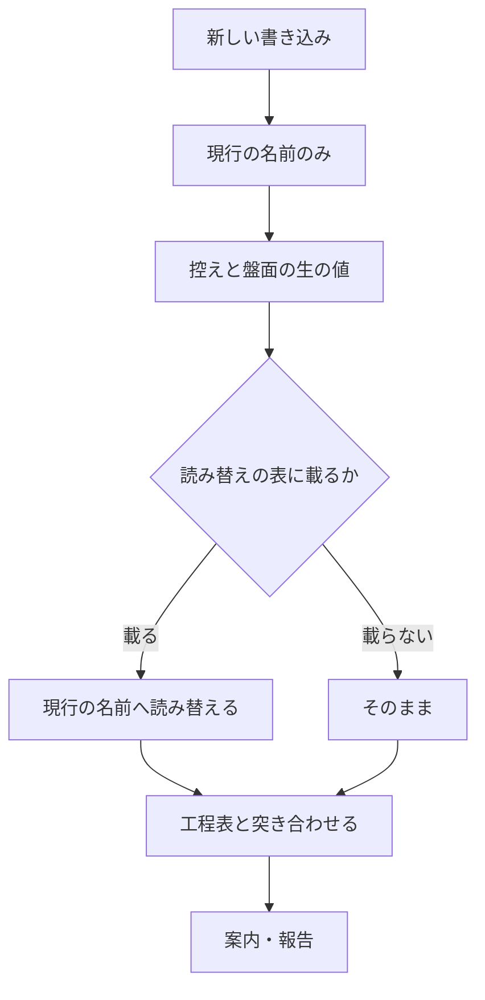

# #421 / #423 / #391: モードの一覧の再編と工程表への追加

要求と受け入れ条件は [01-requirements.md](01-requirements.md) にある。この文書は
「どう作るか」だけを扱う。

## 結論

**モードの一覧と工程表の行を、次の形へ変える。**

| 軸 | 変更前 | 変更後 |
| --- | --- | --- |
| モード（列） | `light` / `standard` / `architecture` / `legacy-refactor` | `light` / `standard` / `legacy-refactor` / `operation` |
| 工程（行） | 15 行 | 16 行（「ドキュメント再構成」を足し、「設計レビュー」を「ドキュメントレビュー」へ、「レビュー」を「実装レビュー」へ改名） |

**旧 `standard` は旧 `architecture` へ統合され、名前だけが `standard` として残る。**
**新 `standard` は旧 `architecture` そのままである。** #421 が求めているのは改名であり、
**改名は工程の中身を変えない。**

| 点 | 旧 `architecture` | 新 `standard` | 根拠 |
| --- | --- | --- | --- |
| 構造改善の手段 | `cross-refactoring` に固定 | 同じ | 決定 1 |
| 確定仕様化・リリース後テスト | 必須（`R`） | 同じ | 決定 2 |
| 周辺 Skill の記述 | `architecture` の名前で書かれている | 語を `standard` へ置き換えるだけ | 決定 12 |

**旧 `standard` の記述は、新 `standard` の記述に置き換えられて消える。**

## 構成要素

| 要素 | 責務 |
| --- | --- |
| `WF_MODES` | モードの一覧。**この文書では `WF_MODES` が持つモード名の全体を指す。** 工程表の列の並びを決める |
| `WF_MODE_HEIGHT` | モードの高さ。上げる方向の判定に使う。**列の位置から導かない** |
| `WF_STAGE_MATRIX` | 工程 × モードの必須・条件付き・対象外 |
| `PJ_STAGES` | 盤面へ書き込む工程の値。工程表の行名と一致させる |
| `document-restructuring`（新設） | 書き上げた文書を章立てから組み直す手順 |
| `references/operation-run.md`（新設） | 運用モードの実行の範囲・保全・失敗時の扱い |

### 2 つの層

**この変更が作るものには 2 つの層がある。** 区別しないと、任意のリポジトリで実行される
本文へこのリポジトリ固有の事情が混ざる。

| 層 | 例 | 対象リポジトリを仮定してよいか |
| --- | --- | --- |
| 配布される Skill の本文（`SKILL.md` と、そこから読ませる `references/` `docs/`） | `document-restructuring` の手順、`operation-run.md` の記録の書き方 | **仮定しない。任意のリポジトリで実行される** |
| NDF 自身の実装と配布 | `WF_MODES` / `WF_STAGE_MATRIX` / 配布一覧の行数 / 版数 | 仮定してよい（このリポジトリ自身の中身） |

**以後の決定は、どちらの層の話かを見て読む。** 上の層には
[「対象リポジトリを仮定しない」の規約](../../plugins/ndf/skills/README.md)（#292）が掛かり、
下の層には掛からない。

## データ構造

**変えるのは値の集まりであって、保存の形ではない。** 控えのファイル形式（`wf_record` が書く
行）も、盤面のフィールドも変わらない。

| 保存先 | 持つ値 | 旧い値の扱い |
| --- | --- | --- |
| 控え（`wf_state_file`） | `mode` と通過した工程名 | 実行のたびに作り直されるため、放置してよい |
| 盤面（GitHub Projects） | `モード` と `進行` の単一選択 | 利用者が値を足し、既存のアイテムを付け替える |
| 課題の本文 | `## 進行` の節（`モード:` の行と工程の一覧） | **移行で書き換える** |

**後方互換の仕組みは持たない。** 旧い名前を新しい名前として読む表を置くと、**その表を
いつ消すかを決める工程が新たに要る**。消す時期を決められないまま残ると、名前が 2 通り
通用する状態が続く。

**改名は同じものの名前が変わっただけである。** 記録の中身は変わらないため、書き換えても
「そのとき何を通ったか」は失われない。

```text
移行:     旧い名前 → 新しい名前（1 度だけ書き換える）
それ以降: 新しい名前だけが通用する
```

### 移行の対象

| 書き換え | 手段 |
| --- | --- |
| `モード: architecture` → `モード: standard` | `## 進行` の節の `モード:` の行 |
| `- [ ] 設計レビュー` → `- [ ] ドキュメントレビュー` | 同じ節の工程の一覧 |
| `- [ ] レビュー` → `- [ ] 実装レビュー` | 同じ節の工程の一覧 |
| `- [ ] ドキュメント再構成` の追加 | 「設計」の次の行へ挿入 |

**`## 進行` の節だけを差し替え、節の外は書き換えない**（v10.3.0 で定めた規約）。

**対象の課題は探して決める。** `## 進行` の節を持つ課題を数え直してから書き換える。
数は変わりうるため、設計では持たない。

**他のリポジトリでも同じ移行が要る。** これは破壊的な変更であり、変更履歴と更新の案内へ
手順を書く。**移行の手段を隠さない。**

**追随が要るリポジトリには課題を立てる。** 変更履歴に書くだけでは、読む機会が来るまで
気づけない。**対象は数え直してから立てる**（記録を持つリポジトリは増減する）。

## 入出力の契約

**変わるのは 3 つの名前の集まりである。** いずれも他の Skill と利用者が読む。

| 契約 | 変更 | 破壊的か |
| --- | --- | --- |
| モード名 | `architecture` を削り、`operation` を足す | **はい** |
| 工程名 | `設計レビュー` → `ドキュメントレビュー`、`レビュー` → `実装レビュー`、`ドキュメント再構成` を追加 | **はい** |
| Skill 名 | `document-restructuring` を追加 | いいえ（追加のみ） |

### 変えない名前

**工程名を改名しても、設計 Pull Request を見分ける印は変えない。**

| 値 | 定義の場所 | この変更で動くか |
| --- | --- | --- |
| `WF_DESIGN_PREFIX='design/'` | `development-workflow/scripts/lib/workflow-common.sh` | 動かさない |
| `WF_APPROVAL_LABEL='design-approved'` | 同上 | 動かさない |

**工程名とブランチ名は別の名前の集まりである。** 工程名は工程表と盤面が読む値で、接頭辞と
ラベルは Pull Request を見分けるための印である。**印はすでに定着している。** `design-approved` は
**ラベルがリポジトリに定義されていること自体が有効化の宣言**であり（v10.0.0）、名前を変えると
定義済みのラベルが宣言として働かなくなる。過去の設計 Pull Request の head も `design/` で
始まっており、改名すると遡って見分けられなくなる。

### モードの一覧と判定の順序

**判定は上から順に見て、最初に該当したものを採る。**

| 順 | モード | 該当条件 |
| --- | --- | --- |
| 1 | `operation` | 本番コードも文書も変えず、**外部の系の状態だけ**を変える |
| 2 | `standard` | 公開インタフェースの追加・変更・削除 / 既存データの移行を伴うスキーマ変更 / 認証・認可の変更 / 複数モジュールにまたがる / 重要なドメインルールの変更 / 本番の振る舞いの追加・変更・バグ修正 / テストが十分にある構造変更 |
| 3 | `legacy-refactor` | 本番の振る舞いを変えず本番コードの構造を変える変更で、対象にテストがない・少ない |
| 4 | `light` | 本番の振る舞いも本番コードの構造も変えない局所変更 |

**`operation` を 1 番に置く。** アクセス権の設定の変更は「誰が何をできるか」を変えるため、
条件だけを見れば `standard` に当たる。しかし設計もテスト駆動も当たらない。**重大さは
工程ではなく、実行前の承認で受ける。**

**判定の根拠に、特定のホスティングの機能名を使わない。** 使うと、その機能を持たない対象では
判定が成り立たない。機能名は例として挙げるにとどめる。

### モードの高さ

**列の位置からは導かない。** 上げる方向の判定にだけ使う。

| モード | 高さ | 上げる例 |
| --- | ---: | --- |
| `light` | 1 | 外部の系を触ると分かった → `operation` |
| `operation` | 2 | コードを触ると分かった → `standard` |
| `legacy-refactor` | 3 | 公開インタフェースが変わると分かった → `standard` |
| `standard` | 4 | — |

### 工程表

| 工程 | `light` | `standard` | `legacy-refactor` | `operation` |
| --- | --- | --- | --- | --- |
| 要求と受け入れ条件 | R | R | - | R |
| 作業場所の用意 | C | R | R | C |
| 設計 | - | R | R | - |
| ドキュメント再構成 | - | R | C | - |
| ドキュメントレビュー | - | R | C | - |
| 計画 | - | R | R | R |
| 実装 | R | R | R | R |
| 構造改善 | - | R | R | - |
| 実装レビュー | R | R | R | R |
| 完了判定 | R | R | R | R |
| Pull Request | R | R | R | R |
| 確定仕様化 | - | R | - | C |
| 後片付け | R | R | R | R |
| 配布 | R | R | R | R |
| リリース後テスト | - | R | R | C |
| 振り返り | - | R | R | C |

R = 必須 / C = 条件付き / - = 対象外

**`operation` の「実装」は実行そのものを指す。** 行名は増やさない。呼ぶのは `tdd-cycle`
ではなく、`references/operation-run.md` が定める手順である。

#### `references/operation-run.md` が定めること

**この参照は配布される Skill の本文であり、対象リポジトリを仮定しない**（「2 つの層」）。
**置き場所も検証の手段も固定せず、探して決める形で書く。**

| 定めること | 書き方 |
| --- | --- |
| 実行の範囲 | 何を実行し、どこまでを 1 単位とするか。単位ごとにコマンド・出力・終了コードを残す |
| 記録の置き場所 | 決定 7 の候補の一覧から、対象リポジトリに実在するものを採る。見つからないときの振る舞いも書く |
| 反映の確かめ方 | 検証の手段を名指ししない。対象の系が持つ照会の手段を探して決め、無ければ「確かめられない」と記録に残す |
| 失敗時の扱い | 決定 8。止める位置と、戻し方の有無を書く |
| 取り消せない操作 | 実行の前に、取り消せないことと影響の範囲を書く |

#### `operation` 列のセルの根拠

**条件付き（`C`）は、発動する条件を書かなければ「いつ通るか」が読み手ごとに変わる。**

| 工程 | 分類 | 発動条件、または必須である理由 |
| --- | --- | --- |
| 作業場所の用意 | C | 書く先が、宣言（`.ndf/worktree.json` の `guard.allow_paths`）が主ディレクトリで編集してよいと定めるパスに収まるなら主ディレクトリでよい（`light` と同じ条件）。宣言が無いリポジトリでは作業ツリーを用意する。実行に伴って Skill の本文やスクリプトを触るときも作業ツリーを用意する |
| 確定仕様化 | C | 実行で決まった設定が、**以後の判断の前提になるとき**（例: 保護の規則をどう組んだか）。1 回きりの操作で次の判断が変わらないなら通さない |
| リリース後テスト | C | 反映の結果を、**実行した経路とは別の経路で確かめられるとき**（例: 直接 push が実際に拒まれるか）。外部の系の応答だけで完結し、確かめる手段が実行そのものと同じなら通さない |
| 振り返り | C | **実行の手順そのものを変えたとき**。設定値を 1 つ変えただけなら通さない |
| 配布 | R | **配布の要否を決めるのは変更の中身であってモードではない**（v9.5.0 が 4 モードとも必須にした理由）。配るものが無ければ `release` 自身が飛ばすため、必須にしても空振りする工程は増えない |

**判定が見るのは変更の目的物であって、工程が生む記録ではない。** 決定 5 の「本番コードも
文書も変えず」は、変更しようとしている対象を指す。実行の記録・確定仕様・振り返りは工程の
産物であり、これらを書くことで `operation` の条件を外れることはない。

#### `legacy-refactor` 列の新しい 2 セルの根拠

**行を足し改名する 2 つのセルにも、同じ理由で発動条件が要る。** この 2 つは同じ条件で
同時に発動し、片方だけが通ることはない。

| 工程 | 分類 | 発動条件 |
| --- | --- | --- |
| ドキュメント再構成 | C | **設計 Pull Request を分けたとき** |
| ドキュメントレビュー | C | 同上 |

**条件は既存の記述をそのまま引き継ぐ。** `SKILL.md` は関門の節で「`legacy-refactor` は
設計 Pull Request を分けたときだけ同じ扱いにする」と定めている。**改名で条件は変えない。**
分けたなら設計は単独で読まれるため、章立ての組み直しとレビューが要る。実装の差分と同じ
Pull Request の中で読まれる文書には、どちらも通さない。

**現行の `設計レビュー` は、機械の値と本文が食い違っている。** `WF_STAGE_MATRIX` は
`legacy-refactor` に `C` を持つのに対し、`SKILL.md` の表は「任意」と書く。**「任意」は
条件ではない。** 実装ではこの食い違いも解き、本文を上の条件へ揃える。

### 構造改善の手段

**モードが決める。** 一覧が変わっても、手段の決まり方は変えない。

| モード | 手段 |
| --- | --- |
| `standard` | `cross-refactoring` |
| `legacy-refactor` | `cross-refactoring` |
| `light` / `operation` | 工程そのものが対象外 |

**新 `standard` が `cross-refactoring` なのは、旧 `architecture` がそうだったためである。**
`legacy-refactor` も変わらない（振る舞い不変を示す手段が乏しく、複数の見方が要る）。
**旧 `standard` の `refactoring` は、一覧から消えるモードの記述として消える。**

### 人手の承認を求める関門

**関門は 2 つのまま増やさない。** 2 つ目の名前を広げて、運用モードの実行を含める。

| 関門 | いつ | 要否の決まり方 |
| --- | --- | --- |
| 設計 Pull Request のマージ | ドキュメントレビューの工程 | マージ先のチャネルによらず要る |
| **本番の系へ届く操作** | 配布の工程、および `operation` の実装の工程 | 届く先が本番の系かどうかで決まる |

**配布は「本番の系へ届く操作」の一例である。** 運用モードの実行も同じ性質を持つ。
反映した瞬間に効き、取り消しても「その状態を見た人」は戻らない。**性質が同じものを
別の関門として数えない。**

## 処理の流れ



## 決定の記録

### 1. 新 `standard` の構造改善は `cross-refactoring` に規定する

**結論**: 旧 `architecture` と同じく `cross-refactoring` を通す。`legacy-refactor` も
`cross-refactoring` のままである。

**理由**: #421 が求めているのは、現 `standard` を廃し現 `architecture` を `standard` へ
**改名する**ことである。**改名は工程の中身を変えない。** v10.3.0 が `architecture` を
`cross-refactoring` にした根拠（変更の影響が広く、一人の見方では足りない）は、名前が
変わっても失われない。**統合を口実に手段を緩めると、名前の付け替えが工程の緩和にすり替わる。**

**採らなかった案**: モードで決めず既定を `refactoring` にする（改名ではなく工程の緩和に
なる）。全件 `refactoring`（v10.3.0 の判断を根拠なく覆す）。

### 2. 確定仕様化とリリース後テストは必須（`R`）にする

**結論**: 旧 `architecture` と同じく、どちらも必須にする。

**理由**: 決定 1 と同じ論法である。旧 `architecture` がこれらを必須にしていたのは、公開
インタフェースが変わる以上仕様は必ず変わり、確かめることも必ず残るためである。**改名で
この根拠は変わらない。** 旧 `standard` の条件付き（`C`）は、一覧から消えるモードの記述と
して消える。

**採らなかった案**: 条件付きのまま残す（旧 `standard` の値を新 `standard` へ持ち込むことに
なり、改名にならない）。

### 3. 後方互換の仕組みを持たず、移行で書き換える

**結論**: 旧い名前を新しい名前として読む表（`WF_MODE_ALIASES` / `WF_STAGE_ALIASES`）は
作らない。記録済みの値は移行で 1 度だけ書き換える。

**理由**: **読み替えの表は、いつ消すかを決める工程を新たに必要とする。** 消す時期を
決められないまま残ると、名前が 2 通り通用する状態が続き、どちらで書くかの判断が毎回要る。
**改名は同じものの名前が変わっただけであり、書き換えても記録の中身は失われない。**
書き換える対象は数えられる範囲にあり、表を保ち続ける費用のほうが大きい。

**採らなかった案**: 読み替えの表を持つ（消す工程が要る）。読めない値として扱う
（正当な過去の記録で案内が出る）。

### 4. 運用モードの名前は `operation`

**結論**: `operation`。

**理由**: 他のモード名は英語である。`ops` は略語であり、`markdown-writing` のルール 1
（読み手の知らない語を使わない）に当たる。

**採らなかった案**: `ops`（略語）。`運用`（一覧の中で 1 つだけ日本語になる）。

### 5. 「コードを触らない」を拡張子では判定しない

**結論**: 判定は変更の性質で行う。「本番コードも文書も変えず、外部の系の状態だけを変える」。

**理由**: 拡張子の一覧は言語ごとに増える。対象リポジトリを仮定しない規約（#292）に反する。
他のモードの判定も機械では見ておらず、ここだけ機械の判定を持つ理由が無い。

**採らなかった案**: 差分の拡張子で判定する。

### 6. 関門は増やさず、2 つ目の名前を広げる

**結論**: 「本番のチャネルへ届く操作」を「本番の系へ届く操作」とし、配布と運用の実行の
両方を含める。

**理由**: v10.5.1 は「関門は 2 つで、増やさない。増やすほど承認したことの意味が薄れる」と
定めた。運用モードの実行は配布と**同じ性質**を持つ。性質が同じものを別の関門として数えると、
数だけが増える。

**これは名前を広げるだけの変更ではない。要否の判定基準そのものを改める。** v10.5.1 の
確定仕様（[../../docs/specifications/ndf-workflow-unit-and-gates.md](../../docs/specifications/ndf-workflow-unit-and-gates.md)）は
関門 2 の要否を「**マージ先のチャネルが決める**」と定めている。**`operation` の実行は
マージ経路を持たないため、この基準では判定できない**（マージ先が無い）。

| 版 | 関門 2 の名前 | 要否の決まり方 |
| --- | --- | --- |
| v10.5.1 | 本番のチャネルへ届く操作 | マージ先のチャネルが決める |
| v10.5.2 | 本番の系へ届く操作 | 届く先が本番の系かどうかで決まる |

**チャネルは系の一種である。** 配布の工程では両者の判定は一致する（マージ先が本番の
チャネルなら、届く先は本番の系である）。既存の判定が変わらないため、v10.5.1 が「関門ごとに
節を分けて書く」とした前提も保たれる（要否の決まり方は 2 つの関門で依然として違う）。

**確定仕様の側も同じ版で更新する**（受け入れ条件 D8）。用語表の「本番のチャネル」は残し、
「本番の系」を足す。**片方だけを直すと、確定仕様と Skill の本文が別の基準を述べる。**

**採らなかった案**: 3 つ目の関門を足す（v10.5.1 の決定を根拠なく覆す）。名前だけ広げて
要否の基準は据え置く（`operation` の実行が判定できないまま残る）。

### 7. 実行の記録をリポジトリの中のファイルへ書き、Pull Request の差分として載せる

**結論**: 実行の記録をリポジトリの中のファイルへ書く。**置き場所は対象リポジトリから探して
決める。**

**理由**: 運用モードでも Pull Request は必須である。**実行の記録そのものが差分になる。**
記録はその時の出来事であって、リポジトリ知識ではない。**知識の置き場所とは分ける。**

**候補は順序ではなく一覧で示す。** 順序を固定すると、上位の候補を持たないリポジトリで下位を
取り逃がす。対象リポジトリに実在するものを採る。

| 候補 |
| --- |
| 変更の記録を置いているディレクトリ |
| 課題や計画を置いているディレクトリ |
| 運用手順を置いているディレクトリ |

**どれも見つからないときは、リポジトリの根へ記録用のディレクトリを作り、その旨を完了報告へ
残す。** 候補が無いことを理由に記録を省かない。記録が無ければ差分が空になり、Pull Request を
作れない。

**このリポジトリでは `issues/` が 2 番目の候補に当たる。** これは一例であって、他のリポジトリ
で `issues/` を探させる根拠にはしない。

**採らなかった案**: Pull Request のコメント（差分が空になり Pull Request を作れない）。
`issues/` を置き場所として固定する（対象リポジトリを仮定しない規約（#292）に反する）。

### 8. 失敗したら、その時点で止める

**結論**: 実行の単位ごとに終了コードを残し、失敗した時点で残りを実行しない。

**理由**: **部分適用の範囲を確定させるためである。** 失敗を無視して続けると、どこまで
反映されたのかが後から読めない。

**戻し方は `references/operation-run.md` へ委ねる**（Q9 の後半）。決定 8 が定めるのは
「どこまで反映されたか」を残すところまでで、そこから戻すかどうかは操作の性質で変わる。
**取り消せる操作は戻す手順を実行の前に書き、取り消せない操作は戻せないことを実行の前に書く**
（受け入れ条件 B6 / B7）。取り消せない操作を含む実行は、関門 2 の承認がその前提で行われる。

### 9. `document-restructuring` は 4 つの配布一覧すべてへ載せる

**結論**: 4 ランタイムすべてへ配る。

**理由**: 工程表の行になる Skill は、どのランタイムからも起動できる必要がある。載せない
ランタイムでは工程が通らない。

### 10. 列の並びは高さと一致させない

**結論**: `WF_MODES` は `light` / `standard` / `legacy-refactor` / `operation` の順にする。

**理由**: 決定 2-b（v10.5.1）は「モードの高さは列の位置から導かない」と定めた。列を高さ順に
並べると、再び導きたくなる。**`architecture` を除いた位置はそのままにし、`operation` を
末尾へ足す。**

### 11. `operation` で必須にするのは、実行の前後に要る工程だけである

**結論**: 必須 8 / 条件付き 4 / 対象外 4 に分ける（Q6 への答え）。

| 分類 | 工程 |
| --- | --- |
| 必須（`R`） | 要求と受け入れ条件 / 計画 / 実装 / 実装レビュー / 完了判定 / Pull Request / 後片付け / 配布 |
| 条件付き（`C`） | 作業場所の用意 / 確定仕様化 / リリース後テスト / 振り返り |
| 対象外（`-`） | 設計 / ドキュメント再構成 / ドキュメントレビュー / 構造改善 |

**理由**: 工程を 5 つの群に分け、群ごとに分類した。

| 群 | 工程 | 分類 | 根拠 |
| --- | --- | --- | --- |
| 実行の前に固定する | 要求と受け入れ条件 / 計画 | R | 取り消せない操作を含む。先に文字にしないと関門 2 が承認する対象が定まらない |
| 実行そのもの | 実装 | R | この工程が無ければモードが成り立たない |
| 差分として通す | 実装レビュー / 完了判定 / Pull Request / 後片付け / 配布 | R | 実行の記録が差分になる（決定 7）以上、他のモードと同じ経路を通る |
| 産物が構造を持たない | 設計 / ドキュメント再構成 / ドキュメントレビュー / 構造改善 | - | `operation` の産物は外部の系の状態と実行の記録であり、データ構造も入出力の契約も持たない |
| 変更の中身で決まる | 作業場所の用意 / 確定仕様化 / リリース後テスト / 振り返り | C | 発動条件は「`operation` 列のセルの根拠」にある |

**要求と受け入れ条件を必須にするのは、実行前の承認が読むものだからである。** `operation` の
実行は取り消せない操作を含む。**何を実行し、どうなれば成功かを先に文字にしていなければ、
関門 2 で承認する対象が定まらない。** `legacy-refactor` がこの工程を対象外にできるのは、
振る舞いを変えないことが受け入れ条件の代わりになるためで、`operation` には当たらない。

**設計を対象外にするのは、産物が構造を持たないためである。** `operation` の産物は外部の系の
状態と実行の記録であり、データ構造も入出力の契約も持たない。必須にすると、設定値 1 つの
変更に設計文書とドキュメントレビューを課すことになる。

**採らなかった案**: 実装と Pull Request だけを必須にする（承認の材料が Pull Request の本文
しか無くなる）。全工程を必須にする（設定値 1 つの変更に設計を課す）。

### 12. 周辺 Skill は旧 `architecture` の記述をそのまま新 `standard` へ引き継ぐ

**結論**: `architecture` という語を `standard` へ置き換えるだけにする。**条件や必須の別は
変えない。**

| 対象 | 旧 `architecture` の記述 | 統合後の扱い |
| --- | --- | --- |
| `quality-gates/references/definition-of-done.md` | `standard` のすべてに加えて 7 項目を必須 | 7 項目とも必須のまま新 `standard` へ移す |
| `quality-gates/SKILL.md` の段階の表 | `architecture` は 1 → 2 → 3 → 4 | 同じ並びを新 `standard` の行にする |
| `design/SKILL.md` の成果物の表 | `architecture` は独立したファイル | 新 `standard` は独立したファイル |
| `design/references/design-template.md` の図の水準 | システムの文脈（外部との関係）の図は `architecture` で求める | 新 `standard` で求める |
| `refactoring` / `cross-refactoring` の適用の記述 | `architecture` と `legacy-refactor` が `cross-refactoring` | 新 `standard` と `legacy-refactor` が `cross-refactoring`（決定 1） |

**旧 `standard` の記述は置き換えられて消える。** `quality-gates` の `standard` の節と、
`design/SKILL.md` の「仕様と同じファイルの別の節でもよい」がこれに当たる。

**理由**: 決定 1 / 決定 2 と同じである。#421 は改名を求めており、**工程表だけを引き継いで
周辺 Skill の条件を緩めると、両者が別の基準を述べる。** 同じ規則が 2 か所にあると片方だけが
更新される（v10.4.0）。

**採らなかった案**: 必須を条件付きへ移す（改名ではなく工程の緩和になる）。旧 `standard` の
記述を残す（一覧から消えるモードの記述が残り、どちらが効くか読めなくなる）。

### 13. 工程「レビュー」を「実装レビュー」へ改名する

**結論**: 工程名を `レビュー` から `実装レビュー` へ変える。

**理由**: **「ドキュメントレビュー」を置くと、残る「レビュー」が何を指すか読めなくなる。**
改名の前は、レビューの工程が 1 つしかなく、修飾の要らない名前で足りていた。工程が 2 つに
なると、片方だけが対象を名前に持つ形になり、もう一方は対象を持たない。**同じ並びの中で、
一方だけが修飾を持つ状態を残さない。**

**追随する値がある。** `WF_PR_EXEMPT_STAGE` は「Pull Request を作る時点の検査から外す工程」
を工程名で持つため、改名にそのまま従う。**外す理由（`cross-review` は Pull Request が無いと
回せない）は変わらない。**

**確定仕様も同じ版で追随する。**
[`ndf-workflow-unit-and-gates.md`](../../docs/specifications/ndf-workflow-unit-and-gates.md) は
実行証跡の検査の除外規則ほか複数の箇所で工程名「レビュー」を本文から参照する。
`WF_PR_EXEMPT_STAGE` が「実装レビュー」を指すのに確定仕様が「レビュー」を名指しすると、
**同じ規則が 2 か所で食い違う**（受け入れ条件 D9）。

**採らなかった案**: 「レビュー」のまま残す（2 つの工程の名前が非対称になる）。
「コードレビュー」にする（`legacy-refactor` の `pr-review` は差分を見る工程で、対象は
コードに限らない）。

## テスト設計

| 受け入れ条件 | 何で確かめるか |
| --- | --- |
| A1 / A2 / A3 | `test_workflow_stage_matrix.py`（列数とモードの一覧の一致、高さの全要素） |
| A4 | `SKILL.md` の表と `WF_MODES` を突き合わせる既存テスト |
| A5 / A8 | 移行の後に `git grep` と課題の走査で旧い名前が残っていないことを見る |
| A6 | `git grep` による検査（履歴と記録を除く。「実装を 3 本へ分ける」の対象外の表を除く） |
| 変えない名前 | `WF_DESIGN_PREFIX` と `WF_APPROVAL_LABEL` の値を固定するテスト（改名の巻き添えを拾う） |
| B1 / B2 / B3 | `test_workflow_stage_matrix.py`（列の追加、16 行すべてに値） |
| B4 | 関門の節をレビューが読む |
| B5 / B6 / B7 | `references/operation-run.md` をレビューが読む |
| B8 | `check-skill-repo-assumptions.py` と、`references/operation-run.md` をレビューが読む（機械の検査は語の有無しか見ない） |
| C1 | `check-skill-frontmatter.py` と配布一覧の行数 |
| C2 / C3 | 工程名の並びを 4 か所で突き合わせる既存テスト（#231） |
| C4 | `git grep` による検査 |
| C5 〜 C11 | `SKILL.md` をレビューが読む |
| C12 / C14 | 課題の走査（旧い名前を持つ `## 進行` の節が 0 件）と、変更履歴の記述 |
| C13 | 既存テスト（`WF_PR_EXEMPT_STAGE` が工程表の行名に含まれることを見る） |
| D1 〜 D6 | 検査 10 本と `CHANGELOG.md` |
| D7 | `cross-review` の収束 |
| D8 | 確定仕様の関門の節をレビューが読む |
| D9 | `git grep` による検査（確定仕様の本文に現行の工程名としての「レビュー」が残っていない） |
| A7 | `quality-gates` と `design` の記述をレビューが読む（A6 の `git grep` は語が消えたことまでしか見ない。旧 `architecture` の条件がそのまま引き継がれたかは読まないと分からない） |

## 実装を 4 本へ分ける

**列を触る 2 件と行を触る 1 件は、同じファイルを触る。順に進める。**

| 本 | 主題 | 課題 | 主に触るもの |
| --- | --- | --- | --- |
| 1 | モードの一覧の再編 | #421 | `WF_MODES` / `WF_MODE_HEIGHT` / 判定の基準の表 / `architecture` の 59 か所（周辺 Skill は語の置き換えのみ。決定 12） |
| 2 | 運用モードの新設 | #423 | `WF_MODES` の列追加 / `WF_STAGE_MATRIX` / `references/operation-run.md` / 関門の節 / 確定仕様 `ndf-workflow-unit-and-gates.md` の関門 2（決定 6） |
| 3 | ドキュメント再構成 | #391 | 工程表の行追加と改名 2 件（決定 13 を含む） / `PJ_STAGES` / `WF_PR_EXEMPT_STAGE` / 新 Skill / 配布一覧 / 確定仕様 `ndf-workflow-unit-and-gates.md` の工程名の参照（決定 13） |
| 4 | 記録済みの名前の移行 | #421 #391 | 課題の本文の `## 進行` の節 / 盤面の単一選択の値 / 変更履歴と更新の案内へ移行の手順 |

**1 → 2 → 3 → 4 の順に進める。** 移行は最後に行う。**名前が確定してから書き換える**（途中で書き換えると 2 度手間になる）。

**もとの 3 本について、** 1 が列を減らし、2 が列を足し、3 が行を足す。逆順にすると
列の数が 2 度動く。

**機械的な置換で壊れる箇所がある。** 次の 2 つは工程名でもモード名でもないため、置換の
対象から外す。A6 と C4 が数える箇所にも含めない。

| 箇所 | 語 | 対象外である理由 |
| --- | --- | --- |
| `plugins/ndf/skills/README.md` の `effort` の表 | 「設計レビュー系」 | 労力の目安を説明する一般名詞であり、工程名の「設計レビュー」ではない |
| `plugins/ndf/skills/plan-to-spec/SKILL.md` | `docs/architecture/` | 仕様書の置き場所として探すディレクトリ名の候補であり、モード名の `architecture` ではない |

## 未確認のまま残ること

| 項目 | 内容 |
| --- | --- |
| 盤面の単一選択の値 | 新しい工程名と `operation` を足すのは利用者の操作である。このリポジトリの盤面へ足せるかは未確認 |
| 運用モードの実測 | 実際の運用作業へ当てた例がまだ無い。工程の過不足は次の運用作業で見る |
| 再構成の目安の妥当性 | 平均文長 40 字・最長 100 字は 3 本の実測に基づく。他の種類の文書での妥当性は未確認 |
