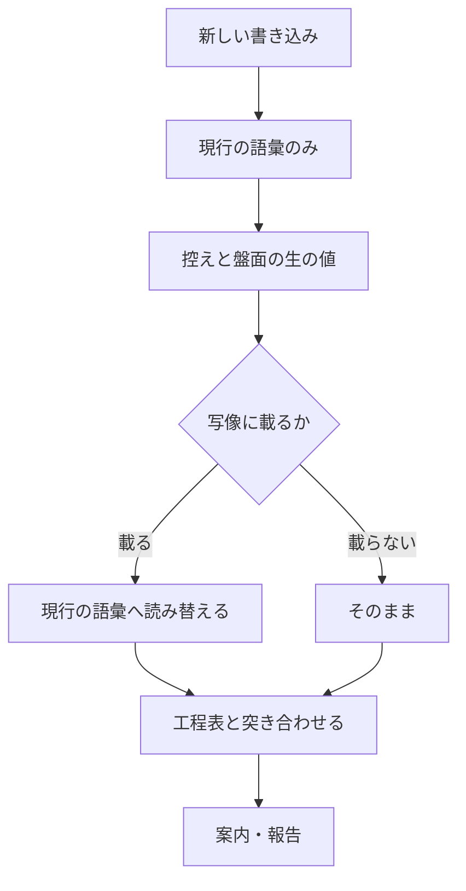

# #421 / #423 / #391: モードの母集合の再編と工程表への追加

要求と受け入れ条件は [01-requirements.md](01-requirements.md) にある。この文書は
「どう作るか」だけを扱う。

## 結論

**モードの母集合と工程表の行を、次の形へ変える。**

| 軸 | 変更前 | 変更後 |
| --- | --- | --- |
| モード（列） | `light` / `standard` / `architecture` / `legacy-refactor` | `light` / `standard` / `legacy-refactor` / `operation` |
| 工程（行） | 15 行 | 16 行（「ドキュメント再構成」を足し、「設計レビュー」を「ドキュメントレビュー」へ、「レビュー」を「実装レビュー」へ改名） |

**旧 `standard` は旧 `architecture` へ統合され、名前だけが `standard` として残る。**
統合後の `standard` は旧 `architecture` の条件を**基とする**が、そのまま写すのではない。
**2 点だけ違う。**

| 点 | 旧 `architecture` | 新 `standard` | 根拠 |
| --- | --- | --- | --- |
| 構造改善の手段 | `cross-refactoring` に固定 | モードで決めず、既定は `refactoring` | 決定 1 |
| 確定仕様化・リリース後テスト | 必須（`R`） | 条件付き（`C`）のまま | 決定 2 |

**この 2 点以外は旧 `architecture` の値をそのまま採る。**

## 構成要素

| 要素 | 責務 |
| --- | --- |
| `WF_MODES` | モードの母集合。工程表の列の並びを決める |
| `WF_MODE_HEIGHT` | モードの高さ。上げる方向の判定に使う。**列の位置から導かない** |
| `WF_MODE_ALIASES`（新設） | 旧いモード名を新しい名前へ読み替える写像 |
| `WF_STAGE_MATRIX` | 工程 × モードの必須・条件付き・対象外 |
| `WF_STAGE_ALIASES`（新設） | 旧い工程名を新しい名前へ読み替える写像 |
| `PJ_STAGES` | 盤面へ書き込む工程の値。工程表の行名と一致させる |
| `document-restructuring`（新設） | 書き上げた文書を章立てから組み直す手順 |
| `references/operation-run.md`（新設） | 運用モードの実行の範囲・保全・失敗時の扱い |

## データ構造

**変えるのは値の語彙であって、保存の形ではない。** 控えのファイル形式（`wf_record` が書く
行）も、盤面のフィールドも変わらない。

| 保存先 | 持つ値 | 旧い値が残る |
| --- | --- | --- |
| 控え（`wf_state_file`） | `mode` と通過した工程名 | 残る |
| 盤面（GitHub Projects） | `モード` と `進行` の単一選択 | 残る |

**旧い値を書き換えない。** 控えは過去の実行の記録であり、書き換えると「そのとき何を通ったか」
が失われる。**読むときだけ写像を当てる。**

```text
読み取り: 生の値 → 写像 → 現行の語彙 → 判定
書き込み: 現行の語彙のみ
```

| 旧い値 | 読み替え先 | 根拠 |
| --- | --- | --- |
| `architecture` | `standard` | 統合先がそのモードである |
| `設計レビュー` | `ドキュメントレビュー` | 同じ工程の改名である |
| `レビュー` | `実装レビュー` | 同じ工程の改名である |

**写像は 1 か所に持つ。** 読み替えを呼び出し側へ散らすと、片方だけが古くなる。

**盤面の単一選択へ新しい値を足すのは、リポジトリの利用者の操作である。** 値が無くても
`projects-sync.sh` は終了コード 0 で終わり、工程は止まる。

## 入出力の契約

**変わるのは 3 つの語彙である。** いずれも他の Skill と利用者が読む。

| 契約 | 変更 | 破壊的か |
| --- | --- | --- |
| モード名 | `architecture` を削り、`operation` を足す | **はい** |
| 工程名 | `設計レビュー` → `ドキュメントレビュー`、`レビュー` → `実装レビュー`、`ドキュメント再構成` を追加 | **はい** |
| Skill 名 | `document-restructuring` を追加 | いいえ（追加のみ） |

### 変えない語彙

**工程名を改名しても、設計 Pull Request を見分ける印は変えない。**

| 値 | 定義の場所 | この変更で動くか |
| --- | --- | --- |
| `WF_DESIGN_PREFIX='design/'` | `development-workflow/scripts/lib/workflow-common.sh` | 動かさない |
| `WF_APPROVAL_LABEL='design-approved'` | 同上 | 動かさない |

**工程名とブランチ名は別の語彙である。** 工程名は工程表と盤面が読む値で、接頭辞とラベルは
Pull Request を見分けるための印である。**印はすでに定着している。** `design-approved` は
**ラベルがリポジトリに定義されていること自体が有効化の宣言**であり（v10.0.0）、名前を変えると
定義済みのラベルが宣言として働かなくなる。過去の設計 Pull Request の head も `design/` で
始まっており、改名すると遡って見分けられなくなる。

### モードの母集合と判定の順序

**判定は上から順に見て、最初に該当したものを採る。**

| 順 | モード | 該当条件 |
| --- | --- | --- |
| 1 | `operation` | 本番コードも文書も変えず、**外部の系の状態だけ**を変える |
| 2 | `standard` | 公開インタフェースの追加・変更・削除 / 既存データの移行を伴うスキーマ変更 / 認証・認可の変更 / 複数モジュールにまたがる / 重要なドメインルールの変更 / 本番の振る舞いの追加・変更・バグ修正 / テストが十分にある構造変更 |
| 3 | `legacy-refactor` | 本番の振る舞いを変えず本番コードの構造を変える変更で、対象にテストがない・少ない |
| 4 | `light` | 本番の振る舞いも本番コードの構造も変えない局所変更 |

**`operation` を 1 番に置く。** ruleset の変更は「誰が何をできるか」を変えるため、
条件だけを見れば `standard` に当たる。しかし設計もテスト駆動も当たらない。**重大さは
工程ではなく、実行前の承認で受ける。**

### モードの高さ

**列の位置からは導かない。** 上げる方向の判定にだけ使う。

| モード | 高さ | 上げる例 |
| --- | ---: | --- |
| `light` | 1 | 外部の系を触ると分かった → `operation` |
| `operation` | 2 | コードを触ると分かった → `standard` |
| `legacy-refactor` | 3 | 公開インタフェースが変わると分かった → `standard` |
| `standard` | 4 | — |

### 工程表

| 工程 | `light` | `standard` | `legacy-refactor` | `operation` |
| --- | --- | --- | --- | --- |
| 要求と受け入れ条件 | R | R | - | R |
| 作業場所の用意 | C | R | R | C |
| 設計 | - | R | R | - |
| ドキュメント再構成 | - | R | C | - |
| ドキュメントレビュー | - | R | C | - |
| 計画 | - | R | R | R |
| 実装 | R | R | R | R |
| 構造改善 | - | R | R | - |
| 実装レビュー | R | R | R | R |
| 完了判定 | R | R | R | R |
| Pull Request | R | R | R | R |
| 確定仕様化 | - | C | - | C |
| 後片付け | R | R | R | R |
| 配布 | R | R | R | R |
| リリース後テスト | - | C | R | C |
| 振り返り | - | R | R | C |

R = 必須 / C = 条件付き / - = 対象外

**`operation` の「実装」は実行そのものを指す。** 行名は増やさない。呼ぶのは `tdd-cycle`
ではなく、`references/operation-run.md` が定める手順である。

#### `operation` 列のセルの根拠

**条件付き（`C`）は、発動する条件を書かなければ「いつ通るか」が読み手ごとに変わる。**

| 工程 | 分類 | 発動条件、または必須である理由 |
| --- | --- | --- |
| 作業場所の用意 | C | 書く先が `issues/` `docs/` と各ランタイムの設定に収まるなら主ディレクトリでよい（`light` と同じ条件）。実行に伴って Skill の本文やスクリプトを触るなら作業ツリーを用意する |
| 確定仕様化 | C | 実行で決まった設定が、**以後の判断の前提になるとき**（例: 保護の規則をどう組んだか）。1 回きりの操作で次の判断が変わらないなら通さない |
| リリース後テスト | C | 反映の結果を、**実行した経路とは別の経路で確かめられるとき**（例: 直接 push が実際に拒まれるか）。外部の系の応答だけで完結し、確かめる手段が実行そのものと同じなら通さない |
| 振り返り | C | **実行の手順そのものを変えたとき**。設定値を 1 つ変えただけなら通さない |
| 配布 | R | **配布の要否を決めるのは変更の中身であってモードではない**（v9.5.0 が 4 モードとも必須にした理由）。配るものが無ければ `release` 自身が飛ばすため、必須にしても空振りする工程は増えない |

**判定が見るのは変更の目的物であって、工程が生む記録ではない。** 決定 5 の「本番コードも
文書も変えず」は、変更しようとしている対象を指す。実行の記録・確定仕様・振り返りは工程の
産物であり、これらを書くことで `operation` の条件を外れることはない。

#### `legacy-refactor` 列の新しい 2 セルの根拠

**行を足し改名する 2 つのセルにも、同じ理由で発動条件が要る。** この 2 つは同じ条件で
同時に発動し、片方だけが通ることはない。

| 工程 | 分類 | 発動条件 |
| --- | --- | --- |
| ドキュメント再構成 | C | `design` の工程で設計文書を**独立したファイル**として作ったとき |
| ドキュメントレビュー | C | 同上。独立したファイルにしたなら、設計 Pull Request として分けて通す |

**判断の基準は決定 12 と同じ「設計 Pull Request として単独で読めるか」である。** 独立した
ファイルにしたということは単独で読まれるということであり、そのときだけ章立ての組み直しと
レビューが要る。実装の差分と同じ Pull Request の中で読まれる文書には、どちらも通さない。

**現行の `設計レビュー` は、機械の値と本文が食い違っている。** `WF_STAGE_MATRIX` は
`legacy-refactor` に `C` を持つのに対し、`SKILL.md` の表は「任意」と書く。**「任意」は
条件ではない。** 実装ではこの食い違いも解き、本文を上の条件へ揃える。

### 構造改善の手段

**モードでは決まらない。** 新 `standard` は公開インタフェースの変更もバグ修正 1 件も含む。
どちらにも 4 つの CLI を動かすと費用に見合わない。

| 手段 | いつ選ぶか |
| --- | --- |
| `refactoring` | 既定 |
| `cross-refactoring` | 変更が複数のモジュールにまたがる、または公開インタフェースの構造そのものを変える |

**選んだ理由を 1 行残す。** 工程は必須のまま変わらない。`legacy-refactor` は
`cross-refactoring` のままである（振る舞い不変を示す手段が乏しく、複数の見方が要る）。

### 人手の承認を求める関門

**関門は 2 つのまま増やさない。** 2 つ目の名前を広げて、運用モードの実行を含める。

| 関門 | いつ | 要否の決まり方 |
| --- | --- | --- |
| 設計 Pull Request のマージ | ドキュメントレビューの工程 | マージ先のチャネルによらず要る |
| **本番の系へ届く操作** | 配布の工程、および `operation` の実装の工程 | 届く先が本番の系かどうかで決まる |

**配布は「本番の系へ届く操作」の一例である。** 運用モードの実行も同じ性質を持つ。
反映した瞬間に効き、取り消しても「その状態を見た人」は戻らない。**性質が同じものを
別の関門として数えない。**

## 処理の流れ



## 決定の記録

### 1. 統合後の `standard` は、構造改善の手段をモードで決めない

**結論**: 工程は必須のまま、手段を `refactoring` と `cross-refactoring` から選ぶ。

**理由**: v10.3.0 が `architecture` を `cross-refactoring` にしたのは、変更の影響が広く
一人の見方では足りないためである。同じ版が `standard` を `refactoring` に留めたのは、
小さな整理に 4 つの CLI が見合わないためである。**統合すると両方が同じ列に入る。**
どちらか一方へ倒すと、片方の根拠が失われる。

**採らなかった案**: 全件 `cross-refactoring`（バグ修正 1 件でも 4 CLI が動く）。
全件 `refactoring`（v10.3.0 の判断を根拠なく覆す）。

### 2. 条件付き（`C`）を必須へ倒さない

**結論**: 確定仕様化とリリース後テストは、統合後も条件付きのままにする。

**理由**: 旧 `architecture` がこれらを必須にしていたのは、公開インタフェースが変わる以上
仕様は必ず変わり、確かめることも必ず残るためである。**条件が満たされるので必須と同じ結果に
なる。** 条件付きにしておけば、統合で入ってきた小さな変更に空の確定仕様を書かせずに済む。

**採らなかった案**: 必須へ倒す（書くことが無い変更にも工程を課す）。

### 3. 旧い値は書き換えず、読むときだけ読み替える

**結論**: `WF_MODE_ALIASES` と `WF_STAGE_ALIASES` を持ち、読み取りにだけ当てる。

**理由**: 控えは過去の実行の記録である。書き換えると「そのとき何を通ったか」が失われる。
**記録を現在の語彙へ合わせるのではなく、現在の読み手が過去の語彙を読めるようにする。**

**採らなかった案**: 読めない値として扱う（正当な過去の記録で案内が出る）。控えを一括で
書き換える（記録が変わる）。

### 4. 運用モードの名前は `operation`

**結論**: `operation`。

**理由**: 他のモード名は英語である。`ops` は略語であり、`markdown-writing` のルール 1
（読み手の知らない語を使わない）に当たる。

**採らなかった案**: `ops`（略語）。`運用`（母集合の中で 1 つだけ日本語になる）。

### 5. 「コードを触らない」を拡張子では判定しない

**結論**: 判定は変更の性質で行う。「本番コードも文書も変えず、外部の系の状態だけを変える」。

**理由**: 拡張子の一覧は言語ごとに増える。対象リポジトリを仮定しない規約（#292）に反する。
他のモードの判定も機械では見ておらず、ここだけ機械の判定を持つ理由が無い。

**採らなかった案**: 差分の拡張子で判定する。

### 6. 関門は増やさず、2 つ目の名前を広げる

**結論**: 「本番のチャネルへ届く操作」を「本番の系へ届く操作」とし、配布と運用の実行の
両方を含める。

**理由**: v10.5.1 は「関門は 2 つで、増やさない。増やすほど承認したことの意味が薄れる」と
定めた。運用モードの実行は配布と**同じ性質**を持つ。性質が同じものを別の関門として数えると、
数だけが増える。

**これは名前を広げるだけの変更ではない。要否の判定基準そのものを改める。** v10.5.1 の
確定仕様（[../../docs/specifications/ndf-workflow-unit-and-gates.md](../../docs/specifications/ndf-workflow-unit-and-gates.md)）は
関門 2 の要否を「**マージ先のチャネルが決める**」と定めている。**`operation` の実行は
マージ経路を持たないため、この基準では判定できない**（マージ先が無い）。

| 版 | 関門 2 の名前 | 要否の決まり方 |
| --- | --- | --- |
| v10.5.1 | 本番のチャネルへ届く操作 | マージ先のチャネルが決める |
| v10.5.2 | 本番の系へ届く操作 | 届く先が本番の系かどうかで決まる |

**チャネルは系の一種である。** 配布の工程では両者の判定は一致する（マージ先が本番の
チャネルなら、届く先は本番の系である）。既存の判定が変わらないため、v10.5.1 が「関門ごとに
節を分けて書く」とした前提も保たれる（要否の決まり方は 2 つの関門で依然として違う）。

**確定仕様の側も同じ版で更新する**（受け入れ条件 D8）。用語表の「本番のチャネル」は残し、
「本番の系」を足す。**片方だけを直すと、確定仕様と Skill の本文が別の基準を述べる。**

**採らなかった案**: 3 つ目の関門を足す（v10.5.1 の決定を根拠なく覆す）。名前だけ広げて
要否の基準は据え置く（`operation` の実行が判定できないまま残る）。

### 7. 実行結果は `issues/` 配下へ書き、Pull Request の差分として載せる

**結論**: 実行の記録を `issues/` 配下のファイルへ書く。

**理由**: 運用モードでも Pull Request は必須である。**実行の記録そのものが差分になる。**
`docs/` はリポジトリ知識であり、その時の出来事は知識ではない。

**採らなかった案**: Pull Request のコメント（差分が空になり Pull Request を作れない）。

### 8. 失敗したら、その時点で止める

**結論**: 実行の単位ごとに終了コードを残し、失敗した時点で残りを実行しない。

**理由**: **部分適用の範囲を確定させるためである。** 失敗を無視して続けると、どこまで
反映されたのかが後から読めない。

### 9. `document-restructuring` は 4 つの配布一覧すべてへ載せる

**結論**: 4 ランタイムすべてへ配る。

**理由**: 工程表の行になる Skill は、どのランタイムからも起動できる必要がある。載せない
ランタイムでは工程が通らない。

### 10. 列の並びは高さと一致させない

**結論**: `WF_MODES` は `light` / `standard` / `legacy-refactor` / `operation` の順にする。

**理由**: 決定 2-b（v10.5.1）は「モードの高さは列の位置から導かない」と定めた。列を高さ順に
並べると、再び導きたくなる。**`architecture` を除いた位置はそのままにし、`operation` を
末尾へ足す。**

### 11. `operation` で必須にするのは、実行の前後に要る工程だけである

**結論**: 必須 8 / 条件付き 4 / 対象外 4 に分ける（Q6 への答え）。

| 分類 | 工程 |
| --- | --- |
| 必須（`R`） | 要求と受け入れ条件 / 計画 / 実装 / レビュー / 完了判定 / Pull Request / 後片付け / 配布 |
| 条件付き（`C`） | 作業場所の用意 / 確定仕様化 / リリース後テスト / 振り返り |
| 対象外（`-`） | 設計 / ドキュメント再構成 / ドキュメントレビュー / 構造改善 |

**理由**: 工程を 5 つの群に分け、群ごとに分類した。

| 群 | 工程 | 分類 | 根拠 |
| --- | --- | --- | --- |
| 実行の前に固定する | 要求と受け入れ条件 / 計画 | R | 取り消せない操作を含む。先に文字にしないと関門 2 が承認する対象が定まらない |
| 実行そのもの | 実装 | R | この工程が無ければモードが成り立たない |
| 差分として通す | レビュー / 完了判定 / Pull Request / 後片付け / 配布 | R | 実行の記録が差分になる（決定 7）以上、他のモードと同じ経路を通る |
| 産物が構造を持たない | 設計 / ドキュメント再構成 / ドキュメントレビュー / 構造改善 | - | `operation` の産物は外部の系の状態と実行の記録であり、データ構造も入出力の契約も持たない |
| 変更の中身で決まる | 作業場所の用意 / 確定仕様化 / リリース後テスト / 振り返り | C | 発動条件は「`operation` 列のセルの根拠」にある |

**要求と受け入れ条件を必須にするのは、実行前の承認が読むものだからである。** `operation` の
実行は取り消せない操作を含む。**何を実行し、どうなれば成功かを先に文字にしていなければ、
関門 2 で承認する対象が定まらない。** `legacy-refactor` がこの工程を対象外にできるのは、
振る舞いを変えないことが受け入れ条件の代わりになるためで、`operation` には当たらない。

**設計を対象外にするのは、産物が構造を持たないためである。** `operation` の産物は外部の系の
状態と実行の記録であり、データ構造も入出力の契約も持たない。必須にすると、設定値 1 つの
変更に設計文書とドキュメントレビューを課すことになる。

**採らなかった案**: 実装と Pull Request だけを必須にする（承認の材料が Pull Request の本文
しか無くなる）。全工程を必須にする（設定値 1 つの変更に設計を課す）。

### 12. 旧 `architecture` だけに掛かっていた周辺 Skill の記述を、条件付きへ移す

**結論**: モードで要否を決めていた記述を、**変更の中身**が要否を決める形へ移す。

| 対象 | 旧 `architecture` の記述 | 統合後の扱い |
| --- | --- | --- |
| `quality-gates/references/definition-of-done.md` | `standard` のすべてに加えて 7 項目を必須 | 「設計判断の記録」だけ必須のまま残す。残る 6 項目（契約テスト / 結合テスト / 後方互換 / データ移行の巻き戻し / 設定・秘密情報の反映手順 / 切り戻し手順）を「該当する場合」の条件付きへ移す |
| `quality-gates/SKILL.md` の段階の表 | `architecture` は 1 → 2 → 3 → 4 | `architecture` の行を `standard` の行へ畳み、**段階 4（結合・端から端まで）を条件付きにする** |
| `design/SKILL.md` の成果物の表 | `architecture` は独立したファイル、`standard` は仕様と同じファイルの別の節でもよい | **既定は独立したファイル。** 設計の分量が小さく、仕様と混ざっても読み分けられるときだけ同じファイルの別の節でよい |
| `design/references/design-template.md` の図の水準 | システムの文脈（外部との関係）の図は `architecture` で求める | **変更の影響が外部の系へ及ぶ場合に求める** |

**理由**: 決定 2 と同じ論法である。統合後の `standard` は公開インタフェースの変更もバグ修正
1 件も含む。バグ修正 1 件に「契約テストが通る」「切り戻し手順が書かれている」を求めると
費用に見合わない。**該当するかは変更の中身が決め、モードでは決まらない。**

**「設計判断の記録」だけを必須に残すのは、モードによらず費用が変わらないためである。**
統合後の `standard` は設計の工程を必須に持つ。採否の理由は設計の工程ですでに書いており、
完了判定はそれが残っているかを見るだけである。

**設計文書の既定を独立したファイルにするのは、担当ごとに変わらない基準を置くためである**
（#161 の問題を再発させない）。判断は「**設計 Pull Request として単独で読めるか**」で見る。
この基準は `legacy-refactor` の 2 つの条件付きセルとも共通である。

**図の水準をモードで決めない。** 影響の及ぶ先が決める。**構成要素の関係の図を全モードで
求める点は変えない。**

### 13. 工程「レビュー」を「実装レビュー」へ改名する

**結論**: 工程名を `レビュー` から `実装レビュー` へ変える。

**理由**: **「ドキュメントレビュー」を置くと、残る「レビュー」が何を指すか読めなくなる。**
改名の前は、レビューの工程が 1 つしかなく、修飾の要らない名前で足りていた。工程が 2 つに
なると、片方だけが対象を名前に持つ形になり、もう一方は対象を持たない。**同じ並びの中で、
一方だけが修飾を持つ状態を残さない。**

**追随する値がある。** `WF_PR_EXEMPT_STAGE` は「Pull Request を作る時点の検査から外す工程」
を工程名で持つため、改名にそのまま従う。**外す理由（`cross-review` は Pull Request が無いと
回せない）は変わらない。**

**採らなかった案**: 「レビュー」のまま残す（2 つの工程の名前が非対称になる）。
「コードレビュー」にする（`legacy-refactor` の `pr-review` は差分を見る工程で、対象は
コードに限らない）。

## テスト設計

| 受け入れ条件 | 何で確かめるか |
| --- | --- |
| A1 / A2 / A3 | `test_workflow_stage_matrix.py`（列数と母集合の一致、高さの全要素） |
| A4 | `SKILL.md` の表と `WF_MODES` を突き合わせる既存テスト |
| A5 | 新しいテスト（旧い `mode` を書いた控えを読み、新しい名前として扱う） |
| A6 | `git grep` による検査（履歴と記録を除く。「実装を 3 本へ分ける」の対象外の表を除く） |
| 変えない語彙 | `WF_DESIGN_PREFIX` と `WF_APPROVAL_LABEL` の値を固定するテスト（改名の巻き添えを拾う） |
| B1 / B2 / B3 | `test_workflow_stage_matrix.py`（列の追加、16 行すべてに値） |
| B4 | 関門の節をレビューが読む |
| B5 / B6 / B7 | `references/operation-run.md` をレビューが読む |
| C1 | `check-skill-frontmatter.py` と配布一覧の行数 |
| C2 / C3 | 工程名の並びを 4 か所で突き合わせる既存テスト（#231） |
| C4 | `git grep` による検査 |
| C5 〜 C11 | `SKILL.md` をレビューが読む |
| C12 | 新しいテスト（旧い工程名を書いた控えを読む） |
| C13 | 既存テスト（`WF_PR_EXEMPT_STAGE` が工程表の行名に含まれることを見る） |
| D1 〜 D6 | 検査 10 本と `CHANGELOG.md` |
| D7 | `cross-review` の収束 |
| D8 | 確定仕様の関門の節をレビューが読む |
| 決定 12 の 4 か所 | `quality-gates` と `design` の記述をレビューが読む（A6 の `git grep` は語が消えたことまでしか見ない。必須を条件付きへ移したかは読まないと分からない） |

## 実装を 3 本へ分ける

**列を触る 2 件と行を触る 1 件は、同じファイルを触る。順に進める。**

| 本 | 主題 | 課題 | 主に触るもの |
| --- | --- | --- | --- |
| 1 | モードの母集合の再編 | #421 | `WF_MODES` / `WF_MODE_HEIGHT` / `WF_MODE_ALIASES` / 判定の基準の表 / `architecture` の 59 か所 / `quality-gates` の完了の定義と段階の表 / `design` の成果物の表と図の水準（決定 12） |
| 2 | 運用モードの新設 | #423 | `WF_MODES` の列追加 / `WF_STAGE_MATRIX` / `references/operation-run.md` / 関門の節 / 確定仕様 `ndf-workflow-unit-and-gates.md` の関門 2（決定 6） |
| 3 | ドキュメント再構成 | #391 | 工程表の行追加と改名 2 件（決定 13 を含む） / `PJ_STAGES` / `WF_STAGE_ALIASES` / `WF_PR_EXEMPT_STAGE` / 新 Skill / 配布一覧 |

**1 → 2 → 3 の順に進める。** 1 が列を減らし、2 が列を足し、3 が行を足す。逆順にすると
列の数が 2 度動く。

**機械的な置換で壊れる箇所がある。** 次の 2 つは工程名でもモード名でもないため、置換の
対象から外す。A6 と C4 が数える箇所にも含めない。

| 箇所 | 語 | 対象外である理由 |
| --- | --- | --- |
| `plugins/ndf/skills/README.md` の `effort` の表 | 「設計レビュー系」 | 労力の目安を説明する一般名詞であり、工程名の「設計レビュー」ではない |
| `plugins/ndf/skills/plan-to-spec/SKILL.md` | `docs/architecture/` | 仕様書の置き場所として探すディレクトリ名の候補であり、モード名の `architecture` ではない |

## 未確認のまま残ること

| 項目 | 内容 |
| --- | --- |
| 盤面の単一選択の値 | 新しい工程名と `operation` を足すのは利用者の操作である。このリポジトリの盤面へ足せるかは未確認 |
| 運用モードの実測 | 実際の運用作業へ当てた例がまだ無い。工程の過不足は次の運用作業で見る |
| 再構成の目安の妥当性 | 平均文長 40 字・最長 100 字は 3 本の実測に基づく。他の種類の文書での妥当性は未確認 |
