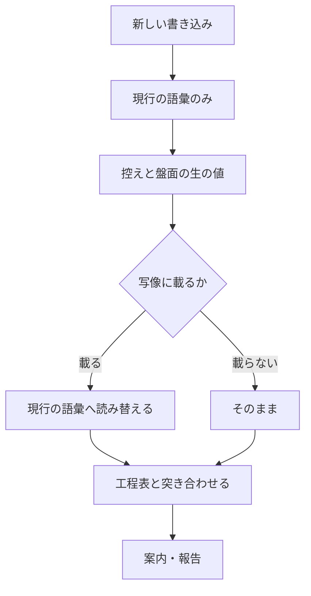

# #421 / #423 / #391: モードの母集合の再編と工程表への追加

要求と受け入れ条件は [01-requirements.md](01-requirements.md) にある。この文書は
「どう作るか」だけを扱う。

## 結論

**モードの母集合と工程表の行を、次の形へ変える。**

| 軸 | 変更前 | 変更後 |
| --- | --- | --- |
| モード（列） | `light` / `standard` / `architecture` / `legacy-refactor` | `light` / `standard` / `legacy-refactor` / `operation` |
| 工程（行） | 15 行 | 16 行（「ドキュメント再構成」を足し、「設計レビュー」を「ドキュメントレビュー」へ改名） |

**旧 `standard` は旧 `architecture` へ統合され、名前だけが `standard` として残る。**
旧 `architecture` の条件はすべて新 `standard` の条件になる。

## 構成要素

| 要素 | 責務 |
| --- | --- |
| `WF_MODES` | モードの母集合。工程表の列の並びを決める |
| `WF_MODE_HEIGHT` | モードの高さ。上げる方向の判定に使う。**列の位置から導かない** |
| `WF_MODE_ALIASES`（新設） | 旧いモード名を新しい名前へ読み替える写像 |
| `WF_STAGE_MATRIX` | 工程 × モードの必須・条件付き・対象外 |
| `WF_STAGE_ALIASES`（新設） | 旧い工程名を新しい名前へ読み替える写像 |
| `PJ_STAGES` | 盤面へ書き込む工程の値。工程表の行名と一致させる |
| `document-restructuring`（新設） | 書き上げた文書を章立てから組み直す手順 |
| `references/operation-run.md`（新設） | 運用モードの実行の範囲・保全・失敗時の扱い |

## データ構造

**変えるのは値の語彙であって、保存の形ではない。** 控えのファイル形式（`wf_record` が書く
行）も、盤面のフィールドも変わらない。

| 保存先 | 持つ値 | 旧い値が残る |
| --- | --- | --- |
| 控え（`wf_state_file`） | `mode` と通過した工程名 | 残る |
| 盤面（GitHub Projects） | `モード` と `進行` の単一選択 | 残る |

**旧い値を書き換えない。** 控えは過去の実行の記録であり、書き換えると「そのとき何を通ったか」
が失われる。**読むときだけ写像を当てる。**

```text
読み取り: 生の値 → 写像 → 現行の語彙 → 判定
書き込み: 現行の語彙のみ
```

| 旧い値 | 読み替え先 | 根拠 |
| --- | --- | --- |
| `architecture` | `standard` | 統合先がそのモードである |
| `設計レビュー` | `ドキュメントレビュー` | 同じ工程の改名である |

**写像は 1 か所に持つ。** 読み替えを呼び出し側へ散らすと、片方だけが古くなる。

**盤面の単一選択へ新しい値を足すのは、リポジトリの利用者の操作である。** 値が無くても
`projects-sync.sh` は終了コード 0 で終わり、工程は止まる。

## 入出力の契約

**変わるのは 3 つの語彙である。** いずれも他の Skill と利用者が読む。

| 契約 | 変更 | 破壊的か |
| --- | --- | --- |
| モード名 | `architecture` を削り、`operation` を足す | **はい** |
| 工程名 | `設計レビュー` → `ドキュメントレビュー`、`ドキュメント再構成` を追加 | **はい** |
| Skill 名 | `document-restructuring` を追加 | いいえ（追加のみ） |

### モードの母集合と判定の順序

**判定は上から順に見て、最初に該当したものを採る。**

| 順 | モード | 該当条件 |
| --- | --- | --- |
| 1 | `operation` | 本番コードも文書も変えず、**外部の系の状態だけ**を変える |
| 2 | `standard` | 公開インタフェースの追加・変更・削除 / 既存データの移行を伴うスキーマ変更 / 認証・認可の変更 / 複数モジュールにまたがる / 重要なドメインルールの変更 / 本番の振る舞いの追加・変更・バグ修正 / テストが十分にある構造変更 |
| 3 | `legacy-refactor` | 本番の振る舞いを変えず本番コードの構造を変える変更で、対象にテストがない・少ない |
| 4 | `light` | 本番の振る舞いも本番コードの構造も変えない局所変更 |

**`operation` を 1 番に置く。** ruleset の変更は「誰が何をできるか」を変えるため、
条件だけを見れば `standard` に当たる。しかし設計もテスト駆動も当たらない。**重大さは
工程ではなく、実行前の承認で受ける。**

### モードの高さ

**列の位置からは導かない。** 上げる方向の判定にだけ使う。

| モード | 高さ | 上げる例 |
| --- | ---: | --- |
| `light` | 1 | 外部の系を触ると分かった → `operation` |
| `operation` | 2 | コードを触ると分かった → `standard` |
| `legacy-refactor` | 3 | 公開インタフェースが変わると分かった → `standard` |
| `standard` | 4 | — |

### 工程表

| 工程 | `light` | `standard` | `legacy-refactor` | `operation` |
| --- | --- | --- | --- | --- |
| 要求と受け入れ条件 | R | R | - | R |
| 作業場所の用意 | C | R | R | C |
| 設計 | - | R | R | - |
| ドキュメント再構成 | - | R | C | - |
| ドキュメントレビュー | - | R | C | - |
| 計画 | - | R | R | R |
| 実装 | R | R | R | R |
| 構造改善 | - | R | R | - |
| レビュー | R | R | R | R |
| 完了判定 | R | R | R | R |
| Pull Request | R | R | R | R |
| 確定仕様化 | - | C | - | C |
| 後片付け | R | R | R | R |
| 配布 | R | R | R | R |
| リリース後テスト | - | C | R | C |
| 振り返り | - | R | R | C |

R = 必須 / C = 条件付き / - = 対象外

**`operation` の「実装」は実行そのものを指す。** 行名は増やさない。呼ぶのは `tdd-cycle`
ではなく、`references/operation-run.md` が定める手順である。

### 構造改善の手段

**モードでは決まらない。** 新 `standard` は公開インタフェースの変更もバグ修正 1 件も含む。
どちらにも 4 つの CLI を動かすと費用に見合わない。

| 手段 | いつ選ぶか |
| --- | --- |
| `refactoring` | 既定 |
| `cross-refactoring` | 変更が複数のモジュールにまたがる、または公開インタフェースの構造そのものを変える |

**選んだ理由を 1 行残す。** 工程は必須のまま変わらない。`legacy-refactor` は
`cross-refactoring` のままである（振る舞い不変を示す手段が乏しく、複数の見方が要る）。

### 人手の承認を求める関門

**関門は 2 つのまま増やさない。** 2 つ目の名前を広げて、運用モードの実行を含める。

| 関門 | いつ | 要否の決まり方 |
| --- | --- | --- |
| 設計 Pull Request のマージ | ドキュメントレビューの工程 | マージ先のチャネルによらず要る |
| **本番の系へ届く操作** | 配布の工程、および `operation` の実装の工程 | 届く先が本番の系かどうかで決まる |

**配布は「本番の系へ届く操作」の一例である。** 運用モードの実行も同じ性質を持つ。
反映した瞬間に効き、取り消しても「その状態を見た人」は戻らない。**性質が同じものを
別の関門として数えない。**

## 処理の流れ



## 決定の記録

### 1. 統合後の `standard` は、構造改善の手段をモードで決めない

**結論**: 工程は必須のまま、手段を `refactoring` と `cross-refactoring` から選ぶ。

**理由**: v10.3.0 が `architecture` を `cross-refactoring` にしたのは、変更の影響が広く
一人の見方では足りないためである。同じ版が `standard` を `refactoring` に留めたのは、
小さな整理に 4 つの CLI が見合わないためである。**統合すると両方が同じ列に入る。**
どちらか一方へ倒すと、片方の根拠が失われる。

**採らなかった案**: 全件 `cross-refactoring`（バグ修正 1 件でも 4 CLI が動く）。
全件 `refactoring`（v10.3.0 の判断を根拠なく覆す）。

### 2. 条件付き（`C`）を必須へ倒さない

**結論**: 確定仕様化とリリース後テストは、統合後も条件付きのままにする。

**理由**: 旧 `architecture` がこれらを必須にしていたのは、公開インタフェースが変わる以上
仕様は必ず変わり、確かめることも必ず残るためである。**条件が満たされるので必須と同じ結果に
なる。** 条件付きにしておけば、統合で入ってきた小さな変更に空の確定仕様を書かせずに済む。

**採らなかった案**: 必須へ倒す（書くことが無い変更にも工程を課す）。

### 3. 旧い値は書き換えず、読むときだけ読み替える

**結論**: `WF_MODE_ALIASES` と `WF_STAGE_ALIASES` を持ち、読み取りにだけ当てる。

**理由**: 控えは過去の実行の記録である。書き換えると「そのとき何を通ったか」が失われる。
**記録を現在の語彙へ合わせるのではなく、現在の読み手が過去の語彙を読めるようにする。**

**採らなかった案**: 読めない値として扱う（正当な過去の記録で案内が出る）。控えを一括で
書き換える（記録が変わる）。

### 4. 運用モードの名前は `operation`

**結論**: `operation`。

**理由**: 他のモード名は英語である。`ops` は略語であり、`markdown-writing` のルール 1
（読み手の知らない語を使わない）に当たる。

**採らなかった案**: `ops`（略語）。`運用`（母集合の中で 1 つだけ日本語になる）。

### 5. 「コードを触らない」を拡張子では判定しない

**結論**: 判定は変更の性質で行う。「本番コードも文書も変えず、外部の系の状態だけを変える」。

**理由**: 拡張子の一覧は言語ごとに増える。対象リポジトリを仮定しない規約（#292）に反する。
他のモードの判定も機械では見ておらず、ここだけ機械の判定を持つ理由が無い。

**採らなかった案**: 差分の拡張子で判定する。

### 6. 関門は増やさず、2 つ目の名前を広げる

**結論**: 「本番のチャネルへ届く操作」を「本番の系へ届く操作」とし、配布と運用の実行の
両方を含める。

**理由**: v10.5.1 は「関門は 2 つで、増やさない。増やすほど承認したことの意味が薄れる」と
定めた。運用モードの実行は配布と**同じ性質**を持つ。性質が同じものを別の関門として数えると、
数だけが増える。

**採らなかった案**: 3 つ目の関門を足す（v10.5.1 の決定を根拠なく覆す）。

### 7. 実行結果は `issues/` 配下へ書き、Pull Request の差分として載せる

**結論**: 実行の記録を `issues/` 配下のファイルへ書く。

**理由**: 運用モードでも Pull Request は必須である。**実行の記録そのものが差分になる。**
`docs/` はリポジトリ知識であり、その時の出来事は知識ではない。

**採らなかった案**: Pull Request のコメント（差分が空になり Pull Request を作れない）。

### 8. 失敗したら、その時点で止める

**結論**: 実行の単位ごとに終了コードを残し、失敗した時点で残りを実行しない。

**理由**: **部分適用の範囲を確定させるためである。** 失敗を無視して続けると、どこまで
反映されたのかが後から読めない。

### 9. `document-restructuring` は 4 つの配布一覧すべてへ載せる

**結論**: 4 ランタイムすべてへ配る。

**理由**: 工程表の行になる Skill は、どのランタイムからも起動できる必要がある。載せない
ランタイムでは工程が通らない。

### 10. 列の並びは高さと一致させない

**結論**: `WF_MODES` は `light` / `standard` / `legacy-refactor` / `operation` の順にする。

**理由**: 決定 2-b（v10.5.1）は「モードの高さは列の位置から導かない」と定めた。列を高さ順に
並べると、再び導きたくなる。**`architecture` を除いた位置はそのままにし、`operation` を
末尾へ足す。**

## テスト設計

| 受け入れ条件 | 何で確かめるか |
| --- | --- |
| A1 / A2 / A3 | `test_workflow_stage_matrix.py`（列数と母集合の一致、高さの全要素） |
| A4 | `SKILL.md` の表と `WF_MODES` を突き合わせる既存テスト |
| A5 | 新しいテスト（旧い `mode` を書いた控えを読み、新しい名前として扱う） |
| A6 | `git grep` による検査（履歴と記録を除く） |
| B1 / B2 / B3 | `test_workflow_stage_matrix.py`（列の追加、16 行すべてに値） |
| B4 | 関門の節をレビューが読む |
| B5 / B6 / B7 | `references/operation-run.md` をレビューが読む |
| C1 | `check-skill-frontmatter.py` と配布一覧の行数 |
| C2 / C3 | 工程名の並びを 4 か所で突き合わせる既存テスト（#231） |
| C4 | `git grep` による検査 |
| C5 〜 C11 | `SKILL.md` をレビューが読む |
| C12 | 新しいテスト（旧い工程名を書いた控えを読む） |
| D1 〜 D6 | 検査 10 本と `CHANGELOG.md` |
| D7 | `cross-review` の収束 |

## 実装を 3 本へ分ける

**列を触る 2 件と行を触る 1 件は、同じファイルを触る。順に進める。**

| 本 | 主題 | 課題 | 主に触るもの |
| --- | --- | --- | --- |
| 1 | モードの母集合の再編 | #421 | `WF_MODES` / `WF_MODE_HEIGHT` / `WF_MODE_ALIASES` / 判定の基準の表 / `architecture` の 59 か所 |
| 2 | 運用モードの新設 | #423 | `WF_MODES` の列追加 / `WF_STAGE_MATRIX` / `references/operation-run.md` / 関門の節 |
| 3 | ドキュメント再構成 | #391 | 工程表の行追加と改名 / `PJ_STAGES` / `WF_STAGE_ALIASES` / 新 Skill / 配布一覧 |

**1 → 2 → 3 の順に進める。** 1 が列を減らし、2 が列を足し、3 が行を足す。逆順にすると
列の数が 2 度動く。

## 未確認のまま残ること

| 項目 | 内容 |
| --- | --- |
| 盤面の単一選択の値 | 新しい工程名と `operation` を足すのは利用者の操作である。このリポジトリの盤面へ足せるかは未確認 |
| 運用モードの実測 | 実際の運用作業へ当てた例がまだ無い。工程の過不足は次の運用作業で見る |
| 再構成の目安の妥当性 | 平均文長 40 字・最長 100 字は 3 本の実測に基づく。他の種類の文書での妥当性は未確認 |
