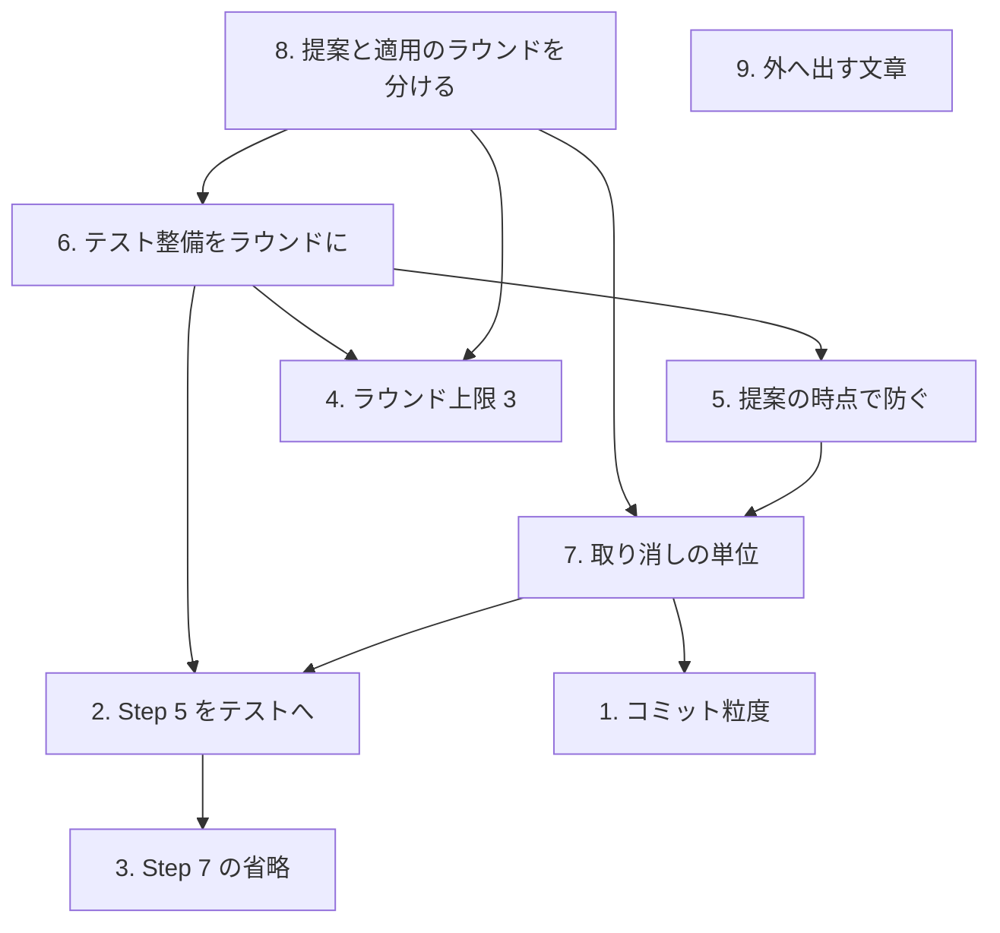

# 要求と受け入れ条件: `cross-refactoring` の全体フローを変える（#436）

## 何を満たせば終わりか

**`cross-refactoring` の 1 回の実行が、費やした時間に見合う数の改善を残す状態にする。**

現状の実測（PR #435、4 ラウンド）では、**18 項目のうち 9 件が取り消され、レビューは
1843 秒を費やして 1 件も差し戻していない**。

## 依頼

**原文をそのまま写す。**

```text
cross-refactoringの全体フローを変更します。

* Step4は全項目で1commitとする。
* Step5のレビュー工程はテスト工程とする。エージェントcliによるレビューではなく、
  関連個所のtestがpassしたらOKとする。CIのテストで代替してもよい。
* Step7 development-workflowの1工程として動いている場合はcross-reciewは省略。
  全体のtestがpassしたらOKとする。また、CIでテストが設定されている場合は
  local testはskipしてよい。
* ラウンド上限のデフォルトは3とする。
```

続けて次の 5 つを受けた。

| # | 指摘 |
| --- | --- |
| 1 | そもそもそういう提案をしないように指示するよう、プロンプトの改修も入れる |
| 2 | 「テストを足す」という提案はラウンドとは別（ラウンドより前）に先にやるべきかもしれない |
| 3 | `--scope` にテストの置き場所も含める |
| 4 | 全件取り消しは無駄が多すぎる。防ぐ方法はあるか |
| 5 | 案 A を採るならラウンドは 3 では足りない。ラウンドの考え方自体に再考が必要 |
| 6 | Pull Request のコメントにも改善計画自体の URL が必須 |
| 7 | 改善計画はファイルではなく課題・子課題・課題へのコメントの方が良いかもしれない |

## 変えるもの

課題の本文が 9 件を挙げている。**依存があるため、独立には決められない。**

| # | 変えるもの |
| --- | --- |
| 1 | Step 4 のコミット粒度（1 項目 1 コミット → まとめて 1 コミット） |
| 2 | Step 5 をレビューからテストへ |
| 3 | Step 7 を条件付きで省略 |
| 4 | ラウンド上限の既定（4 → 3） |
| 5 | 落ちる提案を提案の時点で防ぐ |
| 6 | テストの整備を**提案ラウンドより前のラウンド**にする |
| 7 | 取り消しの単位を保つ |
| 8 | 提案ラウンドと適用ラウンドを分ける |
| 9 | 外へ出す文章を、人が読んで確かめられる形にする |

### 依存の関係



**8 は 6 の前提である。** テスト整備ラウンドは、8 が導入する適用ラウンドと修正ラウンドを
提案ラウンドと共有する。適用の単位が分かれていなければ、テストの整備をラウンドの形に
できない。

**6 は 2 の前提である。** テストが乏しい箇所では、テストが通ることを判定に使えない。

**2 は 3 の前提である。** 3 は Step 7 の `cross-review` を省き、代わりに全体のテストで
判定する。テストを合否の根拠に使えるのは、2 が Step 5 の判定をテストへ置き換え、
その判定に耐えるテストが揃っていることを先に確かめてあるからである。**2 を入れずに 3 だけを
入れると、レビューが 2 か所とも消えたうえで、根拠の無いテストの結果だけが残る。**

**6 は 5 にも掛かる。** テストの整備を前のラウンドへ移すため、構造改善の提案では
テストの置き場所を確かめさせない（`test_gap` を使わせない）。

**8 は 7 と 4 の前提である。** 適用の単位を分けなければ、取り消しの分離もラウンド上限の
引き下げも成り立たない。

**6 も 4 に掛かる。** 4 は上限の配分を決めるが、その配分は 6 が新設する
`--max-test-rounds` を含む（受け入れ条件 E1 は 4 つとも定まっていることを求める）。

**7 は 2 に掛かる。** 検証をどの単位で見るかは、取り消しの単位が決める。適用ラウンドごとに
1 コミットへまとめるため、テストの合否も同じ単位で読む。

**5 は 7 に掛かる。** 採用上限を提案の時点で伝えれば、上限を超えたことによる取り消しが減る。
**この線は残す。** 実測の取り消し 9 件のうち、上限の超過を理由とするものがあった。

**9 だけが独立している。**

## 前提

| # | 前提 |
| --- | --- |
| 1 | 提案・適用・検証を複数の CLI で回すという骨格は変えない |
| 2 | `--scope` を必須にする方針は変えない（提案の発散を防ぐため） |
| 3 | 進行側が公開の責務を持つ方針は変えない |
| 4 | 改修計画を残す方針は変えない（**置き場所は設計で決める**） |
| 5 | この変更で `cross-review` そのものは変えない |

## 受け入れ条件

### A. 適用と取り消しの単位（変更 1 / 7 / 8）

- [ ] A1. 提案ラウンドと適用ラウンドが別の単位として定義され、用語表がある
- [ ] A2. 同じファイルを触る項目が同じ適用ラウンドに入らない
- [ ] A3. 適用ラウンドの分け方が、提案の時点で分かる情報だけで決まる
- [ ] A4. 1 件の失敗が、その適用ラウンドの外の項目を取り消さない
- [ ] A5. コミットの粒度が定まり、取り消しの単位と矛盾しない
- [ ] A6. 4 つの上限（`--max-items-per-round` / `--max-outer-rounds` / `--max-test-rounds` /
      `--max-fix-rounds`）が、それぞれどのラウンドの単位に掛かるかが定まる

### B. 検証（変更 2 / 3 / 6）

- [ ] B1. Step 5 の判定がテストの結果で決まる
- [ ] B2. 継続的統合のテストで代替する条件が定まっている
- [ ] B3. テストの失敗をどの項目に紐づけるかが定まっている
- [ ] B4. テストの整備が**提案ラウンドより前のラウンド**として分かれ、収束の条件と上限がある
- [ ] B5. Step 7 を省略する条件と、その見分け方が定まっている
- [ ] B6. テストで見つからない誤りを拾う工程が示されている

### C. 提案（変更 5）

- [ ] C1. **テスト整備ラウンドの**提案プロンプトが、テストを足す先が対象範囲の中にある
      ことを確かめさせる（**構造改善の提案プロンプトからは外す**）
- [ ] C2. 提案プロンプトが採用上限を伝える
- [ ] C3. `--scope` にテストの置き場所が含まれることを担保する手段がある

### D. 外へ出す文章（変更 9）

- [ ] D1. 項目を指すとき、`<ファイル>#<シンボル>` が併記される
- [ ] D2. 取り消した項目の内訳を Pull Request の文章に書かない（件数のみ）
- [ ] D3. **改修計画の URL が、Pull Request へ出すすべての文章に生の URL で入る**
- [ ] D4. 改修計画の置き場所が定まり、**URL がマージの後も開ける**

### E. 横断

- [ ] E1. ラウンド上限の既定が **4 つとも**定まっている
- [ ] E2. 既存のテストが通る
- [ ] E3. 検査 10 本が終了コード 0 で終わる
- [ ] E4. 変更を実機で 1 度通し、**実測を報告に残す**（取り消しの件数・所要時間）

## 対象と非対象

| 含む | 含まない |
| --- | --- |
| `cross-refactoring` の工程の構造 | `cross-review` の内部 |
| 提案・適用・検証・報告の各プロンプト | **構造改善の**提案の語彙（兆候・手法の一覧） |
| ラウンドと上限の定義 | 輪番の決め方（`lib/assignment.py`） |
| **テスト整備の提案の形と語彙** | 改修計画を残す方針そのもの |
| 改修計画の書式・置き場所・参照 | — |

## 検証手段

```bash
uv run --with pytest pytest scripts/tests plugins/ndf -q
python3 scripts/check-skill-frontmatter.py
python3 scripts/check-doc-staleness.py
python3 scripts/check-doc-line-limit.py
python3 scripts/check-markdown-links.py --root .
python3 scripts/check-skill-repo-assumptions.py
python3 scripts/check-cross-skill-refs.py
bash scripts/build-runtime-plugins.sh --check
bash scripts/validate-runtime-plugins.sh
claude plugin validate .
```

**E4 は機械では確かめられない。** 実機で 1 度通し、実測を報告に残す。

## 境界

| 区分 | 内容 |
| --- | --- |
| 常に行う | 既存テストの実行、用語の統一、進行の記録 |
| 確認してから行う | ラウンドの定義の変更、上限の既定値、Step 7 の省略の条件、テスト整備のラウンド化 |
| 行わない | `cross-review` の内部の変更、輪番の決め方の変更、提案の語彙の変更 |

## 参照

- 課題: #436
- 実測の出所: PR #435 の `cross-refactoring` 状態ファイルと改修計画
