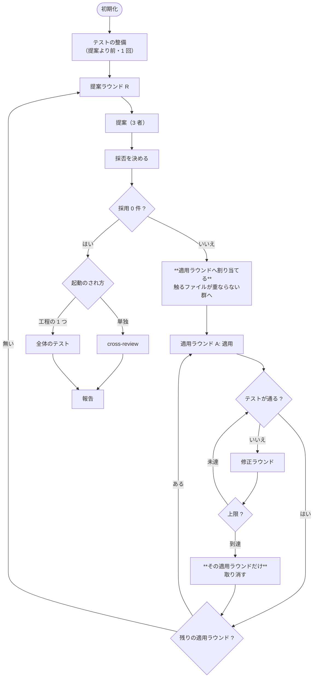

# #436: `cross-refactoring` の全体フローを変える

要求と受け入れ条件は [01-requirements.md](01-requirements.md) にある。この文書は
「どう作るか」だけを扱う。

## 結論

**ラウンドを 3 層に分け、レビューをテストへ置き換える。**

| 変えるところ | 変更前 | 変更後 |
| --- | --- | --- |
| ラウンドの層 | 提案 = 適用 = 検証 = 輪番（1 層） | **提案ラウンド → 適用ラウンド → 修正ラウンド**（3 層） |
| Step 5 の判定 | 2 CLI のレビューが承認するまで | **テストが通るか** |
| Step 7 | `cross-review` を必ず実行 | 単独起動のときだけ実行 |
| テストの整備 | 提案ラウンドの中で項目ごと | **提案より前の 1 工程** |

## この文書で使う語

**新しい語は作らない。** 既存の語彙は「ラウンド」で階層を表すため、そこへ 1 つ加える。

| 語 | 何の単位か | 上限 | 新設 |
| --- | --- | --- | --- |
| 提案ラウンド | 新しい提案を集める。3 者が提案し、採否を決める | `--max-outer-rounds` | 既存 |
| **適用ラウンド** | **同時に適用して検証する。**重なりのない項目だけを含む | 無し | **新設** |
| 修正ラウンド | 検証の失敗を直す | `--max-fix-rounds` | 既存 |
| 改善項目 | 提案の 1 件。`<ファイル>#<シンボル>` と兆候で識別する | — | 既存 |

**「バッチ」「パッチ」の語は使わない。** 読み手が別の意味で知っている語である。

## 構成要素

| 要素 | 責務 |
| --- | --- |
| テスト整備の工程（新設） | 提案より前に、対象範囲のテストの薄い箇所へ現状固定テストを足す |
| 適用ラウンドの割り当て（新設） | 採用した項目を、触るファイルが重ならない群へ分ける |
| 検証（`judge-review` の置き換え） | テストの結果で合否を決める |
| 提案プロンプト | 範囲と上限を提案の時点で伝える |
| 報告の生成 | 外へ出す文章に `<ファイル>#<シンボル>` と改修計画の URL を入れる |
| 改修計画の書き出し | Pull Request のコメント 1 件へ書き、ラウンドごとに同じコメントを編集する |

## 処理の流れ



## 適用ラウンドの割り当て

**採用した項目を、触るファイルが重ならない群へ分ける。** 提案が持つ `path` だけで決まる。

```text
採用: [X(a.sh), Y(a.sh), Z(b.py), W(c.md)]
  適用ラウンド 1: X(a.sh), Z(b.py), W(c.md)   ← 互いに重ならない
  適用ラウンド 2: Y(a.sh)                      ← X と同じファイル
```

| 決めること | 結論 |
| --- | --- |
| 分ける基準 | **ファイルの一致**で見る。行の範囲は見ない |
| 群の数の上限 | 置かない。重なり方が決める |
| 群の順序 | 採否の優先度（合意した数 → 重要度 → 差分行数）の順 |
| 1 群あたりの件数 | 上限を置かない |

**行の範囲では分けない。** 提案の時点で行の範囲は分からず、見積を求めると提案の負荷が上がる。
**ファイルの一致で見れば、提案が持つ `path` だけで決まる。**

## コミットの粒度

**適用ラウンドごとに 1 コミットとする。**

| 案 | 取り消しの単位 | 採否 |
| --- | --- | --- |
| 1 項目 = 1 コミット（現状） | 項目。ただし**重なると分離できない** | 採らない |
| **適用ラウンド = 1 コミット** | **適用ラウンド。重ならないので常に分離できる** | **採る** |
| 全項目 = 1 コミット | ラウンド全体。**1 件の失敗が全件を巻き込む** | 採らない |

**「全項目で 1 コミット」の依頼は、適用ラウンドの単位で満たす。** 適用ラウンドの中の項目は
まとめて 1 コミットになる。**取り消しの分離は適用ラウンドの境界が保証する。**

**現状固定テストは同じコミットに含める。** テストの整備を前の工程へ分けるため、
適用の時点でテストを足す項目は原則として無い。

## 検証（Step 5 の置き換え）

**テストの結果で合否を決める。** 2 CLI のレビューは起動しない。

| 決めること | 結論 |
| --- | --- |
| 何を実行するか | `--baseline-test` が指すコマンド |
| 継続的統合で代替できるか | **できる。** 継続的統合にテストが設定されていれば、手元での実行を省いてよい |
| 失敗をどの項目に紐づけるか | **適用ラウンドの単位で見る。**項目までは特定しない |
| 失敗したら | 修正ラウンドを回す。上限に達したら**その適用ラウンドだけ**取り消す |

**項目まで特定しない。** 適用ラウンドの中は 1 コミットであり、分離しても意味が無い。
**取り消しの単位と判定の単位を一致させる。**

## テストの整備（提案より前）

| 決めること | 結論 |
| --- | --- |
| いつ | 初期化の後、最初の提案ラウンドの前。**1 回だけ** |
| 誰が | 提案に参加するランタイムから 1 者（輪番の先頭） |
| 何を | 対象範囲のうちテストの薄い箇所へ現状固定テストを足す。**構造は変えない** |
| 終わり方 | テストが通り、`--scope` の中に収まっていること |
| 省けるか | **省ける。** 対象範囲のテストが十分なら、この工程は何もせず終わる |

**この工程の後、提案では `test_gap` を真にできない。** テストは既に足してある。

**`--scope` にテストの置き場所を含める。** 初期化の時点で、対象範囲にテストの置き場所が
含まれているかを見る。含まれていなければ**止める**（案内だけでは同じ失敗を繰り返す）。

## 提案の時点で防ぐ

| 伝えること | 現状 | 変更後 |
| --- | --- | --- |
| 対象範囲 | 「この範囲の外は提案しない」 | 変えない |
| **採用上限** | 伝えていない | **「3 者の合計で N 件までが採用される」と書く** |
| **テストの置き場所** | 伝えていない | テストの整備を前へ分けるため、**提案では不要になる** |

## 外へ出す文章

| 規約 | 内容 |
| --- | --- |
| 項目の指し方 | **`<ファイル>#<シンボル>` を併記する。** 内部の識別子だけで書かない |
| 取り消した項目 | **内訳を書かない。** 件数だけ述べ、内訳は改修計画へ譲る |
| 改修計画の URL | **生の URL を必ず書く。** Markdown のリンクにしない |

**改修計画は Pull Request のコメントである**（決定 6）。URL は永続で、ブランチが消えても
切れない。

```text
https://github.com/<所有者>/<リポジトリ>/pull/<PR>#issuecomment-<id>
```

**Pull Request へ出すすべての文章に入れる。** 検証の結果・修正の要約・進行の報告のいずれ
からも 1 手で辿れる。

## ラウンド上限

| 上限 | 既定 | 何を切るか |
| --- | ---: | --- |
| `--max-outer-rounds` | **3** | **提案の回数。**適用できる件数は切らない |
| `--max-fix-rounds` | 3 | 1 つの適用ラウンドあたりの修正の回数 |
| `--max-items-per-round` | 5 | 1 つの**提案ラウンド**の採用件数 |

**既定を 3 にすると輪番は 1 周しない。** 提案は 3 者すべてが毎回行うため、**提案の母集合は
変わらない**。1 周しないのは適用担当だけである。

## Step 7 の省略

| 起動のされ方 | 最終ゲート | 見分け方 |
| --- | --- | --- |
| `development-workflow` の 1 工程 | `cross-review` を省略し、全体のテストで判定 | **引数で受け取る** |
| 単独 | `cross-review` を実行 | 既定 |

**引数で受け取る。** 環境変数や控えの読み取りは、起動元が違っても同じ値になりうる。
**呼ぶ側が明示する形にすれば、判定が 1 か所で済む。**

## 決定の記録

### 1. 適用ラウンドはファイルの一致で分ける

**結論**: 触るファイルが 1 つでも重なる項目は、別の適用ラウンドへ回す。

**理由**: **提案が持つ `path` だけで決まる。** 行の範囲で分ければ採用数を保てるが、提案の
時点で行の範囲は分からず、見積を求めると提案の負荷が上がる。**見積の精度に依存する分け方は、
外れたときに取り消しが分離できない状態へ戻る。**

**採らなかった案**: 行の範囲で分ける（見積に依存する）。分けない（現状。全件取り消しが残る）。

### 2. コミットは適用ラウンドごとに 1 つ

**結論**: 適用ラウンドの中の項目をまとめて 1 コミットにする。

**理由**: **取り消しの単位と一致する。** 適用ラウンドは重ならないので、コミットを戻せば
常に分離できる。**「全項目で 1 コミット」の依頼は、適用ラウンドの単位で満たす。**

**採らなかった案**: 1 項目 1 コミット（重なると分離できない）。全項目 1 コミット
（1 件の失敗が全件を巻き込む）。

### 3. 検証は適用ラウンドの単位で見る

**結論**: テストの失敗を項目まで特定しない。

**理由**: **適用ラウンドの中は 1 コミットであり、分離しても取り消せない。** 判定の単位と
取り消しの単位を一致させる。

### 4. テストの整備は提案より前へ分ける

**結論**: 初期化の後、最初の提案ラウンドの前に 1 回だけ行う。

**理由**: **決定 3 の前提である。** テストが乏しい箇所では、テストが通ることを判定に使えない。
あわせて、**テストの置き場所が範囲外で構造改善の項目ごと落ちる**という失敗が消える
（実測では取り消しの主因だった）。

**`legacy-refactor` の考え方と一致する。** そのモードは振る舞い不変を示す手段を先に作る。

### 5. `--scope` にテストの置き場所が無ければ止める

**結論**: 初期化で確かめ、含まれていなければ止める。

**理由**: **案内だけでは同じ失敗を繰り返す。** 実測では 4 ラウンド続けて同じ理由で項目が
落ちた。**止めれば、利用者は 1 度だけ範囲を直せばよい。**

### 6. 改修計画をファイルではなく Pull Request のコメントへ移す

**結論**: 改修計画を `issues/refactoring-plan-rf<PR>.md` へ書くのをやめ、**対象の
Pull Request のコメント 1 件**へ書く。ラウンドが進むたびに**同じコメントを編集する**。

**理由**: **改修計画は実行の記録であって、リポジトリの知識ではない。** v10.4.0 は同じ理由で
振り返りの記録先を起点の課題のコメント 1 件へ移した（#242。記録のためだけに Pull Request が
7 本作られていた）。改修計画も、**記録を残すためだけに 253 行のファイルをコミットしている**。

**URL の問題が消える。** コメントの URL は永続で、ブランチが消えても切れない。ファイルの
URL は `<ref>` にブランチ名を使うと後片付けで切れ、コミット SHA を使うと読みにくい。
**参照する側が ref を選ぶ必要がなくなる。**

| 置き場所 | URL の安定 | 差分に混ざるか | 更新の手数 |
| --- | --- | --- | --- |
| ファイル（現状） | `<ref>` に依存。ブランチが消えると切れる | **混ざる**（253 行） | コミットと push |
| **Pull Request のコメント 1 件** | **永続** | 混ざらない | 編集 1 回 |
| 子課題 | 永続 | 混ざらない | 課題が増える |

**採らなかった案**: 子課題を立てる（記録のために課題が増える。v10.4.0 が退けた形と同じ）。
ファイルのまま URL を SHA で書く（差分に混ざる問題が残る）。

**`--plan-file` は残す。** ファイルへ書き出したい利用者のために、**明示したときだけ**
ファイルにする。**既定はコメント**である。

### 6-b. 外へ出す文章に改修計画の URL を必ず入れる

**結論**: 改修計画のコメントの URL を、Pull Request へ出すすべての文章に**生の URL**で入れる。

**理由**: **読み手は GitHub 上にいる。** 場所を書かなければ探すことになる。生の URL のまま
書くのは、Markdown のリンクにすると利用者の画面で URL を取り出せないためである
（`pr` の完了報告と同じ規約）。

### 7. Step 7 の省略は引数で受け取る

**結論**: `development-workflow` の工程として起動するときは、呼ぶ側が引数で伝える。

**理由**: **判定が 1 か所で済む。** 環境変数や控えの読み取りは、起動元が違っても同じ値に
なりうる。

### 8. ラウンド上限の既定は 3

**結論**: `--max-outer-rounds` の既定を 4 から 3 へ下げる。

**理由**: **切るのは提案の回数であって、適用できる件数ではない。** 適用ラウンドを分けた
ことで、1 回の提案で通せる件数は上限に縛られなくなった。**提案は 3 者すべてが毎回行うため、
提案の母集合は変わらない。**

**採らなかった案**: 4 のまま（輪番は 1 周するが、提案が尽きていない実測がある）。

## テスト設計

| 受け入れ条件 | 何で確かめるか |
| --- | --- |
| A1 | 用語表が `SKILL.md` にある |
| A2 / A3 | 新しいテスト（採用項目から適用ラウンドへの割り当て） |
| A4 | 新しいテスト（1 つの適用ラウンドの失敗が他へ及ばない） |
| A5 | 新しいテスト（適用ラウンドごとに 1 コミット） |
| A6 | 引数の説明と既存テスト |
| B1 / B3 | 新しいテスト（テストの失敗で適用ラウンドが取り消される） |
| B2 / B5 / B6 | 手順書をレビューが読む |
| B4 | テストの整備の工程が手順書にある |
| C1 / C2 | 提案プロンプトの生成のテスト |
| C3 | 新しいテスト（`--scope` にテストの置き場所が無ければ止まる） |
| D1 / D2 / D3 | 報告の生成のテスト |
| D4 | 新しいテスト（改修計画がコメントとして作られ、2 回目以降は編集される） |
| E1 | 既定値のテスト |
| E2 / E3 | 既存のテストと検査 |
| E4 | 実機で 1 度通し、実測を報告に残す |

## 未確認のまま残ること

| 項目 | 内容 |
| --- | --- |
| 適用ラウンドの数 | ファイルの重なり方で決まるため、実測しないと分からない。今回の提案では `workflow-common.sh` に集中していた |
| テスト整備の工程の所要 | 対象範囲のテストの薄さに依存する。実測が無い |
| 上限 3 で足りるか | 提案が尽きるかどうかで決まる。実測では 4 ラウンド目も 6 件出ていた |
