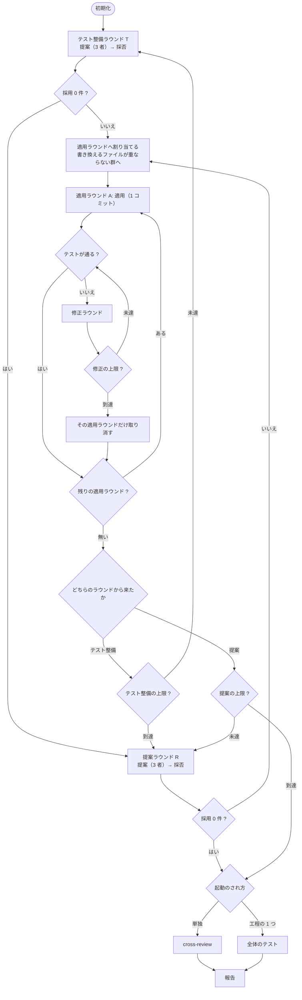

# #436: `cross-refactoring` の全体フローを変える

要求と受け入れ条件は [01-requirements.md](01-requirements.md) にある。この文書は
「どう作るか」だけを扱う。

## 結論

**ラウンドを 4 層に分け、レビューをテストへ置き換える。**

| 変えるところ | 変更前 | 変更後 |
| --- | --- | --- |
| ラウンドの層 | 提案 = 適用 = 検証 = 輪番（1 層） | **テスト整備ラウンド → 提案ラウンド → 適用ラウンド → 修正ラウンド**（4 層） |
| Step 5 の判定 | 2 CLI のレビューが承認するまで | **テストが通るか** |
| Step 7 | `cross-review` を必ず実行 | 単独起動のときだけ実行 |
| テストの整備 | 提案ラウンドの中で項目ごと | **提案ラウンドより前のラウンド。**新しいテストの提案が出なくなるまで繰り返す |

## この文書で使う語

**階層はすべて「ラウンド」で表す。** 4 つのラウンドは同じ形（提案 → 採否 → 適用ラウンド
→ 検証 → 修正ラウンド）を持つため、読み手が覚える形は 1 つで済む。

| 語 | 何の単位か | 上限 | 新設 |
| --- | --- | --- | --- |
| **テスト整備ラウンド** | **足すべきテストを集める。**3 者が提案し、採否を決める | `--max-test-rounds` | **新設** |
| 提案ラウンド | **構造改善の**提案を集める。3 者が提案し、採否を決める | `--max-outer-rounds` | 既存 |
| **適用ラウンド** | **同時に適用して検証する。**重なりのない項目だけを含む。**上の 2 つのラウンドが共有する** | 無し（後述） | **新設** |
| 修正ラウンド | 検証の失敗を直す。**上の 2 つのラウンドが共有する** | `--max-fix-rounds` | 既存 |
| 改善項目 | 構造改善の提案の 1 件。`<ファイル>#<シンボル>` と兆候で識別する | — | 既存 |
| **テスト項目** | **テスト整備の提案の 1 件。**固定する入口と経路の種類で識別する | — | **新設** |

**「バッチ」「パッチ」の語は使わない。** 読み手が別の意味で知っている語である。

## 構成要素

| 要素 | 責務 |
| --- | --- |
| テスト整備ラウンド（新設） | 提案ラウンドより前に、対象範囲のテストの薄い経路へ現状固定テストを足す。**新しい提案が出なくなるまで繰り返す** |
| 適用ラウンドの割り当て（新設） | 採用した項目を、**書き換えるファイル**が重ならない群へ分ける。**2 つのラウンドが共有する** |
| 検証（`judge-review` の置き換え） | テストの結果で合否を決める |
| 提案プロンプト | 範囲と上限を提案の時点で伝える |
| 報告の生成 | 外へ出す文章に `<ファイル>#<シンボル>` と改修計画の URL を入れる |
| 改修計画の書き出し | Pull Request のコメント 1 件へ書き、ラウンドごとに同じコメントを編集する |

## 処理の流れ



**適用ラウンドと修正ラウンドは 1 組しかない。** テスト整備ラウンドと提案ラウンドは、
採用した項目の種類が違うだけで、その先の扱いは同じである。

**終了条件は収束と上限の 2 つである。** 採用が 0 件にならなくても、テスト整備ラウンドが
`--max-test-rounds` に達したら**構造改善の提案ラウンドへ進む**（上限 2 でも提案ラウンドへ
必ず到達する）。提案ラウンドが `--max-outer-rounds` に達したら Gate へ抜ける。**上限で
抜けたことは報告に書く**（収束して終わったのか、歯止めで止まったのかを読み分けるため）。

## 適用ラウンドの割り当て

**採用した項目を、触るファイルが重ならない群へ分ける。** 提案が持つ `path` だけで決まる。

```text
採用: [X(a.sh), Y(a.sh), Z(b.py), W(c.md)]
  適用ラウンド 1: X(a.sh), Z(b.py), W(c.md)   ← 互いに重ならない
  適用ラウンド 2: Y(a.sh)                      ← X と同じファイル
```

| 決めること | 結論 |
| --- | --- |
| 分ける基準 | **書き換えるファイルの一致**で見る。行の範囲は見ない |
| 何を見るか | 改善項目は実装のファイル、**テスト項目はテストを足す先のファイル** |
| 群の数の上限 | 別に置かない。**`--max-items-per-round` が実質の上限になる** |
| 群の順序 | 採否の優先度（合意した数 → 重要度 → 差分行数）の順 |
| 1 群あたりの件数 | 上限を置かない |
| 適用の担当 | **適用ラウンドごとに輪番を進める** |

**行の範囲では分けない。** 提案の時点で行の範囲は分からず、見積を求めると提案の負荷が上がる。
**ファイルの一致で見れば、提案が持つ `path` だけで決まる。**

**「書き換えるファイル」で一般化する。** 改善項目とテスト項目では書き換える先が違うが、
分ける目的は**コミットを分離できること**であり、見るべきは実際に書き換わるファイルである。

### 適用の担当は適用ラウンドごとに進む

**1 つの提案ラウンドが複数の群を持つとき、群ごとに次の担当へ渡す。** 提案ラウンド単位で
1 者に固定すると、群の数だけ 1 者が連続で適用することになり、負荷が偏る。**群は互いに
重ならないため、担当が変わっても前提を引き継ぐ必要が無い。**

**その結果、適用の輪番は 1 周しうる**（決定 8 の理由を、輪番が 1 周しないことに置かない）。

### 先行の群が後続の前提を壊したとき

**同じファイルを触る項目は別の群へ回すため、後続の群は先行の群を適用した後のコードを読む。**
前提が壊れる形は 2 つあり、扱いを分ける。

| 形 | 扱い |
| --- | --- |
| 適用そのものが通らない（競合・対象が消えている） | **その群を取り消す。**修正ラウンドは回さない |
| 適用は通るがテストが落ちる | **修正ラウンドを回す。**上限に達したらその群を取り消す |

**適用が通らないものを修正ラウンドへ送らない。** 修正ラウンドはテストの失敗を直す工程で
あり、前提そのものが消えた項目には直す対象が無い。取り消したうえで除外の一覧へ記録し、
次の提案から外す（決定 10）。

### 群の中の道連れ

**同じ群の項目は 1 コミットであるため、1 件の失敗が群の全件を取り消す。** これは仕様の
限界であり、隠さずに書く。

| 何を守るか | 何を諦めるか |
| --- | --- |
| 取り消しが**群の外へ及ばない**こと | 群の**中**での分離 |

**1 群あたりの件数の上限も、失敗時の個別の再試行も置かない。** どちらも群の中を項目ごとの
コミットへ戻すことになり、決定 2（適用ラウンドごとに 1 コミット）と決定 3（判定の単位と
取り消しの単位を一致させる）に反する。**分離を細かくしたい利用者は
`--max-items-per-round` を下げる**（群が小さくなる）。

### 実行の回数の上限

| 層 | 親のラウンド 1 回あたりの上限 | 全体の最悪 |
| --- | --- | ---: |
| テスト整備ラウンド | `--max-test-rounds` = 2 | 2 |
| 提案ラウンド | `--max-outer-rounds` = 3 | 3 |
| 適用ラウンド | `--max-items-per-round` = 5（1 項目 1 群が最悪） | (2 + 3) × 5 = **25** |
| 修正ラウンド | `--max-fix-rounds` = 3 | 25 × 3 = **75** |

**適用ラウンドだけは親の層が 2 つある。** テスト整備ラウンドと提案ラウンドの両方から
使われるため、全体の最悪は**両方の回数の合計**に上限を掛けた値になる。

**適用ラウンドに別の上限を置かない。** 採用件数の上限が既に群の数を切っている。上限を
2 つ置くと、**どちらで止まったのかを読み解く必要が出る**。

## コミットの粒度

**適用ラウンドごとに 1 コミットとする。**

| 案 | 取り消しの単位 | 採否 |
| --- | --- | --- |
| 1 項目 = 1 コミット（現状） | 項目。ただし**重なると分離できない** | 採らない |
| **適用ラウンド = 1 コミット** | **適用ラウンド。重ならないので常に分離できる** | **採る** |
| 全項目 = 1 コミット | ラウンド全体。**1 件の失敗が全件を巻き込む** | 採らない |

**「全項目で 1 コミット」の依頼は、適用ラウンドの単位で満たす。** 適用ラウンドの中の項目は
まとめて 1 コミットになる。**取り消しの分離は適用ラウンドの境界が保証する。**

**現状固定テストは同じコミットに含める。** テストの整備を前の工程へ分けるため、
適用の時点でテストを足す項目は原則として無い。

## 検証（Step 5 の置き換え）

**テストの結果で合否を決める。** 2 CLI のレビューは起動しない。

| 決めること | 結論 |
| --- | --- |
| 何を実行するか | `--baseline-test` が指すコマンド |
| 継続的統合で代替できるか | **Step 5 では代替しない。**手元の未 push のコミットを検証するため、継続的統合の結果が無い。代替できるのは push の後の Step 7 だけである |
| 失敗をどの項目に紐づけるか | **適用ラウンドの単位で見る。**項目までは特定しない |
| 失敗したら | 修正ラウンドを回す。上限に達したら**その適用ラウンドだけ**取り消す |

**項目まで特定しない。** 適用ラウンドの中は 1 コミットであり、分離しても意味が無い。
**取り消しの単位と判定の単位を一致させる。**

**依頼の「継続的統合のテストで代替してよい」は Step 7 に掛かる。** Step 5 の時点で変更は
まだ公開されていない（公開の責務は進行側にあり、検証を通した後に push する。前提 3）。
群ごとに push して継続的統合を待つ形にすると、**未検証の変更が公開されない**という方針と
両立しない。**Step 5 は手元のテストを必須とする。**

## テスト整備ラウンド

**構造改善の提案を集める前に、足りていないテストを足す。** 提案ラウンドと同じ形を持つ。

| 決めること | 結論 |
| --- | --- |
| いつ | 初期化の後、最初の提案ラウンドの前 |
| 何回 | **新しいテストの提案が出なくなるまで。**上限は `--max-test-rounds`（既定 **2**） |
| 誰が | **提案は 3 者**（ホストを除く）。**適用は輪番。**提案ラウンドと同じ母集合 |
| 何を | 対象範囲のうちテストの薄い経路へ現状固定テストを足す。**構造は変えない** |
| 収束の条件 | **採用 0 件。**提案ラウンドと同じ形にする |
| 終わり方 | テストが通り、`--scope` の中に収まっていること |
| 省けるか | **省ける。**テストが十分なら 1 ラウンド目の提案が 0 件で終わり、1 ラウンドで抜ける |

**このラウンドの後、構造改善の提案では `test_gap` を真にできない。** テストは既に足してある。

**`--scope` にテストの置き場所を含める。** 初期化の時点で、対象範囲にテストの置き場所が
含まれているかを見る。含まれていなければ**止める**（案内だけでは同じ失敗を繰り返す）。

### 提案の形

**新しい語彙は作らない。** 既存の 3 本の参照が持つ分類をそのまま使う（決定 9）。

| 参照 | このラウンドでの役目 |
| --- | --- |
| `refactoring/references/characterization-tests.md` | **手順書そのもの。**`case` の語彙の出所 |
| `tdd-cycle/references/testing-levels.md` | `level` の語彙の出所。「上の階層へ持ち上げない」が採否の基準 |
| `tdd-cycle/references/test-quality.md` | **採らない提案の基準。**実装詳細に結合したテストは採らない |

テスト項目の 1 件は次を持つ。

| 項目 | 何を書くか | 語彙 |
| --- | --- | --- |
| `path` | テストを足す先のファイル | — |
| `target` | 固定する入口。`<ファイル>#<シンボル>` | — |
| `case` | 固定する経路の種類 | **閉じる。**`normal` / `branch` / `boundary` / `error` |
| `level` | どの階層で固定するか | **閉じる。**`unit` / `integration` / `contract` / `e2e` |
| `rationale` | いまその経路が固定されていないと言える根拠 | 自由文 |
| `plan` | どう書くか（順序のある手順） | 自由文 |

**重複排除の鍵は `target` + `case` である。** 改善項目の鍵（`path` + `symbol` + `smell`）
と同じ役目を持つ。**`level` は鍵に入れない**（同じ経路を別の階層で 2 度固定させないため）。

**`case` の 4 種は `characterization-tests.md` の「分岐を洗い出して固定する」の表がそのまま
持つ**（代表的な正常系 / 各分岐に入る入力 / 境界値 / 例外・エラー）。
**`level` の 4 階層は `testing-levels.md` が持つ。**

## 提案の時点で防ぐ

| 伝えること | 現状 | 変更後 |
| --- | --- | --- |
| 対象範囲 | 「この範囲の外は提案しない」 | 変えない |
| **採用上限** | 伝えていない | **「3 者の合計で N 件までが採用される」と書く** |
| **テストの置き場所** | 伝えていない | テストの整備を前へ分けるため、**提案では不要になる** |

## 外へ出す文章

| 規約 | 内容 |
| --- | --- |
| 項目の指し方 | **`<ファイル>#<シンボル>` を併記する。** 内部の識別子だけで書かない |
| 取り消した項目 | **内訳を書かない。** 件数だけ述べ、内訳は改修計画へ譲る |
| 改修計画の URL | **生の URL を必ず書く。** Markdown のリンクにしない |

**改修計画は Pull Request のコメントである**（決定 6）。URL は永続で、ブランチが消えても
切れない。

```text
https://github.com/<所有者>/<リポジトリ>/pull/<PR>#issuecomment-<id>
```

**Pull Request へ出すすべての文章に入れる。** 検証の結果・修正の要約・進行の報告のいずれ
からも 1 手で辿れる。

## ラウンド上限

| 上限 | 既定 | 何を切るか |
| --- | ---: | --- |
| `--max-test-rounds` | **2** | **テスト整備の提案の回数**（新設） |
| `--max-outer-rounds` | **3** | **構造改善の提案の回数。**適用できる件数は切らない |
| `--max-fix-rounds` | 3 | 1 つの適用ラウンドあたりの修正の回数 |
| `--max-items-per-round` | 5 | 1 つの提案ラウンド／テスト整備ラウンドの採用件数 |

**引数名は既存に揃える。** `--max-outer-rounds` / `--max-fix-rounds` と同じ
`--max-<何の>-rounds` の形にする。

**テスト整備の既定を構造改善より少なくする。** 理由は母集合の増え方が違うことにある。

| ラウンド | 適用すると母集合はどうなるか | 既定 |
| --- | --- | ---: |
| 提案ラウンド | **増える。**抽出したメソッドがさらに分けられるなど、構造が変わると新しい兆候が見える | 3 |
| テスト整備ラウンド | **増えない。**対象のコードを変えないため、テストが薄い経路の集合は最初から確定している | 2 |

**2 回目に出るのは 1 回目の挙げ漏らしだけである。** 3 者が 1 度読んだだけでは経路が出そろわ
ないため 1 回では足りないが、2 回目で新しい提案が出なければそこで収束する。**上限に達する
前に収束するのが既定の想定である**（上限は歯止めであって、回数の指定ではない）。

## Step 7 の省略

| 起動のされ方 | 最終ゲート | 見分け方 |
| --- | --- | --- |
| `development-workflow` の 1 工程 | `cross-review` を省略し、全体のテストで判定 | **引数で受け取る** |
| 単独 | `cross-review` を実行 | 既定 |

**引数で受け取る。** 環境変数や控えの読み取りは、起動元が違っても同じ値になりうる。
**呼ぶ側が明示する形にすれば、判定が 1 か所で済む。**

## テストで見つからない誤りを拾う工程

**Step 5 をテストへ置き換え、Step 7 を条件付きで省くと、実行の流れからレビューが 2 か所とも
消えうる。** 受け入れ条件 B6 はこれを拾う工程を求める。**答えは起動のされ方で分かれる。**

| 起動のされ方 | 誰が拾うか |
| --- | --- |
| 単独 | **Step 7 の `cross-review`。**省略しない |
| `development-workflow` の 1 工程 | **工程表の「レビュー」。**`cross-refactoring` の後に `pr` → `cross-review` が続く |

**`cross-refactoring` の中へ軽量なレビューを足さない。** 工程として起動したときに Step 7 を
省くのは、**同じ差分を 2 度レビューしないため**である。省いた分は工程表の側が持つ。
v10.5.1 で `light` も `cross-review` を通すと決めたため、**モードによらずレビューは必ず
1 度掛かる**。足すと、2 度掛かる状態へ戻る。

**引数で受け取ることが、この担保の前提である**（決定 7）。「工程の 1 つとして起動した」と
伝えられる呼び出し側は、工程表を持っている側だけである。

## 決定の記録

### 1. 適用ラウンドはファイルの一致で分ける

**結論**: 触るファイルが 1 つでも重なる項目は、別の適用ラウンドへ回す。

**理由**: **提案が持つ `path` だけで決まる。** 行の範囲で分ければ採用数を保てるが、提案の
時点で行の範囲は分からず、見積を求めると提案の負荷が上がる。**見積の精度に依存する分け方は、
外れたときに取り消しが分離できない状態へ戻る。**

**採らなかった案**: 行の範囲で分ける（見積に依存する）。分けない（現状。全件取り消しが残る）。

### 2. コミットは適用ラウンドごとに 1 つ

**結論**: 適用ラウンドの中の項目をまとめて 1 コミットにする。

**理由**: **取り消しの単位と一致する。** 適用ラウンドは重ならないので、コミットを戻せば
常に分離できる。**「全項目で 1 コミット」の依頼は、適用ラウンドの単位で満たす。**

**採らなかった案**: 1 項目 1 コミット（重なると分離できない）。全項目 1 コミット
（1 件の失敗が全件を巻き込む）。

### 3. 検証は適用ラウンドの単位で見る

**結論**: テストの失敗を項目まで特定しない。

**理由**: **適用ラウンドの中は 1 コミットであり、分離しても取り消せない。** 判定の単位と
取り消しの単位を一致させる。

### 4. テストの整備をラウンドにする

**結論**: 初期化の後、最初の提案ラウンドの前に**テスト整備ラウンド**を置き、新しいテストの
提案が出なくなるまで繰り返す。上限は `--max-test-rounds`（既定 2）。

**理由**: **決定 3 の前提である。** テストが乏しい箇所では、テストが通ることを判定に使えない。
あわせて、**テストの置き場所が範囲外で構造改善の項目ごと落ちる**という失敗が消える
（実測では取り消しの主因だった）。

**1 回では足りない。** 3 者が 1 度読んだだけではテストの薄い経路が出そろわない。
構造改善の提案を 1 回で打ち切らない理由（読むたびに出る）は、テストの提案にも同じく当たる。

**ラウンドにすれば、収束の条件を「新しい提案が出ない」で揃えられる。** 判定の形が 1 つに
なり、適用ラウンドと修正ラウンドをそのまま共有できる。**「提案より前の 1 工程」のままだと、
終わり方の規約だけが別物になる。**

**採らなかった案**: 1 回だけ行う（挙げ漏らしを拾えない）。提案ラウンドの中で項目ごとに行う
（現状。取り消しの主因）。

**`legacy-refactor` の考え方と一致する。** そのモードは振る舞い不変を示す手段を先に作る。

### 5. `--scope` にテストの置き場所が無ければ止める

**結論**: 初期化で確かめ、含まれていなければ止める。

**理由**: **案内だけでは同じ失敗を繰り返す。** 実測では 4 ラウンド続けて同じ理由で項目が
落ちた。**止めれば、利用者は 1 度だけ範囲を直せばよい。**

### 6. 改修計画をファイルではなく Pull Request のコメントへ移す

**結論**: 改修計画を `issues/refactoring-plan-rf<PR>.md` へ書くのをやめ、**対象の
Pull Request のコメント 1 件**へ書く。ラウンドが進むたびに**同じコメントを編集する**。

**理由**: **改修計画は実行の記録であって、リポジトリの知識ではない。** v10.4.0 は同じ理由で
振り返りの記録先を起点の課題のコメント 1 件へ移した（#242。記録のためだけに Pull Request が
7 本作られていた）。改修計画も、**記録を残すためだけに 253 行のファイルをコミットしている**。

**URL の問題が消える。** コメントの URL は永続で、ブランチが消えても切れない。ファイルの
URL は `<ref>` にブランチ名を使うと後片付けで切れ、コミット SHA を使うと読みにくい。
**参照する側が ref を選ぶ必要がなくなる。**

| 置き場所 | URL の安定 | 差分に混ざるか | 更新の手数 |
| --- | --- | --- | --- |
| ファイル（現状） | `<ref>` に依存。ブランチが消えると切れる | **混ざる**（253 行） | コミットと push |
| **Pull Request のコメント 1 件** | **永続** | 混ざらない | 編集 1 回 |
| 子課題 | 永続 | 混ざらない | 課題が増える |

**採らなかった案**: 子課題を立てる（記録のために課題が増える。v10.4.0 が退けた形と同じ）。
ファイルのまま URL を SHA で書く（差分に混ざる問題が残る）。

**`--plan-file` は残す。** ファイルへ書き出したい利用者のために、**明示したときだけ**
ファイルにする。**既定はコメント**である。

### 6-b. 外へ出す文章に改修計画の URL を必ず入れる

**結論**: 改修計画のコメントの URL を、Pull Request へ出すすべての文章に**生の URL**で入れる。

**理由**: **読み手は GitHub 上にいる。** 場所を書かなければ探すことになる。生の URL のまま
書くのは、Markdown のリンクにすると利用者の画面で URL を取り出せないためである
（`pr` の完了報告と同じ規約）。

### 7. Step 7 の省略は引数で受け取る

**結論**: `development-workflow` の工程として起動するときは、呼ぶ側が引数で伝える。

**理由**: **判定が 1 か所で済む。** 環境変数や控えの読み取りは、起動元が違っても同じ値に
なりうる。

### 8. ラウンド上限の既定は 3

**結論**: `--max-outer-rounds` の既定を 4 から 3 へ下げる。

**理由**: **切るのは提案の回数であって、適用できる件数ではない。** 適用ラウンドを分けた
ことで、1 回の提案で通せる件数は上限に縛られなくなった。**提案は 3 者すべてが毎回行うため、
提案の母集合は変わらない**（取り消した項目は除外されるので、同じ提案は積み上がらない。
決定 10）。

**輪番の 1 周を根拠にしない。** 適用の担当は適用ラウンドごとに進むため、1 つの提案ラウンド
が複数の群を持てば輪番は 1 周しうる。**上限が切るのは提案の回数だけである。**

**採らなかった案**: 4 のまま（提案が尽きていない実測はあるが、それは上限ではなく提案の
母集合の話である）。

### 9. テスト整備の提案に新しい語彙を作らない

**結論**: 兆候（`smell`）と手法（`technique`）に相当する語彙は新設しない。**固定する経路の
種類（`case`）と階層（`level`）だけを閉じ**、値は既存の参照が持つ分類をそのまま使う。

**理由**: **構造改善の語彙を閉じているのは重複排除のためである**（実装が「語彙を固定しないと
重複排除が効かない」と書いている）。テスト整備でも 3 者が同じ経路を挙げるため、鍵は要る。
**鍵に要るのは `target` + `case` の 2 つで、17 種の兆候に当たるものは要らない。**
テスト整備の提案の中身は「どの経路が固定されていないか」であって、悪さの分類ではない。

**値を既存の参照から採るのは、語彙が 2 つに割れるのを避けるためである。** 新しく作れば、
参照の分類と提案の語彙のどちらが正かを、人が突き合わせることになる。

**「対象の経路を挙げるだけ」の形は採らない。** 経路を自由文で書かせると、同じ経路が 3 者
から別の言い回しで出て重複排除が効かない。**構造改善の提案が日本語で返り、語彙外として
全件降格した実測**と同じ失敗になる。

**採らなかった案**: テスト用の兆候・手法の語彙を新設する（既存の 3 本の参照と食い違う語彙が
1 セット増える）。経路を自由文だけで挙げさせる（重複排除が効かない）。

### 10. 取り消した項目を次の提案から除外する

**結論**: 取り消した項目を除外の一覧へ入れ、以後の提案プロンプトの「対象外」へ渡す。
鍵は改善項目が `path` + `symbol` + `smell`、**テスト項目が `target` + `case`** である。

**理由**: **除外しないと、同じ項目が毎ラウンド再提案されて上限を消費する。** 実測では適用で
失敗した項目が 3 ランタイム全員から再提案され、合意数が最大になって最優先で採用された。

**この仕組みは既にある**（`deferred_items` と `excluded_keys`）。**この設計はそれを変えず、
テスト項目へ広げるだけである。** 決定 8 が「提案の母集合は変わらない」と言えるのは、この
除外が働いていることが前提になる。

## テスト設計

| 受け入れ条件 | 何で確かめるか |
| --- | --- |
| A1 | 用語表が `SKILL.md` にあり、**4 つのラウンドが並ぶ** |
| A2 / A3 | 新しいテスト（採用項目から適用ラウンドへの割り当て。**改善項目とテスト項目の両方**） |
| A4 | 新しいテスト（1 つの適用ラウンドの失敗が他へ及ばない） |
| A5 | 新しいテスト（適用ラウンドごとに 1 コミット） |
| A6 | **4 つの上限**の引数の説明（掛かるラウンドの単位が書かれている）と既存テスト |
| B1 / B3 | 新しいテスト（テストの失敗で適用ラウンドが取り消される） |
| B2 / B5 | 新しいテスト（起動のされ方で最終ゲートが変わる。**Step 5 は手元のテストを必須とする**） |
| B4 | 新しいテスト（**テスト整備ラウンドが採用 0 件まで繰り返され、上限に達したら採用が残っていても提案ラウンドへ進む**） |
| B6 | **手順書に「誰が拾うか」の表がある**（工程表の側が持つことを明記） |
| C1 | **テスト整備ラウンドの**提案プロンプトの生成のテスト |
| C2 | 提案プロンプトの生成のテスト（採用上限を伝える） |
| — | 新しいテスト（**テスト項目の `case` / `level` が語彙外なら降格する**） |
| — | 新しいテスト（**取り消した項目が次の提案の「対象外」へ入る**。改善項目とテスト項目） |
| C3 | 新しいテスト（`--scope` にテストの置き場所が無ければ止まる） |
| D1 / D2 / D3 | 報告の生成のテスト |
| D4 | 新しいテスト（改修計画がコメントとして作られ、2 回目以降は編集される） |
| E1 | 既定値のテスト |
| E2 / E3 | 既存のテストと検査 |
| E4 | 実機で 1 度通し、実測を報告に残す |

## 未確認のまま残ること

| 項目 | 内容 |
| --- | --- |
| 適用ラウンドの数 | ファイルの重なり方で決まるため、実測しないと分からない。今回の提案では `workflow-common.sh` に集中していた |
| テスト整備ラウンドの所要 | 対象範囲のテストの薄さに依存する。実測が無い。**現状固定テストは分岐ごとに書くため、構造改善の適用より重くなりうる** |
| 上限 2 で足りるか | **「テストの母集合は増えない」という見立てに基づく。**2 ラウンド目でも新しい提案が出続けるなら、見立てが外れている |
| 上限 3 で足りるか | 提案が尽きるかどうかで決まる。実測では 4 ラウンド目も 6 件出ていた |
