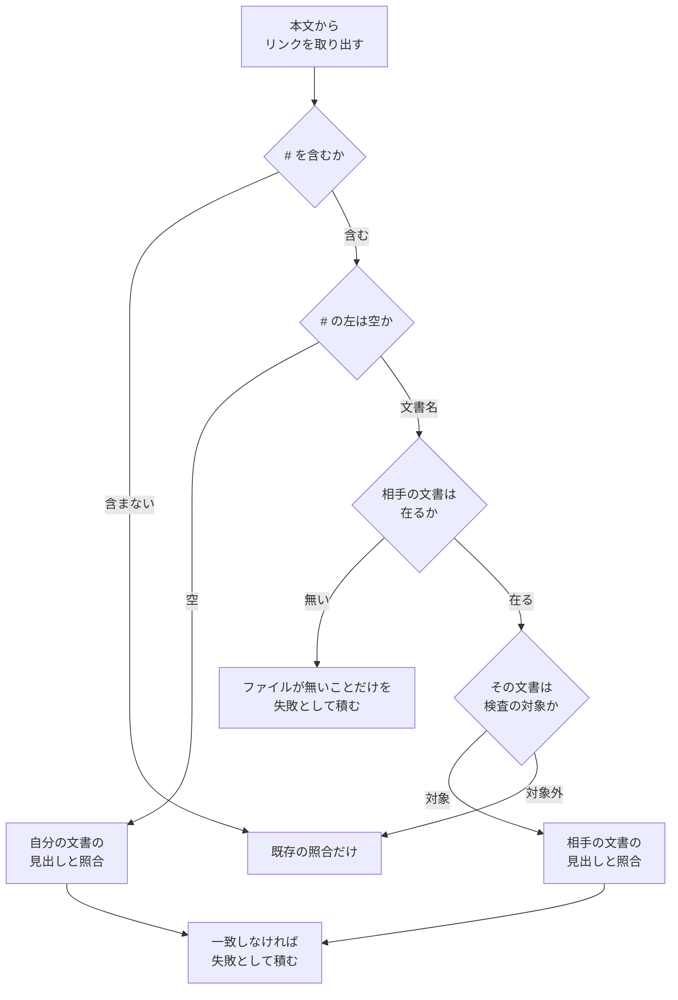

# #445: リンク検査に見出しへの参照の照合を足す

要求と受け入れ条件は [issue-445-requirements.md](issue-445-requirements.md) にある。この文書は
「どう作るか」だけを扱う。

## 構成要素

`scripts/check-markdown-links.py` へ 3 つの関数を足し、既存の照合の後ろへ 1 段を継ぎ足す。

| 要素 | 責務 |
| --- | --- |
| `slugify(text)` | 見出しの本文から、参照に書かれる名前を作る |
| `heading_anchors(path)` | 1 つの文書の見出しをすべて読み、重複へ連番を付けた名前の集合を返す |
| `anchor_refs(text)` | 本文から `#名前` と `相手.md#名前` の 2 形を取り出す |
| 名前の控え | 同じ文書の見出しを 2 度読まないための辞書。実行 1 回のあいだ持つ |

既存の `should_skip` と `target_path` は変えない。**ファイルの存在の照合と、見出しの照合を
別の経路にする。** 同じ関数へ両方を入れると、ファイルが無いときと見出しが無いときで戻り値の
意味が 2 つになる。

## 処理の流れ

## 参照の名前を作る規則

GitHub の生成規則に合わせる。

| 段 | 何をするか | 例 |
| --- | --- | --- |
| 1 | HTML のタグを取り除く | `見出し 後半` → `見出し後半` |
| 2 | 小文字にする | `Design Notes` → `design notes` |
| 3 | 文字・数字・結合文字・空白・`-`・`_` 以外を落とす | `` `$SCRIPTS` を決める `` → `scripts を決める` |
| 4 | 空白を `-` にする | `design notes` → `design-notes` |
| 5 | 同じ名前が既にあれば `-1`、`-2` を付ける | 2 つ目の `## 手順` → `手順-1` |

照合するときは、書かれた側の名前を百分率符号化から戻し、小文字にしてから比べる。日本語の
見出しは、そのままの形でも符号化された形でも書かれるためである。

## 見出しとして読む範囲

**ATX の見出しだけを読む。** 1〜6 個の `#` の直後に空白が続く行（`^#{1,6}\s+`）を見出しと
する。下線の形（`===` / `---`）は読まない。

行頭が `#` でも直後が空白でない行は見出しにしない。`#183 の指摘は…` のように課題の番号で
始まる文があり、コードブロックの外に 5 行ある（実測）。空白を求めないと、この 5 行が見出しの
名前を作る。

| 形 | このリポジトリでの件数 | 扱い |
| --- | ---: | --- |
| `#` の直後に空白が続く行 | 多数 | 読む |
| 行頭が `#` で直後が空白でない行 | 5 | 読まない |
| `===` の下線 | 0 | 読まない |
| `---` の下線 | 0（`---` の行はすべて frontmatter の区切りか CSS） | 読まない |
| `<a name>` / `<h2 id>` による指定 | 0 | 読まない |

`---` を下線として読むと、frontmatter の終わりの行が直前の行を見出しに変えてしまう。件数が
0 である以上、読まない側に倒す費用は無い。

**見出しの抽出は、既存の除外（フェンスの中と `>` で始まる行）をそのまま流用する。** 別の
走査は書かない。

引用も除くのは、引用の中に見出しの形が 3 行あるためである（実測）。他の文書から引いた本文が
そのまま入っており、見出しとして数えると、GitHub が作らない名前が集合へ入る。重複へ付ける
連番（段 5）もその分ずれる。この 3 行を指す参照は 0 件であるため、除いて困る箇所は無い。

## 決定の記録

### 決定 1: 別の文書の見出しへの参照も照合する

節を移す作業（#499 / #500）で切れるのは、同じ文書の中よりも別の文書を指す参照である。
実測では別の文書を指すものが 6 件、同じ文書を指すものが 4 件あり、母数はむしろ多い。
同じ照合の仕組みで両方を見られるため、片方だけにする理由が無い。

### 決定 2: 検査の対象外の文書を指す参照は、見出しを照合しない

`iter_markdown_files` が返す母集合の外（`issues/` など）は、見出しを読みに行かない。
照合するには対象外の文書を読むことになり、**検査の母集合が実質的に広がる**。母集合を
変えるかどうかはこの変更の対象ではない。ファイルが在ることの照合は、これまでどおり行う。

### 決定 3: ファイルが解決できない参照は、見出しの照合を行わない

`相手.md#名前` で相手の文書が無いとき、報告するのはファイルが無いことだけにする。1 つの
誤りに対して 2 行を出すと、直す箇所が 2 つあるように読める。

### 決定 4: 名前の控えを実行のあいだだけ持つ

同じ文書は複数の場所から参照される。参照のたびに見出しを読み直すと、文書の数だけ読み込みが
増える。控えは辞書 1 つで足り、実行が終われば消える。

## テスト設計

テストは `scripts/tests/test_check_markdown_links.py` に置く。一時ディレクトリへ文書を作り、
検査を関数として呼んで終了コードと出力を見る。

| 受け入れ条件 | 何で確かめるか |
| --- | --- |
| 同じ文書に無い見出しを指すと落ちる | 見出しを 1 つ持つ文書から、別の名前を指す参照を書く |
| 別の文書に無い見出しを指すと落ちる | 2 つの文書を作り、片方から相手に無い名前を指す |
| 重複した見出しの `-1` が解決できる | 同じ文言の見出しを 2 つ置き、`-1` を指す |
| 日本語の見出しが両方の形で解決できる | そのままの形と百分率符号化した形の 2 つを指す |
| 既存の文書が落ちない | リポジトリ全体に対して検査を実行し、終了コード 0 を見る |
| コードブロックの中の参照は対象外 | フェンスの中に解決できない参照を書き、落ちないことを見る |
| 決定 3: 相手の文書が無いときは見出しの誤りを出さない | 存在しない文書へ `無い.md#名前` を書き、出力がファイルの欠落の 1 行だけであることを見る |

## 未確認のまま残ること

| 項目 | 内容 |
| --- | --- |
| GitHub の生成規則との細部の一致 | 記号の落とし方は Unicode の分類で近似する。絵文字を含む見出しは、このリポジトリに無い |
| 対象外の文書からの参照 | `issues/` の中の文書が持つ参照は、これまでどおり検査しない |
