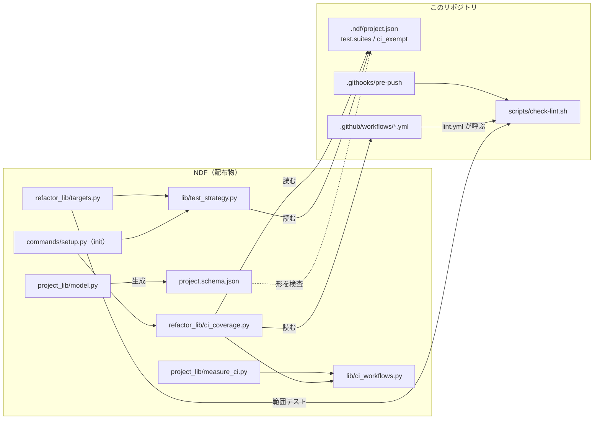
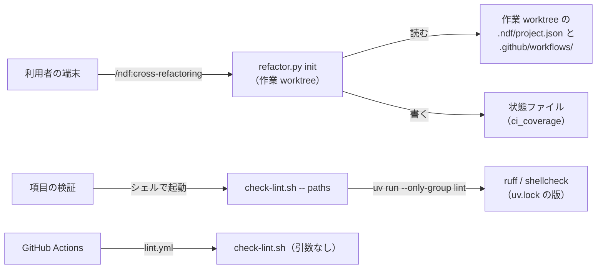
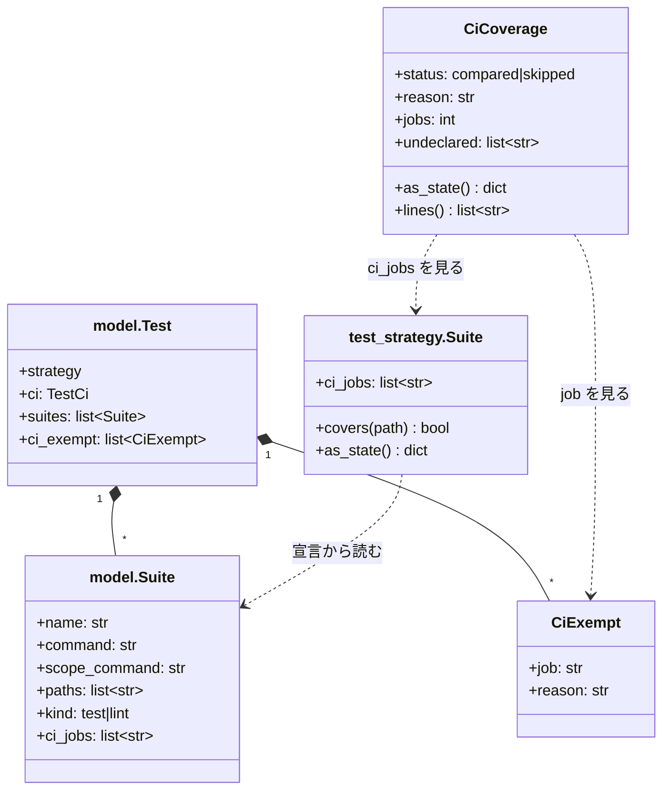
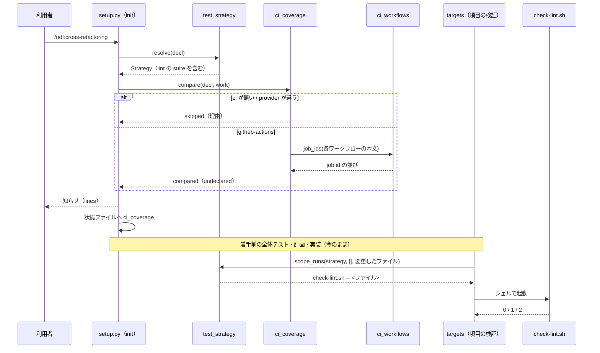

# cross-refactoring: 項目が入れた整形・静的解析の違反を項目の検証で拾えず、push 前の検査か継続的統合で初めて落ちる → 項目の範囲テストで落ち、宣言に無い継続的統合のジョブを起動の時点で知らされる（#464）

## 目的

- **何が壊れているか**: このリポジトリの宣言（`.ndf/project.json` の `test.suites`）に整形・静的解析（`scripts/check-lint.sh` の ruff format --check・ruff check・shellcheck）が無く、項目が入れた違反を項目の検証も手元の最終ゲートも拾わない
- **誰が困るか**: cross-refactoring を回す conductor と利用者。push 前の検査（`.githooks/pre-push`）で refactor が止まり（2026-09-30・10-02）、手で整形して再開している
- **直すと何が成り立つか**: 違反を入れた項目は、その項目の範囲テストで失敗になり、今の修正・取り消しの流れへ入る。継続的統合が走らせるのに宣言に無いジョブは、`init` の時点で名前つきで知らされる

## 適用範囲

- **働く範囲**: 宣言の suite の追加（`check-lint.sh` の範囲の受け取りを含む）はこのリポジトリだけで働く。`init` の突き合わせと宣言の 2 つのキー（`ci_jobs`・`ci_exempt`）は、NDF を使うすべてのリポジトリで働く
- **プロジェクトごとに違うもの**: どのジョブをどの suite が受け持つか・どのジョブを手元で走らせないかは、宣言（`.ndf/project.json` の `test`）で受ける。NDF の既定にジョブの名前やコマンドを持たない
- **当たるモード**: `standard`

## あるべき姿の根拠

| 根拠 | 種類 | 何を示すか |
| --- | --- | --- |
| 「このリポジトリの宣言（`.ndf/project.json` の `test.suites`）へ整形の suite（`kind: lint`。例 `ruff format --check {paths}`）を足し、項目ごとの範囲テストで整形の違反を捕まえる」（2026-10-03 の方針） | 利用者の指示の原文 | 宣言の側で直す。push の直前に整形を掛ける形・説明だけを変える形は採らない |
| 「そのプロジェクトに整形・静的解析の規約やツールがあればそれを利用する」（https://github.com/devbasex/ai-plugins/issues/464#issuecomment-5570162076） | 利用者の指示の原文 | 新しい検査を足さず、`check-lint.sh` をそのまま使う |
| 範囲を絞った 3 検査（ruff format --check・ruff check・shellcheck を 1 本ずつ）が 0.16 秒で終わった（2026-10-03、このリポジトリ） | 実測 | 範囲テストへ足しても項目の検証の時間をほとんど増やさない（`lint.yml` の全体は 16 秒） |
| 拡張子の無い shebang のシェルスクリプトが 3 本追跡されている（`.githooks/pre-commit`・`.githooks/pre-push`・`claude`。2026-10-03） | 実測 | glob（`*.sh`）で suite の範囲を切ると、`check-lint.sh` が見るファイルを範囲テストが取りこぼす |
| 最終ゲートは、入口で push（`publish.enter_final_gate`）してから静的解析（`gate_lint.lint_gate`）を走らせる（`commands/gate.py:79`・`:95`） | 実測（コードの読み取り） | 最終ゲート修正のコミットの違反は、この変更の後も push 前の検査で拒まれる（「未確認のまま残ること」） |

要求と受け入れ条件は #464 の本文にある（コピーは [issue-464-requirements.md](issue-464-requirements.md)）。この文書は「どう作るか」だけを扱う。

## 例: 違反を入れた項目と、起動の時点の知らせ

1. 利用者が `/ndf:cross-refactoring 1700 --scope plugins/ndf/scripts` を起動する
2. `init` が宣言を読み、テストの戦略を組む。続けて `.github/workflows/` の 9 本のワークフローが持つジョブ 19 件を宣言と突き合わせ、次を出す

   ```text
   🧭 テストの戦略: local-full（根拠 derived:test.suites）
   🔎 継続的統合のジョブ 19 件のうち、宣言に無いもの 8 件（手元の検証では走りません）
      - .github/workflows/runtime-plugin-validate.yml#runtime-plugin-build-check
      - .github/workflows/runtime-plugin-validate.yml#skill-frontmatter-check
      …
      直すときは、受け持つ suite の ci_jobs か test.ci_exempt に書きます（.ndf/project.json）
   ```

3. 実装担当が項目 `R3` のコミットを積む。`plugins/ndf/scripts/lib/foo.py` の 1 行が 130 字になった
4. 項目の検証が範囲テストを 3 本組む

   ```text
   uv run --frozen --project . --all-extras pytest plugins/ndf/scripts/tests/test_foo.py -q -n 4 …
   python3 scripts/check-script-structure.py plugins/ndf/scripts/lib/foo.py
   bash scripts/check-lint.sh -- plugins/ndf/scripts/lib/foo.py
   ```

5. 3 本目が `ruff format --check` の違反で終了コード 1 を返し、項目の検証が失敗になる。実装担当が直し、項目の検証を通ってから最終ゲートへ進む

## ドメインモデル

### コンテキスト

| コンテキスト | 何の語が 1 つの意味に決まるか |
| --- | --- |
| ndf-workflow（プロジェクトの宣言） | suite・suite の種別・ジョブの識別子・除外したジョブ |
| ndf-cross-refactoring | 範囲テスト・全体テスト・変更したファイル・宣言に無いジョブ |

関係は**順応者**である。cross-refactoring は宣言の形（`project.schema.json`）をそのまま読み、自分の都合で読み替えない。

### 集約

| 集約 | 持ち主（書き換えてよいもの） | 根 | エンティティ | 値オブジェクト |
| --- | --- | --- | --- | --- |
| テストの宣言 | 利用者（手で書く）と解析（`project-decl.py write`。指紋が一致するときだけ） | `test` | suite | `ci_jobs` の要素・`ci_exempt` の要素（ジョブの識別子と理由） |
| 実行の状態 | cross-refactoring の `init`（`ci_coverage` を書く唯一の者） | 状態ファイル | 項目 | `ci_coverage`（突き合わせの結果） |

### 不変条件

| # | 集約 | 条件 | 破れたときの扱い |
| --- | --- | --- | --- |
| I1 | テストの宣言 | ジョブの識別子は `<ワークフローのファイルのパス>#<job id>` か `<ワークフローのファイルのパス>`（そのファイルのジョブすべて）の 2 形だけである | `project-decl.py check` が形の誤りとして落とす。`init` は形の外の値をどのジョブにも当てない（当たらないジョブは宣言に無いとして知らせる） |
| I2 | テストの宣言 | `ci_exempt` の要素は空でない理由を持つ | `project-decl.py check` が落とす |
| I3 | 実行の状態 | 突き合わせは起動を止めない。どの結果でも `init` の終了コードを変えない | 突き合わせの中の例外は「突き合わせられなかった」に倒して続ける |
| I4 | 実行の状態 | 宣言に無いと知らせるのは、どの suite の `ci_jobs` にも `test.ci_exempt` にも当たらないジョブだけである | 宣言が覆うジョブを知らせたら誤り（AC6） |
| I5 | テストの宣言（このリポジトリ） | lint の suite の全体テストは、`bash scripts/check-lint.sh` を引数なしで走らせたものと同じファイルを見る | 範囲を受け取る変更で、引数なしの振る舞いを変えない |
| I6 | 範囲テスト | `check-lint.sh` に渡したパスのうち、追跡されていない・消えた・検査の対象外のファイルは、どれも検査に入らず、それだけでは終了コード 0 で終わる | 対象外のファイルだけの項目が失敗にならない（AC3） |

### ドメインイベント

| # | イベント | 発生元 | 受け手 |
| --- | --- | --- | --- |
| E1 | `init` が宣言からテストの戦略を組み、lint の suite を範囲テストの候補に入れた | `init`（`ts.resolve`） | 項目の検証（`targets.lint_runs`） |
| E2 | `init` が継続的統合のジョブと宣言を突き合わせ、宣言に無いジョブを知らせた | `init`（`ci_coverage.compare`） | 利用者（`init` の出力）・状態ファイル（`ci_coverage`） |
| E3 | 着手前の全体テストが lint の suite の `command` を走らせた | 着手前のテスト（今のまま） | `baseline_test.suites` |
| E4 | 実装担当が項目のコミットを積んだ | 実装担当（今のまま） | 項目の検証 |
| E5 | 項目の検証が、変更したファイルを lint の suite の範囲テストへ渡した | 項目の検証（今のまま） | 修正・取り消しの流れ（今のまま） |
| E6 | 手元の最終ゲートが lint の suite を含む全体テストを走らせた | 最終ゲート（今のまま） | 最終ゲート修正（今のまま） |
| E7 | オーケストレーターが作業ブランチを push した | 公開（今のまま） | push 前の検査 |

E3〜E7 の仕組みは変えない。宣言に suite が増えたことで、E3・E5・E6 に lint の suite が加わる。

### 用語

| 用語 | 意味 | 用語集への反映 |
| --- | --- | --- |
| ジョブの識別子 | 継続的統合のジョブを指す `<ワークフローのファイルのパス>#<job id>`。`#<job id>` を省くとそのファイルのジョブすべてを指す。宣言の `ci_jobs` と `ci_exempt` が使う | 追加 |
| 除外したジョブ | 手元の検証で走らせないと宣言したジョブ。宣言の `test.ci_exempt` に理由と組で書く | 追加 |
| 宣言に無いジョブ | 継続的統合のジョブのうち、どの suite の `ci_jobs` にも、除外したジョブにも当たらないもの。cross-refactoring の `init` が知らせる | 追加 |

## 機能一覧

| # | 機能 | 誰が使うか |
| --- | --- | --- |
| F1 | 項目が変えたファイルだけに、整形・静的解析の 3 検査を掛ける（このリポジトリ） | cross-refactoring の項目の検証 |
| F2 | 着手前・危険フラグ・最終ゲートの全体テストで、整形・静的解析を走らせる（このリポジトリ） | cross-refactoring・`supervise.py` の検査プラン |
| F3 | どの継続的統合のジョブをどの suite が受け持つか、どれを手元で走らせないかを宣言に書く | 宣言を書く利用者 |
| F4 | 宣言に無い継続的統合のジョブを、起動の時点で知らせる | cross-refactoring を起動する利用者・conductor |

## 構成要素

| 要素 | 責務 |
| --- | --- |
| `scripts/check-lint.sh`（変更） | 引数のパスを受け、そのうち追跡されているファイルを対象にする。引数が無ければ今と同じく追跡されているファイルすべて。対象の振り分け（Python・シェル・拡張子の無い shebang）はこれまでどおりこのスクリプトだけが持つ |
| `.ndf/project.json`（変更。C7） | lint の suite を 1 件足す。3 つの suite に `ci_jobs` を、`test` に `ci_exempt` を足す |
| `project_lib/model.py`（変更） | `Suite.ci_jobs` と `Test.ci_exempt`（要素は `CiExempt`）を足す。ジョブの識別子の形（I1）と理由の空（I2）を検査する |
| `development-workflow/schemas/project.schema.json`（再生成） | `project-decl.py schema` の生成物。手で書かない |
| `lib/ci_workflows.py`（新規） | ワークフローの本文から job id の並びを取り出す（YAML ライブラリを使わず字下げで読む）。`measure_ci.workflow_jobs` から移す |
| `project_lib/measure_ci.py`（変更） | `workflow_jobs` が `ci_workflows.job_ids` の数を使う。振る舞いは変えない |
| `lib/test_strategy.py`（変更） | `Suite` に `ci_jobs` を持たせ、宣言から読んで状態ファイルへ写す（`as_state` / `from_state` / `_suites_of`） |
| `refactor_lib/ci_coverage.py`（新規） | 宣言と作業ディレクトリのワークフローを突き合わせ、結果（`CiCoverage`）を返す。出力と状態への書き込みはしない |
| `refactor_lib/commands/setup.py`（変更） | `_prepare_init` が `ci_coverage.compare` を呼んで結果を出力し、`_build_initial_state` が状態ファイルの `ci_coverage` へ置く |
| `cross-refactoring/SKILL.md`（変更） | `init` の知らせと、宣言の `ci_jobs` / `ci_exempt` の書き方を 1 段落で足す |



`cross-refactoring/SKILL.md` は手順書なので図に含めない。

### 配置



`init` はワークフローを GitHub の API からではなく、作業 worktree のファイルから読む。HEAD のワークフローと宣言を同じ木で比べるためである。

### パッケージ・モジュール構成

```text
scripts/check-lint.sh                                   変更
.ndf/project.json                                       変更（C7）
plugins/ndf/
├── scripts/
│   ├── lib/
│   │   ├── ci_workflows.py                             新規
│   │   └── test_strategy.py                            変更
│   ├── project_lib/
│   │   ├── measure_ci.py                               変更
│   │   └── model.py                                    変更
│   └── tests/                                          テストを足す
└── skills/
    ├── development-workflow/schemas/project.schema.json 再生成
    └── cross-refactoring/
        ├── SKILL.md                                    変更
        ├── scripts/refactor_lib/
        │   ├── ci_coverage.py                          新規
        │   └── commands/setup.py                       変更
        └── tests/                                      テストを足す
scripts/tests/                                          check-lint.sh のテストを足す
```

## 構造



`ci_coverage.compare(decl, work) -> CiCoverage` は関数で、例外を外へ出さない（I3）。`CiCoverage.lines()` は `init` が出す行の並びを返し、出力は呼ぶ側（`setup.py`）が行う。

## データ構造

### 宣言（`.ndf/project.json` の `test`）

| キー | 型 | 既定 | 意味 |
| --- | --- | --- | --- |
| `test.suites[].ci_jobs` | ジョブの識別子の配列 | `[]` | この suite が同じ検査を手元で走らせる継続的統合のジョブ |
| `test.ci_exempt` | `CiExempt` の配列 | `[]` | 手元の検証で走らせないジョブ |
| `test.ci_exempt[].job` | ジョブの識別子 | 必須 | 除外するジョブ |
| `test.ci_exempt[].reason` | 文字列（空不可） | 必須 | 手元で走らせない理由 |

どちらも省いてよい。省いた宣言は今と同じく読め、`init` はすべてのジョブを宣言に無いとして知らせる。

**`analysis.written.test` の指紋は、今すでに宣言の値と一致しない**（2026-10-03 に `value_digest` で照合した。#1668 で手で suite を足したため）。解析の書き出し（`merge.merge_item`）は一致しない項目を書き換えずに残すので、この変更の書き換えも解析で消えない。指紋は触らない。

### このリポジトリの宣言に足す値

lint の suite（1 件を足す）:

| キー | 値 |
| --- | --- |
| `name` | `lint` |
| `runner` | `check-lint` |
| `kind` | `lint` |
| `command` | `bash scripts/check-lint.sh` |
| `scope_command` | `bash scripts/check-lint.sh -- {paths}` |
| `needs` | `[]` |
| `paths` | `["."]` |
| `ci_jobs` | `[".github/workflows/lint.yml"]` |

既存の suite には `ci_jobs` だけを足す。

| suite | `ci_jobs` |
| --- | --- |
| `pytest` | `[".github/workflows/pytest.yml"]` |
| `script-structure` | `[".github/workflows/script-structure.yml"]` |

`test.ci_exempt`:

| `job` | `reason` |
| --- | --- |
| `.github/workflows/glossary.yml` | Pull Request の差分と head のブランチ名で語の規則を選ぶ。項目のコミットだけでは判定が決まらない |
| `.github/workflows/pr-base-guard.yml` | Pull Request の宛先を見る。項目の変更で結果が変わらない |
| `.github/workflows/pr-body-decisions.yml` | Pull Request の本文を見る。項目の変更で結果が変わらない |
| `.github/workflows/runtime-plugin-authenticated-smoke.yml` | 手動で起動し、秘密を使う |
| `.github/workflows/runtime-plugin-smoke.yml` | 4 つのランタイムの CLI を入れて動かす。手元の検証の時間に収まらない |

`runtime-plugin-validate.yml` の 8 ジョブはどこにも書かない。生成物の同期・frontmatter・リンクなど項目の変更で壊れうる検査で、宣言に無いことを知らせるのが正しいためである。suite にするかは範囲外の課題 #1694 で決める（「未確認のまま残ること」）。

### 状態ファイル（`ci_coverage`）

| キー | 型 | 意味 |
| --- | --- | --- |
| `status` | `compared` / `skipped` | 突き合わせたか、突き合わせられなかったか |
| `reason` | 文字列 | `skipped` の理由（`ci が無い` / `provider が github-actions でない（<値>）` / `ワークフローを読めない（<パス>: <理由>）`）。`compared` なら空 |
| `jobs` | 整数 | 読んだジョブの数（`skipped` なら 0） |
| `undeclared` | ジョブの識別子の配列 | 宣言に無いジョブ。`<パス>#<job id>` の形で、パスと job id の順に並べる |

書くのは新しい実行の `init` だけで、再開では書き換えない（再開の出力には今回の突き合わせを出す）。

## 入出力の契約

### `scripts/check-lint.sh`

```text
bash scripts/check-lint.sh [--fix] [--] [<パス>...]
```

| 項目 | 契約 |
| --- | --- |
| 引数なし | 今と同じ。追跡されているファイルすべてを対象にする（I5）。CI（`lint.yml`）と `pre-push` はこの形のまま呼ぶ |
| パスあり | `git --literal-pathspecs ls-files -z -- <パス>...` が返すファイル（ディレクトリは配下の追跡ファイルへ展開される。追跡されていないものは出ない）のうち、作業ディレクトリに残るものを対象にする。振り分けは引数なしと同じ規則（`*.py` → ruff の 2 検査、`*.sh` と拡張子の無い sh・bash の shebang → shellcheck、ほかは対象外） |
| `--` | 以降をすべてパスとして読む。`--` より前の `-` で始まる知らない語は今と同じく終了コード 2 |
| `--fix` | 今と同じ。パスがあれば、対象のファイルにだけ掛ける |
| 対象が 0 本 | ツールを起動せず、`check-lint: 違反なし（Python 0 本・sh 0 本）` を出して終了コード 0（I6・AC3） |
| 終了コード | 今と同じ。0 違反なし / 1 違反あり / 2 検査の仕組みが落ちた |

パスは作業ディレクトリの根からの相対で受ける。スクリプトは今と同じく根へ `cd` してから読むため、根の外から相対パスで呼ぶと当たらない。cross-refactoring は範囲テストを作業ディレクトリの根で走らせるので、この制約に当たらない。

### cross-refactoring の `init` の出力

標準エラーへの `info` の行が増える。引数・終了コード・`statefile.emit` の鍵は変えない。

| 結果 | 出す行 |
| --- | --- |
| 宣言に無いジョブがある | `🔎 継続的統合のジョブ <N> 件のうち、宣言に無いもの <M> 件（手元の検証では走りません）`、続けてジョブの識別子を 1 行に 1 つ、最後に直し方の 1 行 |
| すべて覆う | 出さない（AC6） |
| 突き合わせられなかった | `ℹ 継続的統合のジョブと宣言を突き合わせられませんでした（<理由>）` |

宣言の読み取りは今と同じ `project_decl.read_project_decl` の結果を使う。突き合わせのために読み直さない。

## 処理の流れ



突き合わせの規則:

1. 宣言の `ci` が無い・読めない（`ts.ci_of` が `None`）→ `skipped`（`ci が無い`）
2. `ci.provider` が `github-actions` でない → `skipped`
3. 作業ディレクトリの `.github/workflows/*.yml` と `*.yaml` を名前の順に読む。読めないファイルが 1 つでもあれば `skipped`（そのパスと理由）
4. 各ファイルの job id から識別子 `<パス>#<job id>` を作る
5. 識別子が、どれかの suite の `ci_jobs` の要素か `ci_exempt[].job` に当たれば覆われている。当たるとは、要素が識別子と同じか、要素がそのファイルのパスと同じ（`#` を持たない）ことである。比較は文字列の一致だけで、glob も接頭辞も使わない
6. 覆われていない識別子を `undeclared` に並べる

`ci.workflows`（解析が測った一覧）は使わない。`dynamic/pages/...` のようにファイルの無い項目を持ち、解析の時点の値だからである。

## 非機能の実現方式

| 大項目 | 要求の条件 | 実現方式 |
| --- | --- | --- |
| 性能・拡張性 | lint の範囲テスト 1 回は数秒で終わる。実装後に 1 回測って記録する | 対象のファイルだけをツールへ渡し、対象が 0 本ならツールを起動しない。設計の時点の実測は 3 検査で 0.16 秒。実装後に `check-lint.sh -- <1 本>` を測り、実装の Pull Request の本文に書く |
| 運用・保守性 | `init` の知らせは状態ファイルか出力に残る | 出力（標準エラー）と状態ファイルの `ci_coverage` の両方に残す |
| システム環境 | ツールは `uv run --frozen --project . --only-group lint` から起動し、`uv.lock` の版を使う | `check-lint.sh` の `tool()` をそのまま使う。suite のコマンドはツールを直に呼ばない |

## 決定の記録

### 決定 1: 振り分けの規則を 1 か所に保つため、3 検査を 1 つの suite にまとめ、`check-lint.sh` にパスを受けさせる

`check-lint.sh` は追跡しているか・拡張子・shebang でファイルを振り分けており、CI と `pre-push` もこれを呼ぶ。suite を `check-lint.sh -- {paths}` にすれば、範囲テスト・全体テスト・CI・`pre-push` の 4 つが同じ規則で同じ検査を走らせ、全体テストのコマンドは CI の step と同じ文になる（AC4）。拡張子の無い shebang のシェルスクリプト（3 本）も範囲テストで拾える。

検査ごとに 3 つの suite（`ruff format --check {paths}` を `paths: ["*.py"]` で、など）に分ける形は採らなかった。拡張子の無いシェルスクリプトを glob で表せず、振り分けの規則が宣言と `check-lint.sh` の 2 か所に分かれる。

根拠: Value 6 / 利用者の指示（2026-09-07 のコメント）（MVV 版 2）

### 決定 2: 対象外のファイルで失敗させないため、suite の `paths` を `["."]` にして対象の判定を `check-lint.sh` に任せる

変更したファイルはすべて lint の suite へ渡り、`check-lint.sh` が対象外（`.md`・`.json` など）と追跡されていないものを落とす。対象が 0 本ならツールを起動せずに 0 で終わる（AC3）。

`paths` を拡張子の glob に絞る形は採らなかった。決定 1 と同じく、拡張子の無いシェルスクリプトを取りこぼす。

根拠: Value 6（MVV 版 2）

### 決定 3: 照合が外れないよう、継続的統合のジョブを単位にし、宣言の側に受け持ちを明示して照合する

照合の単位は `<ワークフローのファイル>#<job id>` とし、suite の `ci_jobs` と `test.ci_exempt` に書かれたものを覆われているとみなす。コマンドの文字列は比べない。このリポジトリの pytest は CI が `-n auto`、宣言が `-n 4 … --junitxml=…` で文が違い、文字列で比べると宣言にある検査を「無い」と知らせる（AC6 に反する）。job id はリポジトリが自分で付けた名前で、ワークフローの中で一意である。

step の `run:` の文字列の一致で照合する形と、`ci.required_checks`（ブランチ保護の検査名）で照合する形は採らなかった。前者は上の誤りを出し、`run: |` の複数行を語に分ける解析が要る（#1334 の I1 が戦略の判定で退けたのと同じ、コマンドの文字列の解析である）。後者はジョブの表示名で、ブランチ保護を設けないリポジトリでは空になる。

根拠: Value 5 / Value 3（MVV 版 2）

### 決定 4: 手元で走らせない理由を残すため、除外は理由を必須にした別のキー（`test.ci_exempt`）に書く

除外の手段が無いと、Pull Request の文脈でしか判定できないジョブ（宛先・本文・差分を見るもの）が毎回知らされ、知らせ全体が読まれなくなる。理由を必須にするのは、除外が「宣言の書き漏れ」を隠す手段にならないよう、判断を後から読めるようにするためである。キーは解析が書く `ci` ではなく、利用者が手で書く `test` に置く。

除外を設けず、知らせを読み流してもらう形は採らなかった。AC6 の「宣言が覆うときは知らせない」を、覆えないジョブを持つリポジトリで満たせない。

根拠: Value 7 / Value 2（MVV 版 2）

### 決定 5: 入口のスクリプトに外部パッケージを持ち込まないため、ジョブの読み取りは YAML ライブラリを使わず、解析の既存の読み方を共通の部品へ移して使う

照合に要るのは `jobs:` の直下の job id だけで、解析（`measure_ci.workflow_jobs`）が字下げで同じものを数えている。これを `lib/ci_workflows.py` の `job_ids` に移し、解析と `init` の両方が使う。`refactor.py` は標準ライブラリだけで動いており、`ruamel.yaml` を使うと入口で `deps.require` を呼んで uv の環境で起動し直すことになる。

`yamlio.load_yaml`（ruamel.yaml）で読む形は採らなかった。job id のためだけに入口の起動の形を変えることになる。

根拠: Value 6 / Value 4（MVV 版 2）

### 決定 6: 知らせを後から読めるようにするため、突き合わせの結果を出力と状態ファイルの両方に残し、純粋な処理と出力を分ける

`ci_coverage.compare` は結果を返すだけにし、出力と状態への書き込みは `setup.py` が行う。`setup.py` は構造チェックの例外で 913 行まで許されており（今 906 行）、照合の処理を置く余地が無い。

根拠: Value 4 / Value 6（MVV 版 2）

## テスト設計

| 受け入れ条件・不変条件 | どの振る舞いで縛るか | どう壊したら落ちるべきか |
| --- | --- | --- |
| AC1 | このリポジトリの宣言を `ts.resolve` で解くと、`kind: lint` で `scope_command` に `{paths}` を持つ suite があり、その範囲テストに ruff format・ruff check・shellcheck の違反をそれぞれ持つファイルを渡すと終了コード 1 になる | `check-lint.sh` がパスを受けても 3 検査のどれかを飛ばすと落ちる |
| AC2・F1 | 一時の git リポジトリで ruff format に違反する `.py` を変えたコミットを積み、`targets.verify_runs` が組んだ lint の範囲テストを走らせると 0 以外になる | lint の suite が `verify_runs` に入らない・変更したファイルが渡らないと落ちる |
| AC3・I6 | `.md` と `.json` だけを渡すと、ツールを起動せずに終了コード 0。追跡されていないファイル・消えたファイルを渡しても 0 | 対象外のファイルを ruff に渡す（`.sh` を ruff format へ渡すと 2 になる）と落ちる |
| AC4・I5 | 引数なしと、`git ls-files` の全ファイルを渡したときで、対象の本数（終わりの行の Python・sh の本数）が同じ。このリポジトリの HEAD で宣言の lint の `command` が 0 | 引数なしの振る舞いを変えると落ちる |
| AC5・I4 | `ci.provider: github-actions` の宣言と、どの suite も受け持たないジョブを持つワークフローで `compare` すると、そのジョブの識別子が `undeclared` に入り、`setup` の出力にその識別子が出て、`init` は止まらない | 覆われていないジョブを数え落とすと落ちる |
| AC6・I4 | すべてのジョブを `ci_jobs`（ファイル単位と `#job` 単位の両方）と `ci_exempt` で覆うと、`undeclared` が空で、知らせの行を出さない | ファイル単位の要素を当てない・`ci_exempt` を見ないと落ちる |
| AC7・I3 | `ci` が無い宣言と `provider: gitlab` の宣言で、`skipped` と理由が返り、`init` が続く。読めないワークフローでも `skipped` | 例外を外へ出す・止めると落ちる |
| AC8 | 既存の pytest・script-structure の範囲テストと全体テストのコマンドが、宣言に `ci_jobs` を足した後も同じ文で組まれる。全体テスト（`uv run --frozen --project . --all-extras pytest . -q -n 4`）が通る | `ci_jobs` の追加で `scope_runs` の並びが変わると落ちる |
| I1・I2 | `project-decl.py check` が、形の外のジョブの識別子と、理由の空の `ci_exempt` を落とす | 形の検査を外すと落ちる |
| 決定 5 | `measure_ci.workflow_jobs` の数が、移す前と同じワークフローで同じ | 移した読み方が job id を数え違えると落ちる |
| 状態の往復 | `Strategy.as_state` → `from_state` で `ci_jobs` が残り、`ci_jobs` を持たない旧い状態ファイルも読める | 旧形で `KeyError` になると落ちる |

`.md` の文言（`SKILL.md` の段落）を照合するテストは書かない。

## 設計の結果

| 課題 | 扱い | 取り込み先 | 触るファイル |
| --- | --- | --- | --- |
| #464 | 実装する | — | `scripts/check-lint.sh`、`scripts/tests/`、`.ndf/project.json`、`plugins/ndf/scripts/lib/ci_workflows.py`、`plugins/ndf/scripts/lib/test_strategy.py`、`plugins/ndf/scripts/project_lib/measure_ci.py`、`plugins/ndf/scripts/project_lib/model.py`、`plugins/ndf/scripts/tests/`、`plugins/ndf/skills/development-workflow/schemas/project.schema.json`、`plugins/ndf/skills/cross-refactoring/` |

## 未確認のまま残ること

| 項目 | 内容 |
| --- | --- |
| 最終ゲート修正の push（要求の未決 3） | **この変更では塞がらない。** 最終ゲートは入口で push してから静的解析を走らせ（`commands/gate.py:79`・`:95`）、最終ゲート修正の取り込み（`cmd_merge_final_fix`）は範囲テストを走らせない。`--ci-check` の起動でも単独の起動でも、最終ゲート修正のコミットの違反は push 前の検査で拒まれる（2026-09-30 の形）。直す層は cross-refactoring の最終ゲートで、cross-review の修正（#1507）とは別である。要求が範囲テストの組み方の変更を含まないとしているため、範囲外の課題 #1693 として起票した。承認ゲート 1 で人が扱いを決める |
| `runtime-plugin-validate.yml` の 8 ジョブ | 宣言に無いジョブとして知らされ続ける。suite にするか除外するかは範囲外の課題 #1694 で決める |
| 解析が `ci_jobs` を書かない | 解析（`project-decl.py write`）が新しく作る宣言は `ci_jobs` を持たず、`init` はすべてのジョブを知らせる。解析が埋めるかは、知らせの件数を見てから決める |
| C7 の承認 | `.ndf/project.json` の書き換え（要求の前提 7）とスキーマの変更・`check-lint.sh` の引数の契約の変更（要求の「確認してから行う」）は、承認ゲート 1 でこの設計とともに人が確かめる。実装の Pull Request のマージも MVV の判定に任せない |
| 範囲テストの実測 | 設計の時点の 0.16 秒は 3 検査を 1 本ずつ直に起動した値で、`check-lint.sh` を通した値ではない。実装後に測る |
