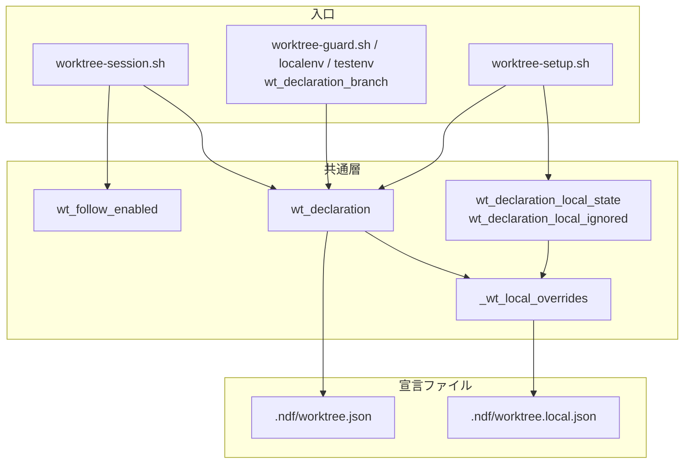
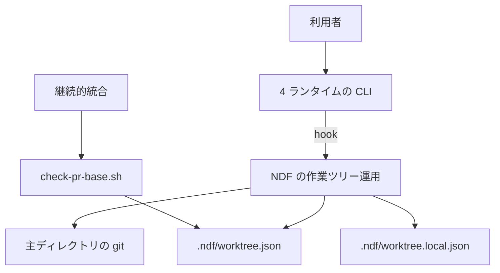
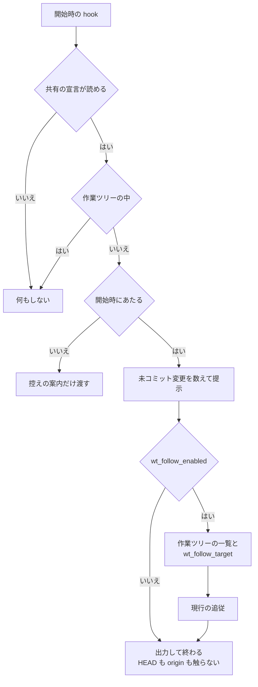
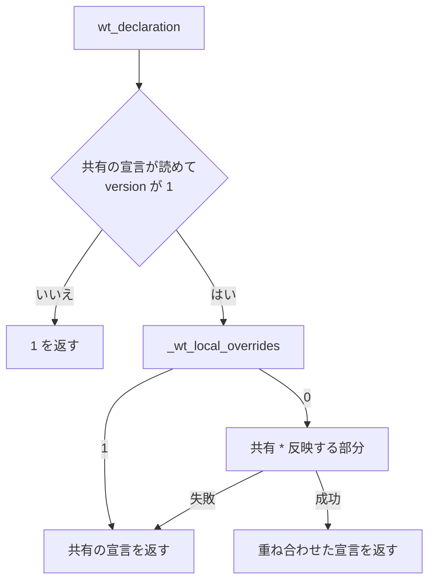

# #610 / #495: 追従を宣言で有効にする形へ変え、宣言に個人のファイルを重ねる

要求と受け入れ条件は [issue-495-610-requirements.md](issue-495-610-requirements.md) にある。この文書は
「どう作るか」だけを扱う。

**実装は 2 本の Pull Request に分ける**（決定 1）。

| Pull Request | 課題 | 中身 | 受け入れ条件 |
| --- | --- | --- | --- |
| 1 | #610 | 開始時の hook の追従を既定で止め、`follow_branch: true` で有効にする | AC1〜AC10、AC30、AC31 |
| 2 | #495 | `.ndf/worktree.local.json` を `wt_declaration` の中で共有の宣言へ重ねる | AC11〜AC31 |

## 機能一覧

| # | 機能 | 誰が使うか | Pull Request |
| --- | --- | --- | --- |
| 1 | 開始時の hook が主ディレクトリの HEAD を動かさない（既定） | 並列にエージェントを動かす利用者 | 1 |
| 2 | 宣言の `follow_branch: true` で追従を有効にする | 主ディレクトリで稼働中の作業ツリーの内容を見たい利用者 | 1 |
| 3 | 個人の宣言で `localenv` / `testenv` / `follow_branch` を各自の値にする | ポートの帯や持ち込み物が機械ごとに違う利用者 | 2 |
| 4 | `status` / `check` が個人の宣言の状態と、反映しなかった項目を出す | 個人の宣言を書いた利用者 | 2 |
| 5 | `init` が個人の宣言を追跡から外す | 宣言を新しく作る利用者 | 2 |

## 決定の記録

決定 1〜4 は #610、決定 5〜10 は #495 の何をどう重ねるか、決定 11〜16 は #495 の読み取りと報告を扱う。

### 決定 1: #610 と #495 を 2 本の Pull Request に分け、#610 を先に出す

#610 の直し方は追従の既定を変えることで、宣言の分け方に依存しない。有効にする項目 `follow_branch` は
いまの共有の宣言にそのまま書け、#495 が入った後は個人の宣言からも書けるようになる。優先度の高い #610 を、
重ね合わせの規則の合意を待たずに出せる。

1 本にまとめる形は採らない。#495 の規則（上書きできる項目・報告の文言・`init`）の検討が #610 を止める。

### 決定 2: 追従を既定で止め、`follow_branch: true` のときだけ行う

並列のエージェント実行では、どの開始の時点でも他の担当が主ディレクトリを読んでいる。HEAD を動かす
こと自体が他の担当の読み取りを変えるため、条件をどう狭めても、動かす経路が残る限り事象は残る。
「1 人が 1 つの作業ツリーで作業する」使い方のために、有効にする手段は残す。

採らない案と理由:

- **主ディレクトリがブランチ上なら動かさない。** 通常の状態（develop 上）から一度も追従しなくなり、
  detached の間は issue の 2 つ目の移動（`<sha>` → `<sha>`）が残る
- **前回の判定と同じなら動かさない。** 事象は作業ツリーの数が変わったときに起きるため、防げない
- **他のセッションが稼働中なら動かさない。** 4 ランタイムのセッションを数える共通の手段が無い
- **追従そのものを消す。** #146 の依頼で入った機能であり、使う利用者の手段が無くなる。消すかどうかは
  利用者の判断に回す（「未確認のまま残ること」）
- **環境変数で止める。** hook の環境は CLI を起動したシェルが決め、並列の子プロセスごとに揃える手段が無い

### 決定 3: 有効にしたときの判定は変えない

`wt_follow_target` と `follow_to` はそのまま使う。有効にする利用者は現行の挙動を前提にしており、
既存のテストを `follow_branch: true` を足すだけで通すことが退行の検査になる（AC7）。

### 決定 4: 既に detached HEAD の主ディレクトリへ案内を出さない

変更前の追従で detached になった主ディレクトリは、変更後は自動で戻らない。開始のたびに案内を出すと、
意図して detached にしている利用者へ毎回同じ文言が届く。戻す操作は `merged` の起点の更新が持ち、
変更の告知は配布の工程が `CHANGELOG.md` に書く。

### 決定 5: 個人の項目を別ファイルへ分ける（issue の 3 案のうち B）

共有の宣言を追跡したまま、個人の値だけを追跡しないファイルへ置く。宛先の検査と、起点をインラインで
読む 5 つの Skill は共有の宣言だけを読み続けられる。

全部を `.gitignore` へ入れる形は採らない。宛先の検査が宣言を読めずに通してしまい、起点・追従先・盤面の
宛先が clone した人に届かない。現状のまま混在を許す形も採らない。ポートの帯を変えた差分が毎回
Pull Request に載る。

### 決定 6: 個人の宣言の置き場所を `.ndf/worktree.local.json` にする

共有の宣言の隣に置くと、手で開く人が見つけられ、編集時の案内の既定の許可（`.ndf/`）にも入る。

共通の git ディレクトリの下（`.git/ndf/`）は採らない。追跡から外す手当ては要らないが、利用者が開く
場所ではなく、存在に気づけない。ホームディレクトリの下も採らない。リポジトリとの対応をパスで持つ
必要があり、clone し直すと切れる。

### 決定 7: 上書きできる項目を `localenv` / `testenv` / `follow_branch` に限る

個人の宣言は追跡されず、レビューを通らない。**リポジトリの運用を決める項目を個人が変えると、
手元の動作と継続的統合の判定が食い違う。** `base_branch` を変えると作業ツリーの起点が宛先の検査と
ずれ、`guard.allow_paths` を広げるとその人にだけ編集時の案内が出ない。

許可一覧にするのは、今後足す項目を既定で上書きできない側へ置くためである。拒否一覧にすると、
項目を足すたびに一覧の更新を忘れた項目が個人から変えられる。

`guard.allow_paths` を個人が広げてよい形は採らない。案内は並列の担当を含む全員に同じ基準で出す
ことが目的で、個人の例外は主ディレクトリの逸脱を見えなくする。

### 決定 8: 個人の `testenv.expose` を反映しない

`expose` は作業ツリーの環境を外部へ公開する設定で、共有の宣言では既定で無効にしてある。
レビューを通らないファイルから公開を有効にできる状態を作らない。

### 決定 9: 重ね合わせは jq の `*` にする（オブジェクトは深く併合し、配列は置き換える）

`port_roles` のように役割を 1 つだけ変えたいときに、他の役割を書き写さずに済む。配列を置き換えるのは、
連結すると共有の要素を個人が消せなくなるためである。`guard.allow_paths` の「空の配列は何も許可しない」
と同じく、配列はそのまま値として扱う。

配列を連結する形は採らない。`copy_from_main` から不要な要素を外せない。

### 決定 10: 型の合わない項目は、その項目だけを反映しない

`localenv` / `testenv` がオブジェクトでない、`follow_branch` が真偽値でないときは、その項目を落として
他の項目は反映する。**null も反映しない。** 個人の宣言から共有の節を消せる形にすると、`testenv` の
仕組みが手元でだけ黙って止まる。

型が合わないとき個人の宣言全体を読めない扱いにする形は採らない。1 つの誤りでポートの帯まで効かなく
なり、原因の項目が分からない。報告は決定 11 の行が持つ。

### 決定 11: 個人の宣言が読めないときは、共有の宣言だけで動き、`status` と `check` が報告する

個人の宣言は運用を補うもので、壊れても共有の運用（宣言の有無・案内・起点）を止めない。hook は
これまでどおり黙る。`check` の終了コードは共有の宣言の状態だけで決め、手順 0 の分岐（`init` へ進むか）を
個人のファイルで変えない。

読めない個人の宣言で hook を止める形は採らない。編集時の案内と逸脱検知まで消える。

### 決定 12: 共有の宣言が無い・読めないときは、個人の宣言を使わない

宣言の有無はリポジトリが作業ツリー運用を使うかを表す（「宣言が無いリポジトリでは何もしない」）。
個人のファイルだけで仕組みが動くと、clone した他の人と振る舞いが分かれる。

### 決定 13: 重ね合わせは `wt_declaration` の中で行い、呼び出し側を変えない

宣言を読む入口は、すべて `wt_declaration` を経由する（構成要素図の「入口」）。
共通層の 1 か所で重ねれば、入口ごとに規則を書き写さない。

`.ndf/worktree.json` を `jq` で直接読む 6 か所は変えない。読むのは `base_branch` だけで、決定 7 により
個人の宣言で変わらない。6 か所は `scripts/check-pr-base.sh` と、`merged` / `pr-review` / `deploy` /
`cherry-pick-pr` / `retrospective` の 5 つの Skill である。

### 決定 14: `wt_declaration_stamp` を変えない

印は `worktree-guard.sh` の控えの作り直しを判定する。控えに入るのは宣言の有無と `allow_paths` だけで、
どちらも個人の宣言では変わらない。印に個人の宣言を含めると、ポートの帯を変えるたびに控えを作り直す。

### 決定 15: `init` が `.ndf/.gitignore` を作って個人の宣言を追跡から外す

宣言と同じディレクトリで完結し、根の `.gitignore` の既存の内容と並びに触れない。作った宣言と一緒に
コミットすれば、clone した全員の手元で追跡から外れる。

根の `.gitignore` へ行を足す形は採らない。`init` が利用者の `.gitignore` を書き換えることになり、
既存の宣言を持つリポジトリで `init` を再実行しても足されない点は変わらない。既存のリポジトリは
`status` の登録の行で気づける（AC26）。

### 決定 16: 個人の宣言の行は、ファイルがあるときだけ出す

個人の宣言を使わない大多数の利用者の出力を変えない。`status` と `check` の既存の出力に依存する
手順とテストが、この変更で壊れない（AC28）。

## 実測（#610: 事象と発火の経路）

### 事象は宣言と作業ツリーの数だけで再現する

一時リポジトリ（`base_branch: develop`）で、作業ツリーの数を変えながら `worktree-session.sh` を
`SessionStart` の入力で 5 回実行した。issue の reflog と同じ 2 つの形が残った。

| 回 | 作業ツリー | 主ディレクトリの HEAD |
| --- | --- | --- |
| 1 | 0 個（develop 上） | develop のまま |
| 2 | `feature/a` の 1 個 | `feature/a` の先端へ detach（`moving from develop to <sha>`） |
| 3 | 2 個 | develop の先端へ detach（`moving from <sha> to <sha>`） |
| 4 | ブランチ持ち 1 個 + detached 1 個 | 再び `feature/a` へ detach |
| 5 | 4 と同じ。主ディレクトリに追跡されない `issues/n.md` がある | 動かない（追跡されない変更は止める条件に入らない） |

**追従は他の担当の読み取りも変える。** 主ディレクトリが別のコミットへ移ると、次の 3 つが
そのコミットの版に入れ替わる。

| 入れ替わるもの | 誰が読むか |
| --- | --- |
| 追跡されている `issues/` | 主ディレクトリで計画を読み書きする担当 |
| `.ndf/worktree.json` | 編集時の案内 |
| `plugins/ndf/scripts/` | 開発中のリポジトリで `$SCRIPTS` を解決する手順（候補の先頭） |

### 発火の経路

| ランタイム | 結線 | 発火する時点 | 確かめ方 |
| --- | --- | --- | --- |
| Claude Code | `SessionStart` の matcher `startup` | 新しいセッションの開始（`claude -p` を含む）。`resume` / `clear` / `compact` では発火しない | `hooks/claude.json` |
| Claude Code のサブエージェント | — | 発火しない。サブエージェントの記録 443 件に `SessionStart` が 0 件、主セッションの記録には 112 件 | `~/.claude/projects/-work-ai-plugins/` |
| Codex | `SessionStart`（matcher なし） | 開始のすべての種類 | `hooks/codex.json`。種類の一覧は未確認 |
| Kiro | `agentSpawn` | エージェントの起動 | `dev.kiro/install.sh` |
| agy | `PreInvocation` | 通し番号 0 のモデル呼び出し | `worktree-session.sh` |

11:12:06 の移動を発火させたプロセスは特定できなかった。主セッションの記録に同時刻の追従の案内は
無い。**直し方は発火元に依存しない。** 4 ランタイムとも同じスクリプトを呼ぶ。

## 実測（#610: 追従の由来と試作）

### 追従が入った理由と、止めると失うもの

追従は #146 の依頼の 4 項目目「リポジトリルートのブランチは、稼働中の worktree に追従させる」で入った。
目的は「clone したディレクトリのブランチが、稼働中の作業ツリーの内容と一致して見える」ことである。
出典は `issues/old/issue-146-worktree-first/01-spec-and-plan.md` にある。detached HEAD にしたのは、同じブランチを
2 つの作業ディレクトリへ checkout できないためである（同 06 の決定 4）。

止めると次の 2 つを失う。どちらも `follow_branch: true` で取り戻せる。

- 主ディレクトリを開いたエディタで、作業ツリーが 1 つのときにその内容が見えること。見えるのは
  開始時点のコミットで、その後のコミットは次の開始まで反映されない
- 主ディレクトリが起点の古いコミットで detached のとき、開始時に起点の先端へ戻ること。`merged` の
  「起点ブランチの更新」（`git checkout "$dev_base"` → `git pull`）が同じ役を持つ

### 試作で既定の停止を通した

スクリプトの複製へ変更を当てて実行した。リポジトリの実体は変えていない。

| 確かめたこと | 結果 |
| --- | --- |
| 既定で作業ツリーを 0 → 1 → 2 → 1+detached と変えて 4 回実行 | reflog の増分 0、`FETCH_HEAD` なし、1 回 31〜37 ms |
| `follow_branch` が `"true"` / `1` / `null` / `false` | HEAD は動かない |
| `follow_branch: true` | `fa` の先端へ detach し、案内が出る |
| 既定で追跡対象の変更がある | 「未コミット変更が 2 件あります」が出る |

## 実測（#495）

### 重ね合わせは jq の `*` で足りる

jq 1.8.1 と git で確かめた。

| 入力 | 結果 |
| --- | --- |
| `{"a":{"b":1,"c":2}} * {"a":{"b":5}}` | `{"a":{"b":5,"c":2}}`（オブジェクトは深く併合） |
| `{"a":[1,2]} * {"a":[3]}` | `{"a":[3]}`（配列は置換） |
| `{"a":{"b":1}} * {"a":null}` | `{"a":null}`（null も置換する） |
| `{"version":1} * [1]` | 終了コード 5（最上位が配列だと失敗する） |
| `[1] \| with_entries(...)` | `{}` で終了コード 0（**配列でも成功する**。型は明示的に確かめる） |
| `{"testenv":"x"} \| del(.testenv.expose)` | 終了コード 5（節の型を先に確かめる） |
| 空のファイルを `jq -c .` | 出力なしで終了コード 0（出力の空を確かめる） |
| `.ndf/.gitignore` に `worktree.local.json` を置いて `git check-ignore -q`（git） | `.ndf/worktree.local.json` は 0、`.ndf/worktree.json` は 1 |

### 試作で重ね合わせの規則を通した（#610 と同じ複製）

| 確かめたこと | 結果 |
| --- | --- |
| 個人の `port_band: [40000,40999]`、`port_roles: {"db":5}` | `worktree-testenv.sh env` が `http: 40000`、`db: 40005` を割り当てる |
| 個人の `base_branch: main` / `guard` / `testenv.expose.enabled: true` / 未知の項目 | `wt_base_branch` は `develop`、`allow_paths` と `expose` は共有の値のまま |
| 個人が `{broken` / 空 / `[1]` / `version: 2` / ディレクトリ | 共有の宣言だけの出力と一致 |
| 個人の `testenv: "x"`、`follow_branch: "yes"`、`localenv.copy_from_main: ["z"]` | `localenv` だけが反映される |

## 構成要素

| 要素 | 責務 | Pull Request |
| --- | --- | --- |
| `wt_follow_enabled`（新設） | 宣言の JSON から追従が有効かを返す。git を呼ばない | 1 |
| `worktree-session.sh` | 追従が有効なときだけ作業ツリーの一覧を取り、追従先を判定する | 1 |
| `wt_declaration`（変更） | 共有の宣言を読み、個人の宣言から反映する部分を重ねて返す | 2 |
| `_wt_local_overrides`（新設） | 個人の宣言から上書きできる項目だけを取り出す。読めなければ 1 | 2 |
| `wt_declaration_local_state`（新設） | 個人の宣言の状態を 1 語で返す | 2 |
| `wt_declaration_local_ignored`（新設） | 個人の宣言のうち反映しない項目名を 1 行 1 件で返す | 2 |
| `worktree-setup.sh` | `status` / `check` へ個人の宣言の行を足す。`init` が `.ndf/.gitignore` を作る | 1（文言）/ 2 |
| `.ndf/.gitignore`（このリポジトリ） | `worktree.local.json` を追跡から外す | 2 |
| 文書（`worktree` と `development-workflow` の SKILL.md / declaration.md / schema / README / AGENTS.md / KIRO.md） | 既定と有効にする方法、個人の宣言の規則を書く。`AGENTS.md` と `development-workflow` は追従先の説明を `follow_branch: true` のときに限る | 1 / 2 |



図は宣言を読む関係だけを描き、`.ndf/.gitignore` と文書を含めない。`wt_declaration_branch` は変えない関数である。

## 文脈と配置



**継続的統合には個人の宣言が届かない。** 処理はすべて利用者の機械のシェルで動き、常駐しない。

## 入出力の契約（宣言ファイル）

### 宣言の形

**`version` は上げない。** 既存の項目の意味を変えず、項目を足すだけである（declaration.md の互換性の規則）。

| 項目 | 型 | 既定 | 意味 |
| --- | --- | --- | --- |
| `follow_branch` | boolean | `false` | `true` のときだけ、開始時の hook が主ディレクトリを追従させる。真偽値以外は `false` と同じ |

個人の宣言 `.ndf/worktree.local.json` の形:

| 項目 | 必須 | 反映 |
| --- | --- | --- |
| `version` | 必須。値は `1` | 反映しない。読めるかの判定だけに使い、報告もしない |
| `localenv` | 任意。オブジェクト | 共有の `localenv` へ深く併合する |
| `testenv` | 任意。オブジェクト | `expose` を除いて、共有の `testenv` へ深く併合する |
| `follow_branch` | 任意。真偽値 | 共有の値を置き換える |
| `$schema` | 任意 | 反映しない。報告もしない |
| その他（`base_branch` / `production_branch` / `guard` / 未知の項目） | — | 反映せず、反映しない項目として報告する |

### `init` が作る `.ndf/.gitignore`

共有の宣言を書いたときだけ作る。**既にあれば触らない。** 書き方は宣言と同じく、同じディレクトリの
一時ファイルへ書いてから名前を付け替え、symlink ならたどらずに断る。

```text
# 個人の宣言。各自の機械の値を書き、コミットしない（worktree Skill の references/declaration.md）
worktree.local.json
```

## 入出力の契約（関数と出力）

### 関数

| 名前 | 入力 | 出力 | 失敗の形 |
| --- | --- | --- | --- |
| `wt_follow_enabled` | 宣言の JSON | なし | `.follow_branch == true` なら 0、それ以外（空の入力を含む）は 1 |
| `wt_declaration` | 主ディレクトリ | 重ね合わせた宣言を 1 行の JSON で | 共有の宣言が無い・読めない・版が違うとき 1。**個人の宣言の状態では失敗しない** |
| `_wt_local_overrides` | 主ディレクトリ | 反映する部分だけの 1 行の JSON | 通常のファイルでない・JSON でない・空・オブジェクトでない・`version` が 1 でないとき 1 |
| `wt_declaration_local_state` | 主ディレクトリ | `absent` / `present` / `unreadable` / `unused` のいずれか 1 語 | 引数が空なら 1 |
| `wt_declaration_local_ignored` | 主ディレクトリ | 反映しない項目名を 1 行 1 件（`base_branch` / `testenv.expose` など。`version` と `$schema` は出さない） | 状態が `present` でなければ何も出さず 0 |

状態の判定は次の順で行う。

| 順 | 条件 | 状態 |
| --- | --- | --- |
| 1 | `[ -e "$main_dir/.ndf/worktree.local.json" ]` が偽（カレントディレクトリから相対にしない） | `absent` |
| 2 | `wt_declaration_state` が `present` でない | `unused` |
| 3 | `_wt_local_overrides` が 1 | `unreadable` |
| 4 | それ以外 | `present` |

### `status` と `check` の行

**個人の宣言ファイルが無いときは行を足さない**（決定 16）。既存の「宣言ファイル:」の行の直後に置く。

| 状態 | 行 |
| --- | --- |
| `present` | `個人の宣言: あり（.ndf/worktree.local.json）` |
| `unreadable` | `個人の宣言: 読めません（版が未対応か、JSON として壊れています。共有の宣言だけで動きます）` |
| `unused` | `個人の宣言: 使っていません（共有の宣言ファイルが無いか、読めません）` |
| `present` で反映しない項目がある | 続けて `個人の宣言で反映しない項目: base_branch, guard, testenv.expose` |

`status` だけが、個人の宣言ファイルがあり `git check-ignore -q .ndf/worktree.local.json` が 0 でないときに
`個人の宣言の登録: なし。.ndf/.gitignore へ worktree.local.json を足してください` を出す。

**`check` の終了コードは共有の宣言の状態だけで決まる**（0 あり / 2 なし / 3 読めない / 1 判定できない）。

## 処理の流れ

### 開始時の hook（Pull Request 1）



### 宣言の読み取り（Pull Request 2）



`_wt_local_overrides` の中は 1 回の jq で行う。

1. オブジェクトで、`version` が 1 のものだけを通す
2. `localenv` / `testenv`（オブジェクト）と `follow_branch`（真偽値）だけを残す
3. `testenv` があれば `expose` を消す

## 非機能の実現方式

| 大項目 | 要求の条件 | 実現方式 | 確かめ方 |
| --- | --- | --- | --- |
| 性能・拡張性 | 開始時の hook の実行時間が変更前を上回らない | 追従しないときは作業ツリーの一覧・checkout・origin への問い合わせを飛ばす。個人の宣言の読み取りは jq 1 回 | 試作で 1 回 31〜37 ms。テストで `FETCH_HEAD` が作られないことを見る |
| 運用・保守性 | 無視した理由と項目名が出力で分かる | `status` / `check` の「個人の宣言:」の行と「反映しない項目」の行 | `test_setup.py` で行を突き合わせる |
| セキュリティ | 個人の宣言から外部への公開を有効にできない | 反映する部分から `testenv.expose` を消す | 個人の `expose.enabled: true` で重ね合わせた値が `false` のままであることを見る |

## 変わるファイル

```text
plugins/ndf/
├── scripts/
│   ├── lib/worktree-common.sh          # 1: wt_follow_enabled / 2: 重ね合わせと状態の関数
│   ├── worktree-session.sh             # 1: 追従を有効なときだけ判定する
│   └── worktree-setup.sh               # 1: init の完了の文言 / 2: status・check の行、.ndf/.gitignore
├── skills/worktree/
│   ├── SKILL.md                        # 1: 主ディレクトリのブランチ / 2: 手順 0
│   ├── references/declaration.md       # 1: follow_branch の節 / 2: 個人の宣言の節
│   ├── schemas/worktree.schema.json    # 1: follow_branch を足す
│   └── tests/
│       ├── test_session.py             # 1
│       ├── test_declaration_local.py   # 2（新設）
│       └── test_setup.py               # 2
├── skills/development-workflow/SKILL.md # 1: base_branch の説明の「追従先」を follow_branch: true のときに限る
└── README.md                           # 1: hook の表
AGENTS.md                               # 1: Git 運用ルールの「主ディレクトリの追従先」を follow_branch: true のときに限る
KIRO.md                                 # 1: agentSpawn の表
scripts/tests/
├── test_pr_base_guard.py               # 2
└── test_base_branch_consistency.py     # 2
.ndf/.gitignore                         # 2（新設）
# dev.kiro / dev.agy の配布物は bash scripts/build-runtime-plugins.sh で同期する
```

## 申し送り（並行する担当との順序）

**実装のマージは #312 + #315 / #313 / #573 → #610 → #495 の順にする。** 3 つの担当の変更が入った後に
Pull Request 1 を載せ、Pull Request 2 は Pull Request 1 の後に載せる。

| 担当 | 課題 | 重なる箇所 | 扱い |
| --- | --- | --- | --- |
| C | #573 | `worktree-setup.sh` の `do_init`、SKILL.md の手順 0 | 両 Pull Request とも C の後に載せる。`init` の完了の文言と `.ndf/.gitignore` の作成は、C が変えた `do_init` の書き込みの経路へ足す |
| B | #313 | `lib/worktree-common.sh`（`wt_extract_write_target`） | 関数が別で、衝突は取り込み時の位置だけ |
| A | #312 / #315 | `worktree-testenv.sh`、`lib/lock-common.sh` | AC11 のテストが `worktree-testenv.sh env` を使う。A の変更の後に期待値を確かめ直す |

## テスト設計

実行は `uv run --with pytest pytest <パス> -q`。一時リポジトリで実プロセスを起動する既存の形に揃える。

| 受け入れ条件 | 何で確かめるか | 置き場所 |
| --- | --- | --- |
| AC1、AC2 | 作業ツリー 1 個 / 0 個・2 個 + detached の主ディレクトリで hook を実行し、HEAD と reflog の行数を比べる | `test_session.py` |
| AC3 | 1 つのテストで作業ツリーを 4 通りに変えて 4 回実行し、`git reflog` の `checkout:` の行数の増分が 0 | `test_session.py` |
| AC4 | 入力を `{"invocationNum": 0, ...}` と事象名なしにして AC1 を繰り返す | `test_session.py` |
| AC5 | `follow_branch` の 4 値でパラメータ化 | `test_session.py` |
| AC6 | origin の URL を到達できないものへ変え、hook の後に `.git/FETCH_HEAD` が無い | `test_session.py` |
| AC7 | 既存の追従のテストの宣言に `follow_branch: true` を足す。期待値は変えない | `test_session.py` |
| AC8、AC9 | 追跡対象を変えた主ディレクトリで `follow_branch` の有無を並べ、提示と終了コード 0 | `test_session.py` |
| AC10 | 要求文書の表の 8 ファイルを並べた `grep -L follow_branch` と `grep -n "ブランチ追従"` が何も出力しない。変更前の文言は「ブランチ追従が」の直後で改行しており、文を丸ごと探すと変更前でも 0 件になる。文書の中身はレビューで見る | 手動 |
| AC11 | 個人の `port_band` を置き、`worktree-testenv.sh env` の JSON の `ports` が帯の中 | `test_declaration_local.py` |
| AC12〜AC14 | `wt_declaration` の出力を jq で読み、該当の値を比べる。AC14 は hook で detach を見る | `test_declaration_local.py` |
| AC15、AC16 | 個人の宣言の有無で `wt_base_branch` / `wt_production_branch` / `wt_allow_paths` / `expose` を比べる | `test_declaration_local.py` |
| AC17 | 既存のパラメータに「個人の宣言に `base_branch: main`」を足す | `test_pr_base_guard.py` / `test_base_branch_consistency.py` |
| AC18 | 5 つの壊れた形でパラメータ化し、hook・`localenv mode`・`testenv env` の出力と終了コードを個人の宣言なしと比べる | `test_declaration_local.py` |
| AC19、AC21〜AC23 | `status` / `check` の出力の行と終了コード。AC21 は `version` と `$schema` が並ばないことも見る | `test_setup.py` |
| AC20 | 型の合わない 3 項目と正しい 1 項目を同時に置き、正しい項目だけが反映される | `test_declaration_local.py` |
| AC24〜AC26 | `init` の後の `.ndf/.gitignore` と `git check-ignore`、既存の `.ndf/.gitignore` の内容が変わらない、登録の行 | `test_setup.py` |
| AC27 | `git -C <作業ツリー> check-ignore -q .ndf/worktree.local.json` の終了コード 0 | 手動 |
| AC28 | 個人の宣言が無い木の `status` / `check` の出力を、変更前の期待値（既存のテスト）のまま通す | `test_setup.py`（既存） |
| AC29 | declaration.md と SKILL.md の記載をレビューで見る | 手動 |
| AC30、AC31 | 全体のテスト、`bash scripts/build-runtime-plugins.sh --check`、`claude plugin validate .` | 手動 |

## 未確認のまま残ること

| 項目 | 内容 |
| --- | --- |
| 11:12:06 の発火元 | 未特定。直し方は発火元に依存しない |
| Codex の `SessionStart` の発火の種類 | matcher が無いときに再開でも発火するかを、Codex を起動して確かめていない |
| Kiro の `agentSpawn` の発火の粒度 | サブエージェントの起動ごとに発火するかを確かめていない |
| 実機の並列実行 | AC3 を実際の並列の担当で確かめるのは、Pull Request 1 の配布の後 |
| jq の古い版 | `*` と `with_entries` は jq 1.8.1 だけで確かめた。`*` は jq 1.5 から在る |
| 追従を消すかどうか | 既定で止めた後も機能を残す判断は、#146 を依頼した利用者の確認が要る。この設計の Pull Request の承認のときに利用者へ明示して判断を仰ぐ。文書は「既定で止めて残す」のままにする |
