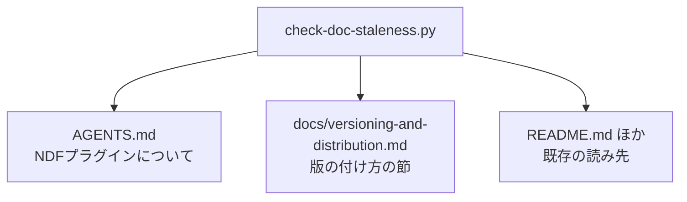

# #499: 版数の扱いを docs へ移し、AGENTS.md を定義へ戻す

要求と受け入れ条件は [issue-499-requirements.md](issue-499-requirements.md) にある。この文書は
「どう作るか」だけを扱う。

## 構成要素

| 要素 | 責務 |
| --- | --- |
| `docs/versioning-and-distribution.md`（新設） | 版数と配布の手順・実測・一覧を持つ。この主題の正本になる |
| `AGENTS.md` の「版の付け方と開発版の配布」 | 判断の基準だけを残し、詳細は正本へのリンクで渡す |
| `docs/plugin-development-guide.md` の 2 節 | 正本へのリンクへ置き換える |
| `scripts/check-doc-staleness.py` | 節の版数を読む先を正本へ向ける |
| `scripts/tests/test_doc_staleness.py` | 読む先が変わったことを固定する |

## 移す先の章立て

**読み手が問う順に並べる。** 「どのチャネルに何が載るか」を先に置き、確かめ方と一覧を後ろへ回す。

| 順 | 章 | 何を持つか |
| --- | --- | --- |
| 1 | チャネルと ref | 正式版と開発版の対応表、既定ブランチへ正式版を置く理由 |
| 2 | ランタイムごとの取得と導入 | 4 ランタイムのコマンド、登録と導入が別の操作であること |
| 3 | 開発版を試す | ref を明示した登録、Kiro と agy の clone 経由の導入 |
| 4 | 正式版を出す | `develop` から `main` への Pull Request、直接 push が拒まれる実測 |
| 5 | 版数を持つ 15 箇所 | 検査が突き合わせる箇所の表 |
| 6 | 検査に載らず手で直す箇所 | 更新案内の本文、接尾辞、変更履歴 |
| 7 | 取得元の登録を確かめる | 隔離した設定ディレクトリでの手順 |
| 8 | 利用者が過去の版へ戻る | タグへの固定、対象だけの固定 |

**500 行を超えたらディレクトリへ分ける。** `docs/versioning-and-distribution/` を作り、
`01-` から始まる連番のファイルへ章の単位で分ける（`markdown-writing` の分量の基準）。

## AGENTS.md に残すもの

**判断の基準だけを残す。** 各項目は 1〜3 行で書き、詳細は正本へのリンクで渡す。

| 残す判断 | 何行で書くか |
| --- | --- |
| チャネルを 2 つに分ける（正式版は `main`、開発版は `develop`） | 表 1 つ |
| 正式版を既定ブランチへ置く | 1 行 + 理由 1 行 |
| 接尾辞は人が読むための印である | 表 1 つ |
| 版を上げるのはまとまり単位で、Pull Request ごとには上げない | 1 行 |
| マイルストーンの名前は版数を持たない | 表 1 つ |
| 版を決めるのは `plugin.json` の `version` だけ | 1 行 |
| 同名の取得元を 2 つ登録しない | 1 行 |
| 正式版を出したらタグを打つ | 1 行 |

## 検査が読む先

`AGENTS.md` の版数は 2 箇所ある。**片方だけが移る。**

| 検査 | 読む記載 | 移動後 |
| --- | --- | --- |
| I | 「主要プラグインです（v<版>）」 | `AGENTS.md` のまま |
| J | 「版の付け方と開発版の配布」節に並ぶ版数 | 正本へ移る |

**節の見出しの語は変えない。** 検査は見出しの文字列で位置を決めるため、見出しを保てば
変更はファイルの指定だけで済む。

## 決定の記録

### 決定 1: 新しいファイルを作り、既存の開発ガイドへ足さない

`docs/plugin-development-guide.md` は 363 行で、312 行を足すと分割の基準を超える。
主題も違う。あちらは「プラグインを作る」手順であり、版と配布は「作ったものを届ける」手順で
ある。1 つの文書に入れると、どちらを読みに来たのかで要らない側を通過する。

### 決定 2: 版数の扱いの正本を新しいファイルにする

`docs/plugin-development-guide.md` の「バージョン管理」と「利用者が過去の版へ戻る」は同じ
主題を持つ。**どちらが正かが書かれていない状態を残さない。** 移した先を正本にし、開発ガイド
からはリンクで渡す。#498 が定めた「正本を決めて残りをリンクに置き換える」に従う。

### 決定 3: 検査の見出しの語を変えない

見出しを変えると、検査・移動・記述の 3 つを同時に動かすことになる。見出しを保てば、変わる
のは検査が開くファイルだけである。**同時に動かす対象を 1 つに絞る。**

### 決定 4: 節ごとの割合を機械で見る仕組みは作らない

役割から離れたことは、節の割合だけでは判定できない。判断の基準が長い文書と、手順が紛れ込んだ
文書を数字で区別できない。**分量の検査（501 行以上）は現在も働く。**

## テスト設計

| 受け入れ条件 | 何で確かめるか |
| --- | --- |
| 検査が移動後の記載を見つける | `scripts/tests/test_doc_staleness.py` に、正本の側で版数を読む場合の通過と、古い版数での失敗を置く |
| `AGENTS.md` の側の検査が残る | 「主要プラグインです（v<版>）」の検査が変わらないことを既存のテストで見る |
| 記述が失われていない | 移動の前後で、節の見出しと表の数を数えて突き合わせる |
| 分量 | `python3 scripts/check-doc-line-limit.py` |
| リンク | `python3 scripts/check-markdown-links.py --root .` |

## 未確認のまま残ること

| 項目 | 内容 |
| --- | --- |
| 移動後の正本の行数 | 移す量と開発ガイドからの統合量で決まる。500 行を超えた場合はディレクトリへ分ける |
| `CLAUDE.md` からの参照 | 版ごとの段落が `AGENTS.md` の節を指している箇所は、リンクの検査で拾う |
