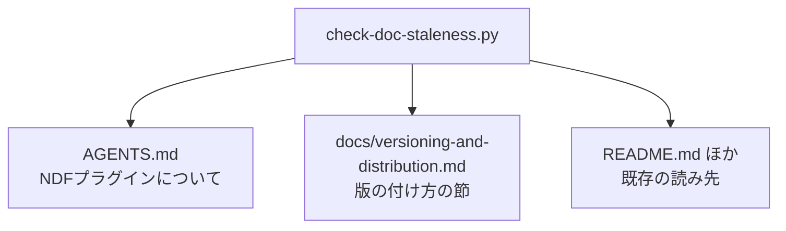

# #499: 版数の扱いを docs へ移し、AGENTS.md を定義へ戻す

要求と受け入れ条件は [issue-499-requirements.md](issue-499-requirements.md) にある。この文書は
「どう作るか」だけを扱う。

## 構成要素

| 要素 | 責務 |
| --- | --- |
| `docs/versioning-and-distribution.md`（新設） | 版数と配布の手順・実測・一覧を持つ。この主題の正本になる |
| `AGENTS.md` の「版の付け方と開発版の配布」 | 判断の基準だけを残して見出しを「版と配布の方針」へ改め、詳細は正本へのリンクで渡す |
| `docs/plugin-development-guide.md` の 2 節 | 正本へのリンクへ置き換える |
| `scripts/check-doc-staleness.py` | 検査 J の読む先・報告先・位置決めの見出しを正本へ向ける |
| `scripts/tests/test_doc_staleness.py` | 検査 J の既存テストと雛形を正本の側へ移す |
| 移した節を名前で指す参照（9 ファイル） | 正本の章を指すように張り替える（「参照を張り替える箇所」） |

## 移す先の章立て

**読み手が問う順に並べる。** 「どのチャネルに何が載るか」を先に置き、確かめ方と一覧を後ろへ回す。

| 順 | 章 | 何を持つか |
| --- | --- | --- |
| 1 | チャネルと ref | 正式版と開発版の対応表、既定ブランチへ正式版を置く理由 |
| 2 | 版の付け方と開発版の配布 | 版数の例の表（正式版・開発版・公開前の確認版）、接尾辞を付ける規則と外す時期 |
| 3 | ランタイムごとの取得と導入 | 4 ランタイムのコマンド、登録と導入が別の操作であること |
| 4 | 開発版を試す | ref を明示した登録、Kiro と agy の clone 経由の導入 |
| 5 | 正式版を出す | `develop` から `main` への Pull Request、直接 push が拒まれる実測 |
| 6 | 版数を持つ 15 箇所 | 検査が突き合わせる箇所の表 |
| 7 | 検査に載らず手で直す箇所 | 更新案内の本文、接尾辞の付け忘れ、変更履歴 |
| 8 | 取得元の登録を確かめる | 隔離した設定ディレクトリでの手順 |
| 9 | 利用者が過去の版へ戻る | タグへの固定、対象だけの固定 |

**章の見出しは `## ` で書き、章 2 が検査 J の位置決めになる。** 検査 J は見出しの文字列で
区間の始まりを決め、次の同位以上の見出しで区間を閉じる。版数の例（囲んだ版数）は章 2 の中
だけに置き、他の章へは置かない。置くと区間の外になり、走査から外れる。

**500 行を超えたらディレクトリへ分ける。** `docs/versioning-and-distribution/` を作り、
`01-` から始まる連番のファイルへ章の単位で分ける（`markdown-writing` の分量の基準）。
分けたときに検査 J が読む先がどうなるかは「検査が読む先」が持つ。

## 移動元と移動先の対応

**移す範囲は `AGENTS.md` の L32-343 である**（`### 版の付け方と開発版の配布` から
`### セキュリティ要件` の手前まで）。行は 2026-09-13 の `origin/develop`（`d068c61`、v10.10.1）の
`AGENTS.md`（478 行）を指す。2026-09-08 に書いた時点から、行数と行番号は変わっていない。
その間の差分は、L169-177 の版数の例 6 行、L392 の「主要プラグインです」の版数、L255-256 の
1 文だけである。実装の時点で `AGENTS.md` が動いていたら、この表の行を数え直してから移す。記述が失われていないことは、この表の各行に移動先があることで
確かめる。

| 移動元（`AGENTS.md` の段落） | 行 | 移動先 |
| --- | --- | --- |
| チャネルを 2 つに分ける宣言と、チャネルの表 | 34-46 | 章 1（`AGENTS.md` へは判断の表を 1 つ残す） |
| 正式版を既定ブランチへ載せる理由（登録に ref が保存されないこと） | 47-51 | 章 1（`AGENTS.md` へは 1 行 + 理由 1 行を残す） |
| clone が取得する範囲の表（fetch の refspec の実測） | 52-60 | 章 1 |
| 取得元の登録と導入が別の操作であること、正式版の登録と導入のコマンド | 62-75 | 章 3 |
| 開発版を ref 付きで登録して導入するコマンド、`update` の再起動、ref の書き方 | 77-94 | 章 4 |
| Kiro と agy の clone 経由の導入 | 96-104 | 章 4 |
| agy に入れ替えの操作が無いこと、`install` の上書きの実測 | 106-115 | 章 3 |
| `develop` から `main` への Pull Request、直接 push が拒まれる実測、`--admin` の理由、宛先が `develop` であること | 117-151 | 章 5 |
| 1 人の利用者は片方のチャネルしか持てないこと | 153-155 | 章 1 |
| 接尾辞は人が読むための印であること、チャネルを分ける役割、形の表と付け外しの規則 | 157-177 | 章 2（`AGENTS.md` へは 1 行 + 理由 1 行を残し、版数の例は書かない） |
| マイルストーンの名前は版数を持たないこと、状態の表、連番と改名の規則 | 179-195 | `AGENTS.md`（残す） |
| 版数を持つ箇所は 2 種類あること、検査が突き合わせる 15 箇所の 2 つの表、節の扱いと囲みの規則 | 197-238 | 章 6 |
| 15 箇所のうち版を決めるのは `plugin.json` の `version` だけであること | 240-242 | 章 6 |
| 検査に載らず手で直す箇所の表、機械的に置換しないこと、v9.5.0 の取りこぼし | 244-261 | 章 7 |
| 版を上げるのはまとまり単位であること | 263-264 | `AGENTS.md`（残す） |
| 同名の取得元を登録しないこと、ランタイムごとの振る舞いの表、手元での確認の 3 つ | 266-285 | 章 3（`AGENTS.md` へは 1 行を残す） |
| agy の `hooks.json` を差し込む手順 | 287-291 | 章 3 |
| 隔離した設定ディレクトリで取得元の登録を確かめる手順と注意 | 293-319 | 章 8 |
| 正式版を出したらタグを打つこと、`claude plugin tag` の実行例 | 321-329 | 章 5（`AGENTS.md` へは 1 行を残す） |
| 版を持つのは `plugin.json` だけであること（`marketplace.json` に置かない） | 331-334 | `AGENTS.md`（残す） |
| 取り消しは利用者の側の操作になること | 336-339 | 章 9 |
| サードパーティの自動更新が既定で無効であること | 341-342 | 章 4 |
| `docs/plugin-development-guide.md` の「バージョン管理」（L113-174） | - | semver の区分と接尾辞（L115-120）は章 2、`main` を進める手順と `--admin` の理由（L122-137）とタグ（L150-159）は章 5、15 箇所と `marketplace.json`（L161-169）は章 6、更新時の手順と検査が見ない範囲（L139-149, L171-173）は章 7。重複は正本へ集め、跡はリンク |
| `docs/plugin-development-guide.md` の「利用者が過去の版へ戻る」（L226-287） | - | 章 9（同上） |

**移動先が `AGENTS.md` の行は、移さずに残す判断である。** 何行で書くかは次の節が持つ。

## AGENTS.md に残すもの

**判断の基準だけを残す。** 各項目は 1〜3 行で書き、詳細は正本へのリンクで渡す。

| 残す判断 | 何行で書くか |
| --- | --- |
| チャネルを 2 つに分ける（正式版は `main`、開発版は `develop`） | 表 1 つ |
| 正式版を既定ブランチへ置く | 1 行 + 理由 1 行 |
| 接尾辞は人が読むための印である | 1 行 + 理由 1 行（版数の例は書かない） |
| 版を上げるのはまとまり単位で、Pull Request ごとには上げない | 1 行 |
| マイルストーンの名前は版数を持たない | 表 1 つ |
| 版を決めるのは `plugin.json` の `version` だけ | 1 行 |
| 同名の取得元を 2 つ登録しない | 1 行 |
| 正式版を出したらタグを打つ | 1 行 |

**ナビゲーションとして 1 行足す。** 「ドキュメント」の表へ `docs/versioning-and-distribution.md`
の行を置き、版数と配布の手順・実測・一覧がそこにあることを示す。

**残す節の見出しは「版と配布の方針」へ改める。** 「版の付け方と開発版の配布」の名前は、
版数の例と一緒に正本の章 2 へ移す。同じ名前の見出しが 2 つの文書にあると、名前で指す参照
（「参照を張り替える箇所」）がどちらを指すのか決まらない（決定 5）。

**`AGENTS.md` に囲んだ版数を残すのは「主要プラグインです（v<版>）」の 1 箇所だけにする。**
検査 J が正本へ移ると、`AGENTS.md` に残した版数の例は突き合わせの対象から外れる。外れた例は
版を上げても落ちないため、古いまま残っても気づけない。**例を残さなければ、古くなる記載が
そもそも無い。** 接尾辞の方針は「次に出す正式版の版数へ付け、正式版を出すときに外す」と
文で書き、形の一覧は正本の章 2 が持つ。

## 参照を張り替える箇所

**移した節を名前やリンクで指している箇所は、移設と同じ Pull Request で張り替える。** 張り替えないと、
リンクの検査は通っても（名前だけの参照は検査に載らない）、読み手は `AGENTS.md` に無い節を探す。
一覧は次の検索で拾った（`issues/` と `docs/development-history/` は記録のため外す）。

```bash
git grep -n '版の付け方と\|利用者が過去の版へ戻る\|検査が突き合わせる 15\|plugin-development-guide\|バージョン管理' \
  -- ':!issues/' ':!docs/development-history/' ':!docs/ndf-version-decisions.md' ':!CHANGELOG.md'
```

**`docs/ndf-version-decisions.md` と `CHANGELOG.md` を外すのは、出た版の記録だからである。**
L67・L75・L278 は当時の置き場所を書いた履歴で、置き場所が変わっても書き換えない。

| 参照元 | 行 | いまの参照 | 張り替え先 |
| --- | --- | --- | --- |
| `AGENTS.md`「Git運用ルール」 | 18 | 「版の付け方と開発版の配布」 | `AGENTS.md` の「版と配布の方針」 |
| `AGENTS.md`「ドキュメント」の表 | 382 | 開発ガイドの説明に「バージョン管理」 | 開発ガイドの説明から外し、正本の行を足す |
| `AGENTS.md`（章 6 へ移る 15 箇所の表） | 227 | `AGENTS.md` の「版の付け方と開発版の配布」節 | `docs/versioning-and-distribution.md` の「版の付け方と開発版の配布」章 |
| `AGENTS.md`（章 6 へ移る） | 232 | 「版の付け方と開発版の配布」節だけは扱いが違う | 同じ文書の章 2 を指す文 |
| `AGENTS.md`（章 9 へ移る） | 338 | `docs/plugin-development-guide.md` の「利用者が過去の版へ戻る」 | 同じ文書の章 9 |
| `SECURITY.md` | 20 | `AGENTS.md` の「版の付け方と開発版の配布」 | 正本の章 1 と章 2 |
| `README.md` | 220 | `docs/plugin-development-guide.md#利用者が過去の版へ戻る` | 正本の章 9 |
| `docs/plugin-development-guide.md`（移る 2 節の中） | 120, 134, 159, 167-169, 286 | `AGENTS.md` の節名、「`AGENTS.md` の 2 箇所」 | 移した文面では同じ文書の章を指す。167 行の数え方は「`AGENTS.md` と正本に 1 箇所ずつ」へ改める |
| `docs/plugin-development-guide.md`「ローカルテスト」（残る） | 309-310 | `AGENTS.md` の「版の付け方と開発版の配布」 | 正本の章 4 |
| `scripts/check-doc-staleness.py` | 4, 105, 383, 391, 450 | 対象の説明文書が 3 本、見出しの定数、`AGENTS.md` に書かれているとおり | 4 本、正本の章 2 の見出し、正本の章 7 |
| `scripts/check-doc-staleness.py`（`check_upgrade_heading`） | 583 | 開発ガイドのバージョン管理の手順 | 正本の章 7 |
| `docs/specifications/ndf-skill-inventory/03-version-history.md` | 184 | 版を上げる基準は `docs/plugin-development-guide.md` にある | 正本の章 2 と章 7 |
| `scripts/check-doc-staleness.py` | 114-115 | 「節の中の 10 箇所すべてが囲まれている」 | 移した時点の章 2 で数え直す（2026-09-13 に L32-198 を検査の正規表現で数えると 10 箇所で、いまは一致している。移設で章 2 に置く版数が変われば食い違う） |
| `scripts/tests/test_doc_staleness.py` / `doc_staleness_helpers.py` | 398, 445, 499-500 / 3, 66 | `AGENTS.md` の節 | 正本の雛形（「テスト設計」） |
| `scripts/tests/test_validate_manifests_version.py` | 3-4 | `AGENTS.md` の「版の付け方と開発版の配布」 | 正本の章 2 |

**参照ではない地の文は張り替えない。** `plugins/ndf/skills/release/references/form-package-plugin.md`
L198 の「利用者が過去の版へ戻るときの目印」は節を指していない。

| 検索に当たるが張り替えないもの | 理由 |
| --- | --- |
| `docs/specifications/issues-derived-specifications.md` L33 の開発ガイドへのリンク | 開発ガイドそのものは残る。節を指していない |
| 根の `README.md` L415 の見出し「バージョン管理ルール」 | 参照ではなく記載そのもの。移すかは #500 が決める |
| `AGENTS.md` L321 の「利用者が過去の版へ戻るときの目印」 | 地の文。段落ごと章 5 へ移る |
| 移す範囲の中の見出しと文（`AGENTS.md` L32・L197・L199、開発ガイド L113・L226） | 記載そのもの。「移動元と移動先の対応」が扱う |

## 検査が読む先



`AGENTS.md` の版数は 2 箇所ある。**片方だけが移る。**

| 検査 | 読む記載 | 移動後 |
| --- | --- | --- |
| I | 「主要プラグインです（v<版>）」 | `AGENTS.md` のまま |
| J | 「版の付け方と開発版の配布」節に並ぶ版数 | 正本へ移る |

**移すのはファイルの指定だけでは済まない。** `check-doc-staleness.py` は `AGENTS.md` の
本文を 1 度読み、検査 I と検査 J の両方へ同じ本文を渡している。検査 J の報告先のキーも
`AGENTS.md` に固定されている。触る箇所は次の 3 つである。

| 触る箇所 | 現在 | 移動後 |
| --- | --- | --- |
| 本文の読み取り | `AGENTS.md` を 1 度読み、I と J へ同じ本文を渡す | `AGENTS.md`（I）と正本（J）を別々に読む |
| 報告先のキー | `AGENTS.md` 固定 | 正本のパス |
| 位置決めの見出し | `### 版の付け方と開発版の配布`、終端は 3 段までの見出し | 正本の章 2 の見出し、終端はその見出しの深さから導く |

**区間の終端の実装だけは変える。** 規則は「見出しから次の同位以上の見出しまで」だが、実装は
`SECTION_HEADING = re.compile(r"^#{1,3}\s")` の固定の 3 段である。いまは位置決めが `### `
のため、固定の 3 段と「同位以上」が一致して見えるだけである。章 2 を `## ` にしたまま固定の
3 段で閉じると、章 2 の中の `### ` 小見出しで区間が切れる。そのため終端を位置決めの見出しの
深さから導く（`## ` なら `^#{1,2}\s`、分けた後の `# ` なら `^#\s`）。

| 走査の規則 | 扱い |
| --- | --- |
| 見出しから次の同位以上の見出しまでを区間にする | 規則は変えない。実装を固定の 3 段から深さ相対へ直す |
| 囲みの中の行を見出しと数えない | 変えない |
| 囲まれた版数だけを拾う | 変えない |

**分けたときも、検査 J が読むのは 1 ファイルである。** 正本が 500 行を超えて
`docs/versioning-and-distribution/` へ分かれた場合、章 2 は `02-` で始まる連番のファイル
1 つになる。検査 J の読む先はそのファイルで、位置決めはその題になる。**題は `# ` で書くため、
位置決めの語は `## ` から `# ` へ変わる。** 読む先・報告先・位置決めの 3 つを同時に動かす
のは決定 3 と同じ手である。囲んだ版数を章 2 の中だけに置く規則も、分けた後はその 1 ファイル
の中だけという意味になる。

**分けたまま検査を動かし忘れても、素通りしない。** 読む先のファイルが無ければ
「`<パス>` が無い」、区間に囲んだ版数が 1 つも無ければ「版の付け方の節の版数を読み取れない」
として落ちる。分割だけを行った状態は、検査の失敗として現れる。

## 後続の課題との境界

**#566 と #500 は、この課題の実装が入った後に別の担当が扱う。** どちらもこの Pull Request には
取り込まない。移した後にそれぞれが触る場所を、ここで固定する。


### #566（版を上げるたびに壊れる例）

**#566 が触るのは正本だけになる。** `AGENTS.md` には版数の例を置かない（「AGENTS.md に残すもの」）
ため、`AGENTS.md` は #566 の対象から外れる。

| #566 が扱う記載 | いまの場所 | 移設後の場所 |
| --- | --- | --- |
| 版の形の表（正式版・開発版・公開前の確認版） | `AGENTS.md` L167-171 | 正本の章 2 |
| 箇条書き「接尾辞は次に出す正式版の版数へ付ける」の例 | `AGENTS.md` L173 | 正本の章 2 |
| 「検査に載らず、手で直す箇所」の表 | `AGENTS.md` L244-261 | 正本の章 7 |
| 開発ガイドの「バージョン更新時の手順」（手で直す箇所と重なる） | `docs/plugin-development-guide.md` L139-155 | 正本の章 7（重複を集め、1 か所だけにする） |
| 検査 J の規則（#566 の案 3 を選んだ場合） | `scripts/check-doc-staleness.py` | 変わらない。読む先だけが正本の章 2 になる |

**この課題は文面を書き換えずに移す。** 例の値（`10.10.1` と `10.11.0-dev.1`）も、手で直す箇所の
表の 3 行も、移動前のまま章 2 と章 7 へ置く。#566 の 3 案のどれを選ぶかは #566 が決める。
正本がディレクトリへ分かれた場合は、章 2 が `02-` の、章 7 が `07-` のファイルになる。

**#566 の本文は `AGENTS.md` を場所として書いている。** この課題の実装が入った時点で、#566 の
本文の場所を正本の章 2・章 7 へ書き直す（`issue-upkeep`）。

### #500（README 22 本を規約へ合わせる）

**根の `README.md` から移す先は、主題で 2 本に分かれる。** 「プラグインを作る」主題は
`docs/plugin-development-guide.md` へ、「作ったものを届ける」主題（版・配布・戻し方）は正本へ
入る。開発ガイドの版数の節はこの課題でリンクへ置き換わるため、#500 は開発ガイドへ版と配布の
記述を戻さない。

| 根の `README.md` の節 | 行 | 移す先 |
| --- | --- | --- |
| 「開発ガイドライン」の ディレクトリ構造 / Runtime plugin の検証 / 新しいプラグインの作成手順 / 開発のベストプラクティス | 242-382 | `docs/plugin-development-guide.md`（プラグイン構造 / 新しいプラグインの追加 / 検証とテスト） |
| 「マーケットプレイス管理」の プラグインの更新 / プラグインの削除 | 385-414 | `docs/plugin-development-guide.md`（既存プラグインの更新）。版数を上げる手順の部分は正本の章 7 |
| 「マーケットプレイス管理」の バージョン管理ルール | 415-427 | 正本の章 2（semver の区分。開発ガイドから移した L115-120 と重なる） |
| 「利用方法」の 開発版を試す（開発者向け） | 141-203 | 正本の章 4 |
| 「利用方法」の 過去の版へ戻す | 204-224 | 正本の章 9 |
| 「リファレンス」 | 428-460 | #500 が決める（索引であり、この課題の移す先とは重ならない） |

**README に入口として何行を残すかは #500 が決める**（#498 の規約の適用）。この課題が README
へ触れるのは L220 のリンク 1 本だけである。

**開発ガイドの分量には余裕が少ない。** この課題で 2 節（L113-174 の 62 行と L226-287 の 62 行）
がリンクへ置き換わると、開発ガイドは 363 行から 240 行前後になる。根の「開発ガイドライン」は
223 行あり、そのまま足すと 460 行を超える。**#500 は重複を正本の側へ寄せてから足す。**
500 行を超える場合の分け方は #500 が決める。

**章 2 へ寄せるときは、古い版数を囲んで置かない。** 根の「バージョン管理ルール」の例
（`1.0.0 → 1.0.1` など）は、`` `1.0.0` `` の形へ書き換えると検査 J が現行版より古い版数として
落とす。章 2 の区間では、囲んだ版数はすべて現行版の基底以上として読まれる。区分の例は囲まずに
書くか、章 2 の外へ置く。

### 着手の順序

| 順 | 課題 | 前提 |
| --- | --- | --- |
| 1 | #499 の実装 | この設計 |
| 2 | #566 | #499 の実装が `develop` へ入っていること |
| 3 | #500 | #499 の実装が `develop` へ入っていること。#566 が先に入っていれば章 2・章 7 の衝突が無い |

**#566 と #500 は章 2 と章 7 で重なる。** #566 は章 2 の例と章 7 の表を直し、#500 は README の
「バージョン管理ルール」を章 2 へ、「プラグインの更新」の版数を上げる手順を章 7 へ寄せる。
並行して進めてもよいが、後から入る側が先の変更を取り込んでから直す。**小さい #566 を先に入れる
と、#500 は直った後の文面へ寄せるだけで済む。**

## 決定の記録

### 決定 1: 新しいファイルを作り、既存の開発ガイドへ足さない

`docs/plugin-development-guide.md` は 363 行で、312 行を足すと分割の基準を超える。
主題も違う。あちらは「プラグインを作る」手順であり、版と配布は「作ったものを届ける」手順で
ある。1 つの文書に入れると、どちらを読みに来たのかで要らない側を通過する。

### 決定 2: 版数の扱いの正本を新しいファイルにする

`docs/plugin-development-guide.md` の「バージョン管理」と「利用者が過去の版へ戻る」は同じ
主題を持つ。**どちらが正かが書かれていない状態を残さない。** 移した先を正本にし、開発ガイド
からはリンクで渡す。#498 が定めた「正本を決めて残りをリンクに置き換える」に従う。

### 決定 3: 検査 J は読む先・報告先・見出しの 3 つを同時に動かす

検査 I（`AGENTS.md` に残る）と検査 J（正本へ移る）は同じ本文を共有しているため、**2 つが
別のファイルを見る時点で読み取りを分ける。** 報告先のキーを据え置くと、正本の記載が古い
ことを `AGENTS.md` の失敗として報告する。位置決めの見出しは、正本では章の見出しになる。

代わりに走査の規則（区間の取り方、囲みの扱い、囲まれた版数だけを拾うこと）は据え置く。
**動かす対象を「どこを読むか」に閉じ、「どう読むか」は変えない。** 例外は区間の終端の実装で、
固定の 3 段を位置決めの見出しの深さへ合わせる。規則の文面（同位以上で閉じる）は変わらず、
位置決めが `### ` でなくなると固定の 3 段が規則から外れるためである。

### 決定 4: 節ごとの割合を機械で見る仕組みは作らない

役割から離れたことは、節の割合だけでは判定できない。判断の基準が長い文書と、手順が紛れ込んだ
文書を数字で区別できない。**分量の検査（501 行以上）は現在も働く。**

### 決定 5: `AGENTS.md` に残す節の見出しを改める

「版の付け方と開発版の配布」は、版数の例と接尾辞の規則を持つ節の名前である。例を正本へ移す
ため、名前も正本の章 2 へ移す。`AGENTS.md` に同じ名前を残すと、`SECURITY.md` や開発ガイドが
名前で指す参照がどちらの文書を指すのか決まらない。**同じ見出しは 1 つの文書にだけ置く。**

### 決定 6: 移す文面は書き換えず、#566 と #500 を後に回す

移設と書き換えを同じ Pull Request に入れると、「記述が失われていない」ことを移動の前後の
突き合わせだけで確かめられなくなる。**この課題は場所を動かし、重複を 1 か所へ寄せるまでにとどめる。** 版数の例の値と「手で直す
箇所」の表の行は足さず、変えない。例の直し（#566）と
README の移設（#500）は、移った後の場所を前提に別の Pull Request で行う。境界は
「後続の課題との境界」が持つ。

## テスト設計

| 受け入れ条件 | 何で確かめるか |
| --- | --- |
| 検査が移動後の記載を見つける | 検査 J の既存テストを正本の側へ移し、正本で版数を読む場合の通過と、古い版数での失敗を見る |
| `AGENTS.md` の側の検査が残る | 「主要プラグインです（v<版>）」の検査が変わらないことを既存のテストで見る |
| 報告先が正本を指す | 検査 J が落ちたときの出力に正本のパスが出ることを見る |
| 記述が失われていない | 移動の前後で、表の数と、「移動元と移動先の対応」の各行に移動先があることを突き合わせる |
| 分量 | `python3 scripts/check-doc-line-limit.py` |
| リンク | `python3 scripts/check-markdown-links.py --root .` |

**既存のテストは追加ではなく移設になる。** 検査 J のテストは `scripts/tests/test_doc_staleness.py`
の「J」の節に 11 個ある。いずれも `agents_md()` の補助と、`scripts/tests/doc_staleness_helpers.py`
の `AGENTS_MD` の雛形に依存する。移設で触るのは次の 3 つである。

| 触る箇所 | 何をするか |
| --- | --- |
| 雛形 | `docs/versioning-and-distribution.md` の雛形を足し、版の付け方の節をそちらへ移す。`AGENTS.md` の雛形からは囲んだ版数を外す |
| 補助 | `agents_md()` に対応する正本の補助を足し、J の 11 個をそちらへ向ける |
| 版を上げる補助 | `doc_staleness_helpers.py` の `retarget_version`（L205）が `AGENTS.md` の版数の例を書き換えている箇所を、正本の側へ移す |

**区間の外を見るテストは、正本の側に新しく足す。** 既存の `test_versions_outside_the_section_do_not_fail`
は J 専用ではない。`AGENTS.md` の雛形の変更履歴（`v8.5.4` / `8.4.0`）に加え、根の `README.md`
の雛形（`### NDF v9.0.0`、`v4.0.0`）も同じテストで見ている。移すと根の `README.md` の誤検出の
守りが失われるため、既存のテストはそのまま残す。そのうえで、正本の雛形の章 2 より後ろの章へ
囲んだ古い版数を置き、それで落ちないことを見るテストを足す。

**章 2 の小見出しで区間が切れないことのテストも足す。** 正本の雛形の章 2 に `### ` の小見出しを
置き、その後ろの古い版数が検査 J で落ちることを見る。終端を深さ相対へ直した分を固定する。

**文書が無いことのテストも正本の側へ足す。** `test_missing_agents_md_fails` は検査 I のために
残し、正本を消したときに正本のパスが出力へ出ることを見るテストを足す。

## 未確認のまま残ること

| 項目 | 内容 |
| --- | --- |
| 移動後の正本の行数 | 移す量と開発ガイドからの統合量で決まる。500 行を超えた場合はディレクトリへ分ける |
| 移設時点の参照の数 | 「参照を張り替える箇所」は 2026-09-13 の検索結果である。実装の時点で同じ検索をやり直し、増えた行を張り替える |
| #500 の後の開発ガイドの行数 | 240 行前後は差し引きの見積で、#500 がどれだけ重複を寄せるかで決まる。この課題では決めない |
