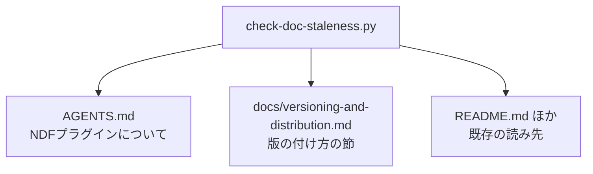

# #499: 版数の扱いを docs へ移し、AGENTS.md を定義へ戻す

要求と受け入れ条件は [issue-499-requirements.md](issue-499-requirements.md) にある。この文書は
「どう作るか」だけを扱う。

## 構成要素

| 要素 | 責務 |
| --- | --- |
| `docs/versioning-and-distribution.md`（新設） | 版数と配布の手順・実測・一覧を持つ。この主題の正本になる |
| `AGENTS.md` の「版の付け方と開発版の配布」 | 判断の基準だけを残し、詳細は正本へのリンクで渡す |
| `docs/plugin-development-guide.md` の 2 節 | 正本へのリンクへ置き換える |
| `scripts/check-doc-staleness.py` | 検査 J の読む先・報告先・位置決めの見出しを正本へ向ける |
| `scripts/tests/test_doc_staleness.py` | 検査 J の既存テストと雛形を正本の側へ移す |

## 移す先の章立て

**読み手が問う順に並べる。** 「どのチャネルに何が載るか」を先に置き、確かめ方と一覧を後ろへ回す。

| 順 | 章 | 何を持つか |
| --- | --- | --- |
| 1 | チャネルと ref | 正式版と開発版の対応表、既定ブランチへ正式版を置く理由 |
| 2 | 版の付け方と開発版の配布 | 版数の例の表（正式版・開発版・公開前の確認版）、接尾辞を付ける規則と外す時期 |
| 3 | ランタイムごとの取得と導入 | 4 ランタイムのコマンド、登録と導入が別の操作であること |
| 4 | 開発版を試す | ref を明示した登録、Kiro と agy の clone 経由の導入 |
| 5 | 正式版を出す | `develop` から `main` への Pull Request、直接 push が拒まれる実測 |
| 6 | 版数を持つ 15 箇所 | 検査が突き合わせる箇所の表 |
| 7 | 検査に載らず手で直す箇所 | 更新案内の本文、接尾辞の付け忘れ、変更履歴 |
| 8 | 取得元の登録を確かめる | 隔離した設定ディレクトリでの手順 |
| 9 | 利用者が過去の版へ戻る | タグへの固定、対象だけの固定 |

**章の見出しは `## ` で書き、章 2 が検査 J の位置決めになる。** 検査 J は見出しの文字列で
区間の始まりを決め、次の同位以上の見出しで区間を閉じる。版数の例（囲んだ版数）は章 2 の中
だけに置き、他の章へは置かない。置くと区間の外になり、走査から外れる。

**500 行を超えたらディレクトリへ分ける。** `docs/versioning-and-distribution/` を作り、
`01-` から始まる連番のファイルへ章の単位で分ける（`markdown-writing` の分量の基準）。

## AGENTS.md に残すもの

**判断の基準だけを残す。** 各項目は 1〜3 行で書き、詳細は正本へのリンクで渡す。

| 残す判断 | 何行で書くか |
| --- | --- |
| チャネルを 2 つに分ける（正式版は `main`、開発版は `develop`） | 表 1 つ |
| 正式版を既定ブランチへ置く | 1 行 + 理由 1 行 |
| 接尾辞は人が読むための印である | 1 行 + 理由 1 行（版数の例は書かない） |
| 版を上げるのはまとまり単位で、Pull Request ごとには上げない | 1 行 |
| マイルストーンの名前は版数を持たない | 表 1 つ |
| 版を決めるのは `plugin.json` の `version` だけ | 1 行 |
| 同名の取得元を 2 つ登録しない | 1 行 |
| 正式版を出したらタグを打つ | 1 行 |

**`AGENTS.md` に囲んだ版数を残すのは「主要プラグインです（v<版>）」の 1 箇所だけにする。**
検査 J が正本へ移ると、`AGENTS.md` に残した版数の例は突き合わせの対象から外れる。外れた例は
版を上げても落ちないため、古いまま残っても気づけない。**例を残さなければ、古くなる記載が
そもそも無い。** 接尾辞の方針は「次に出す正式版の版数へ付け、正式版を出すときに外す」と
文で書き、形の一覧は正本の章 2 が持つ。

## 検査が読む先

`AGENTS.md` の版数は 2 箇所ある。**片方だけが移る。**

| 検査 | 読む記載 | 移動後 |
| --- | --- | --- |
| I | 「主要プラグインです（v<版>）」 | `AGENTS.md` のまま |
| J | 「版の付け方と開発版の配布」節に並ぶ版数 | 正本へ移る |

**移すのはファイルの指定だけでは済まない。** `check-doc-staleness.py` は `AGENTS.md` の
本文を 1 度読み、検査 I と検査 J の両方へ同じ本文を渡している。検査 J の報告先のキーも
`AGENTS.md` に固定されている。触る箇所は次の 3 つである。

| 触る箇所 | 現在 | 移動後 |
| --- | --- | --- |
| 本文の読み取り | `AGENTS.md` を 1 度読み、I と J へ同じ本文を渡す | `AGENTS.md`（I）と正本（J）を別々に読む |
| 報告先のキー | `AGENTS.md` 固定 | 正本のパス |
| 位置決めの見出し | `### 版の付け方と開発版の配布`、終端は 3 段までの見出し | 正本の章 2 の見出し、終端はその見出しの深さから導く |

**走査の規則は変えない。** 見出しから次の同位以上の見出しまでを区間にすること、囲みの中の
行を見出しと数えないこと、囲まれた版数だけを拾うことは現在のままにする。

## 決定の記録

### 決定 1: 新しいファイルを作り、既存の開発ガイドへ足さない

`docs/plugin-development-guide.md` は 363 行で、312 行を足すと分割の基準を超える。
主題も違う。あちらは「プラグインを作る」手順であり、版と配布は「作ったものを届ける」手順で
ある。1 つの文書に入れると、どちらを読みに来たのかで要らない側を通過する。

### 決定 2: 版数の扱いの正本を新しいファイルにする

`docs/plugin-development-guide.md` の「バージョン管理」と「利用者が過去の版へ戻る」は同じ
主題を持つ。**どちらが正かが書かれていない状態を残さない。** 移した先を正本にし、開発ガイド
からはリンクで渡す。#498 が定めた「正本を決めて残りをリンクに置き換える」に従う。

### 決定 3: 検査 J は読む先・報告先・見出しの 3 つを同時に動かす

検査 I（`AGENTS.md` に残る）と検査 J（正本へ移る）は同じ本文を共有しているため、**2 つが
別のファイルを見る時点で読み取りを分ける。** 報告先のキーを据え置くと、正本の記載が古い
ことを `AGENTS.md` の失敗として報告する。位置決めの見出しは、正本では章の見出しになる。

代わりに走査の規則（区間の取り方、囲みの扱い、囲まれた版数だけを拾うこと）は据え置く。
**動かす対象を「どこを読むか」に閉じ、「どう読むか」は変えない。**

### 決定 4: 節ごとの割合を機械で見る仕組みは作らない

役割から離れたことは、節の割合だけでは判定できない。判断の基準が長い文書と、手順が紛れ込んだ
文書を数字で区別できない。**分量の検査（501 行以上）は現在も働く。**

## テスト設計

| 受け入れ条件 | 何で確かめるか |
| --- | --- |
| 検査が移動後の記載を見つける | 検査 J の既存テストを正本の側へ移し、正本で版数を読む場合の通過と、古い版数での失敗を見る |
| `AGENTS.md` の側の検査が残る | 「主要プラグインです（v<版>）」の検査が変わらないことを既存のテストで見る |
| 報告先が正本を指す | 検査 J が落ちたときの出力に正本のパスが出ることを見る |
| 記述が失われていない | 移動の前後で、表の数と、章立ての対応表が指す移動先の有無を突き合わせる |
| 分量 | `python3 scripts/check-doc-line-limit.py` |
| リンク | `python3 scripts/check-markdown-links.py --root .` |

**既存のテストは追加ではなく移設になる。** 検査 J のテストは `scripts/tests/test_doc_staleness.py`
の「J」の節に 11 個あり、いずれも `agents_md()` の補助と
`scripts/tests/doc_staleness_helpers.py` の `AGENTS_MD` の雛形に依存する。移設で触るのは
次の 3 つである。

| 触る箇所 | 何をするか |
| --- | --- |
| 雛形 | `docs/versioning-and-distribution.md` の雛形を足し、版の付け方の節をそちらへ移す。`AGENTS.md` の雛形からは囲んだ版数を外す |
| 補助 | `agents_md()` に対応する正本の補助を足し、J の 11 個をそちらへ向ける |
| 版を上げる補助 | `bump_all_versions` が `AGENTS.md` の版数の例を書き換えている箇所を、正本の側へ移す |

`AGENTS.md` の雛形に残る変更履歴の版数は動かさない。区間の外にある版数を拾わないことを
見るテストは、移設の後もそのまま働く。

## 未確認のまま残ること

| 項目 | 内容 |
| --- | --- |
| 移動後の正本の行数 | 移す量と開発ガイドからの統合量で決まる。500 行を超えた場合はディレクトリへ分ける |
| `CLAUDE.md` からの参照 | 版ごとの段落が `AGENTS.md` の節を指している箇所は、リンクの検査で拾う |
